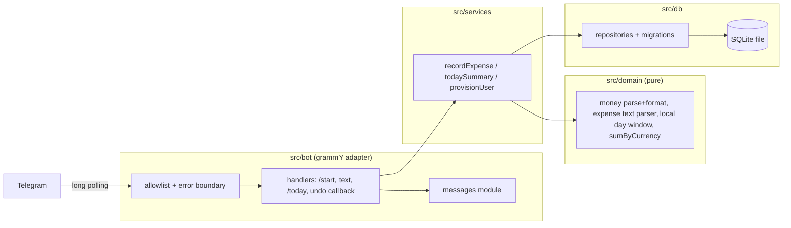
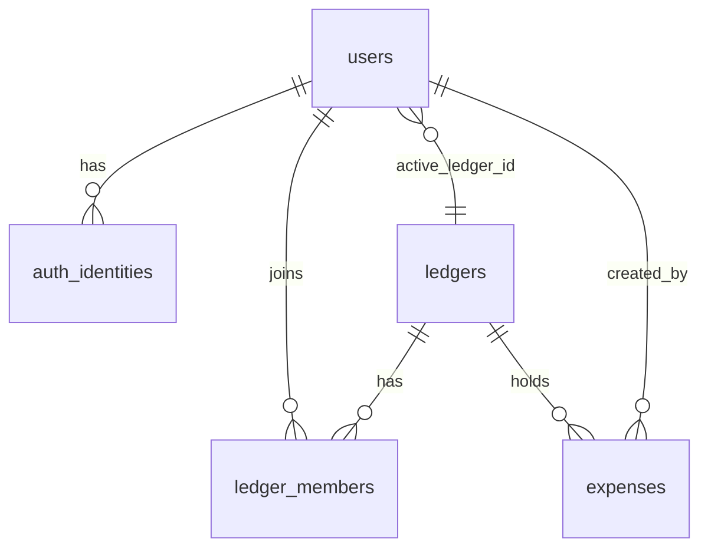

# 0001: Scaffold and walking skeleton: record "450 coffee", see it in /today

> **Status:** approved
> **Created:** 2026-09-29
> **Related ADRs:** [ADR-0001](../adrs/0001-tech-stack.md), [ADR-0002](../adrs/0002-ledgers-and-identity.md), [ADR-0003](../adrs/0003-currency-conversion-at-report-time.md), [ADR-0004](../adrs/0004-amount-parsing-rule.md)

## TL;DR

We stand up the repository and a running bot, locally via `pnpm dev`. Tooling, layer-boundary
lint and the ledger-shaped schema all exist from the first commit. In Telegram, an allowlisted
user sends `/start` and gets a personal ledger. They send `450 coffee` and get
`Recorded 450.00 RSD "coffee" in Personal [Undo]`. `/today` answers with today's totals per
currency, computed in the user's timezone. Receipts, SMS, FX, shared ledgers, export and
encryption build on this skeleton in later plans.

## Context & problem

The repository holds only docs and harness. Every later feature (fiscal QR receipts, bank SMS,
exports, FX, optional encryption, shared ledgers) needs the same foundation. That foundation is a
money module that cannot misread `1.200`, a schema where expenses belong to ledgers (ADR-0002),
timezone-correct day windows, and idempotent recording. Getting these wrong later means migrating
real financial history, so they land first, behind one thin end-to-end path.

## Decision

The skeleton follows ADR-0001's stack. It uses the layered layout from `project-context.md`
(`src/domain`, `src/db`, `src/services`, `src/bot`, `src/index.ts`), enforced by ESLint
`no-restricted-imports`. The first migration creates `users` (with `timezone`), `auth_identities`,
`ledgers`, `ledger_members` and `expenses`. `/start` provisions a user and their personal ledger.
Free text of the form `<amount> [CUR] <description>` records an expense into the **active
ledger** (ADR-0002) using the ADR-0004 parse rule, idempotently per Telegram message. An Undo
button soft-deletes the expense. `/today` sums the active ledger's non-deleted expenses for the
user's local day **in domain code**, grouped by currency: FX is a later plan (ADR-0003).

We rejected "tooling-only first, features later" because a scaffold nobody can see in Telegram
hides integration mistakes. We rejected including Docker/CI deploy because it adds a `human` VPS
phase to a plan whose point is the local loop. Deploy is the next plan.

## Architecture diagram



## Implementation phases

Each phase ships as its own commit. `dev` implements all `dev` phases in one session. The architect
reviews once at the end, in a fresh session.

### Phase 1: Tooling and a bot that answers /start
- **Owner skill:** dev
- **What:** The repo scaffold per ADR-0001, plus a grammY long-polling bot that enforces the
  allowlist, has a top-level error boundary, and answers `/start` from the messages module. No
  storage yet.
- **Files touched:** `package.json`, `pnpm-lock.yaml`, `pnpm-workspace.yaml`, `.nvmrc`,
  `tsconfig.json`, `eslint.config.js`, `.prettierrc`, `vitest.config.ts`, `.husky/pre-commit`,
  `.env.example`, `README.md`, `src/index.ts`, `src/config.ts`, `src/config.test.ts`,
  `src/bot/bot.ts`, `src/bot/messages.ts`, `src/bot/middleware/allowlist.ts`,
  `src/bot/middleware/allowlist.test.ts`, `CLAUDE.md` (stack note + "Where things live" `src/`
  tree).
- **Done when:**
  - `pnpm typecheck`, `pnpm lint` and `pnpm test` all exit 0, and the husky pre-commit runs them.
  - `pnpm-workspace.yaml` has `minimumReleaseAge: 10080`, and `allowBuilds` names only
    `better-sqlite3` and `esbuild`. All direct deps are exact-pinned. The log records the
    `better-sqlite3` version and confirms it installs on Node 24 (the ADR-0001 unverified claim).
  - Config parsing with `BOT_TOKEN` unset throws an error whose message names `BOT_TOKEN`. A test
    asserts the variable name appears in the message.
  - ESLint rejects importing `grammy` from `src/domain/`, `src/services/` or `src/db/`, and
    `node:fs`/`process` from `src/domain/`. The log notes that this was demonstrated once with a
    throwaway file.
  - An update from a Telegram id not in `ALLOWED_TELEGRAM_IDS` reaches no handler: the test's
    handler spy has zero calls. An allowlisted `/start` gets the messages-module greeting.
  - A handler that throws results in exactly one generic apology reply and a log line with the
    update id and no message text.

### Phase 2: Domain: money, expense text, local days, sums
- **Owner skill:** dev
- **What:** Pure, framework-free domain functions with table tests: amount parse and format
  (ADR-0004), expense-text parse, local date of an instant, local-day UTC window, and sum by
  currency.
- **Files touched:** `src/domain/money.ts`, `src/domain/money.test.ts`,
  `src/domain/currencies.ts`, `src/domain/expenseText.ts`, `src/domain/expenseText.test.ts`,
  `src/domain/time.ts`, `src/domain/time.test.ts`, `src/domain/aggregate.ts`,
  `src/domain/aggregate.test.ts`.
- **Done when:** (currency RSD, exponent 2, unless stated)
  - `450` → 45000. `12,50` → 1250. `12.5` → 1250. `1 200` (also with NBSP) → 120000.
  - `1,200` and `1.200` → `ambiguous`, with readings 120000 (thousands) and 120 (decimal).
  - Parse failures: `1.200,50`, `12.5055`, `0`, `-5`, `1 20` (group not of 3).
  - Expense text: `450 coffee` with ledger default RSD → `{ amountMinor: 45000, currency: 'RSD',
    description: 'coffee' }`. `12.50 eur taxi` → `{ 1250, 'EUR', 'taxi' }` (code matched
    case-insensitively against `currencies.ts`). `12 XYZ taxi` → `{ 1200, 'RSD', 'XYZ taxi' }`
    (unknown code is description). `coffee 450` → not an expense.
  - Formatting: 46250 RSD → `462.50 RSD`. 120000 RSD → `1 200.00 RSD`.
  - Local date: instant `2026-09-29T22:30:00Z` → `2026-09-30` in `Europe/Belgrade` (CEST, UTC+2)
    and `2026-09-29` in `Etc/UTC`.
  - Local-day window for `2026-10-25` in `Europe/Belgrade` (EU DST ends that day) is
    `[2026-10-24T22:00:00Z, 2026-10-25T23:00:00Z)`, which is 25 hours.
  - `sumByCurrency` over 45000 RSD, 1250 RSD, 1250 EUR → `{ RSD: 46250, EUR: 1250 }`, integer
    arithmetic only. No `parseFloat`, `toFixed` or `* 100` anywhere in `src/`.
  - Domain functions take `now`/instants as parameters, and there are no `new Date()` calls in
    `src/domain/`.

### Phase 3: Storage and idempotent recording
- **Owner skill:** dev
- **What:** SQLite connection, forward-only migrations run at boot, repositories, `/start`
  provisioning, recording free-text expenses into the active ledger, and the Undo button.
- **Files touched:** `src/db/connection.ts`, `src/db/migrations/0001_init.sql`,
  `src/db/migrate.ts`, `src/db/users.ts`, `src/db/ledgers.ts`, `src/db/expenses.ts`,
  `src/db/*.test.ts`, `src/services/provisionUser.ts`, `src/services/recordExpense.ts`,
  `src/services/*.test.ts`, `src/bot/handlers/start.ts`, `src/bot/handlers/text.ts`,
  `src/bot/handlers/undo.ts`, `src/bot/callbackData.ts`, `src/bot/messages.ts`, `src/index.ts`.
- **Done when:**
  - Connection sets WAL, `busy_timeout`, and `foreign_keys = ON`. Migrations are recorded in
    `schema_migrations` and applied once, and running boot twice applies nothing new.
  - The first `/start` from a new id creates exactly 1 `users` row (timezone = `DEFAULT_TIMEZONE`),
    1 `auth_identities` row, 1 `personal` ledger (`default_currency` = `DEFAULT_CURRENCY`), 1
    membership, and sets `active_ledger_id`. A second `/start` leaves every count at 1.
  - `450 coffee` stores one row with `amount_minor = 45000`, `currency = 'RSD'`, and the reply
    names the ledger (`Personal`).
  - Delivering the same message twice (same chat id + message id) leaves exactly 1 row. The
    second delivery re-sends the confirmation for the existing expense.
  - `occurred_at` is the Telegram message date, not the processing time. A message dated
    `2026-09-29T21:50:00Z` processed at clock `2026-09-29T22:10:00Z` for a `Europe/Belgrade`
    user stores `occurred_on = '2026-09-29'`.
  - Undo sets `deleted_at`. A second tap answers the callback with "already undone" and leaves
    `deleted_at` unchanged. A tap from a user who isn't the expense's creator is refused.
    `callback_data` is `exp:undo:<uuid>` (9 + 36 = 45 bytes), and `assertCallbackData` throws
    above 64.
  - `1.200 lunch` records nothing and replies with both readings (`1 200.00 RSD` or
    `1.20 RSD`), asking the user to resend as `1200` or `1.2`. Non-expense text gets the help
    hint.
  - User B's today-listing never contains user A's personal-ledger expenses (repository test).
  - No info-level log line contains an amount or description (a test captures pino output at
    `info` for a recorded expense and asserts that neither `450` nor `coffee` appears).

### Phase 4: /today
- **Owner skill:** dev
- **What:** `/today` sums the active ledger's non-deleted expenses whose `occurred_on` equals the
  user's current local date, grouped by currency.
- **Files touched:** `src/services/todaySummary.ts`, `src/services/todaySummary.test.ts`,
  `src/bot/handlers/today.ts`, `src/bot/messages.ts`.
- **Done when:**
  - For a `Europe/Belgrade` user at clock `2026-09-30T10:00:00Z`, the ledger holds: 45000 RSD
    "coffee" at `2026-09-29T22:30:00Z` (00:30 local on the 30th), 1250 RSD at
    `2026-09-30T08:00:00Z`, 1250 EUR at `2026-09-30T09:00:00Z`, 10000 RSD at
    `2026-09-29T21:30:00Z` (23:30 local on the 29th), and 5000 RSD today but undone. `/today`
    shows exactly `462.50 RSD` and `12.50 EUR` (45000 + 1250 = 46250 RSD). The 10000 RSD is the
    previous local day and the 5000 RSD is deleted.
  - An empty day replies with the messages-module "nothing recorded today" text.
  - Summation happens in `aggregate.ts` (domain), and there is no `SUM(` in `src/db/` (ADR-0002).

### Phase 5: Create the bot and smoke-test locally
- **Owner skill:** human
- **What:** Create the bot with BotFather, fill `.env` from `.env.example` (token, your Telegram
  id, `DEFAULT_TIMEZONE`, `DEFAULT_CURRENCY`), run `pnpm dev`, and try the loop.
- **Files touched:** `.env` (local, gitignored)
- **Done when:** In Telegram: `/start` greets. `450 coffee` confirms in Personal with an Undo
  button. `/today` shows `450.00 <your currency>`. Tapping Undo, then `/today`, shows nothing
  recorded. Restarting `pnpm dev` doesn't duplicate anything.

## Data shapes



```sql
-- illustrative
CREATE TABLE users (
  id TEXT PRIMARY KEY,                 -- UUID
  timezone TEXT NOT NULL,              -- IANA, e.g. 'Europe/Belgrade'
  active_ledger_id TEXT REFERENCES ledgers(id),
  created_at TEXT NOT NULL             -- ISO-8601 UTC, ms, 'Z'
);
CREATE TABLE auth_identities (
  provider TEXT NOT NULL,              -- 'telegram'
  external_id TEXT NOT NULL,           -- Telegram user id as TEXT
  user_id TEXT NOT NULL REFERENCES users(id),
  PRIMARY KEY (provider, external_id)
);
CREATE TABLE ledgers (
  id TEXT PRIMARY KEY,
  kind TEXT NOT NULL CHECK (kind IN ('personal','shared')),
  name TEXT NOT NULL,
  default_currency TEXT NOT NULL,      -- ISO-4217
  owner_user_id TEXT NOT NULL REFERENCES users(id),
  created_at TEXT NOT NULL
);
CREATE UNIQUE INDEX one_personal_ledger ON ledgers(owner_user_id) WHERE kind = 'personal';
CREATE TABLE ledger_members (
  ledger_id TEXT NOT NULL REFERENCES ledgers(id),
  user_id TEXT NOT NULL REFERENCES users(id),
  role TEXT NOT NULL CHECK (role IN ('owner','member')),
  PRIMARY KEY (ledger_id, user_id)
);
CREATE TABLE expenses (
  id TEXT PRIMARY KEY,
  ledger_id TEXT NOT NULL REFERENCES ledgers(id),
  created_by TEXT NOT NULL REFERENCES users(id),
  amount_minor INTEGER NOT NULL CHECK (amount_minor > 0),
  currency TEXT NOT NULL,
  description TEXT NOT NULL,
  occurred_at TEXT NOT NULL,           -- UTC instant (Telegram message date)
  occurred_on TEXT NOT NULL,           -- YYYY-MM-DD in the author's timezone at record time
  source_key TEXT NOT NULL UNIQUE,     -- opaque, built by the adapter: 'tg:<chat_id>:<message_id>'
  created_at TEXT NOT NULL,
  deleted_at TEXT
);
CREATE INDEX expenses_ledger_day ON expenses(ledger_id, occurred_on);
```

`source_key` is deliberately opaque to the domain. Receipt and SMS plans derive their own keys
(for example, the fiscal receipt id), which also dedupes the same receipt scanned twice.

Callback data: `exp:undo:<expenseId>` (`<scope>:<action>:<arg>`).

Env: `BOT_TOKEN`, `ALLOWED_TELEGRAM_IDS` (comma-separated), `DEFAULT_TIMEZONE`,
`DEFAULT_CURRENCY`, `DATABASE_PATH` (default `./data/bot.sqlite`), `LOG_LEVEL`.

## Risks & open questions

- **Money:** an ADR-0004 bug is a thousand-fold error. The Phase 2 table is the defence. Read its
  assertions at review, not its pass count.
- **Time:** `occurred_on` is frozen at record time in the author's timezone. If a user changes
  timezone later, old rows keep their original local date. That's intended (ADR-0002).
- **Idempotency:** `source_key` UNIQUE with insert-or-return-existing covers redelivery. Edited
  messages (`edited_message`) are ignored in this plan. Editing an expense by editing the message
  is a later decision.
- **Privacy:** the allowlist is the only access control until open signup. Logs carry ids only.
- **Output format:** amounts render as `1 200.00 RSD` (space grouping, dot decimal) for every
  user. Localised output is an open question for the settings plan.
- **Open:** `DEFAULT_TIMEZONE` and `DEFAULT_CURRENCY` come from env until a settings flow exists.
  That's fine for the family, but not for open signup.

## What this plan does NOT do

Intended order of the next plans. They're not numbered yet, and each gets its own interview:

1. **Deploy:** Dockerfile, Compose, GitHub Actions check + SSH deploy, DB backups (includes a
   `human` VPS phase).
2. **Categories, edit, past dates and summaries:** categories with auto-suggest, `taxi
   yesterday`, edit flow, and `/week`, `/month` and per-category views. Settings for timezone
   and currencies.
3. **Shared ledgers:** create/invite/join, `/ledger` toggle, and "move to…" button (ADR-0002).
4. **FX conversion:** rate source ADR (must cover RUB, KZT, RSD, EUR, see ADR-0003), `fx_rates`
   job, home currency, converted totals.
5. **Fiscal QR receipts:** photo → QR decode → per-country fetchers (RS, ME, KZ, RU first), line
   items, dedupe by receipt id. Library ADR (QR/image decoding).
6. **Bank SMS:** per-bank regex templates, one pure parser per bank, synthetic fixtures only.
7. **Export:** CSV and XLSX documents in chat (XLSX library ADR).
8. **Optional personal-ledger encryption:** generated user-held key, lock/unlock session,
   column-level ciphertext (crypto design ADR, scoped by ADR-0002).
9. **Open signup hardening:** onboarding, rate limits, privacy policy.

## Implementation log

> Written by `dev`: one row per phase as its commit lands, then the close block. **The phases
> above are the contract. This section records what happened.** Observations, never conclusions:
> no pass list, no self-assessment. Deviations and unmet done-whens are **always** disclosed.
> Keep it shorter than `## Implementation phases`.

| phase | owner | state | commit |
|---|---|---|---|
| 1: Tooling and a bot that answers /start | dev | not started | |
| 2: Domain: money, expense text, local days, sums | dev | not started | |
| 3: Storage and idempotent recording | dev | not started | |
| 4: /today | dev | not started | |
| 5: Create the bot and smoke-test locally | human | not started | |

### Notes

_(Deviations from the plan, with the commit, stated without justification. Done-whens not
satisfiable as stated, and what was done instead. Followups noticed and not acted on. One line
each. Empty is fine.)_

### Close triggers

_(Facts for the architect. No recommendations, and no suggested version bump.)_

- **What shipped:** feature / fix-only / docs-chore-only
- **User-visible surface changed:** commands, messages, config/env keys, schema migrations (list them, or none)
- **Gate at the tip:** the commands run (typecheck, lint, full test suite), exit codes, test counts
- **Outstanding `human` phases:** which, or none

## Followups

- Version: `package.json` starts at `0.1.0`. The close ceremony decides the first bump.
