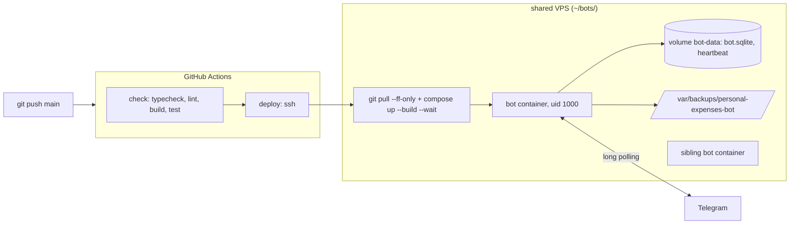

# 0002: Deploy: Docker Compose on the shared VPS, CI gate, daily SQLite backups

> **Status:** approved
> **Created:** 2026-09-29
> **Related ADRs:** [ADR-0001](../adrs/0001-tech-stack.md), [ADR-0006](../adrs/0006-production-runs-compiled-js.md)

## TL;DR

The bot runs 24/7 on the VPS that already hosts `traditional-medicine-notifier-bot`, deployed the
same way: a multi-stage Docker image of compiled JS (ADR-0006), a Compose service with a
heartbeat-file health check, and a GitHub Actions `check` job. A push to `main` then deploys over
SSH (`git pull --ff-only && docker compose up -d --build --wait`). The live SQLite file is
backed up at boot and every 24 hours into a host directory, keeping 14 days. The first visible
result: the user pushes to `main`, and a few minutes later `/today` answers from the VPS while
their laptop is closed.

## Context & problem

Plan 0001 runs only under `pnpm dev` on a laptop. A family expense bot that's asleep when the
laptop is closed loses expenses, and a single SQLite file with no backup is one disk failure away
from losing all history. The sibling bot's scaffold on the same VPS is proven. Diverging from it
would mean running two different operational models on one server.

## Decision

Mirror the sibling's scaffold (`Dockerfile`, `docker-compose.yml`, `.github/workflows/deploy.yml`,
`services/db-backup.ts`, heartbeat in `index.ts`), with four tightenings this repo's rules require:

- the base image is pinned **by digest**, which the sibling left as a TODO;
- the deploy waits for health with `--wait`, so a container that never becomes healthy fails the
  workflow instead of reporting green;
- GitHub Actions are pinned by commit SHA (supply chain, ADR-0001);
- backup filenames use the UTC date and rotate by name, not mtime, so rotation is deterministic
  in tests.

We rejected building the image in CI and pushing it to GHCR, because it adds a registry and
credentials for no gain on a one-server setup the sibling already runs with on-host builds. We
rejected `node-cron` for a single daily job, because `setInterval` plus a boot run is enough and
avoids a dependency. The FX plan can revisit scheduling when it needs clock-aligned jobs.

## Architecture diagram



## Implementation phases

Each phase ships as its own commit. `dev` implements all `dev` phases in one session. The
architect reviews once at the end, in a fresh session.

### Phase 1: The bot runs from a Docker image of compiled JS
- **Owner skill:** dev
- **What:** `pnpm build` per ADR-0006, a production `pnpm start`, a heartbeat file written
  once polling has started, graceful shutdown, and a multi-stage Dockerfile and Compose file
  modelled on the sibling's.
- **Files touched:** `package.json` (`build`, `start`), `tsconfig.build.json`, `Dockerfile`,
  `.dockerignore`, `docker-compose.yml`, `src/index.ts`, `src/heartbeat.ts`,
  `src/heartbeat.test.ts`, `.env.example`, `README.md` (run-in-Docker section), `CLAUDE.md`
  ("Where things live": `Dockerfile`, `docker-compose.yml`).
- **Done when:**
  - `pnpm build` exits 0 and produces `dist/index.js` and `dist/db/migrations/0001_init.sql`.
    `dist/` contains no `*.test.js`.
  - The boot log line `migrations checked` also carries `node: process.version`. Built from the
    Dockerfile and run with a fake `BOT_TOKEN` on an empty volume, the container logs
    `node: "v24.…"` and `applied: ["0001"]`, then exits on the 401. This settles the ADR-0001
    better-sqlite3-on-Node-24 claim that Plan 0001 left unmet. The log records the exact
    version.
  - Both `FROM` lines use `node:24-alpine@sha256:<digest>`. The log records the digest.
  - In the image, `id -u` is `1000`, and `node_modules/typescript`, `node_modules/tsx` and
    `node_modules/vitest` do not exist.
  - Heartbeat (`src/heartbeat.ts`, fake timers + temp dir): nothing is written before
    `start()`. After `start()`, the file `<dirname(DATABASE_PATH)>/heartbeat` exists, and
    advancing 30 s rewrites it. After `stop()`, advancing 60 s doesn't rewrite it. The
    health-check command exits 0 for an mtime 119 s old and 1 for 121 s old or a missing file.
  - SIGTERM stops the heartbeat timer, then the bot, then closes the DB, and the process exits 0.
    `docker compose stop` finishes inside the default 10 s grace period (the log records the
    measured time).
  - `docker-compose.yml`: `restart: unless-stopped`, `env_file: .env`, named volume `bot-data` at
    `/app/data`, the backup bind mount
    `${HOST_BACKUP_DIR:-/var/backups/personal-expenses-bot}:/var/backups/personal-expenses-bot`,
    a heartbeat `healthcheck` (interval 30s, start_period 40s, retries 3), and json-file logging
    with `max-size: 10m`, `max-file: 3`.

### Phase 2: Daily SQLite backups with rotation
- **Owner skill:** dev
- **What:** An online `db.backup()` into `BACKUP_DIR` at boot and every 24 h, written to a temp
  name and renamed into place. Rotation keeps the newest `BACKUP_KEEP` dated files. With
  `BACKUP_DIR` unset, backups are off (local dev).
- **Files touched:** `src/db/backup.ts`, `src/db/backup.test.ts`, `src/config.ts`,
  `src/config.test.ts`, `src/index.ts`, `.env.example`, `docker-compose.yml`
  (`BACKUP_DIR=/var/backups/personal-expenses-bot`), `README.md` (env table).
- **Done when:**
  - At clock `2026-09-29T22:30:00Z`, a backup of a DB holding 3 expenses writes
    `expenses-2026-09-29.sqlite` (the **UTC** date, even though it's already 30 September in
    Belgrade), and opening it read-only gives `SELECT count(*) FROM expenses` = 3.
  - A second backup on the same UTC day leaves exactly one `expenses-2026-09-29.sqlite`,
    replaced via temp-file + rename. No `*.tmp` remains.
  - Rotation: the directory holds `expenses-2026-09-14.sqlite` … `expenses-2026-09-28.sqlite`
    (15 files) plus `notes.txt` and `expenses-manual.sqlite`. After the 2026-09-29 backup with
    `BACKUP_KEEP=14`, the 14 files `2026-09-16` … `2026-09-29` remain, `2026-09-14` and
    `2026-09-15` are deleted, and the two non-matching files are untouched.
  - The directory is created with mode `0700` if missing.
  - With fake timers, boot runs one backup, and advancing 24 h runs a second. A backup that throws
    (unwritable dir) logs one `error` line with the path and error name, and the bot keeps
    running.
  - Config: `BACKUP_KEEP` defaults to 14. `BACKUP_KEEP=0` and `BACKUP_KEEP=abc` throw errors
    naming `BACKUP_KEEP`.
  - Backup log lines carry the file path and size in bytes only.

### Phase 3: CI gate and deploy on push
- **Owner skill:** dev
- **What:** `.github/workflows/deploy.yml`, modelled on the sibling's: `check` on pull requests
  and pushes to `main`, and `deploy` over SSH on push to `main` only.
- **Files touched:** `.github/workflows/deploy.yml`, `README.md` (deploy section: secrets, VPS
  layout, manual redeploy, restore steps), `CLAUDE.md` ("Where things live": `.github/`).
- **Done when:**
  - `check` runs on `ubuntu-latest` with Node from `.nvmrc` (24): `pnpm install
    --frozen-lockfile`, `typecheck`, `lint`, `build`, `test`, in that order.
  - `deploy` has `needs: check` and
    `if: github.event_name == 'push' && github.ref == 'refs/heads/main'`, and the workflow sets
    `concurrency: { group: deploy, cancel-in-progress: false }`.
  - Every `uses:` names a full 40-character commit SHA, with the tag in a trailing comment.
  - The SSH script runs `set -e`, `cd ~/bots/personal-expenses-bot`, `git pull --ff-only`,
    `docker compose up -d --build --wait --wait-timeout 180` and `docker image prune -f`.
    Secrets are `SSH_HOST`, `SSH_USER`, `SSH_KEY` and `SSH_PASSPHRASE`, the sibling's names, so
    the user can copy the same values.
  - `actionlint` (run via `npx`/`pnpm dlx`, not added as a dependency) reports no errors on the
    workflow. The log records the output.

### Phase 4: Provision on the VPS and first deploy
- **Owner skill:** human
- **What:** Create a **separate production bot** in BotFather. Two processes polling one token
  get 409 Conflict, and `pnpm dev` would fight production. Push the repo to GitHub. On the VPS:
  add a read-only deploy key, clone into `~/bots/personal-expenses-bot`, write `.env`
  (mode `0600`) with the production token and ids, and run
  `sudo install -d -o 1000 -g 1000 -m 700 /var/backups/personal-expenses-bot`. Add the four
  `SSH_*` repository secrets, then push to `main`.
- **Files touched:** `.env` on the VPS (not in git), GitHub repository secrets.
- **Done when:**
  - The Actions run is green through `deploy`, and `docker compose ps` on the VPS shows the bot
    `healthy` next to the sibling.
  - In Telegram, the production bot answers `/start`, records `450 кофе` and shows it in
    `/today`, with the laptop closed.
  - `/var/backups/personal-expenses-bot/` holds today's `expenses-YYYY-MM-DD.sqlite`.
  - **Restore drill:** copy that file off the VPS, open it with any SQLite client, and the
    `expenses` count matches what the bot holds. A backup never restored isn't a backup.

## Data shapes

Env (additions): `BACKUP_DIR` (optional, unset = no backups), `BACKUP_KEEP` (default `14`), and
`HOST_BACKUP_DIR` (Compose only, default `/var/backups/personal-expenses-bot`). The heartbeat
path is derived as `<dirname(DATABASE_PATH)>/heartbeat`, with no new key.

```text
# illustrative VPS layout
~/bots/traditional-medicine-notifier-bot/   # existing
~/bots/personal-expenses-bot/               # this repo, .env beside docker-compose.yml
/var/backups/personal-expenses-bot/         # expenses-YYYY-MM-DD.sqlite, 0700, uid 1000
```

## Risks & open questions

- **Privacy:** backups are full plaintext copies of every expense. The directory is `0700` and
  owned by uid 1000. Nothing leaves the VPS. Offsite copies are out of scope (see below), so a
  VPS loss still loses everything since the user's last manual copy.
- **Shared VPS:** the two bots share memory and disk. Neither sets resource limits (the sibling
  doesn't either). If the VPS is small, a `mem_limit` is a followup.
- **Pull-based deploy:** `git pull --ff-only` fails if someone edits files on the VPS. That's
  intended: the failure is loud, and the fix is to reset the VPS checkout, never to force.
- **Prod install scripts:** `prepare: husky` must not run in the prod install. Copy the sibling's
  `--ignore-scripts` then `pnpm rebuild better-sqlite3` sequence.
- **Heartbeat semantics:** the file proves the event loop is alive after polling started, not
  that polling is healthy. That's the same trade the sibling made. A stuck long-poll isn't
  detected.
- **Unverified:** that the VPS deploy user is uid 1000 like the sibling's. If it isn't, the backup
  dir ownership in Phase 4 changes.

## What this plan does NOT do

- Offsite backups (object storage, rclone). This is a future ops plan, or a host cron the user
  owns.
- A post-deploy "what's new" broadcast or `@grammyjs/auto-retry`. Both wait until the bot sends
  proactive messages.
- Monitoring and alerting beyond Docker health (for example a Telegram alert to the admin when
  unhealthy).
- Categories, edit, summaries and settings (Plans 0003–0005).

## Implementation log

> Written by `dev`: one row per phase as its commit lands, then the close block. **The phases
> above are the contract. This section records what happened.** Observations, never conclusions:
> no pass list, no self-assessment. Deviations and unmet done-whens are **always** disclosed.
> Keep it shorter than `## Implementation phases`.

| phase | owner | state | commit |
|---|---|---|---|
| 1: The bot runs from a Docker image of compiled JS | dev | not started | |
| 2: Daily SQLite backups with rotation | dev | not started | |
| 3: CI gate and deploy on push | dev | not started | |
| 4: Provision on the VPS and first deploy | human | not started | |

### Notes

### Close triggers

## Followups
