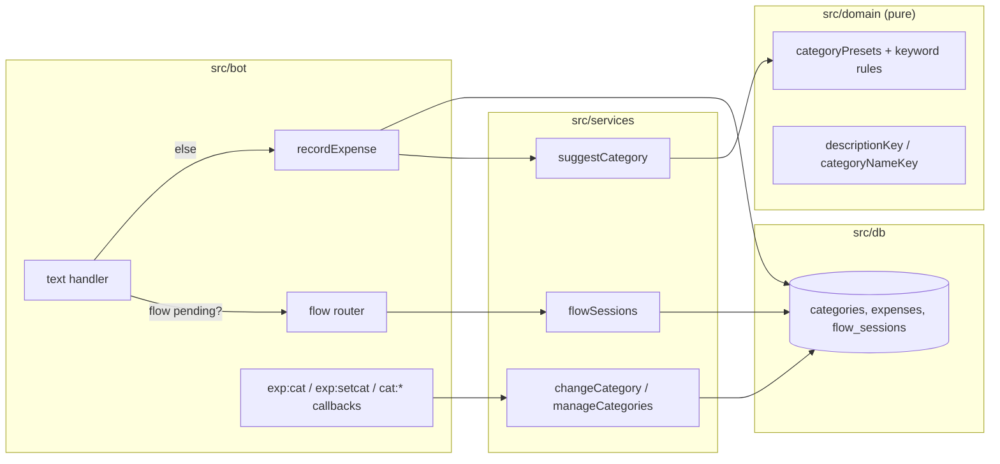
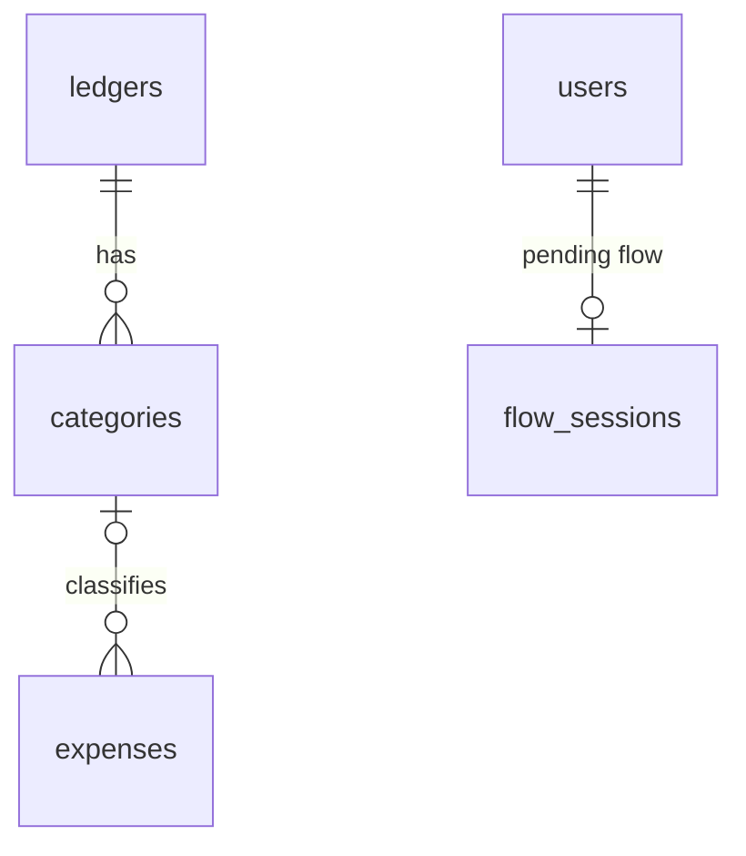

# 0003: Categories: preset per ledger, suggestion from history, change and manage

> **Status:** approved
> **Created:** 2026-09-29
> **Related ADRs:** [ADR-0002](../adrs/0002-ledgers-and-identity.md), [ADR-0007](../adrs/0007-categories-belong-to-ledgers.md), [ADR-0008](../adrs/0008-category-suggestion-from-history.md), [ADR-0009](../adrs/0009-persisted-flow-sessions.md)

## TL;DR

Every new expense gets a category with no extra tap. `450 кофе` confirms as
`Записано в «Личные расходы»: 450.00 RSD — кофе · Кафе и рестораны` with [Категория]
[Отменить]. The category comes from this ledger's history for the same description, then from
keyword rules, then «Другое» (ADR-0008). [Категория] opens a picker in the same message, and the
choice is remembered for next time. `/categories` lets the user add, rename and hide categories
through a persisted text-input flow (ADR-0009). Summaries by category are Plan 0004.

## Context & problem

Plan 0001 records amount, currency and description only. Every summary the user asked for ("how
much on food this month") needs categories, so they come before summaries. Categories must
be per ledger (ADR-0007), work from the first message, and adapt to the family's own words
without an external API (ADR-0008). Adding and renaming need the bot to accept a typed answer,
which is the first multi-step flow in the codebase, so the flow-session mechanism (ADR-0009) lands
here and Plan 0004's edit flow reuses it.

## Decision

Migration `0002_categories.sql` adds `categories` and `expenses.category_id` + `description_key`.
A ledger is seeded from `src/domain/categoryPresets.ts` when it's created, and at boot for
existing ledgers with no categories. `recordExpense` calls a pure `suggestCategory` in the domain,
fed by one repository lookup. The picker edits the confirmation message in place. Migration
`0003_flow_sessions.sql` adds `flow_sessions`, and the text handler routes by ADR-0009's rule
before expense parsing. Rejected options are in ADR-0007 (fixed list, empty start, per-user
categories), ADR-0008 (keyword only, always ask, LLM) and ADR-0009 (in-memory session, reply-only
matching).

## Architecture diagram



## Implementation phases

Each phase ships as its own commit. `dev` implements all phases in one session. The architect
reviews once at the end, in a fresh session.

### Phase 1: Every new expense lands in a category
- **Owner skill:** dev
- **What:** Migration `0002`, preset seeding, keyword suggestion with the «Другое» fallback, and
  the category name in the confirmation.
- **Files touched:** `src/db/migrations/0002_categories.sql`, `src/db/categories.ts`,
  `src/db/categories.test.ts`, `src/db/expenses.ts`, `src/domain/categoryPresets.ts`,
  `src/domain/categories.ts`, `src/domain/categories.test.ts`, `src/services/provisionUser.ts`,
  `src/services/seedCategories.ts`, `src/services/recordExpense.ts`, `src/services/*.test.ts`,
  `src/bot/messages.ts`, `src/bot/bot.test.ts`, `src/index.ts`.
- **Done when:**
  - A new user's personal ledger has one category per `categoryPresets.ts` entry, each with its
    `preset_key`. Running the boot seeding twice over a Plan 0001 database (ledger with no
    categories) leaves the same count, and so does a second `/start`.
  - `descriptionKey`: `'  Кофе   Латте '` → `'кофе латте'`, and `'Ёлка'` → `'елка'`.
    `categoryNameKey` uses the same folding.
  - Keyword suggestion on a freshly seeded ledger: `450 кофе` → `cafe`. `450 Кофейня` → `cafe`
    (prefix match). `300 такси до дома` → `transport`. `999 что-то` → `other`. `450 EUR coffee`
    → `cafe` (the English keyword is also listed).
  - `450 кофе` stores `category_id` = the ledger's `cafe` category and
    `description_key = 'кофе'`. The confirmation is exactly
    `Записано в «Личные расходы»: 450.00 RSD — кофе · Кафе и рестораны`.
  - Plan 0001 rows keep `category_id IS NULL`. The migration doesn't touch existing
    `expenses` rows (a test counts NULLs before and after).
  - Archiving `cafe` (repository call) makes `450 кофе` fall through to `other`.

### Phase 2: Change the category, and learn from the change
- **Owner skill:** dev
- **What:** A [Категория] button on the confirmation, a picker that edits the message in place,
  and the ADR-0008 history lookup as the first suggestion step.
- **Files touched:** `src/bot/handlers/category.ts`, `src/bot/callbackData.ts`,
  `src/bot/handlers/text.ts`, `src/bot/messages.ts`, `src/bot/bot.test.ts`,
  `src/services/changeCategory.ts`, `src/services/changeCategory.test.ts`,
  `src/services/recordExpense.ts`, `src/db/expenses.ts`, `src/db/expenses.test.ts`.
- **Done when:**
  - The confirmation keyboard is [Категория] `exp:cat:<uuid>` (44 bytes) and [Отменить]. The
    picker lists the ledger's **active** categories two per row, with each button
    `exp:setcat:<uuid>:<categoryId>`, plus [Назад] `exp:show:<uuid>` (45 bytes). Every
    builder goes through `assertCallbackData`, and a test builds `exp:setcat` with a
    16-digit category id and asserts it's at most 64 bytes.
  - Tapping Продукты sets `category_id` and edits the message back to the confirmation, now
    ending `· Продукты`. Tapping it again is a no-op answered with a toast, with no second write.
  - The tap is refused (toast, nothing written) when the tapper isn't the creator, the category
    belongs to another ledger, the category is archived, or the expense is undone.
  - Learning: `450 кофе` → Кафе и рестораны. Change it to Продукты. Then `300 Кофе` → Продукты.
    Then undo that `300 Кофе`, and `200 кофе` still → Продукты (the undone row is skipped and the
    corrected one matches). In a second ledger, `100 кофе` → Кафе и рестораны (history is per
    ledger, as a repository test with two ledgers shows).
  - History whose category is archived is skipped, and suggestion continues to keyword rules.

### Phase 3: Flow sessions, `/categories`, command menu
- **Owner skill:** dev
- **What:** ADR-0009's `flow_sessions` and text routing, `/categories` with add, rename and hide
  (archive), `/cancel`, `/help`, and `setMyCommands` at boot from the messages module.
- **Files touched:** `src/db/migrations/0003_flow_sessions.sql`, `src/db/flowSessions.ts`,
  `src/db/flowSessions.test.ts`, `src/services/flowSessions.ts`,
  `src/services/manageCategories.ts`, `src/services/*.test.ts`, `src/domain/categories.ts`,
  `src/domain/categories.test.ts`, `src/bot/handlers/categories.ts`,
  `src/bot/handlers/cancel.ts`, `src/bot/handlers/help.ts`, `src/bot/handlers/text.ts`,
  `src/bot/flows.ts`, `src/bot/callbackData.ts`, `src/bot/messages.ts`, `src/bot/bot.ts`,
  `src/bot/bot.test.ts`, `src/index.ts`, `README.md` (commands), `CLAUDE.md` (only if the
  `src/` tree changes shape).
- **Done when:**
  - `/categories` lists active categories and shows [Добавить] `cat:add`, [Переименовать] and
    [Скрыть]. Rename and hide open a category picker (`cat:ren:<id>` / `cat:arc:<id>`). «Другое»
    is absent from the hide picker.
  - Add: [Добавить] → prompt with `force_reply`. `Дача` creates the category, and it appears in
    the next expense picker. Validation, each with a messages-module re-ask and the flow kept
    pending: an empty name, a name over 32 code points, a name starting with a digit (`450 кофе`
    → hint that it looks like an expense and [Отмена]), and a name whose `categoryNameKey` equals
    an active category (`кафе и рестораны`).
  - Adding a name equal to an **archived** category's key restores it (`archived_at` → NULL) and
    creates no new row.
  - Rename changes `name` and `name_key` and keeps `id` and `preset_key`. After renaming Кафе и
    рестораны → Кофейни, `450 кофе` still suggests it (by `preset_key`).
  - Routing (ADR-0009), with an injected clock: with a pending add flow started at `T`, the text
    `Дача` at `T+9m59s` is the answer. At `T+10m01s` the flow has expired, so `Дача` gets the
    not-an-expense help and creates no category, and `450 кофе` records an expense.
  - Redelivery: delivering the answering `Дача` message twice creates one category, and the second
    delivery sends no reply and records no expense.
  - `/cancel`, [Отмена], and `/today` sent while a flow is pending all clear it, so a following
    `450 кофе` records an expense.
  - Restart: a flow started, then a new bot instance on the same DB file, then the answer is
    accepted.
  - At boot, `setMyCommands` registers `/today`, `/categories` and `/help`, with descriptions from
    `messages.ts`. If the call fails, one `warn` is logged and boot continues.

## Data shapes



```sql
-- illustrative
CREATE TABLE categories (
  id INTEGER PRIMARY KEY,               -- short on purpose: fits callback_data (ADR-0007)
  ledger_id TEXT NOT NULL REFERENCES ledgers(id),
  name TEXT NOT NULL,                   -- as typed, 1..32 code points
  name_key TEXT NOT NULL,               -- categoryNameKey(name), domain-computed
  preset_key TEXT,                      -- 'cafe', 'other', ...; NULL for custom
  archived_at TEXT,
  created_at TEXT NOT NULL,
  UNIQUE (ledger_id, name_key)
);
CREATE UNIQUE INDEX one_preset_per_ledger ON categories(ledger_id, preset_key)
  WHERE preset_key IS NOT NULL;
ALTER TABLE expenses ADD COLUMN category_id INTEGER REFERENCES categories(id);
ALTER TABLE expenses ADD COLUMN description_key TEXT;
CREATE INDEX expenses_ledger_description ON expenses(ledger_id, description_key);

CREATE TABLE flow_sessions (
  user_id TEXT PRIMARY KEY REFERENCES users(id),
  kind TEXT,                            -- NULL when nothing is pending
  payload TEXT,                         -- JSON, flow-specific
  anchor_chat_id INTEGER, anchor_message_id INTEGER,
  expires_at TEXT,
  last_input_key TEXT                   -- 'tg:<chat>:<msg>' of the last consumed answer
);
```

The preset list lives in `src/domain/categoryPresets.ts` (key, Russian name, keywords). The
initial content is the implementer's call within these keys: `groceries`, `cafe`, `transport`,
`housing`, `health`, `clothes`, `fun`, `telecom`, `gifts`, `other`. It must include the keywords
the Phase 1 done-whens use. Russian display names belong in the preset file, not
`messages.ts`, because they're seed data that becomes user-editable rows, not copy.

Callback data: `exp:cat:<uuid>`, `exp:setcat:<uuid>:<categoryId>`, `exp:show:<uuid>`,
`cat:add`, `cat:ren:<id>`, `cat:arc:<id>`, `flow:cancel`.

## Risks & open questions

- **Privacy:** `description_key` duplicates the description in plaintext (ADR-0008 negative).
  The encryption plan owns it. It never appears in logs.
- **Idempotency:** a double-tapped `exp:setcat` is a no-op. The flow answer is deduped by
  `last_input_key`. Seeding is `INSERT OR IGNORE` on `(ledger_id, name_key)`.
- **Swallowed expense:** an expense typed while a flow is pending becomes the answer. The
  digit-first name rule catches the common case (ADR-0009).
- **Telegram limits:** the picker has at most 30 active categories (a messages-module refusal
  on add beyond that), which keeps the keyboard well under Telegram's button limits. Category
  names appear in plain text only (no `parse_mode` exists), so no escaping is needed. If
  formatted messages ever arrive, that's the rich-text ADR the sibling needed.
- **Open:** in a shared ledger, may any member change an expense's category, or only the
  author? This plan says **author only**, consistent with Undo. The shared-ledger plan decides.

## What this plan does NOT do

- Category summaries, `/week`, `/month`, past dates and editing amount/description/date (Plan
  0004).
- Reordering, merging or deleting categories, and category icons/emoji.
- Recategorising Plan 0001's `NULL` rows in bulk. They show as «Без категории» in Plan 0004
  summaries and can be fixed one by one once Plan 0004's edit flow exists.
- Budgets per category (future).

## Implementation log

> Written by `dev`: one row per phase as its commit lands, then the close block. **The phases
> above are the contract. This section records what happened.** Observations, never conclusions:
> no pass list, no self-assessment. Deviations and unmet done-whens are **always** disclosed.
> Keep it shorter than `## Implementation phases`.

| phase | owner | state | commit |
|---|---|---|---|
| 1: Every new expense lands in a category | dev | not started | |
| 2: Change the category, and learn from the change | dev | not started | |
| 3: Flow sessions, `/categories`, command menu | dev | not started | |

### Notes

### Close triggers

## Followups
