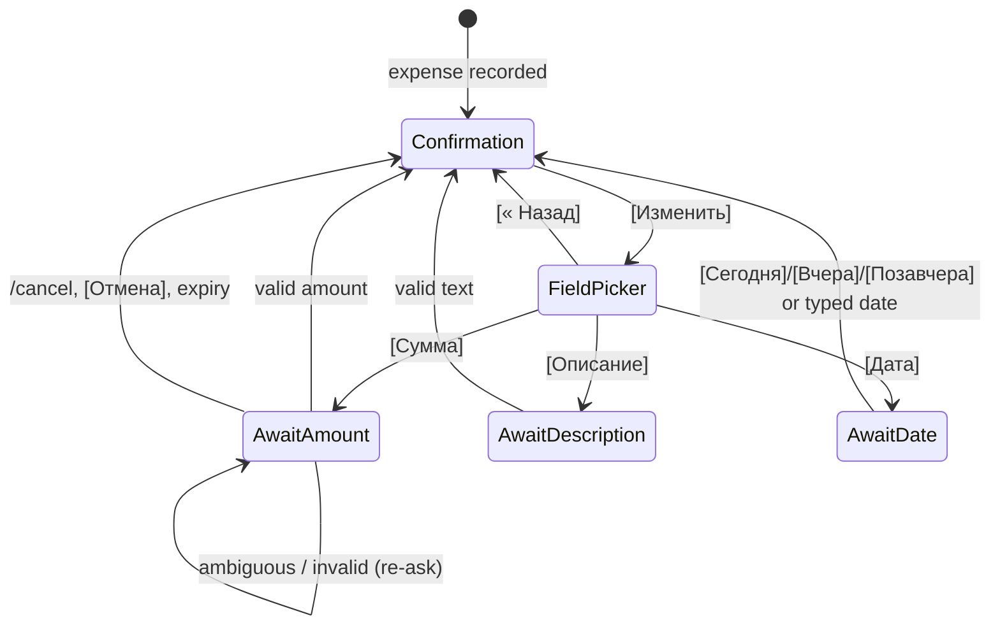

# 0004: Past dates, /week and /month by category, and the edit flow

> **Status:** in-progress
> **Created:** 2026-09-29
> **Amended:** 2026-09-30: the `updated_at` migration renumbered `0004` → `0005`, because Plan 0003's fix round took `0004_expense_category_set_at.sql` (Plan 0003 close review, round 2, m3)
> **Amended:** 2026-09-30: the `updated_at` migration takes the next free number when implemented, because Plan 0008 is queued ahead and adds one too
> **Depends on:** [Plan 0007](done/0007-navigation-shell.md), [Plan 0003](done/0003-categories.md) (screen kit, flow sessions, list pager)
> **Related ADRs:** [ADR-0002](../adrs/0002-ledgers-and-identity.md), [ADR-0004](../adrs/0004-amount-parsing-rule.md), [ADR-0007](../adrs/0007-categories-belong-to-ledgers.md), [ADR-0009](../adrs/0009-persisted-flow-sessions.md), [ADR-0011](../adrs/0011-navigation-model.md), [ADR-0012](../adrs/0012-html-rendering-seam.md)

## TL;DR

Three things the user asked for once categories exist. First, `450 такси вчера` or
`450 такси 25.09` records on that local date. Second, `/week` (Monday to Sunday) and `/month`
(calendar month) show, per currency, a total and then categories by amount, as ADR-0011 screens
with a period pager that names the periods ([◀ Август] [Октябрь ▶]) and pages in place. They
also get menu buttons. Third, [Изменить] on a confirmation lets the author fix the
amount, description or date through the ADR-0009 flow. The first visible change:
`450 такси вчера` confirms `Записано в «Личные расходы» за 28 сентября: 450.00 RSD — такси ·
Транспорт`.

## Context & problem

Expenses are often logged a day late, and Plan 0001 pins every expense to the message's local
date. Without summaries by category, categories (Plan 0003) have no payoff. Typos in amounts
("4500" for "450") can currently only be undone and retyped, and a thousand-fold typo is this
product's worst error class (ADR-0004).

## Decision

**Dates.** The expense-text parser looks at the **last word only**, using the rule below. It sets
`occurred_on` and leaves `occurred_at` as the message instant. **`occurred_on` is the authority
for every report.** `occurred_at` records when the user told us.

- `вчера` / `позавчера` (case-insensitive) mean today − 1 / − 2 in the user's timezone.
- `d.mm` or `dd.mm`: month is exactly two digits, so `молоко 1.5` stays a description. It
  resolves to the most recent such date that is not after today. If this year's is in the
  future, it's last year's.
- `d.mm.yyyy` / `dd.mm.yyyy` is taken literally. A future date is rejected with a reply.
- A token that matches the shape but isn't a calendar date (`31.02`) is part of the
  description.

**Summaries** read rows by `occurred_on BETWEEN from AND to` (local-date strings, so no DST
arithmetic in SQL) and aggregate in the domain (ADR-0002).

**Edit** reuses the confirmation message as the anchor and Plan 0003's flow sessions.

We rejected weekday words ("в понедельник") as extra ambiguity for little gain. We rejected
editing by editing the original Telegram message, because it's invisible and hard to confirm.
We rejected "reply with a corrected full line", because it means retyping everything. An edited
Telegram message still doesn't change the expense. Plan 0007's hint now points at [Изменить].

## Architecture diagram



## Implementation phases

Each phase ships as its own commit. `dev` implements all phases in one session. The architect
reviews once at the end, in a fresh session.

Unless stated, the user is in `Europe/Belgrade` and the ledger default is RSD.

### Phase 1: Past dates in free text
- **Owner skill:** dev
- **What:** A pure `parseDateSuffix` in the domain, wired into `parseExpenseText`. `recordExpense`
  stores the resolved `occurred_on`, and the confirmation names the date when it isn't today.
- **Files touched:** `src/domain/dateText.ts`, `src/domain/dateText.test.ts`,
  `src/domain/expenseText.ts`, `src/domain/expenseText.test.ts`, `src/services/recordExpense.ts`,
  `src/services/recordExpense.test.ts`, `src/bot/handlers/text.ts`, `src/bot/handlers/card.ts`
  (`recordedCard` renders the confirmation), `src/bot/messages.ts`, `src/bot/bot.test.ts`.
- **Done when:** (today = `2026-09-29` local)
  - `450 такси вчера` → 45000 RSD, `такси`, `2026-09-28`. `450 такси Позавчера` → `2026-09-27`.
    `450 такси 25.09` → `2026-09-25`. `450 такси 5.09` → `2026-09-05`.
  - `450 такси 05.10` → `2025-10-05` (5 October 2026 is in the future, so last year's).
    `450 такси 29.09` → `2026-09-29` (today isn't the future).
  - `450 такси 05.10.2026` → a `futureDate` result. Nothing is recorded, and the reply is the
    messages-module future-date text. `450 такси 25.09.2025` → `2025-09-25`.
  - `450 такси 31.02` → description `такси 31.02`, today. `450 молоко 1.5` → description
    `молоко 1.5`, today. `450 вчера` and `450 EUR вчера` → `invalid` (no description).
    `450 EUR такси вчера` → 45000 EUR, `такси`, `2026-09-28`. `450 вчера такси` → description
    `вчера такси`, today (last word only).
  - "Today" is the user's local date: a message dated `2026-09-29T22:30:00Z` (00:30 on the 30th
    in Belgrade) saying `450 такси вчера` stores `occurred_on = 2026-09-29`.
  - The confirmation reads `Записано в «Личные расходы» за 28 сентября: <b>450.00 RSD</b> —
    такси · Транспорт`. A date in another year includes it (`за 5 октября 2025`). A today-dated
    expense keeps the Plan 0003 wording.
  - A past-dated expense doesn't appear in `/today`.
  - Category suggestion uses the description without the date word: `450 такси вчера` →
    `description_key = 'такси'`.

### Phase 2: /week and /month with category breakdown and paging
- **Owner skill:** dev
- **What:** Domain period math (`weekOf`, `monthOf`, `previous`/`next`) and
  `summarizeByCurrencyAndCategory`, a repository range query, `/week` and `/month` as ADR-0011
  screens with the period pager, and the `📅 Неделя` and `🗓 Месяц` menu buttons.
- **Files touched:** `src/domain/periods.ts`, `src/domain/periods.test.ts`,
  `src/domain/aggregate.ts`, `src/domain/aggregate.test.ts`, `src/db/expenses.ts`,
  `src/db/expenses.test.ts`, `src/services/periodSummary.ts`,
  `src/services/periodSummary.test.ts`, `src/bot/handlers/summary.ts`, `src/bot/nav.ts`,
  `src/bot/keyboards.ts`,
  `src/bot/callbackData.ts`, `src/bot/messages.ts`, `src/bot/bot.ts`, `src/bot/bot.test.ts`,
  `src/services/flowSessions.ts`, `src/services/flowSessions.test.ts` (the `Screen` union and
  `parseScreen`), `src/bot/screens.ts`, `src/bot/handlers/menu.ts` (menu labels route like their
  commands), `src/index.ts` (command menu), `README.md` (commands).
- **Done when:** (clock `2026-09-30T10:00:00Z`, Wednesday 30 September local)
  - `weekOf('2026-09-30')` = `2026-09-28` … `2026-10-04` (Monday to Sunday).
    `weekOf('2026-09-27')` = `2026-09-21` … `2026-09-27`. `monthOf('2026-09-30')` =
    `2026-09-01` … `2026-09-30`. `monthOf('2024-02-10')` ends `2024-02-29`.
  - Fixture ledger (`occurred_on`, amount, category): A `2026-08-31` 10000 RSD Продукты. B
    `2026-09-01` 45000 RSD Кафе и рестораны. C `2026-09-15` 120000 RSD Продукты. D `2026-09-28`
    30000 RSD Кафе и рестораны. E `2026-09-30` 1250 EUR Транспорт. F `2026-09-30` 5000 RSD Кафе
    и рестораны, **undone**. G `2026-09-27` 20000 RSD Транспорт. H `2026-09-29` 7000 RSD
    `category_id NULL`.
  - `/month`: RSD total `2 220.00 RSD` (45000 + 120000 + 30000 + 20000 + 7000 = 222000), then
    Продукты `1 200.00`, Кафе и рестораны `750.00`, Транспорт `200.00`, Без категории `70.00`
    in that order. The lines sum to 222000. EUR total `12.50 EUR`, then Транспорт `12.50`.
    The RSD block (the ledger default) comes first, and other currencies follow alphabetically.
  - `/week`: RSD `370.00 RSD` (D + H = 37000), with Кафе и рестораны `300.00` and Без категории
    `70.00`. EUR `12.50 EUR`, Транспорт. G (Sunday the 27th) and F (undone) are absent.
  - The September month shows only [◀ Август] `sum:m:2026-08`, because the current period has
    no next. Tapping it edits the message to August (RSD `100.00 RSD`, Продукты `100.00`), which
    shows [◀ Июль] [Сентябрь ▶]. The current week shows only [◀ 21–27 сен]. Tapping it shows
    21–27 September (`200.00 RSD`, Транспорт) with [◀ 14–20 сен] [28 сен – 4 окт ▶]. A week
    that spans two months names both (`28 сен – 4 окт`).
  - The summary is a screen (ADR-0011). Its `screen_ctx` holds the ledger id, and paging reads
    that ledger, not the active one. After `/categories` opens a newer screen, a pager tap on the
    summary toasts `staleScreen` and edits nothing.
  - The header and the currency totals are bold. Category names are interpolated through `html`
    (ADR-0012).
  - A category tie sorts by name with `localeCompare(…, 'ru')`: 1000 RSD Одежда and 1000 RSD
    Здоровье list Здоровье first.
  - An empty period shows the header plus the messages-module "no expenses" line.
  - Callback data is `sum:m:2026-09` (12 bytes) and `sum:w:2026-09-28` (16 bytes). A malformed
    argument (`sum:m:2026-13`) is answered silently with no edit.
  - Length: a synthetic ledger with every currency in `currencies.ts` and 30 categories each
    renders at most 4096 characters of **visible** text (entities stripped, ADR-0012). Beyond that, the summary falls back to totals per currency
    plus a messages-module note. A test asserts both the fallback and the limit.
  - Boundary through the real recording path: a message dated `2026-08-31T22:30:00Z`
    (`450 кофе`, 00:30 on 1 September local) counts in September and not August.
  - `setMyCommands` adds `/week` and `/month`. The menu's first row becomes `📊 Сегодня` /
    `📅 Неделя` / `🗓 Месяц`, and each label routes exactly like its command.

### Phase 3: Edit amount, description and date
- **Owner skill:** dev
- **What:** [Изменить] on the confirmation, a field picker, and three ADR-0009 flows plus date
  quick buttons. The card is the flow's anchor (ADR-0011). Each prompt edits the card, and it is
  re-rendered after each edit, with `updated_at`.
- **Files touched:** `src/db/migrations/NNNN_expense_updated_at.sql` (the next free number when you start; check the tree), `src/db/expenses.ts`,
  `src/db/expenses.test.ts`, `src/services/editExpense.ts`, `src/services/editExpense.test.ts`,
  `src/bot/handlers/edit.ts`, `src/bot/flows.ts`, `src/bot/callbackData.ts`,
  `src/bot/messages.ts`, `src/bot/handlers/text.ts`, `src/bot/handlers/card.ts` (`recordedCard`
  carries [Изменить]), `src/services/flowSessions.ts`, `src/services/flowSessions.test.ts` (the
  edit `Flow` kinds and `parseFlow`), `src/bot/bot.test.ts`.
- **Done when:**
  - The confirmation keyboard is row 1 [Категория] [Изменить] `exp:edit:<uuid>` (45 bytes),
    row 2 [Удалить]. The field picker is [Сумма] [Описание] [Дата] as `exp:ef:<uuid>:a|d|t`
    (45 bytes), with [« Назад] `exp:show:<uuid>` alone below.
  - Each prompt edits the card into the question, naming the current value (`Сейчас: 450.00
    RSD. Введите новую сумму, например «1 200» или «12,50 EUR».`), with [Отмена]
    `flow:cancel`. [Отмена] restores the card unchanged.
  - Amount: `450 кофе` → Изменить → Сумма → `1 200` sets `amount_minor = 120000` RSD, and
    `/today` shows `1 200.00 RSD`. `12,5 EUR` sets 1250 EUR. `1.200` re-asks with both readings
    (ADR-0004), changes nothing and keeps the flow pending. `abc` re-asks. `450 кофе` re-asks with
    the expense-shaped hint (ADR-0009) and changes nothing.
  - Description: `капучино` sets `description` and `description_key = 'капучино'` and leaves
    `category_id` unchanged. An empty answer re-asks. `450 кофе` re-asks with the
    expense-shaped hint and doesn't become the description.
  - Date at clock `2026-09-30T10:00:00Z`: the quick buttons carry absolute dates, so [Вчера] is
    `exp:dt:<uuid>:2026-09-29` (54 bytes). It sets `occurred_on = 2026-09-29`, so the expense
    leaves `/today` and stays in `/week`. The same button tapped at `2026-09-30T23:30:00Z`
    (01:30 on 1 October local) still sets `2026-09-29`. A forged `exp:dt:<uuid>:2026-10-05`
    (future) or `…:2026-02-30` is answered with a toast and writes nothing. A typed `25.09` → `2026-09-25`
    (Phase 1 rule). `05.10.2026` re-asks as future. `occurred_at` never changes.
  - After each successful edit, the anchor confirmation is edited to the new values and `updated_at`
    is set. A second tap on a quick date button with the same value writes nothing.
  - Plan 0007's `editedMessageHint` now reads `Изменение сообщения не меняет запись. Нажмите
    «Изменить» под подтверждением.`
  - Refusals, each a toast with nothing written: a non-author taps [Изменить]; any edit button on
    an undone expense; an answer arriving after the expense was undone mid-flow (which also
    clears the flow).
  - A redelivered answer (same message twice) applies once, per ADR-0009.
  - No info-level log line contains the old or new amount or description (pino capture test, as
    in Plan 0001).

## Data shapes

```sql
-- illustrative, NNNN_expense_updated_at.sql
ALTER TABLE expenses ADD COLUMN updated_at TEXT;
```

```ts
// illustrative
type DateSuffix =
  | { kind: 'none' }
  | { kind: 'date'; date: LocalDate; wordCount: 1 }
  | { kind: 'future'; date: LocalDate };
interface CurrencySummary {
  currency: CurrencyCode;
  totalMinor: number; // integer, = sum of lines
  lines: { categoryId: number | null; name: string; amountMinor: number }[];
}
```

Callback data: `exp:edit:<uuid>`, `exp:ef:<uuid>:<a|d|t>`, `exp:dt:<uuid>:<yyyy-mm-dd>`,
`sum:m:<yyyy-mm>`, `sum:w:<monday yyyy-mm-dd>`. The ADR-0009 flow kinds are `editAmount`,
`editDescription` and `editDate`.

## Risks & open questions

- **Money:** amount edit is a second entry point into ADR-0004 parsing. It must reuse
  `parseAmount`, not a copy, and the ambiguous path must change nothing.
- **Time:** `dd.mm` year inference near New Year: on `2027-01-02`, `30.12` → `2026-12-30`. A
  unit test pins this.
- **Time:** `occurred_on` stays the author's local date (ADR-0002). Summaries in a shared ledger
  with members in different timezones can disagree at day edges. That's accepted there.
- **Idempotency:** nav taps are pure reads. Edits are compare-and-set, so the same value means no
  write.
- **Telegram:** re-rendering an unchanged screen is safe, because Plan 0007's `editHtml` treats
  "message is not modified" as success.
- **Resolved (ADR-0011):** a summary pages the ledger stored in its screen context, not the
  ledger that is active at tap time.

## What this plan does NOT do

- FX-converted single totals (the FX plan, ADR-0003). Totals stay per currency.
- Custom ranges (`/month 08`, `/range`), year view, charts and export.
- Category drill-down (tap a category to list its expenses): a natural next plan.
- Timezone and currency settings (Plan 0005).
- Moving an expense to another ledger (the shared-ledger plan).

## Implementation log

> Written by `dev`: one row per phase as its commit lands, then the close block. **The phases
> above are the contract. This section records what happened.** Observations, never conclusions:
> no pass list, no self-assessment. Deviations and unmet done-whens are **always** disclosed.
> Keep it shorter than `## Implementation phases`.

| phase | owner | state | commit |
|---|---|---|---|
| 1: Past dates in free text | dev | done | 65ecc5e |
| 2: /week and /month with category breakdown and paging | dev | done | 77fd3e5 |
| 3: Edit amount, description and date | dev | done | 637c140 |

### Notes

- Phase 1: the card's "today" is the author's local date of `occurred_at` (the day the message
  was sent), not the render-time date. `CardView` carries it as `sentOn`, built by `cardView()`
  in `card.ts`, so `src/bot/handlers/category.ts` and `src/bot/handlers/ambiguous.ts` (outside
  Files touched) changed at their card call sites.
- Phase 1: `parseExpenseText` takes `today` as an optional third argument; without it no word is
  read as a date. The expense-shaped checks in `src/domain/categories.ts` and
  `src/services/settings.ts` call it without one and are unchanged.
- Phase 2: done-when "`sum:m:2026-09` (12 bytes)" not met as stated: the string is 13 bytes.
  The test asserts 13; `sum:w:2026-09-28` is 16 as stated.
- Phase 2: `src/bot/flows.ts` (outside Files touched) changed: `restoreScreen` returns early for
  a `summary` anchor, so the widened `Screen` union typechecks. `src/index.ts` and
  `src/bot/screens.ts` needed no change: `registerCommands` already sends `messages.commands`.
- Phase 2: the uncategorized line's name is `null` in the domain (`CategoryLine.name`), and the
  messages module renders it as `Без категории`. In a tie it sorts after named categories.
- Phase 2: a pager tap for a period starting after today, or on a ledger the user no longer
  belongs to, is answered silently with no edit, like a malformed key.
- Phase 3: the migration is `0006_expense_updated_at.sql`, renumbered from `0005` at the merge of
  main, which took `0005_app_state.sql`. `src/db/connection.test.ts` (outside Files touched)
  changed to expect it.
- Phase 3: `src/bot/bot.ts` is not in Files touched, so `registerCard` in `card.ts` registers the
  edit taps (`registerEdit` in `src/bot/handlers/edit.ts`). `src/bot/handlers/text.ts` needed no
  change: the typed answer reaches `answerFlow` in `flows.ts`.
- Phase 3: done-when "an answer arriving after the expense was undone mid-flow" gets a toast:
  not met as stated, since a typed answer has no callback to toast. It writes nothing, clears the
  flow, replies `messages.editGone` and re-renders the anchor card in its deleted form.
- Phase 3: the card is the anchor under a new `expense` screen (`ExpenseScreen`); [Отмена] and
  `/cancel` re-render it through `showExpense` from `src/services/changeCategory.ts`. The field
  picker, field picks and date quick buttons are card actions with no anchor check, guarded by
  the expense's stored state. A quick-button tap clears the pending flow.
- Phase 3: the expense-shaped refusal (ADR-0009) applies to all three prompts, the date prompt
  included. `Expense` carries no `updatedAt`; `updated_at` exists only in the row.
- Followup noticed, not acted on: the README table has no row for the date words of Phase 1 or
  the [Изменить] flow of Phase 3 (README is in Phase 2's Files touched only).
- Followup noticed, not acted on: `messages.flowExpired` still says "Начните заново: /categories."
  for every flow kind, the edit flows included.
- Round 1 M1 (ac04f0b): the edit prompts' [Отмена] is `exp:show:<uuid>`, not the done-when's
  `flow:cancel`, a deviation forced by the stranding. It cancels the pending flow only when that
  flow edits the same expense.
- Round 1 m1 (e69734d): a date quick-button tap clears the pending flow only when it is that
  expense's `editDate`.
- Round 1 m2 (5dd1081): `messages.flowExpired` reads "Время ответа истекло. Начните заново." for
  every flow kind.
- Round 1 n1 (cfdf5f2): the description prompt text is asserted in `bot.test.ts`.
- Round 1 m3 (6d3d2c4): README rows for the date words and [Изменить].

### Close triggers

- Gate on the tip after 637c140: `pnpm typecheck` exit 0; `pnpm lint` exit 0; `pnpm test`
  exit 0, 33 test files, 477 tests passed; `pnpm build` exit 0.
- `node scripts/check-doc-links.mjs`: exit 0, 89 relative links resolve.
- Files changed outside the phases' `Files touched`: `src/bot/handlers/category.ts`,
  `src/bot/handlers/ambiguous.ts` (Phase 1); `src/bot/flows.ts` (Phase 2);
  `src/db/connection.test.ts` (Phase 3).
- Listed and unchanged: `src/index.ts`, `src/bot/screens.ts` (Phase 2); `src/bot/handlers/text.ts`
  (Phase 3).
- New modules: `src/domain/dateText.ts`, `src/domain/periods.ts`, `src/services/periodSummary.ts`,
  `src/services/editExpense.ts`, `src/bot/handlers/summary.ts`, `src/bot/handlers/edit.ts`, with
  tests for the domain and service modules.
- Migration: `0006_expense_updated_at.sql` (adds `expenses.updated_at`). No dependency added.
- New callback data: `sum:m:<YYYY-MM>` (13 bytes), `sum:w:<Monday>` (16), `exp:edit:<uuid>` (45),
  `exp:ef:<uuid>:<a|d|t>` (45), `exp:dt:<uuid>:<YYYY-MM-DD>` (54).

## Followups
