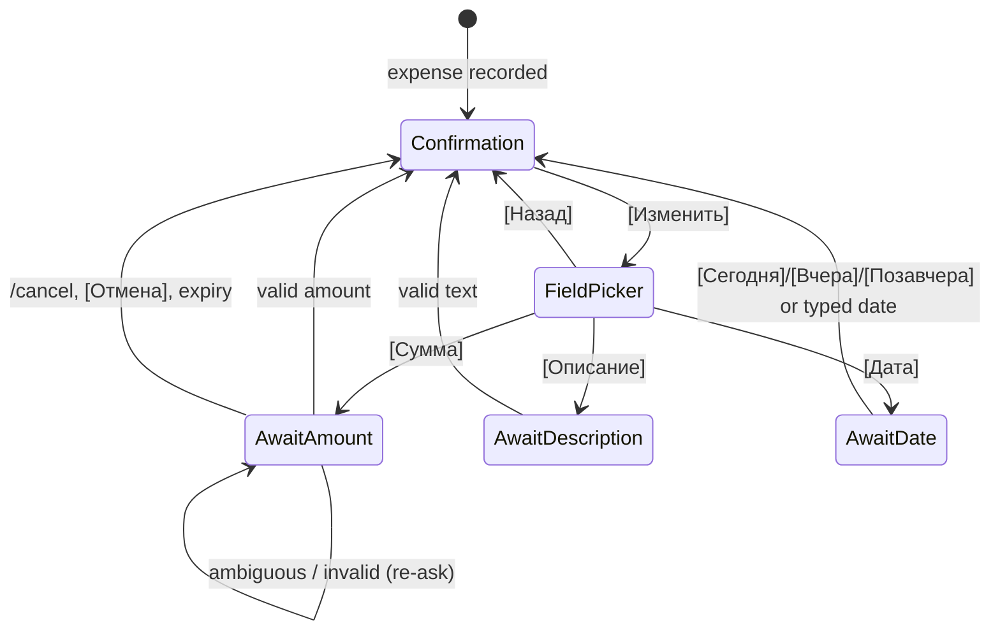

# 0004: Past dates, /week and /month by category, and the edit flow

> **Status:** approved
> **Created:** 2026-09-29
> **Related ADRs:** [ADR-0002](../adrs/0002-ledgers-and-identity.md), [ADR-0004](../adrs/0004-amount-parsing-rule.md), [ADR-0007](../adrs/0007-categories-belong-to-ledgers.md), [ADR-0009](../adrs/0009-persisted-flow-sessions.md)

## TL;DR

Three things the user asked for once categories exist. First, `450 такси вчера` or
`450 такси 25.09` records on that local date. Second, `/week` (Monday to Sunday) and `/month`
(calendar month) show, per currency, a total and then categories by amount, with [◀ Пред.] and
[След. ▶] buttons that page in place. Third, [Изменить] on a confirmation lets the author fix the
amount, description or date through the ADR-0009 flow. The first visible change:
`450 такси вчера` confirms `Записано в «Личные расходы» за 28 сентября: 450.00 RSD — такси ·
Транспорт`.

## Context & problem

Expenses are often logged a day late, and Plan 0001 pins every expense to the message's local
date. Without summaries by category, categories (Plan 0003) have no payoff. Typos in amounts
("4500" for "450") can currently only be undone and retyped, and a thousand-fold typo is this
product's worst error class (ADR-0004).

## Decision

**Dates.** The expense-text parser looks at the **last word only**, using the rule below. It sets
`occurred_on` and leaves `occurred_at` as the message instant. **`occurred_on` is the authority
for every report.** `occurred_at` records when the user told us.

- `вчера` / `позавчера` (case-insensitive) mean today − 1 / − 2 in the user's timezone.
- `d.mm` or `dd.mm`: month is exactly two digits, so `молоко 1.5` stays a description. It
  resolves to the most recent such date that is not after today. If this year's is in the
  future, it's last year's.
- `d.mm.yyyy` / `dd.mm.yyyy` is taken literally. A future date is rejected with a reply.
- A token that matches the shape but isn't a calendar date (`31.02`) is part of the
  description.

**Summaries** read rows by `occurred_on BETWEEN from AND to` (local-date strings, so no DST
arithmetic in SQL) and aggregate in the domain (ADR-0002).

**Edit** reuses the confirmation message as the anchor and Plan 0003's flow sessions.

We rejected weekday words ("в понедельник") as extra ambiguity for little gain. We rejected
editing by editing the original Telegram message, because it's invisible and hard to confirm.
We rejected "reply with a corrected full line", because it means retyping everything.
`edited_message` updates stay ignored.

## Architecture diagram



## Implementation phases

Each phase ships as its own commit. `dev` implements all phases in one session. The architect
reviews once at the end, in a fresh session.

Unless stated, the user is in `Europe/Belgrade` and the ledger default is RSD.

### Phase 1: Past dates in free text
- **Owner skill:** dev
- **What:** A pure `parseDateSuffix` in the domain, wired into `parseExpenseText`. `recordExpense`
  stores the resolved `occurred_on`, and the confirmation names the date when it isn't today.
- **Files touched:** `src/domain/dateText.ts`, `src/domain/dateText.test.ts`,
  `src/domain/expenseText.ts`, `src/domain/expenseText.test.ts`, `src/services/recordExpense.ts`,
  `src/services/recordExpense.test.ts`, `src/bot/handlers/text.ts`, `src/bot/messages.ts`,
  `src/bot/bot.test.ts`.
- **Done when:** (today = `2026-09-29` local)
  - `450 такси вчера` → 45000 RSD, `такси`, `2026-09-28`. `450 такси Позавчера` → `2026-09-27`.
    `450 такси 25.09` → `2026-09-25`. `450 такси 5.09` → `2026-09-05`.
  - `450 такси 05.10` → `2025-10-05` (5 October 2026 is in the future, so last year's).
    `450 такси 29.09` → `2026-09-29` (today isn't the future).
  - `450 такси 05.10.2026` → a `futureDate` result. Nothing is recorded, and the reply is the
    messages-module future-date text. `450 такси 25.09.2025` → `2025-09-25`.
  - `450 такси 31.02` → description `такси 31.02`, today. `450 молоко 1.5` → description
    `молоко 1.5`, today. `450 вчера` and `450 EUR вчера` → `invalid` (no description).
    `450 EUR такси вчера` → 45000 EUR, `такси`, `2026-09-28`. `450 вчера такси` → description
    `вчера такси`, today (last word only).
  - "Today" is the user's local date: a message dated `2026-09-29T22:30:00Z` (00:30 on the 30th
    in Belgrade) saying `450 такси вчера` stores `occurred_on = 2026-09-29`.
  - The confirmation reads `Записано в «Личные расходы» за 28 сентября: 450.00 RSD — такси ·
    Транспорт`. A date in another year includes it (`за 5 октября 2025`). A today-dated
    expense keeps the Plan 0003 wording.
  - A past-dated expense doesn't appear in `/today`.
  - Category suggestion uses the description without the date word: `450 такси вчера` →
    `description_key = 'такси'`.

### Phase 2: /week and /month with category breakdown and paging
- **Owner skill:** dev
- **What:** Domain period math (`weekOf`, `monthOf`, `previous`/`next`) and
  `summarizeByCurrencyAndCategory`, a repository range query, `/week` and `/month`, and nav
  callbacks that edit the summary in place.
- **Files touched:** `src/domain/periods.ts`, `src/domain/periods.test.ts`,
  `src/domain/aggregate.ts`, `src/domain/aggregate.test.ts`, `src/db/expenses.ts`,
  `src/db/expenses.test.ts`, `src/services/periodSummary.ts`,
  `src/services/periodSummary.test.ts`, `src/bot/handlers/summary.ts`,
  `src/bot/callbackData.ts`, `src/bot/messages.ts`, `src/bot/bot.ts`, `src/bot/bot.test.ts`,
  `src/index.ts` (command menu), `README.md` (commands).
- **Done when:** (clock `2026-09-30T10:00:00Z`, Wednesday 30 September local)
  - `weekOf('2026-09-30')` = `2026-09-28` … `2026-10-04` (Monday to Sunday).
    `weekOf('2026-09-27')` = `2026-09-21` … `2026-09-27`. `monthOf('2026-09-30')` =
    `2026-09-01` … `2026-09-30`. `monthOf('2024-02-10')` ends `2024-02-29`.
  - Fixture ledger (`occurred_on`, amount, category): A `2026-08-31` 10000 RSD Продукты. B
    `2026-09-01` 45000 RSD Кафе и рестораны. C `2026-09-15` 120000 RSD Продукты. D `2026-09-28`
    30000 RSD Кафе и рестораны. E `2026-09-30` 1250 EUR Транспорт. F `2026-09-30` 5000 RSD Кафе
    и рестораны, **undone**. G `2026-09-27` 20000 RSD Транспорт. H `2026-09-29` 7000 RSD
    `category_id NULL`.
  - `/month`: RSD total `2 220.00 RSD` (45000 + 120000 + 30000 + 20000 + 7000 = 222000), then
    Продукты `1 200.00`, Кафе и рестораны `750.00`, Транспорт `200.00`, Без категории `70.00`
    in that order. The lines sum to 222000. EUR total `12.50 EUR`, then Транспорт `12.50`.
    The RSD block (the ledger default) comes first, and other currencies follow alphabetically.
  - `/week`: RSD `370.00 RSD` (D + H = 37000), with Кафе и рестораны `300.00` and Без категории
    `70.00`. EUR `12.50 EUR`, Транспорт. G (Sunday the 27th) and F (undone) are absent.
  - [◀ Пред.] on the September month edits the message to August: RSD `100.00 RSD`, Продукты
    `100.00`. August shows [След. ▶], and September doesn't (the current period has no
    next). [◀ Пред.] on the week shows 21–27 September: `200.00 RSD`, Транспорт.
  - A category tie sorts by name with `localeCompare(…, 'ru')`: 1000 RSD Одежда and 1000 RSD
    Здоровье list Здоровье first.
  - An empty period shows the header plus the messages-module "no expenses" line.
  - Callback data is `sum:m:2026-09` (12 bytes) and `sum:w:2026-09-28` (16 bytes). A malformed
    argument (`sum:m:2026-13`) is answered silently with no edit.
  - Length: a synthetic ledger with every currency in `currencies.ts` and 30 categories each
    renders at most 4096 characters. Beyond that, the summary falls back to totals per currency
    plus a messages-module note. A test asserts both the fallback and the limit.
  - Boundary through the real recording path: a message dated `2026-08-31T22:30:00Z`
    (`450 кофе`, 00:30 on 1 September local) counts in September and not August.
  - `setMyCommands` adds `/week` and `/month`.

### Phase 3: Edit amount, description and date
- **Owner skill:** dev
- **What:** [Изменить] on the confirmation, a field picker, and three ADR-0009 flows plus date
  quick buttons. The anchor confirmation is re-rendered after each edit, with `updated_at`.
- **Files touched:** `src/db/migrations/0004_expense_updated_at.sql`, `src/db/expenses.ts`,
  `src/db/expenses.test.ts`, `src/services/editExpense.ts`, `src/services/editExpense.test.ts`,
  `src/bot/handlers/edit.ts`, `src/bot/flows.ts`, `src/bot/callbackData.ts`,
  `src/bot/messages.ts`, `src/bot/handlers/text.ts`, `src/bot/bot.test.ts`.
- **Done when:**
  - The confirmation keyboard is [Категория] [Изменить] `exp:edit:<uuid>` (45 bytes)
    [Отменить]. The field picker is [Сумма] / [Описание] / [Дата] as `exp:ef:<uuid>:a|d|t`
    (45 bytes), plus [Назад].
  - Amount: `450 кофе` → Изменить → Сумма → `1 200` sets `amount_minor = 120000` RSD, and
    `/today` shows `1 200.00 RSD`. `12,5 EUR` sets 1250 EUR. `1.200` re-asks with both readings
    (ADR-0004), changes nothing and keeps the flow pending. `abc` re-asks.
  - Description: `капучино` sets `description` and `description_key = 'капучино'` and leaves
    `category_id` unchanged. An empty answer re-asks.
  - Date at clock `2026-09-30T10:00:00Z`: [Вчера] `exp:dt:<uuid>:1` sets `occurred_on =
    2026-09-29`, so the expense leaves `/today` and stays in `/week`. A typed `25.09` → `2026-09-25`
    (Phase 1 rule). `05.10.2026` re-asks as future. `occurred_at` never changes.
  - After each successful edit, the anchor confirmation is edited to the new values and `updated_at`
    is set. A second tap on a quick date button with the same value writes nothing.
  - Refusals, each a toast with nothing written: a non-author taps [Изменить]; any edit button on
    an undone expense; an answer arriving after the expense was undone mid-flow (which also
    clears the flow).
  - A redelivered answer (same message twice) applies once, per ADR-0009.
  - No info-level log line contains the old or new amount or description (pino capture test, as
    in Plan 0001).

## Data shapes

```sql
-- illustrative, 0004_expense_updated_at.sql
ALTER TABLE expenses ADD COLUMN updated_at TEXT;
```

```ts
// illustrative
type DateSuffix =
  | { kind: 'none' }
  | { kind: 'date'; date: LocalDate; wordCount: 1 }
  | { kind: 'future'; date: LocalDate };
interface CurrencySummary {
  currency: CurrencyCode;
  totalMinor: number; // integer, = sum of lines
  lines: { categoryId: number | null; name: string; amountMinor: number }[];
}
```

Callback data: `exp:edit:<uuid>`, `exp:ef:<uuid>:<a|d|t>`, `exp:dt:<uuid>:<0|1|2>`,
`sum:m:<yyyy-mm>`, `sum:w:<monday yyyy-mm-dd>`. The ADR-0009 flow kinds are `editAmount`,
`editDescription` and `editDate`.

## Risks & open questions

- **Money:** amount edit is a second entry point into ADR-0004 parsing. It must reuse
  `parseAmount`, not a copy, and the ambiguous path must change nothing.
- **Time:** `dd.mm` year inference near New Year: on `2027-01-02`, `30.12` → `2026-12-30`. A
  unit test pins this.
- **Time:** `occurred_on` stays the author's local date (ADR-0002). Summaries in a shared ledger
  with members in different timezones can disagree at day edges. That's accepted there.
- **Idempotency:** nav taps are pure reads. Edits are compare-and-set, so the same value means no
  write.
- **Telegram:** `editMessageText` with an unchanged text throws "message is not modified". Treat
  it as success.
- **Open:** summaries use the **active** ledger at tap time. A summary message paged after
  switching ledgers (shared-ledger plan) shows the new ledger. Revisit there, possibly by putting a
  short ledger ref in the callback.

## What this plan does NOT do

- FX-converted single totals (the FX plan, ADR-0003). Totals stay per currency.
- Custom ranges (`/month 08`, `/range`), year view, charts and export.
- Category drill-down (tap a category to list its expenses): a natural next plan.
- Timezone and currency settings (Plan 0005).
- Moving an expense to another ledger (the shared-ledger plan).

## Implementation log

> Written by `dev`: one row per phase as its commit lands, then the close block. **The phases
> above are the contract. This section records what happened.** Observations, never conclusions:
> no pass list, no self-assessment. Deviations and unmet done-whens are **always** disclosed.
> Keep it shorter than `## Implementation phases`.

| phase | owner | state | commit |
|---|---|---|---|
| 1: Past dates in free text | dev | not started | |
| 2: /week and /month with category breakdown and paging | dev | not started | |
| 3: Edit amount, description and date | dev | not started | |

### Notes

### Close triggers

## Followups
