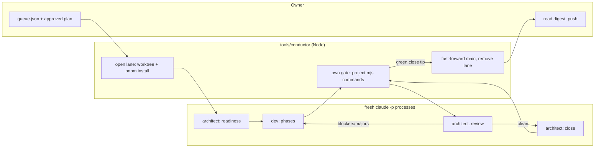

# 0006: Conductor trial: fork Ritmolux's conductor, run Plans 0007 and 0003 unattended

> **Status:** in-progress (2026-09-30)
> **Created:** 2026-09-29
> **Amended:** 2026-09-30, mid-Phase 1: every `node --test` names a quoted glob, not a directory
> **Related ADRs:** [ADR-0010](../adrs/0010-approved-plans-run-under-a-forked-conductor-on-trial.md)

## TL;DR

We fork Ritmolux's `tools/conductor/` into this repository and adapt it. Then the owner queues
Plan 0007 and, after it, Plan 0003 (which depends on it), and starts one run. The conductor opens a worktree lane, runs a
fresh headless `dev` session for the phases, gates the result itself, runs a fresh `architect` review
and close, and fast-forwards the local `main`. Success looks like this: the owner comes back to
`tools/conductor/digest.md`, finds both plans under `docs/plans/done/` with a committed
`## Close review`, reads them, and pushes. The plan ends with the owner's go/no-go verdict on the
model. Packaging is not part of it (ADR-0010).

## Context & problem

Five plans were approved on 2026-09-29, and each one costs the owner the same handoffs with no
judgement in them: "go", carrying the pointer into a fresh session, and the close. Ritmolux automated
exactly this loop, but its conductor is wired to Ritmolux: two imported scripts, a cargo and studio
gate, a nextest suite lock, a `# NNNN — Title` plan header, a `studio-builder` owner and an
annotated-tag check. ADR-0010 has the full account and the alternatives.

## Decision

Fork the conductor as it stands in Ritmolux, recording the source commit. Move every
project-specific value into `tools/conductor/project.mjs` and delete the Rust-only machinery. Move
conductor-mode instructions into `tools/conductor/prompts/` and leave each skill a short pointer.
Then trial it on one lane. We rejected keeping the manual loop, extracting a package first, writing
a new driver, and pointing Ritmolux's copy at this repository (ADR-0010 has one reason each).

## Architecture diagram



Anything it can't decide (a `human` phase, a red gate after one repair, a review still failing after
two fix rounds, a spend cap, a claim `git` doesn't bear out) parks the plan with an inbox entry
instead of continuing.

## Implementation phases

Phases 1 and 2 edit `.claude/`, which a headless session can't write, so this plan is implemented by
a human-started `dev` session as usual. Only Phase 3 exercises the conductor.

### Phase 1: The engine runs a fixture plan in this repository's format end to end
- **Owner skill:** dev
- **What:** Copy Ritmolux's `tools/conductor/` engine and tests (at the Ritmolux commit recorded in
  the README's first paragraph). Add `project.mjs` as the only home of project specifics. Delete
  what exists only for Ritmolux, so the conductor's own suite runs a plan written the way ours are
  written.
- **Files touched:** `tools/conductor/conductor.mjs`, `tools/conductor/project.mjs` (new),
  `tools/conductor/lib/*.mjs`, `tools/conductor/test/*.mjs`, `tools/conductor/queue.json`,
  `tools/conductor/local.example.json`, `.gitignore`, `eslint.config.js`, `.prettierignore` (new)
- **Specifically:**
  - `project.mjs` exports the gate steps (`pnpm typecheck`, `pnpm lint`, `pnpm test`,
    `node scripts/check-doc-links.mjs`, `node --test ".claude/hooks/*.test.mjs"`,
    `node --test "tools/conductor/test/*.test.mjs"`), the owners `dev` and `human` (implementer:
    `dev`), a plan-title pattern that accepts `# NNNN: Title`, the lane directory prefix
    `peb-plan-` (a sibling of the repo, as in Ritmolux), and the lane install
    `pnpm install --frozen-lockfile`.
  - Every `node --test` names a quoted `*.test.mjs` glob. Node 24 loads a directory argument as a
    module and exits 1 without running a test. Node expands the glob itself, so the gate's
    `cmd` arrays pass it as one literal argument with no shell.
  - The install runs for every lane, because no worktree is born with `node_modules/`. Ritmolux's
    `studio_install` park becomes a generic `deps_install` park with the same retry rule.
  - Deleted: `with-lock.mjs`, `suite-record.mjs`, `lib/ledger.mjs`, their tests, `spike/`,
    `temp-dir-leak.md`, and the imports of `scripts/gates.manifest.mjs` and
    `scripts/check-upstream-ci.mjs`. Every gate runs the full `pnpm test`.
  - The close check accepts a version bump with no tag, because our close ceremony makes none.
  - `queue.json` reads lane `a`: `["0007", "0003"]`, lane `b`: `[]`, and `0003` gets
    `after: ["0007"]`.
  - Gitignored: `tools/conductor/state/`, `tools/conductor/local.json` and
    `tools/conductor/digest*.md`. ESLint ignores `tools/` (as it ignores `scripts/`), and
    `.prettierignore` lists `tools/conductor/`, so the fork stays diffable against Ritmolux for
    the package decision.
- **Done when:**
  - `node --test "tools/conductor/test/*.test.mjs"` exits 0, and it includes a lane-scenario test
    against the fake CLI whose fixture plan's header is `# 0099: Fixture`. That test ends with the fixture plan
    under `docs/plans/done/` on the scenario repo's `main`, a bumped `package.json` version, and no
    tag, reached by a fast-forward.
  - A plan-reader test asserts that `# 0007: Navigation shell: menu, ...` parses to number `0007`, and
    that a phase tagged `studio-builder` is reported as an owner error.
  - Grep over `tools/conductor/**/*.mjs` for `ritmolux|cargo|nextest|studio|RLX` (case-insensitive)
    finds nothing, and grep for `../../..` finds nothing (the engine imports nothing outside
    `tools/conductor/`).
  - In the main checkout with no `local.json`, `node tools/conductor/conductor.mjs check` exits
    non-zero and names `local.json`. With `local.example.json` copied to `local.json` and non-zero
    figures filled in, it exits 0 on the committed queue.
  - `pnpm typecheck`, `pnpm lint` and `pnpm test` still exit 0. The log records how long
    `pnpm test` took, which is the cost of rerunning it at every gate.

### Phase 2: The harness speaks this repository's workflow
- **Owner skill:** dev
- **What:** The allowlist, the hook, the prompts and the skill pointers that make a headless session
  follow our `dev` and `architect` rules, plus the docs that tell the owner how to run it.
- **Files touched:** `tools/conductor/settings.conductor.json`, `tools/conductor/prompts/*.md`,
  `tools/conductor/test/settings.test.mjs`, `tools/conductor/README.md`,
  `.claude/hooks/conductor-no-background.cjs` (new), `.claude/hooks/hooks.test.mjs`,
  `.claude/settings.json`, `.claude/skills/dev/SKILL.md`, `.claude/skills/architect/SKILL.md`,
  `CLAUDE.md`
- **Specifically:**
  - `settings.conductor.json` allows `pnpm`, `node` and the git subset Ritmolux allows. It denies
    `git push`, `Monitor`, `WebFetch` and `rm` outside the lane, and it restates the project's
    deny-read of `.env*` and `data/**`. No PowerShell and no cargo rules.
  - The prompts use `CONDUCTOR-MODE:` markers and a `conductor-outcome` fence (renamed from
    `RLX-*`/`rlx-outcome`, and `lib/outcome.mjs` follows). They carry everything a conductor
    session must do differently: no restating, no waiting, no pointer, one command per shell call,
    no background commands, an outcome block at the end. The close prompt performs our close
    ceremony (architect SKILL, close ceremony steps 1 to 6) and adds a `## Close review` section to
    the plan, with no tag and no push.
  - Each skill gets a `## Conductor mode` section of at most 12 lines: inert unless the system
    prompt carries `CONDUCTOR-MODE:`, and when it does, the prompt's instructions win over the
    interactive steps.
  - `CLAUDE.md`: `tools/conductor/` appears in "Where things live", and "How we work" says that for a
    queued plan the approval is the "go" (ADR-0010). Its bite-test command, and the run line at the
    top of `.claude/hooks/hooks.test.mjs`, read `node --test ".claude/hooks/*.test.mjs"`.
  - The README is rewritten for this repository. Its first paragraph names the Ritmolux commit the
    fork came from.
- **Done when:**
  - `node --test ".claude/hooks/*.test.mjs"` exits 0, including two new bite tests. A `Bash` call with
    `run_in_background: true` in a conductor-started session is denied. The same call in an
    interactive session passes through.
  - `settings.test.mjs` asserts three things: every gate command in `project.mjs` and every command
    the prompts tell a session to run is allowed by `settings.conductor.json`; `git push` and
    `git push origin main` are denied; `Read` of `data/x.sqlite` and `.env` is denied.
  - Grep over `tools/conductor/prompts/` and `settings.conductor.json` for
    `ritmolux|cargo|studio|RLX|PowerShell` (case-insensitive) finds nothing.
  - Each skill's `## Conductor mode` section is 12 lines or fewer.
  - `node scripts/check-doc-links.mjs` exits 0.

### Phase 3: Trial run and verdict
- **Owner skill:** human
- **What:** The owner runs the conductor on the committed queue and judges the model on what it
  produced.
- **Files touched:** `tools/conductor/local.json` (gitignored), this plan's `## Implementation log`
- **Steps:**
  1. Write `tools/conductor/local.json` with your own per-step and per-run caps, then run
     `node tools/conductor/conductor.mjs check`.
  2. Run `node tools/conductor/conductor.mjs run --lane a --until-idle` and leave the main checkout
     untouched while it runs.
  3. Read `tools/conductor/digest.md`, and read each merged plan's committed `## Close review`.
     Push when satisfied.
  4. A park you act on (fix the plan, do the human step) is followed by `resume NNNN`.
  5. If the conductor itself misbehaves: `pause` or `abort`, run a human-started `/dev` fix pass on
     Plan 0006, then run again. Each fix is its own commit.
- **Done when:**
  - Plans 0007 and 0003 each reach one of two states. Either the conductor merged it to the local
    `main`: its file is under `docs/plans/done/` with a `## Close review` section and a version bump
    committed by the close session, and the owner ran no command between `run` and the fast-forward.
    Or it is parked with a reason from the closed list, and its inbox entry names the file to read.
  - At least one of the two plans was merged end to end by the conductor. If neither was, the
    verdict is no-go by definition.
  - This plan's log row for Phase 3 is marked done, and `### Notes` holds the figures: per plan,
    the outcome and every park reason, fix rounds, spend, and wall time. Also the number of
    conductor fix commits the trial forced, and `project.mjs`'s line count. It ends with the
    verdict word, `go` or `no-go`.

## Data shapes

```jsonc
// illustrative: tools/conductor/queue.json (committed; the architect owns its order)
{ "lanes": { "a": ["0007", "0003"], "b": [] }, "plans": { "0003": { "after": ["0007"] } } }
```

```js
// illustrative: tools/conductor/project.mjs, the whole adapter surface
export const project = {
  owners: ["dev", "human"],
  implementers: ["dev"],
  planTitle: /^# (\d{4}): (.+)$/m,
  lanePrefix: "peb-plan-",
  laneInstall: ["pnpm", "install", "--frozen-lockfile"],
  gate: [
    { name: "typecheck", cmd: ["pnpm", "typecheck"] },
    { name: "lint", cmd: ["pnpm", "lint"] },
    { name: "test", cmd: ["pnpm", "test"] },
    { name: "doc links", cmd: ["node", "scripts/check-doc-links.mjs"] },
    { name: "hooks", cmd: ["node", "--test", ".claude/hooks/*.test.mjs"] },
    { name: "conductor", cmd: ["node", "--test", "tools/conductor/test/*.test.mjs"] },
  ],
};
```

`local.json` keeps Ritmolux's shape (`budget_usd` per step, `run_budget_usd`,
`max_open_worktrees`, optional `model` per step). Its figures are the owner's and are never
committed.

## Risks & open questions

- **Plan 0007 must not be started by hand first.** Phases 1 and 2 of this plan land before 0007
  starts. If 0007 is implemented manually in the meantime, the trial pair becomes 0003 then 0004.

- **Readiness may park both plans.** The readiness session checks that every done-when can run under
  the allowlist, one command per call. Plans 0007 and 0003 were written for interactive sessions,
  and a done-when written as a pipe would park them `plan_wrong`. That is a real trial outcome: the
  architect repairs the plan, the owner resumes, and the park counts in the figures.
- **Lane install.** `better-sqlite3` is a native module. `pnpm install --frozen-lockfile` in a fresh
  worktree reuses the pnpm store, but a failed build parks `deps_install`, not the whole run.
- **Pre-commit hooks run in lanes.** Husky runs `lint-staged`, `pnpm typecheck`, `pnpm lint` and
  `pnpm test` on every commit a session makes. That makes sessions slower, not wrong.
- **Privacy.** `tools/conductor/state/` records commit subjects, test names and spend, never expense
  data. It is gitignored. Conductor sessions keep the deny-read on `.env*` and `data/**` (the Phase 2
  test asserts it).
- **Version bumps happen unread.** A conductor close bumps the version the way the manual close would
  (minor for a feature plan). 0007 and 0003 will each move `package.json` and `CHANGELOG.md` before
  the owner reads them.
- **Idempotency of the trial itself.** An `abort` mid-step reruns that step from scratch on the next
  `run`, and its spend is lost. `pause` is the stop that loses nothing.
- **Open:** whether the conductor's CLI-version check (verified list copied from Ritmolux, which
  includes the installed 2.1.283) should be shared with Ritmolux. That is deferred to the package
  decision.

## What this plan does NOT do

- **No package.** Where a shared conductor lives, how it's pinned and what harness ships with it is
  its own ADR and plan, after a `go` verdict.
- **No Ritmolux changes.** Moving Ritmolux onto a package is a Ritmolux plan.
- **No second lane.** The backlog is one chain (0007, then 0003, then 0004 and 0005), so the trial
  runs lane `a` only.
- **Plans 0002, 0004 and 0005 are not queued.** Plan 0002's `human` VPS phase would exercise the
  park path, a candidate for a second trial run. 0004 and 0005 wait on 0003 and follow a `go`.
- **No CI job for the conductor's tests.** Plan 0002 introduces CI, and the job is a followup.
- **No porting of later Ritmolux conductor fixes.** The fork is frozen at its recorded commit for the
  trial.

## Implementation log

> Written by `dev`: one row per phase as its commit lands, then the close block. **The phases
> above are the contract. This section records what happened.** Observations, never conclusions:
> no pass list, no self-assessment. Deviations and unmet done-whens are **always** disclosed.
> Keep it shorter than `## Implementation phases`.

| phase | owner | state | commit |
|---|---|---|---|
| 1: engine runs a fixture plan | dev | done | 1373b82 |
| 2: harness speaks this workflow | dev | done | committed with this row |
| 3: trial run and verdict | human | not started | |

### Notes

- Phase 1 source: Ritmolux `b0c0aa42`, the last commit touching `tools/conductor/` (Ritmolux
  `main` was `22a665a4` with the same conductor tree).
- Phase 1 deviation: `prompts/*.md`, `settings.conductor.json` and `README.md` were committed as
  copied from Ritmolux, with only the `CONDUCTOR-` markers and `conductor-outcome` fence changed in
  the prompts, because the engine and the lane tests read them. Phase 2 rewrites them.
- Phase 1 deviation: `test/hooks.test.mjs` (Ritmolux's hooks) and `test/settings.test.mjs` were
  deleted, not adapted. Phase 2 writes `settings.test.mjs` fresh.
- Phase 1 deviation: the tests for the dropped machinery were deleted (suite ledger, served tier,
  upstream CI read, studio install and guarded steps). Four `deps_install` lane tests replace the
  studio-install ones.
- Phase 1 done-when conflict: the grep for `studio` over `tools/conductor/**/*.mjs` and the
  `studio-builder` owner-error test cannot both hold as written. The test builds the owner string
  from two parts (`test/plan.test.mjs`), so the grep finds nothing.
- Phase 1 observation: Ritmolux ADR numbers (ADR-0205 to ADR-0251) stay in engine and test comments
  and in the `claude_dir` park detail. They name Ritmolux decisions, not this repository's.
- Phase 1 figures: `pnpm test` took 2.9 s wall (Vitest duration 1.97 s, 102 tests). The conductor
  suite ran 217 tests in 34 s.
- Phase 2 deviation: the conductor settings restate the project's four deny-read rules as they
  are (`.env`, `.env.local`, `.env.production`, `data/**`), not a `.env*` glob, so `.env.example`
  stays readable. They also allow `mkdir`, `rm` and `ls` in the lane and deny `pnpm dev` and
  `pnpm start`. Ritmolux's `cat`, `grep`, `sed -n`, `npx`, `python3` and `git tag` are not allowed.
- Phase 2 observation: `conductor-no-background.cjs` also writes the per-call `CONDUCTOR_HOOK_LOG`
  line the engine's `cli_contract` check reads. In Ritmolux the suite-lock hook wrote it, and that
  hook was not forked.
- Phase 2 observation: Ritmolux's CLI probe (`spike/`) was not forked, so `VERIFIED_CLI` stays
  Ritmolux's list. The installed CLI, 2.1.284, passes `check` with the patch-above warning.
- Phase 2 observation: Prettier reformatted all of `.claude/hooks/hooks.test.mjs` and
  `.claude/settings.json`, because the pre-commit `prettier --check` failed on both once they
  were staged.
- Phase 1's commit `1373b82` left this plan with a duplicated block (from Phase 3's done-when to a
  second copy of the log). The Phase 2 commit rebuilds the file from `561417a` with both phases'
  log edits.

### Close triggers

## Followups

- CI job running `node --test "tools/conductor/test/*.test.mjs"` once Plan 0002's workflow exists.
- After a `go` verdict: an ADR on the package's home and pinning, then a plan to extract it.
