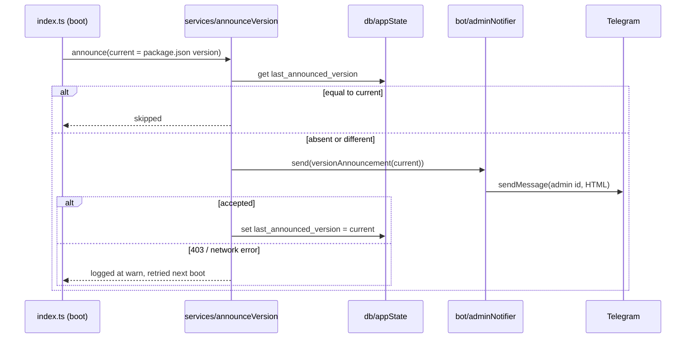

# 0008: Version announcements: tell the admin about each new version, and /changelog

> **Status:** approved (2026-09-30)
> **Created:** 2026-09-30
> **Related ADRs:** [ADR-0013](../adrs/0013-version-announcements-at-boot.md), [ADR-0012](../adrs/0012-html-rendering-seam.md)

## TL;DR

When the bot boots on a version it hasn't announced yet, it sends the admin (the first id in
`ALLOWED_TELEGRAM_IDS`) a short Russian "what's new" for that version, then records it in
SQLite, so a restart on the same version stays silent. Every bump announces, patch included.
The copy lives in `messages.versionAnnouncements`, and a test fails the gate when
`package.json`'s version has no entry. `/changelog` shows the same entries to every allowed
user. The first visible change: the first deploy of this plan messages the admin «🆕 Версия
0.3.0 …», and a second restart sends nothing.

## Context & problem

The sibling Serbian bot broadcasts user-facing releases at boot, and it's the only way anyone
notices a deploy happened. This bot has no such signal: a deploy lands silently, and the only
record of what changed is `CHANGELOG.md`, which no chat user reads. The user wants a message for
every new version, for now only to themselves, and a way for family members to look up what
changed.

## Decision

Boot-time announcer with the marker in a new key/value `app_state` table (ADR-0013). Pieces:

- `src/version.ts` reads `version` from `package.json` once at boot. Both `src/index.ts` (tsx)
  and `dist/index.js` (Docker, where `package.json` is copied to `/app`) resolve it as
  `new URL('../package.json', import.meta.url)`.
- `src/domain/version.ts` (pure) parses `X.Y.Z` and compares numerically, so `0.10.0` sorts
  after `0.9.0`.
- `src/services/announceVersion.ts` takes the db, the current version, the announcement map, a
  `send(body: Html)` function and a logger. It never throws: every failure is logged and boot
  continues.
- `src/bot/adminNotifier.ts` is the grammY side: `bot.api.sendMessage(adminId, body,
  htmlParseMode)`. A private chat's id equals the user's Telegram id, so no lookup is needed.
- Only the current version is announced. If one push carries two plan closes, the skipped
  version is still in `/changelog`, and the message links to it.
- If the recorded version is absent (the first boot with this plan), the current version is
  announced. That is Phase 1's visible skeleton.

We rejected a marker file (outside the backups), a CI `sendMessage` step (token in GitHub,
copy outside the messages module) and a broadcast to all users (deferred). See ADR-0013.

## Architecture diagram



## Implementation phases

Each phase ships as its own commit. `dev` implements all phases in one session. The architect
reviews once at the end, in a fresh session.

### Phase 1: the admin gets a message for a new version
- **Owner skill:** dev
- **What:** the `app_state` migration and repository, the version reader and comparator, the
  announcer service, the grammY admin notifier, `messages.versionAnnouncements` with the three
  backfilled entries below, the boot wiring, and the gate test.
- **Files touched:** `src/db/migrations/NNNN_app_state.sql` (the next free migration number when
  you start; Plan 0004 claims `0005`, so check the tree), `src/db/appState.ts`,
  `src/db/appState.test.ts`, `src/version.ts`, `src/domain/version.ts`,
  `src/domain/version.test.ts`, `src/services/announceVersion.ts`,
  `src/services/announceVersion.test.ts`, `src/bot/adminNotifier.ts`, `src/bot/messages.ts`,
  `src/bot/messages.test.ts` (or the existing messages test), `src/config.ts`,
  `src/config.test.ts`, `src/index.ts`, `.env.example`.
- **Done when:**
  - With no `last_announced_version` row, `announceVersion` for `0.3.0` calls `send` exactly
    once with the `0.3.0` announcement, and the row then reads `0.3.0`.
  - A second call with the row at `0.3.0` does not call `send`.
  - With the row at `0.3.0` and current `0.3.1`, `send` is called once with the `0.3.1` body
    (patch bumps announce).
  - When `send` rejects, the row keeps its old value, the call resolves (doesn't throw), and a
    `warn` is logged whose fields contain the version and the error name but no message body.
  - When the map has no entry for the current version, `send` isn't called, the row is
    unchanged, and an `error` is logged.
  - `compareVersions('0.10.0', '0.9.0') > 0`, `compareVersions('1.0.0', '1.0.0') === 0`, and
    `parseVersion('0.3')` rejects.
  - **Gate:** a test reads `package.json` and asserts `messages.versionAnnouncements` has an
    entry for its `version`, and that every key parses and is not greater than it. Bumping
    `package.json` to `0.3.1` without an entry fails `pnpm test`.
  - `loadConfig` exposes `adminTelegramId` equal to the first id of `ALLOWED_TELEGRAM_IDS`
    (`"222,111"` gives `222`). `.env.example` says the first id is the admin who receives
    version announcements.
  - Boot calls the announcer before `bot.start`, without awaiting it on the boot path, so a slow
    or failing Telegram call never delays polling.

### Phase 2: /changelog
- **Owner skill:** dev
- **What:** `/changelog` for every allowed user renders the announcements newest first, in the
  command menu and in `/help`.
- **Files touched:** `src/bot/handlers/changelog.ts`, `src/bot/handlers/changelog.test.ts` (or
  `src/bot/bot.test.ts`), `src/bot/bot.ts`, `src/bot/messages.ts`.
- **Done when:**
  - `/changelog` with the three backfilled entries replies with `0.3.0`, `0.2.0`, `0.1.0` in that
    order (numeric sort, not map insertion order: a test with keys inserted as `0.9.0`,
    `0.10.0` shows `0.10.0` first).
  - With enough synthetic entries to exceed it, the reply stays under 4096 characters, keeps the
    newest entries, and ends with the truncation line. The budget is a named constant below
    4096, leaving room for the header and the truncation line.
  - `/changelog` appears in `messages.commands` and in the `/help` text.
  - A user outside the allow-list gets nothing (the existing allowlist middleware; one test).

## Data shapes

```sql
-- illustrative
CREATE TABLE app_state (
  key   TEXT PRIMARY KEY,
  value TEXT NOT NULL
);
-- one key for now: 'last_announced_version' -> '0.3.0'
```

```ts
// illustrative
versionAnnouncements: Record<string, Html>  // key is 'X.Y.Z', value is the body only
versionAnnouncement(version: string, body: Html): Html
// «🆕 Версия {version}\n\n{body}\n\nВсе изменения: /changelog»
```

Backfilled bodies (Russian user copy, from `CHANGELOG.md`; `dev` may tighten the wording but
not add claims):

- `0.3.0`: «У каждой траты теперь есть категория. Бот подбирает её по прошлым тратам с тем же
  описанием, а кнопка [Категория] под подтверждением меняет её. /categories — добавить,
  переименовать или скрыть категории.»
- `0.2.0`: «Появилось меню [📊 Сегодня] [❓ Помощь] и команда /help. Трату можно удалить кнопкой
  [Удалить] и вернуть кнопкой [Вернуть]. Если сумма неоднозначна, например «1.200 обед», бот
  предложит варианты кнопками.»
- `0.1.0`: «Первая версия. Отправьте трату текстом, например «450 кофе» или «12,50 EUR такси»,
  а /today покажет траты за сегодня.»

## Risks & open questions

- **Checked by hand after the push, not by `dev`:** the admin gets one announcement for the
  version the close bumps to, and `docker compose restart` sends nothing more.

- **At-least-once.** A crash between `send` and the row write repeats the message on the next
  boot. Accepted: one duplicate to one person. The reverse order (write, then send) would lose
  announcements on a failed send, which is worse.
- **The admin never pressed /start.** Telegram answers 403 and the send is retried on every
  boot until they do. Visible as a `warn` per boot, which is the signal.
- **Order of `ALLOWED_TELEGRAM_IDS` is now load-bearing.** Reordering the env list silently
  changes the recipient. Documented in `.env.example`, accepted per the interview.
- **Privacy.** Announcements carry no user data. Logs name the version, never the body.
- **Plan 0004 and 0005 in flight.** Both are approved and both may bump the version at close.
  Every close now owes a `versionAnnouncements` entry, and the gate test enforces it whichever
  plan closes first.

## What this plan does NOT do

- Broadcast to all users, per-user "last seen version", or marking blocked users inactive. A
  future plan, if the family should get the push too.
- Silence patch bumps. Every bump announces until the user says otherwise.
- Render announcements from `CHANGELOG.md`. The changelog stays the dev-facing record, and the
  messages module holds the user copy.
- A boot alert on every restart. Only a version change sends anything.

## Implementation log

> Written by `dev`: one row per phase as its commit lands, then the close block. **The phases
> above are the contract. This section records what happened.** Observations, never conclusions:
> no pass list, no self-assessment. Deviations and unmet done-whens are **always** disclosed.
> Keep it shorter than `## Implementation phases`.

| phase | owner | state | commit |
|---|---|---|---|
| 1: the admin gets a message for a new version | dev | not started | |
| 2: /changelog | dev | not started | |

### Notes

### Close triggers

- **What shipped:**
- **User-visible surface changed:**
- **Gate at the tip:**
- **Outstanding `human` phases:**

## Followups

- The `CHANGELOG.md` header could note that every bump is announced to the admin.
