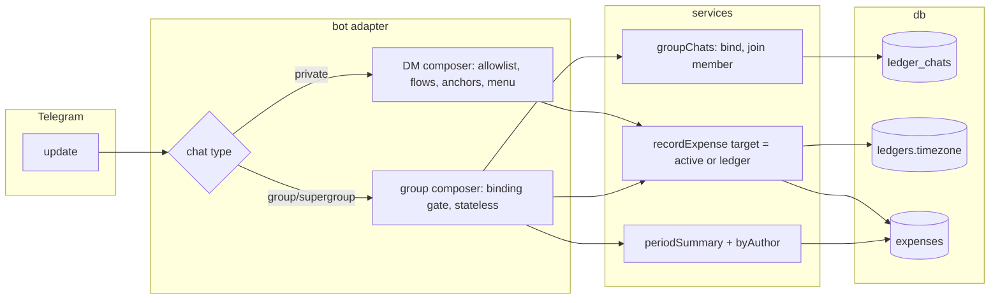

# 0009: Group ledgers: the bot as a group's accountant, with personal books kept private

> **Status:** in-progress
> **Created:** 2026-09-30
> **Related ADRs:** [ADR-0014](../adrs/0014-group-chats-bind-to-shared-ledgers.md),
> [ADR-0015](../adrs/0015-shared-ledgers-carry-a-timezone.md)

## TL;DR

An allowlisted user adds the bot to a Telegram group, and the group gets its own shared ledger.
Any member writes `450 кафе` in the group, and it's recorded in that ledger under their name. The
bot confirms with an emoji reaction, or with a small card when it's unsure. `/week` and `/month`
in the group show totals by category and by person. Everything a member writes in DM stays in
their personal ledger and never appears in the group. The first thing the user sees: they add
the bot to the family group, write `450 кафе`, and the bot answers there.

## Context & problem

The bot keeps one person's books in DM. The user wants a second mode, where the bot sits in a
group (the family) and every member can record, while the same person keeps private books and
budgets in DM. The schema already has `shared` ledgers with members (ADR-0002), but nothing
creates one. Every piece of the adapter also assumes a private chat:

- `recordExpense` always writes to the sender's active ledger.
- ADR-0009 flows and ADR-0011 anchors are keyed per user, so a pending DM flow would consume a
  group message as its answer (`routeText` in `src/bot/handlers/text.ts`), and
  `clearFlowOnCommand` would cancel a DM flow whenever the user typed `/month` in the group.
- `registerNonText`, `registerUnknownCommand` and the `notExpense` branch reply with help. With
  privacy mode off, that means a reply to every sticker and every other bot's command in the
  group.
- The sender allowlist drops every group member who isn't allowlisted.
- Period math runs in the viewer's timezone, so a group has no single month edge.

## Decision

Bind a group chat to one shared ledger and route group updates through a separate composer that
never touches DM state (ADR-0014). Give shared ledgers their own timezone (ADR-0015). Gate
groups by who adds the bot, auto-provision members on their first recorded expense, and confirm
quietly: a reaction when the category was recognised, a reply card when it fell through to
«Другое». Group expenses are edited by their author only: deletion happens in the group, and
everything else in the author's DM via a deep link.

We rejected a group-only ledger kind (it forks the membership model), routing group messages to
each author's active ledger (no shared digest, and it leaks), and allowlisting every group
member (friction that contradicts "anyone can record"). See ADR-0014.

## Architecture diagram



## Implementation phases

Phases 1 to 4 are dev work in one session, one commit each. Phase 5 is the user's live check.

### Phase 1: Walking skeleton: bind a group, record into it

- **Owner skill:** dev
- **What:** Migration `0007_group_chats.sql`, and a group composer, split off by chat type,
  that binds a group when an allowlisted user adds the bot. It records parseable messages from
  any sender into the bound ledger, in the ledger's timezone, and replies with a plain-text
  confirmation (no buttons yet). Unbound groups, chatter and non-text messages get no reply.
- **Files touched:** `src/db/migrations/0007_group_chats.sql`, `src/db/ledgerChats.ts` (+ test),
  `src/db/ledgers.ts` (timezone, display name), `src/services/groupChats.ts` (+ test),
  `src/services/recordExpense.ts` (+ test: an explicit target ledger, effective timezone),
  `src/services/provisionUser.ts` (initial timezone), `src/bot/bot.ts` (chat-type split; allowlist
  and `clearFlowOnCommand` DM-only), `src/bot/group/index.ts`, `src/bot/group/activation.ts`,
  `src/bot/group/text.ts`, `src/bot/middleware/allowlist.ts`, `src/bot/messages.ts`,
  `src/bot/testHarness.ts` (group updates, `my_chat_member`), `src/bot/group/group.test.ts`.
- **Done when:** in `src/bot/group/group.test.ts`, with A = `ALLOWED_ID` (timezone
  `Europe/Belgrade`, personal ledger in RSD), B = `STRANGER_ID` (never DMed the bot) and group
  chat `-100500` titled `Семья`:
  - A `my_chat_member` update in which A adds the bot creates exactly one `shared` ledger named
    `Семья`, with `default_currency = 'RSD'`, `timezone = 'Europe/Belgrade'`, A as `owner`, and
    one active `ledger_chats` row. The bot sends one welcome message to `-100500`.
  - The same update with B as the adder calls `leaveChat(-100500)` and creates no ledger and no
    binding.
  - B's `300 такси` in the bound group creates B's user (timezone `Europe/Belgrade`), identity,
    personal ledger and `member` row. It records `amount_minor = 30000`, `currency = 'RSD'` in
    the group ledger, `created_by` B. B's `active_ledger_id` is B's personal ledger.
  - A's `450 кафе` in the group records 45000 RSD in the group ledger. A's `active_ledger_id` is
    unchanged, and A's DM `/today` doesn't list it.
  - **Group dates use the ledger's timezone:** SECOND_ALLOWED_ID, whose own timezone is
    `America/New_York`, sends `500 такси` in the group with message date
    `2026-09-30T23:30:00Z`. That gives `occurred_on = '2026-10-01'` (Belgrade, CEST UTC+2:
    01:30). The same text at the same instant in their DM gives `'2026-09-30'` in their personal
    ledger (EDT UTC-4: 19:30).
  - **DM state is untouched by group traffic:** A has a pending DM edit-amount flow. A's
    `450 кафе` in the group records a group expense, and A's `flow_sessions` row (kind, payload,
    anchor) is byte-for-byte unchanged. A's `/month` in the group leaves the flow pending.
  - `привет всем` from a third sender C in the bound group makes no API call and creates no
    user row for C. A sticker, a photo, and `/start@other_bot` make no API call.
  - Any text in an unbound group (the bot added by nobody we know, or before binding) makes no
    API call and creates no user.
  - Redelivering B's `300 такси` update leaves one row (the source key is
    `tg:-100500:<message_id>`).
  - Messages carrying `sender_chat` (anonymous admins, linked channels) and from `is_bot` senders
    make no API call.

### Phase 2: Quiet confirmation and the author-only group card

- **Owner skill:** dev
- **What:** A recognised category gets an emoji reaction and no message. A fallback category
  («Другое») gets a reply card with [Удалить] and [Изменить в личке]. Replying `/card` to a
  recorded message shows its card. [Удалить]/[Вернуть] work for the author only. [Изменить в
  личке] deep-links to the author's DM card, and the card shows it only when the author is
  allowlisted: the DM allowlist stays closed (ADR-0014), so a member who isn't allowlisted
  deletes and records again. The service layer rejects edits to a shared-ledger expense by
  anyone but its author, on every path.
- **Files touched:** `src/bot/group/text.ts`, `src/bot/group/card.ts` (+ test),
  `src/bot/callbackData.ts` (`grp:del:<id>`, `grp:res:<id>`), `src/bot/handlers/start.ts`
  (deep-link payload `e_<expenseId>`), `src/services/recordExpense.ts` (return whether the
  category was the fallback; author check in undo/restore/edit for shared ledgers),
  `src/services/changeCategory.ts` (author check), `src/bot/bot.ts` (hands the allowlist to the
  group composer), `src/bot/messages.ts`, `src/bot/group/group.test.ts`.
- **Done when:**
  - A's `450 кафе` in the group results in exactly one `setMessageReaction` on that message
    (the emoji comes from `messages`) and zero `sendMessage` calls.
  - B's `2 минуты буду` records 200 RSD under «Другое» and replies to that message with a card
    showing `2.00 RSD`, the author's display name and [Удалить], and no [Изменить в личке],
    because B (`STRANGER_ID`) isn't allowlisted. A's `5 минут буду` gets a card with both
    [Удалить] and [Изменить в личке].
  - When `setMessageReaction` rejects (reactions disabled in the chat), the bot sends the reply
    card instead, and the expense is recorded once.
  - A taps [Удалить] on B's card: the toast is `messages.groupNotAuthor`, and `deleted_at`
    stays `NULL`. B taps it: the row is soft-deleted and the card shows [Вернуть]. B's second
    tap on the stale [Удалить] leaves the same `deleted_at`.
  - The [Изменить в личке] URL is `https://t.me/<bot username>?start=e_<expenseId>` (payload
    38 bytes, under Telegram's 64). In DM, A's `/start e_<A's group expense id>` opens the
    ADR-0011 expense card for that expense. A's `/start e_<B's expense id>` gets the plain
    welcome and no card. B's `/start e_<B's expense id>` in DM is dropped by the allowlist and
    makes no API call.
  - A direct service call `undoExpense` / category change / amount edit by A on B's group
    expense returns a not-author result and writes nothing. Personal-ledger behavior is
    unchanged (the existing tests still pass unmodified).
  - Replying `/card` to B's recorded message shows its card. Replying `/card` to a message that
    recorded nothing makes no API call.
  - Every `grp:` callback datum is at most 64 bytes, asserted through `assertCallbackData`.

### Phase 3: Group reports with a per-person breakdown

- **Owner skill:** dev
- **What:** `/today`, `/week` and `/month` in a bound group report on the group ledger in its
  timezone. They add a per-person section after the category breakdown, and page statelessly
  (the ledger comes from the chat binding, not an anchor). The group gets its own `/help` text
  and its own command list (`BotCommandScopeAllGroupChats`). Member display names are stored
  from the sender's Telegram first name and rendered through the ADR-0012 escaping seam.
- **Files touched:** `src/domain/aggregate.ts` (+ test: by-author sums per currency),
  `src/services/periodSummary.ts` (+ test: effective timezone, author lines),
  `src/services/todaySummary.ts` (effective timezone), `src/bot/group/summary.ts`,
  `src/bot/group/help.ts`, `src/bot/bot.ts` (group command scope), `src/bot/messages.ts`,
  `src/bot/group/group.test.ts`.
- **Done when:** with the clock at `2026-10-15T10:00:00Z`, the group ledger holds A's
  `450 кафе` (45000) and `1200 продукты` (120000) and B's `300 такси` (30000), all in October.
  A's personal ledger holds `999 секрет` (99900) on `2026-10-10`. Then:
  - `/month` in the group shows RSD total `1 950.00 RSD` (45000 + 120000 + 30000 = 195000),
    the category lines as in DM, and per person A `1 650.00 RSD` (45000 + 120000 = 165000) and
    B `300.00 RSD`. No part of the message contains `999` or `секрет`.
  - A's `/month` in DM shows `999.00 RSD` and none of the group's rows.
  - The per-person section lists each currency separately for a member who spent in two
    currencies. It never adds across currencies (state the property in the test, since ADR-0003
    conversion is not in scope here).
  - B taps the group `/month` pager: the same message is edited to September, and no
    `flow_sessions` row is written for B.
  - The expense from Phase 1 at `2026-09-30T23:30:00Z` (`occurred_on 2026-10-01`) counts in
    October's group `/month`, not September's.
  - A member whose first name is `<b>Ира</b>` is shown as literal text (escaped), not bold.
  - `/help` in the group sends the group help text, and never the DM menu keyboard.

### Phase 4: Group lifecycle and ledger settings

- **Owner skill:** dev
- **What:** Removing the bot deactivates the binding without deleting anything. Re-adding it
  (allowlisted user) reactivates the same ledger. A supergroup migration moves the binding to
  the new chat id. The ledger owner's `/settings` in the group answers with a DM deep link to a
  settings screen scoped to that ledger (timezone and currency, reusing the Plan 0005 pickers).
  Non-owners get a one-line refusal.
- **Files touched:** `src/bot/group/activation.ts`, `src/services/groupChats.ts` (+ test),
  `src/db/ledgerChats.ts`, `src/bot/group/settings.ts`, `src/bot/handlers/settings.ts`
  (ledger-scoped variant), `src/services/flowSessions.ts` (+ test: the ledger id in the settings
  screen and the timezone flow), `src/bot/callbackData.ts` (ledger-scoped `set:*` data),
  `src/bot/flows.ts` ([Другой…] answers here), `src/bot/handlers/start.ts` (payload `gs_<ledgerId>`),
  `src/services/settings.ts` (+ test: set a ledger's timezone, owner only),
  `src/db/ledgers.ts`, `src/bot/messages.ts`, `src/bot/group/group.test.ts`.
- **Done when:**
  - A `my_chat_member` update with status `left` or `kicked` sets the binding inactive. A later
    `450 кафе` in that chat makes no API call and records nothing. The ledger and its expenses
    are unchanged.
  - A re-adding the bot reactivates the same `ledger_chats` row and ledger (the count of shared
    ledgers owned by A stays 1). B re-adding it after a kick makes the bot leave.
  - A message with `migrate_to_chat_id = -100999` from `-100500` moves the binding. B's next
    `300 такси` in `-100999` lands in the same ledger.
  - A's `/settings` in the group replies with `https://t.me/<bot>?start=gs_<ledgerId>`
    (39 bytes of payload). B's gets `messages.groupSettingsOwnerOnly`.
  - After A sets the group ledger's timezone to `America/New_York` through that screen, A's
    own `users.timezone` is unchanged. A group message dated `2026-10-20T02:00:00Z` records
    `occurred_on = '2026-10-19'` (EDT 22:00). Rows recorded earlier keep their `occurred_on`.
  - B's `/start gs_<ledgerId>` in DM opens no settings screen.
  - README (group section: how to add the bot, BotFather privacy note), `/help` and
    `.env.example` (if anything changed) describe the group mode.

### Phase 5: Live check in the family group

- **Owner skill:** human
- **Blocks merge:** no
- **What:** Configure BotFather and run the flow in a real group.
- **Files touched:** none.
- **Done when:** In BotFather, `/setjoingroups` is Enabled and `/setprivacy` is Disabled, and the
  bot is removed from and re-added to the group, because a privacy change only applies to groups
  joined after it. In the family group, a recognised expense gets a reaction and `2 минуты буду`
  gets a card. The spouse's first expense records under their name. The group's `/month` shows
  both people, and your DM `/month` shows only your personal rows.

## Data shapes

```sql
-- illustrative: 0007_group_chats.sql
ALTER TABLE ledgers ADD COLUMN timezone TEXT;          -- NULL for personal (ADR-0015)
ALTER TABLE ledger_members ADD COLUMN display_name TEXT; -- the member's Telegram first name
CREATE TABLE ledger_chats (
  provider TEXT NOT NULL,                  -- 'telegram'
  chat_id TEXT NOT NULL,                   -- external identity, never a ledger key
  ledger_id TEXT NOT NULL UNIQUE REFERENCES ledgers(id),
  active INTEGER NOT NULL CHECK (active IN (0, 1)),
  bound_by TEXT NOT NULL REFERENCES users(id),
  bound_at TEXT NOT NULL,
  PRIMARY KEY (provider, chat_id)
);
```

SQLite can't add a `CHECK (kind = 'personal' OR timezone IS NOT NULL)` through `ALTER TABLE`.
`groupChats` enforces it in code, and a repository test asserts that a shared ledger without a
timezone can't be inserted through `insertLedger`.

```ts
// illustrative
type RecordTarget = { kind: 'active' } | { kind: 'ledger'; ledgerId: LedgerId };
// callback data: 'grp:del:<uuid>' / 'grp:res:<uuid>' = 44 bytes
// deep links:    'e_<uuid>' = 38 bytes, 'gs_<uuid>' = 39 bytes (limit 64, [A-Za-z0-9_-])
```

## Risks & open questions

- **False positives from chatter.** `2 минуты буду` is a valid expense to the parser. The
  fallback-category card makes it visible with a one-tap delete. If the family finds this noisy,
  the next lever is requiring a known category word or currency in groups. That's a product call
  after Phase 5, not now.
- **Privacy.** Group routing never reads the active ledger, and group reports read only the
  bound ledger. Phase 3 asserts that the group `/month` text doesn't contain a personal
  description. Display names and chat titles are user data: no info-level logs of them, and
  fixtures use invented names.
- **Idempotency.** The source key already includes the chat id. Group card taps are idempotent
  by soft-delete state. The reaction is a presentation detail: redelivery may re-react, which is
  harmless.
- **Time.** Ledger timezone changes don't rewrite history (ADR-0015). The DST boundaries in
  the done-whens are CEST (UTC+2) and EDT (UTC-4) in late September and October 2026, both
  before the 2026-10-25 and 2026-11-01 switches.
- **Telegram limits.** Reactions may be disabled per chat (fallback: the card). Bots can only
  use the standard reaction emoji. The `/card` command name and the reaction emoji are
  provisional, so a `ux-telegram` review of the group copy is worth running before `go`.
- **Prod shares the dev bot token** (Plan 0002). The BotFather privacy change affects both.

## What this plan does NOT do

- **Budgets** (overall monthly cap + optional per-category caps, per ledger): the next plan.
- **Notifications**: budget threshold alerts, scheduled daily/weekly/monthly summaries
  (including the scheduled group digest), the reminder to log, and recurring expenses. A plan
  after budgets, with a scheduler ADR.
- **Bank SMS parsing** (paste first, phone automation later) and **Serbian fiscal receipt QR**
  (with a total-only fallback): later plans, in that order.
- Binding an existing shared ledger to a group (`/bind`): no shared ledger can exist today except
  through a group, so there's nothing to bind.
- A DM ledger switcher, or DM reports on the group ledger.
- Settle-up / who owes whom.
- Changing a group expense's category from inside the group (a stateless category picker can't
  fit a category UUID and an expense UUID in 64 bytes). It's done in DM via [Изменить в личке].
- DM access for a group member who isn't allowlisted (ADR-0014). They delete and record again,
  or the owner adds them to `ALLOWED_TELEGRAM_IDS`.

## Implementation log

> Written by `dev`: one row per phase as its commit lands, then the close block. **The phases
> above are the contract. This section records what happened.** Observations, never conclusions:
> no pass list, no self-assessment. Deviations and unmet done-whens are **always** disclosed.
> Keep it shorter than `## Implementation phases`.

| phase | owner | state | commit |
|---|---|---|---|
| 1: Walking skeleton: bind a group, record into it | dev | done | 1f014da |
| 2: Quiet confirmation and the author-only group card | dev | done | committed with this row |
| 3: Group reports with a per-person breakdown | dev | not started | |
| 4: Group lifecycle and ledger settings | dev | not started | |
| 5: Live check in the family group | human | not started | |

### Notes

- Phase 1: files changed outside `Files touched`: `src/db/ledgers.test.ts` and
  `src/db/categories.test.ts` (their shared-ledger fixtures now carry a timezone, since
  `insertLedger` refuses a shared ledger without one; the repository assertion for that refusal
  is in `src/db/ledgers.test.ts`), and `src/db/connection.test.ts` (it pinned the migration list
  `0001`..`0006`; it now derives the list from the migrations directory).
- Phase 1: `src/services/provisionUser.ts` gained no parameter. A first-time group sender gets the
  ledger's timezone through the existing `defaultTimezone` input, passed by `groupChats`.
- Phase 1: the group confirmation reuses `messages.expenseRecorded`, as a reply to the message.
  A redelivered group message is not confirmed again.
- Phase 1: a group text that parses as ambiguous (`1.200 обед`), invalid or future-dated records
  nothing and gets no reply, like chatter. Followup, not acted on.
- Phase 2: `src/bot/group/index.ts` changed outside `Files touched`: it registers the group card
  handlers and the callback dispatcher on the group composer. `src/bot/bot.ts` is unchanged: the
  group composer already received the allowlist in Phase 1.
- Phase 2: the author checks in `undoExpense`, `restoreExpense`, `changeCategory` and the edit
  service (`src/services/editExpense.ts`) existed before this phase for every ledger kind, and
  their not-author result is `forbidden`. No service check was added; the done-when is asserted by
  tests calling `undoExpense`, `changeCategory`, `openEdit` and `startEdit` (amount).
- Phase 2: `src/services/recordExpense.ts` also gained `findTelegramUser`, a lookup without
  provisioning, so a group tap by someone who never recorded creates no user.
- Phase 2: the group card names the author by the Telegram first name from the update (the
  sender, the tapper, or the `/card` reply's `reply_to_message.from`), not the stored display
  name. The `/card` card replies to the expense's message, not to the `/card` message.

### Close triggers

- **What shipped:**
- **User-visible surface changed:**
- **Gate at the tip:**
- **Outstanding `human` phases:**

## Followups
