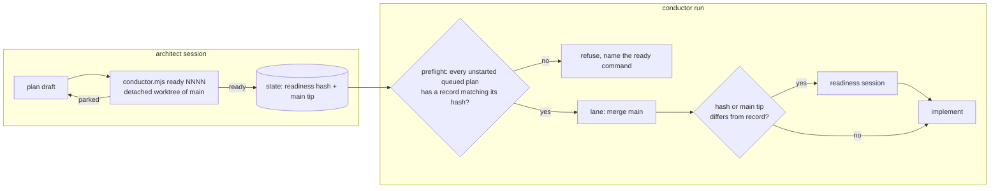

# 0010: Conductor followups: readiness at queue time, main before readiness, resume and idle fixes

> **Status:** in-progress
> **Created:** 2026-09-30
> **Related ADRs:** [ADR-0016](../adrs/0016-readiness-runs-before-a-plan-is-queued.md), ADR-0010, ADR-0013

## TL;DR

This plan acts on the open items of the 2026-09-30 evening run (`tools/conductor/FOLLOWUPS.md`),
so the next run needs less hand work than the last. The headline is a new
`conductor.mjs ready NNNN`. It runs the readiness check against `main` before a plan is queued,
and `run` refuses a queued plan that hasn't passed it (ADR-0016). The lane also merges `main`
before readiness, so a plan fixed on `main` and resumed needs no hand fast-forward. `resume` and
`--until-idle` stop overpromising and stop exiting early. The README and prompts close their gaps,
and three 0008 test nits get fixed. The first visible behavior: `node tools/conductor/conductor.mjs
ready 0010` on a plan with a *Files touched* gap prints the park detail and exits non-zero.

## Context & problem

Every conductor run so far has needed hand work that a plan or a conductor change could have
prevented. The owner's condition for keeping the conductor is that each run shrinks the last one's
hand work. The evening run recorded four hand interventions (H1 to H4) and eight open followups
(F1 to F8). The two costliest repeat the trial's unacted followups:

- **F1:** a readiness park for a *Files touched* gap, the third run in a row.
- **F2:** a hand fast-forward of the lane after the plan was amended on `main`. `lane.mjs` merges
  `main` only at `pre-review` and at the close, so readiness reads the stale plan.

The rest are smaller defects. `resume` prints "within a minute" but an ask waits for the lane's
next pick (F5). `--until-idle` exited with a resume ask pending (F6, cause unverified). The README
has no `check_red` row (F7). A `git grep` with backticks and Cyrillic was denied (F8, cause
unverified: `Bash(git grep *)` is already allowlisted). And a test pinned to the live version map
broke on the next bump (F4).

F3 (an announcement owed for every bump) needs no conductor code. `prompts/close.md` already has
the close write the `versionAnnouncements` entry, and the gate fails a bump without one. The
residual is the interactive close ceremony text in the architect skill, which the architect
updates at this plan's close.

## Decision

Readiness moves to queue time as a gate, and stays at run time as a safety net keyed on the plan
hash and the `main` tip (ADR-0016). We rejected having the run-time readiness session amend *Files
touched* itself, because a headless session would be editing an approved plan unread. We rejected
a symbol-grep script because it's heuristic, and its noise would train the check to be ignored.

**Run this plan with an interactive `/dev`, not through the conductor.** The plan changes the
conductor's own sources, which pauses a live run with `stale_sources` at the fast-forward. Its
Phase 1 gate would also refuse the plan itself until `ready` exists.

## Architecture diagram



## Implementation phases

### Phase 1: `ready NNNN` and the preflight gate
- **Owner skill:** dev
- **What:** `conductor.mjs ready NNNN` creates a detached worktree of `main`, runs the existing
  readiness session in it (same prompt, same `budget_usd.readiness`, same "changed nothing"
  verification), removes the worktree, and records `readiness = { hash, main, at }` on the plan's
  state record, with the step and its spend recorded like any other. On a park it prints the
  detail and transcript path, records no readiness, and exits 1. `planContractHash` ignores the
  `> **Status:**` line. `run`'s preflight (and `check`'s) errors on any plan listed in
  `queue.json` that has no implement step yet, and whose readiness record is missing or whose
  `hash` differs from the plan's current contract hash. The error names the plan and `ready NNNN`.
- **Files touched:** `tools/conductor/conductor.mjs`, `tools/conductor/lib/lane.mjs` (export or
  factor the readiness session so both paths share it), `tools/conductor/lib/state.mjs`,
  `tools/conductor/test/cli.test.mjs`, `tools/conductor/test/state.test.mjs`,
  `tools/conductor/test/lane-scenario.mjs`, `tools/conductor/test/fake-claude.mjs` (if the fake
  needs a readiness mode outside a lane)
- **Done when:**
  - A CLI test with the fake `claude` in `plan_wrong` readiness mode shows `ready NNNN` exiting 1,
    printing the phase and detail, and leaving no readiness record and no extra worktree
    (`git worktree list` is unchanged).
  - In `ready` mode, the same test shows exit 0, a record whose `hash` equals `planContractHash`
    of the plan file and whose `main` equals `main`'s tip, and no extra worktree.
  - A state test shows that two plan texts differing only in the `> **Status:**` line hash equal,
    and two differing in a *Files touched* line hash differently.
  - A CLI test shows `check` failing on a queued, unstarted plan with no record, and naming
    `ready NNNN` in the error. After `ready`, `check` passes. After an edit to the plan's phases,
    `check` fails again. A queued plan that already has an implement step is not refused.

### Phase 2: merge `main` before readiness; re-check readiness when `main` moved
- **Owner skill:** dev
- **What:** before the readiness decision in `runPlan`, the lane merges `main` at a new
  `pre-readiness` point, using the existing `mergeMain` (a conflict goes to one merge session, as
  at `pre-review`). The run-time `readiness()` skips only when the record's `hash` equals the plan's
  contract hash *and* the record's `main` equals the `main` tip the lane just merged. Otherwise it
  runs and rewrites the record. The existing rule that a plan with implement steps and no record
  isn't stopped stays.
- **Files touched:** `tools/conductor/lib/lane.mjs`, `tools/conductor/lib/merge.mjs` (only if
  the point name is validated there), `tools/conductor/test/lane.test.mjs`,
  `tools/conductor/test/lane-scenario.mjs`
- **Done when:**
  - A lane test reproduces H3: a plan parks `plan_wrong` at readiness, the plan is amended *on
    `main`* (a commit touching only the plan file), and `resume` runs readiness against the amended
    text. The lane's HEAD then contains that `main` commit, with no hand fast-forward.
  - A lane test shows that a plan with a `ready` record for the current `main` tip starts
    implementing with zero readiness sessions. The same plan, after an unrelated commit lands on
    `main`, runs exactly one readiness session.
  - A conflicting `main` at `pre-readiness` starts one merge session, and the lane's `merges[]`
    records `where: "pre-readiness"`.

### Phase 3: `resume` says what it does; `--until-idle` takes pending asks before exiting
- **Owner skill:** dev
- **What:** `resume`'s message against a live run says the ask is taken when the plan's lane next
  picks a plan, and names the plan that lane is running, if any. `status` lists pending resume
  asks. First reproduce F6 in a test (a parked plan with a pending, now-valid resume ask when a
  non-resident `--until-idle` lane finds nothing else to pick) and log the actual cause in the
  Notes. Then fix it so the lane takes asks before deciding it's idle, and runs the resumed plan.
- **Files touched:** `tools/conductor/conductor.mjs`, `tools/conductor/lib/lane.mjs`,
  `tools/conductor/test/cli.test.mjs`, `tools/conductor/test/lane.test.mjs`
- **Done when:**
  - A CLI test asserts that `resume`'s output against a live run contains no "within a minute",
    and names the running plan when its lane has one.
  - A `status` test shows a pending ask listed by plan.
  - The F6 test fails on the pre-fix code and passes after: under `--until-idle`, a resume ask
    written while the lane is running another plan leads to that parked plan running before the
    run exits.

### Phase 4: operator docs and prompts (F7, F8)
- **Owner skill:** dev
- **What:** the README documents `ready` (Commands table, and a "Before queuing a plan" line in
  the before-run section) and the new `pre-readiness` merge point, and adds a `check_red` row to
  "Acting on a park". For F8, reproduce the denial in `settings.test.mjs` using the conductor
  settings' matcher on `git grep -n` with a pattern that holds backticks and Cyrillic. If the
  allowlist is the cause, fix the rule. If the allowlist permits it (so the CLI's own
  shell-substitution guard denied it), add one line to `prompts/implement.md`,
  `prompts/readiness.md` and `prompts/review.md`: patterns with backticks or `$` go through the
  Grep tool. Record which case held in Notes.
- **Files touched:** `tools/conductor/README.md`, `tools/conductor/settings.conductor.json` (only
  if the allowlist is the cause), `tools/conductor/test/settings.test.mjs`,
  `tools/conductor/prompts/implement.md`, `tools/conductor/prompts/readiness.md`,
  `tools/conductor/prompts/review.md`
- **Done when:**
  - The README's park table has a `check_red` row, and its Commands table has a `ready` row.
  - `settings.test.mjs` has a case asserting the allowlist's verdict on
    ``git grep -n "`Изменить`"``, and the Notes say whether the allowlist or the CLI denied it.
  - `node scripts/check-doc-links.mjs` exits 0.

### Phase 5: stop pinning tests to live data (F4, 0008 nits)
- **Owner skill:** dev
- **What:** the dev skill's standards gain one bullet: a test never pins live, growing data
  (version maps, command lists). It derives the expectation from the source, or tests the function
  against a fixture. Then apply the bullet to the three open 0008 nits. The `/settings` and
  `/changelog` registration entries read `messages.commands[n].description`. The announcement-order
  test sorts with `compareVersions`, not `localeCompare` with numeric ordering. A new test drives
  `adminNotifier`'s send with a fake API and asserts the admin chat id and `parse_mode: 'HTML'`.
  Record each nit's disposition with `conductor.mjs finding 0008 <ref> --done`.
- **Files touched:** `.claude/skills/dev/SKILL.md`, `src/bot/bot.test.ts`,
  `src/bot/adminNotifier.test.ts` (new)
- **Done when:**
  - `src/bot/bot.test.ts`'s registration test has no string literal for any command description.
  - The announcement-order test imports `compareVersions`, and `localeCompare` no longer appears
    in `src/bot/bot.test.ts`.
  - `adminNotifier.test.ts` asserts the `sendMessage` payload's `chat_id` equals the `adminId`
    passed to `adminNotifier`, and its `parse_mode` equals `'HTML'`. Which config id becomes
    `adminId` is wired in boot, and is out of this test's scope.
  - `pnpm typecheck`, `pnpm lint`, `pnpm test` and `node --test "tools/conductor/test/*.test.mjs"`
    all exit 0.

## Data shapes

```js
// illustrative: the plan's state record in tools/conductor/state/
rec.readiness = { hash: "<sha1 of the contract, Status line excluded>", main: "<sha>", at: "<ISO>" };
rec.merges.push({ where: "pre-readiness", commit, session: false, at });
```

## Risks & open questions

- **Cost.** A plan queued `after` another pays for readiness twice, once at `ready` and once after
  its dependency merges. That's accepted by ADR-0016. Readiness sessions so far have been cheap
  next to implement.
- **State loss.** Readiness records are gitignored state. After a wipe, `check` will name every
  queued plan. The error message is the recovery path.
- **F6's cause is unverified.** Phase 3 reproduces it before fixing it. If the reproduction shows
  the ask was refused (the park still held), the fix is the refusal's message, and the Notes say
  so.
- **F8's cause is unverified.** Phase 4 decides between the two cases with a test, not a guess.

## What this plan does NOT do

- **The `/help` copy pass** (0003's and 0004's open minors). That's a ux-telegram design plus a
  small dev plan.
- **Marking 0005's minor done.** The owner can run `finding 0005 <ref> --done` now, since it looks
  resolved by `5dd1081`.
- **Letting a headless session amend plans**, or a symbol-grep script (ADR-0016, rejected).
- **The architect skill's close-ceremony line** about the `versionAnnouncements` entry, and a
  "run `ready` before approving for the queue" line. The architect edits its own skill at this
  plan's close.

## Implementation log

| phase | owner | state | commit |
|---|---|---|---|
| 1: `ready NNNN` and the preflight gate | dev | done | `67021e2` |
| 2: merge main before readiness | dev | done | committed with this row |
| 3: resume wording, idle takes asks | dev | not started | |
| 4: operator docs and prompts | dev | not started | |
| 5: stop pinning tests to live data | dev | not started | |

### Notes

- Phase 1: the gate made `run` refuse the existing fixtures that queue a plan with no readiness
  record. `test/queue.test.mjs` and `test/live.test.mjs` (outside Files touched, approved by the
  owner) now seed one, and so does `test/cli.test.mjs`'s setup. As a result, `live.test.mjs`'s step
  labels read `implement-01` and one `cli.test.mjs` step list has no lane readiness step.
- Phase 1: `ready` refuses while a run is live, as `park` and `finding` do, because the live run
  rewrites the record whole.
- Phase 2: the `pre-readiness` merge and the readiness decision run once per pick of the plan, before
  its first implement session in that `runPlan` call, not before every implement session. The loop
  then re-reads the merged plan's next step.

### Close triggers

## Followups
