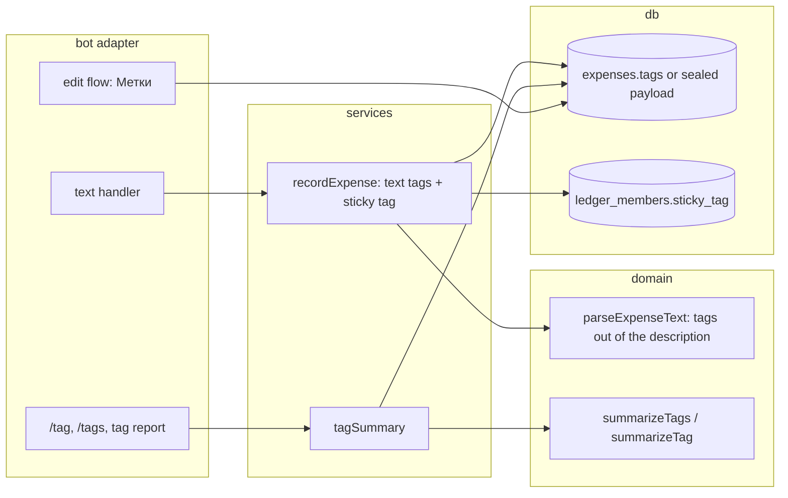

# 0012: Tags for projects: `#отпуск` on an expense, and a report per tag

> **Status:** approved
> **Created:** 2026-09-30
> **Depends on:** [Plan 0019](done/0019-encrypted-personal-ledger.md) (the sealed payload carries tags),
> [Plan 0024](done/0024-export-and-data-ownership.md) (export gains a tags column)
> **Related ADRs:** [ADR-0029](../adrs/0029-tags-on-the-expense-row.md) (tag syntax and storage),
> [ADR-0004](../adrs/0004-amount-parsing-rule.md) (amount parsing),
> [ADR-0008](../adrs/0008-category-suggestion-from-history.md) (learning by description),
> [ADR-0022](../adrs/0022-fx-nbs-middle-rate-ledger-currency.md) (converted totals)

## TL;DR

An expense can carry tags next to its category: `450 кофе #отпуск #рим`. The tags are taken out
of the description, shown on the confirmation, and created on first use in the ledger. For a trip,
`/tag отпуск` turns on a sticky tag that every expense gets until it is switched off. `/tags` lists
the ledger's tags with their all-time totals, and a tap shows one tag's total by category,
converted into the ledger's currency, with its first and last date. The first thing the user sees:
`450 кофе #отпуск` confirms «… — кофе · Кафе и рестораны · #отпуск», and `/tags` answers
«#отпуск — 450.00 RSD».

## Context & problem

Categories answer "what kind of spending". They can't answer "what did this trip cost", because the
trip is spread over Кафе, Транспорт and Жильё. Today the user adds it up by hand from `/month`.
The idea comes from ZenMoney's "projects as a second category".

## Decision

Follow ADR-0029. `parseExpenseText` returns `tags` alongside the description and strips them from
it. Plaintext ledgers store tags in `expenses.tags`. Sealed ledgers store them inside the sealed
payload. Tag reports group the ledger's expenses in a domain function, never in SQL. The sticky
tag is a nullable `ledger_members.sticky_tag` in plaintext ledgers, and in sealed ledgers it lives
in an in-memory map that a restart clears. A tag button carries the first 8 hex digits of the
SHA-256 of the tag's name, which the handler resolves against the ledger's current tags.

We rejected a per-expense tag picker on the confirmation (one tap per expense, against the zero-tap
path), and a tag filter on `/week` and `/month` (a trip spanning two months needs two views). We
also rejected normalized tag tables (ADR-0029, Alternative A).

## Architecture diagram



## Implementation phases

Each phase ships as its own commit. `dev` implements all phases in one session with no review
between phases. The architect reviews once at the end, in a fresh session. All new copy goes in
`src/bot/messages.ts`, in Russian.

### Phase 1: Walking skeleton: `#отпуск` is stored and `/tags` lists it
- **Owner skill:** dev
- **What:**
  - `parseExpenseText` extracts tags per ADR-0029. A tag is a word matching
    `#[\p{L}\p{N}_]{1,32}` that isn't the amount or the currency. It's removed from the
    description before the date suffix is read. Names are normalized to NFC lower case and
    de-duplicated in first-seen order. The `expense` and `ambiguous` results gain
    `tags: readonly string[]`.
  - More than 5 distinct tags gives a new result `{ kind: 'tooManyTags' }`, answered with
    `messages.tooManyTags`. A text whose description is empty once tags are removed stays
    `invalid`.
  - The next free migration adds `expenses.tags TEXT` (NULL for none). `recordExpense` stores the
    space-joined names, and the description key is computed from the stripped description.
  - The confirmation (`expenseLine` and its callers) appends ` · #a #b` after the category when
    the expense has tags.
  - `/tags` (private, active ledger) lists each tag in the ledger's live expenses with its
    converted all-time total, most recently used first. It shows 8 per page with the house pager,
    and an empty ledger gets `messages.tagsEmpty`.
- **Files touched:** `src/domain/expenseText.ts` (+ test), `src/domain/tags.ts` (+ test),
  `src/db/migrations/00NN_tags.sql`, `src/db/expenses.ts` (+ test), `src/services/recordExpense.ts`
  (+ test), `src/services/tagSummary.ts` (+ test), `src/bot/handlers/tags.ts`,
  `src/bot/handlers/text.ts`, `src/bot/callbackData.ts`, `src/bot/callbacks.ts`,
  `src/bot/messages.ts`, `src/bot/bot.ts`, `src/bot/bot.test.ts`.
- **Done when:**
  - `450 такси #Отпуск #рим вчера` (today `2026-10-01`) parses to 45000 minor units, description
    `такси`, tags `['отпуск', 'рим']`, date `2026-09-30`.
  - `450 кофе #отпуск #ОТПУСК` gives tags `['отпуск']`. `450 кофе#отпуск` gives no tags and the
    description `кофе#отпуск`. `450 кофе #` gives no tags and the description `кофе #`.
  - `450 #отпуск` is `invalid`. Six distinct tags give `tooManyTags`, and nothing is recorded.
  - `450 кофе #отпуск` after `450 кофе` filed under Кафе gets Кафе from history, because the
    description key is `кофе`.
  - With `450 кофе #отпуск` and `12,50 EUR такси #отпуск` on record in an RSD ledger, and the
    EUR rate of that day `{ unit: 1, middleE4: 1171234 }`, `/tags` shows `#отпуск` at
    `1 914.04 RSD`. That's 45000 + 146404 = 191404 minor units, where 1250 × 1171234 / 10000 =
    146404.25 rounds to 146404.
  - A soft-deleted tagged expense drops out of `/tags`.

### Phase 2: The per-tag report
- **Owner skill:** dev
- **What:**
  - Each tag on `/tags` is a button `tag:s:<8 hex>` (14 bytes). It edits the screen into the tag
    report:
    - the converted total;
    - the number of expenses;
    - the first and last `occurred_on`;
    - the categories by converted amount, largest first;
    - unconverted currencies on their own lines, as `/month` shows them (ADR-0022);
    - [« Назад] back to the list page it came from (`tag:l:<page>`).
  - A hash that matches no current tag (its expenses were deleted) answers with the toast
    `messages.tagGone` and re-renders the list.
- **Files touched:** `src/domain/tags.ts` (+ test), `src/services/tagSummary.ts` (+ test),
  `src/bot/handlers/tags.ts`, `src/bot/callbackData.ts`, `src/bot/messages.ts`,
  `src/bot/bot.test.ts`.
- **Done when:**
  - With the Phase 1 data plus 450 RSD filed under Кафе and the EUR taxi under Транспорт, the
    `#отпуск` report reads a total of `1 914.04 RSD` and 2 expenses. Транспорт `1 464.04 RSD` is
    listed before Кафе `450.00 RSD`.
  - An expense dated `2026-09-28` and one dated `2026-09-30` give the range «28.09–30.09».
  - Tag-button data for a 32-character Cyrillic tag is 14 bytes and passes `assertCallbackData`.
  - A `tag:s:` tap for a tag whose only expense was deleted answers `tagGone`.

### Phase 3: The sticky trip tag
- **Owner skill:** dev
- **What:**
  - `/tag отпуск` (private, active ledger) sets the member's sticky tag (normalized like a text
    tag) and replies `messages.stickyTagOn` with [Снять метку] (`tag:off`).
  - `/tag` with no argument shows the current sticky tag with [Снять метку], or
    `messages.stickyTagNone` with a usage example.
  - `/tag` with an invalid name replies with the usage.
  - Every expense recorded into that ledger by that member gets the sticky tag in addition to its
    text tags, de-duplicated. Every recording path counts: text, receipt and bank SMS. The
    5-tag cap counts the sticky tag.
  - `tag:off` clears it and edits the message to `messages.stickyTagOff`.
  - The confirmation shows the sticky tag like any other tag, so the user always sees it applied.
- **Files touched:** the next free migration (`ledger_members.sticky_tag TEXT`),
  `src/db/ledgers.ts` (+ test), `src/services/stickyTag.ts` (+ test),
  `src/services/recordExpense.ts` (+ test), `src/services/recordReceipt.ts`,
  `src/services/recordBankSms.ts`, `src/bot/handlers/tags.ts`, `src/bot/callbackData.ts`,
  `src/bot/messages.ts`, `src/bot/bot.test.ts`.
- **Done when:**
  - After `/tag отпуск`, `300 такси #рим` records tags `['рим', 'отпуск']`: text tags first, then
    the sticky tag.
  - After `/tag отпуск`, `300 такси #отпуск` records `['отпуск']` once.
  - A receipt recorded while the sticky tag is set carries it.
  - After [Снять метку], `300 такси` records no tags. A second tap is harmless.
  - The sticky tag applies only to the ledger where it was set. Switching the active ledger
    doesn't carry it over.

### Phase 4: Editing tags, the card, and groups
- **Owner skill:** dev
- **What:**
  - The edit flow's field choice gains [Метки] (`exp:ef:<uuid>:g`, 46 bytes). Its prompt is
    `messages.tagsPrompt`: «Отправьте метки через пробел, например «#отпуск #рим», или «-»,
    чтобы убрать все.» The answer replaces the expense's tags. Text that isn't `-` and has no
    valid tag is refused with the prompt repeated (ADR-0009). An expense-shaped answer is refused
    as the other edit prompts refuse it.
  - The expense card shows tags like the confirmation.
  - In a bound group, `#tags` in a group expense are stored the same way. `/tag` and `/tags` work
    on the group's ledger, and the sticky tag belongs to the member who set it. Both join
    `messages.groupCommands`.
- **Files touched:** `src/services/editExpense.ts` (+ test), `src/bot/handlers/edit.ts`,
  `src/bot/handlers/card.ts`, `src/bot/flows.ts`, `src/services/flowSessions.ts`,
  `src/bot/callbackData.ts`, `src/bot/group/text.ts`, `src/bot/group/index.ts`,
  `src/bot/group/tags.ts`, `src/bot/messages.ts`, `src/bot/bot.test.ts`,
  `src/bot/group/group.test.ts`.
- **Done when:**
  - Editing tags to `#ремонт` on an expense tagged `#отпуск` makes `/tags` list `#ремонт` and not
    `#отпуск` (when it was the only one).
  - The answer `-` clears the tags. The answer `кофе` is refused, and the expense keeps its tags.
  - In a group, member A's sticky tag doesn't tag member B's expenses.
  - The group `/tags` lists tags from both members' expenses.

### Phase 5: Sealed ledgers, export, help
- **Owner skill:** dev
- **What:**
  - In a sealed ledger (Plan 0019), tags go into the sealed payload, and `expenses.tags` stays
    NULL.
  - `/tags` and the tag report go through the decrypting read seam and answer Plan 0019's locked
    message while the ledger is locked.
  - In a sealed ledger the sticky tag lives in an in-memory map keyed by ledger and member, and
    `ledger_members.sticky_tag` is never written there. Its confirmation `stickyTagOnSealed` adds
    that it lasts until the bot restarts.
  - Export (Plan 0024) gains a «Метки» column after Описание: space-separated `#names`.
  - `/help` gains a tags paragraph, and the README its commands.
- **Files touched:** `src/domain/sealing.ts` (payload shape) (+ test), `src/db/expenses.ts`
  (+ test), `src/services/stickyTag.ts` (+ test), `src/services/tagSummary.ts` (+ test),
  `src/services/exportLedger.ts` (+ test), `src/domain/export/rows.ts` (+ test),
  `src/bot/messages.ts`, `src/bot/bot.test.ts`, `README.md`.
- **Done when:**
  - In a sealed ledger, `450 кофе #лечение` leaves `expenses.tags` NULL, and the raw row holds no
    byte sequence of «лечение» (UTF-8). After `/unlock`, `/tags` lists `#лечение`.
  - While locked, `/tags` answers the locked message.
  - In a sealed ledger, `/tag отпуск` writes nothing to `ledger_members`. A restarted bot (new
    process state over the same database) records the next expense without the tag.
  - An exported row for `450 кофе #отпуск #рим` has `#отпуск #рим` in Метки.

### Phase 6: A trip in real use
- **Owner skill:** human
- **Blocks merge:** no
- **What:** On the deployed bot, turn on `/tag` for a few days of real spending, including a
  receipt and a foreign-currency expense, then check `/tags` and the report.
- **Done when:** Every expense from those days carries the tag on its confirmation, and the
  report's total matches the sum of those confirmations as converted (or is listed unconverted
  where no rate exists).

## Data shapes

```sql
-- illustrative
ALTER TABLE expenses ADD COLUMN tags TEXT;              -- 'отпуск рим'; NULL: none or sealed
ALTER TABLE ledger_members ADD COLUMN sticky_tag TEXT;  -- plaintext ledgers only
```

```ts
// illustrative
type TagName = string & { readonly __brand: 'TagName' }; // normalized: NFC, lower case, 1-32 chars
const MAX_TAGS_PER_EXPENSE = 5;
// callback_data: tag:l:<page> | tag:s:<sha256(name) first 8 hex> | tag:off
```

## Risks & open questions

- **Money.** Tag totals reuse `summarizeConverted`. Converting each expense separately and then
  adding means the tag report agrees with `/month` to the minor unit for the same expenses. An
  expense with two tags counts fully in each tag's report. Tags are not a partition, and the
  report doesn't claim they sum to anything.
- **Time.** First and last dates are `occurred_on` local dates. There's no window math, so no
  timezone hazard.
- **Privacy.** Tag names are user data. They're never logged above debug, and they're sealed in
  sealed ledgers. In a plaintext ledger they're as visible as descriptions already are.
- **Hash collisions.** 32 bits over one ledger's tags: the chance of a collision among 1 000 tags
  is about 1 in 8 600. On a collision the handler shows the first match. That's acceptable, and
  stated rather than engineered away.
- **Idempotency.** Tags arrive with the expense on the same update, so the expense's source key
  covers them. `/tag` and `tag:off` are set-to-value, so repeats are harmless.
- **Grammar change.** `#` at a word start now means a tag. An existing expense whose description
  holds `#1` keeps its stored description, and only new texts are parsed the new way.

## What this plan does NOT do

- Budgets per tag (after Plan 0011, if wanted).
- Renaming, merging or archiving tags.
- A trip switching the ledger's default currency for its duration.
- Tag suggestions or autocomplete.
- Tags on the `/week`, `/month` or budget screens.

## Implementation log

> Written by `dev`: one row per phase as its commit lands, then the close block. **The phases
> above are the contract. This section records what happened.** Observations, never conclusions:
> no pass list, no self-assessment. Deviations and unmet done-whens are **always** disclosed.
> Keep it shorter than `## Implementation phases`.

| phase | owner | state | commit |
|---|---|---|---|
| 1: Walking skeleton: `#отпуск` is stored and `/tags` lists it | dev | not started | |
| 2: The per-tag report | dev | not started | |
| 3: The sticky trip tag | dev | not started | |
| 4: Editing tags, the card, and groups | dev | not started | |
| 5: Sealed ledgers, export, help | dev | not started | |
| 6: A trip in real use | human | not started | |

### Notes

### Close triggers

## Followups
