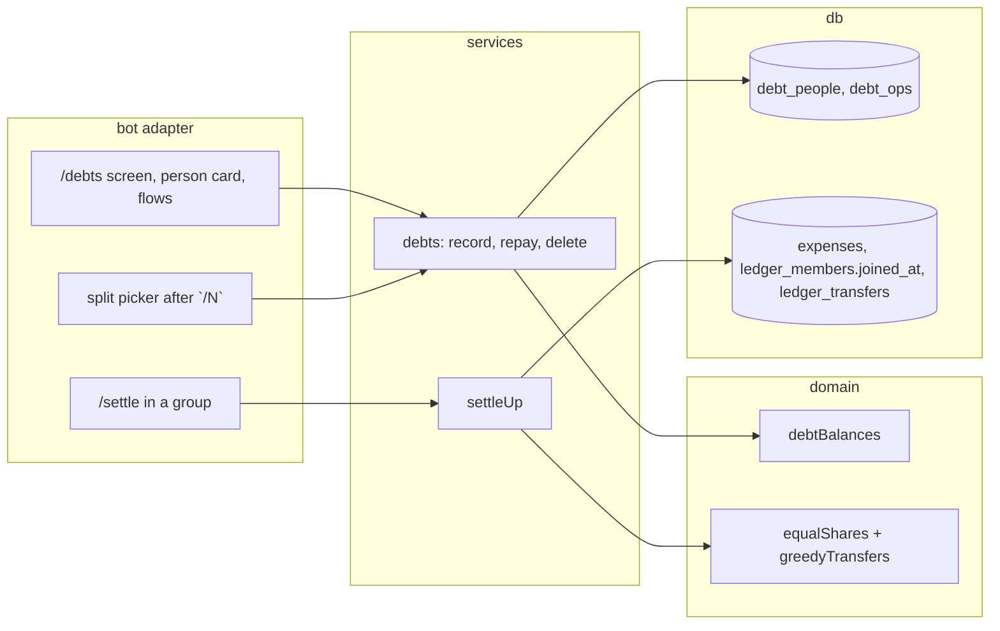

# 0013: Debts: who owes whom, closed in the currency they were opened in

> **Status:** in-progress
> **Created:** 2026-09-30
> **Depends on:** [Plan 0019](done/0019-encrypted-personal-ledger.md) (sealed debts in Phase 5)
> **Related ADRs:** [ADR-0030](../adrs/0030-debts-as-operations-settle-up-per-currency.md) (the debt and settle-up model),
> [ADR-0003](../adrs/0003-currency-conversion-at-report-time.md) (original amounts),
> [ADR-0009](../adrs/0009-persisted-flow-sessions.md) (flows),
> [ADR-0014](../adrs/0014-group-chats-bind-to-shared-ledgers.md) (group ledgers),
> [ADR-0020](../adrs/0020-sealed-ledgers-write-open-read-locked.md) (sealed ledgers)

## TL;DR

`/debts` shows who owes you and whom you owe, per person and per currency: «Петя — должен вам
3 000.00 RSD». [Я дал в долг] and [Я взял в долг] ask for the amount, then the person, picked
from a button list or typed as a new name. A person's card records full or partial repayments,
always in the debt's own currency. `1000 кафе /3` records your share (333.34 RSD) as the expense
and asks which two people owe you 333.33 RSD each. In a group, `/settle` splits every group
expense equally per currency, shows the fewest transfers that square it, and records a transfer
with [Перевёл]. Debts never count as spending. The first thing the user sees: `/debts`, then
[Я дал в долг], `5000`, «Петя», and `/debts` shows «Петя — должен вам 5 000.00 RSD».

## Context & problem

A loan isn't an expense. Recording it as one inflates the month, and a repayment has no home,
since the bot has no income. A shared bill paid by one person is part expense and part loan. In a
group ledger, Plan 0009 deferred settle-up: the per-person totals exist, but nobody can see who
owes whom. ADR-0030 records the model and its rejected alternatives.

## Decision

Follow ADR-0030. Personal debts are operations in `debt_ops`, summed per person and currency,
against a per-user list of names in `debt_people`. People are picked by button, so Russian case
endings never have to be parsed. Names are typed once, in any form the user likes. Group
settle-up is computed on read from the group's live expenses, `ledger_members.joined_at` and
`ledger_transfers`. Nothing here touches `/today`, `/week`, `/month`, budgets, tags or export.

We rejected free-text debt syntax («дал Пете 5000»): one person appears in several case forms,
so typed names don't match. We rejected Telegram users as counterparties for personal debts:
that is two-sided state, and the group settle-up covers members. Receipt splitting by line items
waits for a later plan.

## Architecture diagram



## Implementation phases

Each phase ships as its own commit. `dev` implements all phases in one session with no review
between phases. The architect reviews once at the end, in a fresh session. All new copy goes in
`src/bot/messages.ts`, in Russian. People's names are user text: they're HTML-escaped and never
logged above debug.

### Phase 1: Walking skeleton: lend to Петя, see it in `/debts`
- **Owner skill:** dev
- **What:**
  - The next free migration adds `debt_people` and `debt_ops` (Data shapes).
  - `/debts` (private) shows the debts screen. It has one line per person and non-zero currency,
    with people who owe you first, then people you owe, each group by name. Each line is
    «<name> — должен вам <money>» or «<name> — вы должны <money>». An empty state is
    `messages.debtsEmpty`. The buttons are [Я дал в долг] (`dbt:new:l`) and
    [Я взял в долг] (`dbt:new:b`).
  - [Я дал в долг] starts a flow (ADR-0009) with a cancel button.
    - Step 1, the amount: `<amount> [CUR]` parsed by the amount rules (ADR-0004). The currency
      defaults to the personal ledger's.
    - Step 2, the person: a button per known person (`dbt:pick:<id>`), 8 per page, plus a typed
      new name. A name is 1–40 characters after trimming. A typed name equal to an existing one,
      ignoring case, reuses it.
  - The operation is recorded with the update's source key (UNIQUE). The bot replies
    `messages.debtRecorded` with [Удалить] (`dbt:del:<uuid>`).
  - `/debts` joins `messages.commands`.
- **Files touched:** `src/db/migrations/00NN_debts.sql`, `src/db/debts.ts` (+ test),
  `src/domain/debts.ts` (+ test), `src/services/debts.ts` (+ test), `src/bot/handlers/debts.ts`,
  `src/bot/flows.ts`, `src/services/flowSessions.ts`, `src/bot/callbackData.ts`,
  `src/bot/callbacks.ts`, `src/bot/messages.ts`, `src/bot/bot.ts`, `src/bot/bot.test.ts`.
- **Done when:**
  - [Я дал в долг], `5000`, then the new name «Петя» records `lend` 500000 minor units RSD. Then
    `/debts` shows «Петя — должен вам 5 000.00 RSD».
  - A second lend of `20 EUR` to the existing Петя (picked by button) adds a line
    «Петя — должен вам 20.00 EUR». Nothing is converted or summed across currencies.
  - Typing «петя» as a new name reuses Петя instead of creating a second person.
  - A redelivered final update records one operation.
  - `/today` and `/month` totals are unchanged by any debt operation.
  - The `dbt:del:<uuid>` data is 44 bytes.

### Phase 2: Borrowing, the person card, and repayments
- **Owner skill:** dev
- **What:**
  - [Я взял в долг] runs the same flow and records `borrow`.
  - Each person on `/debts` is a button (`dbt:p:<id>`) that opens their card, edited in place:
    - their balances;
    - the last 10 operations, with date and kind;
    - [Мне вернули] when some currency is positive, and [Я вернул] when some is negative;
    - [« Назад].
  - A repayment asks for the currency when the person has more than one non-zero balance in that
    direction (`dbt:rc:<id>:<CUR>`). It then asks for the amount, offering [Весь долг] for the full
    balance. A typed amount in the debt's currency is accepted. A different currency is refused
    with `debtWrongCurrency`, and an amount larger than the balance is refused with `debtTooMuch`.
    Both refusals keep the flow waiting.
  - [Удалить] on any operation's confirmation soft-deletes it. A second tap answers «Уже удалено».
- **Files touched:** `src/db/debts.ts` (+ test), `src/domain/debts.ts` (+ test),
  `src/services/debts.ts` (+ test), `src/bot/handlers/debts.ts`, `src/bot/flows.ts`,
  `src/bot/callbackData.ts`, `src/bot/messages.ts`, `src/bot/bot.test.ts`.
- **Done when:**
  - Lend 5000 RSD, then [Мне вернули] `2000`, shows «Петя — должен вам 3 000.00 RSD»
    (500000 − 200000 = 300000).
  - [Весь долг] on that balance records 300000, and Петя disappears from `/debts` (zero balance),
    while their card still shows the history.
  - With Петя owing 3000 RSD and 20 EUR, [Мне вернули] asks for the currency first. `20 USD` is
    refused, and `25` in EUR is refused as too much.
  - Borrow 20 EUR from Аня shows «Аня — вы должны 20.00 EUR». [Я вернул] `20` clears it.
  - Deleting the 2000 repayment brings Петя back to 5 000.00 RSD.

### Phase 3: Splitting a bill with `/N`
- **Owner skill:** dev
- **What:**
  - `parseExpenseText` reads a standalone word `/N` with N from 2 to 20 as a split. It's removed
    from the description. A text with two split words is `invalid`.
  - In a private chat, a split expense of amount A records your share `A − (N−1) × floor(A/N)`
    as the expense. The confirmation says the share and the whole («ваша доля из …»). The bot
    then asks, in a flow on the confirmation, which N−1 people owe `floor(A/N)` each:
    - toggle buttons per known person (`dbt:sp:<id>`), plus typing a new name;
    - [Готово], active once exactly N−1 are chosen;
    - [Пропустить].
  - [Готово] records one `lend` per chosen person, in the expense's currency. [Пропустить]
    records none, and the expense stays at your share.
  - A split in a group chat isn't recorded. It answers `messages.splitInGroup` («В группе траты
    делятся поровну автоматически: /settle»).
- **Files touched:** `src/domain/expenseText.ts` (+ test), `src/domain/debts.ts` (+ test),
  `src/services/recordExpense.ts` (+ test), `src/services/debts.ts` (+ test),
  `src/bot/handlers/text.ts`, `src/bot/handlers/debts.ts`, `src/bot/flows.ts`,
  `src/bot/group/text.ts`, `src/bot/callbackData.ts`, `src/bot/messages.ts`,
  `src/bot/bot.test.ts`.
- **Done when:**
  - `1200 кафе /3` records 40000 minor units as the expense and two `lend` operations of 40000
    each.
  - `1000 кафе /3` records 33334 (100000 − 2 × 33333) as the expense, and two lends of 33333.
    Their sum is 100000.
  - `1000 кафе /3 вчера` dates the expense yesterday, with the description `кафе`.
  - `1000 кафе /1`, `/21` and `/3 /2` are refused, and nothing is recorded.
  - [Готово] is inert with 1 person chosen and works with 2.
  - [Пропустить] leaves the 33334 expense and no debts.
  - A redelivered `1000 кафе /3` records one expense and starts one picker.

### Phase 4: Group settle-up
- **Owner skill:** dev
- **What:**
  - The next free migration adds `ledger_members.joined_at`, backfilled for existing rows with
    their ledger's `created_at`. `joinMember` sets it to now for a new member. It also adds
    `ledger_transfers` (Data shapes).
  - `/settle` in a bound group posts:
    - «Делим поровну на: <names>»;
    - per currency, each member's balance (paid minus equal shares plus or minus transfers,
      ADR-0030);
    - the greedy transfer list, each with [Перевёл] (`stl:t:<i>:<8 hex>`, at most 17 bytes),
      where the hex is the first 8 digits of a SHA-256 over the computed transfer list;
    - [Я тоже участвую] (`stl:join`).

    A group with nothing owed gets `messages.settleEven`.
  - [Я тоже участвую] joins the tapper with `joined_at` = now, and re-renders the message.
  - [Перевёл] can be tapped only by the transfer's payer or receiver. Others get the toast
    `settleNotParty`. The handler recomputes the list. If the hash doesn't match, it answers
    `staleScreen` and re-renders. Otherwise it records the transfer and posts
    `messages.transferRecorded` with [Удалить] (`stl:del:<uuid>`, 44 bytes, payer or receiver
    only). Then it re-renders the `/settle` message.
  - An expense is shared among the members whose `joined_at` local date (in the ledger's
    timezone) is on or before the expense's `occurred_on`.
  - `/settle` joins `messages.groupCommands`.
- **Files touched:** the next free migration, `src/db/ledgers.ts` (+ test),
  `src/db/transfers.ts` (+ test), `src/domain/settleUp.ts` (+ test), `src/services/settleUp.ts`
  (+ test), `src/bot/group/settle.ts`, `src/bot/group/index.ts`, `src/bot/callbackData.ts`,
  `src/bot/messages.ts`, `src/bot/group/group.test.ts`.
- **Done when:**
  - Members A, B and C. A pays 3000 RSD and B pays 1000 RSD. Then:
    - A's balance is +166667 minor units (+300000 − 300000/3 shared, minus 33333 of B's).
    - B's is −33334 (−100000 + 66666).
    - C's is −133333.
    - The balances sum to 0.
    - The transfers are C → A 1 333.33 RSD, then B → A 333.34 RSD.
  - After [Перевёл] on C → A, `/settle` shows only B → A 333.34 RSD.
  - Deleting that transfer restores both lines.
  - A 20 EUR expense paid by A adds a separate EUR section. No RSD figure changes.
  - Member D, joined on `2026-10-05`, owes nothing for an expense with `occurred_on`
    `2026-10-04`. For one on `2026-10-05`, D's share is counted.
  - A [Перевёл] tap after a new expense changed the list answers `staleScreen` and records nothing.
  - A non-party's tap records nothing.

### Phase 5: Sealed debts, help and docs
- **Owner skill:** dev
- **What:**
  - When the user's personal ledger is sealed (Plan 0019), each `debt_ops` row's amount, currency
    and kind go into a sealed payload, and so does each `debt_people` name. Every debts screen
    shows names, so while locked `/debts`, the person cards and the lend/borrow flows answer Plan
    0019's locked message until `/unlock`. Debts are rare enough that this costs little. Group
    settle-up is never sealed, because shared ledgers aren't (ADR-0020).
  - While locked, the split picker can't show names. A split in a sealed, locked ledger records
    the share and answers `splitLocked`, asking the user to `/unlock` and add the debts from
    `/debts`.
  - `/help` gains a debts paragraph and a `/settle` line in the group help. The README lists the
    commands.
- **Files touched:** `src/domain/sealing.ts` (+ test), `src/db/debts.ts` (+ test),
  `src/services/debts.ts` (+ test), `src/bot/handlers/debts.ts`, `src/bot/messages.ts`,
  `src/bot/bot.test.ts`, `README.md`.
- **Done when:**
  - In a sealed ledger, a lend to «Петя» leaves no UTF-8 «Петя» bytes in `debt_people` and no
    plaintext amount column value in `debt_ops`. After `/unlock`, `/debts` shows the balance.
  - While locked, `/debts` answers the locked message.
  - A locked split records the share and answers `splitLocked`.

### Phase 6: Real debts and a real group
- **Owner skill:** human
- **Blocks merge:** no
- **What:** Record a real loan and a partial repayment, split one real bill with `/N`, and run
  `/settle` in the family group after a week of shared spending.
- **Done when:** The balances match what everyone agrees they owe, and [Перевёл] squares the
  group.

## Data shapes

```sql
-- illustrative
CREATE TABLE debt_people (
  id INTEGER PRIMARY KEY,
  user_id TEXT NOT NULL REFERENCES users(id),
  name TEXT,                -- NULL when sealed
  name_key TEXT,            -- lower-cased name for reuse; NULL when sealed
  sealed BLOB,
  created_at TEXT NOT NULL
);
CREATE TABLE debt_ops (
  id TEXT PRIMARY KEY,
  user_id TEXT NOT NULL REFERENCES users(id),
  person_id INTEGER NOT NULL REFERENCES debt_people(id),
  kind TEXT CHECK (kind IN ('lend', 'borrow', 'repaid_to_me', 'i_repaid')),  -- NULL when sealed
  amount_minor INTEGER CHECK (amount_minor > 0),                              -- NULL when sealed
  currency TEXT,                                                              -- NULL when sealed
  sealed BLOB,
  occurred_on TEXT NOT NULL,
  expense_id TEXT REFERENCES expenses(id),  -- set for a split's lends
  source_key TEXT NOT NULL UNIQUE,
  created_at TEXT NOT NULL,
  deleted_at TEXT
);
ALTER TABLE ledger_members ADD COLUMN joined_at TEXT;   -- backfilled from ledgers.created_at
CREATE TABLE ledger_transfers (
  id TEXT PRIMARY KEY,
  ledger_id TEXT NOT NULL REFERENCES ledgers(id),
  from_user TEXT NOT NULL REFERENCES users(id),
  to_user TEXT NOT NULL REFERENCES users(id),
  amount_minor INTEGER NOT NULL CHECK (amount_minor > 0),
  currency TEXT NOT NULL,
  created_by TEXT NOT NULL REFERENCES users(id),
  source_key TEXT NOT NULL UNIQUE,
  created_at TEXT NOT NULL,
  deleted_at TEXT
);
```

A sealed person can't be matched by name in SQL. Reuse of a typed name is checked in memory
against the decrypted list. That always works, because debts are only recorded while unlocked.

## Risks & open questions

- **Money.** All splits are integer division with the remainder stated: the payer's or splitter's
  share takes `A − (n−1) × floor(A/n)`. No balance is ever converted (ADR-0030). Tests assert
  that the sums of parts equal the whole.
- **Time.** Membership compares `joined_at`'s local date in the ledger's timezone with
  `occurred_on`. A member joining at 00:30 local shares that day's expenses.
- **Idempotency.** Every debt operation and transfer carries the update's source key (UNIQUE).
  [Перевёл] re-validates its hash before recording, so a double-tap after the first transfer
  answers stale.
- **Privacy.** Names and amounts are never logged above debug. A group's `/settle` shows only
  group expenses and members' first names, never a member's personal debts.
- **Group membership is implicit.** A member who never records or taps [Я тоже участвую] isn't
  counted. The «Делим поровну на» line makes that visible.
- **Tombstoned members** (Plan 0029's deleted accounts) stay in past splits under
  «удалённый участник». Their balance is shown but can't be settled with [Перевёл], since they
  can't tap. This is a known gap, recorded here.

## What this plan does NOT do

- Splitting a receipt by its line items. That's a follow-on plan once debts exist.
- Unequal shares in a group, or excluding a member from one expense.
- Debt reminders (Plan 0025's scheduler could add them).
- Debts in export (Plan 0024 covers expenses only).
- Loans with interest, or credit accounts.
- Debt simplification across people in personal debts.

## Implementation log

> Written by `dev`: one row per phase as its commit lands, then the close block. **The phases
> above are the contract. This section records what happened.** Observations, never conclusions:
> no pass list, no self-assessment. Deviations and unmet done-whens are **always** disclosed.
> Keep it shorter than `## Implementation phases`.

| phase | owner | state | commit |
|---|---|---|---|
| 1: Walking skeleton: lend to Петя, see it in `/debts` | dev | done | 3ddc64e |
| 2: Borrowing, the person card, and repayments | dev | done | be1fc27 |
| 3: Splitting a bill with `/N` | dev | done | 828bb5e |
| 4: Group settle-up | dev | done | f64bc9b |
| 5: Sealed debts, help and docs | dev | not started | |
| 6: Real debts and a real group | human | not started | |

### Notes

- Phase 1: the migration is `0017_debts.sql`. `debt_ops.expense_id` is `ON DELETE SET NULL`, not
  a plain reference: `/delete_account` hard-deletes personal-ledger expenses, and a plain
  reference would fail it once a split lend points at one. It adds CHECKs tying the sealed and
  plaintext columns together, and a unique `(user_id, name_key)` index.
- Phase 1: the person picker pages with `dbt:pp:<page>`, a callback the phase doesn't name.
- Phase 1: the confirmation (`messages.debtRecorded` with [Удалить]) is edited into the anchor
  that held the prompt, not sent as a new reply. A tapped pick's source key is
  `cb:<callback query id>`.
- Phase 1: an amount that reads two ways (`1.200`) is refused with `debtAmountRefused` instead of
  being asked about.
- Phase 1: `src/bot/callbacks.ts` needed no change.
- Phase 2: edited `src/services/flowSessions.ts`, outside the phase's `Files touched`: the
  repayment flow (`debtRepay`) and the card's `personId` on the debts screen live there.
- Phase 2: callbacks the phase doesn't name: `dbt:list` ([« Назад] on the card),
  `dbt:rp:<id>:<t|i>` ([Мне вернули] / [Я вернул]) and `dbt:all` ([Весь долг]). Only people with
  a non-zero balance get a button on `/debts`.
- Phase 2: [Удалить] edits the confirmation into `messages.debtDeleted` (the operation and the
  person's balance after it) with the toast «Удалено».
- Phase 3: edited `src/services/flowSessions.ts` again, outside the phase's `Files touched`, for
  the split picker's flow (`debtSplit`) and the screen's `splitOf`.
- Phase 3: the split picker is a new message replying to the expense card, not the card itself.
  It lists every known person with no paging. [Готово] is `dbt:spok`, [Пропустить] `dbt:spx`.
- Phase 3: starting the picker marks the expense message's key as answered, so a redelivered
  `1000 кафе /3` gets no reply at all rather than a second card.
- Phase 3: in both person steps, a typed name that parses as an expense is refused
  (`debtPersonRefused.expenseShaped`).
- Phase 3: a split amount that reads two ways and is answered by button (`ambiguous.ts`, outside
  the phase) records the share, with no picker.
- Phase 3: in a group, `recordGroupExpense` still provisions the sender and joins them as a
  member before the split is refused. No test covers the group's `splitInGroup` reply. The
  split tests are in `bot.test.ts`; `recordExpense.test.ts` and `services/debts.test.ts` gained
  none.
- Phase 4: the migration is `0018_settle_up.sql`. `joinMember` takes a required `joinedAt`, so
  `src/services/groupChats.ts`, outside the phase's `Files touched`, now passes the message's
  `now`. `insertMember` (the owner, at binding) still writes no `joined_at`; `listMembers` reads a
  NULL as the ledger's `created_at`.
- Phase 4: no `src/db/transfers.test.ts` or `src/services/settleUp.test.ts` was written. The
  done-whens are tested in `src/domain/settleUp.test.ts` and `src/bot/group/group.test.ts`.
- Phase 4: the D done-when is tested as a member who joins on the group's today: they owe
  nothing for an expense dated yesterday («вчера») and share one dated today. The dates are the
  harness's 2026-09-29 and 2026-09-30, not 2026-10-04 and 2026-10-05.
- Phase 4: [Я тоже участвую] provisions an unknown tapper (`provisionUser`) before joining
  them. A stale [Перевёл] gets the `staleScreen` toast and the `/settle` message is re-rendered.
  [Удалить] under a transfer edits it to `messages.transferDeleted` and does not re-render
  `/settle`.
- Phase 5 not started: the conductor session ran out of budget after Phase 4 and parked. Things
  for the resuming `dev`, none of them acted on:
  - `/delete_account` (`src/services/deleteAccount.ts`) doesn't delete `debt_people` or
    `debt_ops`, so a deleted user's debts survive. No phase lists that file.
  - Switching encryption on (`src/services/sealLedger.ts`) doesn't seal debts recorded before.
    No phase lists that file either.
  - The person step's flow payload (`debtPerson`) holds the amount and currency in plaintext in
    `flow_sessions` for up to `FLOW_TTL_MS`.

### Close triggers

## Followups
