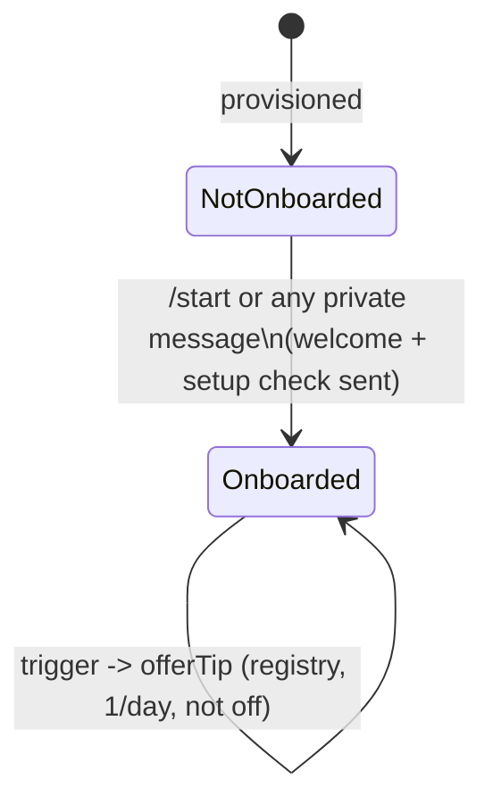

# 0015: Onboarding: confirm the setup on first contact, then teach each feature when it becomes relevant

> **Status:** in-progress
> **Created:** 2026-10-01
> **Depends on:** [Plan 0019](done/0019-encrypted-personal-ledger.md) (the encryption tip),
> [Plan 0024](done/0024-export-and-data-ownership.md) (`/export`), [Plan 0029](done/0029-opening-by-invite.md)
> (`/start <code>`, `/privacy`)
> **Related ADRs:** [ADR-0028](../adrs/0028-contextual-tips-registry.md) (the tips registry),
> [ADR-0011](../adrs/0011-navigation-model.md) (menu and screens),
> [ADR-0009](../adrs/0009-persisted-flow-sessions.md) (flows),
> [ADR-0037](../adrs/0037-first-time-notices-and-transient-replies.md) (`user_notices`, kept apart
> from tips)

## TL;DR

A user the bot has never onboarded gets two messages on first contact. The first is a short
welcome carrying the menu keyboard. The second is a setup check: «Часовой пояс: Белград, у вас
сейчас 14:05? Валюта по умолчанию: RSD» with [Да, всё верно] and [Изменить]. [Изменить] turns the
check into the existing `/settings` hub. After that, short tips appear when a feature becomes
relevant: after the first expense, an expense in «Другое», a foreign currency, `/today`,
`/month`, a receipt, the 20th and 50th expense, and the settings hub. That's at most one tip per
day, and each one can be switched off. `/start` replays the tour. Existing users get no setup
check, but do get the tips. The first thing a stranger sees: they open an invite link, the
welcome and the setup check arrive, and they tap [Да, всё верно].

## Context & problem

The bot has grown: categories, past dates, editing, summaries, settings, groups, budgets,
receipts, bank SMS, and soon export and encryption. Today `/start` sends one welcome
(`messages.welcome`) with one example. Users are provisioned silently on their first message
(`ensureUser`), so "first contact" has to mean "never onboarded", not "first `/start`". The
timezone and currency default from env, which is right for the household and wrong for most
strangers. Plan 0029 lists this plan as a prerequisite for opening the bot.

The flow and copy come from a `ux-telegram` design pass (2026-10-01), folded in here.

## Decision

Onboarding state is two columns on `users` (`onboarded_at` and `tips_off`) and a `user_tips`
table. A user counts as onboarded once the setup check is **sent**, so a user who ignores it isn't
asked again. The welcome and the setup check are two messages because Telegram allows only one
keyboard per message: the welcome carries the reply menu, and the check carries the inline
buttons. So the check needs no flow session, and [Изменить] just hands over to the existing
settings hub. Tips follow ADR-0028.

We rejected asking before recording a first expense (the zero-tap rule, ADR-0002). We rejected a
hands-on walkthrough or card carousel (decided in the stub interview). We rejected pushing the
setup check to existing users (the stub interview).

## Architecture diagram



## Implementation phases

Each phase ships as its own commit. `dev` implements all phases in one session with no review
between phases. The architect reviews once at the end, in a fresh session. All new copy goes in
`src/bot/messages.ts`, in Russian, with the exact wording given here. The 💡 marker in tip copy is
bot UI.

### Phase 1: Walking skeleton: a new user gets the welcome and the setup check
- **Owner skill:** dev
- **What:**
  - The next free migration adds `users.onboarded_at TEXT` and `users.tips_off INTEGER NOT NULL
    DEFAULT 0`, plus `user_tips` (Data shapes). It sets `onboarded_at` to the migration time for
    every existing user.
  - `/start` from a user with `onboarded_at` NULL (including Plan 0029's `/start <code>` after a
    successful redemption) sends `welcome` with the menu keyboard, then `setupCheck` with
    [Да, всё верно] (`onb:ok`) and [Изменить] (`onb:edit`). `onboarded_at` is set just before the
    setup check is sent.
  - `/start` from an onboarded user (the deep-link payloads `e_` and `gs_` keep their current
    handling) replays: it clears the user's `user_tips` rows, sets `tips_off` to 0, and sends the
    same two messages. A replay leaves `user_notices` (ADR-0037) untouched: notices are never
    replayed.
  - `onb:ok` edits the message to `setupConfirmed`, with no keyboard. `onb:edit` edits it into
    the settings hub (`set:open`'s screen, with the hub as the anchor). Both answer the callback,
    and a repeat is harmless.
  - Copy:
    - `welcome`: «Здравствуйте! Я веду учёт трат.» / «Отправьте сумму и описание, например
      «450 кофе», и я запишу трату. Валюту можно указать после суммы: «12,50 EUR такси».» /
      «Итоги открываются кнопками меню внизу, остальные команды — в «☰ Ещё». Подробности: /help.»
      (`☰ Ещё` interpolated from `messages.menu.more`) / «Ваши траты видны
      только вам. Выгрузить всё: /export. Как хранятся данные: /privacy.»
    - `setupCheck({ timezone, localTime, currency })`: «Проверьте настройки:» /
      «Часовой пояс: <город>, у вас сейчас <HH:MM>?» / «Валюта по умолчанию: <CUR>». `localTime`
      is the current time in the user's timezone.
    - `setupOkButton` «Да, всё верно», `setupEditButton` «Изменить».
    - `setupConfirmed({ timezone, currency })`: «Настройки сохранены: <город>, <CUR>. Изменить их
      можно в /settings.»
  - `/help` gains the line «/start — знакомство заново: настройки и подсказки».
  - `deleteAccount` (`src/services/deleteAccount.ts`) also deletes the user's `user_tips` rows,
    beside `deleteUserNotices` (Plan 0029 has landed, see Data shapes).
- **Files touched:** `src/db/migrations/00NN_onboarding.sql`, `src/db/users.ts` (+ test),
  `src/db/userTips.ts` (+ test), `src/services/onboarding.ts` (+ test),
  `src/bot/handlers/start.ts`, `src/bot/handlers/settings.ts`, `src/bot/callbackData.ts`,
  `src/bot/callbacks.ts`, `src/bot/messages.ts`, `src/services/deleteAccount.ts` (+ test),
  `src/bot/bot.test.ts`.
- **Done when:**
  - A new user's `/start` produces exactly two messages, `welcome` with the reply menu and then
    `setupCheck`. Afterwards `onboarded_at` is set.
  - With the user's timezone `Europe/Belgrade` and now `2026-10-01T12:05:00Z`, the setup check
    reads «у вас сейчас 14:05» (CEST is UTC+2 until 2026-10-25).
  - `onb:ok` edits the check to `setupConfirmed` naming the stored city and currency. A second
    `onb:ok` raises no error.
  - `onb:edit` shows the settings hub in the same message, and a timezone picked there is stored.
  - A user present before the migration has `onboarded_at` set, and their `/start` replays.
  - A replay deletes that user's `user_tips` rows and sets `tips_off` to 0, and leaves other users'
    rows untouched. It leaves that user's `user_notices` rows untouched.
  - `/delete_account` leaves no `user_tips` row for the user.
  - The callback data `onb:ok` (6 bytes) and `onb:edit` (8 bytes) pass `assertCallbackData`.

### Phase 2: A first message that isn't `/start`
- **Owner skill:** dev
- **What:**
  - Any private-chat message from a user with `onboarded_at` NULL is handled exactly as today
    (an expense is recorded and confirmed, a receipt is read, a command runs). After the
    handler's reply, the bot sends `welcome` and then `setupCheck`. When the user then has at
    least one expense, `setupCheck` starts with `setupAfterExpense`.
  - Stray input (Plan 0034's `sendStrayReply`: an unknown command, text that isn't an expense, a
    non-text message) from a user with `onboarded_at` NULL gets no stray reply: the welcome and the
    setup check stand in for it, and `stray_help` is marked seen (the welcome points to /help).
  - A callback query or a group update never triggers onboarding.
  - Copy: `setupAfterExpense({ currency })`: «Трату выше я записал в <CUR>. Если валюта другая,
    нажмите под ней [Изменить] → [Сумма] и отправьте сумму с валютой, например «450 RUB».» (The
    amount edit accepts `<amount> <CUR>`: `parseAmountAnswer` in `src/services/editExpense.ts`.)
- **Files touched:** `src/bot/middleware/onboarding.ts` (+ test), `src/bot/bot.ts`,
  `src/services/onboarding.ts` (+ test), `src/bot/handlers/help.ts`, `src/bot/messages.ts`,
  `src/bot/bot.test.ts`.
- **Done when:**
  - A new user's first message `450 кофе` records 45000 minor units in the default currency and
    replies with the usual confirmation, followed by `welcome`, then `setupCheck` opening with
    `setupAfterExpense`. That's three messages in that order, and no tip, because the tip check
    runs while `onboarded_at` is still NULL.
  - Their second message `300 такси` gets only the confirmation.
  - A redelivered first update (same `update_id`) records one expense, and the onboarding pair is
    sent at most once, because `onboarded_at` is set by then.
  - A new user's first message `/today` gets the today screen, then the pair, without
    `setupAfterExpense`.
  - A new user's first sticker gets exactly two messages, `welcome` then `setupCheck`, and no full
    help. Their second sticker gets `notUnderstood`.

### Phase 3: The tips registry and the recording tips
- **Owner skill:** dev
- **What:**
  - `src/domain/tips.ts` holds the registry (ADR-0028): `{ key, trigger, condition(ctx) }`
    entries, in priority order. `pickTip(registry, trigger, ctx, seenKeys)` is pure.
  - `offerTip(ctx, deps, user, trigger, tipContext)` in the bot adapter calls the service. The
    service returns nothing when any of these holds:
    - `tips_off` is set;
    - the user isn't onboarded;
    - a `user_tips` row has a `shown_at` on the user's current local date;
    - a text flow is pending;
    - the chat isn't private.

    Otherwise it inserts the `user_tips` row, then sends the tip with [Отключить подсказки]
    (`tip:off`).
  - `tip:off` sets `tips_off` = 1, answers with the toast `tipsOff`, and removes the button from
    that message.
  - The settings hub gains a row: [Подсказки: вкл] or [Подсказки: выкл] (`set:tips`, toggles and
    re-renders).
  - The recording tips, all on trigger `expenseRecorded` (text, receipt and bank-SMS paths, after
    the confirmation), in this priority order:
    - `tipOther`: the expense's category is the fallback preset.
    - `tipForeign`: the expense's currency differs from the ledger's default.
    - `tipFirstExpense`: always.
  - `tipPastDate`, on trigger `todayShown` (after the `/today` screen is sent): always.
  - Copy:
    - `tipFirstExpense`: «💡 Категорию я подбираю сам и запоминаю ваши исправления. Под
      подтверждением: [Категория], [Изменить] и [Удалить].»
    - `tipOther`: «💡 Категорию не узнал и записал в «Другое». Выберите её кнопкой [Категория], и
      для такого же описания я дальше буду выбирать её сам.»
    - `tipForeign({ from, to })`: «💡 Траты в <from> я пересчитываю в <to> по курсу НБС на день
      траты, поэтому в итогах всё в одной валюте.»
    - `tipPastDate`: «💡 Забыли записать вчера? Добавьте дату последним словом: «450 такси вчера»
      или «450 такси 25.09».»
    - `tipsOffButton` «Отключить подсказки», `tipsOff` «Подсказки отключены. Включить: /settings».
    - `tipsToggleOn` «Подсказки: вкл», `tipsToggleOff` «Подсказки: выкл».
- **Files touched:** `src/domain/tips.ts` (+ test), `src/db/userTips.ts` (+ test),
  `src/services/tips.ts` (+ test), `src/bot/tips.ts`, `src/bot/handlers/text.ts`,
  `src/bot/handlers/receipt.ts`, `src/bot/handlers/today.ts`, `src/bot/handlers/settings.ts`,
  `src/bot/callbackData.ts`, `src/bot/callbacks.ts`, `src/bot/messages.ts`,
  `src/bot/bot.test.ts`.
- **Done when:**
  - `pickTip` for `expenseRecorded` with a fallback-category EUR expense in an RSD ledger and
    nothing seen returns `tipOther`. With `tipOther` seen it returns `tipForeign`. With both seen
    it returns `tipFirstExpense`. With all three seen it returns nothing.
  - For an onboarded user in `Europe/Belgrade`, a tip shown at `2026-10-01T21:30:00Z` (23:30
    local) blocks another at `2026-10-01T21:59:00Z` (23:59 local). A trigger at
    `2026-10-01T22:00:00Z` (00:00 on 2 October local) gets the next tip.
  - A redelivered `450 кофе` update sends one tip at most, because the row is written before
    the send.
  - With `tips_off` = 1, no trigger sends a tip. [Подсказки: выкл] in the hub sets it back to 0.
  - With a pending category-rename flow, a recorded expense sends no tip.
  - An expense recorded in a group sends no tip.
  - A tip held back by the daily cap shows on the next day's first matching trigger.

### Phase 4: The feature tips and the group welcome
- **Owner skill:** dev
- **What:**
  - These are registry entries:
    - `tipBudget`, trigger `monthShown` (after the `/month` screen): the ledger has no budget limit
      set.
    - `tipReceipt`, trigger `expenseRecorded`, placed before `tipFirstExpense`: the expense came
      from a receipt.
    - `tipGroup`, trigger `expenseRecorded`, placed before `tipFirstExpense`: the ledger is
      personal and the user has at least 20 non-deleted expenses in it.
    - `tipExport`, trigger `expenseRecorded`, placed before `tipFirstExpense`: the active ledger
      has at least 50 non-deleted expenses.
    - `tipEncrypt`, trigger `settingsShown` (after the hub is sent or edited in): the active
      ledger is personal, owned by the user, and not sealed (Plan 0019).
  - Copy:
    - `tipBudget`: «💡 Можно задать бюджет на месяц, и после каждой траты я покажу, сколько
      осталось на сегодня: /budget.»
    - `tipReceipt`: «💡 Магазины я запоминаю: следующий чек из этого магазина получит ту же
      категорию.»
    - `tipGroup`: «💡 Ведёте общие траты с семьёй? Добавьте меня в группу: там каждый записывает
      свои траты, а /month покажет итоги по участникам.»
    - `tipExport`: «💡 Все траты можно выгрузить в Excel или CSV: /export.»
    - `tipEncrypt`: «💡 Траты можно зашифровать паролем: прочитать их сможете только вы.
      Включается здесь, в настройках.»
  - `groupWelcome` gains the line «Итоги: /month. Часовой пояс и валюту группы меняет тот, кто меня
    добавил: /settings.»
- **Files touched:** `src/domain/tips.ts` (+ test), `src/services/tips.ts` (+ test),
  `src/bot/handlers/summary.ts`, `src/bot/handlers/settings.ts`, `src/bot/handlers/text.ts`,
  `src/bot/handlers/receipt.ts`, `src/bot/messages.ts`, `src/bot/bot.test.ts`.
- **Done when:**
  - `pickTip` gives `tipGroup` at a count of 20 and nothing new at 19, all else seen. It gives
    `tipExport` at 50 and not at 49.
  - `/month` on a ledger with a budget limit never yields `tipBudget`. Without one, it does.
  - On a sealed ledger, or a shared one, the settings hub never yields `tipEncrypt`.
  - A recorded receipt with `tipReceipt` unseen yields `tipReceipt`, not `tipFirstExpense`.
  - The bound-group welcome contains `/month` and `/settings`.
  - Every tip key in the registry has a message, and every tip message has a registry entry (a
    test walks both).

### Phase 5: A stranger's first contact
- **Owner skill:** human
- **Blocks merge:** no
- **What:** From a second Telegram account set to a different city than the env default, open a
  fresh invite link (Plan 0029). Go through the setup check with [Изменить], record an expense,
  then a EUR expense the next day.
- **Done when:** The welcome and the setup check arrive with the right local time. [Изменить]
  stores the new timezone and currency. The first expense brings one tip, and a second tip on
  the same day doesn't appear. The next day's EUR expense brings `tipForeign`. [Отключить
  подсказки] stops further tips.

## Data shapes

```sql
-- illustrative
ALTER TABLE users ADD COLUMN onboarded_at TEXT;                    -- NULL: never onboarded
ALTER TABLE users ADD COLUMN tips_off INTEGER NOT NULL DEFAULT 0;  -- 0 | 1
UPDATE users SET onboarded_at = <migration time>;                  -- existing users: no setup check

CREATE TABLE user_tips (
  user_id TEXT NOT NULL REFERENCES users(id),
  tip TEXT NOT NULL,          -- registry key, e.g. 'tipOther'
  shown_at TEXT NOT NULL,     -- UTC instant; the daily cap compares its local date
  PRIMARY KEY (user_id, tip)
);
```

```ts
// illustrative
type TipTrigger = 'expenseRecorded' | 'todayShown' | 'monthShown' | 'settingsShown';
interface TipContext {
  readonly ledgerKind: 'personal' | 'shared';
  readonly ledgerCurrency: CurrencyCode;
  readonly expense?: { currency: CurrencyCode; fallbackCategory: boolean; fromReceipt: boolean };
  readonly ledgerExpenseCount: number;
  readonly hasBudgetLimit: boolean;
  readonly sealed: boolean;
  readonly ownsLedger: boolean;
}
```

Callback data: `onb:ok` (6 bytes), `onb:edit` (8), `tip:off` (7), `set:tips` (8).

Plan 0029's `/delete_account` must also delete the user's `user_tips` rows. If 0029 has landed
first, Phase 1 adds that delete to its deletion service.

## Risks & open questions

- **Idempotency.** `onboarded_at` and the `user_tips` row are both written before their message is
  sent, so a redelivered update never sends a second pair or a second copy of a tip. The cost is
  that a failed send loses the message, which is accepted (ADR-0028).
- **Message bursts.** The worst case is three messages for one user action: an expense-first
  confirmation, the welcome and the setup check. Telegram's limit is about one per second per
  chat in bursts. That's acceptable once per user.
- **Time.** The daily cap uses the user's timezone, not the server's, and the setup check's clock
  makes a wrong timezone visible. A user who changes timezone mid-day may get a second tip that
  day, which is harmless.
- **Privacy.** Tips carry no amounts or descriptions. `tipForeign` names only currency codes.
  `user_tips` holds keys and instants.
- **Copy drift.** Tip copy names buttons ([Категория], [Изменить], [Сумма]). A later rename of a
  button must update the tip. The Phase 4 key-to-message test doesn't catch that, so the review
  checks it.

## What this plan does NOT do

- Onboarding for a member's first message in a group. Only the group's own welcome changes.
- A donation tip (ADR-0027 keeps donations to places the user looks).
- Localisation beyond Russian.
- A tip history or a "show all tips" screen. `/help` is the full reference.

## Implementation log

> Written by `dev`: one row per phase as its commit lands, then the close block. **The phases
> above are the contract. This section records what happened.** Observations, never conclusions:
> no pass list, no self-assessment. Deviations and unmet done-whens are **always** disclosed.
> Keep it shorter than `## Implementation phases`.

| phase | owner | state | commit |
|---|---|---|---|
| 1: Walking skeleton: a new user gets the welcome and the setup check | dev | done | 8bc02c1 |
| 2: A first message that isn't `/start` | dev | done | 52228f2 |
| 3: The tips registry and the recording tips | dev | done | 8520ac7 |
| 4: The feature tips and the group welcome | dev | done | 4a8eed0 |
| 5: A stranger's first contact | human | not started | |

### Notes

- Phase 1: files outside `Files touched`, approved by the user in session: `src/bot/testHarness.ts`
  gains `createTestBot({ onboarding })`, off by default, where a temp trigger marks every new user
  onboarded at creation; `src/bot/middleware/access.test.ts` and `src/bot/group/group.test.ts`
  follow the argument-less `welcome` and the second /start message.
- Phase 1: the `onb:ok` / `onb:edit` handlers live in `src/bot/handlers/start.ts`;
  `src/bot/callbacks.ts` is unchanged.
- Phase 2: files outside `Files touched`, approved by the user in session: `countLiveExpenses` in
  `src/db/expenses.ts` (+ test), for `hasOwnExpense` here and the Phase 4 counts;
  `onboardOnCreate(db)` exported from `src/bot/testHarness.ts` and called by the test bots that
  `bot.test.ts` and `src/bot/handlers/unlock.test.ts` build with `createBot`.
- Phase 2: "the user has at least one expense" reads as a live expense the user created in the
  active ledger.
- Phase 3: with tips on, a new user's second message (`300 такси`) also brings `tipFirstExpense`,
  because the user is onboarded by then. Phase 2's "only the confirmation" and the redelivery test
  run with tips off.
- Phase 3: `src/bot/testHarness.ts` (outside `Files touched`): `onboardOnCreate` became
  `quietFirstContact(db, { onboarding, tips })`. Tips are off for test users unless a test asks,
  with a temp trigger that keeps them off through the /start replay.
- Phase 3: `tip:off` is registered from `registerSettings` via `registerTipsOff` in
  `src/bot/tips.ts`, because `src/bot/bot.ts` isn't in this phase's list. Its keyboard removal
  treats "message is not modified" as success locally. The tip ledger is the expense's ledger
  for `expenseRecorded`, otherwise the active ledger.
- Phase 4: `settingsShown` fires after `/settings` and after `set:open` back to the personal hub.
  It doesn't fire after the setup check's [Изменить]: a `tipEncrypt` there would take the day's
  tip, and Phase 5 expects the first expense to bring one.
- Phase 4: `src/bot/tips.ts` (outside this phase's list) passes `fromReceipt` through to the
  service.
- Followup, not acted on: a receipt is recorded in «Другое» until its store is fetched, so a
  user's first receipt brings `tipOther` ahead of `tipReceipt`.
- Followup, not acted on: an expense recorded through the ambiguous-amount buttons
  (`src/bot/handlers/ambiguous.ts`) offers no tip, because that path isn't among the plan's
  text, receipt and bank-SMS paths.

### Close triggers

- **What shipped:** feature
- **User-visible surface changed:** commands: `/start` sends the new welcome and the setup check,
  and replays them for an onboarded user; messages: `welcome` (rewritten, no arguments),
  `setupCheck`, `setupAfterExpense`, `setupOkButton`, `setupEditButton`, `setupConfirmed`,
  `tips.*` (one per registry key), `tipsOffButton`, `tipsOff`, `tipsToggleOn`, `tipsToggleOff`, a `/start`
  line in `help`, and a `/month` and `/settings` line in `groupWelcome`; the settings hub gains
  [Подсказки: вкл/выкл]; callback data: `onb:ok`, `onb:edit`, `tip:off`, `set:tips`;
  config/env keys: none; schema migrations: `0022_onboarding.sql`.
- **Gate at the tip:** `pnpm typecheck` exit 0; `pnpm lint` exit 0; `pnpm test` exit 0, 110 files,
  1568 tests passed; `pnpm build` exit 0; `node scripts/check-doc-links.mjs` exit 0 (269 links).
- **Outstanding `human` phases:** Phase 5 (a stranger's first contact), owed after the deploy.

## Followups
