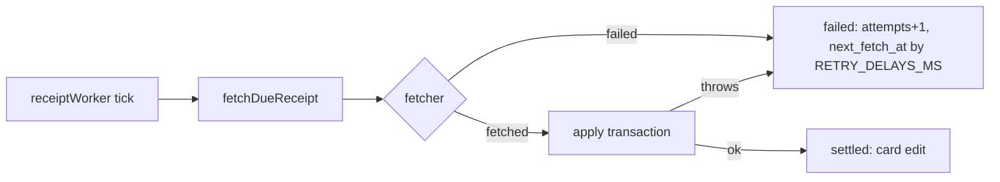

# 0016: Close findings: receipt backoff, links with a note, group dates, caps currency, budget navigation

> **Status:** in-progress (2026-10-01)
> **Created:** 2026-10-01
> **Related ADRs:** [ADR-0018](../adrs/0018-receipts-record-offline-enrich-async.md),
> [ADR-0015](../adrs/0015-shared-ledgers-carry-a-timezone.md),
> [ADR-0017](../adrs/0017-budgets-payday-periods-cumulative-allowance.md),
> [ADR-0011](../adrs/0011-navigation-model.md)

## TL;DR

This plan fixes the open findings from the close reviews of Plans 0009, 0011 and 0014, and one
left over from 0003. Each fix is listed by `conductor.mjs finding NNNN`. The most urgent: a receipt
whose fetched data fails to apply is refetched from the tax site every 5 s, forever. After this
plan it backs off like any other failed fetch. The others: a pasted SUF link with a note after it
goes to the expense parser instead of «ссылка повреждена»; a group expense opened in DM shows and
edits dates in the ledger's timezone; category caps are dropped, with a line saying so, when a
re-set limit changes the budget's currency; and the budget screens get their missing back rows.
It is a fix-only plan: patch bump to v0.9.1.

## Context & problem

The three plans merged with no blockers or majors. Their open minors and nits, verified against
`main` at `a5e0832`:

- **0014 minor 3:** `fetchDueReceipt` applies a fetched receipt in one transaction. A throw there
  rolls back and leaves the receipt `pending` with its `next_fetch_at` unchanged.
  `receiptWorker.ts` catches per drain, so the next tick (`TICK_MS`, 5 s) fetches it again.
- **0014 minor 2:** the [Повторить] double-tap test can't fail on its "fetches once" half, and
  nothing tests the worker's in-flight guard.
- **0014 minor 1:** `rsUrl.ts`'s `URL_PATTERN` matches `[^#]*` to the end of the text, so
  `<link> кофе` and `<link>\n450 кофе` are refused as `malformed`. Plan 0014 Phase 1 says a link
  next to other words is not a receipt.
- **0014 nit:** `tsconfig.build.json` compiles `src/domain/receipts/testing/` and
  `src/fiscal/qr.fixtures/generate.ts` into `dist/`, and the image ships them. The Dockerfile's
  decode check imports `buildRsVl`.
- **0009 minor:** `card.ts` (`sentOn`) and `editExpense.ts` (`today`, three places) use the
  viewer's timezone. For a group expense, the zone is the ledger's (ADR-0015).
- **0011 minor 2:** `category_caps` has no currency. It borrows `ledger_budgets.currency`, which
  `setBudgetLimit` replaces when the ledger's default currency has changed. A 5 000 RUB cap
  becomes 5 000 EUR.
- **0011 minor 3 and both nits:** the budget screen opened from a settings hub has no
  [« Назад]. The cap prompt has no way back to the cap list. The group `/budget` tells the group
  «Задайте лимит заново», which no one there can do.
- **0003 minor:** `/help` doesn't mention `/cancel`. Its other half (categories) is covered now.

## Decision

Fix each finding the way its review suggested. One call is a product decision. **When a re-set
limit changes the budget's currency, the ledger's category caps are deleted in the same
transaction, and the confirmation says so.** That keeps ADR-0017's rule that a budget's amounts
are in one currency. We rejected a `currency` column on `category_caps`, because a cap in a
currency other than the budget's would need its own "not counted" state on every screen. That's
more surface than the rare currency change is worth.

No ADR: the other fixes restore what a plan or ADR already says.

## Architecture diagram



## Implementation phases

Each phase ships as its own commit. Phases are independent and can land in any order. The order
here puts the external-load fix first.

### Phase 1: A receipt whose data fails to apply backs off
- **Owner skill:** dev
- **What:** In `fetchDueReceipt`, a throw from the apply transaction becomes a failed attempt
  through `failed(deps, receipt, 'error', now)`, the same path as a fetcher throw. It logs ids and
  the error's name only. The worker gets a test of its in-flight guard, and the [Повторить]
  double-tap test gets a half that can fail.
- **Files touched:** `src/services/fetchDueReceipt.ts` (+ test), `src/bot/receiptWorker.ts`,
  `src/bot/receiptWorker.test.ts` (new), `src/bot/bot.test.ts`.
- **Done when:**
  - `fetchDueReceipt.test.ts`: the fetcher answers, and applying the answer throws. The test
    injects the throw, for example through an item the insert rejects. The receipt stays
    `pending` with `attempts = 1` and `next_fetch_at = now + 60_000 ms`, and no items are stored.
    A second `fetchDueReceipt` at the same `now` returns `idle` and doesn't call the fetcher. At
    `now + 60_000 ms` it calls the fetcher again (2 calls in all).
  - `receiptWorker.test.ts`: with a fetcher gated on a promise the test holds, `kick()` twice
    while the first fetch is in flight, then release the gate. The fetcher was called exactly once
    for that receipt.
  - The [Повторить] double-tap test in `bot.test.ts` uses a fetcher that succeeds. After the
    double tap and one `fetchDueReceipt`, a second `fetchDueReceipt` returns `idle`, and the
    fetcher was called once. Reverting the `resetFailedReceipt` CAS to an unconditional update
    makes the test fail. Check this by hand once, and say so in the log.

### Phase 2: A SUF link with a note after it is not a receipt; test code stays out of the image
- **Owner skill:** dev
- **What:** `decodeRsUrl` stops treating whitespace followed by non-base64 text as part of `vl`.
  Such a message is `notReceipt` and goes to the expense parser. A `vl` that form-decoding split
  with spaces still decodes. The build excludes test-only code. The Dockerfile's decode check then
  asserts through production modules only.
- **Files touched:** `src/domain/receipts/rsUrl.ts` (+ test), `tsconfig.build.json`, `Dockerfile`.
- **Done when:**
  - `rsUrl.test.ts`: `buildRsUrl() + ' кофе'` and `buildRsUrl() + '\n450 кофе'` return
    `{ kind: 'notReceipt' }`. The existing `+`, `%2B` and space-in-`vl` cases still decode to
    82912 minor RSD.
  - After `pnpm build`, `dist/` has no `domain/receipts/testing/` and no `fiscal/qr.fixtures/`.
  - The Dockerfile's builder-stage check imports only `dist/fiscal/qr.js` and
    `dist/domain/receipts/index.js`. It keeps `fetch` throwing. It decodes
    `src/fiscal/qr.fixtures/rs-receipt.jpg`, and passes the first text to `decodeReceiptUrl`. It
    exits non-zero unless the result is a receipt of `82912` minor `RSD`. The image build is
    still only seen at deploy, as Plan 0014 Phase 7's first check.

### Phase 3: A group expense in DM uses the ledger's timezone
- **Owner skill:** dev
- **What:** `cardView`'s `sentOn` and the three `today` computations in `editExpense.ts` use
  `effectiveTimezone(deps, user, ledger)` instead of `resolveUserTimezone`. A personal ledger has
  no timezone, so its behavior is unchanged.
- **Files touched:** `src/bot/handlers/card.ts`, `src/services/editExpense.ts` (+ test),
  `src/bot/group/group.test.ts`.
- **Done when:** `group.test.ts`, with `SECOND_ALLOWED_ID` in `America/New_York` and the group
  ledger in `Europe/Belgrade`. `500 такси` is sent in the group at `2026-09-30T23:30:00Z`, which is
  01:30 on 1 October in Belgrade (CEST) and 19:30 on 30 September in New York (EDT). It records
  `occurred_on = '2026-10-01'`. Opened in that member's DM with `/start e_<id>` at the same
  instant:
  - the card has no «за …» date suffix;
  - [Изменить] → date offers `2026-10-01` as today's quick button;
  - typing `01.10` is accepted, not refused as a future date.

  The existing personal-ledger card and edit tests pass unmodified.

### Phase 4: A currency change drops the category caps, and says so
- **Owner skill:** dev
- **What:** In `answerBudgetFlow`'s `budgetLimit` branch, a limit stored in a currency other than
  the budget's current one deletes the ledger's `category_caps` rows. This happens in the same
  transaction as `setBudgetLimit`. The confirmation gains the line «Лимиты по категориям сброшены:
  они были в <old currency>.» from `messages`. A limit re-set in the same currency keeps the caps.
- **Files touched:** `src/db/budgets.ts` (+ test), `src/services/budget.ts` (+ test),
  `src/bot/handlers/budget.ts`, `src/bot/messages.ts`.
- **Done when:** in `budget.test.ts`, a RUB ledger has a limit of `30000` and a cap of `5000` on
  «Кафе и рестораны» (`500_000` minor RUB).
  - Change the ledger default to EUR, then set the limit `1000`. The budget is `100_000` minor
    EUR, the ledger has 0 cap rows, and the result reports the dropped caps' currency `RUB`.
  - On a fresh fixture, with the currency left alone, set the limit `40000`. The budget is
    `4_000_000` minor RUB and the cap is still `500_000`.
  - A failure inside the transaction leaves both the limit and the caps as they were.

### Phase 5: Budget navigation and the read-only group line
- **Owner skill:** dev
- **What:**
  - `BudgetScreen` gets `fromSettings?: true`, carried through `parseScreen` like
    `CategoriesScreen`. `SETTINGS_BUDGET` sets it, and the screen then ends with
    `backRow(SETTINGS_OPEN)`.
  - The cap prompt gets [« Назад] above [Отмена], which reopens the cap list at its first page.
  - The group `/budget` message drops the «Задайте лимит заново…» sentence. The DM screen keeps
    it.
  - `/help` gains a `/cancel — отменить ввод` line.
- **Files touched:** `src/services/flowSessions.ts` (+ test), `src/bot/handlers/budget.ts`,
  `src/bot/handlers/settings.ts`, `src/bot/callbackData.ts`, `src/bot/messages.ts` (+ test),
  `src/bot/bot.test.ts`, `src/bot/group/group.test.ts`.
- **Done when:**
  - The budget screen opened through `set:bud` has a last row [« Назад] whose data is
    `set:open`. Opened with `/budget`, it has no such row. A `fromSettings` screen survives an
    anchor round trip through `parseScreen`.
  - The cap prompt's keyboard is [Убрать лимит] when the category is capped, then [« Назад] with
    data `bud:caps`, then [Отмена]. Tapping [« Назад] cancels the cap flow and shows the cap list.
  - In a ledger whose budget currency differs from its default, the group `/budget` text lacks
    «Задайте лимит заново». The DM `/budget` text contains it.
  - The `/help` text contains `/cancel`, and stays under 4096 characters.

## Data shapes

```ts
// illustrative
interface BudgetScreen {
  readonly name: 'budget';
  readonly ledgerId: LedgerId;
  readonly fromSettings?: true; // opened from a settings hub: ends with [« Назад] to it
}

type SetLimitResult =
  | { kind: 'set'; droppedCapsCurrency?: CurrencyCode } // present when caps were deleted
  | { kind: 'unchanged' };
```

## Risks & open questions

- **Dropping caps is destructive.** It happens only when the user re-sets the limit after changing
  the ledger's currency, and the confirmation names it. The caps were already being counted in the
  wrong currency, so keeping them would be worse.
- **Phase 2's pattern change touches money parsing at the edge.** The existing refusal tests
  (truncation, flipped byte, refund, invoice types) must still pass unmodified.
- **The Dockerfile check is only exercised at deploy.** A failing check aborts
  `docker compose up --build` before the running container is replaced, so the bot stays up.
- **Privacy:** Phase 1's new log line carries the receipt id and the error's name, never the
  amount, URL or fiscal id.

## What this plan does NOT do

- 0009's nit: the per-person section isn't budgeted against 4096 characters. It's won't-fix at
  family scale.
- Remembering the cap list's page for [« Назад]. It returns to the first page.
- Any conductor change. Those are in Plan 0017.

## Implementation log

> Written by `dev`: one row per phase as its commit lands, then the close block. **The phases
> above are the contract. This section records what happened.** Observations, never conclusions:
> no pass list, no self-assessment. Deviations and unmet done-whens are **always** disclosed.
> Keep it shorter than `## Implementation phases`.

| phase | owner | state | commit |
|---|---|---|---|
| 1: A receipt whose data fails to apply backs off | dev | done | 1aac740 |
| 2: A SUF link with a note; test code out of the image | dev | done | b9b047c |
| 3: A group expense in DM uses the ledger's timezone | dev | done | edfecc4 |
| 4: A currency change drops the category caps | dev | parked: plan_wrong | |
| 5: Budget navigation and the read-only group line | dev | not started | |

### Notes

- Phase 1: `src/bot/receiptWorker.ts` is unchanged; the guard test needed no hook in it. The
  apply throw is injected with a test-only `BEFORE INSERT` trigger on `receipt_items`. Checked by
  hand: with the `resetFailedReceipt` CAS made unconditional, the [Повторить] test fails, on its
  toast assertion (the second tap answers «Загружаю позиции»); the fetch half stays green, since
  both taps land before the fetch. With the worker's `inFlight` check removed,
  `receiptWorker.test.ts` fails with 3 fetcher calls. Both reverted.
- Phase 2: the image build was not run. The Dockerfile check's script body was run by hand
  against a local `pnpm build` and printed `ok 82912 RSD`. A note after the link counts as part
  of `vl` only when it follows a space and is all base64 or percent-encoding characters, so a
  Latin-only note such as `<link> abc` still reaches the decoder and is refused `malformed`.
- Phase 3: `editExpense.test.ts` is unchanged; the behavior is tested in `group.test.ts` only.
  With the old zone, typed `01.10` was not refused as a future date: it was read as
  `2025-10-01` and stored. The test asserts the answer completes the flow and leaves
  `occurred_on = '2026-10-01'`, which fails on the old code. Each of the three changed sites
  was reverted by hand once and failed its half of the test.
- Phase 4 parked before any code, as `plan_wrong`. The confirmation after a typed limit is
  rendered by `answerFlow`'s `'set'` case in `src/bot/flows.ts`, which calls
  `budgetView(deps, user, { name: 'budget', ledgerId })` and drops the rest of
  `answerBudgetFlow`'s result. Showing «Лимиты по категориям сброшены…» needs that call site to
  pass `droppedCapsCurrency` on to the screen, and `src/bot/flows.ts` is not in Phase 4's
  `Files touched`. Phase 5 was not started.

### Close triggers

- **What shipped:**
- **User-visible surface changed:**
- **Gate at the tip:**
- **Outstanding `human` phases:**

## Followups
