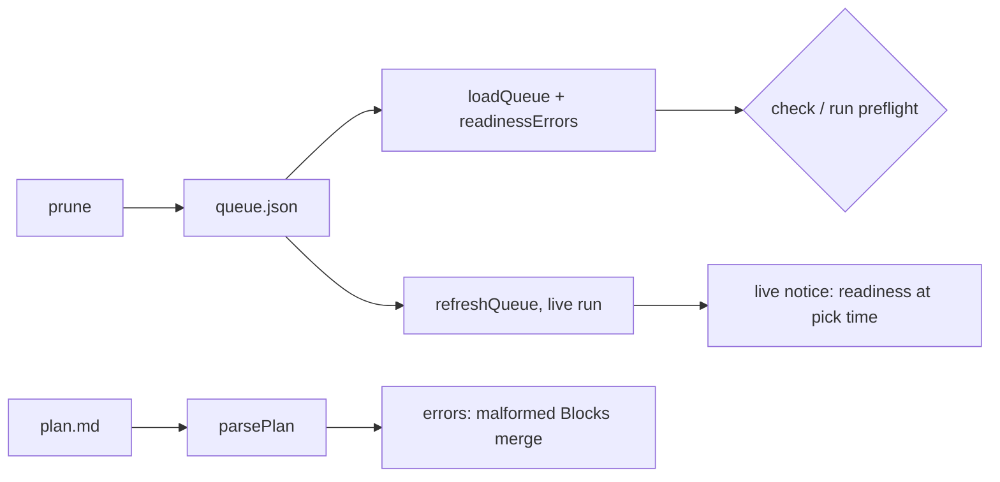

# 0017: Conductor followups: a loud Blocks-merge parse, a clean prune, ready vs the working copy

> **Status:** in-progress (2026-10-01)
> **Created:** 2026-10-01
> **Related ADRs:** ADR-0010, [ADR-0016](../adrs/0016-readiness-runs-before-a-plan-is-queued.md)

## TL;DR

This plan acts on the open conductor followups in `tools/conductor/FOLLOWUPS.md` (F12, F13, F15,
F16, F18), so the next run needs less hand work than the 2026-10-01 morning run. A
`Blocks merge:` line the parser can't read becomes a plan error instead of a silent park. `prune`
leaves no stale `plans` entries. `ready` warns when the plan's committed text differs from the
working copy. A plan queued during a live run says out loud that its readiness waits until the
lane picks it. The readiness prompt checks that each done-when's actor can reach the path it tests.
The first visible behavior: `conductor.mjs check` on a plan reading `- **Blocks merge:** no (why)`
names the phase and the malformed line.

## Context & problem

- **F15:** `plan.mjs` matches `Blocks merge` with `` `?([\w-]+)`?\s*$ ``. A value followed by
  anything else matches nothing, so the phase silently keeps its default and parks the plan
  `human_phase`. This happened while queuing Plans 0009, 0011 and 0014, and was caught by eye.
- **F18:** `pruneQueue` filters merged plans out of `lanes` but leaves their `plans` entries, so
  `after` lists naming merged plans stay behind. They were cleared by hand in `a5e0832`.
- **F13:** `ready` hashes the plan on `main`'s tip, while `check` hashes the main checkout's
  working copy. A `ready` run before committing a plan edit passes on the old text, and then
  `check` refuses.
- **F12:** `refreshQueue` reloads `queue.json` during a live run without `readinessErrors`, and
  `ready` is refused while a run is live. A plan added mid-run skips the queue-time gate. The lane's
  own readiness step still runs when that plan is picked, since the plan has no record.
- **F16:** readiness passed Plan 0009 twice and missed a done-when whose actor, a member who
  isn't allowlisted, could never reach the DM path it tested. The park came mid-implementation.

## Decision

Fix F15, F18 and F13 as described below. For F12, **say it rather than block it**: when
`refreshQueue` takes a queue with a newly listed, unstarted plan that has no matching readiness
record, it logs one live line saying its readiness runs when the lane picks it. The README says
the same. We rejected allowing `ready` during a live run, because it would write the state file
alongside the resident run and needs a locking design for a rare case. We rejected refusing the
new plan, because the lane's run-time readiness already parks a gap before any code is written.
For F16, add a reachability item to `prompts/readiness.md`.

**Run this plan with an interactive `/dev`, not through the conductor.** It changes the
conductor's own sources, which pauses a live run with `stale_sources` at the fast-forward
(Plan 0010).

## Architecture diagram

## Implementation phases

### Phase 1: A malformed `Blocks merge:` line is a plan error
- **Owner skill:** dev
- **What:** `parsePlan` reports an error for any line that starts with `- **Blocks merge:**` but
  whose value isn't exactly `no` or `yes`, optionally in backticks. The error names the phase and
  quotes the line. Today's error for a non-human phase carrying the tag stays.
- **Files touched:** `tools/conductor/lib/plan.mjs`, `tools/conductor/test/plan.test.mjs`.
- **Done when:** `plan.test.mjs` asserts the following. `- **Blocks merge:** no (needs deploy)` on
  a human phase gives an error naming that phase. `` - **Blocks merge:** `no` `` and
  `- **Blocks merge:** no` parse to `blocksMerge: 'no'` with no error. `- **Blocks merge:** maybe`
  still gives the existing "is no or yes" error.

### Phase 2: `prune` removes a merged plan everywhere
- **Owner skill:** dev
- **What:** `pruneQueue` also deletes `plans[<merged>]` and removes merged plans from every
  remaining entry's `after` list. It drops an `after` key left empty, and an entry left with no
  keys.
- **Files touched:** `tools/conductor/lib/queue.mjs`, `tools/conductor/test/queue.test.mjs`.
- **Done when:** `queue.test.mjs` starts from lanes `{ a: ['0009', '0011'], b: ['0012'] }` and
  plans `{ '0011': { after: ['0009'] }, '0012': { after: ['0009'], add_dirs: ['../x'] } }`, with
  0009 and 0011 under `done/`. It prunes to lanes `{ a: [], b: ['0012'] }` and plans
  `{ '0012': { add_dirs: ['../x'] } }`, and the result passes `loadQueue`'s validation.

### Phase 3: `ready` warns about an uncommitted plan edit; a mid-run queue says so
- **Owner skill:** dev
- **What:** After a pass or a park, `ready NNNN` compares `planContractHash` of the plan on `main`'s
  tip with the main checkout's working copy. When they differ, it prints a warning: the working
  copy differs from what was checked, so commit it and run `ready` again, or `check` will refuse.
  `refreshQueue` logs one line per newly listed, unstarted plan without a matching readiness
  record: `NNNN queued during a live run: its readiness runs when the lane picks it`. The README's
  Commands section says both.
- **Files touched:** `tools/conductor/conductor.mjs`, `tools/conductor/lib/lane.mjs`,
  `tools/conductor/README.md`, `tools/conductor/test/cli.test.mjs`,
  `tools/conductor/test/lane.test.mjs`.
- **Done when:**
  - `cli.test.mjs`: `ready` on a plan whose working copy has an uncommitted edit above
    `## Implementation log` prints the warning and still exits 0 on a pass. With the working copy
    equal to `main`, there's no warning. An edit only below `## Implementation log` gives no
    warning, since it's outside the contract hash.
  - `lane.test.mjs`: a queue refreshed mid-run with a new unstarted plan and no readiness record
    writes the notice once, not once per refresh, and the plan stays queued.

### Phase 4: Readiness checks that each done-when's actor can reach its path
- **Owner skill:** dev
- **What:** `prompts/readiness.md` gains one check. For each done-when, the actor it names must be
  able to reach the code path it exercises under the gates already in the tree: the allowlist,
  owner-only screens, DM vs group composers. A done-when that can't is `plan_wrong`, with the gate
  named.
- **Files touched:** `tools/conductor/prompts/readiness.md`.
- **Done when:** the prompt has the check as one item in its existing list, and names the
  allowlist, owner-only and chat-type gates as examples. `node --test
  "tools/conductor/test/*.test.mjs"` passes, so the settings test still covers every command the
  prompts name.

## Data shapes

None new. `pruneQueue` returns the same `{ queue, dropped }`.

## Risks & open questions

- Phase 1 can make an approved plan in the tree fail `check`. Run `check` against every plan under
  `docs/plans/` (not `done/`) once after the phase, and list any that fail in the log.
- Phase 3's working-copy read is of the main checkout only, never a lane.

## What this plan does NOT do

- Allow `ready` during a live run (see Decision).
- Product code. Plan 0016 carries the close findings.

## Implementation log

> Written by `dev`: one row per phase as its commit lands, then the close block. **The phases
> above are the contract. This section records what happened.** Observations, never conclusions:
> no pass list, no self-assessment. Deviations and unmet done-whens are **always** disclosed.
> Keep it shorter than `## Implementation phases`.

| phase | owner | state | commit |
|---|---|---|---|
| 1: A malformed Blocks merge line is a plan error | dev | done | `c90a362` |
| 2: prune removes a merged plan everywhere | dev | done | `a53f3cd` |
| 3: ready warns about an uncommitted edit; mid-run queue notice | dev | done | `7c34987` |
| 4: Readiness checks done-when reachability | dev | done | committed with this row |

### Notes

- Phase 1: `check` validates only queued plans and the queue is empty, so every plan under
  `docs/plans/` was run through `readPlanFile` instead. None carries the new error. 0015 (a draft
  stub) reports `no ## Implementation phases section`, which predates this phase.
- Phase 2, deviation: `test/cli.test.mjs` (outside Phase 2's Files touched) asserted the old
  prune output, which kept `plans: { "0101": { after: ["0090"] } }`. Its expected file now reads
  `plans: {}`. Same commit as the phase.
- Phase 2, followup not acted on: `cmdPrune` rewrites only when a lane entry was dropped, so a
  queue whose lanes are already clean but whose `plans` map names a merged plan reports "nothing
  to prune" and keeps that map.
- Phase 3: `readyOnMain` now also returns `hash` (main's contract hash) with a park, so the
  warning runs after a park as well as a pass.

### Close triggers

- **What shipped:**
- **User-visible surface changed:**
- **Gate at the tip:**
- **Outstanding `human` phases:**

## Followups
