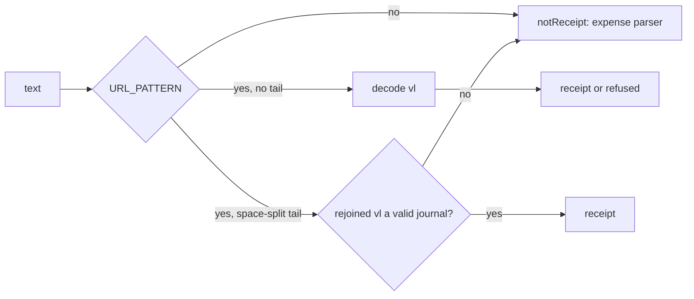

# 0018: A Latin note after a receipt link, the caps-dropped screen test, and a link checker that reads only tracked docs

> **Status:** in-progress (2026-10-01)
> **Created:** 2026-10-01
> **Related ADRs:** [ADR-0018](../adrs/0018-receipts-record-offline-enrich-async.md)

## TL;DR

This plan closes Plan 0016's open nits and conductor followup F21. After it, a pasted SUF link
followed by a Latin note (`<link> kafa`) goes to the expense parser instead of being refused as
«ссылка повреждена». A bot-level test pins the «Лимиты по категориям сброшены» line on the budget
screen. `scripts/check-doc-links.mjs` checks only the markdown git tracks or would track, so
gitignored conductor state can't fail it. This is a fix-only plan: a patch bump to v0.9.2.

## Context & problem

- **0016 nit 1.** `rsUrl.ts`'s `URL_PATTERN` accepts space-separated tail tokens of base64
  characters. It needs them because form-style decoding turns a `+` inside `vl` into a space.
  A Latin word like `kafa` or `lunch` is all base64 characters, so it joins `vl`, the MD5 check
  fails, and the user is told the link is damaged. Plan 0014 Phase 1's rule is that a link next to
  other words is not a receipt. Users in Serbia and Montenegro mostly type Latin.
- **0016 nit 2.** Only the service test covers `droppedCapsCurrency`. Dropping the argument in
  `src/bot/flows.ts` (`answerFlow`'s `'set'` case) would pass the whole suite.
- **F21.** `check-doc-links.mjs` walks the filesystem. In the main checkout it reads the
  gitignored `tools/conductor/state/`. Review prose there (`[Повторить]: the …`) parses as a link
  reference definition and fails the check. CI and lanes have no `state/`, so only the architect's
  close step in the main checkout sees it.

0016 nit 3 needs no work: the toast assertion defends the double tap.

## Decision

- **Decide the space-split tail by the journal, not the characters.** When the query has a
  space-split tail, `decodeRsUrl` decodes the rejoined `vl`. A valid journal is a receipt.
  Anything else is `notReceipt`, never `malformed`, because a space-split tail can't tell a broken
  link from a note. A link with no tail keeps today's behavior, so a truncated link is still
  refused as `malformed`.
- **List files through git.** The checker reads
  `git ls-files --cached --others --exclude-standard '*.md'`, so a new untracked plan is still
  checked and gitignored files never are.

We rejected recording the receipt when a valid link carries a note. That would reverse Plan 0014
Phase 1's rule, and the note would be lost anyway, because a receipt's description comes from
the shop.

## Architecture diagram

## Implementation phases

### Phase 1: A Latin note after a SUF link is not a receipt
- **Owner skill:** dev
- **What:** `decodeRsUrl` applies the rule in Decision. The match keeps accepting the
  space-split tail. Only the outcome of a failed decode changes when a tail was present.
- **Files touched:** `src/domain/receipts/rsUrl.ts` (+ test), `src/bot/bot.test.ts`.
- **Done when:**
  - `rsUrl.test.ts`: these all return `{ kind: 'notReceipt' }`: `buildRsUrl() + ' kafa'`,
    `buildRsUrl() + ' lunch'`, `buildRsUrl() + ' kafa i sok'`, and `buildRsUrl() + ' abcd'`.
  - The existing space-in-`vl` case (every `+` in the link replaced by a space) still decodes to
    `82912` minor `RSD`. A link truncated by 10 characters with no tail is still
    `{ kind: 'refused', reason: 'malformed' }`. The other existing refusal tests pass unmodified.
  - `bot.test.ts`: in DM, `<link> kafa` creates no receipt row and no expense, and the reply isn't
    the damaged-link copy from `messages`.

### Phase 2: The budget screen shows the caps-dropped line
- **Owner skill:** dev
- **What:** a bot-level test only. No production change unless the test exposes a defect.
- **Files touched:** `src/bot/bot.test.ts`.
- **Done when:** in DM, the test runs these steps: set a limit of `30000` (RUB), cap
  «Кафе и рестораны» at `5000`, switch the default currency to EUR through `/settings`, then set
  the limit `1000`. The edited anchor text starts with
  `Лимиты по категориям сброшены: они были в RUB.` Removing the dropped currency from the call in
  `answerFlow`'s `'set'` case makes the test fail. Check this by hand once, revert, and note it in
  the log.

### Phase 3: The link checker reads only what git tracks or would track
- **Owner skill:** dev
- **What:** `markdownFiles` comes from
  `git ls-files -z --cached --others --exclude-standard -- '*.md'`, run at the repository root,
  instead of a directory walk. `SKIP_DIRS` goes away. Output and exit codes are unchanged.
- **Files touched:** `scripts/check-doc-links.mjs`, `scripts/check-doc-links.test.mjs` (new).
- **Done when:** `check-doc-links.test.mjs` runs the script in a temporary git repository with
  four markdown files:
  - a tracked file with a broken link: it exits 1 and names that file;
  - an untracked file that isn't ignored, with a broken link: it's reported too;
  - a gitignored file with a broken link: it's not reported;
  - a tracked file whose links resolve: it exits 0 once the broken ones are fixed.

  In the main checkout, `node scripts/check-doc-links.mjs` exits 0 with `tools/conductor/state/`
  present. `node --test "scripts/*.test.mjs"` passes, as CI runs it.

## Data shapes

None.

## Risks & open questions

- **Phase 1 changes what a damaged link with a tail answers**: «not a receipt» instead of
  «damaged». Without the tail, a damaged link is still refused as damaged, which is the common
  paste.
- **Phase 3 needs `git` on the PATH** wherever the checker runs. It's already a hard dependency of
  every checkout, CI and the conductor.

## What this plan does NOT do

- Record a receipt from a valid link that carries a note (see Decision).
- 0016 nit 3: the double-tap test stays as it is.
- Montenegrin links: `meUrl.ts` ends its match at whitespace and never had this problem.

## Implementation log

> Written by `dev`: one row per phase as its commit lands, then the close block. **The phases
> above are the contract. This section records what happened.** Observations, never conclusions:
> no pass list, no self-assessment. Deviations and unmet done-whens are **always** disclosed.
> Keep it shorter than `## Implementation phases`.

| phase | owner | state | commit |
|---|---|---|---|
| 1: A Latin note after a SUF link is not a receipt | dev | done | committed with this row |
| 2: The budget screen shows the caps-dropped line | dev | not started | |
| 3: The link checker reads only tracked docs | dev | not started | |

### Notes

### Close triggers

- **What shipped:**
- **User-visible surface changed:**
- **Gate at the tip:**
- **Outstanding `human` phases:**

## Followups
