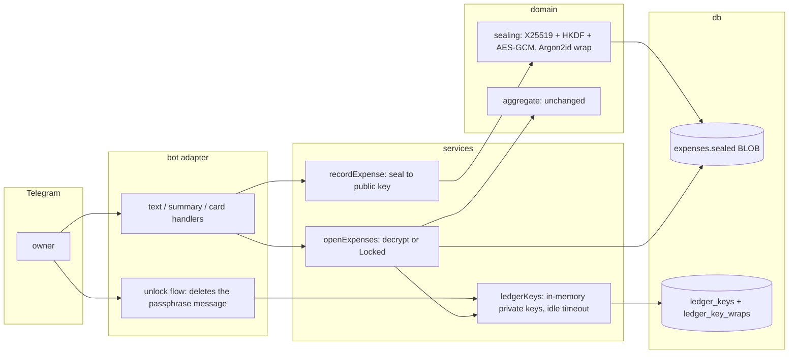

# 0019: Encrypted personal ledger: recording stays open, reading needs the owner's passphrase

> **Status:** approved
> **Created:** 2026-10-01
> **Related ADRs:** ADR-0020 ([0020-sealed-ledgers-write-open-read-locked.md](../adrs/0020-sealed-ledgers-write-open-read-locked.md))

## TL;DR

The owner of a personal ledger can switch on encryption in `/settings`. They choose a
passphrase, and the bot shows a one-time recovery code. From then on, every expense's amount,
description and category is sealed to the ledger's public key, so "450 кофе" records as before.
Reports, the budget screen and the expense card answer "the ledger is locked" until `/unlock`
plus the passphrase. The ledger relocks after a stretch of inactivity, on `/lock` and on every
restart. The first thing the user sees: they enable encryption, `/today` says locked, and after
`/unlock` it shows the sums.

## Context & problem

Today anyone with the SQLite file, a backup or shell access to the VPS can read every expense.
The user wants a ledger that only its owner can read, which keeps out the operator browsing at
rest and a leaked backup. ADR-0020 records the threat model and its honest limit: it gives no
protection against an operator who deploys modified code, or against Telegram.

## Decision

Follow ADR-0020: an X25519 keypair per sealed ledger, with the private key wrapped by an
Argon2id key from the passphrase and by an HKDF key from the recovery code. Rows are sealed with
an ephemeral exchange and AES-256-GCM. The repository returns a **sealed variant** of the expense
type, so the compiler forces every reader through the decrypting seam. Personal ledgers only.

We rejected a server key in `.env` because the operator holds `.env`. We rejected a symmetric
session key because recording would need an unlock several times a day. We rejected a Mini App
with true end-to-end encryption because it means a different product.

## Architecture diagram



## Implementation phases

Each phase ships as its own commit. `dev` implements all phases in one session with no review
between phases. The architect reviews once at the end, in a fresh session.

### Phase 1: Walking skeleton: enable, seal new expenses, `/today` locked and unlocked
- **Owner skill:** dev
- **What:**
  - `src/domain/sealing.ts` holds the pure crypto on `node:crypto`: keypair generation, seal and
    open with associated data, Argon2id and HKDF key derivation, and wrap and unwrap.
  - Migration `0011` adds `ledger_keys` and `ledger_key_wraps` (Data shapes), and rebuilds
    `expenses` so that a sealed row holds `sealed` with `amount_minor`, `description`,
    `category_id` and `description_key` NULL.
  - `/settings` on a personal ledger gets an «Шифрование» entry. The enable flow asks for a
    passphrase of at least 10 characters and deletes the user's message. It shows the recovery
    code with a «Сохранил» button, and deletes the code message when the user taps it.
  - `recordExpense` seals when the ledger has a key. `/today` answers locked or decrypts.
  - `/unlock` asks for the passphrase and deletes the user's message. Enabling is refused on a
    ledger that already has expenses (Phase 3 lifts this).
- **Files touched:** `src/domain/sealing.ts` (+ test), `src/db/migrations/0011_sealed_ledgers.sql`,
  `src/db/ledgerKeys.ts` (+ test), `src/db/expenses.ts`, `src/services/ledgerKeys.ts` (+ test),
  `src/services/recordExpense.ts`, `src/services/todaySummary.ts`, `src/services/settings.ts`,
  `src/services/flowSessions.ts`, `src/bot/flows.ts`, `src/bot/handlers/settings.ts`,
  `src/bot/handlers/today.ts`, a new `src/bot/handlers/unlock.ts`, `src/bot/handlers/menu.ts`,
  `src/bot/bot.ts`, `src/bot/messages.ts`.
- **Done when:**
  - `open(seal(pub, p, aad), priv, aad)` returns `p`. Flipping any byte of the blob, or opening
    with a different `aad`, throws. A wrap made with passphrase X does not unwrap with X + "!".
  - In a bot-harness test: enable with passphrase `correct horse 42`, record `450 кофе` and
    `1200 такси`. The stored rows have `amount_minor IS NULL` and `description IS NULL`, and the
    DB bytes contain neither `кофе` nor `такси`. `/today` replies with the locked message. After
    `/unlock` + the passphrase, `/today` totals 1650 (minor units 165000 when the ledger default
    is a two-decimal currency). The update that carried the passphrase triggers a `deleteMessage`
    for that message id.
  - A wrong passphrase replies with the wrong-passphrase message and leaves the ledger locked.

### Phase 2: Every read path honors the lock
- **Owner skill:** dev
- **What:**
  - The expense read functions in `src/db/expenses.ts` return `StoredExpense = Expense |
    SealedExpense`, and the read functions in `src/db/receipts.ts` that join expense fields do
    the same. A single `openExpenses` service turns rows into `Expense` or a `Locked` result.
  - Every caller is fixed until `pnpm typecheck` passes: `/week`, `/month`, the budget screen,
    the expense card, edit, change category, delete and restore.
  - Edits and category changes re-seal the whole payload.
  - A sealed ledger skips `findHistoryCategory` and suggests from keyword rules only (ADR-0008
    fallback).
  - A receipt QR photo or link sent into a sealed ledger is refused with its own message. Nothing
    is recorded.
- **Files touched:** `src/db/expenses.ts`, `src/db/receipts.ts`, `src/services/periodSummary.ts`,
  `src/services/budget.ts`, `src/services/editExpense.ts`, `src/services/changeCategory.ts`,
  `src/services/recordExpense.ts`, `src/services/recordReceipt.ts`, `src/bot/handlers/summary.ts`,
  `src/bot/handlers/budget.ts`, `src/bot/handlers/card.ts`, `src/bot/handlers/edit.ts`,
  `src/bot/handlers/category.ts`, `src/bot/handlers/receipt.ts`, `src/bot/screens.ts`,
  `src/bot/messages.ts`, and their tests.
- **Done when:**
  - While locked, `/week`, `/month`, the budget screen and tapping an existing card each reply
    with the locked message, and none of them throws.
  - While unlocked, editing `450 кофе` to `500` leaves a sealed row that opens to
    `amountMinor: 50000` (a two-decimal currency), still with a NULL plaintext `amount_minor`.
  - On a sealed ledger, `/month` with expenses 450 + 1200 + 300 in the period totals 1950.
  - Recording `кофе 300` twice in a sealed ledger never reads `description_key` (asserted on the
    repository call, not on the copy).
  - A receipt link sent to a sealed ledger leaves the `expenses` and `receipts` row counts
    unchanged.

### Phase 3: Enable on a ledger with history
- **Owner skill:** dev
- **What:**
  - Enabling seals every existing expense of the ledger in one transaction. For an expense with a
    fetched receipt, `seller_name`, `verify_url` and its `receipt_items` fold into the sealed
    payload, and the `receipts` and `receipt_items` rows are deleted.
  - Enabling is refused while any receipt of the ledger is `pending`.
  - After the transaction: `PRAGMA secure_delete = ON` (set at connection open),
    `wal_checkpoint(TRUNCATE)` and `VACUUM`.
  - The enable confirmation says that backups taken before today keep plaintext until rotation
    drops them.
- **Files touched:** `src/services/sealLedger.ts` (+ test), `src/db/expenses.ts`,
  `src/db/receipts.ts`, `src/db/connection.ts`, `src/bot/handlers/card.ts`, `src/bot/messages.ts`.
- **Done when:**
  - A ledger with 3 expenses (one of them a fetched receipt with 2 items) is enabled. All 3 rows
    are sealed, and `receipts` and `receipt_items` have 0 rows for the ledger. After the file is
    closed, the bytes of the DB file and its `-wal` contain none of the 3 descriptions nor the
    seller name. Once unlocked, the receipt expense's card lists both items.
  - With one `pending` receipt, enabling is refused and every row stays plaintext.
  - A failure injected midway leaves every row plaintext and no `ledger_keys` row.

### Phase 4: Recovery code and passphrase change
- **Owner skill:** dev
- **What:**
  - `/recover` takes the recovery code (case-insensitive, separators ignored) and a new
    passphrase, replaces the owner's passphrase wrap, and keeps the recovery wrap.
  - While unlocked, `/settings` → «Шифрование» → «Сменить пароль» replaces the passphrase wrap.
  - Every message that carries a secret is deleted.
- **Files touched:** `src/services/ledgerKeys.ts`, `src/db/ledgerKeys.ts`, `src/bot/handlers/unlock.ts`,
  `src/bot/handlers/settings.ts`, `src/bot/flows.ts`, `src/services/flowSessions.ts`,
  `src/bot/bot.ts`, `src/bot/messages.ts`, and their tests.
- **Done when:**
  - After `/recover` with the right code and new passphrase Y, `/unlock` Y opens, and the old
    passphrase X is refused.
  - A wrong recovery code changes nothing. The recovery code is 160 random bits, shown as 8
    groups of 4 base32 characters.
  - After a passphrase change, existing sealed rows still open, because the ledger keypair is
    unchanged.

### Phase 5: Lock lifecycle, log hygiene, docs
- **Owner skill:** dev
- **What:**
  - The unlocked key expires after 30 minutes without a read of that ledger, measured with an
    injected clock. Each read slides the expiry.
  - `/lock` locks now. A restart starts with every ledger locked.
  - A test asserts that no passphrase or recovery code reaches the logger at any level,
    including `debug`.
  - `/help`, `README.md` and `CLAUDE.md`'s "Where things live" (if `sealing.ts` warrants a line)
    are updated. The enable screen states the limit (it doesn't protect against the operator
    changing the code, or against Telegram).
- **Files touched:** `src/services/ledgerKeys.ts` (+ test), `src/bot/handlers/unlock.ts`,
  `src/bot/handlers/help.ts`, `src/bot/messages.ts`, `src/bot/bot.test.ts`, `README.md`.
- **Done when:**
  - Two separate runs, each starting with an unlock at 12:00 and a `/today` at 12:10. In the
    first, a `/today` at 12:39 succeeds. In the second, a `/today` at 12:41 says locked, because
    the 12:10 read slid the expiry to 12:40 and the 12:39 read doesn't happen in this run.
  - After `/lock`, `/today` replies locked.
  - A fresh `ledgerKeys` service over the same DB starts locked.
  - Running the enable, unlock and recover flows with a pino destination at `level: 'trace'`
    captures no line containing the passphrase or the recovery code.

### Phase 6: Live check in Telegram
- **Owner skill:** human
- **What:** On the deployed bot, with a throwaway personal ledger (a second Telegram account),
  enable encryption, record 2 expenses, `/today` locked, `/unlock`, `/today`, `/lock`, `/recover`.
  Confirm that the passphrase and recovery-code messages disappear from the chat on both the
  phone and the desktop client.
- **Files touched:** none.
- **Done when:** The user has run the sequence and reports each step as behaving as described.

## Data shapes

```sql
-- illustrative
CREATE TABLE ledger_keys (
  ledger_id TEXT PRIMARY KEY REFERENCES ledgers(id),
  public_key BLOB NOT NULL,          -- raw X25519, 32 bytes
  created_at TEXT NOT NULL
);
CREATE TABLE ledger_key_wraps (
  ledger_id TEXT NOT NULL REFERENCES ledger_keys(ledger_id),
  wrapper TEXT NOT NULL CHECK (wrapper IN ('member', 'recovery')),
  user_id TEXT REFERENCES users(id),  -- NULL for 'recovery'
  kdf TEXT NOT NULL,                  -- 'argon2id' | 'hkdf-sha256'
  kdf_params TEXT NOT NULL,           -- JSON: salt, memory, passes, parallelism
  wrapped_private BLOB NOT NULL,      -- nonce || AES-256-GCM(ciphertext || tag)
  UNIQUE (ledger_id, wrapper, user_id)
);
-- expenses (rebuilt): amount_minor, description nullable; new `sealed BLOB`;
-- CHECK ((sealed IS NULL) = (amount_minor IS NOT NULL))
```

```ts
// illustrative
// sealed blob: version(1) || ephemeralPub(32) || nonce(12) || ciphertext || tag(16)
// aad: `${ledgerId}:${expenseId}`
interface SealedPayloadV1 {
  v: 1;
  amountMinor: number; // integer
  description: string;
  categoryId: number | null;
  receipt?: { sellerName: string | null; verifyUrl: string; items: { name: string; quantity: string; totalMinor: number }[] };
}
type StoredExpense = Expense | SealedExpense; // SealedExpense has no amount/description fields
```

Argon2id parameters: 64 MiB memory, 3 passes, parallelism 1, with a 16-byte random salt. They
are stored per wrap, so they can change later without a migration.

## Risks & open questions

- **A third record path.** [Plan 0021](0021-bank-sms-card-purchase.md) adds `recordBankSms`
  (`src/services/recordBankSms.ts`) next to `recordExpense` and `recordReceipt`. Whichever plan
  lands second routes it through the sealing seam. Its `sms:` source key is a hash of the
  purchase's time, amount and merchant, which is low-entropy (ADR-0021, Negative).
- **Rebuilding the `expenses` table.** SQLite can't relax `NOT NULL` with `ALTER`, so migration
  `0011` rebuilds the table. `receipts.expense_id` references it, and the indexes must be
  recreated. Check how `migrate.ts` handles `foreign_keys` during the copy.
- **Money:** the sealed payload carries `amountMinor` as an integer. A test asserts that a
  decrypted payload with a non-integer amount is rejected, not rounded.
- **Idempotency:** `source_key` stays plaintext and unique, so redelivery dedupe is unchanged. An
  enable or unlock flow that gets redelivered must not create a second keypair or wrap. The
  `ledger_keys` primary key makes the second insert fail, and the service treats that as already
  done.
- **Privacy:** flow-session payloads must not carry the passphrase between steps. The secret is
  consumed in the update that carries it. Check that no flow payload holds an expense amount or
  description for a sealed ledger.
- **Memory:** an unlocked private key sits in process memory, and a core dump or swap could
  expose it. We accept this under ADR-0020's threat model.
- **Open (product call, default chosen):** Phase 2 refuses new receipt QRs in a sealed ledger,
  while Phase 3 seals the receipts that already exist. The alternative is to record the QR total
  sealed now and fetch the line items while unlocked, in the followup below.
- **Open:** a 30-minute idle timeout, a 10-character minimum passphrase. Both are guesses, and
  each is a single constant.

## What this plan does NOT do

- Shared or group ledgers. The wraps per member support them, and they get their own plan.
- Switching encryption off (decrypt back to plaintext).
- New receipts in a sealed ledger, and fetching line items while unlocked (followup plan).
- Category suggestion from sealed history while unlocked (followup: an in-memory index built at
  unlock).
- Encrypting unsealed ledgers or backups with a server key (ADR-0020, Alternative A, as its own
  decision).
- Purging old backups. Rotation (`BACKUP_KEEP`) drops them on its own schedule.

## Implementation log

| phase | owner | state | commit |
|---|---|---|---|
| 1: Walking skeleton | dev | not started | |
| 2: Every read path honors the lock | dev | not started | |
| 3: Enable on a ledger with history | dev | not started | |
| 4: Recovery code and passphrase change | dev | not started | |
| 5: Lock lifecycle, log hygiene, docs | dev | not started | |
| 6: Live check in Telegram | human | not started | |

### Notes

### Close triggers

## Followups
