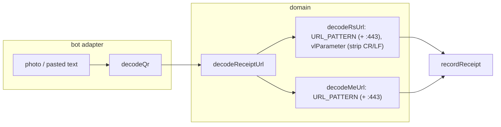

# 0020: Receipt links with a line-wrapped vl or an explicit :443 port

> **Status:** in-progress
> **Created:** 2026-10-01
> **Related ADRs:** [ADR-0018](../adrs/0018-receipts-record-offline-enrich-async.md) (the URL is
> decoded offline), [ADR-0019](../adrs/0019-qr-decoding-zxing-wasm.md) (QR decoding)

## TL;DR

Two real Serbian receipts are rejected even though their QR codes decode cleanly and their
payloads are valid. One printer line-wraps the `vl` base64 with a `%0A` every 76 characters. The
other prints the host as `suf.purs.gov.rs:443`. `src/domain/receipts/rsUrl.ts` rejects the first
as malformed and doesn't recognise the second as a receipt link at all. After this plan, both
photos record the printed total and get the usual receipt card. The fix is in the URL decoders
only. The QR reader is already correct.

## Context & problem

Plan 0014 Phase 7 (real receipts in production) is the check that surfaced these. Diagnosis,
reproduced on the two photos in the session that wrote this plan:

- **Both QRs decode** with the current `decodeQr` options: a version-20 symbol of 824 characters
  and a version-21 symbol of 872. Both payloads pass the MD5 check, are normal sales with no
  buyer id and 256 bytes of internal data, and carry the printed total.
- **Wrapped vl (receipt printed by a "Cornerstone" ESIR).** The `vl` value contains `%0A` after
  every 76 base64 characters. This is MIME-style wrapping. `vlParameter` percent-decodes the
  `%0A` into real `\n`. `decodeVl` then fails `BASE64` and the `length % 4` check, and the user
  gets `receiptRefused.malformed`.
- **Explicit port (Delhaize/Maxi).** The URL is `https://suf.purs.gov.rs:443/v/?vl=…`.
  `URL_PATTERN` has no port, so the text is `notReceipt` and a photo gets `receiptPhotoHint`
  ("no receipt QR found"). The payload is fine. `meUrl.ts`'s `URL_PATTERN` has the same gap for
  `mapr.tax.gov.me:443`. No Montenegrin receipt has shown it yet.

## Decision

- **Strip `\r` and `\n` from `vl` after percent-decoding,** before a space is turned back into
  `+`. Line breaks carry no data in base64. A space can't simply be removed, because it may be a
  `+` that form-style decoding split, so the existing handling of spaces stays as it is.
  `verifyUrl` is already built from the cleaned `vl`, so a wrapped link and its unwrapped twin
  produce the same `verifyUrl` and `fiscalId`, and the existing duplicate check sees them as the
  same receipt.
- **Accept an optional `:443` on both tax hosts,** for RS and ME. `verifyUrl` stays canonical,
  with no port. An `http://` URL with `:443`, or any other port, stays `notReceipt`.

We rejected accepting any port: no printer has shown one, and an unexpected port is as likely to
be a lookalike as a real receipt. We rejected keeping the line breaks in `verifyUrl`: the same
receipt would then get two different verify URLs depending on the printer, which only adds a way
for the copies to drift apart. No ADR. Both are input-tolerance fixes with no revisitable
tradeoff.

## Architecture diagram

## Implementation phases

### Phase 1: The decoders accept a wrapped vl and the :443 port
- **Owner skill:** dev
- **Blocks merge:** yes
- **What:** `vlParameter` removes `\r` and `\n` after `decodeURIComponent`. Both
  `URL_PATTERN`s accept an optional `:443` after the host. The test builders gain a way to wrap
  `vl` and to add the port. A new synthetic photo fixture carries a wrapped `:443` link.
- **Files touched:** `src/domain/receipts/rsUrl.ts`, `src/domain/receipts/rsUrl.test.ts`,
  `src/domain/receipts/meUrl.ts`, `src/domain/receipts/meUrl.test.ts`,
  `src/domain/receipts/testing/buildRsVl.ts`, `src/fiscal/qr.fixtures/generate.ts`,
  `src/fiscal/qr.fixtures/rs-receipt-wrapped.jpg` (generated), `src/fiscal/qr.test.ts`,
  `src/bot/bot.test.ts`.
- **Done when:**
  - `decodeRsUrl` on `buildRsUrl()`'s link, with `vl`'s base64 wrapped at 76 characters by
    `%0A`, returns a result `toEqual` to the one for the unwrapped link: `totalMinor: 82912`,
    `fiscalId: 'AAAA1111-AAAA1111-16898'`, and the unwrapped `verifyUrl`. The same holds for
    `%0D%0A` wrapping, and for a wrapped `vl` with a trailing `%0A`.
  - A wrapped `vl` that also carries a `%2B`, and the same `vl` with that `+` arriving as a
    space, both decode to the unwrapped result. The `+` handling survives the newline strip.
  - `https://suf.purs.gov.rs:443/v/?vl=…` decodes to the same result as the portless link, with
    a portless `verifyUrl`. `https://suf.purs.gov.rs:8443/v/?vl=…` and
    `http://suf.purs.gov.rs:443/v/?vl=…` are `notReceipt`. Note: the existing pattern accepts
    `http://` without a port, and that stays as it is.
  - `decodeMeUrl` on `https://mapr.tax.gov.me:443/ic/#/verify?…` returns the same result as the
    portless link, with a portless `verifyUrl`. `:8443` is `notReceipt`.
  - `decodeQr` reads `rs-receipt-wrapped.jpg` to the generator's exact text (a `:443` host and
    a `%0A`-wrapped `vl`). That text is synthetic, built by `buildRsUrl`, with no real payload.
  - In `bot.test.ts`, a photo of `rs-receipt-wrapped.jpg` records one expense of 82912 RSD and
    answers with the receipt card. Sending the portless, unwrapped link afterwards answers
    «уже записано» and leaves one row in `receipts`.

### Phase 2: Re-send the two receipts to the deployed bot
- **Owner skill:** human
- **Blocks merge:** no
- **What:** After deploy, send both photos from the diagnosis session (the Cornerstone one and
  the Delhaize/Maxi one) to the bot in DM.
- **Files touched:** none.
- **Done when:** Each photo records the printed total (2980.00 RSD and 494.94 RSD). Each card
  gains the shop name and its items within a minute. This confirms SUF accepts the canonical,
  unwrapped verify URL. Re-sending either one answers «уже записано». The user notes the outcome
  in the Implementation log.

## Data shapes

None. No schema, type or callback-data change.

## Risks & open questions

- **SUF and the canonical URL (unverified).** The fetcher uses the rebuilt `verifyUrl`. It holds
  the same bytes as the printed link, so SUF should accept it. Phase 2 is the check. If SUF
  rejects it, the card shows the existing failed-fetch state and [Повторить]. The total is still
  recorded, because recording is offline (ADR-0018).
- **Idempotency.** Holds by construction: the duplicate check keys on `fiscalId`, which comes
  from the payload, not the URL's text. Phase 1's photo-then-link test pins it.
- **Privacy.** The two real photos stay out of the repo. Fixtures are synthetic.

## What this plan does NOT do

- Receipts found unreadable after this plan ships. They go into a follow-up plan.
- A pasted link split across lines by a messenger (raw whitespace inside the URL). No case seen.
- Any other port, or `http://` with a port.

## Implementation log

| phase | owner | state | commit |
|---|---|---|---|
| 1: The decoders accept a wrapped vl and the :443 port | dev | done | committed with this row |
| 2: Re-send the two receipts to the deployed bot | human | not started | |

### Notes

### Close triggers

## Followups
