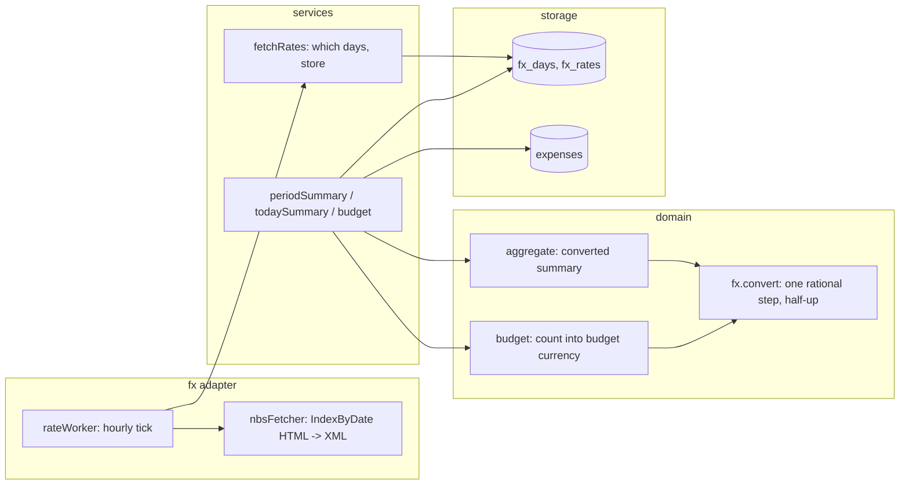

# 0022: Totals and budgets converted into one currency at the NBS rate

> **Status:** draft
> **Created:** 2026-10-01
> **Related ADRs:** [ADR-0022](../adrs/0022-fx-nbs-middle-rate-ledger-currency.md) (NBS middle
> rate, ledger currency, rounding), [ADR-0023](../adrs/0023-budgets-count-converted-spending.md)
> (budgets count converted spending), [ADR-0003](../adrs/0003-currency-conversion-at-report-time.md)
> (convert at report time), [ADR-0017](../adrs/0017-budgets-payday-periods-cumulative-allowance.md)
> (budgets)

## TL;DR

/week, /month and /today show one total in the ledger's default currency instead of one block per
currency. A USD or EUR expense is converted at the National Bank of Serbia's middle rate for its
day, and a footnote names what was converted. The budget counts foreign spending too, converted
into the budget's currency, so the daily figure under every expense card includes it. A worker
fetches the NBS rate lists into SQLite. A currency NBS doesn't list (KZT, for one) stays
unconverted on its own line, as it is today.

## Context & problem

After Plan 0021 a USD card purchase lands as USD, next to EUR subscriptions and RSD groceries.
The user's week digest now reads `3 870.00 RSD`, `107.40 EUR` and `6.00 USD` as three blocks with
no total, and their RSD budget ignores the USD and EUR entirely (ADR-0017's stated cost). ADR-0003
deferred conversion to "the FX plan". This is that plan.

## Decision

Per ADR-0022: a worker fetches the NBS middle rate list in force on each day into `fx_days` +
`fx_rates`. A pure `src/domain/fx.ts` converts one `Money` into a target currency at a stored
rate, as one exact rational step rounded half-up. `aggregate.ts` gains a converted summary that
the period and today services feed with the ledger's default currency and a rate lookup. Per
ADR-0023 the budget counts every currency, converted into the budget's own currency.

We rejected the Kurs API mirror, a global free feed, a per-viewer report currency and half-even
rounding (ADR-0022), and keeping budgets single-currency (ADR-0023).

## Architecture diagram



## Implementation phases

### Phase 1: /week and /month show one converted total
- **Owner skill:** dev
- **What:**
  - Migration `NNNN_fx_rates.sql`, numbered after the latest present file (see Risks: Plan 0019),
    creates `fx_lists`, `fx_rates` and `fx_days` (Data shapes).
  - `src/domain/fx.ts`: `parseRateE4(text)` reads a decimal with exactly four fraction digits into
    an integer, by digits, never through `Number(...)` of a decimal. `convert(money, target,
    rateOf)` returns the converted `Money`, or `undefined` when either side lacks a rate. RSD is
    rate 1 unit 1. The formula is ADR-0022's, computed in `BigInt`, rounded half-up once. Money
    already in `target` is returned unchanged and needs no rate.
  - `src/fx/nbsFetcher.ts` (`createNbsFetcher(fetchImpl = fetch)`, the `rsFetcher` pattern, 10 s
    timeout, `AbortSignal`) takes a local date. It GETs `IndexByDate?isSearchExecuted=true&Date=
    DD.MM.YYYY&ExchangeRateListTypeID=3`, reads the `Download?...Format=xml` href, GETs it and
    parses `<header><No>`, `<Date>` and each `<item>`'s `Currency`, `Unit` and `Middle_Rate`.
    A list where any item fails `parseRateE4` or `Unit` isn't a positive integer is a failure
    (nothing stored). Only codes in our currency table are kept. No XML dependency: the shape is
    flat and matched by pattern.
  - `src/services/fetchRates.ts` runs one tick. The days owed are every local date from the
    earliest `occurred_on` of any non-deleted expense through today in Europe/Belgrade. A day is
    fetched if it has no `fx_days` row, or if its row was fetched on or before that same
    Belgrade date (today's list may not be out yet). At most 31 days per tick, oldest first.
    Each fetched list upserts `fx_lists` + `fx_rates`, then the day's `fx_days` row points at the
    list's own date. A failure logs `fx fetch failed` at warn with the day and kind, and the tick
    moves on.
  - `src/fx/rateWorker.ts` runs a tick at boot and then hourly, with the receipt worker's
    in-flight guard and `stop()`. `src/index.ts` starts it and stops it before the DB closes.
  - `src/db/fxRates.ts`: the upserts and `rateLookupBetween(db, from, to)`, which returns
    `rateOf(currency, day)`. A day with no `fx_days` row borrows the latest row up to 4 days
    earlier (ADR-0022). Further back is `undefined`.
  - `aggregate.ts` gains `summarizeConverted(expenses, target, rateOf)`. It returns the
    converted `CurrencySummary` in `target`, the original totals of what was converted
    (`convertedFrom: Money[]`), and per-currency `CurrencySummary` blocks for expenses with no
    rate (`unconverted`). Each expense converts and rounds before any sum.
  - `periodSummary.ts` uses it with `ledger.defaultCurrency`. `messages.periodSummary` renders:
    the bold total, prefixed `≈ ` only when `convertedFrom` is non-empty; its categories by
    amount; each unconverted block as today; then the footnote lines. With nothing converted and
    nothing unconverted, the output is exactly today's.
  - Footnotes: `Включая 107.40 EUR, 6.00 USD по курсу НБС на день траты.` (foreign totals in
    `currencyOrder`), and `Без курса НБС, не пересчитано: KZT.` when `unconverted` is non-empty.
- **Files touched:** `src/db/migrations/NNNN_fx_rates.sql`, `src/db/fxRates.ts`,
  `src/db/fxRates.test.ts`, `src/domain/fx.ts`, `src/domain/fx.test.ts`, `src/domain/aggregate.ts`,
  `src/domain/aggregate.test.ts`, `src/fx/nbsFetcher.ts`, `src/fx/nbsFetcher.test.ts`,
  `src/fx/testing/` (trimmed NBS HTML and XML fixtures), `src/fx/rateWorker.ts`,
  `src/fx/rateWorker.test.ts`, `src/services/fetchRates.ts`, `src/services/fetchRates.test.ts`,
  `src/services/periodSummary.ts`, `src/bot/messages.ts`, `src/bot/bot.test.ts`, `src/index.ts`.
- **Done when:** (rates are the real NBS list of 2026-09-28: EUR 117.4993/1, USD 103.1782/1,
  JPY 65.4009/100)
  - `parseRateE4('117.4993')` is 1174993. `'117.499'`, `'117,4993'`, `'1e2'` and `''` are refused.
  - Conversion table: 6.00 USD -> 619.07 RSD (61906.92 rounds up). 107.40 EUR -> 12 619.42 RSD
    (1261942.482). 1500 JPY -> 981.01 RSD (98101.35, unit 100, exponent 0). 6.00 USD into EUR
    -> 5.27 EUR (526.87, the cross through RSD). 450.00 RSD into EUR -> 3.83 EUR (382.98). A
    synthetic rate 1.0050 on 100 minor gives 101, the half-up tie. 450.00 RSD into RSD is 45000
    with an empty rate table.
  - The fetcher, on the HTML and XML fixtures, returns list 184 dated 2026-09-28, with EUR as
    `{unit: 1, middleE4: 1174993}` and JPY as `{unit: 100, middleE4: 654009}`. A fixture with
    `Middle_Rate` `117.49` fails the list. An HTML page with no XML link is a failure, not an
    empty list.
  - A tick on an empty table, with one expense on 2026-09-26 and now 2026-09-28T08:00Z (10:00
    in Belgrade), fetches 26, 27 and 28. With a fake that answers 26 and 27 with the 25th's list,
    `fx_days` maps 26 -> 25, 27 -> 25 and 28 -> 28. A second tick on the same day refetches only
    the 28th. A tick on the 29th refetches the 28th once and fetches the 29th.
  - The lookup: a day with no row converts at the row 2 days earlier. 5 days earlier gives
    `undefined`.
  - In `bot.test.ts`, an RSD ledger with these rates for 2026-09-28 and expenses that day of
    3 420.00 RSD Другое, 450.00 RSD Кафе и рестораны, 107.40 EUR Связь и интернет and 6.00 USD
    Другое answers /week (week of 28 September) with exactly:
    `<b>≈ 17 108.49 RSD</b>`, then `Связь и интернет: 12 619.42`, `Другое: 4 039.07`,
    `Кафе и рестораны: 450.00`, then `Включая 107.40 EUR, 6.00 USD по курсу НБС на день траты.`
    (17 108.49 is 1 261 942 + 403 907 + 45 000 minor, the sum of the rounded parts.)
  - The same week plus a 5 000.00 KZT expense adds a `5 000.00 KZT` block after the RSD block,
    and a `Без курса НБС, не пересчитано: KZT.` line.
  - The same week with an empty rate table shows today's RSD, EUR and USD blocks, no `≈`, and
    `Без курса НБС, не пересчитано: EUR, USD.`
  - The existing all-RSD summary tests pass unchanged.

### Phase 2: /today, groups and the per-person totals convert too
- **Owner skill:** dev
- **What:**
  - `todaySummary.ts` returns the converted summary. `messages.today` shows `≈ <total>` plus the
    same footnotes, or exactly today's lines when nothing is foreign.
  - `summarizeByAuthor` gets a converted sibling. `peopleSection` shows each member's converted
    total (`≈` when anything of theirs was converted), plus any unconverted totals after it, and
    sorts by the converted total.
  - Group /today, /week, /month and the group pager use the same services, so they convert into
    the bound ledger's default currency.
  - The too-long fallback shows the converted total, the unconverted totals and the footnotes.
- **Files touched:** `src/services/todaySummary.ts`, `src/services/periodSummary.ts`,
  `src/domain/aggregate.ts`, `src/domain/aggregate.test.ts`, `src/bot/messages.ts`,
  `src/bot/bot.test.ts`.
- **Done when:**
  - /today on 2026-09-28 with 450.00 RSD and 6.00 USD (the 28th's rates) answers `≈ 1 069.07 RSD`
    and `Включая 6.00 USD по курсу НБС на день траты.` (45 000 + 61 907 minor).
  - In a bound group with an RSD ledger, /week with Анна's 107.40 EUR and Борис's 3 420.00 RSD
    lists `Анна: ≈ 12 619.42 RSD` before `Борис: 3 420.00 RSD` (Анна sorts first by converted
    total, though her original amount is the smaller number).
  - A /month whose categories exceed the length limit shows `≈` total, footnotes and the
    existing too-many-categories note.

### Phase 3: Budgets count every currency; docs
- **Owner skill:** dev
- **What:**
  - `src/domain/budget.ts`: `splitByCurrency` becomes `countInto(expenses, budget.currency,
    rateOf)`, returning `countedMinor` (converted parts, each rounded) and `notCounted` (original
    totals of expenses with no rate). `budgetStatus` loads the rate lookup for the period and
    uses it for the limit, today, and every cap.
  - `budgetScreen`: `Не учтено, другая валюта:` becomes `Не учтено, нет курса:`. When anything was
    converted, a line `Траты в других валютах пересчитаны по курсу НБС на день траты.` follows
    the figures. The currency-mismatch note stays as it is.
  - The card's budget line and cap line are unchanged in shape. They now include converted
    spending because they read `budgetStatus`.
  - `/help` gains after the bank SMS line: «Итоги и бюджет в разных валютах пересчитываются в
    одну валюту по курсу НБС на день траты.»
  - `README.md` gains `### Currency conversion` after Bank SMS: the target (ledger default for
    reports, budget currency for budgets), the NBS middle rate of the expense's day, rounding,
    the `≈` mark, currencies NBS doesn't list, and that the worker needs outbound HTTPS to
    `webappcenter.nbs.rs`.
  - `CLAUDE.md` "Where things live" gains `src/fx/` (the rates adapter).
- **Files touched:** `src/domain/budget.ts`, `src/domain/budget.test.ts`,
  `src/services/budget.ts`, `src/services/budget.test.ts`, `src/bot/messages.ts`,
  `src/bot/bot.test.ts`, `README.md`, `CLAUDE.md`.
- **Done when:**
  - An RSD budget of 30 000.00 over September (start day 1, 30 days), with only a 6.00 USD
    expense on 2026-09-28 and the 28th's rates: the expense card's budget line reads 27 380.93 RSD
    left today (`floor(3 000 000 * 28 / 30)` = 2 800 000, minus 61 907) and 29 380.93 RSD left
    to 30 September.
  - A cap of 1 000.00 RSD on Другое with that expense shows `Другое: 619.07 из 1 000.00 RSD`.
  - A 5 000.00 KZT expense in the period is `Не учтено, нет курса: 5 000.00 KZT`, and the figures
    don't move.
  - A EUR budget on an RSD ledger counts a 450.00 RSD expense as 3.83 EUR.
  - A budget with only budget-currency expenses renders exactly as before, with no conversion
    line.
  - `/help` contains the new line.

### Phase 4: Check one converted expense on the deployed bot
- **Owner skill:** human
- **Blocks merge:** no
- **What:** After deploy, wait for the first worker tick (it runs at boot), then open /week.
- **Files touched:** none.
- **Done when:** /week shows one `≈` RSD total. The user checks one USD or EUR expense against
  the NBS list for its day on nbs.rs (amount times middle rate, to the para) and notes it in the
  Implementation log.

## Data shapes

```sql
-- illustrative
CREATE TABLE fx_lists (
  list_date   TEXT PRIMARY KEY,     -- YYYY-MM-DD, the NBS list's own date
  list_number INTEGER NOT NULL,
  fetched_at  TEXT NOT NULL
);
CREATE TABLE fx_rates (
  list_date TEXT NOT NULL REFERENCES fx_lists(list_date),
  currency  TEXT NOT NULL,          -- ISO-4217, in our currency table
  unit      INTEGER NOT NULL,       -- 1, or 100 for JPY/HUF
  middle_e4 INTEGER NOT NULL,       -- RSD per `unit` units, times 10^4
  PRIMARY KEY (list_date, currency)
);
CREATE TABLE fx_days (
  day        TEXT PRIMARY KEY,      -- any calendar day
  list_date  TEXT NOT NULL REFERENCES fx_lists(list_date),  -- the list in force that day
  fetched_at TEXT NOT NULL          -- a row fetched on or before its own Belgrade day is refetched
);
```

```ts
// illustrative
type Rate = { readonly unit: number; readonly middleE4: number };
type RateOf = (currency: CurrencyCode, day: LocalDate) => Rate | undefined;
```

## Risks & open questions

- **Money.** Rates are integers, conversion is `BigInt` rational arithmetic with one half-up
  rounding per expense, and totals are sums of rounded parts. No float touches a rate or an
  amount. `safeSum` still guards the sums.
- **Time.** The worker's "today" is Belgrade's, because NBS lists are Belgrade dates. An
  expense's day is its ledger-local `occurred_on`. A far-east ledger's day can be one ahead of
  Belgrade, and the 4-day borrow covers it.
- **Unverified.** When NBS publishes the day's list, and what `IndexByDate` returns for today
  before it does. The refetch-until-the-day-is-over rule is correct either way.
- **Scraping.** An NBS page change fails the fetch. Reports degrade to unconverted blocks with
  the "не пересчитано" line, and the warn log names the failure.
- **Plan 0019 (approved, not built).** It claims migration `0011_sealed_ledgers.sql` and edits
  `periodSummary.ts`, `todaySummary.ts`, `budget.ts` and `card.ts`. Whichever plan lands second
  takes the next free migration number and rebases onto the other's service shape. Conversion
  runs on opened `Expense`s, after decryption (ADR-0003, ADR-0020), and `fx_*` holds no private
  data.
- **Privacy.** The worker logs days, list numbers and failure kinds, never an amount.

## What this plan does NOT do

- A per-viewer report currency (ADR-0022, Alternative C).
- Showing the converted amount on the expense card itself (`6.00 USD ≈ 619.07 RSD`). It's a
  separate UX call. A future plan can do it.
- Rates for currencies NBS doesn't list (KZT, among others). That needs a second source and an
  ADR.
- The rate the card was actually charged at. The bank SMS doesn't carry it.
- Export, tags and debts conversion. They don't exist yet, and each plan converts its own
  surface.

## Implementation log

> Written by `dev`: one row per phase as its commit lands, then the close block. **The phases
> above are the contract. This section records what happened.** Observations, never conclusions:
> no pass list, no self-assessment. Deviations and unmet done-whens are **always** disclosed.
> Keep it shorter than `## Implementation phases`.

## Followups
