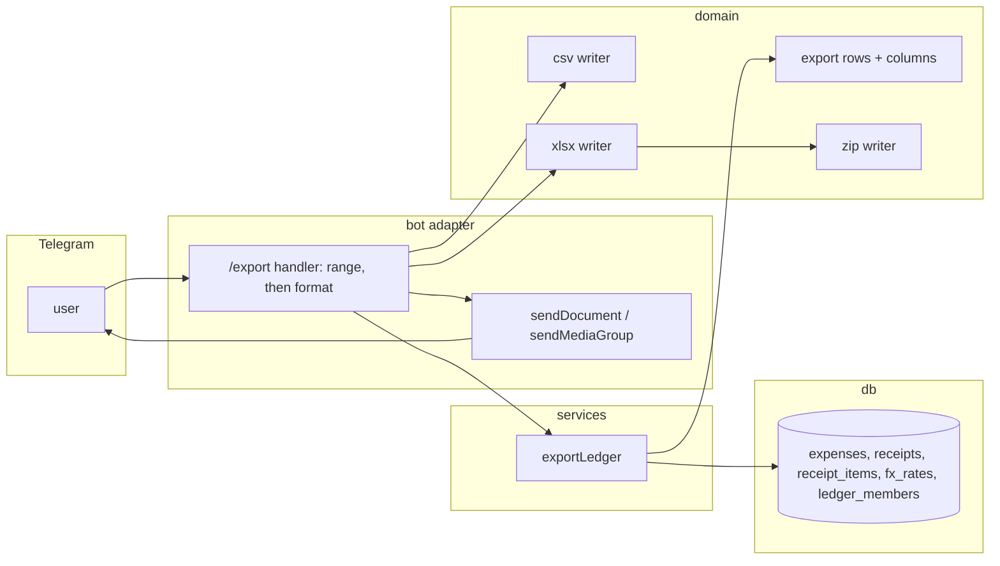

# 0024: Export and data ownership: every expense out as CSV or XLSX, free

> **Status:** in-progress
> **Created:** 2026-10-01
> **Depends on:** [Plan 0019](done/0019-encrypted-personal-ledger.md) (the sealed-ledger read seam that Phase 4 goes through)
> **Related ADRs:** [ADR-0026](../adrs/0026-export-csv-and-hand-rolled-xlsx.md) (CSV and a hand-rolled XLSX),
> [ADR-0022](../adrs/0022-fx-nbs-middle-rate-ledger-currency.md) (converted amounts),
> [ADR-0020](../adrs/0020-sealed-ledgers-write-open-read-locked.md) (sealed ledgers),
> [ADR-0014](../adrs/0014-group-chats-bind-to-shared-ledgers.md) (group ledgers)

## TL;DR

`/export` asks what to export: «Этот месяц», «Прошлый месяц», «Этот год» or «Всё время». It then
asks for the format: [CSV] or [Excel]. The bot sends the file in the chat straight away. Each
row holds the date and time, the amount exactly as recorded, its currency, the amount converted
into the ledger's currency at the NBS rate, the category, the description, and, for a receipt,
the shop and the fiscal link. A group ledger's rows also carry the author. Receipt line items go
on a second sheet (Excel) or in a second file (CSV). Export is free and unlimited. Together with
Plan 0019 it backs the public promise "your data is yours: take all of it out, any time". The
first thing the user sees: `/export`, then «Всё время», then [Excel], and an `.xlsx` with every
expense they ever recorded arrives in the chat.

## Context & problem

Today a user can't get their data out at all, which is a reason not to start using the bot.
Market check (2026-10-01): Cointry puts CSV export behind its paid tier, and Mobs sells "your data
stays in your own sheet" as its main pitch. Export is the cheapest feature on the list that answers
that objection. It is also a prerequisite for opening the bot to strangers (Plan 0029 Phase 6).

Users open the file on a phone. Excel's handling of CSV depends on the locale. Receipt items are a
second table. ADR-0026 records why the answer is both formats, with XLSX written by our own code
and no library.

## Decision

The bot builds the file in memory when the user taps, and sends it as a document in the same
update. A service, `exportLedger`, gathers the rows: the expenses in range, their receipts and
items, the converted amounts and the author names. Pure writers in `src/domain/export/` turn the
rows into bytes, either CSV text or a zip holding the XLSX parts. In a private chat the active
ledger is exported. In a group, the ledger the chat is bound to is exported, and any member may
ask, because every member already sees every expense in the group's reports. A sealed ledger
exports only while it is unlocked.

We rejected a background export job: it needs a table, a worker and a "file on its way" state for
work that takes milliseconds. We rejected a single zip holding every format: a zip is awkward to
open on a phone. The format choice itself (no spreadsheet library) is ADR-0026.

## Architecture diagram



## Implementation phases

Each phase ships as its own commit. `dev` implements all phases in one session with no review
between phases. The architect reviews once at the end, in a fresh session. All new copy goes in
`src/bot/messages.ts`, in Russian.

### Phase 1: Walking skeleton: `/export` sends a CSV of the expenses
- **Owner skill:** dev
- **What:**
  - `/export` in a private chat replies «Что выгрузить?» with four range buttons: «Этот месяц»,
    «Прошлый месяц», «Этот год», «Всё время». A tap edits the same message to «Формат файла?»
    with [CSV], [Excel] and [← Назад]. Until Phase 3, [Excel] answers the callback with
    «Скоро», and [← Назад] returns to the range step.
  - The ranges are calendar ranges of `occurred_on`, computed from today in the ledger's
    effective timezone (`effectiveTimezone`): this month is the 1st through today, last month is
    the whole previous calendar month, this year is 1 January through today, and all time has no
    bounds. Soft-deleted expenses are never exported.
  - [CSV] sends `expenses-<range>.csv`, where `<range>` is `2026-10`, `2026-09`, `2026` or `all`.
    Its columns are Дата, Сумма, Валюта, Категория and Описание, sorted by `occurred_on`, then
    `occurred_at`, then id. The file follows ADR-0026: UTF-8 with a BOM, `;`, a decimal comma,
    CRLF and RFC 4180 quoting. The amount is rendered from minor units by a new money-module
    function with no grouping: 45000 RSD becomes `450,00` and 1500 JPY becomes `1500`.
  - After sending, the picker message is edited to «Готово: N расходов» with the period, with
    no keyboard. A range with no expenses answers «За этот период расходов нет» and sends no
    file.
  - An in-memory guard keyed by chat and message id drops a second format tap while the first
    is still building (a double-tap).
  - `/export` joins `messages.commands`.
- **Files touched:** `src/domain/money.ts` (+ test), `src/domain/export/csv.ts` (+ test),
  `src/domain/export/rows.ts` (+ test), `src/domain/periods.ts` (+ test, for the calendar year
  and month ranges if not already expressible), `src/db/expenses.ts` (+ test, an unbounded
  member-scoped listing), `src/services/exportLedger.ts` (+ test), `src/bot/handlers/export.ts`,
  `src/bot/callbackData.ts`, `src/bot/callbacks.ts`, `src/bot/bot.ts`, `src/bot/messages.ts`,
  `src/bot/bot.test.ts`.
- **Done when:**
  - In the harness, `/export`, then «Всё время», then [CSV], with expenses `450 кофе` (RSD) and
    `12,50 EUR такси` on record, sends one document. Its bytes start with `EF BB BF`, its header
    line is `Дата;Сумма;Валюта;Категория;Описание`, and its two data rows hold `450,00;RSD` and
    `12,50;EUR`.
  - A description containing `;`, `"` and a line break round-trips through an RFC 4180 parser
    in the test as the original string.
  - With the user in `Europe/Belgrade` and now `2026-09-30T22:30:00Z` (00:30 on 1 October
    local), «Этот месяц» covers `2026-10-01`..`2026-10-01` and «Прошлый месяц» covers
    `2026-09-01`..`2026-09-30`. An expense with `occurred_on` `2026-09-30` is in last month's
    file and not this month's.
  - A soft-deleted expense is absent from every range.
  - A range with no expenses sends no document and edits the message to the empty answer.
  - Two format taps on the same message, the second arriving while the first builds, send one
    document.

### Phase 2: Every column, the items file, and a formula-safe CSV
- **Owner skill:** dev
- **What:**
  - The expenses table grows to these columns, in this order: Дата, Время (HH:MM of
    `occurred_at` in the ledger's effective timezone), Сумма, Валюта,
    `Сумма в <ledger currency>`, Категория, Описание, Автор (shared ledgers only), Магазин,
    Чек (the receipt's `verify_url`), ID (the expense id).
  - The converted amount uses ADR-0022's `convert` at the NBS rate of the expense's
    `occurred_on`, read through `rateLookupBetween` over the range's days. The cell is empty when
    no rate exists, and equals the original amount when the currencies match.
  - Автор is the member's `display_name`, or «участник» when it is null.
  - The items table: ID расхода, Дата, Магазин, №, Наименование, Количество, Сумма, Валюта. It
    has one row per `receipt_items` row of an exported expense, ordered as the expenses are and
    then by `position`. Количество is the stored decimal string, with its dot turned into a comma.
  - CSV sends two documents as one album (`sendMediaGroup`): `expenses-<range>.csv`, plus
    `receipt-items-<range>.csv` when at least one exported expense has items. Otherwise it sends
    one document.
  - CSV formula guard: a text cell starting with `=`, `+`, `-`, `@`, a tab or a CR gets a `'`
    prepended. Numeric cells are never prefixed.
- **Files touched:** `src/domain/export/rows.ts` (+ test), `src/domain/export/csv.ts` (+ test),
  `src/db/receipts.ts` (+ test), `src/db/receiptItems.ts` (+ test), `src/services/exportLedger.ts`
  (+ test), `src/bot/handlers/export.ts`, `src/bot/messages.ts`, `src/bot/bot.test.ts`.
- **Done when:**
  - An RSD-ledger expense of `10,00 EUR` on a day whose stored EUR rate is
    `{ unit: 1, middleE4: 1171234 }` exports `1171,23` in `Сумма в RSD`
    (1000 × 1171234 / 10000 = 117123.4, which rounds half-up to 117123 minor units). With
    `middleE4: 1171235` it exports `1171,24` (117123.5 rounds up to 117124).
  - A foreign expense on a day with no rate exports an empty converted cell, and an RSD expense
    exports its own amount there.
  - A receipt expense with three items exports its shop and link on the expense row, and three
    item rows whose `ID расхода` equals the expense row's `ID`. Their quantities include
    `0,535` from a stored `0.535`.
  - A description `=SUM(A1)` exports as `'=SUM(A1)`, and an amount cell never starts with `'`.
  - A range without receipts sends exactly one document.
  - A personal-ledger export has no Автор column.

### Phase 3: The XLSX writer and the [Excel] button
- **Owner skill:** dev
- **What:**
  - `src/domain/export/zip.ts` writes a zip with no external dependency: local headers, deflated
    entries (`zlib.deflateRawSync`), CRC-32 (`zlib.crc32`), a central directory and its end
    record. It throws if the archive would exceed the non-Zip64 limits (ADR-0026).
  - `src/domain/export/xlsx.ts` writes the workbook parts: `[Content_Types].xml`, `_rels/.rels`,
    `xl/workbook.xml`, `xl/_rels/workbook.xml.rels`, `xl/styles.xml`, and one worksheet per
    table («Расходы», plus «Позиции чеков» when there are items). Text goes in inline-string
    cells, XML-escaped, with characters XML 1.0 forbids removed. Amounts are numeric cells whose
    `<v>` is the money module's exact decimal with a dot. They carry a number style with as
    many decimals as the currency's exponent.
  - [Excel] sends `expenses-<range>.xlsx` holding the same columns and rows as the CSV, with
    Дата as text in `YYYY-MM-DD`.
- **Files touched:** `src/domain/export/zip.ts` (+ test), `src/domain/export/xlsx.ts` (+ test),
  `src/bot/handlers/export.ts`, `src/bot/messages.ts`, `src/bot/bot.test.ts`.
- **Done when:**
  - The zip test reads the archive back with a test-only reader that walks the central directory
    and inflates each entry with `zlib.inflateRawSync`. The entry names match the part list,
    and each stored CRC-32 matches the inflated bytes. The `PK\x05\x06` end record's entry count
    equals the number of parts.
  - A workbook with an items table has two sheets named «Расходы» and «Позиции чеков» in
    `xl/workbook.xml`. Without items it has one sheet.
  - The amount cell for 45000 RSD has `<v>450.00</v>` and a style with two decimals, and the cell
    for 1500 JPY has `<v>1500</v>` and a style with zero decimals.
  - A description holding `<`, `&` and U+0001 appears as `&lt;`, `&amp;` and nothing,
    respectively.
  - Every XML part passes a test-only well-formedness check (balanced tags, one root, every `&`
    starting an entity), so a stray character in user text can't corrupt the workbook.

### Phase 4: Groups, sealed ledgers, help and docs
- **Owner skill:** dev
- **What:**
  - `/export` in a bound group works the same way, on the group's ledger. The picker and the files
    go to the group. Any member may tap, the same stateless rule the group summary pager follows.
    `/export` joins `messages.groupCommands`.
  - A sealed personal ledger (Plan 0019) exports only while unlocked. While locked, `/export`
    and a tap on an old picker answer with Plan 0019's locked message, and nothing is sent.
    Reading goes through Plan 0019's decrypting seam, so the sealed expense variant forces it.
  - `/help` gains one line about `/export`, and the README's command list does too.
- **Files touched:** `src/bot/group/export.ts` (or `src/bot/group/index.ts`),
  `src/bot/handlers/export.ts`, `src/services/exportLedger.ts` (+ test), `src/bot/messages.ts`,
  `src/bot/bot.test.ts`, `src/bot/group/group.test.ts`, `README.md`.
- **Done when:**
  - In a bound group with two members, member B's `/export` and «Всё время» and [CSV] send a file
    to the group. It holds both members' expenses, with each row's Автор set to its author's
    display name.
  - `/export` in an unbound group does nothing.
  - On a sealed ledger, `/export` while locked sends no document and answers with the locked
    message. After `/unlock` it sends a file whose amounts and descriptions are the plaintext
    values.
  - `messages.commands` and `messages.groupCommands` both include `export`.

### Phase 5: Open the files in real apps
- **Owner skill:** human
- **What:** On the deployed bot, export «Всё время» from a personal ledger with a receipt on
  record, in both formats. Open the `.xlsx` in Excel (desktop or phone), Google Sheets and
  LibreOffice or Numbers. Open the `.csv` in Excel with a Russian or Serbian locale.
- **Done when:** Every app opens the XLSX without a repair prompt, showing both sheets with
  Cyrillic intact and amounts as numbers that sum correctly. Excel opens the CSV with columns
  split and Cyrillic intact. Anything an app rejects is logged as a followup with the app and
  version.

## Data shapes

```ts
// illustrative
type ExportRange = 'tm' | 'pm' | 'ty' | 'all';
type ExportFormat = 'csv' | 'xlsx';

// callback_data, built in callbackData.ts and checked by assertCallbackData:
//   xp:r:<range>            range chosen, show the format step
//   xp:f:<range>:<format>   build and send
//   xp:back                 back to the range step
// The ledger is not in the data: in private it's the active ledger, in a group the chat's binding.

interface ExportTable {
  readonly name: string; // sheet name / file stem, from messages
  readonly columns: readonly ExportColumn[];
  readonly rows: readonly (readonly ExportCell[])[];
}
type ExportColumn = { readonly header: string };
type ExportCell =
  | { readonly kind: 'text'; readonly value: string }
  | { readonly kind: 'amount'; readonly minor: number; readonly currency: CurrencyCode }
  | { readonly kind: 'empty' };
```

The writers receive `ExportTable`s and know nothing of ledgers, receipts or Telegram. Each
writer renders an `amount` cell from minor units in its own decimal form: a comma for CSV, a dot
for an XLSX `<v>`.

## Risks & open questions

- **Privacy: the file is a copy.** A sent file stays in the chat history and on every device
  the user's Telegram syncs to. For a sealed ledger, that copy is outside the encryption. The
  picker's text says so in one line for a sealed ledger. Asking for a passphrase again is out of
  scope.
- **Privacy: logs.** The handler logs the range, format, row count and byte size at info level,
  and never a cell.
- **Money.** No amount passes through a float in our code. A spreadsheet will hold the XLSX
  `<v>` as a double, which is exact to the cent far past any real total. The converted column
  rounds once per expense, as `summarizeConverted` does, so a month's converted column sums to
  `/month`'s converted total exactly.
- **Idempotency.** Export writes nothing, so a redelivered update at worst sends a second copy.
  The in-memory guard covers the common double-tap, and a redelivery after a restart sending a
  duplicate file is accepted.
- **Size.** Telegram allows bots to upload documents up to 50 MB. A ledger with 10 000 expenses
  is roughly 1.5 MB as CSV (an estimate). No size check is needed now. The handler throws on
  over 45 MB and replies with a generic error, so a surprise is visible.
- **CSV locale guess.** `;` with a decimal comma suits Excel in the ru/sr locales, which is a guess
  about the audience (ADR-0026). The XLSX is the answer for everyone else.
- **Dependency on Plan 0019.** Phase 4 needs the sealed-ledger seam. If 0019 hasn't landed, Phase
  4's sealed bullet can't be built: stop, and report it in the log instead of stubbing it.

## What this plan does NOT do

- Account deletion. That's Plan 0029's `/delete_account`.
- Import from a file. Bank statements are Plan 0027.
- Live sync to Google Sheets. It's a running integration with OAuth and a token to guard.
- Scheduled exports. Plan 0026 could attach one later.
- A custom date range or a per-category filter. The spreadsheet does the filtering.
- Budgets, categories or settings in the export. It covers expenses and receipt items only.

## Implementation log

> Written by `dev`: one row per phase as its commit lands, then the close block. **The phases
> above are the contract. This section records what happened.** Observations, never conclusions:
> no pass list, no self-assessment. Deviations and unmet done-whens are **always** disclosed.
> Keep it shorter than `## Implementation phases`.

| phase | owner | state | commit |
|---|---|---|---|
| 1: Walking skeleton: `/export` sends a CSV of the expenses | dev | done | `f77bea0` |
| 2: Every column, the items file, and a formula-safe CSV | dev | done | `8d09bcf` |
| 3: The XLSX writer and the [Excel] button | dev | done | committed with this row |
| 4: Groups, sealed ledgers, help and docs | dev | not started | |
| 5: Open the files in real apps | human | not started | |

### Notes

- Phase 1: `src/domain/periods.ts` is unchanged. The ranges and file keys are `exportSpan` in
  `src/domain/export/rows.ts`, built on `monthOf` and `previous`.
- Phase 1: the Belgrade 00:30 done-when is asserted in `src/services/exportLedger.test.ts` (the
  service the handler calls) and `rows.test.ts`, not through the bot harness, whose clock is fixed
  at 2026-09-29T22:10Z.
- Phase 1: the double-tap guard is `createTapGuard` in `src/bot/callbacks.ts`. The dropped tap is
  answered silently by the dispatcher.
- Phase 1: the column headers, sheet name and file stem live in `messages` and are passed to
  `expensesTable`, so the domain holds no copy. `/export` sits after `/categories` in
  `messages.commands`; the pinned `registerCommands` test is updated.
- Phase 1: a format tap on a locked sealed ledger already answers `ledgerLockedToast` and sends
  nothing, since the read goes through `openExpenses`.
- Phase 2: `src/db/receipts.ts` is unchanged: the service reads the existing
  `listLedgerReceipts` and keeps the exported expenses' receipts. The items come from a new
  `listLedgerReceiptItems` in `src/db/receiptItems.ts`, one query per export.
- Phase 2: for all time the rates are read over the first to the last exported `occurred_on`.
  The Время column is formatted in the service with `date-fns` and `@date-fns/tz` (both already
  dependencies), since `src/domain/time.ts` is outside the phase's files.
- Phase 2: the `1171,23` / `1171,24` done-when runs through the bot harness with a stored rate;
  the same pair is asserted on the service. A Phase 1 bot test now expects the full Phase 2
  header, so the Phase 1 header line `Дата;Сумма;Валюта;Категория;Описание` is no longer
  asserted anywhere.
- Phase 2: the item columns № and Количество are text cells, so the formula guard also applies
  to a quantity such as `-1`.
- Phase 3: `xlsx.ts` exports `xlsxParts` (the parts before zipping) beside `writeXlsx`; the
  sheet, style and escaping done-whens are asserted on the parts, and the zip round trip on
  `writeZip`. The number formats are custom ids from 164 (`0`, `0.00`), one per exponent used.
  Every zip entry carries the fixed date 1980-01-01, so the bytes depend only on the parts.
- Phase 3: the XLSX keeps № and Количество as text cells, the same cells as the CSV.
  `messages.exportSoon` is removed with the placeholder.

### Close triggers

## Followups
