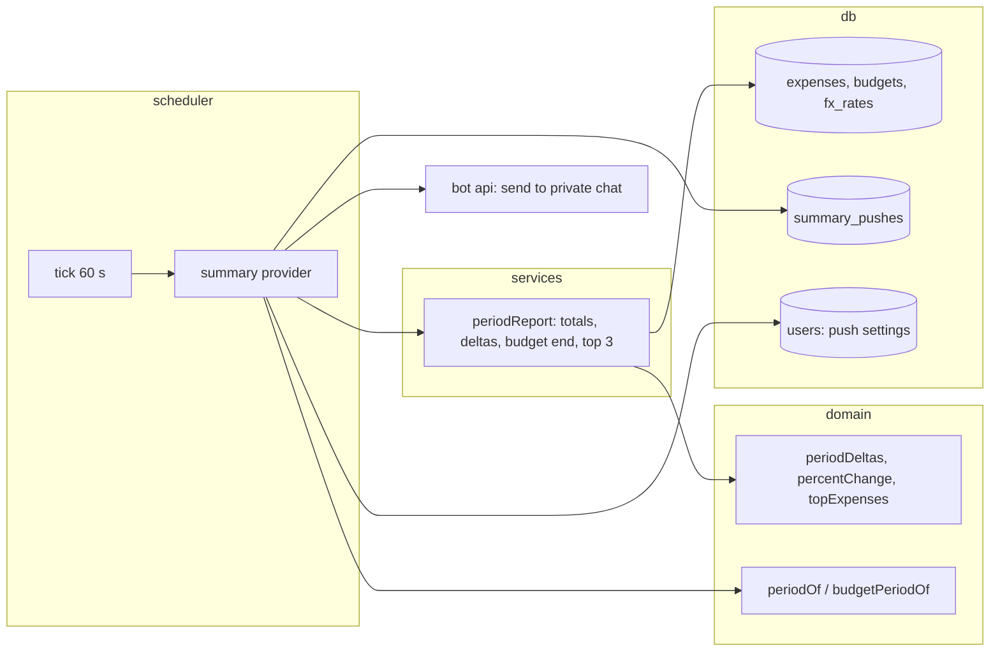

# 0026: Monthly summary push: last period's report arrives on its own

> **Status:** approved
> **Created:** 2026-10-01
> **Depends on:** [Plan 0025](0025-recurring-expenses-and-reminders.md) (the scheduler),
> [Plan 0019](done/0019-encrypted-personal-ledger.md) (the locked variant), [Plan 0028](0028-donations.md) (`/donate`)
> **Related ADRs:** [ADR-0031](../adrs/0031-local-time-scheduler.md) (scheduler),
> [ADR-0017](../adrs/0017-budgets-payday-periods-cumulative-allowance.md) (payday periods),
> [ADR-0022](../adrs/0022-fx-nbs-middle-rate-ledger-currency.md) (converted totals),
> [ADR-0027](../adrs/0027-donations-only-funding.md) (where donations are mentioned)

## TL;DR

The morning after a period closes, at 09:00 local time, the bot sends the personal ledger's
report without being asked. The period is the budget's payday period when the ledger has a
budget, else the calendar month. The report holds:
- the total and the categories, each with its change against the period before
  («Кафе: 12 400.00 RSD (+3 100.00, +33%)»);
- how the budget ended;
- the three largest expenses;
- a quiet `/donate` line.

It is on by default and switched off from [Отключить] on the message itself or from `/settings`.
An opt-in Monday push summarises last week. Nothing is computed by AI, so a push costs nothing
per user. The first thing the user sees: on 1 November at 09:00, «Итоги октября» arrives with
October's total and its change against September.

## Context & problem

`/month` answers only when asked, so a user who stops asking stops looking, and the habit dies.
Market check (2026-10-01): Cointry sends a monthly report and sells an AI analysis of it. A push
at the period boundary is the cheapest way to bring users back. Plan 0025's scheduler
(ADR-0031) makes it a second provider, not new infrastructure.

## Decision

A scheduler provider `summary` checks, on each tick, every user whose personal ledger has the
push on. It works out the most recently closed period: the budget period from `budgetPeriodOf`
when the ledger has a budget, else the calendar month. The push is due at 09:00 local on the day
after that period ends. It fires once per `(ledger, kind, period key)`, claimed by inserting into
`summary_pushes` (ADR-0031). It doesn't catch up on periods whose due instant is more than 7 days
old, so a long outage or the deploy itself doesn't flood users with old reports. A period with no
expenses records an `empty` row and sends nothing. Groups don't get a push (an interview
decision).

We rejected two pushes a month for payday users (a calendar one and a budget one): two
overlapping summaries are noise. We rejected off-by-default: that loses the habit the push
exists for.

## Architecture diagram



## Implementation phases

Each phase ships as its own commit. `dev` implements all phases in one session with no review
between phases. The architect reviews once at the end, in a fresh session. All new copy goes in
`src/bot/messages.ts`, in Russian. Tests drive time through the injected clock.

### Phase 1: Walking skeleton: «Итоги сентября» arrives on 1 October
- **Owner skill:** dev
- **What:**
  - The next free migration adds `users.monthly_push INTEGER NOT NULL DEFAULT 1`,
    `users.weekly_push INTEGER NOT NULL DEFAULT 0` and `summary_pushes` (Data shapes).
  - The `summary` provider registers with the ADR-0031 scheduler. For a user with
    `monthly_push = 1`, it finds the last closed calendar month in the user's timezone. It sends
    once at or after 09:00 local on the 1st, only while that instant is at most 7 days old.
  - The message `periodSummaryPush` opens with «Итоги <месяца>», where the month is in the
    genitive: «Итоги сентября». Then comes the converted total with its change against the month
    before, then each category with its change, the same way `/month` renders it (ADR-0022:
    unconverted currencies on their own lines, with no change shown).
  - A change is shown as a signed amount and a whole percent, rounded half away from zero:
    `round((cur − prev) × 100 / prev)` in integer arithmetic. When the previous value is 0, it is
    shown as «новое».
  - Categories beyond the top 10 by amount collapse into «и ещё N категорий» with their sum, so
    the message stays well under 4096 characters.
  - The keyboard is [Отключить] (`sum:off:m`), which sets `monthly_push = 0` and edits the
    keyboard away, plus the toast `pushOff`.
  - A period with no expenses inserts an `empty` row and sends nothing.
- **Files touched:** `src/db/migrations/00NN_summary_push.sql`, `src/db/users.ts` (+ test),
  `src/db/summaryPushes.ts` (+ test), `src/domain/deltas.ts` (+ test),
  `src/services/periodReport.ts` (+ test), `src/bot/summaryProvider.ts` (+ test),
  `src/bot/callbackData.ts`, `src/bot/callbacks.ts`, `src/bot/messages.ts`, `src/index.ts`,
  `src/bot/bot.test.ts`.
- **Done when:**
  - For a `Europe/Belgrade` user, a tick at `2026-10-01T06:59:00Z` (08:59 CEST) sends nothing. A
    tick at `2026-10-01T07:00:00Z` sends «Итоги сентября», and later ticks that day send nothing
    more.
  - Kafe at 930000 minor units in August and 1240000 in September shows
    «+3 100.00» and «+33%» (310000 × 100 / 930000 = 33.33, which rounds to 33).
  - A decrease from 1240000 to 930000 shows «−3 100.00» and «−25%» (−310000 × 100 / 1240000
    = −25).
  - A category absent in August shows «новое».
  - A tick on `2026-10-09T07:00:00Z` (more than 7 days after the 1 October due instant) for a
    user with no row sends nothing.
  - [Отключить] sets `monthly_push` to 0, and the next month's tick sends nothing.
  - A September with no expenses sends nothing and leaves one `empty` row.

### Phase 2: Budget periods, the budget's end, the top 3 and the footer
- **Owner skill:** dev
- **What:**
  - When the personal ledger has a budget, the period is the closed payday period
    (`budgetPeriodOf` with the budget's start day). It's due the day after the period ends, and
    titled «Итоги периода <DD.MM>–<DD.MM>». The comparison is with the payday period before it.
  - A ledger with a budget limit adds a budget block: the limit, the converted spent amount
    (ADR-0023), and «осталось <money>» or «перерасход <money>».
  - «Самые крупные траты»: the three largest expenses by converted amount, each with date, money
    and description (escaped). Ties are broken by `occurred_at`, then id.
  - Footer: `messages.pushDonateLine` («Бот бесплатный. Поддержать: /donate»).
- **Files touched:** `src/domain/deltas.ts` (+ test), `src/services/periodReport.ts` (+ test),
  `src/services/budget.ts` (+ test), `src/bot/summaryProvider.ts` (+ test),
  `src/bot/messages.ts`, `src/bot/bot.test.ts`.
- **Done when:**
  - With a budget start day of 15, the push is due on `2026-10-15` at 09:00 local. Its title reads
    «Итоги периода 15.09–14.10», and it compares against 15.08–14.09. No push goes out on
    1 October for that user.
  - A limit of 6000000 with 6250000 spent shows «перерасход 2 500.00 RSD» (6250000 − 6000000 =
    250000). With 5000000 spent it shows «осталось 10 000.00 RSD».
  - The top 3 lists the three largest converted expenses, in descending order. A foreign
    expense is ranked by its converted amount.
  - The monthly push ends with the `/donate` line. The weekly push (Phase 3) doesn't.

### Phase 3: The weekly push and the settings switches
- **Owner skill:** dev
- **What:**
  - With `weekly_push = 1`, the provider sends `weeklySummaryPush` on Monday at 09:00 local for
    the closed ISO week (`weekOf`). It has the total and the categories with changes against the
    week before. There's no budget block, no top 3 and no footer. [Отключить] there is
    `sum:off:w`. The same 7-day window and `empty` rule apply.
  - The `/settings` hub gains two rows: [Итоги месяца: вкл/выкл] (`set:pm`) and
    [Итоги недели: вкл/выкл] (`set:pw`), which toggle and re-render.
- **Files touched:** `src/bot/summaryProvider.ts` (+ test), `src/services/settings.ts` (+ test),
  `src/bot/handlers/settings.ts`, `src/bot/callbackData.ts`, `src/bot/messages.ts`,
  `src/bot/bot.test.ts`.
- **Done when:**
  - With the weekly push on, a tick on Monday `2026-10-05T07:00:00Z` (09:00 CEST) sends last
    week's summary for `2026-09-28`..`2026-10-04`, once.
  - With it off (the default), nothing is sent.
  - [Итоги недели: выкл] in the hub turns it on, and [Отключить] on the push turns it off.
  - A user with both pushes on gets the monthly one and the weekly one as separate messages,
    each once.

### Phase 4: Sealed ledgers, help and docs
- **Owner skill:** dev
- **What:**
  - When the personal ledger is sealed and locked (Plan 0019), the push is `summaryLocked`:
    «Итоги <периода> готовы» with [Показать] (`sum:show:<m|w>:<period key>`, at most 22 bytes)
    and [Отключить]. [Показать] renders the full report in place when unlocked, and otherwise
    answers with the locked message. An unlocked sealed ledger gets the full report.
  - `/help` gains a line about the pushes and the switches, and the README describes them.
- **Files touched:** `src/bot/summaryProvider.ts` (+ test), `src/services/periodReport.ts`,
  `src/bot/callbackData.ts`, `src/bot/messages.ts`, `src/bot/bot.test.ts`, `README.md`.
- **Done when:**
  - A locked sealed ledger's push contains no amount or description.
  - [Показать] after `/unlock` shows the same report an unsealed ledger would get for the same
    expenses.
  - `sum:show:m:2026-09` is 18 bytes.

### Phase 5: A real month's push
- **Owner skill:** human
- **Blocks merge:** no
- **What:** Leave the bot running over a month boundary, or over a payday boundary for a ledger
  with a budget, with the weekly push on for one week.
- **Done when:** Each push arrives once, at 09:00 local. Its figures match `/month` (or `/budget`)
  for the closed period, and [Отключить] stops it.

## Data shapes

```sql
-- illustrative
ALTER TABLE users ADD COLUMN monthly_push INTEGER NOT NULL DEFAULT 1;
ALTER TABLE users ADD COLUMN weekly_push INTEGER NOT NULL DEFAULT 0;
CREATE TABLE summary_pushes (
  ledger_id TEXT NOT NULL REFERENCES ledgers(id),
  kind TEXT NOT NULL CHECK (kind IN ('period', 'week')),
  period_key TEXT NOT NULL,     -- '2026-09' | '2026-09-15' (budget period start) | '2026-W40'
  outcome TEXT NOT NULL CHECK (outcome IN ('sent', 'empty')),
  created_at TEXT NOT NULL,
  PRIMARY KEY (ledger_id, kind, period_key)
);
```

```ts
// illustrative: an integer percent, half away from zero; undefined when prev is 0.
function percentChange(prevMinor: number, curMinor: number): number | undefined;
```

## Risks & open questions

- **Idempotency.** The `summary_pushes` key is inserted before sending (ADR-0031), so overlapping
  ticks and restarts send at most once. A failed send isn't retried.
- **Time.** Period ends and due instants are computed in the user's timezone at each tick. If the
  user changes timezone mid-period, the next due instant moves with it. Tests cover the CEST and
  CET cases through the scheduler's existing DST tests.
- **Money.** Deltas and percentages are integer arithmetic on converted minor units. The percent
  rounds once, half away from zero. A category's change is computed on converted values, so a
  rate move between periods shows up in the change. That's acceptable and inherent to converted
  totals.
- **Privacy.** The push is a private message to the ledger's owner only. The logs carry the
  ledger id, kind and period key, never figures.
- **Scale.** Each tick checks every user with a push on, which is a few hundred rows. The
  scheduler's per-tick cost is fine here (ADR-0031). The report itself is computed only when due.
- **Plan 0029's `/delete_account`** must also delete `summary_pushes` rows for the deleted
  ledger. Whichever plan lands second adds that.

## What this plan does NOT do

- AI-written insights or advice (a per-use cost, ruled out by ADR-0027).
- Charts as images. The Mini App (Plan 0030) could link from the push later.
- A group push. Groups ask with `/month`.
- A push for both the calendar month and the budget period.
- A scheduled export (Plan 0024 could attach one later).

## Implementation log

> Written by `dev`: one row per phase as its commit lands, then the close block. **The phases
> above are the contract. This section records what happened.** Observations, never conclusions:
> no pass list, no self-assessment. Deviations and unmet done-whens are **always** disclosed.
> Keep it shorter than `## Implementation phases`.

| phase | owner | state | commit |
|---|---|---|---|
| 1: Walking skeleton: «Итоги сентября» arrives on 1 October | dev | not started | |
| 2: Budget periods, the budget's end, the top 3 and the footer | dev | not started | |
| 3: The weekly push and the settings switches | dev | not started | |
| 4: Sealed ledgers, help and docs | dev | not started | |
| 5: A real month's push | human | not started | |

### Notes

### Close triggers

## Followups
