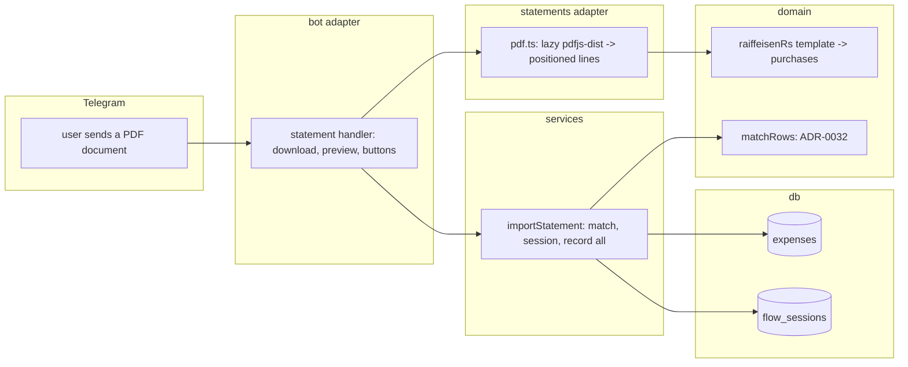

# 0027: Bank statement import: a Serbian bank's export file becomes expenses

> **Status:** approved
> **Created:** 2026-10-01
> **Depends on:** [Plan 0019](0019-encrypted-personal-ledger.md) (sealed ledgers in Phase 4)
> **Related ADRs:** [ADR-0032](../adrs/0032-statement-rows-match-recorded-expenses.md) (matching rows to recorded expenses),
> [ADR-0033](../adrs/0033-pdf-statements-via-pdfjs-dist.md) (PDF via `pdfjs-dist`),
> [ADR-0021](../adrs/0021-bank-sms-template-parsers-plain-expense.md) (bank SMS: original amount, plain expense),
> [ADR-0008](../adrs/0008-category-suggestion-from-history.md) (categories)

## TL;DR

The user sends the bot a Raiffeisen banka Srbija account statement PDF («Izvod po tekućem
računu»). The bot reads its card purchases and sets aside the ones already recorded (by hand,
from a receipt or from the bank's SMS: same amount and currency within a day, ADR-0032). It
answers with one preview: «Найдено 24 покупки: 19 новых, 5 уже записаны», with the new ones paged
below, [Записать все (19)], [Записать и уже записанные] and [Отмена]. A tap records them as
ordinary expenses in their original currency, with categories from history. Sending the same file
again records nothing. The first thing the user sees: they forward last month's statement PDF and
one tap catches up the whole month.

## Context & problem

Market check (2026-10-01): Auritrack imports bank statements. The SMS parser (Plan 0021) covers
one purchase at a time, and only when the user forwards it. A statement covers everything,
including what the user forgot. The hard part isn't parsing: it's not recording a purchase twice
when it already arrived by hand, receipt or SMS (ADR-0032).

The bank's e-banking exports PDF, XLSX and CSV. The only sample available at planning time
(2026-10-02) is a PDF, so this plan reads PDF. XLSX and CSV follow once a sample exists (see
What this plan does NOT do). The layout below was taken from that sample. **The sample itself
is never committed, and no value from it appears in this plan or in a fixture.**

## The statement layout (Raiffeisen banka Srbija, from the 2026-10-02 sample)

- **Page header:** the title «Izvod po tekućem računu broj <account>», the period «Od DD.MM.YYYY
  do DD.MM.YYYY», «Valuta: RSD», and «Strana: N/M». The header block repeats on every page.
- **The table header,** repeated per page, has these columns from left to right:
  - «Datum prijema/Datum transakcije» (the transaction date)
  - «Datum izvršenja» (the booking date, often a day later)
  - «Broj kartice» (the card's last 4 digits)
  - «Opis promene» (the description)
  - «Iznos u ref. valuti»
  - «Iznos u orig. valuti» (the amount and an ISO code, with a «Kurs:» line under it)
  - «Isplata» (debit, in RSD)
  - «Uplata» (credit)
  - «Stanje» (balance)
- **A row** starts with a line holding two `DD.MM.YYYY` dates. Its description wraps over
  further lines until the next row, a page footer or the final «STANJE» line.
- **Numbers** use a comma for thousands and a dot for decimals: `1,234.56`. A debit can be
  negative (a reversal).
- **A card purchase** is a row with a 4-digit «Broj kartice», a positive «Isplata», an «Uplata» of
  `0.00`, and an «Iznos u orig. valuti» of `<number> <ISO code>`. Rows without a card number are
  cash withdrawals («Gotovinska isplata»), bank fees («Naknada …»), salary and transfers, and they
  are not imported.
- **A foreign card purchase is often followed by a second, small card row** with the same
  merchant, in EUR. That is the bank's conversion charge. It is real money out, so it imports as
  its own expense.
- **A page footer** of fixed bank text ends each page.

## Decision

Follow ADR-0033 and ADR-0032. `src/statements/pdf.ts` lazily loads `pdfjs-dist` and returns the
document's positioned lines. `src/domain/statements/raiffeisenRs.ts` is a pure template. It
recognises the statement by its title and table header, maps cells to columns by the header
cells' x positions, joins wrapped descriptions, and returns the period plus the card purchases:

- the transaction date;
- the original amount in minor units and its currency;
- the merchant (the joined description, whitespace collapsed);
- the RSD debit, which is kept for the preview only.

A service matches purchases against the ledger (ADR-0032) and holds the result in a flow session
(ADR-0009) until the user taps. Recorded rows become ordinary expenses with no side table, like
SMS expenses (ADR-0021). The transaction date is `occurred_on`, and `occurred_at` is 12:00
`Europe/Belgrade` on that date. The category comes from `suggestCategory` with the merchant as
the description, the same path `recordBankSms` uses.

We rejected per-row checkboxes in the preview: a 40-row toggle list costs dozens of taps for a
catch-up feature, and a wrong row is deleted afterwards with the usual [Удалить].

## Architecture diagram



## Implementation phases

Each phase ships as its own commit. `dev` implements all phases in one session with no review
between phases. The architect reviews once at the end, in a fresh session. All new copy goes in
`src/bot/messages.ts`, in Russian.

**Fixtures are synthetic.** They follow the layout section with made-up merchants (for example
«PRODAVNICA PRIMER BEOGRAD»), card `0000`, invented amounts and an invented account number.
No file from a real statement enters the repo.

### Phase 1: Walking skeleton: a statement PDF records its card purchases
- **Owner skill:** dev
- **What:**
  - Add `pdfjs-dist`, pinned, under the cooldown (ADR-0033).
  - `src/statements/pdf.ts` loads the legacy build with a dynamic `import()` and returns
    `PositionedLine[]` (Data shapes). Items are grouped by y within a tolerance and sorted by x.
    A PDF with no text items returns an empty list.
  - `src/domain/statements/raiffeisenRs.ts` parses the lines per the layout section into
    `{ period, purchases }`, or `notThisStatement` when the title or table header is missing.
  - In a private chat, a `.pdf` document (by MIME type or extension) goes to the statement
    handler before the receipt-image handler. A recognised statement gets the preview
    `statementPreview`:
    - the period;
    - the number of purchases;
    - the new ones' count and total per currency (no conversion);
    - the first 10 new rows («DD.MM · <money> · <merchant>»);
    - [Записать все (N)] (`stm:all`) and [Отмена] (`stm:x`).

    The parsed purchases are held in a flow session with the usual TTL.
  - [Записать все] records each purchase as an expense with source key
    `stmt:raiffeisen-rs:<sha256 of date|amount|currency|merchant|ordinal>:<ledgerId>`, all in one
    transaction. It then edits the preview to `statementRecorded` (the count and the totals per
    currency).
  - A PDF that isn't this statement falls through to the existing document handling.
- **Files touched:** `package.json`, `pnpm-lock.yaml`, `src/statements/pdf.ts` (+ test),
  `src/domain/statements/types.ts`, `src/domain/statements/raiffeisenRs.ts` (+ test),
  `src/domain/statements/testing/` (synthetic fixtures), `src/services/importStatement.ts`
  (+ test), `src/bot/handlers/statement.ts`, `src/bot/handlers/receipt.ts`, `src/bot/flows.ts`,
  `src/services/flowSessions.ts`, `src/bot/callbackData.ts`, `src/bot/callbacks.ts`,
  `src/bot/messages.ts`, `src/bot/bot.ts`, `src/bot/bot.test.ts`, `CLAUDE.md` (a
  `src/statements/` line in the tree).
- **Done when:**
  - On a synthetic two-page fixture, the template returns exactly the card rows. An ATM row, a
    fee row, a salary row and a negative-debit row are all excluded. A description wrapped over
    three lines is joined into one merchant string.
  - `1,234.56 RSD` parses to 123456 minor units RSD, and `15.00 USD` to 1500 USD. A foreign
    purchase's following EUR conversion-charge row is its own purchase.
  - A synthetic PDF built in the test (one page with a title, a header and two rows) comes back
    from `pdf.ts` as positioned lines whose cells reproduce the rows. A PDF without text gives `[]`.
  - Recording a fixture with N card rows creates N expenses. Each has `occurred_on` set to the
    row's transaction date and its original amount and currency.
  - `pdfjs-dist` doesn't appear in the module graph at boot (a test asserts that importing
    `src/index.ts`'s bot wiring doesn't load it).

### Phase 2: Already recorded, and sending the file twice
- **Owner skill:** dev
- **What:**
  - `matchRows` (pure, ADR-0032) pairs purchases with the ledger's live expenses: same amount
    and currency, `occurred_on` within one day either side. It's one-to-one, takes the closest
    date first, and breaks ties by earlier `occurred_at` and then lower id.
  - The preview gains «Уже записано: M» and [Записать и уже записанные (N+M)] (`stm:dup`).
    [Записать все] records only the unmatched rows.
  - A row whose source key already exists counts as recorded, so a re-sent file previews
    «новых: 0», and its [Записать все] is replaced by `statementNothingNew`.
- **Files touched:** `src/domain/statements/match.ts` (+ test), `src/db/expenses.ts` (+ test),
  `src/services/importStatement.ts` (+ test), `src/bot/handlers/statement.ts`,
  `src/bot/messages.ts`, `src/bot/bot.test.ts`.
- **Done when:**
  - A hand-recorded `1 250 кофе` on `2026-09-12` matches a 1,250.00 RSD row dated `2026-09-13`,
    and doesn't match one dated `2026-09-14`.
  - Two 450.00 RSD rows on `2026-09-12` against one recorded 450 RSD expense that day give one
    match and one new row.
  - An SMS-recorded 15.00 USD purchase matches a row with an original amount of `15.00 USD`, not
    one with only its RSD debit.
  - Sending the same fixture twice and tapping [Записать все] both times records the rows once.
  - [Записать и уже записанные] records matched rows too, and the count equals N+M.

### Phase 3: Paging, limits, errors and categories
- **Owner skill:** dev
- **What:**
  - The preview pages new rows 10 at a time (`stm:p:<page>`) with the house pager. A matched row
    is shown on its own page section, marked «уже записано».
  - Limits:
    - a document over 5 MB is refused with `statementTooLarge` before download;
    - more than 30 pages, or more than 1000 purchases, is refused with `statementTooLong`.
  - Errors:
    - a PDF with no text layer (a scan) answers `statementNoText`;
    - an extraction failure answers `statementUnreadable`, logged with the error class only.
  - Categories: each recorded expense goes through `suggestCategory` with the merchant as its
    description and its history. A merchant recorded before takes its learned category.
  - An expired session's buttons answer `flowExpired` (ADR-0009).
- **Files touched:** `src/services/importStatement.ts` (+ test), `src/statements/pdf.ts`
  (+ test), `src/bot/handlers/statement.ts`, `src/bot/callbackData.ts`, `src/bot/messages.ts`,
  `src/bot/bot.test.ts`.
- **Done when:**
  - A 25-row preview shows 3 pages: 10, 10 and 5 rows.
  - A document reported at 6 MB isn't downloaded.
  - A synthetic textless PDF answers `statementNoText`.
  - A merchant previously re-categorised to Продукты records under Продукты.
  - No log line at any level above debug contains a merchant, an amount or the account number. A
    test captures the logger.

### Phase 4: Sealed ledgers, help and docs
- **Owner skill:** dev
- **What:**
  - Matching reads the ledger's amounts, so in a sealed ledger (Plan 0019) a statement is
    accepted only while unlocked. While locked it answers Plan 0019's locked message and keeps
    nothing.
  - Recorded rows are sealed like any expense.
  - `/help` gains a paragraph on statements: which bank, the PDF from e-banking, and what gets
    skipped. The README describes the feature and the privacy note that the file is read in
    memory and not stored.
- **Files touched:** `src/services/importStatement.ts` (+ test), `src/bot/handlers/statement.ts`,
  `src/bot/messages.ts`, `src/bot/bot.test.ts`, `README.md`.
- **Done when:**
  - A statement sent to a locked sealed ledger records nothing and creates no flow session.
  - After `/unlock`, the same file previews and records sealed rows that decrypt to the right
    amounts.
  - The bytes of a downloaded file are never written to disk. The handler passes a buffer, and a
    test asserts no write under the data directory.

### Phase 5: A real statement
- **Owner skill:** human
- **What:** On the deployed bot, send a real Raiffeisen statement PDF for a month partly recorded
  by hand and by SMS. Then send it a second time.
- **Done when:** The preview's purchase count matches the statement's card rows. Already-recorded
  purchases are recognised. [Записать все] fills the rest. The second send records nothing.
  Anything misparsed is logged as a followup **without** values from the statement.

## Data shapes

```ts
// illustrative
interface PositionedLine {
  readonly page: number;
  readonly y: number;
  readonly cells: readonly { readonly x: number; readonly text: string }[];
}
interface StatementPurchase {
  readonly date: LocalDate;          // Datum transakcije
  readonly amountMinor: number;      // Iznos u orig. valuti
  readonly currency: CurrencyCode;
  readonly merchant: string;         // Opis promene, joined
  readonly debitRsdMinor: number;    // Isplata, preview only
  readonly ordinal: number;          // among identical (date, amount, currency, merchant) rows
}
// callback_data: stm:all | stm:dup | stm:x | stm:p:<page>
```

## Risks & open questions

- **Privacy.** A statement holds the owner's name, address, account number, salary and cash
  withdrawals. The file is read in memory and discarded. Only card purchases are kept, as
  expenses. The flow session holds the purchases (merchant, amount, date) for its TTL, the same
  data that becomes expenses. Logs carry counts and error classes only. Real statements never
  enter the repo, and fixtures are synthetic.
- **Money.** Amounts parse exactly from `1,234.56`-style strings into minor units by the
  currency's exponent, with no float. The original currency is recorded, as for SMS (ADR-0021).
  The RSD debit is shown in the preview and never stored.
- **Time.** Statement dates are local dates in Serbia, recorded as `occurred_on` directly.
  `occurred_at` is 12:00 Belgrade, so a ledger in another timezone still dates it the same day.
- **Idempotency.** Every row's source key, plus the ±1-day match, so a re-send, an overlapping
  statement or a double tap records once.
- **False matches** are described in ADR-0032. The preview lists matched rows so the user can see
  them.
- **Layout drift.** If the bank changes the PDF, the template returns `notThisStatement` or fewer
  rows. Phase 5 and the user's eye are the check.
- **Memory.** `pdfjs-dist` loads only for an import, and the 5 MB and 30-page caps bound its
  peak.

## What this plan does NOT do

- XLSX and CSV statements. The bank offers them, but no sample existed at planning time. Once
  one does, a follow-on plan adds a template per format behind the same purchases type, matching
  and preview. The XLSX reader would mirror ADR-0026's writer.
- Other banks.
- Income, refunds, transfers, cash withdrawals and bank fees.
- Live bank connections (open banking).
- Storing the statement file.

## Implementation log

> Written by `dev`: one row per phase as its commit lands, then the close block. **The phases
> above are the contract. This section records what happened.** Observations, never conclusions:
> no pass list, no self-assessment. Deviations and unmet done-whens are **always** disclosed.
> Keep it shorter than `## Implementation phases`.

| phase | owner | state | commit |
|---|---|---|---|
| 1: Walking skeleton: a statement PDF records its card purchases | dev | not started | |
| 2: Already recorded, and sending the file twice | dev | not started | |
| 3: Paging, limits, errors and categories | dev | not started | |
| 4: Sealed ledgers, help and docs | dev | not started | |
| 5: A real statement | human | not started | |

### Notes

### Close triggers

## Followups

- XLSX and CSV templates for the same bank, once an anonymised sample exists.
