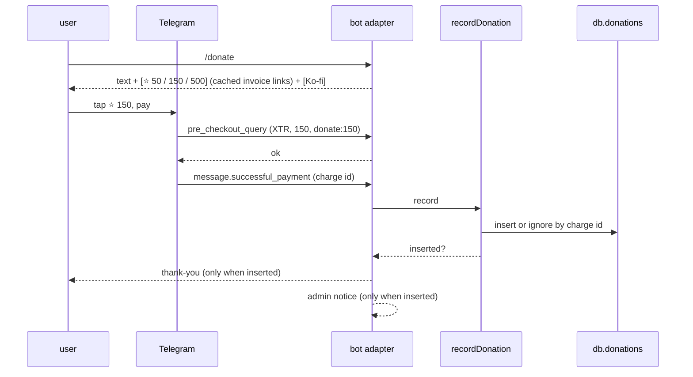

# 0028: Donations: everything free, `/donate` via Telegram Stars and an external link

> **Status:** approved
> **Created:** 2026-10-01
> **Related ADRs:** [ADR-0027](../adrs/0027-donations-only-funding.md) (donations only, no paid tier),
> [ADR-0024](../adrs/0024-admission-lives-in-the-database-via-invite-codes.md) (who is admitted)

## TL;DR

The bot stays free, with no paid tier and no feature limits, and says so. In a private chat,
`/donate` answers with one message: a short "free forever, support if you like" text and buttons
[⭐ 50], [⭐ 150], [⭐ 500], and [Ko-fi] when `DONATE_URL` is set. A Stars button opens Telegram's
payment sheet directly through a cached invoice link. After payment the bot thanks the donor once,
stores a minimal row, and tells the admin. A donation unlocks nothing. `/help` ends with one line
pointing to `/donate`. `/paysupport` relays a refund request to the admin, and the admin's `/refund`
returns the Stars. The first thing the user sees: `/donate`, then [⭐ 50], then the payment sheet,
then «Спасибо! Бот остаётся бесплатным для всех».

## Context & problem

The product decision is donations after public release, with no paid services (ADR-0027). Today
the bot has no payment code at all. Stars work for users whose cards can't pay foreign services,
which fits the Russian-speaking audience. An external page covers card payers abroad. Plan 0029
lists this plan as a prerequisite for opening the bot.

## Decision

At boot the bot creates one Stars invoice link per preset amount (`createInvoiceLink`, currency
`XTR`, empty provider token, payload `donate:<stars>`) and keeps them in memory. If creation
fails, `/donate` shows only the external button, or a short «Пожертвования временно недоступны»
when neither is available, and the failure is logged at warn.

`pre_checkout_query` runs behind the access middleware, so only admitted users can pay. It
approves the query only when the currency is `XTR` and the payload names a preset matching
`total_amount`. `successful_payment` is handled **before** the access middleware: by then the
Stars are already taken, so the payment is recorded even if the payer was blocked in between. The
row is keyed by `telegram_payment_charge_id`, so a redelivered update records once and thanks once.

We rejected a native invoice message per tap (`sendInvoice`): it costs two messages per attempt and
leaves stale invoice cards in the chat. We rejected `/donate` in groups: a donation pitch doesn't
belong in a shared family chat. The funding model itself is ADR-0027.

## Architecture diagram



## Implementation phases

Each phase ships as its own commit. `dev` implements all phases in one session with no review
between phases. The architect reviews once at the end, in a fresh session. All new copy goes in
`src/bot/messages.ts`, in Russian. Bot UI copy may use the ⭐ emoji on the Stars buttons.

### Phase 1: Walking skeleton: `/donate` takes 50 Stars and says thank you
- **Owner skill:** dev
- **What:**
  - The next free migration adds `donations` (Data shapes).
  - At boot, `createInvoiceLink` runs for 50, 150 and 500 Stars: title, description and label
    come from messages, the payload is `donate:<stars>`, the currency is `XTR`, the provider token
    is empty, and prices hold one item of that amount. The links are kept in memory. A failed
    creation logs at warn and leaves that amount out.
  - `/donate` in a private chat replies with `messages.donate`: the bot is free for everyone, a
    donation unlocks nothing, and it helps pay for the server. The keyboard has one URL button per
    available link. With no link available it replies `messages.donateUnavailable`.
  - `pre_checkout_query` (behind access): approve when `currency === 'XTR'`, the payload parses to
    a preset amount, and that amount equals `total_amount`. Otherwise answer `ok: false` with
    `messages.donateRejected`.
  - `message:successful_payment` (registered before access): `recordDonation` inserts a row,
    doing nothing on a duplicate `telegram_payment_charge_id`. The user is resolved from the
    payer's Telegram identity. When it inserts, the bot replies `messages.donateThanks`. If no user
    matches the identity, the bot logs at warn with the charge id, inserts nothing and replies with
    the thanks anyway.
  - `/donate` joins `messages.commands`, and is not added to `groupCommands`.
- **Files touched:** `src/db/migrations/00NN_donations.sql`, `src/db/donations.ts` (+ test),
  `src/domain/donations.ts` (+ test: presets and payload parsing), `src/services/recordDonation.ts`
  (+ test), `src/bot/handlers/donate.ts`, `src/bot/bot.ts`, `src/bot/messages.ts`,
  `src/bot/testHarness.ts`, `src/bot/bot.test.ts`, `src/index.ts`.
- **Done when:**
  - `parseDonationPayload('donate:150')` is 150, and `'donate:149'`, `'donate:'`, `'donate:1e2'`
    and `'other:150'` are each undefined.
  - A pre-checkout of `XTR`, 150 and `donate:150` is approved. A pre-checkout of `XTR`, 50 and
    `donate:150` is rejected, and so is `USD`, 150, `donate:150`.
  - A `successful_payment` update for an admitted user inserts one row with `stars = 150`. The
    same update delivered twice leaves one row and sends one thank-you.
  - A `successful_payment` from a user the access middleware would refuse still inserts its row.
  - With link creation failing for every amount and no `DONATE_URL`, `/donate` answers
    `donateUnavailable`.
  - `/donate` in a bound group gets no reply.

### Phase 2: The external link, the `/help` line and the admin notice
- **Owner skill:** dev
- **What:**
  - Config: an optional `DONATE_URL`, which must be an `https:` URL or boot fails naming the key.
    When set, `/donate` adds a [Ko-fi] button whose label comes from messages (`donateExternal`),
    and the button is hidden when it's unset. `.env.example` documents it.
  - `/help` in private ends with `messages.helpDonateLine` («Бот бесплатный. Поддержать: /donate»).
    Group `/help` doesn't get it.
  - Each inserted donation sends the admin `messages.adminDonation`, with the Stars amount, the
    donor's internal user id and the charge id. No Telegram name or username goes in the notice.
- **Files touched:** `src/config.ts` (+ test), `.env.example`, `src/bot/handlers/donate.ts`,
  `src/bot/handlers/help.ts`, `src/bot/adminNotifier.ts`, `src/bot/messages.ts`,
  `src/bot/bot.test.ts`, `README.md`.
- **Done when:**
  - `DONATE_URL=http://example.com` fails config validation with an error naming `DONATE_URL`.
    `https://ko-fi.com/example` passes.
  - With `DONATE_URL` set, `/donate`'s keyboard has four buttons, the last a URL button to it.
    Without it, the keyboard has three.
  - Private `/help` ends with the donate line, and group `/help` doesn't contain `/donate`.
  - A duplicate `successful_payment` sends the admin one notice, not two.

### Phase 3: `/paysupport` and the admin's `/refund`
- **Owner skill:** dev
- **What:**
  - `/paysupport` (private) explains that a donation unlocks nothing and that a refund can be asked
    for by sending `/paysupport <текст>`. With text, it forwards the text to the admin with the
    user's internal id and their donations (charge id, Stars, date in the admin's timezone), then
    confirms to the user. The donations list is capped at the 10 newest.
  - `/refund <charge id>` (admin only, private) looks up the donation, calls `refundStarPayment`
    with the payer's Telegram id (resolved through `auth_identities`) and the charge id, then sets
    `refunded_at`. It reports a done, not-found, already-refunded or Telegram-error result to the
    admin. A non-admin's `/refund` falls through to the normal unknown-command handling.
- **Files touched:** `src/db/donations.ts` (+ test), `src/services/refundDonation.ts` (+ test),
  `src/bot/handlers/paysupport.ts`, `src/bot/handlers/refund.ts`, `src/bot/bot.ts`,
  `src/bot/messages.ts`, `src/bot/bot.test.ts`.
- **Done when:**
  - `/paysupport верните пожалуйста` from a user with two donations sends the admin one message
    holding both charge ids and the text, and replies to the user with a confirmation.
  - The admin's `/refund <charge id>` calls `refundStarPayment` once with the payer's Telegram id,
    and sets `refunded_at`. A second `/refund` of the same id doesn't call Telegram and answers
    already-refunded.
  - A `refundStarPayment` error leaves `refunded_at` NULL and reports the error to the admin.
  - A non-admin's `/refund <id>` doesn't call `refundStarPayment`.

### Phase 4: A real donation and refund
- **Owner skill:** human
- **Blocks merge:** no
- **What:** On the deployed bot, with `DONATE_URL` set, donate 50 Stars from your own account,
  then refund it with `/refund`.
- **Done when:** The payment sheet opens from the button, the thank-you and admin notice arrive
  once each, the [Ko-fi] button opens the page, and the 50 Stars come back to the account after
  `/refund`.

## Data shapes

```sql
-- illustrative
CREATE TABLE donations (
  id TEXT PRIMARY KEY,
  user_id TEXT NOT NULL REFERENCES users(id),
  stars INTEGER NOT NULL CHECK (stars > 0),
  telegram_payment_charge_id TEXT NOT NULL UNIQUE,
  created_at TEXT NOT NULL,
  refunded_at TEXT
);
```

Stars are a whole-unit count with no minor units. They're stored as `stars`, not money: they aren't
an ISO-4217 currency and never enter a ledger, a total or a conversion.

```ts
// illustrative
const DONATION_PRESETS = [50, 150, 500] as const;
type DonationPreset = (typeof DONATION_PRESETS)[number];
function parseDonationPayload(payload: string): DonationPreset | undefined; // 'donate:<n>'
```

## Risks & open questions

- **Telegram's terms (unverified).** Stars payouts, the holding period and the requirement to
  handle `/paysupport` are as recalled at planning time. The human phase checks the current
  terms before going live.
- **Money moved but not recorded.** `successful_payment` sits before the access middleware so a
  block can't swallow it. If the insert throws, the error boundary logs the charge id at error,
  so the admin can still refund by hand.
- **Privacy.** A donation row is personal data that outlives `/delete_account` (Plan 0029), because
  a refund needs it. Plan 0029's `PRIVACY.md` must say so, and that plan's Phase 5 is the place to
  add it. Logs carry the charge id and Stars amount at info, never a name or username.
- **Idempotency.** The UNIQUE charge id makes the record, the thank-you and the admin notice
  happen once per payment. Pre-checkout writes nothing, so a repeat is harmless.
- **Stale links.** An invoice link stays valid, but a preset change at deploy makes old links
  carry a payload the new code doesn't know. The pre-checkout then rejects it, which is correct.
- **Access before Plan 0029.** Until Plan 0029 lands, "admitted" means the `.env` allowlist.
  Nothing here depends on which.

## What this plan does NOT do

- Paid features, subscriptions or donor perks (ADR-0027).
- A custom donation amount. Three presets cover it, and a custom amount needs a flow session.
- The monthly-summary footer. Plan 0026 adds it once that push exists.
- Donations in groups.
- A donor list or public thanks.

## Implementation log

> Written by `dev`: one row per phase as its commit lands, then the close block. **The phases
> above are the contract. This section records what happened.** Observations, never conclusions:
> no pass list, no self-assessment. Deviations and unmet done-whens are **always** disclosed.
> Keep it shorter than `## Implementation phases`.

| phase | owner | state | commit |
|---|---|---|---|
| 1: Walking skeleton: `/donate` takes 50 Stars and says thank you | dev | not started | |
| 2: The external link, the `/help` line and the admin notice | dev | not started | |
| 3: `/paysupport` and the admin's `/refund` | dev | not started | |
| 4: A real donation and refund | human | not started | |

### Notes

### Close triggers

## Followups
