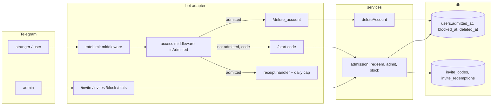

# 0029: Opening by invite: invite links, abuse limits, a privacy policy and account deletion

> **Status:** approved
> **Created:** 2026-10-01
> **Related ADRs:** ADR-0024 ([0024-admission-lives-in-the-database-via-invite-codes.md](../adrs/0024-admission-lives-in-the-database-via-invite-codes.md)),
> [ADR-0014](../adrs/0014-group-chats-bind-to-shared-ledgers.md) (groups),
> [ADR-0002](../adrs/0002-ledgers-and-identity.md) (identity)

## TL;DR

The bot stops being one household's and admits strangers by invite. The admin sends `/invite`
and gets a `t.me/<bot>?start=<code>` link that admits up to 10 people within 14 days. Whoever
opens it lands in the normal `/start`. Everyone else gets one «бот работает по приглашениям»
reply and then silence. Behind that sit the guards a stranger-facing bot needs: a per-user
message rate limit, a daily receipt cap (each receipt calls a tax site on the user's behalf),
admin `/block` and `/stats`, `/privacy` with a policy in the repo, and `/delete_account`. The
first thing the admin sees: `/invite` answers with a link, and a second Telegram account that
opens it can record `450 кофе`.

## Context & problem

Admission today is `ALLOWED_TELEGRAM_IDS` in `.env`. Opening up needs a way in that doesn't
involve editing the VPS, and limits on what one stranger can cost. A spammer shouldn't be able to
hog the bot, and one user shouldn't be able to drive hundreds of requests at `suf.purs.gov.rs`.
Strangers' financial data also brings obligations a household didn't need: a stated policy, and
a way to delete everything. ADR-0024 records why admission moves into the database.

**Prerequisites for the opening itself** (Phase 7, not for building this plan): Plan 0015
(onboarding), Plan 0019 (encrypted ledger), Plan 0024 (export) and Plan 0028 (donations). This
plan can land before them. With the household admitted at boot, it changes nothing they see
until the first link goes out.

## Decision

Follow ADR-0024. `users.admitted_at` / `users.blocked_at` and two invite tables are the
truth, and `isAdmitted` is the one check. Abuse limits live in the bot adapter: an in-memory
rate limiter per Telegram id, and a receipt cap counted from the `receipts` table. Account
deletion hard-deletes the personal ledger and its data, and keeps the user row as a tombstone
so the user's rows in group ledgers keep the totals right, shown as «удалённый участник».
The policy is `PRIVACY.md` in the public repo, linked from `/privacy`.

We rejected a fully open bot with a user cap: the admin wants to control who arrives, not only
how many. We rejected deleting group rows on account deletion, because it rewrites other
members' past months. We rejected putting the policy text in the bot: it's too long for one
message, and the repo versions it with the code.

## Architecture diagram



## Implementation phases

Each phase ships as its own commit. `dev` implements all phases in one session with no review
between phases. The architect reviews once at the end, in a fresh session. All new copy goes in
`src/bot/messages.ts`, in Russian.

### Phase 1: Walking skeleton: an invite link admits a stranger
- **Owner skill:** dev
- **What:**
  - The next free migration adds `users.admitted_at`, `users.blocked_at` and `users.deleted_at`,
    plus `invite_codes` and `invite_redemptions` (Data shapes).
  - Config: `ADMIN_TELEGRAM_ID` (required) and `ADMIT_TELEGRAM_IDS` (optional, comma-separated).
    Boot fails with a message naming the rename if `ALLOWED_TELEGRAM_IDS` is set.
  - At boot, each `ADMIT_TELEGRAM_IDS` id and the admin are provisioned if needed and admitted
    if not already (`admitted_at` = now). This step is idempotent.
  - `isAdmitted(telegramId)`: the admin always; else a user found by identity with `admitted_at`
    set and `blocked_at` NULL. It replaces the allowlist in the private-chat middleware, in
    group activation and in the group card's `authorAllowlisted`.
  - `/invite` (admin only, in private) creates a code with 10 uses and a 14-day expiry, and
    replies with the deep link. `/invite 30 7` sets uses and days. Both must be integers from 1
    to 1000, else the reply shows the usage.
  - `/start <code>` from someone not admitted redeems in one transaction: the code exists, isn't
    revoked, `now < expires_at` and redemptions < `max_uses`. It then provisions, admits, records
    the redemption and continues as a normal `/start`. An invalid code gets
    «Ссылка недействительна или истекла». An admitted user's `/start <code>` ignores the code.
  - Anyone else in private gets «Бот работает по приглашениям» once per Telegram id per process
    (a bounded in-memory set of 10 000 ids, oldest dropped first), then silence. Blocked users
    get silence from the first message.
- **Files touched:** `src/db/migrations/00NN_admission.sql`, `src/db/users.ts`,
  `src/db/invites.ts` (+ tests), `src/services/admission.ts` (+ test), `src/config.ts`,
  `src/index.ts`, `src/bot/middleware/allowlist.ts` → `src/bot/middleware/access.ts` (+ test),
  `src/bot/handlers/start.ts`, `src/bot/handlers/invite.ts`, `src/bot/group/activation.ts`,
  `src/bot/group/text.ts`, `src/bot/group/card.ts`, `src/bot/adminNotifier.ts`, `src/bot/bot.ts`,
  `src/bot/messages.ts`, `.env.example`.
- **Done when:**
  - A code made with `/invite 2 1` admits two distinct Telegram ids via `/start <code>`. A third
    id gets the invalid-link reply and stays unadmitted, and the code's redemption count is 2.
  - The same code redeemed at `created_at + 24h` exactly is refused (`now < expires_at` is
    false), and at `created_at + 24h − 1 ms` it's accepted.
  - A redelivered `/start <code>` update (same `update_id`) leaves one redemption row.
  - An unadmitted id's first private message gets the invitation reply, and its second gets
    nothing.
  - The bot added to a group by an unadmitted user leaves it, and by an admitted user binds.
  - Boot with `ADMIT_TELEGRAM_IDS=111,222` admits both. A second boot changes no `admitted_at`.
  - Boot with `ALLOWED_TELEGRAM_IDS` set throws an error that names `ADMIN_TELEGRAM_ID`.

### Phase 2: Admin tools: list and revoke codes, block, stats
- **Owner skill:** dev
- **What:**
  - `/invites` lists live codes (not revoked, not expired) with `used/max` and the expiry date in
    the admin's timezone, each with [Отключить], which sets `revoked_at`.
  - `/block <telegram id>` sets `blocked_at`, and `/unblock <telegram id>` clears it. A blocked
    user's private and group updates are dropped before any handler, and their group messages
    record nothing.
  - `/stats` shows four lines and no amounts or descriptions: admitted users, users with an
    expense created in the last 7 days, expenses created in the last 7 days, live codes.
  - Every admin command from a non-admin is treated as unknown text, with the existing `/help`
    answer.
- **Files touched:** `src/bot/handlers/invite.ts`, `src/bot/handlers/admin.ts` (+ test),
  `src/services/admission.ts`, `src/db/invites.ts`, `src/db/users.ts`, `src/bot/callbackData.ts`,
  `src/bot/callbacks.ts`, `src/bot/group/index.ts`, `src/bot/messages.ts`.
- **Done when:**
  - [Отключить] on a code makes its next redemption fail, and a double tap answers that it's
    already off.
  - After `/block 222`, id 222's `450 кофе` in private and in a bound group records nothing.
    After `/unblock 222` it records again.
  - With 3 admitted users (the admin among them), of whom one recorded 2 expenses within 7 days and one recorded 1
    expense 8 days ago, `/stats` reads 3 admitted, 1 active and 2 expenses.
  - `/stats` from a non-admin gets the `/help` answer.

### Phase 3: Abuse limits: message rate and daily receipts
- **Owner skill:** dev
- **What:**
  - A rate-limit middleware registered before the access check, for private and group updates.
    It allows 30 updates per Telegram id in any rolling 60 s window and silently drops the rest.
    Dropped updates don't count toward the window. It logs the drop at info with the update id only, at most once per id per minute. The admin
    is exempt.
  - A receipt cap: a private-chat receipt (photo, file or link) from a user who already has 20
    receipts created on their local today gets «Лимит чеков на сегодня исчерпан, попробуйте
    завтра» and records nothing. The check sits in `recordReceipt`, after decoding and after the
    source-key duplicate lookup, and before any insert: the repeat check needs the decoded fiscal
    id, so a receipt already recorded answers «Уже записано» even past the cap, and doesn't count
    toward it. Decoding is local; the tax-site fetch the cap protects runs only for a recorded
    receipt, in the worker (ADR-0018). The admin is exempt.
- **Files touched:** `src/bot/middleware/rateLimit.ts` (+ test), `src/bot/handlers/receipt.ts`,
  `src/services/recordReceipt.ts`, `src/db/receipts.ts` (+ test), `src/bot/bot.ts`,
  `src/bot/messages.ts`.
- **Done when:**
  - With an injected clock, 30 updates at t=0..29 s pass, and the 31st at t=30 s is dropped. An
    update at t=60.001 s passes, because the first update left the window.
  - A user in `Europe/Belgrade` (UTC+2 in October) with 20 receipts created between 00:00 and
    23:59 local on 2026-10-05 gets the cap reply for the 21st at 23:59 local. A receipt at
    00:00 local on 2026-10-06 (22:00 UTC on 2026-10-05) records.
  - A redelivered receipt photo after the cap still answers «Уже записано» for an existing one.

### Phase 4: Delete my account
- **Owner skill:** dev
- **What:**
  - `/delete_account` (private only) shows what goes: the personal ledger with every expense,
    receipt, category and budget, and the settings. It also says what stays: expenses in group
    ledgers, shown as «удалённый участник», and backups for up to `BACKUP_KEEP` days. Buttons
    are [Удалить всё] / [Отмена].
  - [Удалить всё] runs one transaction:
    - delete the personal ledger's receipt items, receipts, expenses, category caps, budgets,
      categories, membership and the ledger itself;
    - delete the user's flow session and `auth_identities` row;
    - set `deleted_at`, clear `admitted_at` and `active_ledger_id`;
    - null the user's `ledger_members.display_name` in group ledgers.
  - The users row stays as a tombstone. Group expenses keep `created_by` pointing at it.
  - Group reports and cards render a member with no display name and a deleted user as
    «удалённый участник».
  - The same Telegram id later is a new person: no identity matches, so it needs an invite like
    anyone else.
  - A group ledger the user bound keeps working. Its settings can't be changed by anyone (see
    Risks).
  - If Plan 0019 has landed, the sealed ledger's key rows are deleted with the ledger.
- **Files touched:** `src/services/deleteAccount.ts` (+ test), `src/db/users.ts`,
  `src/db/ledgers.ts`, `src/db/expenses.ts`, `src/db/receipts.ts`, `src/db/receiptItems.ts`,
  `src/db/budgets.ts`, `src/db/categories.ts`, `src/db/flowSessions.ts`,
  `src/bot/handlers/deleteAccount.ts` (+ test), `src/bot/group/summary.ts`,
  `src/bot/group/card.ts`, `src/bot/callbackData.ts`, `src/bot/callbacks.ts`,
  `src/bot/messages.ts`.
- **Done when:**
  - Take a user with 3 personal expenses (one a receipt with items) and 2 expenses in a group
    ledger worth 450.00 and 120.00 RSD. After deletion, no row in `expenses`, `receipts` or
    `receipt_items` references the personal ledger, and the user has no `auth_identities` row.
    The group's `/month` still totals 570.00 RSD (57 000 minor units) from those two, under
    «удалённый участник».
  - A double tap on [Удалить всё] deletes once, and the second tap answers that the data is
    already deleted.
  - A pending receipt fetch for a deleted receipt doesn't crash the receipt worker. The row is
    gone, so the worker never picks it up.
  - The same Telegram id's next private message gets the invitation reply.

### Phase 5: Privacy policy and `/privacy`
- **Owner skill:** dev
- **What:**
  - `PRIVACY.md` at the repo root, in Russian. It covers:
    - what is stored: the Telegram id, first name in groups, expenses, receipts with their line
      items, settings;
    - where: a VPS in the EU, SQLite plus daily backups kept `BACKUP_KEEP` days;
    - who can read it: the operator, with Plan 0019's sealed ledgers as the exception;
    - what leaves the server: the tax sites for receipts, and NBS for rates, which receives no
      user data;
    - Telegram's own role;
    - deletion via `/delete_account`, with the backup lag;
    - no ads, no selling, no analytics;
    - a contact (the admin's Telegram username, a human fill-in left as a marked placeholder).
  - `/privacy` replies a three-line summary and the link
    `https://github.com/IgorKonovalov/personal_expenses_bot/blob/main/PRIVACY.md`.
  - `/help` gains `/privacy` and `/delete_account`.
  - README: a "Joining" section (invite links), the new commands, the env rename. `.env.example`
    updated.
- **Files touched:** `PRIVACY.md`, `src/bot/handlers/privacy.ts`, `src/bot/handlers/help.ts`,
  `src/bot/bot.ts`, `src/bot/messages.ts`, `README.md`, `.env.example`.
- **Done when:** `/privacy` replies the summary with the link above. The link checker passes.
  `/help` lists both new commands. `PRIVACY.md` names every external host the README lists under
  Receipts and Currency conversion.

### Phase 6: Prepare the opening
- **Owner skill:** human
- **What:**
  1. Fill in the contact in `PRIVACY.md`.
  2. On the VPS, add `ADMIN_TELEGRAM_ID` (the admin's id) and `ADMIT_TELEGRAM_IDS` (the rest) to
     the `.env`, and keep `ALLOWED_TELEGRAM_IDS`: the code before 0029 requires it, so every
     deploy until 0029 ships still boots.
- **Files touched:** `PRIVACY.md`, the VPS `.env`.
- **Done when:** `PRIVACY.md` names a contact, and the VPS `.env` sets `ADMIN_TELEGRAM_ID` and
  lists every other household id in `ADMIT_TELEGRAM_IDS`. This phase blocks the merge, so the
  new keys exist before any push can deploy 0029.

### Phase 7: Deploy and open
- **Owner skill:** human
- **Blocks merge:** no
- **What:**
  1. Delete `ALLOWED_TELEGRAM_IDS` from the VPS `.env`, which 0029 refuses at boot, then push
     and deploy, and check that the household still records.
  2. Test `/invite` with a second account.
  3. Post the first link only once Plans 0015, 0019, 0024 and 0028 are done.
- **Files touched:** the VPS `.env`.
- **Done when:** after the deploy, every household member records `450 кофе` in private. A test
  account admitted by a fresh link records too, and `/delete_account` on it leaves the
  household's data untouched.

## Data shapes

```sql
-- illustrative
ALTER TABLE users ADD COLUMN admitted_at TEXT;   -- UTC instant; NULL = not admitted
ALTER TABLE users ADD COLUMN blocked_at TEXT;
ALTER TABLE users ADD COLUMN deleted_at TEXT;    -- tombstone

CREATE TABLE invite_codes (
  code TEXT PRIMARY KEY,          -- 11 chars: 8 random bytes, base64url
  max_uses INTEGER NOT NULL CHECK (max_uses BETWEEN 1 AND 1000),
  expires_at TEXT NOT NULL,       -- UTC instant
  revoked_at TEXT,
  created_at TEXT NOT NULL
);

CREATE TABLE invite_redemptions (
  code TEXT NOT NULL REFERENCES invite_codes(code),
  user_id TEXT NOT NULL REFERENCES users(id),
  redeemed_at TEXT NOT NULL,
  PRIMARY KEY (code, user_id)
);
```

The callback data for the new buttons is `inv:off:<code>` (18 bytes) and `acct:del` / `acct:keep`,
all well under 64 bytes. The deep-link payload is the bare code (11 characters of
`[A-Za-z0-9_-]`, within Telegram's 64-character `start` limit).

## Risks & open questions

- **Env rename at deploy.** A deploy before the `.env` edit fails at boot, by design. The
  household is then offline until the edit. Phase 6 adds the new keys, and Phase 7 deletes the old
  one right before the push that ships 0029. Until then, a deploy of the code before 0029 needs
  the old key, so both stay.
- **An orphaned group ledger.** If the user who bound a group deletes their account, nobody can
  change that group's settings. Accepted for now. Handing ownership to another admitted member is
  a followup.
- **The "one reply" set is in memory.** A restart lets a stranger get one more invitation
  reply. That's bounded and harmless. Persisting strangers' Telegram ids for this isn't worth
  the privacy cost.
- **The rate limit is per process.** That's correct for one long-polling process (ADR-0001). A
  second instance would need a shared store.
- **Privacy:** admission and admin logs carry ids and update ids, never amounts or descriptions.
  `/stats` shows counts only.
- **Migration numbering.** Plan 0019 names migration `0011`, which `0011_fx_rates.sql` has since
  taken. Whichever of the two plans is built first takes the next free number. This plan names
  none.

## What this plan does NOT do

- Users inviting users, an access-request button, or a waitlist.
- Data export (Plan 0024), onboarding (Plan 0015), donations (Plan 0028) or encryption (Plan
  0019). These are prerequisites for the opening, not part of this plan.
- Languages other than Russian.
- Handing a group ledger to a new owner (followup).
- Scrubbing deleted users out of existing backup files.

## Implementation log

> Written by `dev`: one row per phase as its commit lands, then the close block. **The phases
> above are the contract. This section records what happened.** Observations, never conclusions:
> no pass list, no self-assessment. Deviations and unmet done-whens are **always** disclosed.
> Keep it shorter than `## Implementation phases`.

| phase | owner | state | commit |
|---|---|---|---|
| 1: Walking skeleton: an invite link admits a stranger | dev | done | a5d3864 |
| 2: Admin tools: list and revoke codes, block, stats | dev | done | 5e1c62b |
| 3: Abuse limits: message rate and daily receipts | dev | done | cfd47fc |
| 4: Delete my account | dev | done | 8b41787 |
| 5: Privacy policy and `/privacy` | dev | done | 56b6444 |
| 6: Prepare the opening | human | done | PRIVACY.md contact in this commit; VPS .env holds ADMIN_TELEGRAM_ID (no other household id, so no ADMIT_TELEGRAM_IDS) beside the old key |
| 7: Deploy and open | human | owed | |

### Notes

- Phase 1: the migration is `0013_admission.sql`. Redemption runs in the access middleware
  (`src/bot/middleware/access.ts`), not in `src/bot/handlers/start.ts`, because
  `clearFlowOnCommand` provisions the sender before any command handler; `start.ts` is unchanged
  (it already ignores an unknown payload). Only an 11-character base64url payload is taken as a
  code; a stranger's `/start e_…` or `gs_…` gets the invitation reply.
- Phase 1: files changed outside `Files touched`: `src/bot/group/index.ts` (drops
  `allowedTelegramIds` from `GroupHandlerDeps`), `src/bot/testHarness.ts` (admin = `ALLOWED_ID`;
  `admitOnFirstDm` admits `SECOND_ALLOWED_ID` just before its first private update),
  `src/config.test.ts`, `src/bot/bot.test.ts`, `src/bot/handlers/unlock.test.ts`,
  `src/bot/group/group.test.ts` (two stranger deep-link cases now expect the invitation reply),
  `src/db/ledgerKeys.test.ts` (pinned the migration list `['0012']`; now asserts 0012 runs
  first). `src/bot/middleware/allowlist.test.ts` was removed with `allowlist.ts`; its cases
  moved to `access.test.ts`. Added test `src/db/invites.test.ts`.
- Phase 1: `admitAtBoot` is `admitTelegramIds(deps, ids, now)`; `src/index.ts` passes the admin
  plus `ADMIT_TELEGRAM_IDS`. `/invite` with one argument shows the usage.
- Phase 1: the group card's `authorAllowlisted` is renamed `authorAdmitted`.
- Phase 2: `src/bot/bot.ts` (outside `Files touched`) registers `registerAdmin`;
  `src/bot/callbacks.ts` is unchanged. `/stats` counts admitted users as `admitted_at` set and
  `blocked_at` NULL, and leaves soft-deleted expenses out of both 7-day counts. `/block` on an id
  with no user row replies that the user never wrote; on the admin it refuses. A blocked user's
  `my_chat_member` (adding the bot) is dropped too, so the bot stays in that group unbound.
- Phase 3: `src/bot/handlers/text.ts` (outside `Files touched`) takes `AdminDeps` so the link
  path can exempt the admin. `recordReceipt`'s `dailyCap` is optional: absent means no cap, so
  the existing test callers are unchanged. The cap counts the user's receipts in any ledger,
  deleted expenses included, created within the local day of the ledger's effective timezone.
- Phase 3 done-whens: the Belgrade cap case and the duplicate past the cap are tested on
  `recordReceipt` (`src/services/recordReceipt.test.ts`, outside `Files touched`), not with a
  redelivered photo through the bot: the photo path ends in the same `recordReceipt` call. The
  injected-clock case is tested on the `RateLimiter` class; the middleware is tested through the
  bot at a fixed clock.
- Phase 4: files changed outside `Files touched`: `src/bot/bot.ts` (registers the handler;
  `BotOptions.backupKeep` for the prompt's backup line), `src/index.ts`,
  `src/bot/testHarness.ts`, `src/bot/bot.test.ts`, `src/bot/handlers/unlock.test.ts` (pass
  `backupKeep`), and `src/bot/middleware/access.ts`: the second [Удалить всё] comes from an id
  with no identity, so the access gate answers it with «Данные уже удалены». Listed but
  unchanged: `src/db/receiptItems.ts` (the existing `deleteLedgerReceipts` deletes the items),
  `src/bot/callbacks.ts`, `src/bot/group/summary.ts` (the «удалённый участник» fallback is in
  `messages.ts`, where the report's «Без имени» was).
- Phase 4: the sealed ledger's `ledger_keys` and `ledger_key_wraps` rows are deleted in
  `deleteLedger` (`src/db/ledgers.ts`), not in `src/db/ledgerKeys.ts`. The group card's author
  is «удалённый участник» on `/card` for an expense whose author is deleted.
- Phase 5: `.env.example` was already updated in Phase 1 and is unchanged here;
  `src/bot/handlers/help.ts` is unchanged (the help text is in `messages.ts`). Added test
  `src/bot/handlers/privacy.test.ts`: it reads the backticked host names from the README's
  Receipts and Currency conversion sections and checks `PRIVACY.md` names each. `/privacy` and
  `/delete_account` are in `/help`, not in the `setMyCommands` list. The contact in `PRIVACY.md`
  is the placeholder `TODO-CONTACT`, for Phase 6.
- Followups noticed, not acted on: `src/services/groupChats.ts` comments still say "allowlisted
  user" / "the allowlist" (lines 30 and 68); a stranger's callback query other than
  [Удалить всё] is dropped without an `answerCallbackQuery`.

### Close triggers

- **What shipped:** migration `0013_admission.sql`; `src/services/admission.ts`,
  `src/db/invites.ts`, `src/bot/middleware/access.ts` (replaces `allowlist.ts`),
  `src/bot/middleware/rateLimit.ts`, `src/bot/handlers/invite.ts`, `admin.ts`,
  `deleteAccount.ts`, `privacy.ts`, `src/services/deleteAccount.ts`, the receipt cap in
  `recordReceipt`, `PRIVACY.md`. Commits a5d3864, 5e1c62b, cfd47fc, 8b41787, 56b6444.
- **User-visible surface changed:** new commands `/invite`, `/invites`, `/block`, `/unblock`,
  `/stats` (admin only), `/privacy`, `/delete_account`; callback data `inv:off:<code>`,
  `acct:del`, `acct:keep`; new copy «Бот работает по приглашениям…», «Ссылка недействительна или
  истекла.», «Лимит чеков на сегодня исчерпан, попробуйте завтра.», «удалённый участник» (was
  «Без имени» in group reports); `/help` gains two lines. Env: `ADMIN_TELEGRAM_ID` (required),
  `ADMIT_TELEGRAM_IDS` (optional); a set `ALLOWED_TELEGRAM_IDS` fails the boot.
- **Gate at the tip (56b6444):** `pnpm typecheck` exit 0; `pnpm lint` exit 0; `pnpm test` exit
  0, 77 files, 1027 tests passed; `pnpm build` exit 0; `node scripts/check-doc-links.mjs` exit
  0, 242 relative links resolve.
- **Outstanding `human` phases:** Phase 6 (fill the `PRIVACY.md` contact, rename the VPS env
  before the deploy, deploy, test `/invite` with a second account).

## Followups

- Hand a group ledger to another admitted member when its owner deletes their account.
