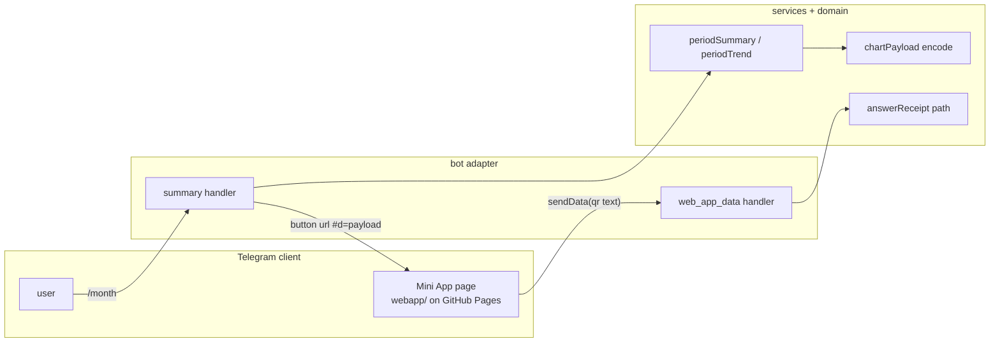

# 0030: A Mini App for charts and a live QR scan, static with no backend

> **Status:** approved (2026-10-01)
> **Created:** 2026-10-01
> **Related ADRs:** [ADR-0025](../adrs/0025-static-mini-app-fragment-in-senddata-out.md) (static Mini App, fragment in, sendData out),
> [ADR-0011](../adrs/0011-navigation-model.md) (screens, persistent menu),
> [ADR-0018](../adrs/0018-receipts-record-offline-enrich-async.md) (receipts),
> [ADR-0022](../adrs/0022-fx-nbs-middle-rate-ledger-currency.md) (converted totals)

## TL;DR

The `/week` and `/month` screens get a «📈 Диаграмма» button in private chats. It opens a Telegram
Mini App: a static page on GitHub Pages that draws the period's categories as a pie chart, and
later the trend over the last 6 periods as bars. The bot puts the aggregates in the button URL's
fragment, so the page makes no requests and the VPS stays as it is (ADR-0025). A «📷 Скан» menu
button opens the phone's QR scanner. The scanned text goes back to the bot through `sendData()`
and is recorded exactly like a pasted receipt link. The first thing the user sees: `/month`, tap
«📈 Диаграмма», and a pie chart of this month's categories in the ledger's currency.

## Context & problem

Reports are text only. Nobody reads a month's split by category as fast in lines as in a chart,
and a trend across months doesn't fit in a message at all. Recording a receipt today means taking
a photo, which the bot downloads, decodes and throws away. A live scanner is quicker and sends
only the link text.

The bot has no HTTP port, domain or TLS, and runs in 256 MiB on a shared VPS (Plan 0002).
ADR-0025 records why the Mini App is static and gets its data from the button URL instead of an
API.

## Decision

A `webapp/` directory holds one static page: `index.html` plus TypeScript compiled by plain
`tsc` (DOM lib, no bundler, no runtime dependencies) to `webapp/dist/`. A GitHub Actions job
publishes it to GitHub Pages; the repo is public. The page reads `#d=<base64url JSON>`, validates
the payload version and draws SVG. Everything it shows as text (titles, amount labels, category
names) comes formatted from the bot's messages module inside the payload. The bot adds the
button only when `WEBAPP_URL` is set and the chat is private.

We rejected an HTTPS API on the VPS and server-rendered PNGs (ADR-0025, Alternatives A and B).

## Architecture diagram



## Implementation phases

### Phase 1: Walking skeleton: /month opens a pie chart
- **Owner skill:** dev
- **What:** The chart payload contract and encoder, the static page that draws a pie with a
  legend, the «📈 Диаграмма» `web_app` button on the summary screen, the optional `WEBAPP_URL`
  config key, and a Pages workflow that publishes `webapp/dist/`.
- **Files touched:** `src/domain/chartPayload.ts`, `src/domain/chartPayload.test.ts`,
  `src/config.ts`, `.env.example`, `src/bot/handlers/summary.ts`, `src/bot/messages.ts`,
  `src/bot/bot.test.ts` (or the summary handler's test), `webapp/index.html`,
  `webapp/src/main.ts`, `webapp/src/payload.ts`, `webapp/src/payload.test.ts`,
  `webapp/src/pie.ts`, `webapp/src/messages.ts`, `webapp/tsconfig.json`, `package.json`
  (`build:webapp` script; vitest and eslint cover `webapp/`), `.github/workflows/pages.yml`,
  `scripts/pages-workflow.test.mjs`, `README.md` (Mini App section, `WEBAPP_URL`), `CLAUDE.md` ("Where things live": `webapp/`).
- **Done when:**
  - `encodeChartPayload` with lines Еда 120000 and Транспорт 30000 in RSD round-trips through
    the page's `decodeChartPayload` to the same lines, with `totalMinor` 150000, the integer sum.
  - The pie draws only the first (converted) currency block. Each further currency with no rate
    appears as one text line under the chart, and no amount crosses currencies.
  - A payload with an unknown `v`, broken base64 or a missing `d` makes the page show the
    `webapp/src/messages.ts` fallback and draw nothing. Category names reach the DOM only through
    `textContent`: a test with the name `` finds no `img` element.
  - `webapp/index.html` carries a CSP meta whose `default-src` is `'none'` and whose
    `script-src` lists only `https://telegram.org` and `'self'`. No `connect-src` is allowed.
  - The `/month` and `/week` screens in a private chat carry a `web_app` button whose URL starts
    with `WEBAPP_URL` and has a `#d=` fragment. When paged to another period, the button carries
    that period's payload. In a group chat, or with `WEBAPP_URL` unset, there's no button, and the
    screen is otherwise byte-identical to today's.
  - A period with no expenses has no button.
  - `pnpm build:webapp` emits `webapp/dist/index.html` and `webapp/dist/main.js`.
  - A test (`scripts/pages-workflow.test.mjs`, run by the existing `node --test "scripts/*.test.mjs"`
    CI step) asserts that every `uses:` in `.github/workflows/pages.yml` is pinned to a
    40-character hex SHA, and that the workflow runs `pnpm build:webapp` before uploading
    `webapp/dist`.

### Phase 2: Publish, point the bot at it, and measure the URL limit
- **Owner skill:** human
- **What:** Enable GitHub Pages (source: GitHub Actions), set `WEBAPP_URL` in the VPS `.env`,
  redeploy, and open a chart on the clients you use (Android, iOS and/or Desktop).
- **Done when:**
  - The first Pages run on `main` is green, and the page is reachable at `WEBAPP_URL`.
  - Tapping «📈 Диаграмма» on `/month` opens the pie on every client tried, in the Telegram theme
    colours. That confirms the `d` key survives Telegram adding its own launch parameters to the
    fragment (an ADR-0025 risk).
  - The largest payload that still opens has been found, by sending test buttons with padded
    `d` values of 2, 4 and 8 KB, and noted in the Implementation log. Phase 3 budgets against
    the smallest working size across the clients tried.

### Phase 3: Payload budget and the trend chart
- **Owner skill:** dev
- **What:** Cap the encoded payload at a `CHART_PAYLOAD_BUDGET` byte constant set from Phase 2's
  measurement (2048 if Phase 2 found nothing smaller). Add a trend section: the converted totals
  of the current period and the 5 before it, drawn as bars under the pie.
- **Files touched:** `src/domain/chartPayload.ts`, `src/domain/chartPayload.test.ts`,
  `src/services/periodSummary.ts` (or a new `src/services/periodTrend.ts` with its test),
  `src/bot/handlers/summary.ts`, `src/bot/messages.ts`, `webapp/src/main.ts`,
  `webapp/src/bars.ts`, `webapp/src/payload.ts`, `webapp/src/payload.test.ts`.
- **Done when:**
  - Over budget, the encoder folds the smallest category lines into one «Прочее» line until the
    payload fits. Tested property: the folded lines' `amountMinor` sum equals the original
    `totalMinor` exactly, and the encoded length is ≤ the budget. Over budget even with every
    category folded, it drops the oldest trend periods. With nothing left to drop, the button is
    omitted.
  - The trend has 6 bars, oldest first. For a month ledger opened on 2026-10-15 in
    Europe/Belgrade, the periods are 2026-05 to 2026-10. Each bar is that period's converted
    total from the same `ledgerPeriodSummary` the text screen uses, so a bar equals the total
    the user sees after paging to that period.
  - A period with no expenses is a zero-height bar with its label, not a gap.

### Phase 4: «📷 Скан»: a live QR scan becomes a receipt
- **Owner skill:** dev
- **What:** A `web_app` reply-keyboard button «📷 Скан» on the private-chat menu opens the page in
  scan mode (`#m=scan`). The page calls `showScanQrPopup`, closes the popup on the first text, and
  calls `sendData(text)`. A `message:web_app_data` handler decodes the text the same way as a
  pasted link and calls `answerReceipt`.
- **Files touched:** `src/bot/keyboards.ts`, `src/bot/handlers/receipt.ts` (or a new
  `src/bot/handlers/webAppData.ts`), `src/bot/handlers/menu.ts`, `src/bot/bot.ts`,
  `src/bot/messages.ts`, `src/bot/bot.test.ts`, `webapp/src/main.ts`, `webapp/src/scan.ts`.
- **Done when:**
  - A `web_app_data` update carrying a known receipt URL fixture records the same expense as
    pasting that URL. Sending the same data again answers «уже записано» and adds no row, the
    existing idempotency of ADR-0018.
  - Data that isn't a receipt URL gets a messages-module reply and records nothing. Data over
    4096 bytes can't arrive (Telegram's cap), and the handler doesn't rely on that.
  - The menu has the «📷 Скан» button only when `WEBAPP_URL` is set, and never in a group chat,
    because `web_app` keyboard buttons are private-only. The other menu labels are unchanged.
  - The page in scan mode makes no network request. The CSP from Phase 1 still holds.

### Phase 5: Live check on a phone
- **Owner skill:** human
- **Blocks merge:** no
- **What:** On a phone, open a real `/month` chart, then «📷 Скан» a real Serbian or Montenegrin
  receipt.
- **Done when:** The pie and trend match the text screen's totals for the same period, and the
  scanned receipt shows up as an expense card whose line items arrive later, as with a photo.

## Data shapes

```ts
// illustrative: src/domain/chartPayload.ts, imported type-only by webapp/src/payload.ts
interface ChartPayloadV1 {
  v: 1;
  title: string; // formatted by messages: «Сентябрь 2026»
  currency: string; // ISO-4217, the ledger's default (the converted block)
  totalMinor: number; // integer, the sum of lines
  totalLabel: string; // formatted by messages: «150 000 RSD»
  lines: [name: string, amountMinor: number, label: string][];
  unconverted: string[]; // formatted per-currency lines with no rate
  trend?: [periodLabel: string, totalMinor: number, label: string][]; // Phase 3
}
// URL: `${WEBAPP_URL}#d=${base64url(JSON.stringify(payload))}`; scan mode: `${WEBAPP_URL}#m=scan`
```

## Risks & open questions

- **Fragment handling (unverified).** Telegram adds `tgWebAppData` and other launch parameters to
  the fragment. If a client replaces our fragment instead of appending to it, the pie never gets
  data. Phase 2 detects this. The fallback is an ADR change, not a workaround in code.
- **Money.** The bot formats every amount, and the page uses floats only for geometry
  (ADR-0025). The folding in Phase 3 keeps the sum exact, and its test asserts the sum, not just
  that the result isn't empty.
- **Time.** The trend periods come from `periods.ts` in the ledger's effective timezone
  (ADR-0015), never the browser's.
- **Privacy.** The payload is aggregates, never individual expenses or descriptions. It lives in
  Telegram's copy of the button and in the client, never on GitHub. Logs never print the payload
  or `WEBAPP_URL` with its fragment. A sealed ledger (Plan 0019), if it lands first, gets no chart
  button while locked.
- **Supply chain.** The page loads `https://telegram.org/js/telegram-web-app.js`, Telegram's
  official script, which can't be pinned. Nothing else is loaded from outside.
- **Pages availability.** If GitHub Pages is down, the chart doesn't open, while the bot's text
  reports keep working.

## What this plan does NOT do

- An HTTPS API, live history browsing or editing in the page (ADR-0025, Alternative A, would come
  in a future plan).
- Entering the sealed-ledger passphrase in the page (it needs the API; Plan 0019 keeps its
  chat flow).
- Charts for group ledgers, budgets or tags (plans 0011 and 0012 could add payloads later).
- A BotFather menu button or a "Main Mini App". The entry points are the inline chart button and
  the menu's scan button.

## Implementation log

> Written by `dev`: one row per phase as its commit lands, then the close block. **The phases
> above are the contract. This section records what happened.** Observations, never conclusions:
> no pass list, no self-assessment. Deviations and unmet done-whens are **always** disclosed.
> Keep it shorter than `## Implementation phases`.

| phase | owner | state | commit |
|---|---|---|---|
| 1: Walking skeleton: /month opens a pie chart | dev | not started | |
| 2: Publish, point the bot at it, and measure the URL limit | human | not started | |
| 3: Payload budget and the trend chart | dev | not started | |
| 4: «📷 Скан»: a live QR scan becomes a receipt | dev | not started | |
| 5: Live check on a phone | human | not started | |

### Notes

### Close triggers

- **What shipped:**
- **User-visible surface changed:**
- **Gate at the tip:**
- **Outstanding `human` phases:**

## Followups
