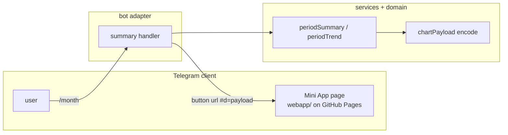

# 0030: Charts in the Mini App, static with no backend

> **Status:** in-progress
> **Created:** 2026-10-01
> **Depends on:** [Plan 0032](done/0032-live-qr-scan-mini-app.md) (the `webapp/` page, Pages workflow and
> `WEBAPP_URL`), merged on `main` before this plan starts
> **Related ADRs:** [ADR-0025](../adrs/0025-static-mini-app-fragment-in-senddata-out.md) (static Mini App, fragment in, sendData out),
> [ADR-0011](../adrs/0011-navigation-model.md) (screens, persistent menu),
> [ADR-0022](../adrs/0022-fx-nbs-middle-rate-ledger-currency.md) (converted totals)

## TL;DR

The `/week` and `/month` screens get a «📈 Диаграмма» button in private chats. It opens a Telegram
Mini App: a static page on GitHub Pages that draws the period's categories as a pie chart, and
later the trend over the last 6 periods as bars. The bot puts the aggregates in the button URL's
fragment, so the page makes no requests and the VPS stays as it is (ADR-0025). The page, its
Pages workflow and `WEBAPP_URL` come from Plan 0032, which built them for the live QR scan; this
plan adds a chart mode. The first thing the user sees: `/month`, tap
«📈 Диаграмма», and a pie chart of this month's categories in the ledger's currency.

## Context & problem

Reports are text only. Nobody reads a month's split by category as fast in lines as in a chart,
and a trend across months doesn't fit in a message at all.

The bot has no HTTP port, domain or TLS, and runs in 256 MiB on a shared VPS (Plan 0002).
ADR-0025 records why the Mini App is static and gets its data from the button URL instead of an
API.

## Decision

The `webapp/` page from Plan 0032 (static, plain `tsc`, no runtime dependencies, published to
GitHub Pages) gets a chart mode. Opened with `#d=<base64url JSON>`, the page validates
the payload version and draws SVG. Everything it shows as text (titles, amount labels, category
names) comes formatted from the bot's messages module inside the payload. The bot adds the
button only when `WEBAPP_URL` is set and the chat is private.

We rejected an HTTPS API on the VPS and server-rendered PNGs (ADR-0025, Alternatives A and B).

## Architecture diagram



## Implementation phases

### Phase 1: Walking skeleton: /month opens a pie chart
- **Owner skill:** dev
- **What:** The chart payload contract and encoder, a chart mode in Plan 0032's page that draws
  a pie with a legend, and the «📈 Диаграмма» `web_app` button on the summary screen.
- **Files touched:** `src/domain/chartPayload.ts`, `src/domain/chartPayload.test.ts`,
  `src/bot/handlers/summary.ts`, `src/bot/messages.ts`,
  `src/bot/bot.test.ts` (or the summary handler's test), `webapp/src/main.ts`,
  `webapp/src/payload.ts`, `webapp/src/payload.test.ts`, `webapp/src/pie.ts`,
  `webapp/src/messages.ts`, `README.md` (Mini App section: charts).
- **Done when:**
  - `encodeChartPayload` with lines Еда 120000 and Транспорт 30000 in RSD round-trips through
    the page's `decodeChartPayload` to the same lines, with `totalMinor` 150000, the integer sum.
  - The pie draws only the first (converted) currency block. Each further currency with no rate
    appears as one text line under the chart, and no amount crosses currencies.
  - A payload with an unknown `v`, broken base64 or a missing `d` makes the page show the
    `webapp/src/messages.ts` fallback and draw nothing. Category names reach the DOM only through
    `textContent`: a test with the name `` finds no `img` element.
  - `webapp/index.html` is unchanged, so Plan 0032's CSP (`default-src 'none'`, no
    `connect-src`) still holds. Scan mode (`#m=scan`) behaves as before: `webapp/src/scan.test.ts`
    is unchanged and passes.
  - The `/month` and `/week` screens in a private chat carry a `web_app` button whose URL starts
    with `WEBAPP_URL` and has a `#d=` fragment. When paged to another period, the button carries
    that period's payload. In a group chat, or with `WEBAPP_URL` unset, there's no button, and the
    screen is otherwise byte-identical to today's.
  - A period with no expenses has no button.

### Phase 2: Publish and measure the URL limit
- **Owner skill:** human
- **Blocks merge:** no
- **What:** After the merge, deploy (Pages and `WEBAPP_URL` are already set up by Plan 0032), and
  open a chart on the clients you use (Android, iOS and/or Desktop). Phase 3 does not wait for
  this measurement: a deploy needs the merge, and the merge needs Phase 3. If the smallest
  working size is below 2048 bytes, a fix lowers `CHART_PAYLOAD_BUDGET` to it.
- **Done when:**
  - The Pages run for this plan's commits is green.
  - Tapping «📈 Диаграмма» on `/month` opens the pie on every client tried, in the Telegram theme
    colours. That confirms the `d` key survives Telegram adding its own launch parameters to the
    fragment (an ADR-0025 risk).
  - The largest payload that still opens has been found, by sending test buttons with padded
    `d` values of 2, 4 and 8 KB, and noted in the Implementation log. Phase 3 budgets against
    the smallest working size across the clients tried.

### Phase 3: Payload budget and the trend chart
- **Owner skill:** dev
- **What:** Cap the encoded payload at a `CHART_PAYLOAD_BUDGET` byte constant of 2048, the
  smallest size Phase 2 tests. Phase 2's measurement runs after the merge (amended 2026-10-07). Add a trend section: the converted totals
  of the current period and the 5 before it, drawn as bars under the pie.
- **Files touched:** `src/domain/chartPayload.ts`, `src/domain/chartPayload.test.ts`,
  `src/services/periodSummary.ts` (or a new `src/services/periodTrend.ts` with its test),
  `src/bot/handlers/summary.ts`, `src/bot/messages.ts`, `webapp/src/main.ts`,
  `webapp/src/bars.ts`, `webapp/src/payload.ts`, `webapp/src/payload.test.ts`.
- **Done when:**
  - Over budget, the encoder folds the smallest category lines into one «Прочее» line until the
    payload fits. Tested property: the folded lines' `amountMinor` sum equals the original
    `totalMinor` exactly, and the encoded length is ≤ the budget. Over budget even with every
    category folded, it drops the oldest trend periods. With nothing left to drop, the button is
    omitted.
  - The trend has 6 bars, oldest first. For a month ledger opened on 2026-10-15 in
    Europe/Belgrade, the periods are 2026-05 to 2026-10. Each bar is that period's converted
    total from the same `ledgerPeriodSummary` the text screen uses, so a bar equals the total
    the user sees after paging to that period.
  - A period with no expenses is a zero-height bar with its label, not a gap.

### Phase 4: Live check on a phone
- **Owner skill:** human
- **Blocks merge:** no
- **What:** On a phone, open a real `/month` chart.
- **Done when:** The pie and trend match the text screen's totals for the same period.

## Data shapes

```ts
// illustrative: src/domain/chartPayload.ts, imported type-only by webapp/src/payload.ts
interface ChartPayloadV1 {
  v: 1;
  title: string; // formatted by messages: «Сентябрь 2026»
  currency: string; // ISO-4217, the ledger's default (the converted block)
  totalMinor: number; // integer, the sum of lines
  totalLabel: string; // formatted by messages: «150 000 RSD»
  lines: [name: string, amountMinor: number, label: string][];
  unconverted: string[]; // formatted per-currency lines with no rate
  trend?: [periodLabel: string, totalMinor: number, label: string][]; // Phase 3
}
// URL: `${WEBAPP_URL}#d=${base64url(JSON.stringify(payload))}`; scan mode (Plan 0032): `#m=scan`
```

## Risks & open questions

- **Fragment handling (unverified).** Telegram adds `tgWebAppData` and other launch parameters to
  the fragment. If a client replaces our fragment instead of appending to it, the pie never gets
  data. Phase 2 detects this, after the merge: until then the button may ship to a client that
  can't open it. The fallback is an ADR change, not a workaround in code.
- **Money.** The bot formats every amount, and the page uses floats only for geometry
  (ADR-0025). The folding in Phase 3 keeps the sum exact, and its test asserts the sum, not just
  that the result isn't empty.
- **Time.** The trend periods come from `periods.ts` in the ledger's effective timezone
  (ADR-0015), never the browser's.
- **Privacy.** The payload is aggregates, never individual expenses or descriptions. It lives in
  Telegram's copy of the button and in the client, never on GitHub. Logs never print the payload
  or `WEBAPP_URL` with its fragment. A sealed ledger (Plan 0019), if it lands first, gets no chart
  button while locked.
- **Supply chain.** The page loads `https://telegram.org/js/telegram-web-app.js`, Telegram's
  official script, which can't be pinned. Nothing else is loaded from outside.
- **Pages availability.** If GitHub Pages is down, the chart doesn't open, while the bot's text
  reports keep working.

## What this plan does NOT do

- An HTTPS API, live history browsing or editing in the page (ADR-0025, Alternative A, would come
  in a future plan).
- Entering the sealed-ledger passphrase in the page (it needs the API; Plan 0019 keeps its
  chat flow).
- Charts for group ledgers, budgets or tags (plans 0011 and 0012 could add payloads later).
- The live QR scan: Plan 0032.
- A BotFather menu button or a "Main Mini App". The entry point is the inline chart button.

## Implementation log

> Written by `dev`: one row per phase as its commit lands, then the close block. **The phases
> above are the contract. This section records what happened.** Observations, never conclusions:
> no pass list, no self-assessment. Deviations and unmet done-whens are **always** disclosed.
> Keep it shorter than `## Implementation phases`.

| phase | owner | state | commit |
|---|---|---|---|
| 1: Walking skeleton: /month opens a pie chart | dev | done | 3a994ba |
| 2: Publish and measure the URL limit | human | owed | |
| 3: Payload budget and the trend chart | dev | done | committed with this row |
| 4: Live check on a phone | human | not started | |

### Notes

- Phase 1: `webapp/src/payload.ts` declares its own copy of the payload type instead of importing
  `ChartPayloadV1` type-only: `eslint.config.js` forbids any `src/` import from the page, and
  `webapp/tsconfig.json` (`rootDir: src`, `types: []`) can't compile one. Both files were outside
  `Files touched`.
- Phase 1: the encoder round trip through `decodeChartPayload` is tested in
  `src/domain/chartPayload.test.ts` (it needs Node's `Buffer`, which the webapp tsconfig lacks).
  `webapp/src/payload.test.ts` covers decoding and the page.
- Phase 1: no DOM library is a dependency, so the page tests run `showChart` against a minimal
  fake document (createElement/createElementNS, textContent; `innerHTML` throws). The
  `` check asserts no `img` node in that tree and the name in a
  `textContent`.
- Phase 1: a period whose first block isn't in the ledger's currency (nothing converts) gets no
  button, like an empty one.
- Phase 1: `webapp/src/messages.ts` `openFromBot` now names «📈 Диаграмма» next to «📷 Скан». A
  missing `d` shows it; a `d` the page can't read shows the new `chartBroken` line.
- Phase 1: the bot test file imports `decodeChartPayload` from `webapp/src/payload.ts` to read
  the button URL.
- Phase 3: `src/bot/bot.test.ts` (outside `Files touched`) gained the `trend` field in the three
  existing payload `toEqual` assertions of the chart-button tests.
- Phase 3: the trend lives in a new `src/services/periodTrend.ts` (+ test), which calls
  `ledgerPeriodSummary` once per period: six summaries per chart render.
- Phase 3: the trend ends at the shown period, so a paged-to screen's trend ends at that period.
- Phase 3: `encodeChartPayload(input, fold, budget)` takes the «Прочее» name and its amount
  formatter from `messages.chartFold(currency)`, and returns undefined when nothing fits. The
  budget is measured on the `d` value's length. An existing category named «Прочее» joins the
  fold line, so the name never appears twice.
- Phase 3: the bars are horizontal, one row per period (name, bar, label), drawn by
  `webapp/src/bars.ts` `showTrend`, which `main.ts` calls after `showChart` (`pie.ts` is not in
  `Files touched`), so they sit under the pie's legend and rateless-currency lines.
- Phase 3: a trend bar's label carries «≈ » when that period holds converted foreign spending, as
  the screen's total does.

### Close triggers

- **What shipped:**
- **User-visible surface changed:**
- **Gate at the tip:**
- **Outstanding `human` phases:**

## Followups

- Re-queue in `tools/conductor/queue.json` (and run `conductor.mjs ready 0030`) once Plan 0032
  is merged: its readiness check needs `webapp/` on `main`.
