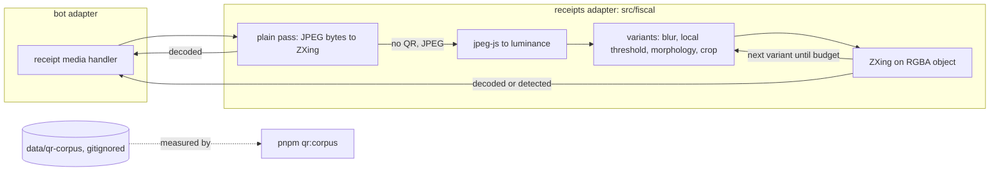

# 0031: Receipt photos that fail the plain QR pass get retried on preprocessed pixels

> **Status:** in-progress
> **Created:** 2026-10-03
> **Related ADRs:** [ADR-0034](../adrs/0034-qr-retry-on-preprocessed-pixels-jpeg-js.md) (retry on preprocessed pixels, jpeg-js),
> [ADR-0019](../adrs/0019-qr-decoding-zxing-wasm.md) (zxing-wasm)

## TL;DR

A receipt photo whose QR code ZXing can't read on the first try gets retried on preprocessed
pixels. The JPEG is decoded with `jpeg-js`, then blurred, thresholded and cropped in plain
TypeScript, and ZXing tries again until one variant decodes or a time budget runs out. Which
variants ship is measured on a private, gitignored corpus of real photos that failed. When nothing
works, the hint says what actually helps: whether the code was seen at all, and to shoot it flat,
in focus and without glare, or to paste the link. The first thing the user sees: a receipt photo
that got the hint on 2026-10-03 now records the expense.

## Context & problem

On 2026-10-03 five real Serbian receipt photos all got «Не нашёл QR-код». The diagnostics logging
added that day (commit `1a8b9d1`) shows that resolution isn't the problem: the photos are at 7 to
8 px per module. The problems are the print and the photo: thermal dot gain, curl, blur, and the
dense EC-level-L codes the fiscal printers emit. ADR-0034 has the measurements. One preprocessing
recipe (1 px blur, then a 31x31 local-mean threshold at -3%) rescued one of the five, which is
evidence that pixels help, not yet a rate.

The current hint also misleads. It suggests «файлом без сжатия», and the data says more pixels
don't help.

## Decision

`decodeQr` keeps its plain pass. When that pass reads no QR, a JPEG input is decoded to luminance
with `jpeg-js`, and an ordered list of variants is tried, stopping at the first decode. The list
and the budget come from `pnpm qr:corpus`, a measurement script over `data/qr-corpus/`. That
directory is already gitignored and deny-read, because it holds the user's real receipts. The
handler picks one of two hints depending on whether a symbol was located.

We rejected sharp (a native dependency) and ZXing options alone (0 of 5 rescued). ADR-0034 has
both. The live scanner stays in Plan 0030, to be moved ahead of the charts there once that plan's
pending edits land (see Followups).

## Architecture diagram



## Implementation phases

### Phase 1: Collect the corpus
- **Owner skill:** human
- **Blocks merge:** yes
- **What:** Save the photos that got the hint into `data/qr-corpus/` as the bot received them
  (Telegram Desktop «Save as» on the photo), starting with the five from 2026-10-03. Add new
  failures from the log's `outcome: "noQr"` lines as they come.
- **Done when:** `data/qr-corpus/` holds at least those five JPEGs, and `git status` doesn't list
  them.

### Phase 2: Walking skeleton: one retry variant, end to end
- **Owner skill:** dev
- **What:** Add `jpeg-js` (exact pin). Add a `src/fiscal/qrPixels.ts` holding the JPEG-to-luminance
  decode and the first variant, the recipe that rescued photo #10: a 3x3 box blur, then a
  local-mean threshold over a 31x31 window at mean - 3%, computed with an integral image. Wire it
  into `decodeQr` after the plain pass, passing ZXing a plain `{ data, width, height }` RGBA
  object. Add a `pass` field to the decoded result and to the `receipt image read` log line
  (`plain` or the variant's name). Add `scripts/qr-corpus.ts` and the `pnpm qr:corpus` script: for
  every image in `data/qr-corpus/`, it prints the file name, the pass that decoded it or `none`,
  `detected` when there is one, and the milliseconds. It prints a total, and never prints the
  decoded text.
- **Files touched:** `package.json`, `pnpm-lock.yaml`, `src/fiscal/qr.ts`,
  `src/fiscal/qrPixels.ts`, `src/fiscal/qrPixels.test.ts`, `src/fiscal/qr.test.ts`,
  `src/fiscal/qr.fixtures/generate.ts`, `src/fiscal/qr.fixtures/rs-receipt-dotgain.jpg`,
  `src/bot/handlers/receipt.ts`, `src/bot/bot.test.ts`, `scripts/qr-corpus.ts`.
- **Done when:**
  - `rs-receipt-dotgain.jpg` is a new synthetic fixture: `buildRsUrl()`'s QR with simulated dot
    gain and blur. A test asserts that ZXing's plain pass reads **no** valid QR from it, so the
    fixture really exercises the retry. `decodeQr` returns exactly `buildRsUrl()` for it, with
    `pass` set to the variant's name.
  - `rs-receipt.jpg` still decodes with `pass: 'plain'`. `no-qr.jpg` and the non-image bytes
    still return `none`. `example.png`, a PNG, decodes on the plain pass and never reaches
    `jpeg-js`.
  - `qrPixels.test.ts`: the local-mean threshold of a constant mid-gray (128) image is all white. A 1-pixel
    dark dot on a white field survives the threshold. A 64x64 half-black, half-white image
    thresholds to exactly the same split. The luminance of pure red RGBA (255, 0, 0) is the
    integer from the stated formula (with BT.601 weights `(299R + 587G + 114B) / 1000` rounded
    down, that's 76).
  - The photo handler's log line for `rs-receipt-dotgain.jpg` carries `outcome: "receipt"` and
    the variant's `pass`, and no line contains `suf.purs.gov.rs`.
  - `pnpm qr:corpus` runs on the Phase 1 corpus. Its table goes into the Implementation log,
    file names only.

### Phase 3: Tune the variant list and the budget on the corpus
- **Owner skill:** dev
- **What:** Add candidate variants as pure functions in `qrPixels.ts`, each measured with
  `pnpm qr:corpus`: threshold window/offset pairs, a 1 px erosion of the dark modules (against
  dot gain), and, when the plain pass located a symbol, a crop to it with a 4-module margin,
  upscaled 2x. Keep a variant only if it decodes a corpus photo that no earlier variant
  decodes. Order the list by rescues. Add a `QR_RETRY_BUDGET_MS` constant: no new variant starts
  after the budget, measured from the start of the first retry.
- **Files touched:** `src/fiscal/qrPixels.ts`, `src/fiscal/qrPixels.test.ts`,
  `src/fiscal/qr.ts`, `src/fiscal/qr.test.ts`.
- **Done when:**
  - The Implementation log holds the final `pnpm qr:corpus` table and, for each shipped variant,
    the corpus files only it rescues. Every shipped variant has at least one. A dropped
    candidate is listed with its zero.
  - The shipped list decodes at least as many corpus photos as Phase 2 did. On the five photos
    from 2026-10-03 that's at least one (photo #10's recipe). The log states the count without
    rounding it into a rate.
  - With a fake clock past `QR_RETRY_BUDGET_MS` after the first variant, a test shows that no
    second variant runs and the result is `none`. The constant is set so the slowest corpus photo
    finishes its whole list within it on the dev machine, and both numbers are in the log.
  - The pixel decode passes `maxResolutionInMP` and `maxMemoryUsageInMB`. A JPEG header
    claiming 20000x20000 returns `none` without allocating its pixels (asserted via the
    `jpeg-js` error path, not a memory measurement).

### Phase 4: Two hints: the code wasn't found, or it was found but unreadable
- **Owner skill:** dev
- **What:** Split `receiptPhotoHint` into `receiptPhotoNoQr` (no symbol located) and
  `receiptPhotoUnreadable` (a symbol located, every pass failed), and drop «файлом без сжатия»
  from both. Copy, to be confirmed with `ux-telegram` before the phase starts if the user wants:
  - no QR: «Не нашёл QR-код чека на фото. Сфотографируйте его ближе, чтобы код занимал почти
    весь кадр, или вставьте ссылку из QR-кода.»
  - unreadable: «QR-код вижу, но прочитать не смог: на чеках он часто бледный или мятый.
    Расправьте чек и снимите ровно сверху, в фокусе и без бликов, или вставьте ссылку из
    QR-кода.»
  The 20 MB and no-file-path answers keep the no-QR text.
- **Files touched:** `src/bot/messages.ts`, `src/bot/handlers/receipt.ts`, `src/bot/bot.test.ts`.
- **Done when:**
  - `rs-receipt-damaged.jpg` (located, checksum fails) answers `receiptPhotoUnreadable`.
    `no-qr.jpg` answers `receiptPhotoNoQr`. `example.png` (a QR that isn't a receipt) answers
    `receiptPhotoNoQr`, and neither records an expense.
  - No message text contains «без сжатия».

### Phase 5: Live check
- **Owner skill:** human
- **Blocks merge:** no
- **What:** Deploy, then resend to the bot the five photos from 2026-10-03 and two new receipts.
- **Done when:** Each photo either records its expense or gets the hint that matches its log
  line's `outcome`/`detected`. The log's `pass` values and the recorded/hinted count go into the
  Implementation log.

## Data shapes

```ts
// illustrative: src/fiscal/qr.ts
export type QrDecodeResult =
  | { kind: 'decoded'; texts: readonly string[]; pass: string } // 'plain' | a variant name
  | { kind: 'none'; detected?: QrDetected }; // QrDetected as of commit 1a8b9d1

// illustrative: src/fiscal/qrPixels.ts
interface Luma { width: number; height: number; data: Uint8Array } // one byte per pixel
interface Variant { name: string; apply(src: Luma, located?: Quad): Luma }
```

## Risks & open questions

- **Event loop.** Retries block it for up to `QR_RETRY_BUDGET_MS` per failed photo. That's fine
  for a single-user bot. If the log's `ms` shows it hurting, the fix is a worker thread, in a
  separate plan.
- **Memory.** A 2560x1440 HD photo is about 15 MB RGBA plus a 3.7 MB luminance buffer, per
  variant in flight, against 256 MiB. Variants run one at a time and drop their buffers.
- **Privacy.** The corpus is real receipts: it stays under `data/`, which is gitignored and
  deny-read, never becomes a fixture, and its names and numbers appear in docs only as file
  names and counts. `pnpm qr:corpus` never prints decoded text. CI fixtures stay synthetic.
- **Overfitting.** Five photos is a tiny corpus. Variants are kept by unique rescues, and Phase 5
  plus the `noQr` log lines keep growing the corpus.
- **Unverified.** Whether `jpeg-js` decodes every JPEG Telegram serves (progressive, odd sampling
  factors). A decode error is a `none`, never a crash, and Phase 2's corpus run shows any that
  fail.

## What this plan does NOT do

- The live QR scan. It stays in Plan 0030 (Phase 4), to be reordered ahead of the charts (see
  Followups).
- Preprocessing for PNG or other non-JPEG images (a `pngjs` dependency, if the corpus ever shows
  PNG failures).
- A worker thread for decoding, and any perspective dewarp beyond cropping to the located
  symbol.

## Implementation log

> Written by `dev`: one row per phase as its commit lands, then the close block. **The phases
> above are the contract. This section records what happened.** Observations, never conclusions:
> no pass list, no self-assessment. Deviations and unmet done-whens are **always** disclosed.
> Keep it shorter than `## Implementation phases`.

| phase | owner | state | commit |
|---|---|---|---|
| 1: Collect the corpus | human | done (user; 8 images in `data/qr-corpus/`) | |
| 2: Walking skeleton | dev | done | `04c352e` |
| 3: Tune variants and budget | dev | done | `7385355` |
| 4: Two hints | dev | done | `41b9357` |
| 5: Live check | human | not started | |

### Notes

- Phase 2: the threshold reads "mean - 3%" as relative to the mean, strict: a pixel is white when
  `L > 0.97 * mean`. ImageMagick's `-lat 31x31-3%` subtracts 3% of the full range instead. With
  the absolute offset, the 64x64 half-black test's uniformly black area turns white.
- Phase 2: rerunning `generate.ts` rewrote `example.png` bytes; it was restored from `HEAD`, and
  only `rs-receipt-dotgain.jpg` is new. The fixture: EC level L, 7 px per module, `Erode Disk:2`,
  `-blur 0x2`.
- Phase 2 `pnpm qr:corpus` (8 images):

  | file | pass | detected | ms |
  |---|---|---|---|
  | photo_2026-10-03_21-30-22.jpg | none | | 452 |
  | photo_2026-10-03_21-31-00.jpg | none | | 311 |
  | photo_2026-10-03_21-31-05.jpg | none | v23 L ChecksumError 6.9px | 300 |
  | photo_2026-10-03_21-31-10.jpg | blur3-lmt31-3 | | 283 |
  | photo_2026-10-03_21-31-15.jpg | none | | 265 |
  | photo_2026-10-03_21-31-21.jpg | none | | 253 |
  | photo_2026-10-03_21-31-27.jpg | none | v20 L ChecksumError 8px | 306 |
  | photo_2026-10-03_21-31-33.jpg | none | v20 L ChecksumError 7.1px | 289 |

  Total: 1 of 8 decoded, slowest 452 ms.
- Phase 3 candidates, each over the 8 corpus photos (files by time suffix):
  - Local-mean threshold after a 3x3 blur (or two), windows 13 to 31, offsets 1 to 5%: the best
    rescue 21-31-10 and 21-31-15. Shipped: `blur3-lmt21-3`, the only variant, rescuing both.
  - `blur3-lmt31-3` (Phase 2's variant): rescues 21-31-10 only, also rescued by
    `blur3-lmt21-3`: 0 unique, dropped.
  - 1 px erosion of the dark modules, before or after the threshold: 0, dropped.
  - Crop to the located symbol with a 4-module margin, upscaled 2x (also 1x, 3x), alone, with the
    local threshold, with erosion, or with an Otsu global threshold: 0, dropped. None of the
    three detected photos (21-31-05, 21-31-27, 21-31-33) decodes under any candidate.
- Phase 3 `pnpm qr:corpus` (8 images):

  | file | pass | detected | ms |
  |---|---|---|---|
  | photo_2026-10-03_21-30-22.jpg | none | | 401 |
  | photo_2026-10-03_21-31-00.jpg | none | | 287 |
  | photo_2026-10-03_21-31-05.jpg | none | v23 L ChecksumError 6.9px | 287 |
  | photo_2026-10-03_21-31-10.jpg | blur3-lmt21-3 | | 277 |
  | photo_2026-10-03_21-31-15.jpg | blur3-lmt21-3 | | 249 |
  | photo_2026-10-03_21-31-21.jpg | none | | 255 |
  | photo_2026-10-03_21-31-27.jpg | none | v20 L ChecksumError 8px | 238 |
  | photo_2026-10-03_21-31-33.jpg | none | v20 L ChecksumError 7.1px | 271 |

  Total: 2 of 8 decoded, slowest 401 ms (whole `decodeQr`). The slowest whole retry list (one
  variant plus its ZXing read) took 66 ms; `QR_RETRY_BUDGET_MS` is 1000.
- Phase 3: the pixel decode's limits are 8 MP and 64 MB; a larger JPEG gets the plain pass only.
- Phase 3 deviation: `src/bot/bot.test.ts`, outside `Files touched`, pins the first variant's
  name; the pin changed to `blur3-lmt21-3`.
- Phase 3: `decodeQr` takes an optional `{ variants, now }` so the budget test drives a fake
  clock.
- Phase 4: the plan's copy shipped unchanged; it was not run past `ux-telegram`. The «без сжатия»
  test reads the `messages.ts` source.

### Close triggers

- **What shipped:** `decodeQr` retries a JPEG the plain pass reads no QR from on luminance decoded
  by `jpeg-js` (exact pin, limits 8 MP and 64 MB), through `VARIANTS` in `src/fiscal/qrPixels.ts`:
  one variant, `blur3-lmt21-3`, under `QR_RETRY_BUDGET_MS` = 1000. The decoded result and the
  `receipt image read` log line carry `pass`. `pnpm qr:corpus` measures `data/qr-corpus/`: 2 of 8
  decoded. `receiptPhotoHint` is split into `receiptPhotoNoQr` and `receiptPhotoUnreadable`.
- **User-visible surface changed:** a receipt photo the plain pass can't read may now record its
  expense. A photo with a located but unread QR gets the new unreadable hint; every other
  unread image gets the new no-QR hint. Neither mentions an uncompressed file.
- **Gate at the tip:** `pnpm typecheck` exit 0; `pnpm lint` exit 0; `pnpm test` exit 0, 71 files,
  996 tests; `pnpm build` exit 0.
- **Outstanding `human` phases:** Phase 5 (live check after deploy; blocks merge: no).

## Followups

- Plan 0030: move Phase 4 («📷 Скан») ahead of the charts phases, once the other session's
  uncommitted edits to 0030 are committed.
