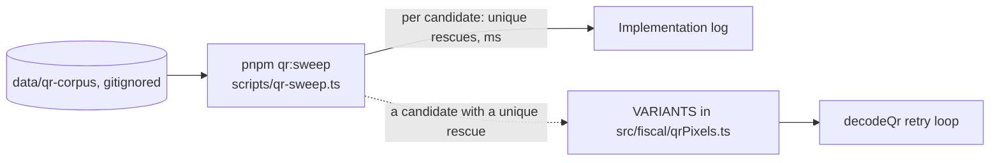

# 0033: A committed sweep for more receipt QR retry variants

> **Status:** draft
> **Created:** 2026-10-05
> **Related ADRs:** [ADR-0034](../adrs/0034-qr-retry-on-preprocessed-pixels-jpeg-js.md) (retry on preprocessed pixels, jpeg-js)

## TL;DR

`pnpm qr:sweep` measures candidate preprocessing variants on the private corpus. It tries
downscaling, a median filter, unsharp masking and contrast stretching, each followed by the
local-mean threshold. For each candidate it prints the corpus files only it rescues. A candidate
joins `VARIANTS` only with at least one unique rescue. Zero new variants is a valid outcome, and
the sweep stays in the repo for when the corpus grows. No change is visible in the chat unless a
variant ships. Then a photo that got a hint records its expense.

## Context & problem

Plan 0031 swept local-mean threshold parameters, erosion, crops and a global Otsu threshold. One
variant shipped, rescuing 2 of 8 corpus photos. The sweep was a scratch script, deleted at the
end, so it can't be rerun as `noQr` photos join the corpus. Three corpus photos have a QR that is
located but fails its checksum at 7 to 8 px per module. Some transforms were never tried, and two
fit that failure: downscaling, which averages dot gain and paper texture within a module, and a
median filter, which removes specks without spreading edges.

## Decision

Candidates live in `scripts/qr-sweep.ts`, not in `src/`, until one earns a place. A shipped one
moves to `src/fiscal/qrPixels.ts` as a pure function with unit tests, and is appended to
`VARIANTS` after `blur3-lmt21-3` (ordered by unique rescues). It counts under the existing
`QR_RETRY_BUDGET_MS`. No ADR: ADR-0034 already decides retrying on preprocessed pixels in plain
TypeScript. A better decoder (OpenCV's WeChat QR) was set aside as a native dependency, against
ADR-0034's rejection of sharp. It would need its own ADR if this sweep finds nothing.

## Architecture diagram

## Implementation phases

### Phase 1: The sweep script and the candidates, measured
- **Owner skill:** dev
- **What:** Add `scripts/qr-sweep.ts` and `pnpm qr:sweep`. The script decodes each corpus JPEG
  with `jpegLuma`, skips files the shipped list already decodes, and runs every candidate
  through ZXing with the options `decodeQr` uses. It prints one line per candidate: name,
  slowest ms, and the files it rescues. The candidates:
  - downscale to 0.5x and 0.75x (area average), alone and followed by `blur3` plus local-mean
    thresholds, with the window scaled to the new size;
  - a 3x3 median, then the local-mean threshold;
  - an unsharp mask, then the local-mean threshold;
  - a contrast stretch (1st to 99th percentile mapped to 0 to 255), then the local-mean
    threshold.
  It never prints decoded text.
- **Files touched:** `scripts/qr-sweep.ts`, `package.json`.
- **Done when:**
  - `pnpm qr:sweep` runs on the corpus as it stands, including photos added since Plan 0031. Its
    output, file names and counts only, goes into the Implementation log. The log states how many
    corpus files exist and how many the shipped list already decodes.
  - Every candidate listed above appears in the output, rescues or not.

### Phase 2: Ship the candidates that rescue a photo, or none
- **Owner skill:** dev
- **What:** For every candidate with a unique rescue, in order of rescues: move its transform to
  `qrPixels.ts` as a pure function, add a unit test, and append it to `VARIANTS`. With no
  unique rescue, this phase changes no `src/` file and says so in the log.
- **Files touched:** `src/fiscal/qrPixels.ts`, `src/fiscal/qrPixels.test.ts`,
  `src/fiscal/qr.test.ts`.
- **Done when:**
  - Each shipped variant's unique rescues are named in the log by file. A candidate rescuing
    only files an earlier one rescues is listed with its zero.
  - Each shipped transform has a unit test pinning exact values, among these:
    - 0.5x area-average downscale: a 4x4 image whose top-left 2x2 block is 0, 0, 0, 255 gives
      top-left output pixel 63 (`floor(255 / 4)`).
    - 3x3 median: a 5x5 white (255) image with one black (0) centre pixel comes out all 255.
    - Contrast stretch: a 10x10 image, half 50 and half 150, maps to exactly 0 and 255.
  - `pnpm qr:corpus` decodes at least the 2 photos Plan 0031 decoded, and its final table is in
    the log. The slowest photo's whole retry list still finishes within `QR_RETRY_BUDGET_MS`,
    and both numbers are logged. If it doesn't, the slowest variant is dropped, not the budget
    raised.
  - `rs-receipt-dotgain.jpg` still decodes on `blur3-lmt21-3`, the first variant.

## Data shapes

None new. A shipped variant is a `Variant` (`{ name, apply(src: Luma): Luma }`) as in
`src/fiscal/qrPixels.ts`.

## Risks & open questions

- **Overfitting.** A handful of photos. Variants are kept only by unique rescues, and Plan 0032's
  live scan is the main fix for unreadable photos anyway.
- **Event loop.** Each added variant costs roughly one blur-and-threshold pass plus a ZXing
  read on a failed photo. The budget caps the total.
- **Privacy.** Same as Plan 0031: the corpus stays under `data/`, the script prints file names,
  counts and milliseconds only, and no corpus image becomes a fixture.

## What this plan does NOT do

- A second decoder library, perspective dewarping, or OCR of the printed receipt text.
- Changing the hints (Plan 0031 Phase 4).
- Raising `QR_RETRY_BUDGET_MS`.

## Implementation log

> Written by `dev`: one row per phase as its commit lands, then the close block. **The phases
> above are the contract. This section records what happened.** Observations, never conclusions:
> no pass list, no self-assessment. Deviations and unmet done-whens are **always** disclosed.
> Keep it shorter than `## Implementation phases`.

| phase | owner | state | commit |
|---|---|---|---|
| 1: The sweep script and the candidates, measured | dev | not started | |
| 2: Ship the candidates that rescue a photo, or none | dev | not started | |

### Notes

### Close triggers

- **What shipped:**
- **User-visible surface changed:**
- **Gate at the tip:**
- **Outstanding `human` phases:**

## Followups
