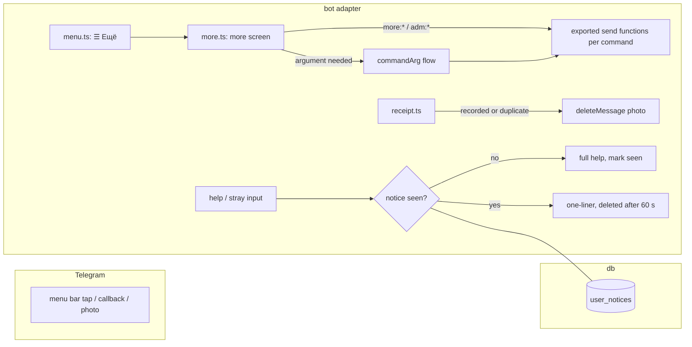

# 0034: Pre-invite polish: every command on a button, a full command menu, a clean receipt chat, and notices shown once

> **Status:** in-progress
> **Created:** 2026-10-06
> **Related ADRs:** [ADR-0037](../adrs/0037-first-time-notices-and-transient-replies.md) (notices
> shown once, transient replies), [ADR-0011](../adrs/0011-navigation-model.md) (the menu bar),
> [ADR-0028](../adrs/0028-contextual-tips-registry.md) (tips, kept apart)

## TL;DR

Before the bot is opened by invite (Plan 0029 Phase 7), four rough edges go. The slash-command
menu in a private chat shows every command, not a stale `/start` and `/today`. A new
[☰ Ещё] button on the menu bar opens a screen with every command that has no button today, and
the admin gets an admin row there, so nobody has to type `/invite` or `/recurring`. A receipt
photo is deleted from the chat once its expense is recorded. And the explanations the bot repeats
on routine input (the full help on every stray message, the edit hint, the sealed-ledger
warnings) are shown once, with a short self-deleting reply afterwards.

## Context & problem

- **The command menu.** Telegram holds a stale command list for the `all_private_chats` scope
  (`start:начать | today:итоги за сегодня`), set outside this repository (the prod bot shares the
  dev bot's token, Plan 0002). A scope-specific list beats the default one, and
  `registerCommands` (`src/bot/bot.ts`) sets only the default scope and `all_group_chats`, so a
  private chat shows two commands. Admin commands get no list at all.
- **Commands without a button.** The menu bar (`src/bot/keyboards.ts`) holds six buttons. In a
  private chat, `/recurring`, `/debts`, `/export`, `/unlock`, `/lock`, `/changelog`,
  `/privacy`, `/delete_account`, `/donate`, `/paysupport`, Plan 0012's `/tag` and `/tags`, and the
  admin's `/invite`, `/invites`, `/stats`, `/block`, `/unblock` and `/refund` are reachable only
  by typing them. Strangers admitted by invite won't know them.
- **The receipt photo.** After a photo's QR records an expense, the photo stays in the chat above
  the card that now carries everything it said. Nothing calls `deleteMessage` except
  `deleteSecretMessage` in `src/bot/handlers/unlock.ts`.
- **Repeats.** `sendHelp` (`src/bot/handlers/help.ts`), about 25 lines, answers `/help` and also
  every unknown command (`other.ts`), every text that isn't an expense (`text.ts`) and every
  non-text message (`other.ts`). `editedMessageHint` answers every edit of a recording message.
  `exportRangePrompt(sealed)` repeats the "the file is an unencrypted copy" warning on every
  `/export` of a sealed ledger, and `reminderTextPromptSealed` repeats its plaintext note.

## Decision

The menu bar gains [☰ Ещё], a stateless inline screen whose buttons run the same code as the
commands. Commands that take an argument get one generic prompt flow, which asks for the
argument and then runs the command as if it had been typed with it. `registerCommands` writes
the `all_private_chats` scope as well, and a chat-scoped list with the admin commands for the
admin. A recorded or duplicate receipt deletes its photo. A `user_notices` table records which
one-time notices a user has seen (ADR-0037). Transient replies are deleted by an in-process timer
after 60 seconds, and a restart drops the pending deletions (ADR-0037).

We rejected spreading the commands across existing screens (no new button) because it hides
them. We rejected folding this into Plan 0015 because 0015 is already a full session's work, and
these fixes are needed before the opening.

## Architecture diagram



## Implementation phases

### Phase 1: Walking skeleton: the full command menu and [☰ Ещё]
- **Owner skill:** dev
- **What:**
  - `registerCommands` also sets `messages.commands` for `{ type: 'all_private_chats' }`, so the
    stale list there is overwritten on every boot.
  - The menu bar gets a seventh button, `messages.menu.more` («☰ Ещё»), on the second row after
    [❓ Помощь].
  - A tap opens `messages.moreScreen` with an inline keyboard, two buttons per row, each labelled
    from messages: [Регулярные] (`/recurring`), [Долги] (`/debts`), [Метки] (`/tags`),
    [Экспорт] (`/export`), [Что нового] (`/changelog`), [Поддержать] (`/donate`),
    [Возврат пожертвования] (`/paysupport`), [Приватность] (`/privacy`) and
    [Удалить аккаунт] (`/delete_account`). When the personal ledger is sealed it adds
    [Открыть учёт] (`/unlock`) when locked, or [Закрыть учёт] (`/lock`) when unlocked.
  - Each button's callback (`more:<key>`, Data shapes) runs the same exported send function the
    command runs. The command handlers' bodies move into those functions where they are inline
    today.
  - A guard test lists every command registered on the private composer and fails when one is
    neither a menu-bar button nor on the more screen, except `/start`, `/cancel` and `/recover`
    (reached from the unlock screen). The admin commands join it in Phase 2.
- **Files touched:** `src/bot/bot.ts` (+ `src/bot/bot.test.ts`), `src/bot/keyboards.ts`,
  `src/bot/handlers/menu.ts`, `src/bot/handlers/more.ts` (new), `src/bot/callbackData.ts`,
  `src/bot/callbacks.ts`, `src/bot/messages.ts`, `src/bot/handlers/recurring.ts`,
  `src/bot/handlers/debts.ts`, `src/bot/handlers/tags.ts` (Plan 0012's, whatever it is named),
  `src/bot/handlers/export.ts`, `src/bot/handlers/unlock.ts`, `src/bot/handlers/changelog.ts`,
  `src/bot/handlers/donate.ts`, `src/bot/handlers/paysupport.ts`,
  `src/bot/handlers/privacy.ts`, `src/bot/handlers/deleteAccount.ts`,
  `src/services/flowSessions.ts`, `src/bot/flows.ts`, `src/bot/testHarness.ts`, `README.md`.
- **Done when:**
  - At boot, `setMyCommands` is called with `messages.commands` for the default scope and for
    `all_private_chats`, and with `messages.groupCommands` for `all_group_chats`.
  - A tap on «☰ Ещё» answers the more screen. A tap on [Регулярные] answers exactly what
    `/recurring` answers for the same user, and likewise for every other button.
  - For an unsealed ledger the screen has no lock button. For a sealed, locked one it has
    [Открыть учёт], and for an unlocked one [Закрыть учёт].
  - The guard test fails when a new `dm.command('x')` is added with no button.

### Phase 2: The admin row, argument prompts and the admin's command list
- **Owner skill:** dev
- **What:**
  - For the admin only (`adminTelegramId`), the more screen ends with an admin row:
    [Пригласить] (`/invite` with its defaults), [Приглашения] (`/invites`), [Статистика]
    (`/stats`), [Заблокировать] (`/block`), [Разблокировать] (`/unblock`) and
    [Вернуть Stars] (`/refund`).
  - A command that needs an argument gets a `commandArg` flow: the button asks for it with
    `messages.commandArgPrompt[command]`, with [Отмена], and the answer runs the command exactly as
    `/<command> <answer>` would, including its refusal on a bad argument. This covers `/block`,
    `/unblock`, `/refund`, `/paysupport` and Plan 0012's `/tag`, which gets a [Включить метку]
    button on the more screen.
  - `registerCommands` takes the admin id and sets `messages.commands` plus
    `messages.adminCommands` for `{ type: 'chat', chat_id: adminTelegramId }`.
  - The Phase 1 guard covers the admin commands too.
- **Files touched:** `src/bot/handlers/more.ts`, `src/bot/handlers/invite.ts`,
  `src/bot/handlers/admin.ts`, `src/bot/handlers/refund.ts`, `src/bot/handlers/paysupport.ts`,
  `src/bot/handlers/tags.ts` (Plan 0012's), `src/services/flowSessions.ts`, `src/bot/flows.ts`,
  `src/bot/callbackData.ts`, `src/bot/messages.ts`, `src/bot/bot.ts`, `src/index.ts`,
  `src/bot/testHarness.ts`, `src/bot/bot.test.ts`.
- **Done when:**
  - The admin's more screen has the admin row, and a non-admin's doesn't. A forged `adm:*`
    callback from a non-admin is answered as an unknown button and changes nothing.
  - [Заблокировать], then the answer `42`, blocks user 42 exactly as `/block 42` does. A
    non-numeric answer gets `/block`'s own refusal. [Отмена] ends the flow with nothing changed.
  - A redelivered answer update runs the command once.
  - At boot, `setMyCommands` is called for the admin's chat scope with the private list plus the
    admin commands.

### Phase 3: A recorded receipt deletes its photo
- **Owner skill:** dev
- **What:** `answerReceipt` (`src/bot/handlers/receipt.ts`) returns its outcome. After a
  `recorded` or `duplicate` outcome, `registerReceiptMedia` deletes the user's photo message,
  following `deleteSecretMessage`'s pattern: a failed delete is logged at warn and never thrown.
  Every other outcome (no QR, unreadable, refused, cap reached, future date, sealed ledger) keeps
  the photo.
- **Files touched:** `src/bot/handlers/receipt.ts`, `src/bot/bot.test.ts`, `README.md`.
- **Done when:**
  - A photo whose QR records an expense gets the card, then one `deleteMessage` for the photo's
    message id in that chat.
  - A duplicate photo gets `alreadyRecorded` and its photo deleted.
  - An unreadable photo gets `receiptPhotoUnreadable` and no `deleteMessage`.
  - A failing `deleteMessage` still leaves the card sent and the expense recorded.

### Phase 4: Notices shown once, and short replies that clean up after themselves
- **Owner skill:** dev
- **What:**
  - The next free migration adds `user_notices` (Data shapes). A notice key is listed in one
    `NOTICES` constant, and `seenNotice(user, key)` marks a notice seen and says whether it was new,
    in one statement.
  - Stray input (an unknown command, text that isn't an expense, a non-text message) answers the
    full help the first time (`stray_help`), and afterwards `messages.notUnderstood`, one line
    pointing to «❓ Помощь». `/help` and the ❓ button always answer the full help.
  - `editedMessageHint` is sent the first time only (`edit_hint`). Later edits get no reply.
  - `exportRangePrompt`'s sealed warning (`export_plaintext`) and `reminderTextPromptSealed`'s
    plaintext line (`reminder_plaintext`) are shown the first time only. Afterwards the prompts
    read as for an unsealed ledger.
  - `sendTransient(ctx, html)` in `src/bot/render/` sends a reply and deletes it 60 seconds
    later with an in-process timer (ADR-0037). `notUnderstood` is sent through it.
  - `/delete_account` deletes the user's `user_notices` rows.
- **Files touched:** `src/db/migrations/` (the next free migration), `src/db/notices.ts`
  (+ test), `src/services/notices.ts` (+ test), `src/services/deleteAccount.ts` (+ test),
  `src/bot/render/html.ts` (+ test), `src/bot/handlers/help.ts`, `src/bot/handlers/other.ts`,
  `src/bot/handlers/text.ts`, `src/bot/handlers/export.ts`, `src/bot/handlers/recurring.ts`,
  `src/bot/flows.ts`, `src/bot/messages.ts`, `src/bot/bot.ts`, `src/bot/testHarness.ts`,
  `src/bot/bot.test.ts`, `README.md`.
- **Done when:**
  - A user's first sticker gets the full help, and their second gets `notUnderstood`, deleted
    after 60 seconds of an injected clock or timer.
  - `/help` after that still answers the full help.
  - The first edit of a recording message gets the hint, and the second gets nothing.
  - On a sealed ledger the first `/export` prompt carries the warning, and the second doesn't.
  - Two concurrent first stickers from the same user produce one full help (the insert decides).
  - `/delete_account` leaves no `user_notices` row for the user.

### Phase 5: Live check
- **Owner skill:** human
- **Blocks merge:** no
- **What:** After the deploy, open the private chat's `/` menu, walk every [☰ Ещё] button, send
  one receipt photo and one sticker twice.
- **Files touched:** none.
- **Done when:** The `/` menu lists every command, every button answers, the receipt photo is gone
  after its card arrives, and the second sticker's reply disappears within a minute.

## Data shapes

```sql
-- illustrative
CREATE TABLE user_notices (
  user_id TEXT NOT NULL REFERENCES users(id),
  notice TEXT NOT NULL,          -- a NOTICES key: stray_help, edit_hint, export_plaintext, reminder_plaintext
  seen_at TEXT NOT NULL,         -- UTC instant
  PRIMARY KEY (user_id, notice)
);
-- seenNotice: INSERT OR IGNORE ...; new = changes() = 1
```

Callback data (illustrative): `more:rec`, `more:debt`, `more:tags`, `more:tag`, `more:exp`,
`more:unl`, `more:lock`, `more:chg`, `more:don`, `more:pay`, `more:prv`, `more:del`, `adm:inv`,
`adm:invs`, `adm:stats`, `adm:blk`, `adm:unb`, `adm:ref`. Each is under 12 bytes.

## Risks & open questions

- **Deleting the photo.** A bot can delete an incoming message in a private chat within 48 hours,
  which covers a receipt answered at once. The caption, if any, is already in the expense.
- **A lost timer.** A restart within 60 seconds of a transient reply leaves that reply in the
  chat. It is one line and harmless (ADR-0037).
- **The menu bar's width.** Seven buttons fit on two rows of a phone screen. The labels stay
  short.
- **Plan 0015 overlap.** 0015 rewrites `welcome` and adds tips that are seen once, in its own
  `user_tips` table (ADR-0028). `user_notices` is separate: a notice is an explanation shown once
  and never replayed, and a tip is a teaching message that `/start` replays and the user can turn
  off. 0015 needs a readiness re-check after this plan merges.
- **Privacy.** No amounts or descriptions reach a log. `user_notices` holds keys only.

## What this plan does NOT do

- No buttons in group chats: a group has no menu bar, and its commands stay typed.
- No auto-delete of the bot's other replies: only `notUnderstood` is transient.
- No deletion of a pasted receipt link or a bank SMS. Only a photo is deleted.
- No onboarding tour or tips: that is Plan 0015.

## Implementation log

> Written by `dev`: one row per phase as its commit lands, then the close block. **The phases
> above are the contract. This section records what happened.** Observations, never conclusions:
> no pass list, no self-assessment. Deviations and unmet done-whens are **always** disclosed.
> Keep it shorter than `## Implementation phases`.

| phase | owner | state | commit |
|---|---|---|---|
| 1: Walking skeleton: the full command menu and [☰ Ещё] | dev | done, see Notes | 50ccc70 |
| 2: The admin row, argument prompts and the admin's command list | dev | done, see Notes | e6a8e4d |
| 3: A recorded receipt deletes its photo | dev | done, see Notes | committed with this row |
| 4: Notices shown once, and short replies that clean up after themselves | dev | not started | |
| 5: Live check | human | not started | |

### Notes

- Phase 1: `messages.commands` also gained `/tag`, `/privacy`, `/paysupport` and
  `/delete_account`, which were missing from the private list.
- Phase 1: the guard exempts `/categories` besides `/start`, `/cancel` and `/recover`: it has no
  menu-bar or more-screen button and is reached by [Категории] on the settings hub. The plan's
  exemption list doesn't name it.
- Phase 1: `createBot`'s DM side moved into an exported `privateComposer(options)`, so the guard
  test enumerates its `command` registrations by spying on `Composer.prototype.command`.
- Phase 2: the argument prompt is a screen anchor (`commandArg` in `Screen`), so its [Отмена] and
  `/cancel` take the existing ADR-0009 path; `restoreScreen` edits it to
  `messages.commandArgCancelled`. An answer also edits the prompt to drop its [Отмена].
- Phase 2: outside the phase's `Files touched`: `src/bot/handlers/text.ts` (`registerText` takes
  `MoreDeps`, and `bot.ts` passes it the donate deps, so the answer reaches `notifyAdmin`) and
  `src/bot/handlers/menu.ts` (takes `AdminDeps`, so the more screen knows the admin).
- Phase 2: the admin buttons are three rows of two, not one row.
- Phase 2: the block test blocks `SECOND_ALLOWED_ID`, the harness's second admitted user, not 42.
- Phase 3: README's [☰ Ещё] paragraph also gained Phase 2's buttons and the admin's command list.

### Close triggers

- **What shipped:** feature / fix-only / docs-chore-only
- **User-visible surface changed:** commands, messages, config/env keys, schema migrations (list them, or none)
- **Gate at the tip:** the commands run (typecheck, lint, full test suite), exit codes, test counts
- **Outstanding `human` phases:** which, or none

## Followups
