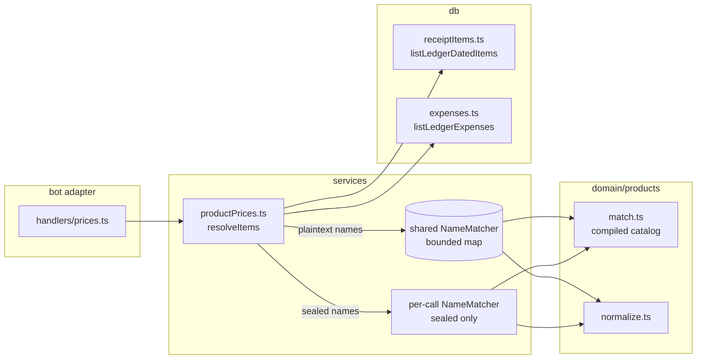

# 0038: /prices stops re-matching every receipt item on every tap

> **Status:** approved (2026-10-07)
> **Created:** 2026-10-07
> **Related ADRs:** [ADR-0041](../adrs/0041-product-matches-memoized-in-process-not-persisted.md), [ADR-0039](../adrs/0039-products-from-keyword-rules-and-per-user-overrides.md), [ADR-0020](../adrs/0020-sealed-ledgers-write-open-read-locked.md)

## TL;DR

`/prices` gets several times cheaper per tap. The keyword catalog is compiled once. A bounded
process-wide memo maps a raw item name to its normalized key and rule product, so each name is
matched once per process instead of once per row per tap. A sealed ledger's items skip that memo
and fold their receipts from the rows already read, not one by-id read per row. The user sees
the same screens, faster. Nothing they read changes.

## Context & problem

Plan 0036 shipped `/prices` with its cost stated as "fine at personal scale". We measured it on
2026-10-07 on the dev machine. The synthetic user was one ledger with 20,000 items: 15 items per
receipt over two years, about 3,000 distinct names.

| step (20,000 items) | ms |
|---|---|
| list view (`activeProductList`) | 369 |
| product view (`ledgerProduct`) | 375 |
| of which: SQL read (`listLedgerDatedItems`) | 21 |
| of which: `normalize` per row | 13 |
| of which: `matchProduct` per row | 307 |
| `matchProduct` once per distinct name | 49 |

Matching is about 83% of the view. Updates run one at a time (`bot.start()` in `src/index.ts`),
so every tap on `/prices`, its pager, a product, the review or `[Названия]` stalls every other
user's updates by that much. At 5,000 items the list took 163 ms.

The sealed path in `ownItems` (`src/services/productPrices.ts`) reads the ledger's expenses and
then calls `foldedReceipt(deps, row.id)` for each sealed row. That re-reads the row by id
(`findExpenseById`) and looks the private key up again before decrypting. The rows are already in
hand.

## Decision

Per ADR-0041:
- Compile the catalog once.
- Memoize `raw name → { nameKey, ruleRef }` in one bounded, insertion-order-evicted map per
  process.
- Keep a sealed ledger's names out of that map.
- Fold sealed receipts from the rows already read.

We rejected persisting the product per item. It needs a migration, a backfill and catalog
versioning, all for about 30 ms over the memo at 20,000 items. We rejected a memo that lives for
one call, because it re-pays the distinct-name cost on every tap.

## Architecture diagram



## Implementation phases

This is a fix-only plan. Phase 1 is the bench, not a walking skeleton, because the baseline has
to be taken on the code before the change.

### Phase 1: a committed bench for the prices views
- **Owner skill:** dev
- **What:** `scripts/bench-prices.ts` and `pnpm bench:prices <items>`. It builds an in-memory
  database through `runMigrations` and `provisionUser`, the way `src/services/productPrices.test.ts`
  sets up. It inserts one user's fetched receipts with 15 synthetic item names each, spread over
  the two years before the bench's fixed `NOW`. It prints:
  - for the list view: one cold run, then the mean of 5 warm runs;
  - the same for one product view;
  - the item count and the distinct-name count.

  Item names are invented grocery strings, never real receipt data.
- **Files touched:** `scripts/bench-prices.ts`, `package.json` (the `bench:prices` script).
- **Done when:** `pnpm bench:prices 20000` runs on this commit and prints the five figures. The
  implementation log records them as the baseline, next to this plan's 369 / 375 ms. The bench
  is not part of `pnpm test`, and nothing in the gate depends on its timings.

### Phase 2: compiled catalog and a shared bounded name memo
- **Owner skill:** dev
- **What:**
  - `match.ts` compiles every keyword and exclusion into word arrays once, at module load, so
    `phraseAt` no longer splits strings per call. `matchProduct`'s results are unchanged.
  - `match.ts` also exports `createNameMatcher(capacity, match = matchProduct)`. It returns a
    `NameMatcher` that maps a raw item name to `{ nameKey: normalize(raw), ruleRef }` through a
    `Map`. When an insert would exceed `capacity`, it evicts the oldest entry.
  - `productPrices.ts` holds one module-scope instance, `NAME_MATCHER_CAPACITY = 20_000`. That is
    about 5 MB at the cap, an estimate. `resolveItems` uses it for plaintext rows.
  - An answered name's ref is checked with `products.has(answer)`, not `[...products.keys()].find`.
- **Files touched:** `src/domain/products/match.ts`, `src/domain/products/match.test.ts`,
  `src/services/productPrices.ts`, `src/services/productPrices.test.ts`.
- **Done when:**
  - Every existing case in `match.test.ts` and `productPrices.test.ts` passes unchanged. This
    defends that the compiled matcher names the same product for every name the rules covered.
  - A new test resolves 1,000 raw names drawn from 10 distinct strings through
    `createNameMatcher(100, counting)`. The inner matcher runs exactly 10 times. A second pass
    over the same 1,000 runs it 0 more times.
  - A new test drives a matcher with capacity 3 through `a, b, c, d`:
    - its size is 3;
    - looking up `d` again runs the inner matcher 0 more times;
    - looking up `a` again runs it exactly once more, because `a` was evicted.
  - Two raw spellings with one normalized key (`МЛЕКО 1Л`, `Mleko 1l`) are two entries with an
    equal `nameKey`.
  - `pnpm bench:prices 20000`: the implementation log records the warm list and product times.
    The warm list is under 100 ms on the machine that took the Phase 1 baseline. The baseline is
    369 ms, and ADR-0041 expects about 35 to 60 ms. If it misses, the log says so with the figure.

### Phase 3: the sealed path folds receipts from the rows in hand
- **Owner skill:** dev
- **What:**
  - `ledgerKeys.ts` gains `foldedReceiptOf(deps, row: SealedExpense)`. It decrypts the given
    row with the key held, and makes no by-id read.
  - `foldedReceipt(deps, id)` becomes a lookup followed by `foldedReceiptOf`, for its other
    callers.
  - `ownItems` calls `foldedReceiptOf` with the rows `listLedgerExpenses` already returned.
  - Sealed rows' names go through a `createNameMatcher` instance created inside the call and
    dropped with it, never the shared one.
- **Files touched:** `src/services/ledgerKeys.ts`, `src/services/ledgerKeys.test.ts`,
  `src/services/productPrices.ts`, `src/services/productPrices.test.ts`.
- **Done when:**
  - The existing sealed `/prices` tests pass unchanged. This defends that a sealed view shows
    the same products, months and totals as before.
  - A new test opens a sealed ledger's list over 3 rows with folded receipts. It runs the
    by-id expense read (`findExpenseById`'s statement) 0 times, observed through a counting
    wrapper on the test's `db.prepare`.
  - A new test shows that the shared matcher's size is the same before and after a sealed
    ledger's list view whose item names the shared matcher has never seen.

### Phase 4: live check
- **Owner skill:** human
- **Blocks merge:** no
- **What:** After the deploy, open `/prices` on the production bot with a real receipt history.
  Page the list, open two products, and open the review.
- **Done when:** Every screen shows the same products and figures as before the deploy, and no
  tap feels slower than `/today`.

## Data shapes

```ts
// illustrative: src/domain/products/match.ts
export interface NameMatch {
  readonly nameKey: string; // normalize(raw)
  readonly ruleRef: `b:${string}` | undefined; // the catalog's product, before any user answer
}
export interface NameMatcher {
  match(raw: string): NameMatch;
  readonly size: number;
}
export function createNameMatcher(
  capacity: number,
  match: (nameKey: string) => CatalogProduct | undefined = matchProduct,
): NameMatcher;
```

No table, column, callback data or message changes.

## Risks & open questions

- **Privacy.** The shared map holds plaintext item names from many users: names only, never
  amounts, users or dates. The names already sit in `receipt_items` in plaintext. The sealed path
  never writes to it (Phase 3 test), so a sealed ledger's names do not outlive the call that
  decrypted them. The map is never logged.
- **Correctness drift.** The compiled matcher must agree with the old one on every name. The
  unchanged `match.test.ts` cases defend this, along with the coverage report
  (`pnpm products:coverage`), whose output should not change on a local database copy.
- **Memory.** Capacity 20,000 bounds the map at an estimated 5 MB inside the 384 MiB container.
  Insertion-order eviction can thrash if more than 20,000 distinct names are live. Above that
  scale, ADR-0041's persisted-product alternative is the answer, not a bigger cap.
- **Still linear in history.** Each tap reads every item. At 20,000 items that is about 35 ms
  (the SQL read and the per-row walk). This plan does not bound the read. See below.
- No money, time or idempotency surface changes. Amounts, months and unit prices are computed as
  before.

## What this plan does NOT do

- Persist a product per item, or move grouping into SQL (ADR-0041 Alternative A).
- Bound `/prices` to the last 12 months, or cap the product view's months to 4096 characters.
  That is Plan 0036's close-review minor 1, still open.
- Fix the sealed export's per-row by-id read and double decrypt (`exportLedger.ts`). That
  belongs to the scale-hardening plan that comes after this one, with the other runtime findings
  of the 2026-10-07 audit: the minute timer's per-user loop, the monthly push fan-out, prepared
  statement caching, the download timeout, backups and pragmas.
- Add concurrency to update handling.

## Implementation log

| phase | owner | state | commit |
|---|---|---|---|
| 1: bench | dev | not started | |
| 2: compiled catalog and shared memo | dev | not started | |
| 3: sealed fold from rows in hand | dev | not started | |
| 4: live check | human | not started | |

### Notes

### Close triggers

## Followups
