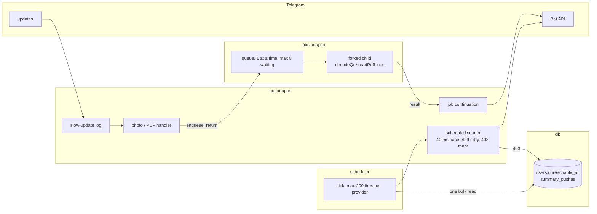

# 0039: Scale hardening: no update waits behind a photo, pushes survive the 1st, backups fit the disk

> **Status:** approved (2026-10-07)
> **Created:** 2026-10-07
> **Related ADRs:** [ADR-0042](../adrs/0042-heavy-jobs-in-a-child-process-handed-off-by-the-handler.md), [ADR-0043](../adrs/0043-scheduled-sends-paced-capped-and-skipping-unreachable-users.md), [ADR-0044](../adrs/0044-compressed-backups-seven-daily-four-weekly.md), [ADR-0036](../adrs/0036-stay-on-node-memory-work-targets-heavy-jobs.md), [ADR-0031](../adrs/0031-local-time-scheduler.md)

## TL;DR

The 2026-10-07 audit asked what breaks first at 10,000 users. The answer was not the database
size (about 1.6 to 4 GB after two years) but the work model. This plan fixes it in risk order:

1. A stuck download can freeze the bot for 5 minutes, and slow updates are invisible. Fix:
   download timeouts and a slow-update log.
2. Pushes go to users who blocked the bot. Fix: mark them unreachable.
3. A 429 loses a push for good, and the fan-out on the 1st starves the other jobs. Fix: paced,
   retried, capped scheduled sends.
4. The minute tick does per-user JS work for every user. Fix: one bulk read.
5. Photos and PDFs block every user. Fix: a child process and a handler hand-off.
6. Backups take 15 times the database on disk. Fix: compressed backups with weekly copies.

The first thing anyone sees: a photo sent while another user's photo decodes no longer delays
their `450 coffee` reply.

## Context & problem

Findings from the audit, with the evidence each phase starts from:

- **The download has no timeout.** `telegramFileDownloader` (`src/bot/handlers/receipt.ts`)
  calls `fetch` with no signal, and undici waits up to 300 s for headers and 300 s for the body.
  Updates run one at a time (`bot.start()`, `src/index.ts`), so one stuck download stalls
  everyone.
- **The heavy work runs inline.**
  - `decodeQr` takes about 0.5 to 2.5 s of synchronous CPU per photo.
  - `readPdfLines` runs pdfjs on the main thread.
  - Both are awaited inside the handler, so they hold the update queue even when they yield.
- **The minute tick walks every user.** `dueSummaries` (`src/services/periodReport.ts`) loops
  over `listPushRecipients`. For each user it runs `findPersonalLedger`, `findLedgerBudget`, a
  new `Intl.DateTimeFormat` in `canonicalTimezone`, and `findSummaryPush`. The estimate is
  2.5 to 3.5 s per tick at 10,000 users. That is unmeasured, and Phase 4 measures it.
- **The fan-out is unpaced.** `register` (`src/scheduler/types.ts`) fires every due occurrence
  back to back. There is no 429 handling, and a claimed push that fails is lost. Users who
  blocked the bot get a 403 every month.
- **Backups.** `startBackups` keeps 14 uncompressed copies and rewrites today's on every boot.

## Decision

- **Heavy jobs:** a forked child process, one at a time, handed off by the handler (ADR-0042).
- **Scheduled sends:** paced, retried on 429, and capped per tick. Unreachable users are
  skipped, and due pushes are found in bulk (ADR-0043).
- **Backups:** gzip, keeping 7 dailies and 4 weeklies (ADR-0044).

We rejected these:
- **Concurrent update handling (grammY runner).** It is a codebase-wide interleaving audit to
  fix two handlers.
- **A stored `next_push_at`.** It needs invalidation on five inputs.
- **The auto-retry plugin.** It is a dependency, and it would sleep inside ordinary handlers.
- **Off-site backups.** That is a later step.

## Architecture diagram



## Implementation phases

Each phase is one commit. The phases are ordered by risk, and each stands alone if the plan stops
early. Phase 1 is the walking skeleton: the bot behaves the same, but stalls become visible in
the log, and a stuck download can't freeze it.

### Phase 1: download timeouts and the slow-update log
- **Owner skill:** dev
- **What:**
  - **Download timeout.** `telegramFileDownloader` passes `AbortSignal.timeout(DOWNLOAD_TIMEOUT_MS)`
    (30,000) to `fetch`, and the signal covers the body read. Callers already turn a rejection
    into the "no QR" or "unreadable" reply.
  - **Slow-update log.** A middleware is registered right after `errorBoundary`. It times each
    update. Over `SLOW_UPDATE_MS` (1,000) it logs one `warn` named `slow update`, carrying only
    `{ updateType, ms }`: no text, ids, amounts or file names.
  - **Loop-delay summary.** `src/index.ts` starts `perf_hooks.monitorEventLoopDelay`. It logs an
    `info` line named `event loop delay` every hour with `{ p50Ms, p99Ms, maxMs }`, then resets
    the histogram, and stops on shutdown.
- **Files touched:** `src/bot/handlers/receipt.ts`, `src/bot/handlers/receipt.test.ts` (or
  where the downloader is tested), `src/bot/middleware/slowUpdate.ts`,
  `src/bot/middleware/slowUpdate.test.ts`, `src/bot/bot.ts`, `src/index.ts`.
- **Done when:**
  - A downloader test against a local server that accepts the connection and never answers
    rejects within the timeout. The timeout is injected as 50 ms in the test, and the test
    finishes in under 1 s.
  - A middleware test with a handler that takes 1,200 ms of injected clock logs exactly one
    `slow update`. Its fields are `updateType: 'message'` and `ms: 1200`, and nothing else
    from the update.
  - A 999 ms handler logs nothing.

### Phase 2: unreachable users
- **Owner skill:** dev
- **What:**
  - **Migration.** At the next free migration number: `ALTER TABLE users ADD COLUMN
    unreachable_at TEXT` (a UTC instant).
  - **Marking.** In private chats, a `my_chat_member` update with
    `new_chat_member.status === 'kicked'` sets it, and `'member'` clears it. Any other private
    update from the user also clears it, with one conditional `UPDATE … WHERE unreachable_at
    IS NOT NULL`, placed before `access`.
  - **Skipping.** `listPushRecipients` excludes unreachable users. A reminder occurrence for an
    unreachable user is claimed and advanced as today, but no message is sent. A recurring
    *expense* is still recorded.
  - **Unchanged.** `blocked_at` (the admin's block) does not change.
- **Files touched:** `src/db/migrations/00NN_unreachable_users.sql`, `src/db/users.ts`,
  `src/db/users.test.ts`, `src/bot/bot.ts`, a private `my_chat_member` handler in
  `src/bot/handlers/` with its test, `src/bot/recurringProvider.ts`,
  `src/bot/recurringProvider.test.ts`, `src/services/periodReport.test.ts`.
- **Done when:**
  - A private `my_chat_member` update with status `kicked` sets `unreachable_at` to the update's
    processing instant. A later `member` update clears it.
  - A `kicked` user with `monthly_push = 1` is absent from `listPushRecipients`. After they send
    any private message, they are present again with `monthly_push` still 1.
  - A due reminder for an unreachable user sends no message and is marked as handled for its
    date. The next tick does not resend it.
  - A due `auto` recurring expense for an unreachable user is recorded with its amount.
  - An admin-blocked user (`blocked_at`) stays blocked after sending a message. Clearing
    `unreachable_at` never touches `blocked_at`.

### Phase 3: paced, retried, capped scheduled sends
- **Owner skill:** dev
- **What:**
  - **The sender.** `src/bot/scheduledSender.ts` wraps the API for scheduler-originated sends.
    It awaits at least `SEND_GAP_MS` (40) since its previous send, with the clock and sleep
    injected.
  - **On a 429** (`GrammyError` with `error_code 429`), it sleeps `parameters.retry_after`
    seconds and retries, at most `MAX_SEND_RETRIES` (2) times. Then it gives up and logs.
  - **On a 403**, it sets `unreachable_at` (Phase 2) and does not retry.
  - **Users.** `summaryProvider` and `recurringProvider` send through it. Claim-before-send is
    unchanged.
  - **The cap.** `register` fires at most `MAX_FIRES_PER_TICK` (200) occurrences per provider
    per tick. The rest are due again on the next tick.
- **Files touched:** `src/bot/scheduledSender.ts`, `src/bot/scheduledSender.test.ts`,
  `src/bot/summaryProvider.ts`, `src/bot/summaryProvider.test.ts`,
  `src/bot/recurringProvider.ts`, `src/bot/recurringProvider.test.ts`, `src/scheduler/types.ts`,
  `src/scheduler/worker.test.ts`, `src/index.ts`.
- **Done when:**
  - A fake API that answers the first send with 429 `retry_after: 3`, then succeeds, delivers
    the message exactly once. The injected sleep received 3,000 ms.
  - Three 429s in a row make exactly 3 attempts (1 + 2 retries). The push stays claimed, and
    one `warn` is logged.
  - A 403 makes exactly 1 attempt and sets the recipient's `unreachable_at`.
  - Five sends through the sender record gaps of at least 40 ms on the injected clock between
    consecutive sends.
  - With 450 summary pushes due, the ticks fire 200, 200, then 50. A recurring occurrence due at
    the same time fires during the first tick.
  - The fan-out arithmetic holds: 10,000 / 200 = 50 ticks, each with at least 200 × 40 ms = 8 s
    of sends, about 50 minutes in all. That is inside `CATCH_UP_MS` (7 days).

### Phase 4: due pushes from one bulk read
- **Owner skill:** dev
- **What:**
  - **One read.** `listPushRecipients` becomes one joined query returning each recipient's user,
    Telegram id, personal ledger (id, timezone, default currency) and budget
    `period_start_day`.
  - **Per-tick memos.** `dueSummaries` memoizes `canonicalTimezone` and the zone's local date
    for the tick.
  - **Claimed keys in one query.** It loads the claimed `(ledger_id, kind, period_key)` of the
    candidate periods in one query, instead of `findSummaryPush` per user.
  - **The bench.** `scripts/bench-due.ts` (`pnpm bench:due <users>`) builds that many users with
    pushes on and times `dueSummaries` at a fixed `now`, cold and warm. It is not in the gate.
- **Files touched:** `src/db/users.ts`, `src/db/summaryPushes.ts`, `src/services/periodReport.ts`,
  `src/services/periodReport.test.ts`, `scripts/bench-due.ts`, `package.json`.
- **Done when:**
  - Every existing `dueSummaries` and summary-push test passes unchanged. This defends that the
    same users are due for the same periods, including a payday budget, the weekly push, a
    ledger timezone that differs from the user's, and a claimed period.
  - A counting wrapper on `db.prepare` sees the same number of prepared statements for 3
    recipients and for 30.
  - `pnpm bench:due 10000` is run on the commit before this phase and on this phase's commit,
    and the implementation log records both. The warm tick on this commit is under 100 ms on
    that machine.

### Phase 5: photos and statements in a child process
- **Owner skill:** dev
- **What:** This is the new `src/jobs/` adapter (ADR-0042).
  - **The queue.** `queue.ts` runs one job at a time and holds at most `MAX_WAITING_JOBS` (8)
    waiting jobs. Each job forks `child.ts` with `serialization: 'advanced'`. It kills the
    child after `JOB_TIMEOUT_MS` (20,000) and resolves with `{ kind: 'timeout' }`.
  - **The child.** It downloads the file (with Phase 1's timeout), runs `decodeQr` or
    `readPdfLines`, posts the result and exits.
  - **The handlers.** `registerReceiptMedia` and `registerStatement` keep their checks up to
    `getFile`, then enqueue and return. The continuation does what follows the decode today:
    the log line, the replies, recording, deleting the photo.
  - **Statement fallthrough.** A PDF that is not this bank's statement gets the reply that
    today's `next()` fallthrough produces.
  - **Errors.** Continuation errors are logged and answered the way the error boundary does.
  - **A full queue** answers `messages.heavyJobBusy`. That is new copy, in Russian, in the
    messages module.
  - **The build.** The child must start from `dist/` in the image and from source under `tsx`
    in dev, and `Dockerfile` must carry what it needs.
- **Files touched:** `src/jobs/queue.ts`, `src/jobs/queue.test.ts`, `src/jobs/child.ts`,
  `src/jobs/child.test.ts`, `src/bot/handlers/receipt.ts`, `src/bot/handlers/statement.ts`,
  their tests or `src/bot/bot.test.ts`, `src/bot/bot.ts`, `src/bot/messages.ts`,
  `src/bot/testHarness.ts` (a way to await the queue's drain), `src/index.ts` (drain on
  shutdown), `eslint.config.js` (a `no-restricted-imports` block keeping grammy out of
  `src/jobs`), `Dockerfile` if needed.
- **Done when:**
  - **No stall (the headline).** A harness test enqueues a photo whose job is held on a latch.
    It then delivers user B's `450 coffee`. B's expense is recorded at 45,000 minor units, and
    the reply is sent before the latch opens.
  - **Same result as inline.** A real forked child decodes every fixture under
    `src/fiscal/qr.fixtures` that `qr.test.ts` decodes, to the same texts as in-process
    `decodeQr`.
  - **Timeout.** A child that never answers, with the timeout injected at 100 ms, is killed. The
    sender gets `receiptPhotoUnreadable`, the log line has `outcome: 'timeout'`, and the next
    job runs.
  - **Full queue.** With one job running and 8 waiting, a 10th photo gets `heavyJobBusy` and
    starts no child.
  - **Idempotent.** The same photo update delivered twice records one expense.
  - **Statement fallthrough.** A PDF that `parseRaiffeisenRs` calls `notThisStatement` gets the
    same reply as before this phase.
  - **Startup cost.** The implementation log records the child's measured startup in ms
    (fork to ready) on the dev machine.

### Phase 6: compressed backups, 7 daily and 4 weekly
- **Owner skill:** dev
- **What:** This implements ADR-0044.
  - **The backup.** An online copy to a temp file, gzip-streamed to
    `expenses-YYYY-MM-DD.sqlite.gz`, then the temp file is removed.
  - **Retention.** `BACKUP_KEEP` (default 7) dailies plus `BACKUP_KEEP_WEEKLY` (default 4)
    Sunday files (UTC date).
  - **Boot and optimize.** Boot skips the backup when today's file exists. `PRAGMA optimize`
    runs after each backup.
  - **Old files.** Legacy `.sqlite` files are counted as dailies by date and rotated out
    normally.
  - **/delete_account** quotes `max(BACKUP_KEEP, 7 × BACKUP_KEEP_WEEKLY)` days.
  - **Docs.** README's configuration table, the backup and restore section (a `gunzip` step) and
    `.env.example` change.
- **Files touched:** `src/db/backup.ts`, `src/db/backup.test.ts`, `src/config.ts`,
  `src/config.test.ts`, `src/index.ts`, `src/bot/bot.ts`, `src/bot/handlers/deleteAccount.ts`,
  `src/bot/messages.ts`, `src/bot/messages.test.ts`, `README.md`, `.env.example`.
- **Done when:**
  - A backup round-trips: gunzipping the file and opening it as SQLite returns the same
    expense rows as the source.
  - **Retention.** Daily backups are simulated for every day from 2026-08-01 to 2026-10-07
    (68 days) with the defaults. The files left are 2026-10-01 to 2026-10-07 (7 dailies), plus
    the Sundays 2026-09-13, 09-20 and 09-27. 10-04 is already a daily. So 10 files in all,
    because a Sunday inside the daily window counts once.
  - A boot with today's file present writes nothing.
  - `/delete_account` with the defaults says "до 28 дн."
  - The implementation log records the compressed and uncompressed sizes of one backup of the
    `size.mjs`-style synthetic database (200,000 expenses), as the measured ratio.

### Phase 7: live checks
- **Owner skill:** human
- **What:**
  1. Deploy.
  2. Send a receipt photo, and send a text expense from a second account while it decodes.
  3. Watch the log for `slow update` and the hourly `event loop delay`.
  4. Read the container's `memory.peak` and `memory.events` `oom_kill` after a few photos
     (ADR-0036's measurement).
  5. On 2026-11-01, watch the monthly push run.
  6. List the backup directory.
- **Done when:**
  - The second account's reply does not wait for the photo.
  - The 2026-11-01 push run logs no `summary push failed` for a 429.
  - The backup directory holds `.gz` files.
  - The `memory.peak` reading is noted in this plan's log.

## Data shapes

```sql
-- illustrative: the next free migration number
ALTER TABLE users ADD COLUMN unreachable_at TEXT; -- UTC instant; NULL = reachable
```

```ts
// illustrative: src/jobs/queue.ts
export type Job =
  | { readonly kind: 'qr'; readonly filePath: string }
  | { readonly kind: 'pdf'; readonly filePath: string; readonly maxPages: number };
export type JobResult =
  | { readonly kind: 'qr'; readonly result: QrDecodeResult }
  | { readonly kind: 'pdf'; readonly result: PdfText }
  | { readonly kind: 'timeout' }
  | { readonly kind: 'failed'; readonly error: string }; // class name only, never content
export interface JobQueue {
  enqueue(job: Job, onDone: (result: JobResult) => Promise<void>): 'queued' | 'full';
  idle(): Promise<void>; // tests and shutdown
}
```

New env key: `BACKUP_KEEP_WEEKLY` (default 4). `BACKUP_KEEP` changes its default from 14 to 7.
New message: `heavyJobBusy`.

## Risks & open questions

- **Privacy.**
  - The child gets a Telegram file path. The bot token is part of the download URL, so it
    reaches the child through env or IPC; it is never logged.
  - Job results (QR text, statement lines) cross IPC and are never logged. Log lines keep the
    shapes the handlers log today.
  - Backup retention for deleted accounts grows from 14 to 28 days. The `/delete_account` copy
    states the new figure.
- **Idempotency.** A redelivered photo update enqueues a second job. Recording already dedups by
  fiscal id and source key (ADR-0018), and Phase 5 tests it. The pushes stay at-most-once.
- **Ordering within a chat.** A message sent after a photo can be answered first (ADR-0042). A
  photo sent while a flow is waiting for text input still reaches the receipt path as today.
  The continuation must not assume the flow session is unchanged since enqueue.
- **Memory.** The bot and one child must fit inside 384 MiB together at their peaks. The child's
  peak is today's decode peak. The bot's idle size is about 100 MiB (ADR-0036). Phase 7 measures
  it, and the cap is not lowered in this plan.
- **Time.** The weekly backup Sunday is a UTC date, as backup names already are. The push due
  instants stay local (ADR-0031). The fan-out ends about 50 minutes after 09:00 local for the
  last user.
- **Concurrent sessions.** Plans 0030 and 0037 are queued or approved and may add migrations.
  Phase 2 takes the next free number at implementation time.

## What this plan does NOT do

- **Concurrent update handling** (grammY runner). ADR-0042 Alternative B. Revisit it if
  `slow update` shows stalls that aren't heavy jobs.
- **Statement caching for `db.prepare`, and a process FX-rate memo.** The audit measured
  prepare at 46 µs uncached against 3 µs cached. That matters only inside loops, and Phase 4
  removes the per-user loop. Revisit if `event loop delay` p99 says otherwise.
- **`synchronous = NORMAL` or a larger `cache_size`.** Write volume doesn't need the first, and
  it weakens durability on power loss. The OS page cache covers the second.
- **Off-site backups** (ADR-0044 Alternative A), or lowering `mem_limit` (ADR-0036 decides that
  on measurement).
- **The sealed export's per-row by-id read and double decrypt** (`exportLedger.ts`), and
  `tagSummary`'s all-time read. Followups for a later plan.
- **The code-quality findings from the same audit:**
  - callback-data decoders and a round-trip test;
  - lint blocks for `bot → db` imports and the other adapters;
  - splitting `bot.test.ts`;
  - fk-off migrations with `foreign_key_check`;
  - excluding `src/**/testing/**` from the build;
  - an `unhandledRejection` log hook;
  - a `plural()` helper in `messages.ts`.

  They are a separate maintainability plan.
- **Plan 0036's `/prices` cost.** That is Plan 0038.

## Implementation log

| phase | owner | state | commit |
|---|---|---|---|
| 1: download timeouts and slow-update log | dev | not started | |
| 2: unreachable users | dev | not started | |
| 3: paced, retried, capped scheduled sends | dev | not started | |
| 4: due pushes from one bulk read | dev | not started | |
| 5: photos and statements in a child process | dev | not started | |
| 6: compressed backups | dev | not started | |
| 7: live checks | human | not started | |

### Notes

### Close triggers

## Followups
