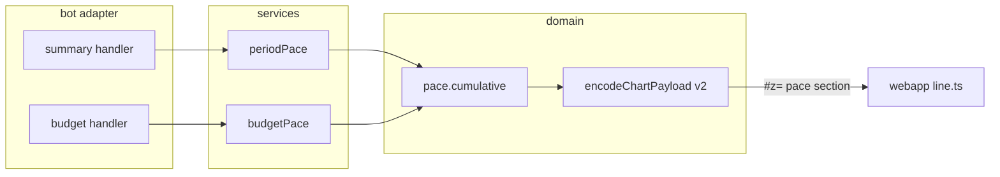

# 0042: Spending pace in the chart, and a burn-down chart for the budget

> **Status:** approved (2026-10-07)
> **Created:** 2026-10-07
> **Depends on:** [Plan 0041](done/0041-chart-capacity-and-period-comparison.md) (payload v2 and its sections), merged on `main` first
> **Related ADRs:** [ADR-0045](../adrs/0045-chart-payload-v2-deflated-sections.md) (payload v2: deflated sections),
> [ADR-0017](../adrs/0017-budgets-payday-periods-cumulative-allowance.md) (payday periods, cumulative allowance),
> [ADR-0023](../adrs/0023-budgets-count-converted-spending.md) (budget conversion)

## TL;DR

The `/week` and `/month` chart gets a pace section: a line of cumulative spending by day for the
shown period, drawn over the same line for the previous period. Next to it is a caption for each:
how much had been spent by today, and how much by the same day last period. The `/budget` screen
gets its own «📈 Диаграмма»: the budget period's cumulative spend by day against the limit's
allowance line, with today's leftover stated in words, as the budget screen states it. The first
thing the user sees: `/month`, «📈 Диаграмма», and under the donut, «К 15 октября: 45 230.00 RSD»
on a rising line, with September's line lighter behind it.

## Context & problem

"Am I spending faster than last month?" is the question a pie can't answer. The text screens can't
either: they show totals, not the path to them. The budget screen states today's leftover
allowance (ADR-0017) as one number. The shape of the period, a burst early and then flat, gets
lost.

The data needed is daily sums of converted spending. Expenses already carry `occurred_on` in the
ledger's timezone, and both the summary and the budget convert each expense at its day's rate and
round before summing (ADR-0022, ADR-0023). The daily sums therefore add up exactly to the totals
the screens show.

## Decision

- **A new `pace` section in the v2 payload.** It carries the period length in days, the
  cumulative minor units per elapsed day for the current series, optionally the full previous
  series, an optional limit, and bot-formatted captions.
- **Pure cumulative sums.** A new `src/domain/pace.ts` builds the series from
  `(occurredOn, convertedMinor)` pairs and a period start. Two services feed it the same converted
  expenses their screens count: `src/services/periodPace.ts` for `/week` and `/month`, and a
  `budgetPace` in `src/services/budget.ts` for `/budget`.
- **The allowance line is geometry.** The page draws it from (0, 0) to (days, limit). Every number
  the user reads is a bot caption that matches the budget screen's text, including today's
  leftover, so the user never has to judge the gap between the lines by eye.
- **Each caption is keyed to its line.** A caption carries a swatch in its line's colour, the way
  a legend row does.
- **The y-axis fits every line.** Its top is the largest of the last current point, the last
  previous point and the limit, so an overspent period stays inside the chart.
- **Days align by position.** Day *d* of this period is drawn against day *d* of the previous one.
  A shorter previous period simply ends early.

We rejected drawing the budget's limit on the `/month` pace line. A budget runs over payday periods
(ADR-0017) that start on any day, so it rarely lines up with a calendar month, and a limit drawn
over the wrong range misleads. The budget gets its own chart on its own screen instead.

## Architecture diagram



## Implementation phases

### Phase 1: Walking skeleton: the pace line on the `/month` chart
- **Owner skill:** dev
- **What:**
  - `src/domain/pace.ts` exports `cumulativeByDay(items, from, days, through)`.
  - `src/services/periodPace.ts` reads the shown period and the one before it, converted into the
    ledger's currency the way `ledgerPeriodSummary` converts them.
  - `messages.chartPace` formats the two captions. The current period's series runs through today,
    or the whole period once it's past. The copy:
    - a running period: «К 15 октября: 45 230.00 RSD» and «К 15 сентября: 38 100.00 RSD»
    - a past period, after «За» in the form `periodAfterZa` gives: «За август 2026: …» and
      «За июль 2026: …»; for weeks «За неделю 21–27 сентября: …»
  - The page gets `webapp/src/line.ts`, which draws the `pace` section. The previous series is a
    muted line and the current one an accent line. Each caption sits above the chart as text,
    after a swatch in its line's colour.
  - The y-axis top is the largest of the two series' last points (and the limit, Phase 2).
  - The encoder's shedding order (Plan 0041) gains two steps after the change labels: first the
    pace section's previous series, then the pace section.
- **Files touched:** `src/domain/pace.ts`, `src/domain/pace.test.ts`, `src/domain/chartPayload.ts`,
  `src/domain/chartPayload.test.ts`, `src/services/periodPace.ts`,
  `src/services/periodPace.test.ts`, `src/bot/messages.ts`, `src/bot/handlers/summary.ts`,
  `src/bot/bot.test.ts`, `webapp/src/payload.ts`, `webapp/src/payload.test.ts`,
  `webapp/src/line.ts`, `webapp/src/main.ts`, `README.md` (Mini App: charts).
- **Done when:**
  - `cumulativeByDay` with items on day 1 (1000), day 1 (500) and day 3 (2000), for a 5-day period
    through day 4, returns `[1500, 1500, 3500, 3500]`: four points with no gap for day 2. An item
    after `through` is not counted.
  - Take a month ledger in Europe/Belgrade opened on 2026-10-15. The pace section has `days` 31,
    15 current points (Oct 1–15) and 30 previous points (all of September).
  - An expense with `occurred_on` 2026-10-01, recorded at 2026-09-30T22:30Z (00:30 in Belgrade),
    counts in October's day 1 and not in September.
  - When no expense in the period is dated after today, the current series' last point equals the
    pie section's `totalMinor`. The previous series' last point equals the previous trend bar's
    `totalMinor`. A test with a converted EUR expense asserts both, so per-expense rounding agrees
    across the screens.
  - The previous caption names the cumulative at day min(15, 30) = 15 of September.
  - For a past period (paged to August 2026 on 2026-10-15), the current series has all 31 points.
  - A `/week` chart has `days` 7.
  - The page draws two `polyline`s: the previous one muted and the current one in the accent
    colour. Both captions arrive only as `textContent`, each after a swatch whose `fill` is its
    polyline's `stroke`. A v2 payload without a `pace` section draws as in Plan 0041.
  - With a previous series ending at 90000 and a current one at 45000, every point of both
    polylines lies inside the viewBox, and the previous line's last point touches its top.
  - A past August chart's captions are «За август 2026: …» and «За июль 2026: …».

### Phase 2: The budget burn-down chart
- **Owner skill:** dev
- **What:**
  - In a private chat with `WEBAPP_URL` set, the `/budget` screen gets a «📈 Диаграмма» `web_app`
    button, but only when the budget has a limit and the ledger isn't locked. It is the first
    keyboard row, above the settings buttons, since it is the screen's one read action.
  - Its payload's title is «Бюджет: 25 сен – 24 окт», and it holds one `pace` section.
    The current series is the cumulative spend by day in the budget's currency, counted the way
    `budgetStatus` counts it: the scope's categories only, each foreign expense converted at its
    day's rate. It runs through today. The section has a `limit` with its caption, and no previous
    series.
  - The section's captions, in order, each after its line's swatch:
    - «Потрачено к 7 октября: 13 500.00 RSD», for the current series
    - today's leftover, with `todayLeft`'s wording from the budget screen: «Осталось на сегодня:
      …» or «Сегодня перерасход …», for the allowance line
    - «Лимит: 30 000.00 RSD»
  - The page draws the allowance line from (0, 0) to (days, limit) as a dashed line
    (`stroke-dasharray`) in the hint colour. The y-axis top is the larger of the limit and the
    series' last point.
- **Files touched:** `src/services/budget.ts`, `src/services/budget.test.ts`,
  `src/bot/handlers/budget.ts`, `src/bot/messages.ts`, `src/bot/bot.test.ts`,
  `webapp/src/line.ts`, `webapp/src/payload.ts`, `webapp/src/payload.test.ts`.
- **Done when:**
  - Take a budget with limit 3000000 (30 000.00 RSD) and start day 25, viewed on 2026-10-07. The
    period runs 2026-09-25 to 2026-10-24, so `days` is 30 (6 days in September plus 24 in
    October), and the current series has 13 points.
  - The series' last point equals the spend through today that `budgetStatus` counts, which is
    `allowanceThrough(3000000, 30, 13)` (= 1300000) minus `todayLeftMinor`. The test asserts it
    against `budgetStatus` on the same data.
  - With scope `optional`, an expense in an essential category is not in the series, as it isn't
    in `budgetStatus`.
  - The limit caption equals the budget screen's limit amount, formatted by the same `messages`
    helper. The leftover caption equals the screen's `todayLeft` line for the same status, in
    both its forms: a positive leftover and an overspend.
  - The title is «Бюджет: 25 сен – 24 окт».
  - With spend through today at 3500000 against a limit of 3000000, the series' last point lies
    inside the viewBox at its top, and the allowance line ends below it.
  - The chart button is the screen's first keyboard row.
  - With no limit (caps only), in a group chat, without `WEBAPP_URL`, or with a locked sealed
    ledger, there is no button. The screen is then byte-identical to today's.

### Phase 3: Live check
- **Owner skill:** human
- **Blocks merge:** no
- **What:** After the merge and the Pages run, open a real `/month` chart mid-month and the
  `/budget` chart on a phone.
- **Done when:**
  - The `/month` pace caption matches the text screen's total (when nothing is future-dated).
  - The budget chart's line ends at the screen's spend, and the allowance line reaches the limit
    on the period's last day.

## Data shapes

```ts
// illustrative: a v2 section (ADR-0045)
interface PaceSection {
  k: 'pace';
  days: number; // the period's length
  current: number[]; // cumulative minor units, one per elapsed day, day 1 first
  previous?: number[]; // the previous period, all its days
  limit?: [limitMinor: number, label: string]; // the budget chart only: «Лимит: …»
  captions: [current: string, second?: string]; // formatted by messages; `second` is the previous
  // series' caption, or on the budget chart today's leftover in the screen's `todayLeft` wording
}
```

## Risks & open questions

- **Money.** The series are integer cumulative sums of per-expense converted amounts, each rounded
  once as ADR-0023 rounds them. The allowance line and point positions are floats used for
  geometry only. No number the page shows comes from them.
- **Time.** Days come from `occurred_on` and the periods from the ledger's effective timezone
  (ADR-0015). "Today" is `deps.now()` in that timezone, never the browser's clock.
- **Payload size.** Two 31-point series of up to 8 digits each come to about 500 bytes of JSON
  before compression. The pace section is shed before the trend, so a crowded month loses its
  pace line rather than its trend.
- **Future-dated expenses.** A period's total counts them and the pace line through today doesn't.
  The equality done-when is stated for a period without them, and the caption says «к 15
  октября», not «всего».

## What this plan does NOT do

- Per-category budget caps as lines on the burn-down.
- A pace line for tags or products (Plan 0044 covers their charts).
- Projecting the period's end ("at this rate, 52 000 by the 31st").
- Group budgets in a chart (`web_app` buttons work only in private chats).

## Implementation log

> Written by `dev`: one row per phase as its commit lands, then the close block. **The phases
> above are the contract. This section records what happened.** Observations, never conclusions:
> no pass list, no self-assessment. Deviations and unmet done-whens are **always** disclosed.
> Keep it shorter than `## Implementation phases`.

| phase | owner | state | commit |
|---|---|---|---|
| 1: Walking skeleton: the pace line on the `/month` chart | dev | not started | |
| 2: The budget burn-down chart | dev | not started | |
| 3: Live check | human | not started | |

### Notes

### Close triggers

## Followups
