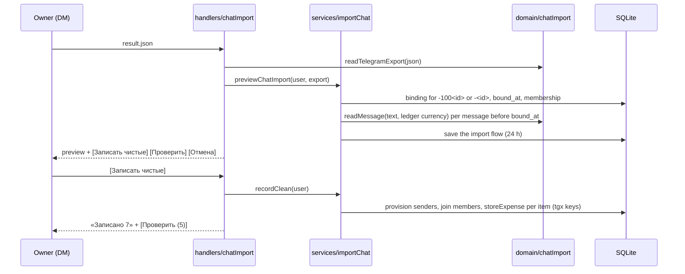

# 0046: Group history import: a Telegram Desktop export brings in the expenses from before the bot joined

> **Status:** draft
> **Created:** 2026-10-07
> **Depends on:** [Plan 0045](0045-currency-words-and-amount-last-text.md) (currency words, `к`, `readTrailingExpense`)
> **Related ADRs:** [ADR-0047](../adrs/0047-group-history-import-from-a-desktop-export.md) (the decision),
> [ADR-0046](../adrs/0046-currency-words-thousands-suffix-and-amount-last-text.md) (the readers),
> [ADR-0014](../adrs/0014-group-chats-bind-to-shared-ledgers.md) (group ledgers),
> [ADR-0015](../adrs/0015-shared-ledgers-carry-a-timezone.md) (dates in the ledger's timezone),
> [ADR-0009](../adrs/0009-persisted-flow-sessions.md) (the pending flow),
> [ADR-0008](../adrs/0008-category-suggestion-from-history.md) (categories)

## TL;DR

The owner exports the family group's history from Telegram Desktop as JSON, and sends `result.json`
to the bot in a private chat. The bot finds the group's ledger and reads every message sent before
it joined. It answers:

> История «Семья» до 15 сентября: 7 расходов в 4 сообщениях читаются чисто (15 500.00 RSD,
> 300.00 EUR). 5 сообщений нужно проверить, 1 без сумм пропущено.
> [Записать чистые (7)] [Проверить (5)] [Отмена]

Clean expenses record under each message's sender, on its original date. The rest come one card at
a time: [Записать так], [Исправить] or [Пропустить]. A message that starts with a name («Ира: …»)
is attributed to whoever the owner says «Ира» is. Sending the file again records nothing new.

## Context & problem

The bot only sees messages sent after it joined (ADR-0047). A family that kept expenses in the chat
before then starts with an empty ledger and months of history outside it. Those messages are free
text: one expense, a list with a total, comma-separated items in two currencies, a name prefix,
or chatter. Plan 0045 teaches the parser the single-expense shapes. This plan adds the splitting,
the export reading, the attribution and the review.

**No message from the family's real chat appears in this plan or in a fixture.** The examples below
are synthetic.

## Decision

- A domain module reads the export into messages: `src/domain/chatImport/telegramExport.ts`.
- A second domain module splits one message into proposed items and a verdict, clean or review:
  `src/domain/chatImport/readMessage.ts`.
- A service previews and records against the group's shared ledger:
  `src/services/importChat.ts`.
- The DM handler shows the preview, the review cards and the name-prefix questions:
  `src/bot/handlers/chatImport.ts`.
- The pending import lives in the user's pending-flow slot with a 24-hour TTL.
- Items are stored through `storeExpense`, with a category from `suggestCategory` and source key
  `tgx:<chatId>:<messageId>:<itemIndex>`.

We rejected forwards, pasted text and a Claude API reader (ADR-0047).

## Architecture diagram



## Implementation phases

### Phase 1: Walking skeleton: an export records its clean messages
- **Owner skill:** dev
- **What:**
  - **Reading the file.** `readTelegramExport(text)` parses the JSON and returns the chat's `id`
    and `name`, and its messages. A message comes back only when its `type` is `"message"` and its
    `from_id` starts with `user`. For each one it keeps:
    - `id`;
    - the instant, from `date_unixtime` (seconds);
    - `from` (the sender's name);
    - the sender's Telegram id, from `from_id` without `user`;
    - the text, joined from `text` whether that is a string or an array of strings and
      `{ text }` objects;
    - `forwarded: true` when `forwarded_from` is present.
  - Anything that isn't such an export returns `notExport`.
  - **Splitting a message.** `readMessage(text, defaultCurrency)` splits the message into lines
    and drops empty ones. A line with `, ` or `; ` is split there, but only when every piece then
    reads as an item. Each line or piece is read:
    - first by `parseExpenseText`;
    - then by `readTrailingExpense`;
    - an amount alone, or «итого/всего/итог» and an amount, is a total line.
  - A trailing «на» or «за» is dropped from an item's description.
  - **The verdict** is `clean` when all of these hold:
    - every line is an `expense` item or a total;
    - a total line equals the sum of the other items, which all share its currency;
    - no amount-last item is bare (Data shapes);
    - the message isn't forwarded and has no name prefix (a single word, then `:`, then text that
      reads as an item with a description).
  - Otherwise the verdict is `review`. A message with no digit in it is `noAmount`.
  - **The preview.** `previewChatImport` finds the binding whose chat id is `-100<id>` or `-<id>`.
    It refuses when there is none, or when the user isn't a member of the bound ledger. It reads
    the messages dated before the binding's `bound_at`, and saves the import flow. It returns the
    clean items and their totals per currency, and the review and no-amount counts.
  - **Recording.** [Записать чистые (N)] records each clean item in one transaction:
    - the sender is provisioned and joins as a member, with their export name as the display name,
      as `recordGroupExpense` does;
    - `occurred_at` is the message's instant, and `occurred_on` its date in the ledger's timezone;
    - the category comes from `suggestCategory` with the ledger's history.
  - The reply says what was recorded, in totals per currency. [Отмена] drops the flow.
  - The handler takes a document named `*.json` or typed `application/json`, and is registered
    before the statement handler.
- **Files touched:** `src/domain/chatImport/telegramExport.ts`,
  `src/domain/chatImport/telegramExport.test.ts`, `src/domain/chatImport/readMessage.ts`,
  `src/domain/chatImport/readMessage.test.ts`, `src/services/importChat.ts`,
  `src/services/importChat.test.ts`, `src/services/groupChats.ts`, `src/services/flowSessions.ts`,
  `src/db/ledgerChats.ts`, `src/bot/handlers/chatImport.ts`, `src/bot/bot.ts`,
  `src/bot/callbackData.ts`, `src/bot/callbacks.ts`, `src/bot/messages.ts`, `src/bot/bot.test.ts`,
  `src/bot/testHarness.ts`.
- **Done when:**
  - In an RSD ledger, `readMessage` returns:

    | Message | Items | Verdict |
    |---|---|---|
    | `Чайник 3200` | 320000 RSD «Чайник» | `clean` |
    | `Краска 2000\nкисти 500\nваликов на 800\n3300 дин` | 200000 «Краска», 50000 «кисти», 80000 «валиков» (2000 + 500 + 800 = 3300, so the total line is dropped) | `clean` |
    | the same with `3400 дин` last | the same three items | `review` |
    | `ремонт 300€, доставка 4500 динар` | 30000 EUR «ремонт», 450000 RSD «доставка» | `clean` |
    | `Шкаф: 4500` | 450000 RSD «Шкаф» (`Шкаф:` is not a prefix: «4500» has no description) | `clean` |
    | `буду в 7` | | `review` (bare, under 100 units) |
    | `Ира: ремонт 300€` | | `review` (name prefix) |
    | `Лампа 1.500` | | `review` (ambiguous) |
    | `привет всем` | | `noAmount` |
  - A synthetic export for a bound supergroup has `id` 1234567890, so the binding's chat is
    `-1001234567890`, and `bound_at` 2026-09-15T00:00:00Z. Its messages are the table's nine (one
    each, from senders A and B, dated 2026-07-01 to 2026-09-14), one forwarded copy of
    `Чайник 3200`, and one `Чайник 3200` dated 2026-09-16. The preview then has:
    - 7 clean items in 4 messages;
    - totals 1550000 RSD and 30000 EUR (3200 + 3300 + 4500 + 4500 = 15 500.00 RSD);
    - 5 messages to review (the `3400` list, `буду в 7`, the prefix, the ambiguous one, the
      forward);
    - 1 without amounts.
    The 2026-09-16 message isn't read.
  - [Записать чистые (7)] stores 7 expenses:
    - each `created_by` is its message's sender;
    - B, who never started the bot, gets a user row and membership with display name «B»;
    - `Чайник 3200` sent 2026-07-20T22:30:00Z has `occurred_on` 2026-07-21 in Europe/Belgrade
      (CEST, UTC+2).
  - Sending the same file again previews 0 clean items, and recording stores nothing new.
  - A second tap on [Записать чистые] stores nothing new.
  - An export of an unbound chat answers that the bot must be added to the group first. An export
    of a group whose ledger the user isn't a member of is refused the same way, and names no group.
  - A `.json` file that isn't an export gets the stray-message reply.

### Phase 2: Review cards
- **Owner skill:** dev
- **What:**
  - [Проверить (N)] opens the first review message as a card. The card shows:
    - «3 из 5»;
    - the sender's name and the message's date;
    - the message text, escaped and cut at 600 characters;
    - the proposed items, if any.
  - Its buttons are [Записать так], shown only when there are proposed items and none is ambiguous,
    [Исправить], [Пропустить], and [👤 <имя>]. The name button cycles the payer through the
    export's senders.
  - [Исправить] asks for the message's expenses, one per line. The typed answer is read line by line
    with `parseExpenseText` and then `readTrailingExpense`. Every line must read, or the bot asks
    again and names the first line it couldn't read. The card then shows the typed items with
    [Записать так].
  - Recording a card stores its items with source keys `tgx:<chatId>:<messageId>:<i>` and moves to
    the next card.
  - After the last card the bot says how many were recorded and how many skipped.
- **Files touched:** `src/services/importChat.ts`, `src/services/importChat.test.ts`,
  `src/services/flowSessions.ts`, `src/bot/flows.ts`, `src/bot/handlers/chatImport.ts`,
  `src/bot/callbackData.ts`, `src/bot/callbacks.ts`, `src/bot/messages.ts`, `src/bot/bot.test.ts`.
- **Done when:**
  - For the `3400` list, the card proposes the three items, and [Записать так] stores 330000 RSD in
    total.
  - For `буду в 7`, [Пропустить] stores nothing and shows the next card.
  - For the ambiguous `Лампа 1.500` there is no [Записать так]. [Исправить] with `1500 лампа`
    stores 150000 RSD «лампа».
  - [Исправить] with `шкаф 4500\nх` answers that line 2 can't be read, and stores nothing.
  - [👤] on A's card makes B the payer, and the item's `created_by` is B's user.
  - A double tap on [Записать так] stores the items once.
  - With the flow older than 24 hours, a tap answers that the import expired, and to send the file
    again.

### Phase 3: Name prefixes
- **Owner skill:** dev
- **What:**
  - Before the preview, the bot asks about each distinct name prefix, in order of first
    appearance: «Кто это — «Ира:»?». It offers a button for each of the export's senders, up to 8,
    most messages first, and [Это не имя].
  - A mapped prefix is cut from its messages, and their payer becomes the chosen sender. They are
    then classified like any message.
  - [Это не имя] keeps the prefix in the text, and those messages stay `review`.
- **Files touched:** `src/domain/chatImport/readMessage.ts`,
  `src/domain/chatImport/readMessage.test.ts`, `src/services/importChat.ts`,
  `src/services/importChat.test.ts`, `src/bot/handlers/chatImport.ts`, `src/bot/callbackData.ts`,
  `src/bot/callbacks.ts`, `src/bot/messages.ts`, `src/bot/bot.test.ts`.
- **Done when:**
  - The prefix of `Ира: ремонт 300€` is «Ира».
  - The prefix of `Шкаф: 4500` is none.
  - The prefix of `Мойка высокого давления: 7000` is none: more than one word.
  - In the Phase 1 export, mapping «Ира» to sender B makes the message clean. The preview then has
    8 clean items in 5 messages, and EUR totals 60000. The item's `created_by` is B.
  - With [Это не имя], the preview is unchanged from Phase 1.
  - Two messages starting `Ира:` give one question.

### Phase 4: Limits, help and docs
- **Owner skill:** dev
- **What:**
  - A file over 10 MB is refused before download («файл больше 10 МБ: выгрузите без медиа»).
  - An export with more than 20 000 messages is refused, as is a preview with more than 3 000
    items.
  - The clean list is paged at 10 items per page, under the preview's counts.
  - `/help` names the import in one line: Telegram Desktop → Export chat history → JSON, no media.
  - README gets a «History import» section with the steps, the before-the-bot window and how
    attribution works.
  - CLAUDE.md's `domain/` line gains «chat import».
- **Files touched:** `src/services/importChat.ts`, `src/services/importChat.test.ts`,
  `src/bot/handlers/chatImport.ts`, `src/bot/messages.ts`, `src/bot/bot.test.ts`, `README.md`,
  `CLAUDE.md`.
- **Done when:**
  - A document with `file_size` 10485761 (10 MB plus one byte) gets the size refusal, and
    `getFile` is never called.
  - A synthetic export of 20 001 messages is refused with the count limit.
  - With 23 clean items, there are 3 pages (10, 10, 3), and the pager reads «1/3».
  - No log line above debug carries a message text, a description or an amount. A test records the
    logger's calls through a full import and checks them.

### Phase 5: A real export
- **Owner skill:** human
- **Blocks merge:** no
- **What:** After deploying, export the family group from Telegram Desktop as JSON with no media,
  and send `result.json` to the bot.
- **Done when:**
  - The bot finds the group. If it doesn't, note the export's `type` and `id` in the plan, without
    the messages.
  - The clean count looks right on a spot check of a few pages.
  - The review cards and the name prefixes are worked through.
  - `/month` for a past month matches what the chat said was spent.

## Data shapes

```ts
// illustrative: src/domain/chatImport/telegramExport.ts
interface ExportedMessage {
  readonly id: number;              // the Telegram message id in that chat
  readonly at: Date;                // from date_unixtime
  readonly senderTelegramId: number;
  readonly senderName: string;      // `from`
  readonly text: string;
  readonly forwarded: boolean;
}
type ExportRead =
  | { kind: 'export'; chatId: number; name: string; messages: readonly ExportedMessage[] }
  | { kind: 'notExport' };

// illustrative: src/domain/chatImport/readMessage.ts
interface ProposedItem { amountMinor: number; currency: CurrencyCode; description: string }
type MessageRead =
  | { verdict: 'clean'; items: readonly ProposedItem[] }
  | { verdict: 'review'; items: readonly ProposedItem[]; reason: 'total' | 'bare' | 'unread' | 'ambiguous' | 'prefix' | 'forwarded'; prefix?: string }
  | { verdict: 'noAmount' };
```

**Bare amount-last item:** read by `readTrailingExpense` with no currency word or `к`, and one of:
- the amount is under 100 whole units;
- the line contains `?`;
- the word before the amount is one of «в, к, до, через, с, по, около, после».

This is a heuristic to keep chatter like «буду в 7» out of the bulk record. It is labelled as such
in code.

The export fields used, as known at planning time and unverified until Phase 5:
- top-level `id` (number), `name` and `type`;
- `messages[]` with `id`, `type`, `date_unixtime` (a string of seconds), `from`, `from_id`
  (`user<digits>`), `text` (a string, or an array of strings and `{ type, text }`), and
  `forwarded_from`.

Callback data:
- `imp:rec`, `imp:rev`, `imp:x`, `imp:pg:<n>`;
- `imp:ok:<i>`, `imp:fix:<i>`, `imp:skip:<i>`, `imp:who:<i>`;
- `imp:map:<prefixIndex>:<senderIndex|n>`.

Each is under 30 bytes.

## Risks & open questions

- **The export format is undocumented.** The chat-id mapping (`-100<id>` for supergroups, `-<id>`
  for basic groups) is tried both ways because it is unverified. Phase 5 is the check.
- **Money:** items are minor-unit integers from `parseExpenseText`. A total is compared in minor
  units within one currency. A message mixing currencies with a total line goes to review.
- **Time:** `occurred_on` is the message's local date in the ledger's timezone (ADR-0015), never
  the import day. Messages are read by instant, against `bound_at`.
- **Idempotency:** each source key is chat, message and item index. Re-sending the file, a double
  tap and a crash mid-record all leave one row per item. A message the bot saw live has a `tg:`
  key, and the window before `bound_at` keeps it out.
- **Privacy:**
  - The file is read in memory and never written to disk.
  - The flow payload holds the read messages for at most 24 hours. A shared ledger is never sealed
    (ADR-0020), so nothing sealed is exposed.
  - Logs carry counts only.
  - Provisioning senders who never started the bot matches live group recording (ADR-0014).
- **Re-binding:** if the bot was removed and re-added, messages sent while it was out are after
  `bound_at` and are not imported. That is out of scope (below).

## What this plan does NOT do

- An import for a private ledger, or from a chat that isn't bound to a group ledger.
- Messages sent while the bot was out of the group, after it first joined.
- Photos of receipts in the history. Only text and captions are read.
- Live multi-item or name-prefixed messages in the group (Plan 0045 covers single items).
- Tags, `/N` splits or debts from imported text.

## Implementation log

| phase | owner | state | commit |
|---|---|---|---|
| 1: Walking skeleton: an export records its clean messages | dev | not started | |
| 2: Review cards | dev | not started | |
| 3: Name prefixes | dev | not started | |
| 4: Limits, help and docs | dev | not started | |
| 5: A real export | human | not started | |

### Notes

### Close triggers

## Followups
