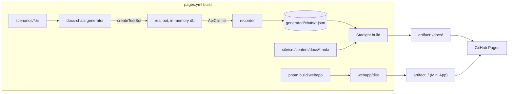

# 0047: A Russian docs site: a user guide with chats generated from the real bot, and an architecture section

> **Status:** in-progress
> **Created:** 2026-10-07
> **Related ADRs:** [ADR-0048](../adrs/0048-a-russian-docs-site-beside-the-mini-app-with-chats-generated-from-the-real-bot.md)

## TL;DR

We publish a documentation site in Russian at
`https://igorkonovalov.github.io/personal_expenses_bot/docs/`. It is an Astro Starlight site in
`site/`, deployed in the same Pages artifact as the Mini App, which stays at the root. Its pages
are a user guide organised by task, plus a separate «Как это устроено» section on the
architecture. Every picture of the chat is generated: a scenario runs through the real bot via
the test harness, and the site draws what the bot sent as Telegram-style bubbles. Mini App charts
appear as the real page in an iframe. The first thing a user sees is a new last line in `/help`
that links to the guide, and a page showing exactly the card the bot answers to «450 кофе».

## Context & problem

The bot's surface has grown across 40-odd plans: budgets with periods and category caps,
receipts and products, bank SMS and statements, debts, tags, recurring expenses, the sealed
ledger, groups, and charts in the Mini App. The only reference is `README.md`'s
`## Using the bot`: English, about 400 lines, on GitHub. Users read Russian, and `/help` is one
long message that can't show a card, a keyboard or a flow. Invited users have nowhere to learn
the bot except by trying it.

The owner also wants the architecture explained, for a technical reader, in a section of its own
that the user guide doesn't mix with.

ADR-0048 records why the pictures are generated and why the site shares the Mini App's Pages
artifact. The two hard constraints are: the Mini App's URL can't move, because `WEBAPP_URL` and
every chart button already sent point at it, and a picture must not drift from `messages.ts`.

## Decision

`site/` is a standalone Starlight project (Russian locale, `base: '/personal_expenses_bot/docs/'`).
Scenarios in `scripts/docs-chats/scenarios/` run through `createTestBot`, and a recorder turns the
recorded `ApiCall`s into transcript JSON under `site/src/generated/chats/` (gitignored). An Astro
component `<Chat name="…" />` draws a transcript. `.github/workflows/pages.yml` builds the Mini
App and the site on every push and pull request. It assembles them into one artifact (Mini App
at the root, site under `docs/`) and deploys only from `main`. We rejected real screenshots and
hand-written mockups because both drift from the copy. We rejected the docs at the root because
it moves the Mini App's URL, and a separate repository because the generator needs the bot's
code (ADR-0048).

## Architecture diagram



## Implementation phases

### Phase 1: Walking skeleton: one generated chat on a live page, linked from /help
- **Owner skill:** dev
- **What:** The smallest end-to-end path. `site/` with Starlight in Russian and one page,
  «Записать трату», showing one generated chat. The Pages workflow publishes the docs beside the
  Mini App, the Mini App root redirects a payload-less visit to the docs, and `/help` links to
  them.
- **Files touched:**
  - `site/package.json`, `site/pnpm-lock.yaml`, `site/pnpm-workspace.yaml` (a standalone pnpm
    project: exact pins, the same `minimumReleaseAge: 10080` as the root, `allowBuilds` only for
    what Starlight needs), `site/astro.config.mjs`, `site/tsconfig.json`,
    `site/src/content.config.ts`, `site/src/content/docs/index.mdx`,
    `site/src/content/docs/guide/record.mdx`
  - `site/src/components/Chat.astro` (draws a transcript: user bubbles right, bot bubbles left,
    inline keyboard rows under a bubble; the text set from the recorded HTML, with only
    Telegram's tag set allowed: `b i u s code pre a blockquote tg-spoiler`)
  - `scripts/docs-chats/run.ts` (runs every scenario, writes `site/src/generated/chats/<name>.json`),
    `scripts/docs-chats/recorder.ts`, `scripts/docs-chats/scenario.ts` (the scenario API:
    `say(text)`, `tap(label)`), `scripts/docs-chats/scenarios/record.ts`
  - `package.json` (scripts `docs:chats`, `docs:build`, `docs:dev`), `.gitignore`
    (`site/src/generated/`, `site/dist/`, `site/node_modules/`, `site/.astro/`, `.pages/`),
    `.dockerignore` (`site`), `eslint.config.js` (ignore `site/`)
  - `.github/workflows/pages.yml` (no `paths` filter; runs on push to `main`, on pull requests,
    and on dispatch; builds the Mini App, runs `docs:chats`, builds the site, and assembles
    `.pages/` with `webapp/dist/*` at the root and `site/dist/*` under `docs/`; `deploy` runs
    only on a push to `main`)
  - `webapp/src/main.ts`, `webapp/src/redirect.ts`, `webapp/src/redirect.test.ts` (a hash that
    carries none of `z=`, `d=`, `m=` replaces the location with `./docs/`)
  - `src/bot/messages.ts` (a `DOCS_URL` constant beside `PRIVACY_URL`, and the line
    `Подробное руководство с примерами: ${DOCS_URL}` before `helpDonateLine` in `help`, and as
    the last line of `groupHelp`), `src/bot/messages.test.ts`
- **Done when:**
  - `pnpm docs:build` on a clean checkout leaves `.pages/index.html` (the Mini App) and
    `.pages/docs/guide/record/index.html`. The latter contains a user bubble «450 кофе» and a
    bot bubble whose text is the HTML the harness recorded for that `sendMessage`, byte for byte
    after the tag allowlist. A test in `scripts/docs-chats/recorder.test.ts` asserts the
    transcript's bot text equals the recorded `payload.text`.
  - `redirect.test.ts`: `''`, `'#'` and `'#tgWebAppData=x'` redirect; `'#z=abc'`, `'#d=abc'` and
    `'#m=scan'` don't.
  - `messages.test.ts`: private `help` and `groupHelp` both contain `DOCS_URL`, and
    `DOCS_URL === 'https://igorkonovalov.github.io/personal_expenses_bot/docs/'`.
  - On a pull request, `pages.yml` runs the build job and skips `deploy`.
  - `pnpm typecheck`, `pnpm lint` and `pnpm test` pass. The bot image's build context doesn't
    contain `site/` (`.dockerignore`).

### Phase 2: The full chat renderer and the live chart embed
- **Owner skill:** dev
- **What:** The recorder and `<Chat>` cover every way the bot changes a chat, so later pages can
  show any flow. A chart button opens the real Mini App inline.
- **Files touched:** `scripts/docs-chats/recorder.ts`, `scripts/docs-chats/recorder.test.ts`,
  `scripts/docs-chats/scenario.ts`, `site/src/components/Chat.astro`,
  `site/src/components/ChartEmbed.astro`, `site/src/styles/chat.css`
- **Done when:** `recorder.test.ts` defends each rule on a hand-built `ApiCall` list:
  - `editMessageText` and `editMessageReplyMarkup` replace the bubble with the same `message_id`
    in place (the scenario runs under `withMessageIds`), and don't append a new bubble.
  - `deleteMessage` removes its bubble.
  - `answerCallbackQuery` with `text` becomes a toast line after the tapped bubble. Without
    `text`, it leaves no trace.
  - `sendDocument` and `sendPhoto` become a file bubble with the file's name, and no content.
  - A reply keyboard is kept as the chat's current bottom keyboard. `<Chat>` draws the last one
    under the transcript.
  - A `web_app` button keeps its URL's fragment. `<Chat>` draws it as a button, and clicking it
    opens `<ChartEmbed>`: an iframe whose `src` is the site base with its trailing `docs/`
    removed, plus the recorded fragment (`/personal_expenses_bot/#z=…`). That is the Mini App
    root, which draws the chart and doesn't redirect.
  - Methods the chat doesn't show (`setMyCommands`, `setChatMenuButton`, reactions) are dropped.
  - `tap(label)` on a label that no button in the latest bot bubble carries throws, naming the
    label and the scenario. A `say` or `tap` after which the bot sends nothing throws too. Either
    one fails `docs:chats`, and with it the Pages build.
  - In the browser, the bubbles follow Starlight's light and dark themes (checked by eye in
    Phase 6).

### Phase 3: The user guide
- **Owner skill:** dev
- **What:** Task-organised Russian pages, each built around one or more generated chats, covering
  everything a non-admin user can do. Sidebar group «Руководство»:
  - «Начало работы»: joining by invite, first contact, the menu, `/settings`.
  - «Записать трату»: amount and currency rules, past dates, categories, edit and delete.
  - «Итоги»: `/today`, `/week`, `/month`, drill-down, summary pushes, charts.
  - «Бюджет»: limit, period start, category caps.
  - «Чеки и цены»: QR photo and link, items, the live scan, `/prices`.
  - «Банк»: SMS and statements.
  - «Регулярные траты».
  - «Долги и общие счета».
  - «Метки».
  - «Валюты».
  - «Группы».
  - «Шифрование».
  - «Экспорт, приватность, удаление».

  Copy in the prose that names a button or command quotes it the way the bot shows it. Each chat
  is generated, never typed.
- **Files touched:** `site/src/content/docs/guide/*.mdx`, `scripts/docs-chats/scenarios/*.ts`,
  `site/astro.config.mjs` (sidebar), `scripts/docs-check-commands.ts`, `package.json`,
  `.github/workflows/pages.yml` (runs the check)
- **Done when:**
  - `scripts/docs-check-commands.ts` exits non-zero, naming the command, when any `command` in
    `messages.commands` or `messages.groupCommands` appears as `/<command>` in no `site/src/content/docs/guide/*.mdx`. It exits 0
    on the finished guide. The admin-only list is exempt. `pages.yml` runs it before the site
    build.
  - Every scenario uses invented inputs only: no real shop, person or amount from the owner's
    data. Group scenarios use invented member names.
  - Scenarios that need the network (a receipt fetch, an NBS rate) run against the fakes the
    existing tests already use (`jobRunner`, the fiscal and rate fetch fakes). Where none fits,
    the page says so in prose, has no chat, and the Implementation log lists it.
  - At least one chart scenario («Итоги») records a `web_app` button, and its page opens the
    embedded chart.

### Phase 4: The architecture section
- **Owner skill:** dev
- **What:** A separate sidebar group, «Как это устроено», in Russian, for a technical reader, in
  hand-written pages:
  - «Обзор»: the layers from CLAUDE.md, with a mermaid diagram.
  - «Путь траты»: a sequence from the update to the reply.
  - «Деньги и время»: minor units, the user's timezone, conversion at report time.
  - «Чеки, выписки и тяжёлые задачи»: fiscal, statements, the job queue.
  - «Приватность и шифрование».
  - «Mini App»: fragment in, `sendData` out.
  - «Развёртывание и резервные копии».
  - «Как ведётся работа»: architect/dev, plans, ADRs, the conductor.

  Each page links the ADRs it rests on as `https://github.com/IgorKonovalov/personal_expenses_bot/blob/main/docs/adrs/<file>`,
  and doesn't restate their rejected alternatives. Mermaid renders in the browser from a pinned
  `mermaid` package bundled by Astro, loaded only on pages that have a diagram. There is no CDN
  and no build-time headless browser.
- **Files touched:** `site/src/content/docs/architecture/*.mdx`,
  `site/src/components/Mermaid.astro`, `site/package.json`, `site/pnpm-lock.yaml`,
  `site/astro.config.mjs`
- **Done when:** Every architecture page builds. Each diagram renders in the browser (checked in
  Phase 6). Every GitHub ADR link on these pages names a file that exists in `docs/adrs/`: a
  small check in `scripts/docs-check-commands.ts` (or a sibling script run in `pages.yml`)
  extracts the `docs/adrs/…` paths from `architecture/*.mdx` and fails on one that doesn't
  exist. No count or roster from `docs/` is restated ("41 ADRs").

### Phase 5: The README hands the user reference to the site
- **Owner skill:** dev
- **What:** `README.md`'s `## Using the bot` shrinks to one paragraph, a short feature list and the
  site link. The operator parts inside it (enabling Pages, setting `WEBAPP_URL`, the probe
  script) move under `## Running in Docker` or `## Deploy`. `CLAUDE.md`'s tree gains `site/` and
  `scripts/docs-chats/`.
- **Files touched:** `README.md`, `CLAUDE.md`
- **Done when:** Every config key, env var and operator step that the old section held is still in
  the README, under the operator sections. `node scripts/check-doc-links.mjs` exits 0. A reader
  of the README finds the site link within the first screen.

### Phase 6: Live check and proofreading
- **Owner skill:** human
- **Blocks merge:** no
- **What:** After the push to `main`, open the site on a phone and on a desktop. Read the guide
  for Russian that reads like a translation. Tap a chart button in a doc page and see the chart.
  Open the bare Mini App root and land on the docs. Open `/help` in Telegram and follow the link.
  Check the bubbles and diagrams in both light and dark theme.
- **Files touched:** none
- **Done when:** The owner reports that each check passed, or lists what to fix.

## Data shapes

```ts
// illustrative: scripts/docs-chats/scenario.ts
export default scenario('record', { chat: 'private', webapp: true, now: '2026-09-15T10:30:00Z' }, [
  say('450 кофе'),
  tap('Категория'),
]);

// illustrative: site/src/generated/chats/record.json
interface Transcript {
  readonly name: string;
  readonly bubbles: readonly Bubble[];
  readonly replyKeyboard?: readonly (readonly string[])[];
}
type Bubble =
  | { readonly from: 'user'; readonly text: string }
  | { readonly from: 'bot'; readonly html: string; readonly buttons?: readonly (readonly Button[])[] }
  | { readonly from: 'bot-file'; readonly fileName: string }
  | { readonly from: 'toast'; readonly text: string };
interface Button {
  readonly text: string;
  readonly kind: 'callback' | 'url' | 'web_app';
  readonly fragment?: string; // web_app only: the `#z=…` the Mini App reads
}
```

Bubbles carry no timestamps, so a picture never shows a date that dates it.

## Risks & open questions

- **Privacy.** Scenarios are the only input, and they are code review's to police. The rule is
  invented data only. The recorder writes nothing but what the in-memory bot sent.
- **Money and time in the pictures.** These come from the real bot, so they follow its rules. A
  scenario must pin `now`, because the harness default (`2026-09-29T22:10Z`, past midnight in
  Belgrade) puts every expense on 30 Sep.
- **Unsanitised HTML.** The bot's HTML is our own output over our own inputs, but `<Chat>` still
  allows only Telegram's tag set and drops attributes other than `href` on `<a>`, so a scenario
  input can't inject markup into the site.
- **Build fragility.** The Mini App now deploys only when the docs build passes. A broken scenario
  blocks a Mini App fix. Mitigation: the build fails loudly on the PR, before `main`.
- **Mini App in an iframe.** `telegram-web-app.js` loads outside Telegram and defines
  `window.Telegram.WebApp` with empty `initData`. The chart draws in its default colours there.
  Unverified: whether the page's CSP or the script behaves differently inside an iframe. Phase 2
  checks it, and Phase 6 checks it on a phone.
- **Prose drift.** Only the bubbles regenerate. The command gate catches a command no page
  mentions, not a page that describes a button wrongly. The architect's close review should treat
  the site page as the docs to check whenever a plan changes something users see. That is a
  change to the architect skill's Mode 4 lens 4, made at this plan's close.

## What this plan does NOT do

- **No operator or self-hosting pages in Russian.** Running, Docker and deploy stay in the English
  README.
- **No English version** of the site, and no i18n scaffolding beyond Starlight's `ru` locale.
- **No publishing of `docs/`** (plans, ADRs). The architecture pages link to them on GitHub.
- **No admin-command pages** (`/invite`, `/stats`, `/block`, …).
- **No committed transcripts and no screenshot PNGs.** Everything visual is generated at build
  time or embedded live.
- **No built-site link checker** like Ritmolux's `check-site-links.mjs`. Add one in a later plan
  if internal links start breaking.
- **No custom domain.**

## Implementation log

> Written by `dev`: one row per phase as its commit lands, then the close block. **The phases
> above are the contract. This section records what happened.** Observations, never conclusions:
> no pass list, no self-assessment. Deviations and unmet done-whens are **always** disclosed.
> Keep it shorter than `## Implementation phases`.

| phase | owner | state | commit |
|---|---|---|---|
| 1: Walking skeleton | dev | done | 8f30d78 |
| 2: Chat renderer and chart embed | dev | done | 65335b5 |
| 3: User guide | dev | done | 055c1fd |
| 4: Architecture section | dev | done | ad3458e |
| 5: README hands off | dev | done | e1e1bbd |
| 6: Live check and proofreading | human | not started | |

### Notes

- Phase 1: pinned `astro` 7.3.5 and `@astrojs/starlight` 0.42.4, the newest outside the 7-day
  cooldown on 2026-10-08. `site/pnpm-workspace.yaml` sets `sharp: false` in `allowBuilds`
  (pnpm refuses an unlisted build script; sharp's prebuilt binary needs none).
- Phase 1: edited `scripts/pages-workflow.test.mjs`, outside `Files touched`: it asserted the
  upload path `webapp/dist`, which this phase changes to `.pages`. It now also asserts the chat
  and site build steps, no `paths` filter, and the deploy job's push-to-main `if`.
- Phase 1: "on a pull request, `pages.yml` skips `deploy`" is checked by that test reading the
  job's `if`, not by a run on GitHub. "The image's build context doesn't contain `site/`" is
  checked by reading `.dockerignore`; no image was built.
- Phase 1: scenarios run as the invited user `SECOND_ALLOWED_ID`, not the admin, and the recorder
  keeps only calls to that user's chat.
- Phase 2: the recorder also draws `sendMediaGroup` (the two-file export) as one file bubble per
  file, which the phase didn't list.
- Phase 2: `tap(label)` looks in the latest bot bubble that still carries an inline keyboard, not
  the latest bot bubble of any kind.
- Phase 2: for the "sent nothing" rule, a reaction to the chat counts as a reply (it is still not
  drawn), and a callback answer counts only with a toast. The rule is tested through
  `expectReply` on hand-built calls; the bot answers every private text, so no real step is silent.
- Phase 2: the iframe inside the docs page was checked in the built HTML (`src` is
  `/personal_expenses_bot/#z=…`, set on the first click), not in a browser. The Mini App's
  meta CSP has no `frame-ancestors`; behaviour of `telegram-web-app.js` in an iframe is left to
  Phase 6.
- Phase 3: edited files outside `Files touched`: `scripts/docs-chats/scenario.ts` (group chats
  with invented members, a `setup(db)` hook, `onboarding`, `say(text, { shown })` for a long
  link, a `cut()` step that clears the picture drawn so far, and a tap's `reply_to_message`),
  `scripts/docs-chats/recorder.ts` (`cut`, a user bubble's `author` in a group, a message's
  reply target), `site/src/components/Chat.astro` and `site/src/styles/chat.css` (the author
  line).
- Phase 3: the user bubble gained an optional `author`, beyond the plan's `Bubble` shape.
- Phase 3: no chat, prose only: the receipt's shop and items (the receipt worker runs outside
  `handleUpdate` and fetches the tax site), a receipt photo and the live scan, the bank statement
  PDF, the summary pushes (scheduler), and `/delete_account` (the harness's `backupKeep: 14`
  makes it name 14 days where production names 28). «Чеки и цены» shows the receipt link's
  offline record and `/prices` in its empty state. «Валюты» stores a made-up NBS list through
  `setup`; the receipt and SMS come from the existing test builders `buildRsUrl` and
  `buildKoriscenjeSms`.
- Phase 3: a group expense the bot answers with a reaction only shows no reply in its picture
  (reactions are dropped); the page says so in prose.
- Phase 3: `docs-check-commands.ts` was checked by hand: with `/settle` renamed on its page it
  exited 1 naming `/settle`, and 0 on the finished guide. No test file covers it.
- Phase 4: pinned `mermaid` 12.0.0 (12.1.0 is inside the cooldown). The ADR-link check lives in
  `scripts/docs-check-commands.ts`, run by `pnpm docs:check`; with one link renamed it exited 1
  naming the page and the path. The mermaid script is in the built HTML of the six pages with a
  diagram and of no other page; rendering in a browser is left to Phase 6. Vite warns that the
  mermaid chunk is over 500 kB.
- Phase 4: the first commit attempt failed the pre-commit hook on a timeout in
  `src/bot/bot.test.ts` («answers a 10th photo with heavyJobBusy…», 5000 ms, suite at 70 s); the
  retry passed with no change.
- Phase 5: the old `## Using the bot` moved to new subsections: «Admission and the admin»,
  «Groups», «Donations», «Receipts» and «Currency conversion» (the outbound hosts; headings kept
  because `src/bot/handlers/privacy.test.ts` reads the hosts from those two sections, which the
  first commit attempt broke) under `## Running in Docker`, and «GitHub Pages:
  the Mini App and the docs site» under `## Deploy`. The amount and currency-word rules, the
  concepts and the chart details went to the site only. The README's development table gained
  `docs:build` and `docs:dev`; CLAUDE.md's tree also gained `scripts/docs-check-commands.ts`.
- Followups noticed, not acted on: the Phase 3 additions to the recorder and runner (`cut`,
  `author`, the reply target, group runs) have no unit test of their own, only the scenarios
  that use them; `scripts/docs-check-commands.ts` has no test; the harness's `backupKeep: 14`
  differs from production's default, which keeps `/delete_account` out of the pictures.

### Close triggers

- **What shipped:** `site/` (Starlight, Russian) with a «Руководство» group of task pages and a
  «Как это устроено» group of architecture pages; `scripts/docs-chats/` (scenario API,
  recorder, runner, scenarios); `scripts/docs-check-commands.ts`; `<Chat>`, `<ChartEmbed>` and
  `<Mermaid>` components; `pages.yml` building the Mini App and the site into one artifact on
  pushes and pull requests and deploying from `main` only; `webapp/src/redirect.ts`; `DOCS_URL`
  in `src/bot/messages.ts`; the README hand-off and CLAUDE.md tree entries.
- **User-visible surface changed:** the private `/help` gains «Подробное руководство с
  примерами: https://igorkonovalov.github.io/personal_expenses_bot/docs/» before the donate line,
  and the group help ends with it. The Mini App root opened with no `z`, `d` or `m` in its
  fragment now goes to `./docs/`. The docs site is new at `/personal_expenses_bot/docs/`.
- **Gate at the tip:** on e1e1bbd: `pnpm typecheck` exit 0; `pnpm lint` exit 0; `pnpm test`
  exit 0 (146 files, 2168 tests); `pnpm build` exit 0; `node --test "scripts/*.test.mjs"` exit 0
  (8 tests); `pnpm docs:build` exit 0 (27 transcripts, `docs:check` passing, 23 pages built);
  `node scripts/check-doc-links.mjs` exit 0 (347 links).
- **Outstanding `human` phases:** Phase 6 (live check and proofreading after the push to
  `main`; `Blocks merge: no`).

## Followups

- At close: the architect's Mode 4 lens 4 names the site's guide pages beside README and `/help`.
