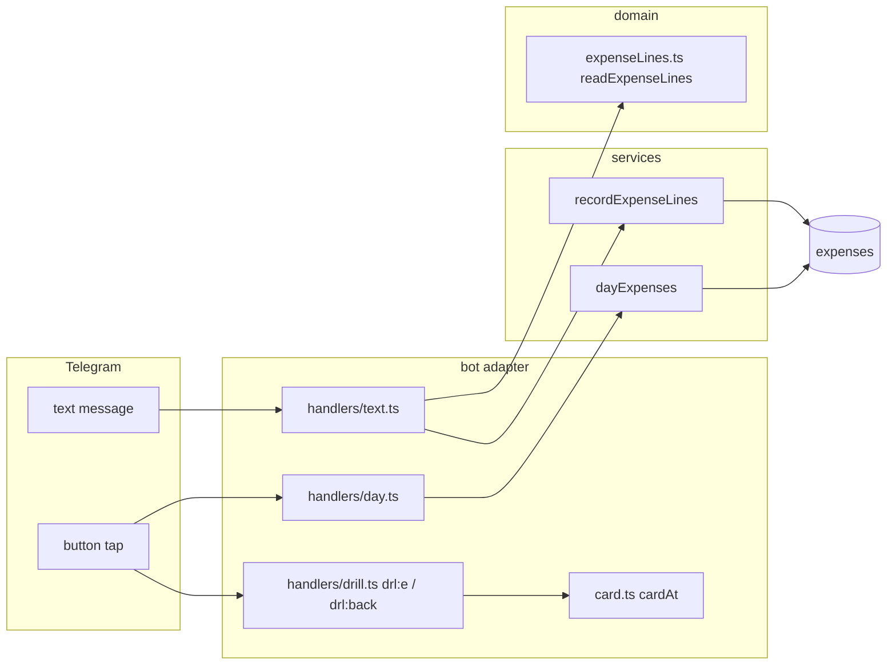

# 0048: Several expenses in one message, a tappable day list under /today, and a calmer «Ещё» menu

> **Status:** approved
> **Created:** 2026-10-08
> **Related ADRs:** [ADR-0049](../adrs/0049-a-multi-line-message-records-one-expense-per-line-all-or-nothing.md), ADR-0011, ADR-0040

## TL;DR

This plan answers three pieces of feedback. First, the «Ещё» screen stops giving its only
full-width row to «Удалить аккаунт»: «Поддержать» takes the top full-width row, and delete sits in
a pair at the bottom. Second, /today gains [Траты]. It lists the day's expenses numbered, steps
back day by day, and opens any expense's card in place to change its category, amount,
description or date, or to delete it. Third, a message with one expense per line records them all
and answers with one batch card whose number buttons open each expense's card. The first thing
the user sees: [☰ Ещё] opens with [Поддержать] across the top.

## Context & problem

- **The menu.** `src/bot/handlers/more.ts` lays `BUTTONS` out two per row. There's an odd number
  of them, and `deleteAccount` is last, so it gets a row of its own and is drawn full width, the
  most prominent button on the screen. A destructive, once-in-a-lifetime action should be the
  least prominent one.
- **Editing an old expense.** Editing exists (Plan 0004 Phase 3, the card's [Изменить]), and an
  old expense's card is reachable through `/week`/`/month` → [По категориям] → category → number
  (Plan 0037). A user who wants "yesterday's taxi" doesn't think in categories, and /today shows
  only totals (`messages.today`), with nothing to tap. So the feedback "I can't edit an old
  expense" is a discoverability gap, not a missing edit.
- **Several expenses per message.** Today `450 кофе\n1200 такси` silently records **one** 450.00
  expense described «кофе 1200 такси», and `кофе 450\nтакси 1200` records nothing (checked
  against `parseExpenseText` on 2026-10-08). See ADR-0049.

## Decision

Three phases, each independently shippable, in the order of their size. The «Ещё» layout gets a
`wide` first row. The day list is a new screen in the anchor (ADR-0011), `day`, beside the
summary drill-down. Its number buttons reuse the drill-down's `drl:e:<uuid>` and `drl:back`, and
`cardAt` learns to add [« Назад] for every list screen, not only the summary's. The multi-line
message follows ADR-0049: at least two expense lines, all or nothing, a key per line, and one
batch card, which is a third list screen (`batch`) using the same card-in-place mechanism. We
rejected a separate "recent expenses" list and text search for editing, because the user chose
the day list (search also can't read a sealed ledger's descriptions). We rejected a card per line
and Plan 0046's reader for multi-line input (ADR-0049).

## Architecture diagram



## Implementation phases

### Phase 1: «Поддержать» across the top of «Ещё», delete in a pair

- **Owner skill:** dev
- **What:** `moreKeyboard` draws [Поддержать] (`more:don`) alone on the first row. The remaining
  user buttons follow two per row, in this order: Регулярные · Долги, Метки · Включить метку,
  Цены · Экспорт, Что нового · Возврат пожертвования, Приватность · Удалить аккаунт. The
  lock/unlock toggle and the admin rows are unchanged. The more scenario in
  `scripts/docs-chats/scenarios/more.ts` and any guide page quoting the screen follow.
- **Files touched:** `src/bot/handlers/more.ts`, `src/bot/bot.test.ts` (or a new
  `src/bot/handlers/more.test.ts`), `scripts/docs-chats/scenarios/more.ts`, `site/src/content/docs/guide/*.mdx` as quoted.
- **Done when:**
  - For a non-admin user with encryption off, the more keyboard's first row is exactly one button
    with callback data `more:don`.
  - Every other row of that keyboard has two buttons, and `more:del` shares its row with
    `more:prv`, which is the last row.
  - `MORE_BUTTONS` still lists every user and admin button (the reachability test in
    `src/bot/handlers/reachability.test.ts` passes unchanged).

### Phase 2: [Траты] under /today: the day's expenses, day by day, each one editable

- **Owner skill:** dev
- **What:**
  - **Entry.** /today and the 📊 button gain [Траты] on every reply, the empty day included, so
    yesterday is one tap away on a morning with nothing recorded yet. It sits first, with
    [Позиции] beside it when present. Callback `day:<yyyy-mm-dd>:<page>` (at most 19 bytes).
  - **The list.** A `day:` tap adopts the tapped message as the user's anchor with the new screen
    `{ name: 'day', ledgerId, date, page, expenseId? }` and draws the active ledger's expenses
    with `occurred_on` = that date. They come newest first, `PAGE_SIZE` to a page, as numbered
    lines. Each line is the drill-down's format without the date (the header carries it):
    `n. <money> · <description>`, plus the author in a shared ledger.
  - **Header and copy.** `<b>Траты за 7 октября</b>` and then `«<ledger>» · N трат · totals`,
    as `drillList` does. Under the list: «Нажмите номер, чтобы изменить или удалить трату.» An
    empty day reads «7 октября трат нет.»
  - **Buttons.** Number buttons go four per row (`drl:e:<uuid>`), then the page pager when there
    is more than one page. Then the day row: `[◀ 07.10] [09.10 ▶]`, with the next button absent
    on today in the ledger's timezone. Last comes [« Назад] → `itm:today`, which redraws /today
    for the current day.
  - **Card in place.** `DRILL_EXPENSE` and `DRILL_BACK` accept the anchor when its screen is a
    summary list **or** a day list. `showsInDrill`, `ExpenseScreen.returnTo` and its parser widen
    to a union of the list screens, so the card's edit prompts and [« Назад] work from the day
    list exactly as from the summary drill-down. Back redraws the same day and page, or the last
    page that still exists.
  - **Refusals.** A future date or a malformed `day:` is answered silently and edits nothing. A
    locked sealed ledger toasts `ledgerLockedToast`. Private chats only.
  - **Docs.** `/help` names the button in one line. The guide page on totals
    (`site/src/content/docs/guide/totals.mdx`) and the editing scenario
    `scripts/docs-chats/scenarios/record-edit.ts` show the day list path.
- **Files touched:** `src/services/dayExpenses.ts`, `src/services/dayExpenses.test.ts`,
  `src/db/expenses.ts`, `src/services/flowSessions.ts`, `src/services/flowSessions.test.ts`,
  `src/bot/handlers/day.ts`, `src/bot/handlers/today.ts`, `src/bot/handlers/drill.ts`,
  `src/bot/handlers/card.ts`, `src/bot/handlers/items.ts`, `src/bot/callbackData.ts`,
  `src/bot/callbacks.ts`, `src/bot/flows.ts`, `src/bot/bot.ts`, `src/bot/messages.ts`,
  `src/bot/bot.test.ts`, `site/src/content/docs/guide/totals.mdx`,
  `scripts/docs-chats/scenarios/record-edit.ts`.
- **Done when:**
  - For a Europe/Belgrade user (UTC+2 in October 2026), an expense with `occurred_at`
    2026-10-07T22:30:00Z (00:30 local on 08.10) appears in the list for 2026-10-08 and not in the
    one for 2026-10-07.
  - With the clock at 2026-10-08 in that timezone, /today with no expenses still shows [Траты].
    Tapping it shows «8 октября трат нет.» with [◀ 07.10] and no next button. [◀ 07.10] lists
    the 7th's expenses under the day row `[◀ 06.10] [08.10 ▶]`.
  - On a day with 10 expenses, page 1 shows lines 1–8 and page 2 lines 9–10, with number buttons
    9 and 10.
  - From the day list: [2] opens that expense's card with [« Назад] on its last row. Then
    [Изменить] → [Сумма] → `500` changes it to 50000 minor units. The card redraws with
    [« Назад], and [« Назад] shows the same day's list with the new amount on line 2.
  - [Удалить] on a card opened from the day list, then [« Назад], shows the list without that
    expense.
  - A `drl:e:<uuid>` for an expense of another ledger, tapped on a day list, toasts
    `expenseNotFound` and edits nothing.
  - The summary drill-down tests from Plan 0037 still pass unchanged.

### Phase 3: Several expenses in one message

- **Owner skill:** dev
- **What:**
  - **Reading.** `readExpenseLines(text, defaultCurrency, today)` in
    `src/domain/expenseLines.ts` splits the text on line breaks and drops blank lines. Each line
    is read as `recordExpense` reads a one-line text with `forms: 'any'`: `parseExpenseText`,
    then `readTrailingExpense`. Lift that per-text reading into the domain if it lives in the
    service. The result is one of:
    - `single`: fewer than two lines, or fewer than two lines that read as an expense of any
      kind (plain, ambiguous, future, split);
    - `lines` with every line's reading, when every line is a plain expense with no `/N`;
    - `badLine` with the 1-based number of the first line that isn't, and why: `unreadable`,
      `ambiguous`, `future`, `split` or `tooManyTags`;
    - `tooMany` past `MAX_EXPENSE_LINES` (20).
  - **Recording.** In `handlers/text.ts`, after the receipt link and the bank SMS checks and
    before `recordExpense`, a `lines` result goes to `recordExpenseLines`. It stores each line in
    one transaction, with `storeExpense`, the same category suggestion and the ledger timezone's
    `occurred_on` (each line may carry its own date suffix). Line 1 gets the key
    `tg:<chat>:<message>` and line *n* the key `tg:<chat>:<message>:<n>` (ADR-0049). If line 1's
    key exists, it returns the stored expenses of every key with `duplicate: true` and records
    nothing. A locked sealed ledger's redelivery is `sealedDuplicate`. A `single` result takes
    today's path unchanged.
  - **The batch card.** It is a new message that becomes the anchor, with screen
    `{ name: 'batch', ledgerId, sourceKey, expenseId? }`. It shows
    `<b>Записал <N трат> в «<ledger>»</b>` (the count through the plural helper, so «3 траты»), then the numbered lines
    `n. <money> · <description> · <category>`, each with ` · dd.mm` when its date isn't the
    message's day. A deleted expense is struck through on redraw. Then `Итого: ` with the totals
    per currency, then «Нажмите номер, чтобы изменить трату.» Number buttons go four per row
    (`drl:e:<uuid>`). `DRILL_EXPENSE`/`DRILL_BACK`, `showsInDrill` and `returnTo` accept the
    `batch` screen as they accept `day` (Phase 2). Back redraws the batch from its keys.
  - **After recording.** `tidyAfterRecording` runs once, and `offerTip('expenseRecorded')` runs
    once with line 1's expense. The `/N` split picker never runs for a batch.
  - **Refusal copy** (illustrative messages-module entries; nothing is recorded in any of them):

    ```ts
    linesBadLine: ({ n, line, reason }) => html`Строку ${n} («${line}») не понял${reason === 'ambiguous' ? html`: напишите сумму без точки, например 1500 или 1,5` : reason === 'future' ? html`: эта дата ещё не наступила` : reason === 'split' ? html`: делить на части можно только одну трату` : html``}. Ничего не записано — исправьте строку и отправьте все траты ещё раз.`,
    linesTooMany: html`Не больше 20 трат в одном сообщении. Ничего не записано.`,
    ```
    The quoted line is cut to `MAX_LIST_DESCRIPTION` code points.
  - **Docs.** `/help` and the recording tip (`messages` around «Под подтверждением…») gain one
    line: «Несколько трат — по одной в строке.» The guide page
    `site/src/content/docs/guide/record.mdx` gets a section, and a new scenario
    `scripts/docs-chats/scenarios/record-lines.ts` shows it.
- **Files touched:** `src/domain/expenseLines.ts`, `src/domain/expenseLines.test.ts`,
  `src/domain/expenseText.ts`, `src/services/recordExpense.ts`,
  `src/services/recordExpenseLines.ts`, `src/services/recordExpenseLines.test.ts`,
  `src/services/flowSessions.ts`, `src/services/flowSessions.test.ts`,
  `src/bot/handlers/text.ts`, `src/bot/handlers/batch.ts`, `src/bot/handlers/drill.ts`,
  `src/bot/handlers/card.ts`, `src/bot/flows.ts`, `src/bot/messages.ts`, `src/bot/bot.test.ts`,
  `site/src/content/docs/guide/record.mdx`, `scripts/docs-chats/scenarios/record-lines.ts`.
- **Done when:**
  - In an RSD ledger with today 2026-10-08, `readExpenseLines` returns:

    | Text | Result |
    |---|---|
    | `450 кофе` | `single` |
    | `450 кофе\nс Ирой` | `single` (one expense line) |
    | `450 кофе\n1200 такси\n12 eur обед` | `lines`: 45000 RSD «кофе», 120000 RSD «такси», 1200 EUR «обед» |
    | `кофе 450\n\nтакси 1200` | `lines`: 45000 RSD «кофе», 120000 RSD «такси» (the blank line is dropped) |
    | `450 кофе\n1200 такси вчера` | `lines`, line 2 dated 2026-10-07 |
    | `450 кофе\nс Ирой\n1200 такси` | `badLine`, line 2, `unreadable` |
    | `450 кофе\n1.500 лампа` | `badLine`, line 2, `ambiguous` |
    | `450 кофе\n1200 такси 25.12` | `badLine`, line 2, `future` |
    | `450 кофе\n3000 ужин /3` | `badLine`, line 2, `split` |
    | 21 lines of `100 хлеб` | `tooMany` |
  - Sending `450 кофе\n1200 такси\n12 eur обед` stores three expenses with keys `tg:<c>:<m>`,
    `tg:<c>:<m>:2` and `tg:<c>:<m>:3`. The one reply reads `Итого: 1 650.00 RSD, 12.00 EUR`
    (45000 + 120000 = 165000 minor units) and has number buttons 1, 2 and 3.
  - Redelivering the same update stores nothing new (still three rows) and re-sends the same
    batch card.
  - `450 кофе\n1.500 лампа` stores nothing and replies with `linesBadLine` naming line 2.
  - `450 кофе\nс Ирой` still records one 45000 expense described «кофе с Ирой» under key
    `tg:<c>:<m>`.
  - On the batch card, [2] opens the taxi's card with [« Назад]. [Категория] → another category
    redraws the card with [« Назад], and [« Назад] shows the batch with line 2's new category.
  - In a sealed ledger that is locked, the three-line message records three sealed rows, and its
    redelivery answers `sealedDuplicate`.

### Phase 4: Live check

- **Owner skill:** human
- **What:** On the deployed bot: open [☰ Ещё] and see [Поддержать] across the top. Send a
  three-line message, open line 2 from the batch card and change its amount. Open /today →
  [Траты] → [◀] → yesterday, open an expense and delete it.
- **Files touched:** none.
- **Done when:** All three paths behave as Phases 1–3 describe on a phone client.

## Data shapes

```ts
// illustrative: src/services/flowSessions.ts
interface DayScreen {
  readonly name: 'day';
  readonly ledgerId: LedgerId;
  readonly date: LocalDate;
  readonly page: number;
  readonly expenseId?: ExpenseId; // the card shown in place
}
interface BatchScreen {
  readonly name: 'batch';
  readonly ledgerId: LedgerId;
  readonly sourceKey: string; // line 1's key; line n is `${sourceKey}:${n}`
  readonly expenseId?: ExpenseId;
}
// ExpenseScreen.returnTo widens to SummaryScreen | DayScreen | BatchScreen.

// illustrative: src/domain/expenseLines.ts
type ExpenseLines =
  | { kind: 'single' }
  | { kind: 'lines'; lines: readonly ExpenseReading[] }
  | { kind: 'badLine'; n: number; line: string; reason: 'unreadable' | 'ambiguous' | 'future' | 'split' | 'tooManyTags' }
  | { kind: 'tooMany' };
```

Callback data: `day:<yyyy-mm-dd>:<page>` (at most 19 bytes) is new. `drl:e:<uuid>` (42 bytes)
and `drl:back` are reused. No migration: the new keys fit `expenses.source_key`.

## Risks & open questions

- **Idempotency:** the batch is one transaction, keyed on line 1, so a redelivery can't find half
  a batch. A user who edits the message and resends it as a *new* message records it again. That
  is the same as for a one-line expense.
- **Behaviour change:** a message with two or more expense lines and one prose line, which today
  records one expense with a merged description, is now refused. That's deliberate (ADR-0049):
  the old reading was silently wrong.
- **Money:** totals per currency go through the money module's sum. No conversion on the batch
  card, so mixed currencies are listed side by side, not added.
- **Time:** the day list filters on the stored `occurred_on` (already in the ledger's timezone),
  and "today" for hiding [▶] is computed with the ledger's effective timezone, never the
  server's.
- **Privacy:** no line text in logs above debug, including the refused line.
- **Telegram:** the batch card holds at most 20 lines of at most `MAX_LIST_DESCRIPTION`
  characters each, well under 4096, and 20 number buttons in five rows.

## What this plan does NOT do

- Multi-line messages in a group chat. The group path (`src/bot/group/text.ts`) keeps one expense
  per message. That's a future plan, and could meet Plan 0046's reader.
- A total line (`итого 1650`) inside a multi-line message. It's refused as `unreadable` on that
  line.
- Commas or semicolons as separators (ADR-0049 Alternative B).
- Text search over expenses, and a cross-day "recent expenses" list.
- Asking the ambiguous-amount question per line.

## Implementation log

> Written by `dev`: one row per phase as its commit lands, then the close block. **The phases
> above are the contract. This section records what happened.** Observations, never conclusions:
> no pass list, no self-assessment. Deviations and unmet done-whens are **always** disclosed.
> Keep it shorter than `## Implementation phases`.

| phase | owner | state | commit |
|---|---|---|---|
| 1: «Поддержать» across the top of «Ещё» | dev | not started | |
| 2: [Траты] under /today | dev | not started | |
| 3: Several expenses in one message | dev | not started | |
| 4: Live check | human | not started | |

### Notes

### Close triggers

- **What shipped:**
- **User-visible surface changed:**
- **Gate at the tip:**
- **Outstanding `human` phases:**

## Followups
