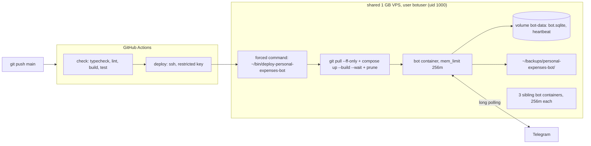

# 0002: Deploy: Docker Compose on the shared VPS, CI gate, daily SQLite backups

> **Status:** done (2026-09-30): built as planned, prod shares the dev bot token by the user's call, no version bump
> **Created:** 2026-09-29
> **Amended:** 2026-09-30, before implementation: migrations 0002 to 0004 exist, soft-deleted
> expenses, a fixed `DATABASE_PATH` in Compose, and the pnpm workspace file in the image.
> Amended again 2026-09-30, after Phase 3, for the VPS survey: a new dev Phase 4 (memory cap,
> build-cache pruning, a forced-command deploy key), and provisioning moves to Phase 5 with no
> sudo and the siblings' backup location
> **Related ADRs:** [ADR-0001](../../adrs/0001-tech-stack.md), [ADR-0006](../../adrs/0006-production-runs-compiled-js.md)

## TL;DR

The bot runs 24/7 on the shared 1 GB VPS that already hosts three sibling bots, deployed the
same way as `traditional-medicine-notifier-bot`: a multi-stage Docker image of compiled JS (ADR-0006), a Compose service with a
heartbeat-file health check, and a GitHub Actions `check` job. A push to `main` then deploys over
SSH, where a restricted key can only run one fixed deploy script (`git pull --ff-only`,
`docker compose up -d --build --wait`, then pruning). The container is capped at 256 MiB like its
siblings. The live SQLite file is backed up at boot and every 24 hours into a host directory,
keeping 14 days. The first visible
result: the user pushes to `main`, and a few minutes later `/today` answers from the VPS while
their laptop is closed.

## Context & problem

Plan 0001 runs only under `pnpm dev` on a laptop. A family expense bot that's asleep when the
laptop is closed loses expenses, and a single SQLite file with no backup is one disk failure away
from losing all history. The sibling bot's scaffold on the same VPS is proven. Diverging from it
would mean running two different operational models on one server.

## Decision

Mirror the sibling's scaffold (`Dockerfile`, `docker-compose.yml`, `.github/workflows/deploy.yml`,
`services/db-backup.ts`, heartbeat in `index.ts`), with four tightenings this repo's rules require:

- the base image is pinned **by digest**, which the sibling left as a TODO;
- the deploy waits for health with `--wait`, so a container that never becomes healthy fails the
  workflow instead of reporting green;
- GitHub Actions are pinned by commit SHA (supply chain, ADR-0001);
- backup filenames use the UTC date and rotate by name, not mtime, so rotation is deterministic
  in tests.

We rejected building the image in CI and pushing it to GHCR, because it adds a registry and
credentials for no gain on a one-server setup the sibling already runs with on-host builds. The
2026-09-30 VPS survey re-tested that call: the droplet has 961 MB of RAM, and before the survey it
had no swap and about 300 MB available. It now has 2 GB of swap, and every sibling is capped at
`mem_limit: 256m`. All three siblings build on the host. We keep the on-host build and add the
two guards it lacked: this bot's own `mem_limit: 256m`, and `docker builder prune` after each
deploy, because the build cache had grown to 12.6 GB unnoticed. Shipping the image over SSH
(`docker save | docker load`) was also rejected, as a bespoke pipeline no sibling uses.

The deploy user is in the `docker` group, which is root-equivalent, so any shell as that user is
root on the droplet. The GitHub Actions key is therefore a dedicated key restricted in
`authorized_keys` to `restrict,command="..."`: it can only run a fixed deploy script installed
outside the checkout, never an arbitrary command. We rejected reusing the siblings' unrestricted
keys, where a leaked `SSH_KEY` secret is a root shell. The restriction doesn't stop a malicious
commit on `main` from running code at build time. Write access to the GitHub repository remains
the real boundary.

We
rejected `node-cron` for a single daily job, because `setInterval` plus a boot run is enough and
avoids a dependency. The FX plan can revisit scheduling when it needs clock-aligned jobs.

## Architecture diagram



## Implementation phases

Each phase ships as its own commit. `dev` implements all `dev` phases in one session. The
architect reviews once at the end, in a fresh session.

### Phase 1: The bot runs from a Docker image of compiled JS
- **Owner skill:** dev
- **What:** `pnpm build` per ADR-0006, a production `pnpm start`, a heartbeat file written
  once polling has started, graceful shutdown, and a multi-stage Dockerfile and Compose file
  modelled on the sibling's.
- **Files touched:** `package.json` (`build`, `start`), `tsconfig.build.json`, `Dockerfile`,
  `.dockerignore`, `docker-compose.yml`, `src/index.ts`, `src/heartbeat.ts`,
  `src/heartbeat.test.ts`, `.env.example`, `README.md` (run-in-Docker section), `CLAUDE.md`
  ("Where things live": `Dockerfile`, `docker-compose.yml`).
- **Done when:**
  - `pnpm build` exits 0 and produces `dist/index.js`, and `dist/db/migrations/` holds the same
    `*.sql` file names as `src/db/migrations/`. `dist/` contains no `*.test.js`.
  - The boot log line `migrations checked` also carries `node: process.version`. Built from the
    Dockerfile and run with a fake `BOT_TOKEN` on an empty volume, the container logs
    `node: "v24.…"` and an `applied` list naming every migration in `src/db/migrations/`, in
    filename order, then exits on the 401. This settles the ADR-0001
    better-sqlite3-on-Node-24 claim that Plan 0001 left unmet. The log records the exact
    version.
  - Both `FROM` lines use `node:24-alpine@sha256:<digest>`. The log records the digest.
  - In the image, `id -u` is `1000`, and `node_modules/typescript`, `node_modules/tsx` and
    `node_modules/vitest` do not exist.
  - Heartbeat (`src/heartbeat.ts`, fake timers + temp dir): nothing is written before
    `start()`. After `start()`, the file `<dirname(DATABASE_PATH)>/heartbeat` exists, and
    advancing 30 s rewrites it. After `stop()`, advancing 60 s doesn't rewrite it. The
    health-check command exits 0 for an mtime 119 s old and 1 for 121 s old or a missing file.
  - SIGTERM stops the heartbeat timer, then the bot, then closes the DB, and the process exits 0.
    `docker compose stop` finishes inside the default 10 s grace period (the log records the
    measured time).
  - `docker-compose.yml`: `restart: unless-stopped`, `env_file: .env`, named volume `bot-data` at
    `/app/data`, the backup bind mount
    `${HOST_BACKUP_DIR:-/var/backups/personal-expenses-bot}:/var/backups/personal-expenses-bot`,
    a heartbeat `healthcheck` (interval 30s, start_period 40s, retries 3), and json-file logging
    with `max-size: 10m`, `max-file: 3`. Its `environment:` sets
    `DATABASE_PATH=/app/data/bot.sqlite`, which overrides `.env`, so the database and the
    heartbeat always land on the volume whatever the VPS `.env` says.
  - The image's install reads `pnpm-workspace.yaml` (the release-age cooldown and `allowBuilds`),
    so a Dockerfile that omits it fails the build rather than skipping the native build.

### Phase 2: Daily SQLite backups with rotation
- **Owner skill:** dev
- **What:** An online `db.backup()` into `BACKUP_DIR` at boot and every 24 h, written to a temp
  name and renamed into place. Rotation keeps the newest `BACKUP_KEEP` dated files. With
  `BACKUP_DIR` unset, backups are off (local dev).
- **Files touched:** `src/db/backup.ts`, `src/db/backup.test.ts`, `src/config.ts`,
  `src/config.test.ts`, `src/index.ts`, `.env.example`, `docker-compose.yml`
  (`BACKUP_DIR=/var/backups/personal-expenses-bot`), `README.md` (env table).
- **Done when:**
  - At clock `2026-09-29T22:30:00Z`, a backup of a DB holding 3 expenses writes
    `expenses-2026-09-29.sqlite` (the **UTC** date, even though it's already 30 September in
    Belgrade), and opening it read-only gives `SELECT count(*) FROM expenses` = 3.
  - A second backup on the same UTC day leaves exactly one `expenses-2026-09-29.sqlite`,
    replaced via temp-file + rename. No `*.tmp` remains.
  - Rotation: the directory holds `expenses-2026-09-14.sqlite` … `expenses-2026-09-28.sqlite`
    (15 files) plus `notes.txt` and `expenses-manual.sqlite`. After the 2026-09-29 backup with
    `BACKUP_KEEP=14`, the 14 files `2026-09-16` … `2026-09-29` remain, `2026-09-14` and
    `2026-09-15` are deleted, and the two non-matching files are untouched.
  - The directory is created with mode `0700` if missing.
  - With fake timers, boot runs one backup, and advancing 24 h runs a second. A backup that throws
    (unwritable dir) logs one `error` line with the path and error name, and the bot keeps
    running.
  - Config: `BACKUP_KEEP` defaults to 14. `BACKUP_KEEP=0` and `BACKUP_KEEP=abc` throw errors
    naming `BACKUP_KEEP`.
  - Backup log lines carry the file path and size in bytes only.

### Phase 3: CI gate and deploy on push
- **Owner skill:** dev
- **What:** `.github/workflows/deploy.yml`, modelled on the sibling's: `check` on pull requests
  and pushes to `main`, and `deploy` over SSH on push to `main` only.
- **Files touched:** `.github/workflows/deploy.yml`, `README.md` (deploy section: secrets, VPS
  layout, manual redeploy, restore steps), `CLAUDE.md` ("Where things live": `.github/`).
- **Done when:**
  - `check` runs on `ubuntu-latest` with Node from `.nvmrc` (24): `pnpm install
    --frozen-lockfile`, `typecheck`, `lint`, `build`, `test`, in that order.
  - `deploy` has `needs: check` and
    `if: github.event_name == 'push' && github.ref == 'refs/heads/main'`, and the workflow sets
    `concurrency: { group: deploy, cancel-in-progress: false }`.
  - Every `uses:` names a full 40-character commit SHA, with the tag in a trailing comment.
  - The SSH script runs `set -e`, `cd ~/bots/personal-expenses-bot`, `git pull --ff-only`,
    `docker compose up -d --build --wait --wait-timeout 180` and `docker image prune -f`.
    Secrets are `SSH_HOST`, `SSH_USER`, `SSH_KEY` and `SSH_PASSPHRASE`, the sibling's names, so
    the user can copy the same values.
  - `actionlint` (run via `npx`/`pnpm dlx`, not added as a dependency) reports no errors on the
    workflow. The log records the output.

### Phase 4: Fit the shared droplet: memory cap, cache pruning, forced-command deploy
- **Owner skill:** dev
- **What:** Cap the container at 256 MiB. Move the deploy commands out of the workflow into a
  committed script, which the human installs on the VPS as the deploy key's forced command. Prune
  the build cache on every deploy. Point the docs at the siblings' backup location and a key with
  no passphrase.
- **Files touched:** `docker-compose.yml`, `scripts/deploy-vps.sh`, `scripts/deploy-vps.test.mjs`,
  `.github/workflows/deploy.yml`, `README.md` (deploy section), `.env.example`
  (`HOST_BACKUP_DIR`), `CLAUDE.md` ("Where things live": `scripts/`).
- **Done when:**
  - `docker-compose.yml` sets `mem_limit: 256m` on `bot`, and `docker compose config` (with a
    stub `.env`) reports the limit as 268435456 bytes (256 x 1048576).
  - `scripts/deploy-vps.sh` is POSIX `sh` with `set -eu`. It runs, in this order:
    `cd "$HOME/bots/personal-expenses-bot"`, `git pull --ff-only`,
    `docker compose up -d --build --wait --wait-timeout 180`, `docker image prune -f` and
    `docker builder prune -f --filter until=168h`. It never reads or runs `$SSH_ORIGINAL_COMMAND`.
  - `scripts/deploy-vps.test.mjs` (`node --test`, with stub `git` and `docker` on `PATH` that
    append their argv to a log, and a temp `HOME` holding the checkout directory) asserts:
    - With `SSH_ORIGINAL_COMMAND='touch pwned'`, the log holds exactly those four calls in that
      order, and no `pwned` file exists.
    - A `git` stub that exits 1 makes the script exit non-zero with zero `docker` calls logged.
    - A `docker compose up` stub that exits 1 makes the script exit non-zero with no prune calls
      logged.
  - `shellcheck` reports nothing on the script. Run it from a digest-pinned
    `koalaman/shellcheck` image, the way Phase 3 ran actionlint, and record the digest in the log.
  - The workflow's deploy step drops `passphrase:`, and its `script:` no longer carries the deploy
    commands. It sends a placeholder, with a comment saying that the forced command ignores it
    and naming the script. `actionlint` is still clean.
  - The README deploy section lists three secrets (`SSH_HOST`, `SSH_USER`, `SSH_KEY`) and gives:
    - the `ssh-keygen -t ed25519 -N ''` line for a dedicated key;
    - the exact `authorized_keys` line
      `restrict,command="/home/botuser/bin/deploy-personal-expenses-bot" ssh-ed25519 ...`;
    - the install step
      `install -m 755 scripts/deploy-vps.sh ~/bin/deploy-personal-expenses-bot`, with the rule
      that editing the script means reinstalling it by hand;
    - `HOST_BACKUP_DIR=/home/botuser/backups/personal-expenses-bot`;
    - the repo cloned over HTTPS, with no deploy key.

    The README's "cloned with a read-only deploy key" line is gone.
  - The `check` job runs `node --test "scripts/*.test.mjs"` after `pnpm test`, so the deploy
    script's test gates every push like the rest of the suite.

### Phase 5: Provision on the VPS and first deploy
- **Owner skill:** human
- **What:** Create a **separate production bot** in BotFather. Two processes polling one token
  get 409 Conflict, and `pnpm dev` would fight production. On the VPS as `botuser` (no sudo
  needed):
  - `git clone https://github.com/IgorKonovalov/personal_expenses_bot.git ~/bots/personal-expenses-bot`
    (the repo is public, so no deploy key);
  - write `.env` (mode `0600`) with the production token and ids plus
    `HOST_BACKUP_DIR=/home/botuser/backups/personal-expenses-bot`;
  - `install -d -m 700 ~/backups/personal-expenses-bot`;
  - `mkdir -p ~/bin` and install the deploy script as Phase 4's README says.

  On the laptop, generate the dedicated key and append its public half to `~/.ssh/authorized_keys`
  on the VPS with the `restrict,command=` prefix. Set the `SSH_HOST`, `SSH_USER` and `SSH_KEY`
  repository secrets, delete the laptop's copy of the private key, then push to `main`.
- **Files touched:** `.env`, `~/bin/deploy-personal-expenses-bot` and `~/.ssh/authorized_keys`
  on the VPS (not in git), and the GitHub repository secrets.
- **Done when:**
  - The Actions run is green through `deploy`. `docker compose ps` on the VPS shows the bot
    `healthy` next to its three siblings.
  - The deploy key is restricted: running `ssh -i <deploy key> botuser@<host> whoami` runs the
    deploy script (its output shows `git pull`) and never prints `botuser`.
  - Across the first deploy, the build did not starve the siblings. Each sibling's
    `docker inspect -f '{{.RestartCount}} {{.State.OOMKilled}}'` is the same before and after, and
    `OOMKilled` is `false`. The log records `free -m` before and after the deploy, and the bot's
    steady-state `docker stats` memory, which is under 256 MiB.
  - In Telegram, the production bot answers `/start`, records `450 кофе` and shows it in
    `/today`, with the laptop closed.
  - `~/backups/personal-expenses-bot/` is mode `700` and holds today's
    `expenses-YYYY-MM-DD.sqlite`.
  - **Restore drill:** after recording `450 кофе`, restart the container (`docker compose
    restart`) so that its boot backup includes that expense. Copy today's file off the VPS and
    open it with any SQLite client. `SELECT description FROM expenses WHERE deleted_at IS NULL`
    includes `кофе`. A backup never restored isn't a backup.

## Data shapes

Env (additions): `BACKUP_DIR` (optional, unset = no backups), `BACKUP_KEEP` (default `14`), and
`HOST_BACKUP_DIR` (Compose only, default `/var/backups/personal-expenses-bot`; the VPS `.env`
sets it to the siblings' location). The heartbeat path is derived as
`<dirname(DATABASE_PATH)>/heartbeat`, with no new key.

```text
# illustrative VPS layout (home = /home/botuser, uid 1000, groups: docker, no sudo)
~/bots/<sibling>/                           # the other bots, same pull-based deploy
~/bots/personal-expenses-bot/               # this repo (HTTPS clone), .env beside docker-compose.yml
~/backups/personal-expenses-bot/            # expenses-YYYY-MM-DD.sqlite, 0700
~/bin/deploy-personal-expenses-bot          # installed copy of scripts/deploy-vps.sh
~/.ssh/authorized_keys                      # restrict,command="/home/botuser/bin/deploy-..." key
```

## Risks & open questions

- **Privacy:** backups are full plaintext copies of every expense. The directory is `0700` and
  owned by uid 1000. Nothing leaves the VPS. Offsite copies are out of scope (see below), so a
  VPS loss still loses everything since the user's last manual copy.
- **Shared 1 GB VPS:** four bots share 961 MB of RAM and 2 GB of swap. Four 256 MiB caps
  (1024 MiB in total) exceed the RAM, so the caps bound each bot, not the sum. The on-host build
  runs outside every cap. Phase 5 checks the first deploy against the siblings' restart and OOM
  state. If a build ever OOM-kills a sibling, building in CI comes back as an ADR.
- **Root-equivalent deploy user:** `botuser` is in the `docker` group. The forced command limits
  what a leaked key can do. It doesn't limit what a commit on `main` can do at build time.
- **Forced-command drift:** the installed `~/bin/deploy-personal-expenses-bot` is a copy. A
  change to `scripts/deploy-vps.sh` does nothing on the VPS until the human reinstalls it.
- **Pull-based deploy:** `git pull --ff-only` fails if someone edits files on the VPS. That's
  intended: the failure is loud, and the fix is to reset the VPS checkout, never to force.
- **Prod install scripts:** `prepare: husky` must not run in the prod install. Copy the sibling's
  `--ignore-scripts` then `pnpm rebuild better-sqlite3` sequence.
- **Heartbeat semantics:** the file proves the event loop is alive after polling started, not
  that polling is healthy. That's the same trade the sibling made. A stuck long-poll isn't
  detected.
- **Root access** exists only through the DigitalOcean Recovery Console (`PermitRootLogin no`, so
  the Droplet Console fails). Nothing in this plan needs root.

## What this plan does NOT do

- Offsite backups (object storage, rclone). This is a future ops plan, or a host cron the user
  owns.
- A post-deploy "what's new" broadcast or `@grammyjs/auto-retry`. Both wait until the bot sends
  proactive messages.
- Monitoring and alerting beyond Docker health (for example a Telegram alert to the admin when
  unhealthy).
- Categories, edit, summaries and settings (Plans 0003–0005).

## Implementation log

> Written by `dev`: one row per phase as its commit lands, then the close block. **The phases
> above are the contract. This section records what happened.** Observations, never conclusions:
> no pass list, no self-assessment. Deviations and unmet done-whens are **always** disclosed.
> Keep it shorter than `## Implementation phases`.

| phase | owner | state | commit |
|---|---|---|---|
| 1: The bot runs from a Docker image of compiled JS | dev | done | b71fab6 |
| 2: Daily SQLite backups with rotation | dev | done | 865da53 |
| 3: CI gate and deploy on push | dev | done | 68f91db |
| 4: Fit the shared droplet: memory cap, cache pruning, forced-command deploy | dev | done | 530ef2e |
| 5: Provision on the VPS and first deploy | human | done | none (VPS and GitHub only) |

### Notes

- Phase 1: base image `node:24-alpine@sha256:ebfe2f90462722a7a4de65e91990e97fe0d401c70e0e762c5b53302f905ec1c1`
  (multi-arch index, resolved from Docker Hub 2026-09-30). In the container: `node: "v24.21.0"`,
  `applied: ["0001","0002","0003","0004"]`, then exit 1 on the `getMe` 401. `id -u` = 1000;
  `node_modules` holds `@date-fns better-sqlite3 date-fns grammy pino`.
- Phase 1: `docker compose stop` took 276 ms and the container exited (0), run against the dev
  bot token from the local `.env` on a throwaway volume. The same on the host (`node dist/`) took
  3102 ms, exit 0.
- Phase 1: a Dockerfile copy without `pnpm-workspace.yaml` fails at `pnpm install` with
  `ERR_PNPM_IGNORED_BUILDS` (better-sqlite3, esbuild). The Dockerfile also loads better-sqlite3
  after the prod install, so a missing binding fails the build too.
- Phase 1 deviation: the health check is `node dist/heartbeat.js /app/data/heartbeat`
  (a main guard in `src/heartbeat.ts`), not the sibling's inline `node -e`. It is declared only in
  `docker-compose.yml`, with no Dockerfile `HEALTHCHECK`.
- Phase 1 deviation: `tsconfig.build.json` also excludes `src/bot/testHarness.ts`; `start` runs
  `node --enable-source-maps` (ADR-0006).
- Phase 2: host smoke of `dist/` with a fake token and a scratch `BACKUP_DIR` wrote
  `expenses-2026-09-30.sqlite` (90112 bytes) into a new `0700` directory before the `getMe` 401.
- Phase 2 deviation: `README.md` had no env table. The backup variables got their own table in
  "Running in Docker"; the other variables stay documented in `.env.example`.
- Phase 2 deviation: shutdown also clears the backup timer and waits for a backup in flight before
  `db.close()`. Boot logs `backups off: BACKUP_DIR unset` when disabled. A rotated-out file logs
  one `backup rotated out` line with its path.
- Phase 3: pinned `actions/checkout` v7.0.1, `pnpm/action-setup` v6.1.0, `actions/setup-node`
  v7.0.0, `appleboy/ssh-action` v1.2.5, each released more than 7 days before 2026-09-30.
  The workflow also sets `permissions: contents: read`.
- Phase 3 deviation: `pnpm dlx actionlint` fails with `ERR_PNPM_DLX_NO_BIN` (that npm package has
  no binary), and the other npm wrappers are third-party. Ran the author's image instead:
  `docker run rhysd/actionlint:1.7.7 .github/workflows/deploy.yml` printed nothing, exit 0
  (image digest `sha256:887a259a5a534f3c4f36cb02dca341673c6089431057242cdc931e9f133147e9`).
- Phase 3: the README restore steps (`docker compose run` copying a backup over the live file) are
  untested; Phase 5's drill opens a backup off the VPS but doesn't restore one.
- Phase 4: `docker compose config` with an empty `.env` prints `mem_limit: "268435456"`.
  shellcheck `koalaman/shellcheck:v0.11.0`
  (`sha256:61862eba1fcf09a484ebcc6feea46f1782532571a34ed51fedf90dd25f925a8d`) printed nothing,
  exit 0. actionlint (the Phase 3 image) printed nothing, exit 0.
- Phase 4: `node --test "scripts/*.test.mjs"`: 3 tests, 3 pass. Appending
  `eval "${SSH_ORIGINAL_COMMAND:-true}"` to the script fails 1 of 3, and `set -u` instead of
  `set -eu` fails 2 of 3. `pnpm test` (vitest, `src/**` only) does not pick the file up; CI runs
  it as its own `check` step.
- Phase 4 deviation: the README's manual redeploy is now the installed script
  (`~/bin/deploy-personal-expenses-bot`) rather than the three commands.
- Phase 4: `prettier --check CLAUDE.md` already warns at the parent commit; left as is.
- Phase 5 deviation: production polls the **dev** BotFather bot's token, the user's call ("the
  same bot for now"). No separate production bot exists, and `pnpm dev` against the same token
  would conflict with the VPS.
- Phase 5: VPS steps run as `botuser` over SSH on 2026-09-30:
  - an HTTPS clone to `~/bots/personal-expenses-bot` (at `5f15dd0`, before the push);
  - `install -d -m 700 ~/backups/personal-expenses-bot`;
  - the deploy script installed from `530ef2e`, whose sha256 `c787104b...2908ca` matches
    `git show HEAD:scripts/deploy-vps.sh`;
  - `authorized_keys` backed up to `authorized_keys.bak-2026-09-30` before the
    `restrict,command=` line was appended.

  The user copied `.env` (mode 600, one `BOT_TOKEN=` line, `HOST_BACKUP_DIR` on its own line)
  and set the secrets `SSH_HOST`, `SSH_USER` and `SSH_KEY`. The laptop's copy of the key was
  deleted.
- Phase 5: `ssh -i <deploy key> botuser@<host> whoami` printed `Already up to date.` and
  `no configuration file provided: not found`, exit 1 (before `.env` existed and before the push).
  It never printed `botuser`.
- Phase 5: first deploy, Actions run 36750485524: `check` green (including the script test step),
  `deploy` 2m14s, green. The VPS checkout is at `530ef2e`.

  | | before (17:14 UTC) | after (17:22 UTC) |
  |---|---|---|
  | `free -m` used / available | 438 / 522 MB | 446 / 514 MB |
  | swap used | 103 MB | 174 MB |
  | each sibling's `RestartCount` / `OOMKilled` | 0 / false (x3) | 0 / false (x3) |

  After the deploy, the bot was `healthy` at 101.8 MiB / 256 MiB. The siblings dropped from
  43-73 MiB (earlier that day) to 10-21 MiB, and every container's `HostConfig.Memory` is
  268435456. `docker system df`: build cache 2.851 GB (all from that day, kept by the
  `until=168h` filter). Disk at 39%, up from 29%.
- Phase 5: boot log `node: "v24.21.0"`, `applied: ["0001","0002","0003","0004"]`, then
  `backup written` `expenses-2026-09-30.sqlite` 90112 bytes, and `bot started (long polling)`.
  The `expense recorded` line carries only `expenseId`, `ledgerId`, `userId` and `duplicate`.
- Phase 5: the user reports the Telegram smoke passed (`/start`, `450 кофе`, `/today`); it
  wasn't observed from this session.
- Phase 5 restore drill: `docker compose restart` logged `stopping`, `stopped`, then boot with
  `applied: []` and a new `backup written` at 17:25:17. The copy taken off the VPS gave
  `integrity_check` `ok`, and
  `SELECT count(*) FROM expenses WHERE deleted_at IS NULL AND description = 'кофе'` = 1. The
  copy was deleted afterwards. The README's in-place restore (`docker compose run ... cp`) is
  still unexercised.

### Close triggers

- **What shipped:** deploy and ops (Docker image, Compose service, CI gate and deploy, daily
  backups); no change to bot behaviour in chat.
- **User-visible surface changed:** no commands or messages. Env keys `BACKUP_DIR`,
  `BACKUP_KEEP` and `HOST_BACKUP_DIR` (Compose only). Scripts `build` and `start`
  (`node --enable-source-maps dist/index.js`). New files `Dockerfile`, `docker-compose.yml`,
  `.github/workflows/deploy.yml` and `scripts/deploy-vps.sh`. Repository secrets `SSH_HOST`,
  `SSH_USER` and `SSH_KEY`. No schema migrations.
- **Gate at the tip (55c8950):**
  - `pnpm typecheck` exit 0;
  - `pnpm lint` exit 0;
  - `pnpm test` exit 0, 25 files, 281 tests passed;
  - `node --test "scripts/*.test.mjs"` 3 tests, 3 pass;
  - `pnpm build` exit 0;
  - `node scripts/check-doc-links.mjs` exit 0, 89 links resolve.
- **Outstanding `human` phases:** none

## Followups

- A separate production BotFather bot, so `pnpm dev` and the VPS stop sharing a token. Until
  then, an expense sent while `pnpm dev` runs lands in the laptop's database, not the VPS's.
- Build cache growth: 2.851 GB after one deploy, and pruning keeps a week of it. Watch
  `docker system df` over the next deploys and switch to a size cap if it climbs.
- The README's in-place restore steps have never been run end to end.
- GitHub annotated the run: `ubuntu-latest` moves to Ubuntu 26 from 2026-10-19.
- The workflow-level `concurrency: deploy` group also holds PR runs, and a newer pending run
  cancels an older pending one, so a PR `check` can cancel a queued `main` deploy. Scope the group
  to the `deploy` job.
