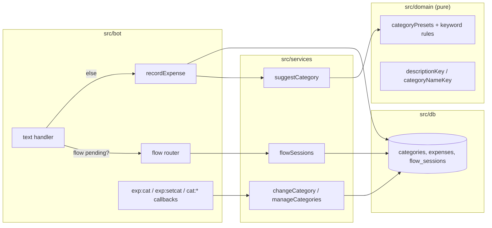
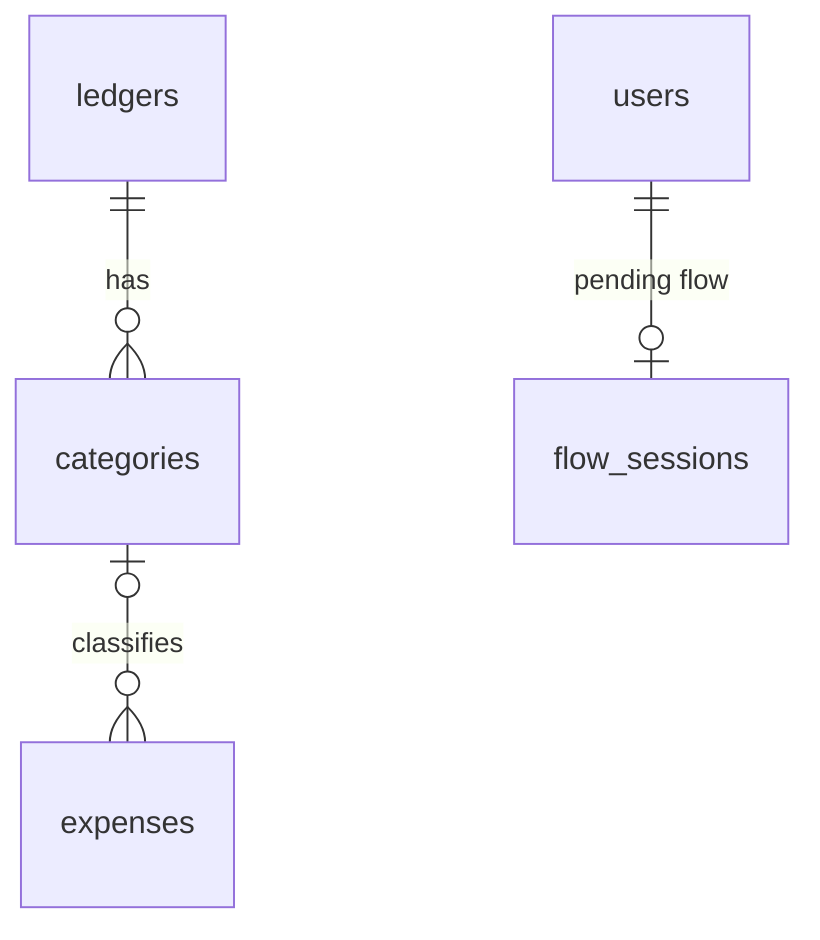

# 0003: Categories: preset per ledger, suggestion from history, change and manage

> **Status:** done (2026-09-30): built as planned after one fix round; the `/help` copy for categories (round 2 m1) is left open. v0.3.0
> **Created:** 2026-09-29
> **Amended:** 2026-09-30: `src/bot/handlers/card.ts` (Plan 0007's card builder) added to Phases 1 and 2, `src/bot/bot.ts` to Phase 2 (conductor readiness park)
> **Depends on:** [Plan 0007](0007-navigation-shell.md) (menu, HTML seam, callback dispatcher)
> **Related ADRs:** [ADR-0002](../../adrs/0002-ledgers-and-identity.md), [ADR-0007](../../adrs/0007-categories-belong-to-ledgers.md), [ADR-0008](../../adrs/0008-category-suggestion-from-history.md), [ADR-0009](../../adrs/0009-persisted-flow-sessions.md), [ADR-0011](../../adrs/0011-navigation-model.md), [ADR-0012](../../adrs/0012-html-rendering-seam.md)

## TL;DR

Every new expense gets a category with no extra tap. `450 кофе` confirms as
`Записано в «Личные расходы»: 450.00 RSD — кофе · Кафе и рестораны` with [Категория] above
[Удалить]. The category comes from this ledger's history for the same description, then from
keyword rules, then «Другое» (ADR-0008). [Категория] opens a paged picker in the same card, and
the choice is remembered for next time. `/categories` is the first ADR-0011 **screen**: it lets
the user add, rename and hide categories through a persisted text-input flow (ADR-0009). This
plan builds the screen half of the ADR-0011 kit. Summaries by category are Plan 0004.

## Context & problem

Plan 0001 records amount, currency and description only. Every summary the user asked for ("how
much on food this month") needs categories, so they come before summaries. Categories must
be per ledger (ADR-0007), work from the first message, and adapt to the family's own words
without an external API (ADR-0008). Adding and renaming need the bot to accept a typed answer,
which is the first multi-step flow in the codebase, so the flow-session mechanism (ADR-0009) lands
here and Plan 0004's edit flow reuses it.

## Decision

Migration `0002_categories.sql` adds `categories` and `expenses.category_id` + `description_key`.
A ledger is seeded from `src/domain/categoryPresets.ts` when it's created, and at boot for
existing ledgers with no categories. `recordExpense` calls a pure `suggestCategory` in the domain,
fed by one repository lookup. The picker edits the confirmation message in place. Migration
`0003_flow_sessions.sql` adds `flow_sessions`, and the text handler routes by ADR-0009's rule
before expense parsing. Rejected options are in ADR-0007 (fixed list, empty start, per-user
categories), ADR-0008 (keyword only, always ask, LLM) and ADR-0009 (in-memory session, reply-only
matching).

## Architecture diagram



## Implementation phases

Each phase ships as its own commit. `dev` implements all phases in one session. The architect
reviews once at the end, in a fresh session.

### Phase 1: Every new expense lands in a category
- **Owner skill:** dev
- **What:** Migration `0002`, preset seeding, keyword suggestion with the «Другое» fallback, and
  the category name in the confirmation.
- **Files touched:** `src/db/migrations/0002_categories.sql`, `src/db/categories.ts`,
  `src/db/categories.test.ts`, `src/db/expenses.ts`, `src/domain/categoryPresets.ts`,
  `src/domain/categories.ts`, `src/domain/categories.test.ts`, `src/services/provisionUser.ts`,
  `src/services/seedCategories.ts`, `src/services/recordExpense.ts`, `src/services/*.test.ts`,
  `src/bot/handlers/card.ts`, `src/bot/messages.ts`, `src/bot/bot.test.ts`, `src/index.ts`.
- **Done when:**
  - A new user's personal ledger has one category per `categoryPresets.ts` entry, each with its
    `preset_key`. Running the boot seeding twice over a Plan 0001 database (ledger with no
    categories) leaves the same count, and so does a second `/start`.
  - `descriptionKey`: `'  Кофе   Латте '` → `'кофе латте'`, and `'Ёлка'` → `'елка'`.
    `categoryNameKey` uses the same folding.
  - Keyword suggestion on a freshly seeded ledger: `450 кофе` → `cafe`. `450 Кофейня` → `cafe`
    (prefix match). `300 такси до дома` → `transport`. `999 что-то` → `other`. `450 EUR coffee`
    → `cafe` (the English keyword is also listed).
  - `450 кофе` stores `category_id` = the ledger's `cafe` category and
    `description_key = 'кофе'`. The confirmation text (HTML, ADR-0012) is exactly
    `Записано в «Личные расходы»: <b>450.00 RSD</b> — кофе · Кафе и рестораны`.
  - Plan 0001 rows keep `category_id IS NULL`. The migration doesn't touch existing
    `expenses` rows (a test counts NULLs before and after).
  - Archiving `cafe` (repository call) makes `450 кофе` fall through to `other`.

### Phase 2: Change the category, and learn from the change
- **Owner skill:** dev
- **What:** A [Категория] button on the confirmation, a paged picker that edits the card in
  place, the list pager (ADR-0011), and the ADR-0008 history lookup as the first suggestion step.
- **Files touched:** `src/bot/handlers/category.ts`, `src/bot/nav.ts`, `src/bot/nav.test.ts`,
  `src/bot/callbackData.ts`, `src/bot/handlers/card.ts`, `src/bot/bot.ts`,
  `src/bot/handlers/text.ts`, `src/bot/messages.ts`, `src/bot/bot.test.ts`,
  `src/services/changeCategory.ts`, `src/services/changeCategory.test.ts`,
  `src/services/recordExpense.ts`, `src/db/expenses.ts`, `src/db/expenses.test.ts`.
- **Done when:**
  - The confirmation keyboard is row 1 [Категория] `exp:cat:<uuid>` (44 bytes), row 2
    [Удалить] (Plan 0007). `recordedCard` in `card.ts` builds it, so the card after `450 кофе`,
    after a tap on an ambiguous reading, and after [Вернуть] all carry it. The picker lists the ledger's **active** categories two per row,
    8 per page, with each button `exp:setcat:<uuid>:<categoryId>`. The current category is
    marked `✓ `. Below it are the pager row `[◀] [n/N] [▶]` as `exp:catp:<uuid>:<page>`
    (47 bytes for a one-digit page), shown only when there's more than one page, and
    [« Назад] `exp:show:<uuid>` (45 bytes) alone on the last row. Every builder goes through
    `assertCallbackData`, and a test builds `exp:setcat` with a 16-digit category id and
    asserts it's at most 64 bytes.
  - `pagerRow` in `src/bot/nav.ts` is generic: with 30 categories the pages hold 8, 8, 8 and 6.
    Page 1 has no [◀], page 4 has no [▶], and [n/N] re-renders the same page. A page argument
    out of range (`exp:catp:<uuid>:9`) renders the last page.
  - Tapping Продукты sets `category_id` and edits the message back to the confirmation, now
    ending `· Продукты`. Tapping it again is a no-op answered with a toast, with no second write.
  - The tap is refused (toast, nothing written) when the tapper isn't the creator, the category
    belongs to another ledger, the category is archived, or the expense is undone.
  - Learning: `450 кофе` → Кафе и рестораны. Change it to Продукты. Then `300 Кофе` → Продукты.
    Then undo that `300 Кофе`, and `200 кофе` still → Продукты (the undone row is skipped and the
    corrected one matches). In a second ledger, `100 кофе` → Кафе и рестораны (history is per
    ledger, as a repository test with two ledgers shows).
  - History whose category is archived is skipped, and suggestion continues to keyword rules.

### Phase 3: Flow sessions, `/categories`, command menu
- **Owner skill:** dev
- **What:** ADR-0009's `flow_sessions` (screen anchor plus pending flow) and text routing, the
  ADR-0011 screen kit (`requireScreen`, `showScreen`, `backRow`, `cancelRow`, the `flow:cancel`
  handler), `/categories` as a screen with add, rename and hide (archive), and `/cancel`.
- **Files touched:** `src/db/migrations/0003_flow_sessions.sql`, `src/db/flowSessions.ts`,
  `src/db/flowSessions.test.ts`, `src/services/flowSessions.ts`,
  `src/services/manageCategories.ts`, `src/services/*.test.ts`, `src/domain/categories.ts`,
  `src/domain/categories.test.ts`, `src/bot/handlers/categories.ts`,
  `src/bot/handlers/cancel.ts`, `src/bot/handlers/text.ts`, `src/bot/screens.ts`,
  `src/bot/screens.test.ts`, `src/bot/flows.ts`, `src/bot/callbackData.ts`, `src/bot/messages.ts`, `src/bot/bot.ts`,
  `src/bot/bot.test.ts`, `src/index.ts`, `README.md` (commands), `CLAUDE.md` (only if the
  `src/` tree changes shape).
- **Done when:**
  - `/categories` sends a new message and makes it the screen anchor. It lists the active
    categories, with [Добавить] `cat:add` on row 1 and [Переименовать] `cat:ren` [Скрыть]
    `cat:arc` on row 2. Rename and hide open a paged picker (the Phase 2 pager) with buttons
    `cat:ren:<id>` / `cat:arc:<id>` and [« Назад] `cat:open`. «Другое» is absent from the hide
    picker. Hiding asks no confirmation: it is reversible by adding the name again.
  - Stale screens: after `/categories` is sent twice, [Добавить] on the **first** message toasts
    `staleScreen` and changes nothing. After a restart on the same DB file, [Добавить] on the
    current anchor still works. A card button (`exp:cat:<uuid>`) on an old confirmation still
    works, because cards are not screens (ADR-0011).
  - Add: [Добавить] edits the anchor into `Как назвать новую категорию? До 32 символов.` with
    [Отмена] `flow:cancel`, and no `force_reply`. `Дача` creates the category, and the anchor
    re-renders as the `/categories` screen, headed `Категория «Дача» добавлена.`. It appears in
    the next expense picker. Validation, each with a messages-module re-ask and the flow kept
    pending: an empty name, a name over 32 code points, an expense-shaped answer (`450 кофе` →
    `Похоже на трату. …` hint with [Отмена], ADR-0009), a name starting with a digit, and a name
    whose `categoryNameKey` equals an active category (`кафе и рестораны`).
  - `Дача & <сад>` is a valid name. It renders as `Дача &amp; &lt;сад&gt;` in message text
    (ADR-0012) and as the raw name on buttons.
  - Adding a name equal to an **archived** category's key restores it (`archived_at` → NULL) and
    creates no new row.
  - Rename changes `name` and `name_key` and keeps `id` and `preset_key`. Its prompt names the
    current name. After renaming Кафе и рестораны → Кофейни, `450 кофе` still suggests it (by
    `preset_key`).
  - Routing (ADR-0009), with an injected clock and a pending add flow started at `T`:
    - `Дача` at `T+9m59s` is the answer.
    - At `T+10m01s` the flow has expired: `Дача` gets `flowExpired` (`Время ответа истекло.
      Начните заново: /categories.`), creates no category and clears the flow. `450 кофе` at
      `T+10m01s` records an expense.
    - `Дача` at `T+25h` gets the ordinary help reply.
  - Redelivery: delivering the answering `Дача` message twice creates one category, and the second
    delivery sends no reply and records no expense.
  - `/cancel`, [Отмена], a menu tap (`📊 Сегодня`) and `/today` sent while a flow is pending all
    clear it, so a following `450 кофе` records an expense. [Отмена] and `/cancel` also edit the
    anchor back to the `/categories` screen.
  - Restart: a flow started, then a new bot instance on the same DB file, then the answer is
    accepted.
  - `setMyCommands` (Plan 0007) adds `/categories`.

## Data shapes



```sql
-- illustrative
CREATE TABLE categories (
  id INTEGER PRIMARY KEY,               -- short on purpose: fits callback_data (ADR-0007)
  ledger_id TEXT NOT NULL REFERENCES ledgers(id),
  name TEXT NOT NULL,                   -- as typed, 1..32 code points
  name_key TEXT NOT NULL,               -- categoryNameKey(name), domain-computed
  preset_key TEXT,                      -- 'cafe', 'other', ...; NULL for custom
  archived_at TEXT,
  created_at TEXT NOT NULL,
  UNIQUE (ledger_id, name_key)
);
CREATE UNIQUE INDEX one_preset_per_ledger ON categories(ledger_id, preset_key)
  WHERE preset_key IS NOT NULL;
ALTER TABLE expenses ADD COLUMN category_id INTEGER REFERENCES categories(id);
ALTER TABLE expenses ADD COLUMN description_key TEXT;
CREATE INDEX expenses_ledger_description ON expenses(ledger_id, description_key);

CREATE TABLE flow_sessions (
  user_id TEXT PRIMARY KEY REFERENCES users(id),
  anchor_chat_id INTEGER, anchor_message_id INTEGER,
  screen TEXT,                          -- 'categories', ... (ADR-0011); NULL when no anchor
  screen_ctx TEXT,                      -- JSON, e.g. {"ledgerId": "..."}
  kind TEXT,                            -- pending flow; NULL when nothing is pending
  payload TEXT,                         -- JSON, flow-specific
  expires_at TEXT,                      -- kept after expiry for the flowExpired reply
  last_input_key TEXT                   -- 'tg:<chat>:<msg>' of the last consumed answer
);
```

The preset list lives in `src/domain/categoryPresets.ts` (key, Russian name, keywords). The
initial content is the implementer's call within these keys: `groceries`, `cafe`, `transport`,
`housing`, `health`, `clothes`, `fun`, `telecom`, `gifts`, `other`. It must include the keywords
the Phase 1 done-whens use. Russian display names belong in the preset file, not
`messages.ts`, because they're seed data that becomes user-editable rows, not copy.

Callback data: `exp:cat:<uuid>`, `exp:catp:<uuid>:<page>`, `exp:setcat:<uuid>:<categoryId>`,
`exp:show:<uuid>`, `cat:open`, `cat:add`, `cat:ren`, `cat:ren:<id>`, `cat:arc`, `cat:arc:<id>`,
`cat:renp:<page>`, `cat:arcp:<page>`, `flow:cancel`.

## Risks & open questions

- **Privacy:** `description_key` duplicates the description in plaintext (ADR-0008 negative).
  The encryption plan owns it. It never appears in logs.
- **Idempotency:** a double-tapped `exp:setcat` is a no-op. The flow answer is deduped by
  `last_input_key`. Seeding is `INSERT OR IGNORE` on `(ledger_id, name_key)`.
- **Swallowed expense:** an expense typed while a flow is pending is re-asked, not consumed
  (ADR-0009's expense-shaped guard). The digit-first name rule catches `450` alone.
- **Telegram limits:** the picker has at most 30 active categories (a messages-module refusal
  on add beyond that), which pages to at most 4 pickers of 8. Category names are user text, so
  message text interpolates them only through `html` (ADR-0012). Button labels are not parsed
  and need no escaping.
- **Open:** in a shared ledger, may any member change an expense's category, or only the
  author? This plan says **author only**, consistent with Undo. The shared-ledger plan decides.

## What this plan does NOT do

- Category summaries, `/week`, `/month`, past dates and editing amount/description/date (Plan
  0004).
- Reordering, merging or deleting categories, and category icons/emoji.
- Recategorising Plan 0001's `NULL` rows in bulk. They show as «Без категории» in Plan 0004
  summaries and can be fixed one by one once Plan 0004's edit flow exists.
- Budgets per category (future).

## Implementation log

> Written by `dev`: one row per phase as its commit lands, then the close block. **The phases
> above are the contract. This section records what happened.** Observations, never conclusions:
> no pass list, no self-assessment. Deviations and unmet done-whens are **always** disclosed.
> Keep it shorter than `## Implementation phases`.

| phase | owner | state | commit |
|---|---|---|---|
| 1: Every new expense lands in a category | dev | done | ff7577d |
| 2: Change the category, and learn from the change | dev | done | 8d76574 |
| 3: Flow sessions, `/categories`, command menu | dev | done | 2805ed9 |

### Notes

- Phase 1 edited `src/db/connection.test.ts`, which is outside its `Files touched`: the test
  pinned the applied migrations to `['0001']`, and migration `0002` makes that list
  `['0001', '0002']`.
- Phase 2: the picker's message text is the confirmation line without the category, then
  `Выберите категорию:` on a second line. A change answers with the toast
  `Категория изменена`. The plan named neither.
- Phase 2: `src/bot/handlers/text.ts` needed no change.
- Phase 3 edited three files outside its `Files touched`:
  - `src/bot/render/html.ts` gained `editHtmlAt`. A typed answer and `/cancel` re-render the
    anchor from a message update, and the ADR-0012 lint gate bans `editMessageText` calls
    outside `render/`.
  - `src/db/categories.ts` gained `findCategory`, `findCategoryByNameKey`, `insertCategory`,
    `restoreCategory` and `renameCategory`. Add, rename and restore need SQL, and the plan
    listed no repository for them.
  - `src/db/connection.test.ts` again, for migration `0003`.
- Phase 3: `requireScreen(ctx, deps)` takes no screen name. With `categories` as the only
  screen, a name check is always true and the type-aware lint rejects it as an unnecessary
  condition. The anchor's `screen` field is returned for a future handler to switch on.
- Phase 3: a refused answer (empty, too long, expense-shaped, digit first, duplicate) re-asks
  by editing the anchor into the refusal line above the prompt, with [Отмена]. No new message
  is sent. The ADR-0009 rule "a prompt edits the anchor" was applied to re-asks too.
- Phase 3: `/cancel` with nothing pending replies `Сейчас нечего отменять.` A category added at
  the 30 limit is refused with a toast on [Добавить], and again at answer time.
- Phase 3: an empty answer is tested as a single space. Telegram doesn't deliver empty text.
- Phase 3: `CLAUDE.md` is unchanged, because the `src/` tree kept its shape.
- Fix round 1, finding 0 (major, history ignores corrections on older expenses): migration
  `0004_expense_category_set_at.sql`, and the history step orders by
  `COALESCE(category_set_at, created_at)`. ce14240

### Close triggers

- **What shipped:** feature
- **User-visible surface changed:** commands `/categories` and `/cancel` (both registered
  handlers; `setMyCommands` adds `/categories`); the confirmation ends `· <category>` and
  carries [Категория] above [Удалить]; the category picker on the card; the `/categories`
  screen with its add, rename and hide flows and their messages; `flowExpired` and
  `staleScreen`. Schema migrations `0002_categories.sql`, `0003_flow_sessions.sql` and
  `0004_expense_category_set_at.sql`. Boot seeds categories into ledgers that have none. No
  config or env keys.
- **Gate at the tip (7aa39e9):** `pnpm typecheck` exit 0; `pnpm lint` exit 0; `pnpm test` exit
  0, 23 files, 266 tests passed; `node scripts/check-doc-links.mjs` exit 0, 82 links resolve.
- **Outstanding `human` phases:** none

## Close review

The round 2 review, in full (headings demoted one level):

### Plan 0003 close review, round 2

Reviewed at `7aa39e92477e173bdacce79b76f0605d98b0419b` on `plan-0003-categories`.

**Verdict:** The round 1 major is fixed, and a test that fails on the old ordering now defends
it. Plan 0003 has no blockers and no majors. Three minors remain, and a close session can settle
them: the `/help` copy carried over from round 1, a stale implementation log, and a migration
number that the next queued plan also claims.

#### Gate (run by the reviewer at the tip)

| command | result |
|---|---|
| `pnpm typecheck` | exit 0 |
| `pnpm lint` | exit 0 |
| `pnpm test` | exit 0: 23 files, 266 tests passed |
| `node scripts/check-doc-links.mjs` | exit 0: 82 relative links resolve |

After the run `git status --short` is empty and `HEAD` is still the tip above.

#### Alignment

- Round 1 read the assertions of every test the plan names (see `0003-round-1.md`,
  "Alignment"). The fix commits touch only `src/db/expenses.test.ts`,
  `src/services/changeCategory.test.ts` and `src/db/connection.test.ts` among the tests. I
  re-read those three:
  - `src/services/changeCategory.test.ts:178-190` (new) covers the round 1 scenario exactly.
    `450 кофе` at minute 0 and `100 кофе` at minute 1 are both filed under Кафе и рестораны. The
    older one then changes to Продукты at minute 2, and `200 кофе` at minute 3 must be Продукты.
    Under the old `ORDER BY e.created_at DESC`, the minute-1 row would win and the test would
    fail. The assertion therefore defends ADR-0008's "the corrected expense becomes the most
    recent match".
  - `src/services/changeCategory.test.ts:158-176`: the plan's Phase 2 learning sequence
    (undo skipped, second ledger independent) is unchanged apart from the new `now` argument.
  - `src/db/expenses.test.ts:165-174`: `setExpenseCategory` stamps `category_set_at` with the
    time it was passed. A no-op repeat and a deleted row write nothing, and the assertion reads
    the column.
  - `src/db/connection.test.ts:36,45`: the migration list now includes `0004`.
- The fix itself (`ce14240`):
  - `src/db/migrations/0004_expense_category_set_at.sql` adds `category_set_at TEXT`.
    `insertExpenseOrGetExisting` writes it as `created_at` when a category is set
    (`src/db/expenses.ts:100`). `setExpenseCategory` writes the injected `now`
    (`src/db/expenses.ts:165-178`).
  - `findHistoryCategory` orders by `COALESCE(e.category_set_at, e.created_at) DESC, e.rowid DESC`
    (`src/db/expenses.ts:155`). Both columns hold `toISOString()` output, so they compare
    lexically in time order.
  - The clock is injected: `deps.now()` is read in the handler (`src/bot/handlers/category.ts:79`)
    and passed down, and there is no `new Date()` in the domain or the service.
  - The migration is a new file, not an edit to `0002`, as round 1 advised.
- No ADR is silently reversed. With this fix, ADR-0008's Decision matches the code.

#### Findings

##### blocker

None.

##### major

None.

##### minor

**m1. `/help` still doesn't mention categories, `/categories` or `/cancel` (carried from round 1).**

- **What:** The fix round didn't address round 1's m1. `messages.help` lists only recording,
  `📊 Сегодня` and `❓ Помощь`.
- **Where:** `src/bot/messages.ts:84-92`.
- **Why it matters:**
  - Mode 4 lens 4 requires the `/help` text to follow any command change the user can observe.
  - `/categories` has no menu button, so outside Telegram's `/` list, `/help` is the only way to
    find it from inside the chat.
- **Suggested fix (dev):** Add `html\`/categories — категории: добавить, переименовать, скрыть\``
  to the `joinHtml` list. Optionally add a line saying that [Категория] under a confirmation
  changes it. Then update the tests that pin the help text (`src/bot/bot.test.ts`, the `/help`
  reply assertion) to the new copy.

**m2. The implementation log contradicts the fixed code.**

- **What:**
  - The Phase 2 note still says a change doesn't move the corrected expense to the front, and
    that "There is no column recording when a category was set". After `ce14240`, both claims
    are false.
  - The close triggers list the schema migrations as `0002` and `0003` only. They leave out
    `0004_expense_category_set_at.sql`.
  - The "Gate at the tip" line reports `2805ed9` with 265 tests. At this tip the count is 266.
- **Where:** `docs/plans/0003-categories.md:272-276` (Phase 2 note) and `:310-313` (close
  triggers).
- **Why it matters:** The plan moves to `done/` as the record of what shipped. A reader of the
  log would conclude that ADR-0008's rule is unmet, and a future plan would miss migration 0004.
  Round 1 asked for the note to be deleted or reworded.
- **Suggested fix (dev):**
  - Delete the Phase 2 note at lines 272-276. The fix-round note at line 299 already records
    what changed.
  - Change the close triggers to "Schema migrations `0002_categories.sql`,
    `0003_flow_sessions.sql` and `0004_expense_category_set_at.sql`".
  - Refresh the gate line to the new tip and its counts.

**m3. Migration number `0004` is now taken, and the queued Plan 0004 also plans a `0004`.**

- **What:** Plan 0004 Phase 3 names `src/db/migrations/0004_expense_updated_at.sql`, and its
  data-shapes block is labelled `0004_expense_updated_at.sql`. `runMigrations` keys a migration
  by the first four characters of its filename (`src/db/migrate.ts:28,34`), and
  `schema_migrations.version` is the primary key.
- **Where:** `docs/plans/0004-dates-edit-summaries.md:157` and `:195`. The collision comes from
  `src/db/migrations/0004_expense_category_set_at.sql`.
- **Why it matters:** If Plan 0004 is implemented as written:
  - On a database that has already applied this plan's `0004`, its migration is skipped
    silently as already applied, so `updated_at` never exists.
  - On a fresh database, the second `0004` insert violates the primary key and boot fails.
  - Plan 0004 is approved and follows this plan in the chain.
- **Suggested fix (architect, at close):** Amend Plan 0004 to name
  `0005_expense_updated_at.sql` in both places, with an `Amended:` line citing this review. The
  code of Plan 0003 needs no change.

##### nit

None.

#### Bookkeeping owed at close

- Apply m3's amendment to Plan 0004. If a dev fix round runs, it resolves m1 and m2 first.
- Accept ADR-0008 and ADR-0009 (`proposed` → `accepted`) and refresh `docs/adrs/README.md`. The
  code now implements ADR-0008 as written, so no `## Outcome` is needed for the history rule.
- Flip Plan 0003 to `done` and `git mv` it to `docs/plans/done/`. Repair the inbound links from
  ADR-0007, ADR-0008, ADR-0009, ADR-0011 and the plans index, and the plan's outbound `../adrs/`
  and `done/0007-…` links, which become `../../adrs/` and `0007-…`. Re-run
  `node scripts/check-doc-links.mjs`.
- Refresh `docs/plans/README.md` (move the row to recently closed, bump the next free number).
- Version: a **minor** bump, because this is a feature plan. Update `package.json` and add a
  `CHANGELOG.md` entry listing `/categories`, `/cancel`, the category on the confirmation, the
  picker, and learning from a correction.
- `CLAUDE.md` "Where things live" still matches the tree. `.env.example` needs no change,
  because the plan adds no config keys.

### Close session

- Round 2 m1 (`/help` copy, `src/bot/messages.ts`) is code and stays open for a later fix.
- Round 2 m2 (stale implementation log) fixed in 8132736.
- Round 2 m3 (Plan 0004 migration number) fixed in 486e5b5: Plan 0004 now names
  `0005_expense_updated_at.sql`.
- ADR-0007, ADR-0008 and ADR-0009 accepted. The plans index's next free number stays `0008`,
  because closing a plan allocates no number.

### Earlier rounds

- Round 1 finding 0 (major: the history step ignored a correction on an older expense) resolved
  in ce14240.

## Followups

- `/help` names categories, `/categories` and `/cancel` (round 2 m1).
