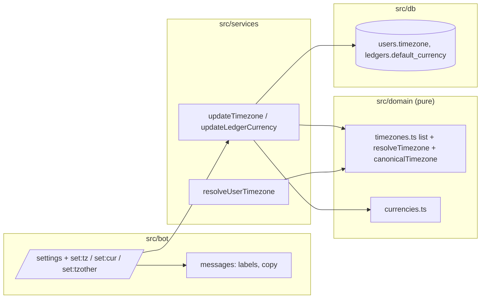

# 0005: /settings: timezone from a city list, and the ledger's default currency

> **Status:** done (2026-09-30): built as planned, one minor open (expired `setTimezone` prompt points to `/categories`), v0.4.0
> **Created:** 2026-09-29
> **Depends on:** [Plan 0007](0007-navigation-shell.md), [Plan 0003](0003-categories.md) (screen kit, flow sessions, list pager, `/categories` screen)
> **Related ADRs:** [ADR-0002](../../adrs/0002-ledgers-and-identity.md), [ADR-0009](../../adrs/0009-persisted-flow-sessions.md), [ADR-0011](../../adrs/0011-navigation-model.md), [ADR-0012](../../adrs/0012-html-rendering-seam.md)

## TL;DR

`/settings` and the `⚙️ Настройки` menu button open the settings hub, an ADR-0011 screen. It
shows the user's timezone and the active ledger's default currency, with buttons to change each
in place, and links to Plan 0003's categories screen. The timezone comes from a curated Russian-labelled city list (Белград,
Подгорица, Москва, Алматы, …) or a typed IANA name via [Другой…]. The currency comes from the
codes in `src/domain/currencies.ts`. `DEFAULT_TIMEZONE` and `DEFAULT_CURRENCY` stay only as
defaults for new users. The first visible change: a family member in Moscow taps Москва, and
their 00:30 coffee lands on the right day.

## Context & problem

Plan 0001 gives every user the env timezone and every personal ledger the env currency, and
there's no way to change either. The family spans RS, ME, RU and KZ, so "today", "this week" and
the currency `450 кофе` means differ by person. Telegram exposes no timezone, and `language_code`
is far too coarse (the sibling's ADR 015 lesson).

## Decision

A curated list in `src/domain/timezones.ts` of `{ slug, iana }`, with Russian labels in
`messages.ts`, and callbacks `set:tz:<slug>`. **Slugs, not list indexes**, so reordering or
removing an entry never remaps a stale button. [Другой…] starts an ADR-0009 flow that accepts
any IANA name Intl recognises and stores the canonical form. A pure `resolveTimezone(stored,
fallback)` guards every read: a corrupt stored zone falls back to `DEFAULT_TIMEZONE` and logs a
`warn`. Changing a timezone never rewrites stored `occurred_on` (ADR-0002). Currency is a
**ledger** property (ADR-0002), changeable by the ledger's owner, and affects only expenses
recorded afterwards.

We rejected a "share location" button: it needs a coordinates-to-zone dataset (a dependency),
and a shared location is more private data than the zone itself. We rejected free-text-only
IANA entry as hostile to non-technical family members. We rejected a UTC-offset picker because
offsets change with DST and politics (Kazakhstan moved to UTC+5 in 2024), and IANA names don't.

## Architecture diagram



## Implementation phases

Each phase ships as its own commit. `dev` implements all phases in one session. The architect
reviews once at the end, in a fresh session.

### Phase 1: /settings and the timezone picker
- **Owner skill:** dev
- **What:** `/settings` as a screen and the `⚙️ Настройки` menu button, the city list, the
  [Другой…] flow, `resolveTimezone` on every read of `users.timezone`, a welcome that mentions
  settings, and `/settings` in the command menu.
- **Files touched:** `src/domain/timezones.ts`, `src/domain/timezones.test.ts`,
  `src/db/users.ts`, `src/db/users.test.ts`, `src/services/settings.ts`,
  `src/services/settings.test.ts`, `src/services/recordExpense.ts`,
  `src/services/todaySummary.ts`, `src/services/periodSummary.ts`,
  `src/bot/handlers/settings.ts`, `src/bot/handlers/categories.ts`, `src/bot/keyboards.ts`,
  `src/bot/flows.ts`, `src/bot/callbackData.ts`,
  `src/bot/messages.ts`, `src/bot/bot.ts`, `src/bot/bot.test.ts`, `src/index.ts`,
  `README.md` (commands; env keys described as new-user defaults), `.env.example` (comments).
- **Done when:**
  - `/settings` and the `⚙️ Настройки` label each open the hub as a new screen anchor. For a
    default user it shows `Часовой пояс: Белград (Europe/Belgrade)` and `Валюта по умолчанию
    для новых трат в «Личные расходы»: RSD`. The keyboard is row 1 [Часовой пояс] `set:tz`
    [Валюта] `set:cur`, row 2 [Категории] `set:cat`. The menu's second row becomes
    `⚙️ Настройки` / `❓ Помощь`.
  - [Категории] edits the anchor into Plan 0003's categories screen with [« Назад] `set:open`
    added. `/categories` sent directly still opens it with no back row.
  - [Часовой пояс] edits the message to the city list, 2 per row with the current zone marked
    `✓ `, paged by Plan 0003's `pagerRow` if it has more than 8 entries. Below it are
    [Другой…] `set:tzother` and [« Назад] `set:open`, each alone on its row. Each city button is
    `set:tz:<slug>` with a slug of at most 20 ASCII bytes, and a test asserts every list entry's
    slug fits and its `iana` is valid in `Intl`. The list includes at least `belgrade`,
    `podgorica`, `moscow` and `almaty`.
  - Tapping Москва stores `Europe/Moscow` and re-renders the settings. Then `450 кофе` in a
    message dated `2026-09-29T21:30:00Z` (00:30 on the 30th in Moscow, 23:30 on the 29th in
    Belgrade) stores `occurred_on = 2026-09-30`, and `/today` at that instant is headed
    `30 сентября`. An expense recorded **before** the switch keeps its `occurred_on`.
  - tzdata guard: `localDateOf(2026-09-29T18:30:00Z, 'Asia/Almaty')` = `2026-09-29` (UTC+5 →
    23:30). Pre-2024 tzdata (UTC+6) would give the 30th. This runs in CI on Node 24.
  - [Другой…] edits the anchor into `Сейчас: Белград (Europe/Belgrade). Отправьте название
    часового пояса, например Europe/Istanbul.` with [Отмена], which restores the hub.
    `asia/tbilisi` stores `Asia/Tbilisi` (canonical). `Mars/Base` and
    `+03:00` re-ask and keep the flow pending. A redelivered answer applies once (ADR-0009).
  - A corrupt stored value (`users.timezone = 'Mars/Base'`, written directly) makes `/today` use
    `DEFAULT_TIMEZONE` and log one `warn` with the user id and no other user data. `/settings`
    shows the fallback zone.
  - Tapping the already-selected city writes nothing.
  - The welcome for a new user names the current timezone and currency and points to
    `/settings`. `setMyCommands` includes `/settings`.

### Phase 2: The ledger's default currency
- **Owner skill:** dev
- **What:** [Валюта] opens a keyboard of the `currencies.ts` codes. The ledger owner's tap sets
  `ledgers.default_currency` for the **active** ledger.
- **Files touched:** `src/db/ledgers.ts`, `src/db/ledgers.test.ts`, `src/services/settings.ts`,
  `src/services/settings.test.ts`, `src/bot/handlers/settings.ts`, `src/bot/callbackData.ts`,
  `src/bot/messages.ts`, `src/bot/bot.test.ts`.
- **Done when:**
  - The keyboard has one button per `currencies.ts` code, four per row, the current one marked
    `✓ `, each `set:cur:<CODE>` (11 bytes), plus [« Назад] `set:open` alone below. A code not in the table (`set:cur:XYZ`) is answered silently
    and writes nothing.
  - With RSD rows already recorded, tapping EUR sets the default. Then `450 кофе` → 45000 EUR,
    the earlier RSD rows are unchanged, and `/today` lists both currencies.
  - After switching to JPY (exponent 0), `450 кофе` stores `amount_minor = 450` and renders
    `450 JPY`. `12,5 кофе` gets the invalid-amount reply and records nothing (ADR-0004,
    `parseAmount('12.5', 'JPY')` is `invalid`).
  - A tap from a `member` (not `owner`) of the active ledger is refused with a toast. The row is
    inserted directly in the test, since shared ledgers don't exist yet.
  - The settings message names the ledger the currency belongs to («Личные расходы»).

## Data shapes

No migration. `users.timezone` and `ledgers.default_currency` exist since `0001_init.sql`.

```ts
// illustrative
export const TIMEZONES = [
  { slug: 'belgrade', iana: 'Europe/Belgrade' },
  { slug: 'almaty', iana: 'Asia/Almaty' },
  // ...
] as const;
export function resolveTimezone(stored: string, fallback: string): { tz: string; fellBack: boolean };
```

Callback data: `set:open`, `set:tz`, `set:tz:<slug>`, `set:tzp:<page>`, `set:tzother`,
`set:cur`, `set:cur:<CODE>`, `set:cat`. The ADR-0009 flow kind is `setTimezone`.

## Risks & open questions

- **Time:** a timezone change silently moves "today" for the user. Past rows keep their date
  (ADR-0002), so a user who switches mid-day can see an expense under "yesterday". That's accepted
  and matches what they meant when they recorded it.
- **Time:** `Intl` validity depends on the runtime's ICU tzdata. The Almaty test catches stale
  data in CI. The Docker image uses the same Node 24 line (Plan 0002).
- **Money:** changing the default currency never converts anything. Old rows keep their currency
  (ADR-0003). The copy should say "for new expenses".
- **Open:** a per-user **home currency** for converted totals is the FX plan's field, not this
  plan's. The ledger default currency is only the parse default.
- **Open:** output number format (`1 200.00` everywhere) stays as Plan 0001 set it. Localised
  formatting isn't in scope.

## What this plan does NOT do

- Home currency and FX conversion (the FX plan, ADR-0003).
- Ledger rename, shared-ledger switching or `/ledger` (the shared-ledger plan).
- Adding currencies beyond `currencies.ts`. Adding one is a one-line code change with a test.
- Language selection. The UI is Russian only (`CLAUDE.md`).
- Reminders and notification times, which would reuse the timezone.

## Implementation log

> Written by `dev`: one row per phase as its commit lands, then the close block. **The phases
> above are the contract. This section records what happened.** Observations, never conclusions:
> no pass list, no self-assessment. Deviations and unmet done-whens are **always** disclosed.
> Keep it shorter than `## Implementation phases`.

| phase | owner | state | commit |
|---|---|---|---|
| 1: /settings and the timezone picker | dev | done | 8cf41ba |
| 2: The ledger's default currency | dev | done | 9ee7e57 |

### Notes

- Phase 1: outside `Files touched`: `src/services/flowSessions.ts` (a `settings` screen, a
  `fromSettings` flag on the categories screen, the `setTimezone` flow kind and a `CategoryFlow`
  type), `src/services/manageCategories.ts` and its test (`answerCategoryFlow` takes
  `CategoryFlow`), `src/bot/handlers/start.ts` (the welcome), `src/bot/handlers/menu.ts` (the
  `⚙️ Настройки` route) and `src/bot/middleware/allowlist.test.ts` (`messages.welcome` is now a
  function).
- Phase 1: `RecordDeps` gained `defaultTimezone`, the fallback `resolveUserTimezone` needs.
  `recordExpense.test.ts`, `todaySummary.test.ts` and `changeCategory.test.ts` (not in
  `Files touched`) each add it to their deps.
- Phase 1: `src/services/periodSummary.ts` does not exist on this branch and was not created.
  `src/index.ts` needed no change.
- Phase 1: `resolveUserTimezone` also runs for `/start`, `/settings` and the picker, so each of
  those logs the fallback `warn` too.
- Phase 1: copy not named in the plan: the hub's first line `<b>Настройки</b>`, the picker text
  `Выберите часовой пояс. Сейчас: …`, the toasts `Часовой пояс изменён` and
  `Этот часовой пояс уже выбран`, the refusals `Такого часового пояса нет.` and an expense-shaped
  hint, the welcome's second paragraph
  `Часовой пояс: Белград (Europe/Belgrade). Валюта: RSD. Изменить: /settings.`, and the `/settings`
  command description `Часовой пояс и валюта`. A zone off the city list shows as its bare IANA
  name.
- Phase 1: "writes nothing" for the already-selected city is asserted with SQLite's
  `total_changes()`. An unknown slug (`set:tz:mars`) is answered silently.
- Phase 1: [Валюта] `set:cur` has no handler until Phase 2; the dispatcher answers it silently.
- Phase 2: `src/domain/currencies.ts` (not in `Files touched`) exports `CURRENCY_CODES`, the
  table's codes in table order; the picker is built from it.
- Phase 2: the owner check reads `ledger_members.role` (`findMemberRole`), not
  `ledgers.owner_user_id`.
- Phase 2: copy not named in the plan: the picker text `Валюта по умолчанию для новых трат в
  «…». Сейчас: RSD. Записанные траты не меняются.`, the toasts `Валюта изменена`,
  `Эта валюта уже выбрана` and `Валюту «…» может изменить только владелец`.
- Followup, not acted on: `messages.flowExpired` reads `Начните заново: /categories.` for an
  expired `setTimezone` flow too. `src/bot/handlers/text.ts` sends it without knowing the flow.

### Close triggers

- Gate on the tip after 9ee7e57: `pnpm typecheck` exit 0; `pnpm lint` exit 0; `pnpm test`
  exit 0, 29 test files, 327 tests passed; `pnpm build` exit 0.
- `node scripts/check-doc-links.mjs`: exit 0, 89 relative links resolve.
- The Almaty tzdata guard (`src/domain/timezones.test.ts`) passed locally under the gate; CI was
  not run from this session.
- Files changed outside the phases' `Files touched`: `src/services/flowSessions.ts`,
  `src/services/manageCategories.ts`, `src/services/manageCategories.test.ts`,
  `src/services/recordExpense.test.ts`, `src/services/todaySummary.test.ts`,
  `src/services/changeCategory.test.ts`, `src/bot/handlers/start.ts`, `src/bot/handlers/menu.ts`,
  `src/bot/middleware/allowlist.test.ts` (Phase 1); `src/domain/currencies.ts` (Phase 2).
- Listed but absent: `src/services/periodSummary.ts`. Listed and unchanged: `src/index.ts`.
- New modules: `src/domain/timezones.ts`, `src/services/settings.ts`,
  `src/bot/handlers/settings.ts`, with tests, and `src/db/users.test.ts`,
  `src/db/ledgers.test.ts`.
- No migration. No dependency added.

## Close review

Round 1 (conductor review, tip `5238097`), in full:

**Verdict:** Plan 0005 is implemented as planned: both phases land, every done-when has a test
that asserts the claim, and the gate is green. The one finding is a minor copy defect in the new
flow kind's expiry path, so the plan can close.

### Gate (run in the review session, lane root)

- `pnpm typecheck`: exit 0.
- `pnpm lint`: exit 0.
- `pnpm test`: exit 0, 29 files, 327 tests passed.
- `node scripts/check-doc-links.mjs`: exit 0, 89 relative links resolve.

### Lens 1: alignment

- Phase 1 is `8cf41ba` and Phase 2 is `9ee7e57`. Each has one `**Owner skill:** dev` tag. No phase was added or skipped.
- I opened the assertions for each done-when:
  - Hub on `/settings` and on `⚙️ Настройки`: `src/bot/bot.test.ts` "opens the hub as a new screen". It asserts the exact text, the keyboard (`set:tz`, `set:cur` / `set:cat`), and that the older message goes stale. The menu layout is asserted in `menuKeyboard`.
  - City list: "pages the city list...". It asserts both pages exactly: 2 per row, `✓ Белград`, `pagerRow`, [Другой…] and [« Назад] each on its own row, and `set:open` back to the hub. `src/domain/timezones.test.ts` pins slugs at 20 bytes or less, checks that each `iana` is valid in `Intl`, and checks the four required cities.
  - Moscow day shift: "moves the local day with the zone". It asserts `Europe/Moscow` is stored, `кофе` gets `2026-09-30`, the earlier `чай` keeps `2026-09-29`, and `/today` is headed `30 сентября`.
  - tzdata guard: `localDateOf(2026-09-29T18:30:00Z, 'Asia/Almaty') === '2026-09-29'`.
  - [Другой…]: the prompt text and [Отмена] restore the hub. `asia/tbilisi` is stored as `Asia/Tbilisi`. `Mars/Base` and `+03:00` re-ask, and the test proves the flow is still pending by then accepting `europe/istanbul`. A redelivered answer after a later change leaves `Europe/Moscow` in place and makes no API calls.
  - Corrupt stored zone: `/today` uses Belgrade's date. There is exactly one level-40 log line, and its keys are exactly `hostname, level, msg, pid, time, userId`. `/settings` shows the fallback zone.
  - Already-selected city: `total_changes()` is unchanged.
  - Welcome and `setMyCommands`: the exact `WELCOME` string, and a `settings` entry in the command list.
  - [Категории]: the back row appears, survives a picker round trip, and `/categories` sent directly has no back row.
  - Currency keyboard: every `CURRENCY_CODES` entry, four per row, `✓ RSD`, 11 bytes each, back row. `set:cur:XYZ` is answered silently and `total_changes()` is unchanged.
  - EUR: the new row is `45000 EUR`, the RSD rows are deep-equal to their snapshot, and `/today` lists both currencies.
  - JPY: `amount_minor = 450`, `450 JPY` is rendered, and `12,5 кофе` gets `invalidAmount` and records nothing.
  - Member refusal: toast text checked, `total_changes()` unchanged, the ledger stays `RSD`.
  - The ledger name «Личные расходы» appears in the hub text.
- Deviations are disclosed in the log:
  - Files outside `Files touched`.
  - `periodSummary.ts` is absent (Plan 0004 has not landed).
  - The owner check reads `ledger_members.role`. This is consistent with Plan 0005's "member (not owner)" wording.
- No ADR is reversed. Timezone changes never rewrite `occurred_on` (ADR-0002), and a currency change converts nothing (ADR-0003).
- The log is shorter than the phases section.

### Lens 2: layering

grammY is imported only under `src/bot/`. `src/domain/timezones.ts` is pure. Each SQL statement sits in `src/db/users.ts` or `src/db/ledgers.ts`. Copy lives in `src/bot/messages.ts`, and the handlers only select messages from it.

### Lens 3: correctness

- Every read of `users.timezone` goes through `resolveUserTimezone`. `git grep "\.timezone\b" -- src` finds only `src/services/settings.ts:29` as a reader.
- Callback data is at most 28 bytes (`set:tz:` plus a slug of 20 bytes or less).
- Double taps are idempotent: `unchanged` results write nothing. The typed-zone answer commits its write and `completeFlow` in one transaction, keyed by `inputKey`.
- Logs carry ids only, never zones, amounts or text.

### Findings

- **blocker:** none.
- **major:** none.
- **minor 1 (open): an expired `setTimezone` prompt tells the user to restart from `/categories`.**
  - **Where:** `src/bot/messages.ts:209` (`flowExpired`: `Время ответа истекло. Начните заново: /categories.`), sent from `src/bot/handlers/text.ts:74`.
  - **Why it matters:** Plan 0005 adds a second flow kind. A user who taps [Другой…], waits more than 10 minutes and then types `Europe/Istanbul` is sent to the wrong screen. The dev log discloses this as a followup it did not act on. It is still a user-visible defect that this plan introduced.
  - **Suggested fix:** have `routeText` return the expired flow, or its kind, instead of a boolean `expiredFlow`; make `messages.flowExpired` take the command to restart from (`/settings` for `setTimezone`, `/categories` for the category flows); add a bot test next to "answers Дача at T+10m01s with flowExpired" for a late `Europe/Istanbul` after [Другой…].
- **nit:** none.

### Bookkeeping owed (close ceremony)

- Flip `Status:` to `done` with the date and verdict, `git mv` the plan to `docs/plans/done/`, repair the links, and run `node scripts/check-doc-links.mjs`.
- No ADR is paired with this plan, so there is nothing to accept.
- Refresh `docs/plans/README.md`: move the row to recently closed.
- Bump the version to a minor release, since this is a feature plan: `package.json` goes from `0.3.0` to `0.4.0`, and `CHANGELOG.md` gets an entry for `/settings` (timezone city list, [Другой…], ledger default currency) and the two-row menu.
- Record the minor finding under the plan's `## Followups` if the close does not fix it first.
- **Plan 0004 heads-up (queued next):** Plan 0004 creates `src/services/periodSummary.ts` and computes "today − 1" in the user's timezone. Since Plan 0005, every read of `users.timezone` must go through `resolveUserTimezone(deps, user)`, and the service deps need `logger` and `defaultTimezone`. Plan 0004 does not say this. Its implementer or reviewer should check it.

### Close notes

- Earlier rounds: none. This was the only review round, so no finding was resolved by a fix round.
- The review's minor is a code change, not copy the close may repair. It stays open under `## Followups`.
- `messages.versionAnnouncements` does not exist on this branch or on `main` at close (Plan 0008
  has not landed), so v0.4.0 has no announcement body. Plan 0008's close owes it one.

## Followups

- An expired `setTimezone` flow answers with `messages.flowExpired`, which points to
  `/categories`. Make the restart command depend on the flow kind (close review minor 1).
- Plan 0004 must read `users.timezone` through `resolveUserTimezone(deps, user)` in
  `src/services/periodSummary.ts`, with `logger` and `defaultTimezone` in its deps.
