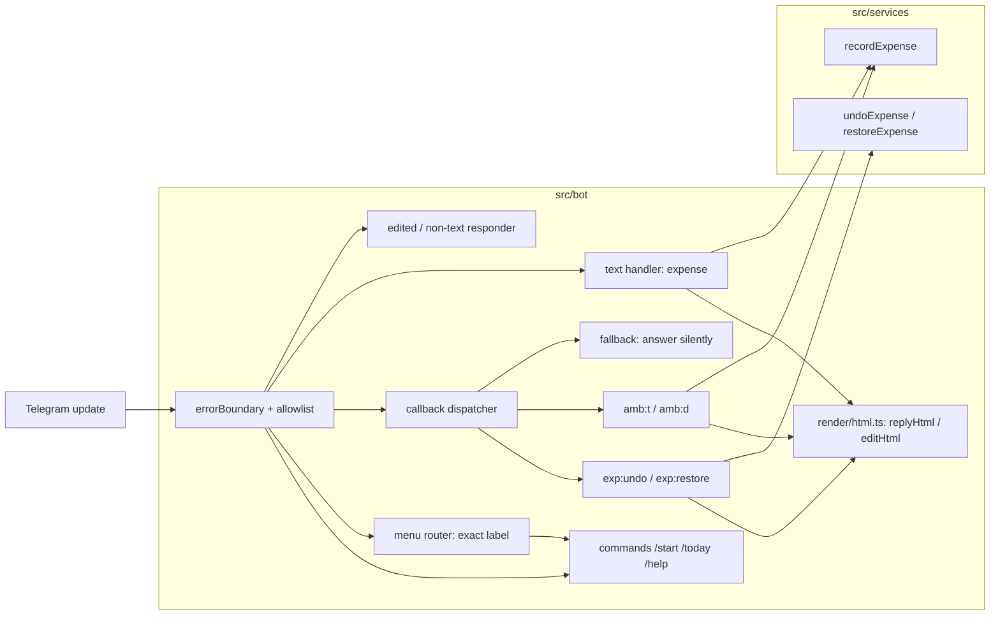

# 0007: Navigation shell: menu, HTML seam, callback dispatcher, and the shipped-UX fixes

> **Status:** done (closed 2026-09-30). Verdict: built as planned; round 1's README and layering fixes (b2d4484, 153b225) are verified, and the dispatcher's as-built fallback is recorded in ADR-0011's Outcome. Shipped as v0.2.0.
> **Created:** 2026-09-29
> **Amended:** 2026-09-30: Phase 4's `1.200 JPY` done-when asks, like `1.234` (conductor readiness park)
> **Related ADRs:** [ADR-0011](../../adrs/0011-navigation-model.md), [ADR-0012](../../adrs/0012-html-rendering-seam.md), [ADR-0004](../../adrs/0004-amount-parsing-rule.md)

## TL;DR

The bot gets a persistent menu (`[📊 Сегодня] [❓ Помощь]`), sends every message as escaped HTML,
routes every button through one dispatcher, and fixes what the 2026-09-29 ux-telegram audit
found in the shipped surfaces. The first visible change: `/start` shows the menu bar, and tapping
📊 Сегодня answers like `/today`. The confirmation's button becomes [Удалить], and a deleted
expense can be brought back with [Вернуть]. An ambiguous amount (`1.200 обед`) is answered with
one button per reading instead of "type it again". This plan lands **before** Plan 0003, which
builds on its kit.

## Context & problem

Plans 0003, 0004 and 0005 add pickers, hubs, pagers and text prompts on top of plumbing with
three defects (ux-telegram audit, 2026-09-29, verified against the tree):

- `registerUndo` ends with a catch-all `bot.on('callback_query:data')`
  (`src/bot/handlers/undo.ts:39`). Every callback handler registered after it, which is every
  handler those plans add, is swallowed. Its button spins and does nothing.
- The error boundary answers the callback again after a handler already answered it
  (`src/bot/bot.ts:64`). That second call throws, so the apology is never sent.
- Nothing treats "message is not modified" as success, although Plan 0004 counts on it.

The shipped UX also has holes. A deleted expense can't be restored. «Отменить» (delete) will sit
next to the flows' «Отмена» (abort). An ambiguous amount makes the user retype the line, and a
single-reading question («вы имели в виду 1 234.00 RSD?») can't be answered at all. Editing a
sent message, sending a photo, or typing `/help` gets silence or an accidental reply. There is no
menu, and the user asked for the sibling bot's navigation patterns (ADR-0011) and its HTML
formatting (ADR-0012).

## Decision

Build the parts of ADR-0011 and ADR-0012 that have a consumer today: the menu, the HTML seam,
the callback dispatcher, and card callbacks. The screen-anchor half of ADR-0011 (`requireScreen`,
back and cancel rows) lands with its first consumer, Plan 0003 Phase 3, on ADR-0009's session
row. The list pager lands in Plan 0003 Phase 2 and the period pager in Plan 0004 Phase 2. Code
with no screen to drive it would be untested speculation.

The ambiguous-amount picker is **stateless**. The question is sent as a reply to the user's
message. A tap on `amb:t` or `amb:d` re-parses `callback_query.message.reply_to_message.text` and
records the chosen reading under the **original message's** source key. Double taps, taps on
both readings, and redeliveries therefore record once, by the Plan 0001 rule. We rejected
holding the text in a session row, which would add a flow kind that doesn't wait for text and a
second place for the pending line. We rejected putting the amount in `callback_data`, because
the description can't fit.

## Architecture diagram



## Implementation phases

Each phase ships as its own commit. `dev` implements all phases in one session. The architect
reviews once at the end, in a fresh session. The user is in `Europe/Belgrade`, and the ledger
default is RSD.

### Phase 1: Menu bar, /help, and no silent input
- **Owner skill:** dev
- **What:** The persistent menu, exact-match menu routing, `/help`, `setMyCommands` at boot,
  and replies to edited messages, non-text messages and unknown commands. Also the new
  generic-error copy.
- **Files touched:** `src/bot/keyboards.ts`, `src/bot/handlers/menu.ts`,
  `src/bot/handlers/help.ts`, `src/bot/handlers/other.ts`, `src/bot/handlers/start.ts`,
  `src/bot/handlers/today.ts`, `src/bot/bot.ts`, `src/bot/messages.ts`, `src/bot/bot.test.ts`,
  `src/index.ts`, `README.md` (the menu and `/help`).
- **Done when:**
  - The `/start` and `/help` replies carry a reply keyboard with `is_persistent: true`,
    `resize_keyboard: true` and one row, `📊 Сегодня` / `❓ Помощь`, with labels from
    `messages.menu`.
  - The text `📊 Сегодня` produces a reply identical to `/today`'s and records no expense.
    `❓ Помощь` equals `/help`. `Сегодня` (no emoji) and `📊 Сегодня!` are not menu taps. They
    reach the expense parser and get the help reply, which proves the match is exact.
  - A test runs every `messages.menu` label through `parseExpenseText` with each
    `currencies.ts` default and asserts none parses as `recorded` or `ambiguous`.
  - `/help` replies with the help text, which names the menu buttons. `/foo` gets the same help
    reply and records nothing.
  - A photo, sticker or voice message gets the help reply and writes nothing.
  - An `edited_message` whose source key belongs to a recorded or deleted expense gets
    `messages.editedMessageHint` (`Изменение сообщения не меняет запись. Удалите трату кнопкой
    под подтверждением и отправьте её заново.`). An edit of any other message gets no reply.
    Neither writes anything.
  - `genericError` is `Что-то пошло не так. Проверьте /today и отправьте ещё раз, если трата не
    записалась.`
  - At boot, `setMyCommands` registers `/today` and `/help`, with descriptions from
    `messages.ts`. If the call fails, one `warn` is logged and boot continues.

### Phase 2: HTML seam (ADR-0012)
- **Owner skill:** dev
- **What:** `render/html.ts` (`Html`, `html`, `joinHtml`, `replyHtml`, `editHtml`). Every
  message text becomes `Html`, every send and edit moves to the helpers, and a lint gate
  enforces it. Amounts in the confirmation and the `/today` header are bold.
- **Files touched:** `src/bot/render/html.ts`, `src/bot/render/html.test.ts`,
  `src/bot/messages.ts`, `src/bot/handlers/*.ts`, `src/bot/bot.ts`, `src/bot/testHarness.ts`,
  `src/bot/bot.test.ts`, `eslint.config.mjs`, `src/lint.test.ts`.
- **Done when:**
  - `` html`a ${'<b>&"'} b` `` equals `a &lt;b&gt;&amp;&quot; b`. `joinHtml` doesn't
    re-escape `Html` parts: `joinHtml([html`${'&'}`, html`<b>x</b>`], '\n')` equals
    `&amp;\n<b>x</b>`.
  - `450 <b>кофе</b> & чай` records the description exactly as typed, and the confirmation is
    sent with `parse_mode: 'HTML'` and the text
    `Записано в «Личные расходы»: <b>450.00 RSD</b> — &lt;b&gt;кофе&lt;/b&gt; &amp; чай`.
  - A description of 300 `<` characters shows 200 `&lt;` followed by `…`. Truncation happened
    before escaping, and no `&lt;` is split.
  - `src/lint.test.ts` runs ESLint's API on in-memory snippets under `src/bot/handlers/`:
    `ctx.reply('x')`, `ctx.editMessageText('x')` and `{ parse_mode: 'HTML' }` each produce an
    error. The same `parse_mode` inside `src/bot/render/html.ts` produces none.
  - `grep -rn "parse_mode" src/bot` matches only `src/bot/render/`.
  - `answerCallbackQuery` toast texts and button labels stay plain strings. A type test assigns
    `messages.undoneToast` to `string`, and `Html`-typed toasts don't compile.

### Phase 3: Callback dispatcher and expense-card actions
- **Owner skill:** dev
- **What:** One dispatcher with a fallback registered last in `bot.ts`, answer-once tracking,
  "not modified" as success, [Удалить] with its copy, [Вернуть] with `restoreExpense`, and the
  deleted card on redelivery.
- **Files touched:** `src/bot/callbacks.ts`, `src/bot/callbackData.ts`,
  `src/bot/handlers/card.ts` (from `undo.ts`), `src/bot/handlers/text.ts`, `src/bot/bot.ts`,
  `src/bot/messages.ts`, `src/services/recordExpense.ts`, `src/services/recordExpense.test.ts`,
  `src/db/expenses.ts`, `src/db/expenses.test.ts`, `src/bot/bot.test.ts`.
- **Done when:**
  - A test that registers a handler for a new scope `zz:` **after** every `register*` call in
    `createBot` sees it fire. `qq:1` (no handler) is answered exactly once, with no text and
    no message.
  - A handler that answers its callback and then throws produces exactly one
    `answerCallbackQuery` call and one `genericError` message (the harness counts both).
  - `editHtml` with text and markup identical to the current message resolves without error
    and sends no apology. The harness returns the real 400 description.
  - The confirmation keyboard is one row, [Удалить] `exp:undo:<uuid>` (45 bytes). Copy:
    `undoButton` `Удалить`, `undoneToast` `Трата удалена`, `alreadyUndone` `Эта трата уже
    удалена`, `undoForbidden` `Удалить трату может только тот, кто её записал`, and the card
    text `Удалено из «Личные расходы»: <b>450.00 RSD</b> — кофе`.
  - The deleted card carries [Вернуть] `exp:restore:<uuid>` (48 bytes). A tap clears
    `deleted_at`, toasts `Трата восстановлена`, and edits the card back to the confirmation
    with [Удалить]. `/today` shows the amount again. A second [Вернуть] tap on the same card
    toasts `Трата уже восстановлена` and writes nothing. `restoreExpense` is compare-and-set on
    `deleted_at IS NOT NULL`, author only, and returns `forbidden` for another user (service
    test).
  - Delete, restore, delete leaves one row (`COUNT(*) = 1` for the source key) with
    `deleted_at` set, and `/today` without it.
  - A redelivered `450 кофе` whose expense is deleted replies with the deleted card and
    [Вернуть], not with `Записано…`. It still writes nothing.

### Phase 4: Ambiguous amounts answered with buttons
- **Owner skill:** dev
- **What:** The ambiguous question replies to the user's message with one button per reading
  (`amb:t` thousands, `amb:d` decimal). A tap records that reading under the original message's
  source key and edits the question into the confirmation card.
- **Files touched:** `src/bot/handlers/ambiguous.ts`, `src/bot/handlers/text.ts`,
  `src/bot/callbackData.ts`, `src/bot/messages.ts`, `src/services/recordExpense.ts`,
  `src/services/recordExpense.test.ts`, `src/bot/bot.test.ts`.
- **Done when:**
  - `1.200 обед` replies (with `reply_parameters` pointing at the user's message)
    `Сумму можно понять по-разному. Ничего не записано — выберите:` with one row
    [1 200.00 RSD] `amb:t`, [1.20 RSD] `amb:d`.
  - A tap on [1 200.00 RSD] records 120000 RSD `обед` with `source_key` equal to the
    **original** message's key. The question is edited into `Записано в «Личные расходы»:
    <b>1 200.00 RSD</b> — обед` with [Удалить].
  - A second tap on [1 200.00 RSD], or a later tap on [1.20 RSD], records nothing more
    (`COUNT(*) = 1` for that source key) and re-renders the recorded expense's card. The same
    happens when the original message is redelivered after the tap.
  - `1.234 обед` (one reading) replies `Ничего не записано. Вы имели в виду 1 234.00 RSD?` with
    the single button [1 234.00 RSD] `amb:t`. A tap records 123400 RSD.
  - `1.200 JPY обед` is the same one-reading case (ADR-0004: a separator followed by exactly three
    digits is always ambiguous, and `1.2` is invalid at exponent 0, so only the thousands reading
    remains). It replies `Ничего не записано. Вы имели в виду 1 200 JPY?` with the single button
    [1 200 JPY] `amb:t`. A tap records `amount_minor = 1200` in JPY.
  - A tap whose message has no `reply_to_message` (the original was deleted) toasts
    `Исходное сообщение недоступно. Отправьте трату ещё раз.` and records nothing. So does a
    tap whose re-parse no longer offers the tapped reading.
  - No info-level log line contains the amount or the description (pino capture test, as in
    Plan 0001).

## Data shapes

No migration. `expenses.deleted_at` exists since `0001_init.sql`.

```ts
// illustrative, src/bot/render/html.ts
export type Html = string & { readonly __brand: 'html' };
export function html(strings: TemplateStringsArray, ...values: unknown[]): Html;
export function joinHtml(parts: readonly Html[], separator: string): Html;
export function replyHtml(ctx: Context, body: Html, extra?: ReplyOther): Promise<Message>;
export function editHtml(ctx: Context, body: Html, extra?: EditOther): Promise<void>;
```

```ts
// illustrative, src/services/recordExpense.ts
type RestoreExpenseResult =
  | { kind: 'restored'; expense: Expense; ledger: Ledger }
  | { kind: 'alreadyRestored' } | { kind: 'forbidden' } | { kind: 'notFound' };
// recordExpense gains an optional `reading: 'thousands' | 'decimal'` that resolves ambiguity.
```

Callback data added: `exp:restore:<uuid>` (48 bytes), `amb:t`, `amb:d` (5 bytes). The
`messages.menu` labels this plan adds: `📊 Сегодня`, `❓ Помощь`. ADR-0011 has the target
layout.

## Risks & open questions

- **Idempotency:** the ambiguous tap reuses the original message's source key, so every repeat
  path converges on one row. Restore is compare-and-set. A test covers each repeat path listed
  in Phase 4.
- **Telegram:** `callback_query.message` is an `InaccessibleMessage` after 48 hours or when the
  message was deleted. It has no `reply_to_message`, so it takes the toast path.
- **Telegram:** a reply keyboard can't coexist with an inline keyboard on the same message. The
  menu rides on `/start`, `/help` and the help reply only. Telegram keeps showing it after that.
  Confirmations keep their inline card keyboard.
- **Privacy:** the edited-message hint looks up by source key only and logs the user id, never
  the text.
- **Money:** the reading buttons render through `formatMoney`, so the label shows the exact
  minor units that get stored.

## What this plan does NOT do

- Screen anchors, `requireScreen`, back and cancel rows, and flow prompts: Plan 0003 Phase 3,
  per ADR-0011.
- Pagers: Plan 0003 Phase 2 (list) and Plan 0004 Phase 2 (period).
- The `📅 Неделя`, `🗓 Месяц` and `⚙️ Настройки` menu buttons: Plans 0004 and 0005.
- Treating an edited message as an edit of the expense. Plan 0004 adds [Изменить], and its copy
  then points there.
- A list of the day's expenses in `/today`, and moving `/today` onto Plan 0004's summary engine
  (a followup).
- A plural helper. The first count-bearing message brings it.

## Implementation log

> Written by `dev`: one row per phase as its commit lands, then the close block. **The phases
> above are the contract. This section records what happened.** Observations, never conclusions:
> no pass list, no self-assessment. Deviations and unmet done-whens are **always** disclosed.
> Keep it shorter than `## Implementation phases`.

| phase | owner | state | commit |
|---|---|---|---|
| 1: Menu bar, /help, and no silent input | dev | done | 3dcda85 |
| 2: HTML seam (ADR-0012) | dev | done | ba70d71 |
| 3: Callback dispatcher and expense-card actions | dev | done | 4a50c19 |
| 4: Ambiguous amounts answered with buttons | dev | done | 4fc1f4e |

### Notes

- Phase 1: `src/bot/middleware/allowlist.test.ts` (not in `Files touched`) changed. Its
  pass-through case relied on a location message reaching no handler; it now asserts the help
  reply, and the `/start` case matches with `toMatchObject` because the reply now carries the
  menu.
- Phase 1: the error-boundary test in `bot.test.ts` no longer throws from a `message:location`
  handler added after `createBot` (the non-text responder now consumes it). It closes the
  database and sends `450 synthetic-coffee`.
- Phase 1: `src/bot/handlers/other.ts` imports `findExpenseBySourceKey` from `src/db/` directly
  for the edited-message lookup; no service in `Files touched` exposes it.
- Phase 1: the not-an-expense reply in `text.ts` (outside Phase 1's list) still sent
  `messages.help` without the menu keyboard. Phase 2 moved it to `sendHelp`, which carries the
  menu.
- Phase 1: the menu-label parse test probes every A-Z three-letter code through
  `toCurrencyCode`, since `currencies.ts` exports no roster.
- Phase 2: the ESLint config is `eslint.config.js`, not `eslint.config.mjs` as `Files touched`
  names; the gate went there. It bans `.reply(`, `.editMessageText(` and `.sendMessage(` calls
  and any `parse_mode` property in `src/bot/**` outside `src/bot/render/**`, test files
  included.
- Phase 2: expected payloads in `bot.test.ts` spread `htmlParseMode`, exported from
  `render/html.ts`, so that `parse_mode` is spelled only under `src/bot/render/`.
  `render/html.test.ts` pins it to `{ parse_mode: 'HTML' }`.
- Phase 2: "Html-typed toasts don't compile" is tested as `@ts-expect-error` on assigning
  `messages.undoneToast` / `messages.undoButton` to `Html`. Passing an `Html` value where a
  toast `string` is expected still compiles, because `Html` is a subtype of `string`.
- Phase 2: the `html` tag rejects an interpolated `Html` value at the type level (tested with
  `@ts-expect-error`); `joinHtml` escapes its separator.
- Phase 2: bold went on the confirmation amount, the deleted-card amount and the whole `/today`
  header line. The `/today` per-currency totals are not bold.
- Phase 2: `src/bot/testHarness.ts` needed no change.
- Phase 2: `.prettierrc` (not in `Files touched`) gained `"embeddedLanguageFormatting": "off"`.
  Prettier formats `html`-tagged templates as embedded HTML, which rewrote the message copy
  (line breaks inside `<b>` and the texts).
- Phase 3: the fallback is not a terminal handler registered last. `callbackDispatcher()` in
  `callbacks.ts` is installed after the allowlist. It makes a repeat `answerCallbackQuery` a
  no-op, and once the whole chain has run it answers silently any query nothing answered. A
  terminal catch-all registered last in `createBot` would swallow the `zz:` handler that the
  done-when registers after `createBot`.
- Phase 3: the "not modified" test installs its own API transformer in `bot.test.ts`. It lets
  the harness record the call, then returns Telegram's 400 description for `editMessageText`.
  `testHarness.ts` is unchanged.
- Phase 3: added copy not named in the plan: `restoreButton` `Вернуть` (the plan names the
  label) and `restoreForbidden` `Вернуть трату может только тот, кто её записал`.
- Phase 3: the repository function is `restoreDeletedExpense` in `src/db/expenses.ts`. The
  service is `restoreExpense`.
- Phase 3: `src/bot/render/html.test.ts` (not in Phase 3's list) changed: the toast type test
  pinned the old `Трата отменена` / `Отменить` copy. It now asserts that the texts carry no
  markup characters.
- Phase 4: `bot.ts` is not in Phase 4's list, so `registerText` calls `registerAmbiguous` for
  the `amb:` taps.
- Phase 4: `recordExpense` returns a new kind, `readingUnavailable`, when a chosen reading isn't
  among the re-parse's readings (or the text is no longer ambiguous). The tap toasts
  `Исходное сообщение недоступно. Отправьте трату ещё раз.` (`ambiguousSourceUnavailable`) for
  it, for a missing `reply_to_message`, and for any other non-`recorded` result.
- Phase 4: a successful tap answers the callback with no toast text.
- Phase 4: the tap records `occurred_at` from the original message's `date`.
- Phase 4: the re-render on repeat taps is an `editMessageText` with the same card. The harness
  answers `true`; against Telegram it is the "not modified" path `editHtml` treats as success.
- Phase 4: the `reply_to_message` fixture in `bot.test.ts` is cast
  (`as unknown as NonNullable<Message['reply_to_message']>`). grammY types it as
  `Message & { reply_to_message: undefined }`, which no literal satisfies under
  `exactOptionalPropertyTypes`.
- Phase 4: the ambiguous-question tests use `обед`. The `1.200 lunch` / `1.234 lunch` resend
  tests in `bot.test.ts` were replaced.
- Followup: the `README.md` usage table still names [Отменить] and the resend-style ambiguous
  answer. README is not in Phase 3's or Phase 4's list.
- Followup: a reading tap doesn't check that the tapper wrote the original message. In a
  private chat they are the same person.
- Fix round 1, major 0 (README usage table): rows for `450 кофе`, `1.200 обед` and [Удалить]
  rewritten and a [Вернуть] row added, in b2d4484.
- Fix round 1, minor 1 (bot reads db): `other.ts` calls `findExpenseForSource` in
  `services/recordExpense.ts`, in 153b225.

### Close triggers

- Gate on the tip after 4fc1f4e: `pnpm typecheck` exit 0; `pnpm lint` exit 0; `pnpm test`
  exit 0, 14 test files, 155 tests passed. No build script exists.
- `node scripts/check-doc-links.mjs`: exit 0, 82 relative links resolve.
- Phase 2's grep ran as `git grep -n --untracked parse_mode -- src/bot` (no pipe). Every
  match is in `src/bot/render/html.ts` or `src/bot/render/html.test.ts`.
- Files changed outside the phases' `Files touched`: `src/bot/middleware/allowlist.test.ts`
  (Phase 1), `.prettierrc` (Phase 2), `src/bot/render/html.test.ts` in Phase 3 (listed only in
  Phase 2). `eslint.config.js` stands in for the listed `eslint.config.mjs`.
- New modules: `src/bot/keyboards.ts`, `src/bot/callbacks.ts`, `src/bot/render/html.ts`,
  `src/bot/handlers/{help,menu,other,card,ambiguous}.ts`. `src/bot/handlers/undo.ts` became
  `card.ts`.
- No migration. No dependency added.

## Close review

The round-2 review follows in full. The conductor ran it at `df06345`.

> # Plan 0007 close review, round 2
>
> Reviewed at `df06345a5cc195235c489f41e216145ee27f667e` on `plan-0007-navigation-shell`
> (`/home/igor/Work/peb-plan-0007`), fresh session, Mode 4.
>
> **Verdict:** Clean. Both round-1 fixes landed as described, the gate is green, and the plan is
> ready to close. The two open items are close-ceremony work for the architect, not `dev` work.
>
> ## Gate (run in this session)
>
> - `pnpm typecheck`: exit 0.
> - `pnpm lint`: exit 0.
> - `pnpm test`: exit 0. 14 files, 155 tests passed.
> - `node scripts/check-doc-links.mjs`: exit 0, 82 relative links resolve.
> - Phase 2's `grep -rn "parse_mode" src/bot` ran as `git grep -n parse_mode -- src/bot`, with no
>   pipe. Every match is in `src/bot/render/html.ts` or `src/bot/render/html.test.ts`.
> - `git merge-base --is-ancestor main HEAD`: exit 0, so the lane carries main.
>
> ## Lens 1: alignment
>
> Round 1 read every named test's assertion against its done-when at `8639269`. Since then the
> lane has three commits (`b2d4484`, `153b225`, `df06345`), and they touch only `README.md`,
> `src/bot/handlers/other.ts`, `src/services/recordExpense.ts` and the plan's implementation log.
> None of them touches a test file or a code path that a Phase 2 to Phase 4 done-when exercises, so
> round 1's assertion reading still holds at this tip. The edited-message tests in
> `src/bot/bot.test.ts` (recorded hint, deleted hint, silent unrelated edit, rows unchanged) now
> run through the new service function, and they pass.
>
> The implementation log records both fixes with their commits. It is still shorter than the
> phases section. The owner tags are unchanged: one `dev` tag per phase.
>
> - **Round 1 major 1 (README):** resolved in `b2d4484`. `README.md:19` names [Удалить], `:22`
>   describes the per-reading buttons and the one-row repeat rule, `:24` describes [Удалить] and
>   the deleted card with [Вернуть], and `:25` adds [Вернуть]. `git grep` for `Отмен`, `resend`
>   and `cancel` in `README.md`, `.env.example` and `messages.ts` finds only the ADR-0011 comment at
>   `src/bot/messages.ts:86`.
> - **Round 1 minor 1 (bot reads db):** resolved in `153b225`. `other.ts` imports
>   `findExpenseForSource` from `src/services/recordExpense.ts` (`:158-167`), which is a read-only
>   pass-through. A `git grep` for `db/` under `src/bot` now finds only `import type` lines and
>   `testHarness.ts`. No runtime bot→db value import remains.
>
> ## Lens 2: layering
>
> grammY stays inside `src/bot/`. All copy is in `messages.ts`. After `153b225`, handlers reach
> storage only through `src/services/`.
>
> ## Lens 3: correctness
>
> The fix commits add no money arithmetic, no clock reads, no logging and no callback data. Round
> 1's findings on idempotency, money, time, Telegram limits and privacy still apply unchanged.
>
> ## Lens 4: docs freshness
>
> The README usage table and menu paragraph now match the shipped behavior. No config key or env
> var changed. The `CLAUDE.md` tree still matches: `render/` and the new handlers sit under
> `src/bot/`, as the map says.
>
> ## Findings
>
> ### blocker
>
> None.
>
> ### major
>
> None.
>
> ### minor
>
> 1. **ADR-0011 §3 doesn't describe the dispatcher as built** (carried from round 1, architect-owned).
>    - **Where:** `docs/adrs/0011-navigation-model.md:60` (and Plan 0007 Phase 3 **What**).
>    - **What:** Both say the unknown-callback fallback is "registered last in `bot.ts`". In the
>      code, `callbackDispatcher()` (`src/bot/callbacks.ts:15`) is installed after the allowlist
>      and answers silently after `next()` returns with the query unanswered.
>    - **Why it matters:** Plans 0003 to 0005 read ADR-0011 to learn where to register callback
>      handlers.
>    - **Suggested fix (architect, at close):** When accepting ADR-0011, add a dated `## Outcome`
>      section. It should say that the fallback is the post-`next()` answer in
>      `callbackDispatcher()`, not a terminal handler, so a scope registered anywhere still fires.
>      This doesn't block closing, because the close session applies it.
>
> ### nit
>
> 1. **The `/today` totals aren't bold** (carried from round 1).
>    - **Where:** `src/bot/messages.ts:116`.
>    - **What:** ADR-0012 says to bold headers and totals in a summary. The plan asked only for the
>      `/today` header, and the header is bold.
>    - **Suggested fix:** Note it in ADR-0012's `## Outcome` at close, or let Plan 0004's summary
>      engine bold the totals.
>
> ## Bookkeeping owed at close
>
> - Plan `Status:` → `done` with the date and verdict, then `git mv` it to `docs/plans/done/`,
>   repair links in both directions, and run `node scripts/check-doc-links.mjs`.
> - `docs/plans/README.md`: move the 0007 row to recently closed and bump the next free number.
> - Accept ADR-0011 with the `## Outcome` from minor 1. Accept ADR-0012, optionally with the nit.
>   Refresh `docs/adrs/README.md`.
> - Version: a **minor** bump, because this is a feature plan (menu, restore, reading buttons).
>   Add a `CHANGELOG.md` entry.
> - Carry these to the plan's `## Followups`:
>   - A reading tap doesn't check that the tapper wrote the original message. That is harmless in a
>     private chat but matters for shared ledgers.
>   - `ambiguousSourceUnavailable` also covers the case where an edit to the original removed the
>     reading. The copy is slightly off for that case.
>   - Optionally, add a `no-restricted-imports` lint rule that bans `db/` value imports under
>     `src/bot/`, so that the layering fix from round 1 stays enforced.

**Findings resolved across rounds:**

- Round 1 major (README usage table named [Отменить] and the resend-style ambiguous answer):
  fixed in `b2d4484`.
- Round 1 minor (`other.ts` imported `findExpenseBySourceKey` from `src/db/`): fixed in
  `153b225`.
- Round 1 and round 2 minor (ADR-0011 §3 fallback as built): recorded in ADR-0011's
  `## Outcome`, in `4d2ef73`.
- Round 1 and round 2 nit (`/today` totals not bold): recorded in ADR-0012's `## Outcome`, in
  `279e478`. The totals themselves stay plain until Plan 0004.

No implementation-log row reads `owed`.

## Followups

- A reading tap doesn't check that the tapper wrote the original message. Harmless in a private
  chat; a shared-ledger plan must add the check.
- `ambiguousSourceUnavailable` also answers a tap whose original was edited so that the reading
  is gone. The copy («Исходное сообщение недоступно») is slightly off for that case.
- A `no-restricted-imports` lint rule banning `db/` value imports under `src/bot/`, so that the
  round-1 layering fix stays enforced.
- The `/today` per-currency totals are not bold (ADR-0012 Outcome). Plan 0004's summary engine
  bolds them.
