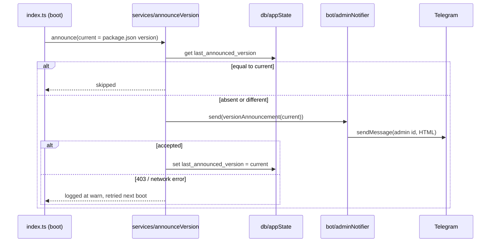

# 0008: Version announcements: tell the admin about each new version, and /changelog

> **Status:** done (2026-09-30): built as planned after one docs fix round, three nits open, v0.5.0. The by-hand check after the push (one «🆕 Версия 0.5.0», nothing after a restart) is owed.
> **Created:** 2026-09-30
> **Related ADRs:** [ADR-0013](../../adrs/0013-version-announcements-at-boot.md), [ADR-0012](../../adrs/0012-html-rendering-seam.md)

## TL;DR

When the bot boots on a version it hasn't announced yet, it sends the admin (the first id in
`ALLOWED_TELEGRAM_IDS`) a short Russian "what's new" for that version, then records it in
SQLite, so a restart on the same version stays silent. Every bump announces, patch included.
The copy lives in `messages.versionAnnouncements`, and a test fails the gate when
`package.json`'s version has no entry. `/changelog` shows the same entries to every allowed
user. The first visible change: the first deploy of this plan messages the admin «🆕 Версия
0.3.0 …», and a second restart sends nothing.

## Context & problem

The sibling Serbian bot broadcasts user-facing releases at boot, and it's the only way anyone
notices a deploy happened. This bot has no such signal: a deploy lands silently, and the only
record of what changed is `CHANGELOG.md`, which no chat user reads. The user wants a message for
every new version, for now only to themselves, and a way for family members to look up what
changed.

## Decision

Boot-time announcer with the marker in a new key/value `app_state` table (ADR-0013). Pieces:

- `src/version.ts` reads `version` from `package.json` once at boot. Both `src/index.ts` (tsx)
  and `dist/index.js` (Docker, where `package.json` is copied to `/app`) resolve it as
  `new URL('../package.json', import.meta.url)`.
- `src/domain/version.ts` (pure) parses `X.Y.Z` and compares numerically, so `0.10.0` sorts
  after `0.9.0`.
- `src/services/announceVersion.ts` takes the db, the current version, the announcement map, a
  `send(body: Html)` function and a logger. It never throws: every failure is logged and boot
  continues.
- `src/bot/adminNotifier.ts` is the grammY side: `bot.api.sendMessage(adminId, body,
  htmlParseMode)`. A private chat's id equals the user's Telegram id, so no lookup is needed.
- Only the current version is announced. If one push carries two plan closes, the skipped
  version is still in `/changelog`, and the message links to it.
- If the recorded version is absent (the first boot with this plan), the current version is
  announced. That is Phase 1's visible skeleton.

We rejected a marker file (outside the backups), a CI `sendMessage` step (token in GitHub,
copy outside the messages module) and a broadcast to all users (deferred). See ADR-0013.

## Architecture diagram



## Implementation phases

Each phase ships as its own commit. `dev` implements all phases in one session. The architect
reviews once at the end, in a fresh session.

### Phase 1: the admin gets a message for a new version
- **Owner skill:** dev
- **What:** the `app_state` migration and repository, the version reader and comparator, the
  announcer service, the grammY admin notifier, `messages.versionAnnouncements` with the three
  backfilled entries below, the boot wiring, and the gate test.
- **Files touched:** `src/db/migrations/NNNN_app_state.sql` (the next free migration number when
  you start; Plan 0004 claims `0005`, so check the tree), `src/db/appState.ts`,
  `src/db/appState.test.ts`, `src/version.ts`, `src/domain/version.ts`,
  `src/domain/version.test.ts`, `src/services/announceVersion.ts`,
  `src/services/announceVersion.test.ts`, `src/bot/adminNotifier.ts`, `src/bot/messages.ts`,
  `src/bot/messages.test.ts` (or the existing messages test), `src/config.ts`,
  `src/config.test.ts`, `src/index.ts`, `.env.example`.
- **Done when:**
  - With no `last_announced_version` row, `announceVersion` for `0.3.0` calls `send` exactly
    once with the `0.3.0` announcement, and the row then reads `0.3.0`.
  - A second call with the row at `0.3.0` does not call `send`.
  - With the row at `0.3.0` and current `0.3.1`, `send` is called once with the `0.3.1` body
    (patch bumps announce).
  - When `send` rejects, the row keeps its old value, the call resolves (doesn't throw), and a
    `warn` is logged whose fields contain the version and the error name but no message body.
  - When the map has no entry for the current version, `send` isn't called, the row is
    unchanged, and an `error` is logged.
  - `compareVersions('0.10.0', '0.9.0') > 0`, `compareVersions('1.0.0', '1.0.0') === 0`, and
    `parseVersion('0.3')` rejects.
  - **Gate:** a test reads `package.json` and asserts `messages.versionAnnouncements` has an
    entry for its `version`, and that every key parses and is not greater than it. Bumping
    `package.json` to `0.3.1` without an entry fails `pnpm test`.
  - `loadConfig` exposes `adminTelegramId` equal to the first id of `ALLOWED_TELEGRAM_IDS`
    (`"222,111"` gives `222`). `.env.example` says the first id is the admin who receives
    version announcements.
  - Boot calls the announcer before `bot.start`, without awaiting it on the boot path, so a slow
    or failing Telegram call never delays polling.

### Phase 2: /changelog
- **Owner skill:** dev
- **What:** `/changelog` for every allowed user renders the announcements newest first, in the
  command menu and in `/help`.
- **Files touched:** `src/bot/handlers/changelog.ts`, `src/bot/handlers/changelog.test.ts` (or
  `src/bot/bot.test.ts`), `src/bot/bot.ts`, `src/bot/messages.ts`.
- **Done when:**
  - `/changelog` with the three backfilled entries replies with `0.3.0`, `0.2.0`, `0.1.0` in that
    order (numeric sort, not map insertion order: a test with keys inserted as `0.9.0`,
    `0.10.0` shows `0.10.0` first).
  - With enough synthetic entries to exceed it, the reply stays under 4096 characters, keeps the
    newest entries, and ends with the truncation line. The budget is a named constant below
    4096, leaving room for the header and the truncation line.
  - `/changelog` appears in `messages.commands` and in the `/help` text.
  - A user outside the allow-list gets nothing (the existing allowlist middleware; one test).

## Data shapes

```sql
-- illustrative
CREATE TABLE app_state (
  key   TEXT PRIMARY KEY,
  value TEXT NOT NULL
);
-- one key for now: 'last_announced_version' -> '0.3.0'
```

```ts
// illustrative
versionAnnouncements: Record<string, Html>  // key is 'X.Y.Z', value is the body only
versionAnnouncement(version: string, body: Html): Html
// «🆕 Версия {version}\n\n{body}\n\nВсе изменения: /changelog»
```

Backfilled bodies (Russian user copy, from `CHANGELOG.md`; `dev` may tighten the wording but
not add claims):

- `0.3.0`: «У каждой траты теперь есть категория. Бот подбирает её по прошлым тратам с тем же
  описанием, а кнопка [Категория] под подтверждением меняет её. /categories — добавить,
  переименовать или скрыть категории.»
- `0.2.0`: «Появилось меню [📊 Сегодня] [❓ Помощь] и команда /help. Трату можно удалить кнопкой
  [Удалить] и вернуть кнопкой [Вернуть]. Если сумма неоднозначна, например «1.200 обед», бот
  предложит варианты кнопками.»
- `0.1.0`: «Первая версия. Отправьте трату текстом, например «450 кофе» или «12,50 EUR такси»,
  а /today покажет траты за сегодня.»

## Risks & open questions

- **Checked by hand after the push, not by `dev`:** the admin gets one announcement for the
  version the close bumps to, and `docker compose restart` sends nothing more.

- **At-least-once.** A crash between `send` and the row write repeats the message on the next
  boot. Accepted: one duplicate to one person. The reverse order (write, then send) would lose
  announcements on a failed send, which is worse.
- **The admin never pressed /start.** Telegram answers 403 and the send is retried on every
  boot until they do. Visible as a `warn` per boot, which is the signal.
- **Order of `ALLOWED_TELEGRAM_IDS` is now load-bearing.** Reordering the env list silently
  changes the recipient. Documented in `.env.example`, accepted per the interview.
- **Privacy.** Announcements carry no user data. Logs name the version, never the body.
- **Plan 0004 and 0005 in flight.** Both are approved and both may bump the version at close.
  Every close now owes a `versionAnnouncements` entry, and the gate test enforces it whichever
  plan closes first.

## What this plan does NOT do

- Broadcast to all users, per-user "last seen version", or marking blocked users inactive. A
  future plan, if the family should get the push too.
- Silence patch bumps. Every bump announces until the user says otherwise.
- Render announcements from `CHANGELOG.md`. The changelog stays the dev-facing record, and the
  messages module holds the user copy.
- A boot alert on every restart. Only a version change sends anything.

## Implementation log

> Written by `dev`: one row per phase as its commit lands, then the close block. **The phases
> above are the contract. This section records what happened.** Observations, never conclusions:
> no pass list, no self-assessment. Deviations and unmet done-whens are **always** disclosed.
> Keep it shorter than `## Implementation phases`.

| phase | owner | state | commit |
|---|---|---|---|
| 1: the admin gets a message for a new version | dev | done | 03114c0 |
| 2: /changelog | dev | done | 8c7501d |

### Notes

- Phase 1: `src/bot/render/html.ts` (outside `Files touched`) gained `sendHtml(api, chatId, body)`,
  and `adminNotifier` sends through it. The bot-layer lint rule rejects a `sendMessage` call or a
  `parse_mode` property anywhere in `src/bot/` except `src/bot/render/`.
- Phase 1: `src/db/connection.test.ts` (outside `Files touched`) now lists migration `0005` in
  its pinned applied-migrations list.
- Phase 1: the migration is `0005_app_state.sql`, the next free number in the tree.
- Phase 1: the service's `send` is `(version, body) => Promise<void>` and is generic over the body
  type, not `send(body: Html)`. The services layer may not import `src/bot/`, where `Html` lives.
  `src/index.ts` wraps the body in `messages.versionAnnouncement` before `adminNotifier` sends it.
  The done-when tests assert `send` receives the version and the map's body.
- Phase 1: no test covers "boot calls the announcer before `bot.start`, not awaited". I checked it by
  reading `src/index.ts`: `void announceVersion(...)` sits before `await bot.start(...)`.
- Phase 1: I checked the gate by bumping `package.json` to `0.3.1`. `pnpm test src/bot/messages.test.ts`
  failed with "expected [ '0.3.0', '0.2.0', '0.1.0' ] to include '0.3.1'". I then reverted it with
  `git checkout -- package.json`.
- Phase 2: the tests are in `src/bot/bot.test.ts`, and there is no `changelog.test.ts`. The budget
  is `CHANGELOG_BUDGET = 3900` in `src/bot/messages.ts`. It is measured in UTF-16 units of the entries'
  HTML plus their separators, and it drops older entries whole.
- Followup noticed, not acted on: no test drives `adminNotifier` / `sendHtml`, and no test covers
  the `src/index.ts` wiring (the payload's chat id and parse mode).

### Close triggers

- **What shipped:** migration `0005_app_state.sql` (`app_state` key/value table),
  `src/db/appState.ts`, `src/domain/version.ts`, `src/version.ts`,
  `src/services/announceVersion.ts`, `src/bot/adminNotifier.ts`, `sendHtml` in
  `src/bot/render/html.ts`, `Config.adminTelegramId`, the boot wiring in `src/index.ts`, and
  `src/bot/handlers/changelog.ts`.
- **User-visible surface changed:** a boot on a version not yet recorded sends the admin
  «🆕 Версия X.Y.Z», its body, and «Все изменения: /changelog». There is a new `/changelog`
  command («Что нового в боте» in the command menu), and a new `/help` line «/changelog — что нового в боте».
  `messages.versionAnnouncements` has entries `0.3.0`, `0.2.0` and `0.1.0`. `package.json`
  version: `0.3.0`, unchanged. The first deploy of `0.3.0` announces `0.3.0`, because no row is
  recorded yet.
- **Gate at the tip (8c7501d):** `pnpm typecheck` exit 0. `pnpm lint` exit 0. `pnpm test` exit 0
  with 29 files and 309 tests. `pnpm build` exit 0. `dist/version.js` `readAppVersion()` printed `0.3.0`.
- **Outstanding `human` phases:** none. The by-hand check in Risks is still open: one announcement
  after the push, and nothing after `docker compose restart`.

## Close review

Closed 2026-09-30 on the round-2 review below, which is reproduced in full.

### Plan 0008 review, round 2 (tip 7a001ff)

**Verdict:** clean. Round 1's two minors are fixed. The merge of main (Plan 0005, v0.4.0) kept every done-when green, and the gate test did its job on a real bump: `0.4.0` arrived with its `versionAnnouncements` entry. No blockers, majors or minors. Three nits remain, none of them block the close.

#### What changed since round 1 (77bc01c..7a001ff)

- `5044346` README: a `/changelog` row (`README.md:31`), the admin announcement in the allow-list paragraph (`README.md:40-41`), and `src/version.ts` in the Architecture tree (`README.md:221`). This fixes round-1 minor 1 and the optional half of minor 2.
- `4a71fc0` CLAUDE.md: `version.ts` is listed in "Where things live" (`CLAUDE.md:24`). This fixes round-1 minor 2.
- `7a242b7` The `/changelog` order test now builds its expectation from the live map, so a close that adds the next entry doesn't break it (see nit 3).
- `eaac1b4`, `7a001ff` Main merged in: Plan 0005 (`/settings`, v0.4.0) and a Plan 0004 docs edit. `package.json` is now `0.4.0`, and `src/bot/messages.ts:112` has a `'0.4.0'` entry. `/settings` is at index 2 of `messages.commands`, which moves `/help` to 3 and `/changelog` to 4.

#### Gate (run by this review at 7a001ff)

- `pnpm typecheck`: exit 0.
- `pnpm lint`: exit 0.
- `pnpm test`: exit 0, 33 files and 355 tests.
- `node scripts/check-doc-links.mjs`: exit 0, 89 relative links resolve.

The tree is unchanged: no file was modified, and nothing was committed.

#### Lens 1: alignment with the plan and ADR-0013

Round 1 read every named assertion. I reread the ones the merge could have affected:

- **Gate.** `src/bot/messages.test.ts:9-23` still asserts that `package.json`'s version (now `0.4.0`) is a key with a non-empty body, and that every key parses and is at most the current version. Main's close owed a `0.4.0` entry, and the suite would have failed without it. The entry exists, so the mechanism worked across a real bump.
- **The `0.4.0` body** (`messages.ts:112`) makes no claim that isn't in `CHANGELOG.md`'s 0.4.0 entry: the settings button and `/settings`, a timezone from a list of cities, the default currency for new expenses, and recorded expenses unchanged.
- **Service done-whens.** `src/services/announceVersion.test.ts` uses a synthetic map, so the merge doesn't touch it. Its `0.4.0` "missing" case is still a synthetic version absent from that map, and it still asserts no send, the row unchanged and one `{level:50, version:'0.4.0'}` log line.
- **Boot order.** `src/index.ts:52-61`: `void announceVersion(...)` still runs after `registerCommands` and before `await bot.start` (`:84`), and it is not awaited. The merge left `index.ts` untouched.
- **/changelog.**
  - `src/bot/bot.test.ts:353` checks the full payload against the live map, newest first.
  - Line 377 pins the numeric order literally (`0.10.0` before `0.9.0`).
  - The truncation test (line 383) and the no-truncation test (line 406) are unchanged. With four entries the reply is far under `CHANGELOG_BUDGET`.
  - The menu/help test (line 410) and the allow-list test (line 415) pass.
  - `messages.help` still carries `/changelog — что нового в боте` (`messages.ts:145`), after Plan 0005 rewrote the other help lines.
- **Config and env.** `.env.example:4` still documents the admin order. Plan 0005 edited only the lines below it.

The merge reverses nothing in ADR-0013.

#### Lens 2: layering

The merge doesn't change layering for this plan's files:

- grammY is imported only under `src/bot/`.
- `src/domain/version.ts` is pure.
- The service imports `db/` and the logger only.
- All the copy is in `messages.ts`.

#### Lens 3: correctness

This round changes nothing in the round-1 findings:

- No money arithmetic.
- A clock is read only at boot.
- No recording handler.
- Logs carry the version and the error name only.
- The reply is bounded by the budget.

**One point the dev setup can't see:** main shipped 0.4.0 without the announcer. The first deploy of this plan therefore finds no `last_announced_version` row and announces whatever version the close bumps to, which should be `0.5.0`. It does not announce `0.3.0` as the TL;DR says. The behaviour is correct, and it is exactly the plan's "row absent" rule. Only the prose is stale (bookkeeping below).

#### Lens 4: docs freshness

The README, CLAUDE.md, `.env.example` and `/help` all cover the new command, the admin announcement and `src/version.ts`. The sequence diagram is still true.

#### Findings

##### blocker

None.

##### major

None.

##### minor

None.

##### nit

1. **The registration test hardcodes two command descriptions.**
   - **Where:** `src/bot/bot.test.ts:328` (`'Что нового в боте'`) and, from Plan 0005, `:326` (`'Часовой пояс и валюта'`).
   - **What:** the other rows read `messages.commands[n].description`. This is round-1 nit 1, carried over. After the merge the indices are 2 for settings and 4 for changelog.
   - **Why it matters:** a copy edit would break the test for no behavioural reason.
   - **Fix:** use `messages.commands[2].description` and `messages.commands[4].description`.

2. **No test drives `adminNotifier` or `sendHtml`.**
   - **Where:** `src/bot/adminNotifier.ts`, `src/bot/render/html.ts`.
   - **What:** round-1 nit 2, carried over, and disclosed in the log as a followup.
   - **Why it matters:** the admin chat id and the parse mode are verified only by reading `src/index.ts:52-58` and by the by-hand check after the push.
   - **Fix:** a `createTestBot` test of `adminNotifier(bot.api, ALLOWED_ID)(body)` that asserts `{chat_id: ALLOWED_ID, text: body, parse_mode: 'HTML'}`. This can go in a future plan.

3. **The live-map `/changelog` test orders its expectation with a different comparator from production.**
   - **Where:** `src/bot/bot.test.ts:359-361`.
   - **What:** the expectation sorts with `localeCompare(..., { numeric: true })`, while production uses `compareVersions`. For `X.Y.Z` keys both give the same order, so the test is an independent oracle, not a tautology.
   - **Why it matters:** the plan's literal "`0.3.0`, `0.2.0`, `0.1.0` in that order" is no longer pinned as literal text. Line 377 still pins the numeric-sort property literally, so the done-when stays defended.
   - **Fix:** none needed. Optionally, also assert that `newestFirst` ends with `['0.3.0', '0.2.0', '0.1.0']`.

#### Bookkeeping owed at close

- Flip the plan to `done`, `git mv` it to `docs/plans/done/`, repair the links in both directions (`../adrs/` -> `../../adrs/`, and the index row), and run `node scripts/check-doc-links.mjs`.
- Accept ADR-0013 (`proposed` -> `accepted`) and refresh `docs/adrs/README.md`.
- Refresh `docs/plans/README.md`: move the 0008 row to recently closed.
- **Bump the version:** minor, `0.4.0` -> `0.5.0`, because this is a feature plan. Add a `CHANGELOG.md` entry.
- **Add a `'0.5.0'` entry to `messages.versionAnnouncements`**, or the gate test fails. Suggested body: «Бот сообщает о новых версиях, а /changelog показывает, что изменилось.»
- In the close review section, note that the TL;DR's «🆕 Версия 0.3.0» first message will actually be `0.5.0`. Main shipped 0.4.0 without the announcer, so the first deploy of this plan announces the close's version. The same applies to the by-hand check in Risks.
- By hand, after the push: the admin gets exactly one «🆕 Версия 0.5.0», and `docker compose restart` sends nothing more.
- Plan followup, already recorded: the `CHANGELOG.md` header could say that every bump is announced.

### Resolved in the fix round

- Round 1 minor 1 (README: no `/changelog` row, no admin announcement): fixed in `5044346`.
- Round 1 minor 2 (CLAUDE.md and README trees missing `src/version.ts`): fixed in `4a71fc0` (CLAUDE.md) and `5044346` (README).
- Round 1 nit 1 (hardcoded command description): not fixed, carried over as round 2 nit 1.
- Round 1 nit 2 (no `adminNotifier` / `sendHtml` test): not fixed, carried over as round 2 nit 2.

### Close notes

- The TL;DR's first message «🆕 Версия 0.3.0» is stale: main shipped 0.4.0 without the announcer, so the first deploy of this plan finds no `last_announced_version` row and announces `0.5.0`, the version this close bumps to. The by-hand check in Risks is for `0.5.0`.
- **Owed:** by hand after the push, the admin gets exactly one «🆕 Версия 0.5.0», and `docker compose restart` sends nothing more.
- The close added the `'0.5.0'` entry to `messages.versionAnnouncements`, using the review's suggested body.

## Followups

- The `CHANGELOG.md` header could note that every bump is announced to the admin.
