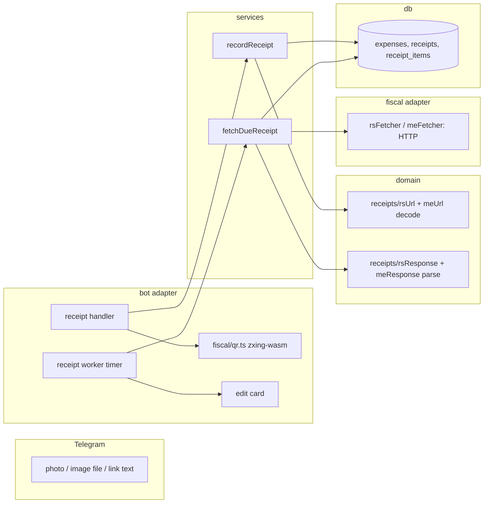

# 0014: Fiscal receipts: a QR photo or link from Serbia or Montenegro becomes an expense with its line items

> **Status:** done (2026-10-01): built as planned, three minors and one nit open as followups,
> Phase 7 real-receipts check owed, v0.9.0
> **Created:** 2026-10-01
> **Related ADRs:** [ADR-0018](../../adrs/0018-receipts-record-offline-enrich-async.md),
> [ADR-0019](../../adrs/0019-qr-decoding-zxing-wasm.md),
> [ADR-0004](../../adrs/0004-amount-parsing-rule.md) (structured sources are exempt from it),
> [ADR-0011](../../adrs/0011-navigation-model.md) (the expense card)

## TL;DR

In DM, the user sends a photo of a Serbian or Montenegrin fiscal receipt, as a photo or as an image
file, or pastes the receipt's verification link. The bot reads the QR at once and records one
expense with the receipt's total, in RSD or EUR, dated the receipt's local day. It answers with
the usual card and [Удалить]. A few seconds later, the card updates itself with the shop name
and a [Позиции] button listing the line items fetched from the tax authority's site (ADR-0018).
Sending the same receipt into the same ledger again gets «уже записано» and the existing card. The
first thing the user sees: they paste a `suf.purs.gov.rs/v/?vl=…` link and get
«Записано в Личное: 829,12 RSD — Чек».

## Context & problem

Receipts are the main way spending arrives in Serbia and Montenegro, and typing totals off long
receipts is the friction the user wants gone. The roadmap has carried "fiscal QR receipts" since
Plan 0001, narrowed to Serbia first in Plan 0009. Nothing has been built: photos fall into
`registerNonText` and get the help reply. The pieces we can reuse:

- `expenses.source_key` was designed for this kind of dedupe (Plan 0001), but it's globally
  `UNIQUE` (see ADR-0018 for the key shape).
- `RSD` and `EUR` are in `src/domain/currencies.ts`, both with exponent 2.
- `suggestCategory` (ADR-0008) and the ADR-0011 card with its edit and category flows.
- ADR-0004 already exempts fiscal QR payloads from the typed-amount parsing rule.

Researched on 2026-10-01 and recorded in ADR-0018/0019: both QR formats carry the total, the
instant and a fiscal id offline. Line items need one or two requests to an undocumented public
endpoint. Russia (ФНС) and Kazakhstan (several fiscal data operators) are out of scope here.

## Decision

Record the total from the QR offline, in the handler. Enrich with the seller name and items from
an in-process background worker that keeps its queue in a `receipts` table (ADR-0018). Decode
images with `zxing-wasm` loaded from `node_modules` (ADR-0019). Receipts are DM-only in this plan.
The group composer from Plan 0009 keeps ignoring photos.

We rejected fetching inside the handler (sequential polling would stall every user on a slow tax
site), one expense per line item (the user's call: one receipt, one expense), and jsQR or sharp
for decoding (ADR-0019).

## Architecture diagram



## Implementation phases

This plan lands after Plans 0009 and 0011, both approved, because it touches the same
`recordExpense.ts`, `bot.ts`, `text.ts` and `messages.ts`. Read those files as 0009 left them.
The receipt path writes only to the user's active ledger, never to a group ledger.

### Phase 1: A pasted Serbian link records the receipt's total
- **Owner skill:** dev
- **What:** A pure decoder for the SUF verify URL, the `receipts` table, a `recordReceipt` service,
  and a branch in the DM text handler: text that is a SUF verify URL records a receipt instead of
  going to `parseExpenseText`. The expense's description is the placeholder «Чек», taken from the
  messages module and passed in by the handler. The category comes from the ledger's most recent
  receipt with the same `merchant_key` (a ledger has no such receipt yet in this phase, so the
  answer is «Другое»).
- **Files touched:** `src/domain/receipts/rsUrl.ts` (+ test), `src/domain/receipts/types.ts`,
  `src/domain/receipts/testing/buildRsVl.ts` (a builder for synthetic payloads, MD5 included),
  `src/db/migrations/<n>_receipts.sql` (the next free number after Plans 0009 and 0011),
  `src/db/receipts.ts` (+ test), `src/services/recordReceipt.ts` (+ test),
  `src/bot/handlers/text.ts`, `src/bot/handlers/receipt.ts`, `src/bot/messages.ts`,
  `src/bot/bot.test.ts`.
- **Done when:**
  - A synthetic `vl` with total raw `8291200`, instant `1790807400000` ms (2026-09-30T22:30:00Z),
    `requestedBy` = `signedBy` = `AAAA1111`, `totalCounter` 16898, invoice type 0 and transaction
    type 0 decodes to `{ country: 'RS', totalMinor: 82912, currency: 'RSD',
    fiscalId: 'AAAA1111-AAAA1111-16898', issuedAt: 2026-09-30T22:30:00Z, merchantKey: 'rs:AAAA1111' }`.
  - These decode to a typed refusal, not a throw: a raw total not divisible by 100 (`8291250`), a
    flipped byte (MD5 mismatch), a truncated payload, invoice types 1 to 4, and transaction type 1
    (refund).
  - A `+` inside `vl` decodes the same whether it arrives as `+`, `%2B`, or a space, which is
    what form-style decoding turns `+` into.
  - With that link sent at 2026-10-01T08:00:00Z, a user in `Europe/Belgrade` gets an expense of
    82912 minor RSD with `occurred_on` 2026-10-01 (local 00:30). A user in `Europe/London` gets
    `occurred_on` 2026-09-30 (local 23:30). The card names the date only for the London user,
    because `occurred_at` stays the message instant.
  - One `receipts` row in state `pending` with `fiscal_id` `AAAA1111-AAAA1111-16898`.
  - Sending the same link again, as a new message, leaves exactly 1 expense and 1 receipt and
    replies «уже записано» with the existing card. The same link from a second user creates a
    second expense in that user's personal ledger (`source_key` carries the ledger id).
  - A receipt whose local issue date is after the local date of the message gets a refusal and
    records nothing.
  - Text that only contains a SUF link next to other words (`кофе https://suf…`) is not a
    receipt: it goes to the normal expense parser, as today.
  - Logs carry the receipt and expense ids and the country, never the amount, URL or fiscal id
    above debug.

### Phase 2: A pasted Montenegrin link
- **Owner skill:** dev
- **What:** The decoder for `mapr.tax.gov.me/ic/#/verify?…` (parameters in the hash fragment),
  wired into the same text branch.
- **Files touched:** `src/domain/receipts/meUrl.ts` (+ test), `src/domain/receipts/index.ts`
  (one `decodeReceiptUrl` that tries both), `src/bot/bot.test.ts`.
- **Done when:**
  - `iic=<32 hex>&tin=02000000&crtd=2026-09-30T23:15:00+02:00&prc=42.50&bu=ab123cd456&…`
    decodes to `{ country: 'ME', totalMinor: 4250, currency: 'EUR', fiscalId: <iic lowercased>,
    issuedAt: 2026-09-30T21:15:00Z, merchantKey: 'me:02000000:ab123cd456' }`.
  - `prc=42` gives 4200 and `prc=42.5` gives 4250. `prc=42.505`, `prc=-1`, `prc=0` and
    `prc=4,50` are refused.
  - `crtd` with its `+` turned into a space (`2026-09-30T23:15:00 02:00`) decodes to the same
    instant.
  - A user in `Europe/Podgorica` gets `occurred_on` 2026-09-30. A user in `Europe/Moscow` gets
    2026-10-01 (local 00:15).
  - An `iic` that differs only in case is the same receipt (1 expense).

### Phase 3: Photos and image files
- **Owner skill:** dev
- **What:** `message:photo`, plus `message:document` with an image MIME type, in DM: download the
  largest size via `getFile`, decode with `zxing-wasm` (ADR-0019), take the first decoded text that
  `decodeReceiptUrl` accepts, and run Phase 1's path. A photo with no readable QR, or with a QR
  that isn't a SUF or EFI receipt, gets one hint: crop closer to the QR, send it as a file, or
  paste the link. Register before `registerNonText`.
- **Files touched:** `package.json`, `pnpm-lock.yaml` (`zxing-wasm` exact), `src/fiscal/qr.ts`
  (+ test), `src/fiscal/qr.fixtures/` (synthetic QR images generated from synthetic URLs, never
  photos of real receipts), `src/bot/handlers/receipt.ts`, `src/bot/bot.ts`,
  `src/bot/messages.ts`, `src/bot/bot.test.ts`, `Dockerfile` (the build-time decode check, plus
  any copy the wasm needs if it doesn't arrive with the prod install), `CLAUDE.md` ("Where things
  live": `src/fiscal/`).
- **Done when:**
  - `qr.ts` decodes the synthetic Serbian-URL fixture JPEG to exactly the source URL, with
    `globalThis.fetch` replaced by a function that throws. This proves the wasm loads from disk,
    not jsDelivr.
  - A fixture with no QR returns "none", not a throw. A fixture holding a non-receipt QR
    (`https://example.com`) gets the not-a-receipt hint.
  - A photo update whose fixture decodes to Phase 1's link records the same expense as the
    pasted link (82912 minor RSD). The same receipt sent as a photo and then as a link gives
    1 expense.
  - A document over 20 MB, or a non-image document, is not downloaded. Over 20 MB it gets the
    hint, and a non-image keeps today's help reply.
  - The decode time for the largest fixture is recorded in the Implementation log, as the
    measurement ADR-0019 marks UNVERIFIED.
  - The download URL, which contains the bot token, is never logged.
  - The Dockerfile's builder stage, after the prod-only install, runs a `RUN node -e` check next
    to the `better-sqlite3` one: it replaces `globalThis.fetch` with a function that throws, loads
    `dist/fiscal/qr.js` against the prod `node_modules`, and decodes the Serbian fixture to its
    URL, exiting non-zero otherwise. The image is built only by the deploy
    (`docker compose up --build`), so a failing check aborts the deploy before the running
    container is replaced. Phase 7 sees it pass on the first real deploy.

### Phase 4: The background fetch fills in the shop and the items
- **Owner skill:** dev
- **What:** Per-country fetchers, response parsers, the worker, and the card update.
  - **Serbia:** a GET on the verify URL with `Accept: application/json` (seller and total), then
    the verify HTML for `viewModel.Token('…')`, then the `/specifications` POST (`invoiceNumber`,
    `token`) for the items.
  - **Montenegro:** the `verifyInvoice` POST (`iic`, `dateTimeCreated` = `crtd`, `tin`).
  - **Parsers:** pure functions over response text. Numbers are read from their JSON source text
    and converted to minor units by the money module (ADR-0018).
  - **The worker:** a timer in `src/bot/receiptWorker.ts`, started in `src/index.ts`. It runs one
    fetch at a time, with a 10 s timeout and an in-flight guard, and stops in the shutdown order
    before polling stops.
  - **On success**, in one transaction: insert the items, set `seller_name` and `fetched`. Set the
    description to the seller name, and recompute `description_key`, only if the description is
    still the placeholder and `updated_at IS NULL`. Re-run `suggestCategory` on the seller name
    only if `category_set_at = created_at` and the category came from the fallback. Then edit the
    card, if the expense is live and the card's chat and message ids are stored.
  - **On failure** (timeout, non-2xx, empty body, unparseable): `attempts + 1`, rescheduled at
    +1 min, +5 min, +30 min, +2 h, then +12 h. The failure after the +12 h attempt marks the
    receipt `failed`. That's 6 attempts over 14 h 36 min.
- **Files touched:** `src/domain/receipts/rsResponse.ts` (+ test), `src/domain/receipts/meResponse.ts`
  (+ test), `src/domain/money.ts` (+ test: a decimal source string to minor units, if the parser
  doesn't already cover it), `src/fiscal/rsFetcher.ts`, `src/fiscal/meFetcher.ts` (+ tests with an
  injected `fetch` and synthetic JSON/HTML bodies), `src/services/fetchDueReceipt.ts` (+ test),
  `src/db/receipts.ts`, `src/db/receiptItems.ts` (+ test), `src/db/migrations/<n>_receipts.sql`
  (items table, if not created in Phase 1), `src/bot/receiptWorker.ts`, `src/bot/handlers/receipt.ts`
  (store the card's message id), `src/bot/messages.ts`, `src/index.ts`.
- **Done when:**
  - A synthetic Serbian specifications body with items totals `"total": 799.99` and
    `"total": 29.13` parses to 79999 and 2913 minor RSD, and `"quantity": 0.535` is stored as the
    text `0.535`. `"total": 0.29` parses to exactly 29. In JS, `0.29 * 100` is
    `28.999999999999996`, so this vector catches any path through a float. `"total": 1.005` (three
    fraction digits for an exponent-2 currency) is refused as unparseable, which fails the fetch.
  - A synthetic Montenegrin body with `seller.name` «Test Market» and 2 items stores 2
    `receipt_items` rows in source order and sets the description to «Test Market».
  - A user who changed the category before the fetch keeps it, and so does a user who edited the
    description: no field changes except `seller_name` and the items.
  - A fetched total that differs from `amount_minor` leaves `amount_minor` unchanged and logs a
    warn with the receipt id only.
  - With a fake clock and a fetcher that always fails, the receipt is attempted at t0, +1 min,
    +6 min, +36 min, +2 h 36 min and +14 h 36 min, then is `failed` with `attempts` 6, and the
    worker makes no seventh call.
  - Restarting with a receipt left `pending` mid-fetch fetches it again, and items are inserted
    once (the state flip is compare-and-set on `pending`).
  - No test touches the network: the fetchers are tested with an injected `fetch`, and the
    service with a fake fetcher.

### Phase 5: [Позиции] and [Повторить] on the card
- **Owner skill:** dev
- **What:** A fetched receipt's card shows `Магазин · N позиций` and a [Позиции] button. Tapping
  it edits the card into the item list (name, quantity when it isn't 1, line total), paged to stay
  under 4096 characters, with [Назад]. A `failed` receipt's card shows «Позиции не загрузились»
  and [Повторить], which resets it to `pending` with `attempts` 0 and kicks the worker. Item names
  go through the ADR-0012 escaping seam.
- **Files touched:** `src/bot/callbackData.ts` (`exp:items:<uuid>:<page>`, at most 51 bytes;
  `exp:rcretry:<uuid>`, 48 bytes), `src/bot/handlers/card.ts`, `src/bot/handlers/receipt.ts`,
  `src/services/fetchDueReceipt.ts`, `src/bot/messages.ts`, `src/bot/bot.test.ts`.
- **Done when:**
  - A receipt with 120 items whose names are 60 characters each pages so that every page's
    rendered HTML is at most 4096 characters, and the pages together list all 120 in order.
  - An item named `<b>Хлеб & Co</b>` renders escaped.
  - A double tap on [Повторить] leaves one `pending` receipt with `attempts` 0, and the worker
    fetches it once.
  - [Позиции] on a card whose expense another user owns answers like the existing card taps do
    for a foreign expense, and reveals no items.

### Phase 6: Help and the README
- **Owner skill:** dev
- **What:** `/help` gains one line: send a photo or link of a Serbian or Montenegrin receipt. This
  also pays the `/help` copy owed by Plans 0003 and 0004: past dates (`450 такси вчера`) and
  [Изменить]/[Категория] on the card. The README gets a "Receipts" section that names the two
  external endpoints the bot calls. No version bump here: that's the close ceremony.
- **Files touched:** `src/bot/messages.ts`, `src/bot/messages.test.ts`, `README.md`.
- **Done when:** `/help` mentions receipts, past dates and the card's edit buttons, and stays
  under 4096 characters. The README lists `suf.purs.gov.rs` and `mapr.tax.gov.me` as the only
  outbound hosts besides Telegram.

### Phase 7: Real receipts in production
- **Owner skill:** human
- **Blocks merge:** no
- **What:** After deploy, scan real receipts: one Serbian and one Montenegrin as photos, one of
  each as a pasted link, and one long Serbian receipt photographed whole.
- **Files touched:** none.
- **Done when:** The deploy's image build ran Phase 3's decode check and passed. Each receipt
  records the printed total, and the card gains the shop name and the right item count within a
  minute. A rescan says «уже записано». The user notes in the Implementation
  log which photos failed to decode and whether "send as file" fixed them. This is the evidence
  ADR-0019's acceptance waits for.

## Data shapes

```sql
-- illustrative
CREATE TABLE receipts (
  id TEXT PRIMARY KEY,
  expense_id TEXT NOT NULL UNIQUE REFERENCES expenses(id),
  country TEXT NOT NULL CHECK (country IN ('RS', 'ME')),
  fiscal_id TEXT NOT NULL,          -- RS invoice number; ME iic, lowercased
  merchant_key TEXT NOT NULL,       -- rs:<requestedBy> | me:<tin>:<bu>
  verify_url TEXT NOT NULL,         -- what the fetcher needs; never logged
  issued_at TEXT NOT NULL,          -- UTC instant from the QR
  seller_name TEXT,
  fetch_state TEXT NOT NULL CHECK (fetch_state IN ('pending', 'fetched', 'failed')),
  attempts INTEGER NOT NULL DEFAULT 0,
  next_fetch_at TEXT,
  card_chat_id INTEGER, card_message_id INTEGER,
  created_at TEXT NOT NULL
);
CREATE INDEX receipts_due ON receipts(fetch_state, next_fetch_at);
CREATE TABLE receipt_items (
  receipt_id TEXT NOT NULL REFERENCES receipts(id),
  position INTEGER NOT NULL,
  name TEXT NOT NULL,
  quantity TEXT NOT NULL,           -- decimal string, e.g. '0.535': not money
  total_minor INTEGER NOT NULL,     -- in the expense's currency
  PRIMARY KEY (receipt_id, position)
);
```

```ts
// illustrative
type DecodedReceipt = {
  country: 'RS' | 'ME';
  fiscalId: string;
  merchantKey: string;
  totalMinor: number; // integer
  currency: 'RSD' | 'EUR';
  issuedAt: Date; // UTC
  verifyUrl: string;
};
// source_key = `rcpt:${country}:${fiscalId}:${ledgerId}`  (ADR-0018)
```

## Risks & open questions

- **Undocumented endpoints.** Either site can change markup or API. Fetchers fail closed: the
  expense keeps its total and the receipt goes `failed`. Plan 0001's Telegram error boundary
  doesn't cover the worker, so the worker catches and logs per receipt.
- **Montenegro's currency** is inferred to be EUR, not documented. If a fetched
  `currency.code` isn't EUR, log a warn by id and keep the QR amount. Revisit if it ever fires.
- **Rate limiting** by the tax sites is unknown. One fetch at a time and the backoff are the
  mitigation. The `User-Agent` names the bot honestly.
- **Card clobbering.** The worker's edit replaces whatever state the card is in, for example an
  open category picker (ADR-0018 negative). This is accepted for v1. If it bites, skip the edit
  while a flow (ADR-0009) is pending on that expense.
- **Money.** The Serbian QR total has 4 implied decimals. A total not divisible by 100 is refused
  rather than rounded, and the user can type the amount. Item amounts are read from source text,
  never through a JS number.
- **Time.** `occurred_on` is the receipt instant in the *user's* timezone, not the shop's, per the
  non-negotiable. `occurred_at` stays the message instant, so the card names the date of an old
  receipt.
- **Privacy.** The verify URL, the fiscal ids, seller names and item names are expense data. They
  go to the DB and never above debug in logs. Test fixtures are synthetic: no real receipt URL,
  photo or JSON body is committed. That includes the public `turanjanin` fixture, which is a real
  receipt.
- **Event-loop cost of decoding** a large photo (ADR-0019). Phase 3 measures it. If it's above
  about 1 s, the next plan moves decoding to a worker thread.
- **Plan 0011 budgets** see a receipt the moment it's recorded, because the amount is final then.
  Nothing in the enrichment changes the amount.

## What this plan does NOT do

- **Russia (ФНС) and Kazakhstan (fiscal data operators).** Their QR codes also carry the total and
  instant offline, so a later plan can add total-only decoding cheaply. Line items for Russia need
  an authenticated ФНС account or a paid API: that's an ADR of its own.
- **Splitting a receipt into several expenses by category.** It builds on the stored items. A
  future plan.
- **Receipts in group chats** (Plan 0009's group composer ignores photos).
- **Refunds, copies, pro-forma and advance invoices.** They're refused with a message. Refunds
  would need negative expenses, and `amount_minor > 0` forbids them today.
- **Onboarding** (Plan 0015), which will teach this feature once it exists.
- **FX conversion** of RSD and EUR receipts into a home currency (ADR-0003, still unplanned).

## Implementation log

> Written by `dev`: one row per phase as its commit lands, then the close block. **The phases
> above are the contract. This section records what happened.** Observations, never conclusions:
> no pass list, no self-assessment. Deviations and unmet done-whens are **always** disclosed.
> Keep it shorter than `## Implementation phases`.

| phase | owner | state | commit |
|---|---|---|---|
| 1: A pasted Serbian link records the receipt's total | dev | done | 7b2687f |
| 2: A pasted Montenegrin link | dev | done | 0d71306 |
| 3: Photos and image files | dev | done | e3aa895 |
| 4: The background fetch fills in the shop and the items | dev | done | 303cd3b |
| 5: [Позиции] and [Повторить] on the card | dev | done | 764cb13 |
| 6: Help and the README | dev | done | 112dc4c |
| 7: Real receipts in production | human | owed | |

### Notes

- Phase 1: the migration is `0010_receipts.sql` and creates `receipt_items` as well as
  `receipts`. `src/db/categories.test.ts` (not in Files touched) pinned the full list of
  migrations a pre-0009 DB applies, `['0009']`; it now asserts only that the first one is `0009`.
- Phase 1: the «уже записано» reply reads «Уже записано.» on its own line above the card.
- Phase 2: `src/bot/handlers/text.ts` (not in Files touched) switched its import from
  `decodeRsUrl` to `decodeReceiptUrl`, which is the wiring the phase names. `prc=42.505` is
  refused as `fractionalTotal`, the other refused `prc` values as `malformed`.
- Phase 3: decode time of `rs-receipt.jpg` (1280x1280 JPEG q75, 4 px per module, rotated 1.7
  degrees, noised), first decode in the process including wasm instantiation: 63 ms on the dev
  machine (`qr.test.ts` prints it).
- Phase 3: the fixtures are generated by `src/fiscal/qr.fixtures/generate.ts` (zxing-wasm's
  writer plus ImageMagick). The non-receipt fixture is `example.png`, not a JPEG.
- Phase 3: the Docker image was not built in this session. The `RUN node --input-type=module -e`
  check's script was run against a local `pnpm build` and printed its success line.
- Phase 3: the existing bot.test.ts case "answers a photo with the help reply" now sends a
  non-image document instead, since a photo is read for a QR.
- Phase 3: the download goes through `telegramFileDownloader(token)` in `receipt.ts`, built in
  `createBot`. Its errors name only the HTTP status.
- Phase 4: files outside Files touched: `src/domain/receipts/json.ts` (JSON.parse with a
  reviver that keeps each number's source text), `src/domain/receipts/types.ts`
  (`FetchedReceipt`, `FetchedItem`), and `src/bot/render/html.ts`, whose `editHtmlAt` now takes
  `Pick<Context, 'api'>` so the worker can edit a card outside an update.
- Phase 4: the worker leaves every expense field alone once the user changed the description
  or the category (or any field that stamps `updated_at`). Only an untouched expense gets the
  seller name, and the category re-suggestion, only from the fallback. The suggestion runs
  before the description moves: otherwise the ADR-0008 history step finds the expense itself
  under the seller's key.
- Phase 4: the Serbian seller name is `invoiceRequest.locationName`, falling back to
  `businessName`. The Montenegrin line total is `items[].priceAfterVat`. Both shapes are
  assumed from the plan's research, not checked against a live response (Phase 7).
- Phase 4: the worker ticks every 5 s and also drains once at start. It has no test of its
  own (none is in Files touched); the card edit after a fetch is untested at the bot level.
  The service, parsers and fetchers carry the done-when tests.
- Phase 4: `answerReceipt` stores the card's message id only when the reply carries an integer
  one. The test harness's fake answers `true`, so bot tests store none.
- Phase 5: files outside Files touched: `src/db/receipts.ts` (`resetFailedReceipt`, the
  compare-and-set on `failed` behind [Повторить]) and `src/bot/receiptWorker.ts`
  (`kickReceiptWorker`, a module-level handle on the running worker that the retry tap calls).
- Phase 5: [Позиции] or [Повторить] sits on its own row between [Категория] [Изменить] and
  [Удалить]. The item pages are built in `messages.receiptItemPages`, bounded by each page's
  HTML length. A foreign [Позиции] tap gets the toast «Позиции видит только тот, кто записал
  трату», like the forbidden toasts of the other card taps. "The worker fetches it once" is
  tested by calling `fetchDueReceipt` twice after the double tap.
- Phase 6: the README also says photos are read for receipts rather than answered with help,
  adds `fiscal/` to its architecture tree, and narrows the roadmap's receipts item to Russia and
  Kazakhstan.
- Followup, not acted on: `tsconfig.build.json` compiles `src/fiscal/qr.fixtures/generate.ts`
  and `src/domain/receipts/testing/buildRsVl.ts` into `dist/`. The Dockerfile check imports the
  latter; the generator only runs when invoked.
- Followup, not acted on: the test harness answers every Bot API call with `true`, so no bot test
  sees a stored card message id or the worker's card edit.

### Close triggers

- **What shipped:** a DM text that is a SUF or EFI receipt verify URL, a photo, or an image file
  whose QR holds one records one expense with the QR total in RSD or EUR, dated the issue
  day in the user's timezone, deduped per fiscal id and ledger. A background worker fetches the
  seller and line items, with backoff to `failed`. The card shows the shop and item count, with
  [Позиции] (paged item list) or [Повторить]. `/help` and the README describe receipts. New
  dependency: `zxing-wasm` 3.1.4. New migration: `0010_receipts.sql`.
- **User-visible surface changed:** receipt links, photos and image files in DM; the receipt
  card line, [Позиции] and [Повторить]; refusal and hint copy; three new `/help` lines; photos
  no longer get the help reply.
- **Gate at the tip (112dc4c):** `pnpm typecheck` exit 0; `pnpm lint` exit 0; `pnpm test`
  exit 0, 56 files and 749 tests passed; `pnpm build` exit 0; `node
  scripts/check-doc-links.mjs` exit 0, 127 relative links resolve. The Docker image was not
  built.
- **Outstanding `human` phases:** Phase 7 (real receipts in production, does not block merge).

## Close review

Closed 2026-10-01 by the conductor, after one review round. No finding had a prose-only fix, so
none was repaired at close. The three minors and the nit stay open, listed under `## Followups`.
Phase 7 (real receipts in production, `human`) stays owed. ADR-0018 is accepted. ADR-0019 stays
`proposed` until Phase 7's real-photo evidence. No earlier round raised a finding that a fix round
resolved.

The round 1 review, in full:

### Plan 0014 review, round 1 (tip 98b3614e0c52845bbb0a7c9401c3d8c8c2de150d)

**Verdict:** Clean: every dev phase (1 to 6) meets its done-when with tests that assert the claimed values, the gate is green, no ADR is reversed, and the three minors below are followups that don't block the close.

#### Gate (run in this session, at the tip)

- `pnpm typecheck`: exit 0.
- `pnpm lint`: exit 0.
- `pnpm test`: exit 0, 56 files, 749 tests passed.
- `node scripts/check-doc-links.mjs`: exit 0, 127 relative links resolve.
- Not run: `docker build`. Plan Phase 3 assigns the first real image build to Phase 7 (human, does not block merge).

#### Lens 1: alignment with the plan and ADRs

The log maps every phase to its commit, discloses the files touched outside each phase's list, and
stays shorter than the phases section. Each phase has exactly one in-vocabulary owner tag. Done-whens
checked against the assertions:

- **Phase 1.** `rsUrl.test.ts` asserts the exact decoded object (82912 RSD, fiscal id
  `AAAA1111-AAAA1111-16898`, 2026-09-30T22:30Z, `rs:AAAA1111`). It also asserts typed refusals for
  `8291250`, a flipped byte, truncation, invoice types 1 to 4 and a refund, and the same result for
  `+`, `%2B` and a space. `recordReceipt.test.ts` and `bot.test.ts` assert `occurred_on` 2026-10-01
  in Belgrade and 2026-09-30 in London, with the date named only on the London card. They also
  assert one `pending` receipt, the duplicate leaving 1 expense and 1 receipt with «Уже записано.»
  above the existing card, a second user's own ledger, the future-receipt refusal, `кофе <link>`
  going to the parser, and log lines free of the amount, URL and fiscal id.
- **Phase 2.** `meUrl.test.ts` asserts the full decoded object, `prc` 42 → 4200 and 42.5 → 4250,
  the four refusals, and `crtd` read the same through a space, `%2B` and `%20`. `bot.test.ts`
  asserts Podgorica → 2026-09-30, Moscow → 2026-10-01 and the case-folded iic as 1 expense.
- **Phase 3.** `qr.test.ts` decodes `rs-receipt.jpg` to exactly `buildRsUrl()` with `fetch`
  throwing, returns `none` for `no-qr.jpg`, and decodes `example.png` to `https://example.com`.
  `bot.test.ts` asserts that a photo records 82912 RSD and that a photo then the link gives 1
  expense. Over 20 MB there is no `getFile` and no download, and the user gets the hint. A PDF gets
  no download and the help reply, and the token never appears in a log line. The decode time is in
  the log (63 ms). The Dockerfile check matches the done-when's shape. That it passes in a real
  build is Phase 7's to see.
- **Phase 4.** `rsResponse.test.ts` asserts 79999, 2913 and exactly 29 for `0.29`, plus `'0.535'`
  kept as text and `1.005` refused. `meResponse.test.ts` and `fetchDueReceipt.test.ts` together
  assert two items in source order and the description becoming «Test Market». A changed category,
  or an edited description, keeps every field. The backoff test steps a fake clock minute by minute
  and asserts attempts at `[0, 1, 6, 36, 156, 876]`, then `failed`, `attempts` 6 and no seventh
  call. The concurrent double fetch inserts the items once. The fetchers run on an injected `fetch`.
- **Phase 5.** The 120 × 60-character paging test asserts every page at most 4096 and all 120
  listed in order. The escaping test asserts `&lt;b&gt;Хлеб &amp; Co&lt;/b&gt;`. The foreign
  [Позиции] tap answers with a toast only. The double-tap test is weaker than its claim: see
  minor 2.
- **Phase 6.** `messages.test.ts` asserts the receipts, past-date and card-button lines and a
  length under 4096. The README names `suf.purs.gov.rs` and `mapr.tax.gov.me` as the only hosts
  besides Telegram.

ADR-0018 holds as implemented: offline record, `source_key` `rcpt:<country>:<fiscalId>:<ledgerId>`,
the CAS on `pending`, the source-text numbers, and the QR total never overwritten. ADR-0019 also
holds: the wasm loads from `node_modules` via `import.meta.resolve`.

#### Lens 2: layering

grammY is imported only under `src/bot/`. `src/domain/receipts/` imports only `node:crypto` and the
money module. SQL lives only in `src/db/`. All copy is in `messages.ts`. `src/fiscal/*Fetcher.ts`
imports the `ReceiptFetcher` port types from `services/fetchDueReceipt.ts`, an adapter implementing
a service-owned port, which is acceptable.

#### Lens 3: correctness

Money is bigint for the QR total and digit strings for the JSON amounts (`minorFromDecimal`), and
no float path exists. Time: the issue date is the local date in the user's resolved timezone, and
the future check compares local dates. Idempotency: a redelivered text or photo update dedupes on
the source key, [Повторить] is a CAS on `failed`, and the item insert sits behind a CAS on
`pending`. Callback data stays within 51 and 48 bytes. Item and seller names go through `html`.

#### Findings

##### blocker

None.

##### major

None.

##### minor

1. **What:** a SUF link followed by other words, or by a second line, is refused as a damaged link
   instead of going to the expense parser.
   **Where:** `src/domain/receipts/rsUrl.ts:15` (`[^#]*` matches spaces and newlines up to the end
   of the text), then `vlParameter` (line 48) turns the spaces into `+` and the base64 check fails.
   This session confirmed it with `tsx`: `decodeReceiptUrl(buildRsUrl() + ' кофе')` and
   `buildRsUrl() + '\n450 кофе'` both return `{ kind: 'refused', reason: 'malformed' }`.
   **Why it matters:** the Phase 1 done-when says text that contains a SUF link next to other
   words is not a receipt and goes to the parser. Only the leading-words case (`кофе <link>`) is
   tested. A user who pastes the link with a note after it gets «ссылка повреждена или обрезана»,
   which is false. The ME pattern ends in `\S*` and doesn't have this problem.
   **Fix:** match the query as `([^#\s]*)` and treat a whole-text form-decoded space separately.
   Alternatively, require that the trimmed text contain no whitespace except inside `vl`, i.e.
   reject whitespace followed by a non-base64 run. Add `link + ' кофе'` and `link + '\n450 кофе'`
   to `rsUrl.test.ts` as `notReceipt`.

2. **What:** the [Повторить] double-tap test can't fail on its "the worker fetches it once" half.
   **Where:** `src/bot/bot.test.ts`, test "resets a failed receipt once on a double tap of
   [Повторить], and the worker fetches it once" (the closing `fetchDueReceipt` pair).
   **Why it matters:** the fake fetcher fails, so the first call reschedules the receipt to +1 min.
   The second call at the same `now` is idle whatever the double tap did. The real defenses are
   the `resetFailedReceipt` CAS (asserted by the row and the second toast) and the worker's
   in-flight guard on `kick`, which no test exercises. The log discloses the substitution.
   **Fix:** use a fetcher that succeeds and assert that a second `fetchDueReceipt` is `idle`.
   Better, add a `receiptWorker` test that calls `kick()` twice while a gated fetch is in flight
   and asserts one fetcher call.

3. **What:** an exception thrown after the fetcher answers is caught per drain, not per receipt,
   and the receipt is retried every tick with no backoff.
   **Where:** `src/bot/receiptWorker.ts:62-68` catches around the whole `drain()`. In
   `src/services/fetchDueReceipt.ts:85-90`, a throw inside the success transaction (e.g. from
   `insertReceiptItems` or `enrichExpense`) rolls back and leaves the receipt `pending` with an
   unchanged `next_fetch_at`. **Why it matters:** the plan's risk section says the worker catches
   and logs per receipt. As written, such a receipt is refetched from the tax site every 5 s
   (`TICK_MS`) indefinitely, which is the rate-limit exposure the backoff exists to prevent. The
   likelihood is low because the parsers validate every column, but nothing bounds it.
   **Fix:** in `fetchDueReceipt`, wrap the success transaction and on a throw call `failed(deps,
   receipt, 'error', now)`, the way `runFetcher` already does for a fetcher throw. Add a service
   test with a fetched outcome whose application throws, asserting that `attempts` becomes 1 and
   the receipt is rescheduled.

##### nit

1. **What:** test-only code ships in the production image.
   **Where:** `tsconfig.build.json` compiles `src/domain/receipts/testing/buildRsVl.ts` and
   `src/fiscal/qr.fixtures/generate.ts` into `dist/`, which the runtime stage copies. The
   Dockerfile check depends on the former. **Why it matters:** this is harmless dead code, but
   `generate.js` shells out to `magick` and `rm` if anything ever imports it. The log already
   records it as a followup. **Fix:** exclude `src/fiscal/qr.fixtures/**` from the build. For the
   check, build the expected URL inline in the `RUN` (or keep the builder but delete
   `dist/domain/receipts/testing` and `dist/fiscal/qr.fixtures` after the check).

#### Bookkeeping owed at close

- Plan `Status:` → `done` with the date and verdict, then `git mv` to `docs/plans/done/` and repair
  the moved plan's `../adrs/` links and its inbound links. Run `node scripts/check-doc-links.mjs`.
- Phase 7 (human, `Blocks merge: no`) stays owed. Record it as outstanding in the close.
- ADR-0018: `proposed` → `accepted`. ADR-0019 stays `proposed`: its acceptance waits on Phase 7's
  real-photo evidence, per the plan.
- `docs/adrs/README.md` and `docs/plans/README.md` rows refreshed, and the next free plan number
  confirmed.
- Version: a minor bump (a feature plan with a new dependency, `zxing-wasm` 3.1.4, and migration
  `0010_receipts.sql`). Add a `CHANGELOG.md` entry and a `versionAnnouncements` entry in
  `messages.ts` (ADR-0013).
- Followups for `tools/conductor/FOLLOWUPS.md` or a later plan: the three minors and the nit above,
  plus the log's note that the test harness answers every Bot API call with `true`, so no bot test
  sees a stored card message id or the worker's card edit.
- Docs freshness: `CLAUDE.md` "Where things live" lists `src/fiscal/`, the README has the
  Receipts section and the `fiscal/` tree line, and `/help` carries the three new lines. Nothing
  else is owed. No new env var or config key.

## Followups

- **A SUF link followed by other words is refused as damaged** instead of going to the expense
  parser (review minor 1). Stop the query match at whitespace, and test `link + ' кофе'` and
  `link + '\n450 кофе'` as not-a-receipt.
- **The [Повторить] double-tap test can't fail on "the worker fetches it once"** (review minor 2).
  Add a `receiptWorker` test that kicks twice during a gated fetch.
- **A throw after the fetcher answers retries every tick with no backoff** (review minor 3).
  Route a failed success transaction through `failed(...)` in `fetchDueReceipt`.
- **Test-only code ships in `dist/`** (review nit 1): `qr.fixtures/generate.ts` and
  `receipts/testing/buildRsVl.ts`.
- **No bot test sees a stored card message id or the worker's card edit**, because the harness
  answers every Bot API call with `true`.
- **Phase 7 real-receipts check is owed** (`human`, does not block merge). ADR-0019's acceptance
  waits on it.
