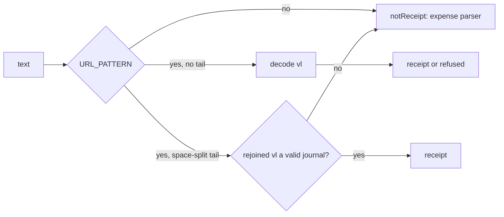

# 0018: A Latin note after a receipt link, the caps-dropped screen test, and a link checker that reads only tracked docs

> **Status:** done (2026-10-01): built as planned, no findings, v0.9.2
> **Created:** 2026-10-01
> **Related ADRs:** [ADR-0018](../../adrs/0018-receipts-record-offline-enrich-async.md)

## TL;DR

This plan closes Plan 0016's open nits and conductor followup F21. After it, a pasted SUF link
followed by a Latin note (`<link> kafa`) goes to the expense parser instead of being refused as
«ссылка повреждена». A bot-level test pins the «Лимиты по категориям сброшены» line on the budget
screen. `scripts/check-doc-links.mjs` checks only the markdown git tracks or would track, so
gitignored conductor state can't fail it. This is a fix-only plan: a patch bump to v0.9.2.

## Context & problem

- **0016 nit 1.** `rsUrl.ts`'s `URL_PATTERN` accepts space-separated tail tokens of base64
  characters. It needs them because form-style decoding turns a `+` inside `vl` into a space.
  A Latin word like `kafa` or `lunch` is all base64 characters, so it joins `vl`, the MD5 check
  fails, and the user is told the link is damaged. Plan 0014 Phase 1's rule is that a link next to
  other words is not a receipt. Users in Serbia and Montenegro mostly type Latin.
- **0016 nit 2.** Only the service test covers `droppedCapsCurrency`. Dropping the argument in
  `src/bot/flows.ts` (`answerFlow`'s `'set'` case) would pass the whole suite.
- **F21.** `check-doc-links.mjs` walks the filesystem. In the main checkout it reads the
  gitignored `tools/conductor/state/`. Review prose there (`[Повторить]: the …`) parses as a link
  reference definition and fails the check. CI and lanes have no `state/`, so only the architect's
  close step in the main checkout sees it.

0016 nit 3 needs no work: the toast assertion defends the double tap.

## Decision

- **Decide the space-split tail by the journal, not the characters.** When the query has a
  space-split tail, `decodeRsUrl` decodes the rejoined `vl`. A valid journal is a receipt.
  Anything else is `notReceipt`, never `malformed`, because a space-split tail can't tell a broken
  link from a note. A link with no tail keeps today's behavior, so a truncated link is still
  refused as `malformed`.
- **List files through git.** The checker reads
  `git ls-files --cached --others --exclude-standard '*.md'`, so a new untracked plan is still
  checked and gitignored files never are.

We rejected recording the receipt when a valid link carries a note. That would reverse Plan 0014
Phase 1's rule, and the note would be lost anyway, because a receipt's description comes from
the shop.

## Architecture diagram

## Implementation phases

### Phase 1: A Latin note after a SUF link is not a receipt
- **Owner skill:** dev
- **What:** `decodeRsUrl` applies the rule in Decision. The match keeps accepting the
  space-split tail. Only the outcome of a failed decode changes when a tail was present.
- **Files touched:** `src/domain/receipts/rsUrl.ts` (+ test), `src/bot/bot.test.ts`.
- **Done when:**
  - `rsUrl.test.ts`: these all return `{ kind: 'notReceipt' }`: `buildRsUrl() + ' kafa'`,
    `buildRsUrl() + ' lunch'`, `buildRsUrl() + ' kafa i sok'`, and `buildRsUrl() + ' abcd'`.
  - The existing space-in-`vl` case (every `+` in the link replaced by a space) still decodes to
    `82912` minor `RSD`. A link truncated by 10 characters with no tail is still
    `{ kind: 'refused', reason: 'malformed' }`. The other existing refusal tests pass unmodified.
  - `bot.test.ts`: in DM, `<link> kafa` creates no receipt row and no expense, and the reply isn't
    the damaged-link copy from `messages`.

### Phase 2: The budget screen shows the caps-dropped line
- **Owner skill:** dev
- **What:** a bot-level test only. No production change unless the test exposes a defect.
- **Files touched:** `src/bot/bot.test.ts`.
- **Done when:** in DM, the test runs these steps: set a limit of `30000` (RUB), cap
  «Кафе и рестораны» at `5000`, switch the default currency to EUR through `/settings`, then set
  the limit `1000`. The edited anchor text starts with
  `Лимиты по категориям сброшены: они были в RUB.` Removing the dropped currency from the call in
  `answerFlow`'s `'set'` case makes the test fail. Check this by hand once, revert, and note it in
  the log.

### Phase 3: The link checker reads only what git tracks or would track
- **Owner skill:** dev
- **What:** `markdownFiles` comes from
  `git ls-files -z --cached --others --exclude-standard -- '*.md'`, run at the repository root,
  instead of a directory walk. `SKIP_DIRS` goes away. Output and exit codes are unchanged.
- **Files touched:** `scripts/check-doc-links.mjs`, `scripts/check-doc-links.test.mjs` (new).
- **Done when:** `check-doc-links.test.mjs` runs the script in a temporary git repository with
  four markdown files:
  - a tracked file with a broken link: it exits 1 and names that file;
  - an untracked file that isn't ignored, with a broken link: it's reported too;
  - a gitignored file with a broken link: it's not reported;
  - a tracked file whose links resolve: it exits 0 once the broken ones are fixed.

  In the main checkout, `node scripts/check-doc-links.mjs` exits 0 with `tools/conductor/state/`
  present. `node --test "scripts/*.test.mjs"` passes, as CI runs it.

## Data shapes

None.

## Risks & open questions

- **Phase 1 changes what a damaged link with a tail answers**: «not a receipt» instead of
  «damaged». Without the tail, a damaged link is still refused as damaged, which is the common
  paste.
- **Phase 3 needs `git` on the PATH** wherever the checker runs. It's already a hard dependency of
  every checkout, CI and the conductor.

## What this plan does NOT do

- Record a receipt from a valid link that carries a note (see Decision).
- 0016 nit 3: the double-tap test stays as it is.
- Montenegrin links: `meUrl.ts` ends its match at whitespace and never had this problem.

## Implementation log

> Written by `dev`: one row per phase as its commit lands, then the close block. **The phases
> above are the contract. This section records what happened.** Observations, never conclusions:
> no pass list, no self-assessment. Deviations and unmet done-whens are **always** disclosed.
> Keep it shorter than `## Implementation phases`.

| phase | owner | state | commit |
|---|---|---|---|
| 1: A Latin note after a SUF link is not a receipt | dev | done | 63e678d |
| 2: The budget screen shows the caps-dropped line | dev | done | 6172cc4 |
| 3: The link checker reads only tracked docs | dev | done | 4057d61 |

### Notes

- Phase 2: the test switches the default currency to RUB through `/settings` first (the
  harness default is RSD), and re-opens `/budget` before tapping the cap, as the existing cap
  tests do. The edited anchor reads the dropped line, a blank line, then the screen.
- Phase 2: with `result.droppedCapsCurrency` removed from the `budgetView` call in
  `src/bot/flows.ts`, the test failed (the anchor started with `<b>Бюджет`); reverted with
  `git checkout -- src/bot/flows.ts`.
- Phase 3: the main checkout is outside the lane, so the "exits 0 with `tools/conductor/state/`
  present" check ran in the lane instead: with a gitignored
  `tools/conductor/state/scratch-review.md` holding `[Повторить]: the …` and a broken link,
  `node scripts/check-doc-links.mjs` exited 0 (136 links); the scratch file was then removed.
- Phase 3: `prettier --write` reformatted the whole of `scripts/check-doc-links.mjs` (double to
  single quotes); lint-staged's `prettier --check` failed on it otherwise.
- Phase 3: the four markdown cases run as two tests over one layout (all broken, then the
  tracked and untracked ones fixed). The test strips `GIT_*` from the environment of the
  temporary repository's git.

### Close triggers

- **What shipped:** `decodeRsUrl` answers `notReceipt` for a SUF link whose space-split tail
  breaks the journal (63e678d); a bot test for the caps-dropped line
  (6172cc4); `check-doc-links.mjs` lists files through `git ls-files`, with
  `scripts/check-doc-links.test.mjs` (4057d61).
- **User-visible surface changed:** a pasted SUF link followed by a note such as `kafa` goes to
  the expense parser instead of the «ссылка повреждена» refusal. No copy changed.
- **Gate at the tip:** `pnpm typecheck` exit 0; `pnpm lint` exit 0; `pnpm test` exit 0, 57
  files, 768 tests; `pnpm build` exit 0; `node --test "scripts/*.test.mjs"` exit 0, 5 tests;
  `node scripts/check-doc-links.mjs` exit 0, 136 links.
- **Outstanding `human` phases:** none.

## Close review

The round 1 review at tip `e268100`, in full:

> **Verdict:** clean. All three phases landed as planned, every named test defends its done-when,
> and the gate is green at the tip, so the plan can close as a patch release.
>
> **Gate (run in the lane at e268100).** `pnpm typecheck` exit 0; `pnpm lint` exit 0; `pnpm test`
> exit 0, 57 files, 768 tests; `node --test "scripts/*.test.mjs"` exit 0, 5 tests (2 new in
> `scripts/check-doc-links.test.mjs`); `node scripts/check-doc-links.mjs` exit 0, 136 links.
>
> **Lens 1: alignment.**
>
> - **Phase 1 (63e678d).** `decodeRsUrl` (`src/domain/receipts/rsUrl.ts:36-50`) turns a
>   `malformed` refusal into `notReceipt` when the query has a space-split tail. The Decision says
>   "anything else is `notReceipt`", and the code maps only `malformed`. These are the same thing
>   in practice. An appended note either breaks the base64 length or shape, or changes the bytes
>   under the MD5. Both give `malformed`. A non-`malformed` refusal (`refund`, `notSale`,
>   `fractionalTotal`) needs a valid MD5, which means a valid journal. The Decision files that
>   case under "a valid journal is a receipt", so a refund behind a split `+` is still refused
>   correctly.
>   - `rsUrl.test.ts:106-111`: `' kafa'`, `' lunch'`, `' kafa i sok'` and `' abcd'` each
>     `toEqual({ kind: 'notReceipt' })`. `' abcd'` is the interesting case: `+abcd` keeps the
>     length a multiple of 4 and passes the shape check, so it exercises the MD5 path.
>   - `rsUrl.test.ts:79-96`: the space-for-`+` case is unchanged and still decodes to `82912`
>     `RSD`.
>   - `rsUrl.test.ts:113-118`: a link truncated by 10 characters with no tail gives
>     `{ kind: 'refused', reason: 'malformed' }`.
>   - The other refusal tests are unmodified; the diff only adds lines.
>   - `bot.test.ts:3612-3620`: no receipt row, no expense, and `sentTexts` does not contain
>     `messages.receiptRefused.malformed`. The handler sends exactly that value (`receipt.ts:38`),
>     and the sibling test at `bot.test.ts:3598` uses the same comparison with `toEqual`. So the
>     negative assertion is not vacuous.
> - **Phase 2 (6172cc4).** `bot.test.ts:2005-2035` follows the planned steps. The limit is
>   `30000` (RUB), the cafe cap is `5000`, and the cap row is checked as `500_000`. Then the test
>   switches to EUR through `/settings`, sets the limit `1000`, and asserts: the edit lands on the
>   anchor (`message_id: 105`); the text matches
>   `^Лимиты по категориям сброшены: они были в RUB\.\n\n<b>Бюджет …`; the caps table is empty.
>   The log discloses two harness-driven extra steps (switch to RUB first, re-open `/budget`
>   before the cap) and the hand mutation check: dropping the argument makes the anchor start
>   with `<b>Бюджет`, and the change was reverted. Neither step weakens the claim.
>   `src/bot/flows.ts` is unchanged at the tip.
> - **Phase 3 (4057d61).** `markdownFiles` runs
>   `git ls-files -z --cached --others --exclude-standard -- '*.md'` at the root, `SKIP_DIRS` is
>   gone, and output and exit codes are the same. The `existsSync` filter covers a tracked file
>   deleted from the working tree. `scripts/check-doc-links.test.mjs` covers all four planned
>   cases over one layout. Test 1: exit 1, the tracked and untracked files are named, the count is
>   exactly 2, and nothing ignored appears. Test 2: exit 0 once both are fixed, while the ignored
>   file stays broken. Stdout is exactly `4 relative link(s) resolve.` CI runs this test through
>   `.github/workflows/deploy.yml:36`. The "main checkout with `tools/conductor/state/` present"
>   check ran in the lane with a gitignored scratch file instead. The log discloses this.
> - No ADR was reversed. ADR-0018's offline decode is unchanged. The implementation log is
>   shorter than the phases section, and it discloses its deviations.
>
> **Lens 2: layering.** The domain change is pure: no I/O and no framework. The bot change is
> test-only. There is no new copy, so the messages module is untouched.
>
> **Lens 3: correctness.** No money arithmetic changed. No clock in the domain. Idempotency is
> unaffected: a `notReceipt` goes to the existing expense path. The new test files hold no user
> data; the Latin notes are generic words.
>
> **Lens 4: docs freshness.** The user-visible change: a link with a note now goes to the expense
> parser instead of being refused. No command, default, env var or copy changed. `CLAUDE.md`
> still describes `scripts/check-doc-links.mjs` accurately. Nothing outside plans mentions
> `SKIP_DIRS` or the old directory walk.
>
> **Findings.** blocker: none. major: none. minor: none. nit: none.
>
> **Bookkeeping owed at close.** Flip the status and move the plan, repairing links; run the
> checker in the main checkout with `tools/conductor/state/` present; mark F21 closed in
> `tools/conductor/FOLLOWUPS.md`; refresh `docs/plans/README.md`; patch bump to v0.9.2 with the
> `CHANGELOG.md` and `versionAnnouncements` entries; no paired ADR to accept.

No earlier round raised a finding, so no fix commit is named here. The close ran in the lane, not
the main checkout: the checker's run with the main checkout's `tools/conductor/state/` present is
settled when the conductor merges this branch and the next close runs the checker there.

## Followups
