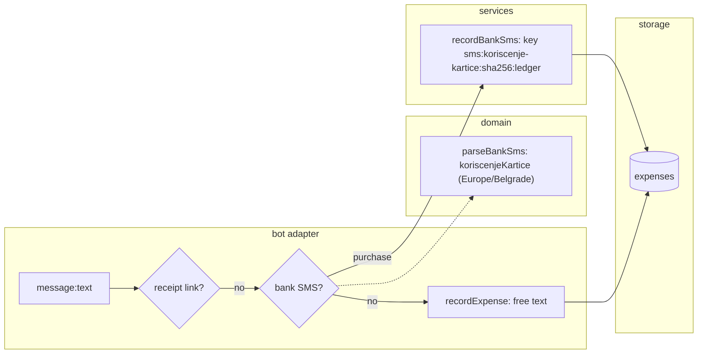

# 0021: A pasted Serbian card-purchase SMS records the purchase

> **Status:** done (2026-10-01): built as planned, no findings, Phase 3 real-SMS check passed, v0.10.0
> **Created:** 2026-10-01
> **Related ADRs:** [ADR-0021](../../adrs/0021-bank-sms-template-parsers-plain-expense.md) (per-template
> parser, plain expense keyed by content), [ADR-0003](../../adrs/0003-currency-conversion-at-report-time.md)
> (store the original currency), [ADR-0004](../../adrs/0004-amount-parsing-rule.md) (structured
> sources parse exactly)

## TL;DR

A user pastes or forwards their bank's card-purchase SMS (`Koriscenje kartice …`, `Datum:`,
`Iznos:`, `Raspolozivo:`, `Mesto:`) into the private chat. Today the bot answers with `/help`.
After this plan it records one expense in the charged amount and currency, dated the purchase's
local day, described by the merchant, and shows the usual expense card. The same SMS pasted
again answers «Уже записано». Only this one template is read. Other banks come in later plans,
one parser each.

## Context & problem

Bank SMS parsing has been on the roadmap since Plan 0001 (item 6, "per-bank regex templates, one
pure parser per bank, synthetic fixtures only") and was deferred again by Plan 0009. The user
just pasted a real card-purchase SMS and got `/help` back. Its shape, with synthetic values:

```text
Koriscenje kartice 1234**5678
Datum: 15.09.2026 00:30:00
Iznos: 6,00 USD
Raspolozivo: 1.234,56 RSD
Mesto: EXAMPLE.COM +100000 NL
```

Things the free-text parser can't handle: the amount is on its own labelled line, there's a second
amount (the balance), the charge currency (USD) differs from the card's (RSD), and the date is the
bank's local wall time, not the moment of pasting.

## Decision

Per ADR-0021: a pure parser in `src/domain/bankSms/` recognises the template by its header line
and reads the labelled lines exactly. A new `recordBankSms` service records an ordinary expense
whose `source_key` is a hash of the SMS's content, so a re-paste dedupes. `Datum` is read as
Europe/Belgrade wall time (the template is Serbian), turned into a UTC instant, and dated in the
ledger's effective timezone, the same way receipts date their issue instant. The text handler
tries the bank SMS parser after the receipt-link decoder and before the free-text parser.

We rejected a `bank_sms` side table (it stores the card suffix for no requested feature), loose
any-bank extraction (it can't tell the charge from the balance), and dedupe on the Telegram
message id (a re-paste would record twice). ADR-0021 holds the reasons.

## Architecture diagram



## Implementation phases

### Phase 1: A pasted SMS records the purchase, once
- **Owner skill:** dev
- **What:**
  - `src/domain/bankSms/koriscenjeKartice.ts` parses the template. The first non-blank line
    matches `Koriscenje kartice` or `Korišćenje kartice`, case-insensitive, followed by the card
    mask. Lines split on `\n` or `\r\n`, are trimmed, and blank ones are skipped. Labelled lines are
    found by label (case-insensitive, any order, with or without diacritics). `Datum`, `Iznos` and
    `Mesto` are required. `Raspolozivo` and unknown lines are ignored.
  - `Datum: DD.MM.YYYY HH:MM:SS` is Europe/Belgrade wall time, built with `TZDate` and returned as
    a UTC `Date`.
  - `Iznos: <amount> <CODE>`: the amount is digits, either plain or dot-grouped in threes, then a
    comma and exactly two digits. It goes through `minorFromDecimal` after the dots are dropped
    and the comma becomes a dot. The code goes through `toCurrencyCode`.
  - The description is the `Mesto` value with runs of whitespace collapsed, then one trailing
    two-letter uppercase token removed, then trailing tokens of the form `+<digits>` removed. If
    that leaves nothing, the whole collapsed value is used.
  - The parser returns `{ kind: 'purchase', template: 'koriscenje-kartice', issuedAt, amountMinor,
    currency, description, fingerprint }`, where `fingerprint` is the SHA-256 hex of the card
    mask, `issuedAt` as ISO, `amountMinor`, `currency` and the collapsed `Mesto` value. Text
    without the header returns `{ kind: 'notBankSms' }`.
  - `src/domain/bankSms/index.ts` exports `parseBankSms(text)`, which tries each template in
    turn.
  - `src/services/recordBankSms.ts` mirrors `recordReceipt`. It uses the source key
    `sms:<template>:<fingerprint>:<ledgerId>`, returns the stored expense on a seen key (a
    duplicate), and dates the expense `localDateOf(issuedAt, effectiveTimezone)`. The category
    comes from `suggestCategory` with the description and the history category of its
    `descriptionKey`, as in `recordExpense`. It logs `bank sms recorded` at info with
    `expenseId`, `userId` and `template` only.
  - `src/bot/handlers/text.ts` calls `parseBankSms` after `decodeReceiptUrl`. A purchase replies
    with the expense card, or with `alreadyRecorded(card)` on a duplicate.
    `messages.receiptAlreadyRecorded` is renamed `alreadyRecorded` and used by both paths.
- **Files touched:** `src/domain/bankSms/koriscenjeKartice.ts`,
  `src/domain/bankSms/koriscenjeKartice.test.ts`, `src/domain/bankSms/index.ts`,
  `src/domain/bankSms/types.ts`, `src/domain/bankSms/testing/buildKoriscenjeSms.ts`,
  `src/services/recordBankSms.ts`, `src/services/recordBankSms.test.ts`,
  `src/bot/handlers/text.ts`, `src/bot/handlers/receipt.ts`, `src/bot/messages.ts`,
  `src/bot/bot.test.ts`.
- **Done when:**
  - The synthetic SMS from Context parses to `amountMinor: 600`, `currency: 'USD'`,
    `description: 'EXAMPLE.COM'` and `issuedAt` equal to `2026-09-14T22:30:00Z` (00:30 CEST is
    UTC+2).
  - `Datum: 15.01.2027 00:30:00` parses to `2027-01-14T23:30:00Z` (CET is UTC+1).
  - The amount table: `6,00 USD` is 600 USD. `1.234,56 RSD` is 123456. `1234,56 RSD` is 123456.
    `12.345.678,90 RSD` is 1234567890. `1.500,00 JPY` is 1500 JPY.
  - The parse uses the `Iznos` line, never `Raspolozivo`. An SMS whose balance reads
    `9.999,99 EUR` still parses to 600 USD.
  - Description cleanup: `EXAMPLE SHOP +381000000 RS` gives `EXAMPLE SHOP`. `KAFE 24 BEOGRAD RS`
    gives `KAFE 24 BEOGRAD` (a plain number stays). `RS` alone gives `RS`.
  - The header with diacritics (`Korišćenje kartice`), and the same SMS with `\r\n` line ends or
    extra blank lines, all give the same `fingerprint` as the plain version.
  - `450 кофе`, a receipt link, and a text that only mentions `kartice` on its second line are
    `notBankSms`.
  - In `bot.test.ts`, pasting the synthetic SMS in DM, for a ledger in Europe/Belgrade with the
    message sent at `2026-09-15T08:00:00Z`, records one expense with `amount_minor = 600`,
    `currency = 'USD'`, description `EXAMPLE.COM` and `occurred_on = '2026-09-15'`. The bot
    answers with the expense card. Pasting it again, as a new message, leaves one row and answers
    `Уже записано.` plus the card.
  - The same paste into a ledger in America/New_York (EDT, UTC-4) records
    `occurred_on = '2026-09-14'`, because 22:30 UTC is 18:30 on the 14th there.
  - After the user moves the first `EXAMPLE.COM` expense to another category, a second, different
    SMS from the same merchant lands in that category.
  - The receipt duplicate test still answers `Уже записано.` through the renamed key.

### Phase 2: Refusals, /help and README
- **Owner skill:** dev
- **What:**
  - If the header matches but a required line is missing or unreadable, the parser returns
    `{ kind: 'refused', reason: 'malformed' }`. That covers a bad date, an amount that breaks the
    pattern, a zero amount, or fraction digits the currency can't hold. A three-letter uppercase
    code not in the currency table returns `{ kind: 'refused', reason: 'unsupportedCurrency',
    code }`. Nothing is recorded in either case, and the free-text parser is not tried.
  - `recordBankSms` returns `futureSms` when the SMS's local date is after the local date the
    message was sent, as `recordReceipt` does.
  - New copy in `messages.ts`:
    - `bankSmsRefused.malformed`: «Похоже на СМС банка о покупке, но прочитать его не удалось.
      Ничего не записано. Отправьте сумму текстом, например «450 кофе».»
    - `bankSmsRefused.unsupportedCurrency(code)`: «В СМС валюта ${code}, её я пока не знаю.
      Ничего не записано.»
    - `bankSmsFuture`: «Дата в СМС ещё не наступила. Ничего не записано.»
    - A `/help` line after the receipts line: «СМС банка о покупке картой: перешлите или вставьте
      его текст, и я запишу сумму, дату и магазин. Пока понимаю сербские СМС «Korišćenje
      kartice».»
  - `README.md` gains a `### Bank SMS` section after Receipts. It covers which template is read,
    that the charged currency is stored, that the date comes from the SMS in your timezone, that a
    re-paste dedupes, and that groups ignore it.
- **Files touched:** `src/domain/bankSms/koriscenjeKartice.ts`,
  `src/domain/bankSms/koriscenjeKartice.test.ts`, `src/domain/bankSms/types.ts`,
  `src/services/recordBankSms.ts`, `src/services/recordBankSms.test.ts`,
  `src/bot/handlers/text.ts`, `src/bot/messages.ts`, `src/bot/bot.test.ts`, `README.md`.
- **Done when:**
  - These are `malformed`: an `Iznos` of `0,00 RSD`, `6.00 USD`, `6,0 USD`, `1.23,45 RSD` or
    `1.500,50 JPY`. So are a missing `Mesto` line and `Datum: 31.02.2026 10:00:00`.
  - `Iznos: 6,00 XYZ` is `unsupportedCurrency` with `code: 'XYZ'`.
  - In `bot.test.ts`, each refusal answers its exact message and leaves `expenses` empty. A
    malformed SMS doesn't fall through to `/help` or the invalid-amount reply.
  - An SMS dated `16.09.2026 10:00:00` (08:00 UTC on the 16th), pasted at `2026-09-15T08:00:00Z`
    into a Europe/Belgrade ledger, answers `bankSmsFuture` and records nothing. An SMS dated
    `15.09.2026 00:30:00`, pasted at `2026-09-14T22:40:00Z` (00:40 on the 15th in Belgrade),
    records with `occurred_on = '2026-09-15'`.
  - `/help` contains the new line, and the `messages` tests still pass on it.

### Phase 3: Paste the real SMS into the deployed bot
- **Owner skill:** human
- **Blocks merge:** no
- **What:** After deploy, paste or forward the card-purchase SMS from the screenshot that started
  this plan, then paste it once more.
- **Files touched:** none.
- **Done when:** The first paste records the charged amount in USD, dated the purchase day, with
  the merchant as description. The second answers «Уже записано». The user notes the outcome in
  the Implementation log.

## Data shapes

No schema change. The `source_key` gains a third family next to `tg:` and `rcpt:`.

```ts
// illustrative
type BankSmsResult =
  | {
      kind: 'purchase';
      template: 'koriscenje-kartice';
      issuedAt: Date; // UTC instant from the bank's wall time
      amountMinor: number; // integer, > 0
      currency: CurrencyCode;
      description: string;
      fingerprint: string; // sha256 hex of the normalised fields
    }
  | { kind: 'refused'; reason: 'malformed' }
  | { kind: 'refused'; reason: 'unsupportedCurrency'; code: string }
  | { kind: 'notBankSms' };

// source_key: `sms:koriscenje-kartice:<fingerprint>:<ledgerId>`
```

## Risks & open questions

- **Money.** The amount goes through `minorFromDecimal`, so there are no floats. The balance line
  is never parsed as an amount.
- **Time.** The bank's timezone is assumed to be Europe/Belgrade (unverified, but it's a Serbian
  bank and an RSD card). At the October fall-back, a wall time between 02:00 and 03:00 is
  ambiguous, and `TZDate` picks one offset. An hour's error there can't change the local date in
  Belgrade. Elsewhere it could only matter for a ledger whose midnight falls in that hour.
- **Idempotency.** The key is the content, so a Telegram redelivery and a re-paste both dedupe.
  Two genuinely identical purchases in the same second record once (ADR-0021).
- **Privacy.** The card mask and the balance are neither stored nor logged, and the merchant is
  stored only as the description. The fixtures are synthetic (`1234**5678`, `EXAMPLE.COM`). The
  real SMS stays out of the repo.
- **Plan 0019 (approved, not built) adds sealing to `recordExpense` and `recordReceipt`.**
  `recordBankSms` is a third record path. Whichever plan lands second must route it through the
  sealing seam. Plan 0019's risks carry the same note. The hashed key's low entropy is a
  Plan 0019 concern (ADR-0021, Negative).
- **A pending flow takes the text first.** An SMS pasted while, say, the edit-amount prompt is
  open is the flow's answer, as a receipt link is today (ADR-0009 routing). That's unchanged.

## What this plan does NOT do

- Other banks or other kinds of SMS from this bank (refunds, declines, ATM withdrawals, top-ups).
  Each needs a sample and a parser, in a later plan.
- Phone automation (an SMS forwarder posting to the bot). The content key already dedupes it, but
  delivery is a later plan.
- Several SMS in one message. Only a message that is one SMS is read.
- Bank SMS in groups. The group text path is unchanged.
- Converting the USD charge to RSD. That's the FX plan (ADR-0003).

## Implementation log

> Written by `dev`: one row per phase as its commit lands, then the close block. **The phases
> above are the contract. This section records what happened.** Observations, never conclusions:
> no pass list, no self-assessment. Deviations and unmet done-whens are **always** disclosed.
> Keep it shorter than `## Implementation phases`.

| phase | owner | state | commit |
|---|---|---|---|
| 1: A pasted SMS records the purchase, once | dev | done | `925aeee` |
| 2: Refusals, /help and README | dev | done | `5929349` |
| 3: Paste the real SMS into the deployed bot | human | done | (no commit) |

### Notes

- Phase 1: a header line followed by a body that can't be read returns `notBankSms`, which falls
  through to the free-text parser. Phase 2 turns these into refusals.
- Phase 1: a re-paste logs `duplicate bank sms` at info, with the same fields as
  `bank sms recorded` (`expenseId`, `userId`, `template`).
- Phase 2: the `/help` line is asserted in `bot.test.ts` (a `/help` reply), not in
  `messages.test.ts`, which is outside `Files touched`.

### Close triggers

- **What shipped:** `src/domain/bankSms/` (`parseBankSms`, the `koriscenjeKartice` parser, its
  types and a synthetic SMS builder), the `recordBankSms` service with source key
  `sms:<template>:<fingerprint>:<ledgerId>`, and the text handler trying it after the receipt-link
  decoder. `messages.receiptAlreadyRecorded` is renamed `alreadyRecorded` and used by the receipt
  and bank SMS paths. No schema change, no new dependency.
- **User-visible surface changed:** in DM, a pasted `Koriscenje kartice` SMS records an expense
  and replies with the expense card. A re-paste replies «Уже записано.» plus the card. New
  replies: `bankSmsRefused.malformed`, `bankSmsRefused.unsupportedCurrency(code)`,
  `bankSmsFuture`. `/help` has one new line, and `README.md` has a `### Bank SMS` section.
- **Gate at the tip:** `pnpm typecheck` exit 0; `pnpm lint` exit 0; `pnpm test` exit 0, 59 files,
  829 tests; `pnpm build` exit 0; `node --test "tools/conductor/test/*.test.mjs"` exit 0, 236
  tests; `node --test ".claude/hooks/*.test.mjs"` exit 0, 31 tests;
  `node scripts/check-doc-links.mjs` exit 0.
- **Outstanding `human` phases:** none. Phase 3 passed on 2026-10-01: the user reports the
  smoke test on the deployed bot passed.

## Followups
