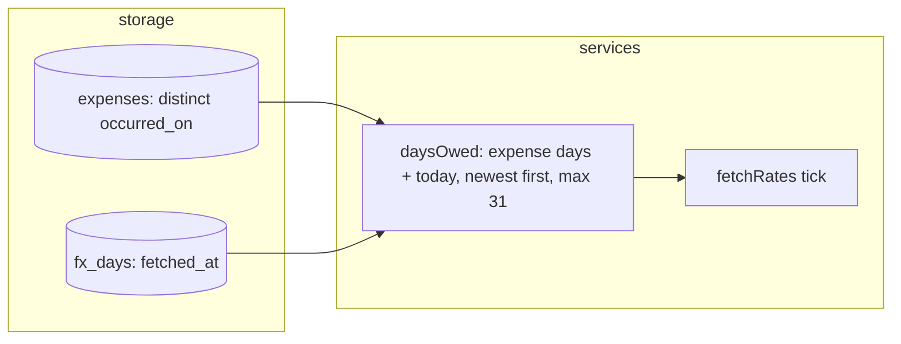

# 0023: The rate worker fetches only expense days, newest first

> **Status:** done (2026-10-01): built as planned, one nit open, Phase 2 live check owed, v0.11.1
> **Created:** 2026-10-01
> **Related ADRs:** [ADR-0022](../../adrs/0022-fx-nbs-middle-rate-ledger-currency.md) (NBS middle
> rate, the worker)

## TL;DR

The NBS rate worker fetches the days that have an expense, plus today, newest first. It no longer
fetches every calendar day from the earliest expense onward, oldest first. On the deployed bot,
the first tick after the deploy then covers the whole history, and this week's totals show one
`≈` total right after the deploy instead of hours later.

## Context & problem

Plan 0022 Phase 1 owed every calendar day from the earliest expense's `occurred_on` through
today, oldest first, at most 31 per tick. On the deployed bot (checked 2026-10-01), the earliest
expense is dated 2026-07-31, and the expenses fall on 5 distinct days. The boot tick fetched
31 July to 30 August (`fetched: 31, failed: 0`), and /week and /month for the current period
showed `Без курса НБС, не пересчитано: EUR, USD.` They wait for two more hourly ticks. Most of
those requests fetch lists for days with no expense. One backdated expense pushes the current
week's rates back by an hour per 31 days of history. The Plan 0022 close review saw the cap and
called it harmless. It wasn't.

## Decision

A tick owes the distinct `occurred_on` days of non-deleted expenses, in any ledger, up to
Belgrade's today, plus Belgrade's today. The refetch rule is unchanged: a day is owed if it has
no `fx_days` row, or if its row was fetched on or before that same Belgrade date. Owed days are
fetched newest first, still at most 31 per tick. Today is always a candidate, so an expense
recorded between ticks has a row for its day, or one at most 4 days back for the borrow
(ADR-0022).

We rejected two other fixes. Keeping every calendar day but fetching newest first fixes the
symptom but still spends requests on days that need no rate. Raising the cap leaves the order
wrong and the waste in place. Neither choice is in an ADR: ADR-0022 doesn't name which days the
worker fetches, so no ADR changes.

## Architecture diagram

## Implementation phases

### Phase 1: Owe expense days and today, newest first
- **Owner skill:** dev
- **What:**
  - `src/db/fxRates.ts`: `earliestExpenseDay` becomes `expenseDaysThrough(db, today)`: the
    distinct `occurred_on` of non-deleted expenses in any ledger, on or before `today`.
    `listFxDayFetches` returns the fetch instants of the given days (or keeps its range form;
    the dev's choice).
  - `src/services/fetchRates.ts`: `daysOwed` takes those days plus Belgrade's today, keeps the
    owed ones by the unchanged refetch rule, sorts them newest first and takes at most
    `MAX_DAYS_PER_TICK`. The comments on `daysOwed` and `RateListFetcher` say so.
- **Files touched:** `src/db/fxRates.ts`, `src/db/fxRates.test.ts`, `src/services/fetchRates.ts`,
  `src/services/fetchRates.test.ts`.
- **Done when:** (all at 10:00 in Belgrade, `now` = 08:00Z, with the existing weekend fake that
  answers 26 and 27 September with the 25th's list)
  - With one expense on 2026-09-26 and an empty table, a tick on 2026-09-28 asks exactly
    `['2026-09-28', '2026-09-26']`. `fx_days` maps 26 -> 25 and 28 -> 28, and holds no row for
    the 27th.
  - With expenses on 2026-07-31 and 2026-09-28 and an empty table, a tick on 2026-10-01 asks
    exactly `['2026-10-01', '2026-09-28', '2026-07-31']`. This is the deployed bot's shape.
  - The refetch rule holds. After a tick on the 28th with expenses on the 26th and 28th, a
    second tick that day (20:00Z, 22:00 in Belgrade) asks only `['2026-09-28']`. A tick on the
    29th asks `['2026-09-29', '2026-09-28']`. A further tick on the 29th asks only
    `['2026-09-29']`.
  - With one expense on each of the 40 days 2026-08-20 to 2026-09-28 (12 in August, 28 in
    September) and an empty table, a tick on the 28th asks 31 days: 28 September down to
    29 August. A second tick that day asks 10: `2026-09-28`, then 28 August down to 20 August.
  - A deleted expense's day isn't asked. An expense dated after Belgrade's today (a far-east
    ledger's tomorrow) isn't asked.
  - The existing failure test still holds: a failed day is left without a row and the tick moves
    on.

### Phase 2: Check the deployed worker
- **Owner skill:** human
- **Blocks merge:** no
- **What:** After the deploy, read the boot tick's `fx tick done` line and open /week. This also
  settles Plan 0022 Phase 4.
- **Files touched:** none.
- **Done when:** The boot tick logs `failed: 0`. /week shows one `≈` RSD total. One USD or EUR
  expense matches the NBS list for its day on nbs.rs (amount times middle rate, to the para),
  noted in this plan's Implementation log.

## Data shapes

No schema change. Days fetched under Plan 0022's rule (every calendar day) keep their rows.
Nothing deletes them, and they cost nothing.

## Risks & open questions

- **Time.** "Today" stays Belgrade's. An expense dated ahead of Belgrade borrows today's row,
  as before.
- **A backdated expense on a day with no row**, more than 4 days from any stored row, shows
  unconverted until the next hourly tick. That was already true for one before the earliest
  expense. Kicking the worker on record is out of scope.
- **Privacy.** The query reads only `occurred_on`. Logs stay days and counts.

## What this plan does NOT do

- Kick the worker when an expense is recorded or edited onto a day with no rate.
- Change the cap, the tick interval or the borrow window.
- Prune `fx_days` rows for days with no expense.

## Implementation log

> Written by `dev`: one row per phase as its commit lands, then the close block. **The phases
> above are the contract. This section records what happened.** Observations, never conclusions:
> no pass list, no self-assessment. Deviations and unmet done-whens are **always** disclosed.
> Keep it shorter than `## Implementation phases`.

| phase | owner | state | commit |
|---|---|---|---|
| 1: Owe expense days and today, newest first | dev | done | `2b5c8a9` |
| 2: Check the deployed worker | human | pending | (no commit) |

### Notes

- Phase 1: `listFxDayFetches` keeps its range form, called over the oldest candidate through
  today.
- Phase 1: the failure test fails 2026-09-28 (today, asked first) instead of 2026-09-27, which is
  no longer asked. It asserts `{ fetched: 1, failed: 1 }` and a row for the 26th only.
- Phase 1: with no expense at all, a tick now asks today (it used to ask nothing).

### Close triggers

- **What shipped:** `src/db/fxRates.ts` has `expenseDaysThrough(db, today)` (distinct
  `occurred_on` of non-deleted expenses through `today`) in place of `earliestExpenseDay`.
  `daysOwed` in `src/services/fetchRates.ts` owes those days plus Belgrade's today, newest first,
  at most 31. No schema change, no new dependency.
- **User-visible surface changed:** none in chat copy. After a deploy the first tick fetches
  rates for the expense days, newest first, so recent totals convert on the boot tick.
- **Gate at the tip:** `pnpm typecheck` exit 0; `pnpm lint` exit 0; `pnpm test` exit 0, 64 files,
  884 tests; `pnpm build` exit 0; `node --test "tools/conductor/test/*.test.mjs"` exit 0,
  236 tests; `node --test ".claude/hooks/*.test.mjs"` exit 0, 31 tests;
  `node scripts/check-doc-links.mjs` exit 0.
- **Outstanding `human` phases:** Phase 2 (check the deployed worker; does not block merge).

## Followups
