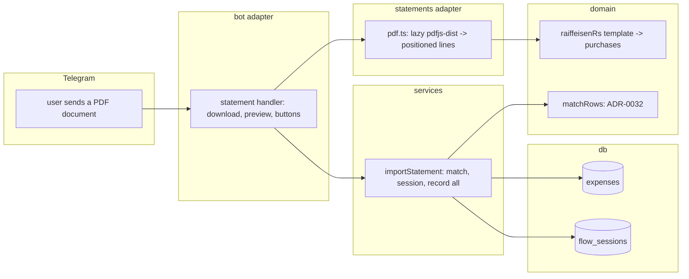

# 0027: Bank statement import: a Serbian bank's export file becomes expenses

> **Status:** done (2026-10-06): built as planned, two minors open, Phase 5 real statement owed, v0.18.0
> **Created:** 2026-10-01
> **Depends on:** [Plan 0019](0019-encrypted-personal-ledger.md) (sealed ledgers in Phase 4)
> **Related ADRs:** [ADR-0032](../../adrs/0032-statement-rows-match-recorded-expenses.md) (matching rows to recorded expenses),
> [ADR-0033](../../adrs/0033-pdf-statements-via-pdfjs-dist.md) (PDF via `pdfjs-dist`),
> [ADR-0021](../../adrs/0021-bank-sms-template-parsers-plain-expense.md) (bank SMS: original amount, plain expense),
> [ADR-0008](../../adrs/0008-category-suggestion-from-history.md) (categories)

## TL;DR

The user sends the bot a Raiffeisen banka Srbija account statement PDF («Izvod po tekućem
računu»). The bot reads its card purchases and sets aside the ones already recorded (by hand,
from a receipt or from the bank's SMS: same amount and currency within a day, ADR-0032). It
answers with one preview: «Найдено 24 покупки: 19 новых, 5 уже записаны», with the new ones paged
below, [Записать все (19)], [Записать и уже записанные] and [Отмена]. A tap records them as
ordinary expenses in their original currency, with categories from history. Sending the same file
again records nothing. The first thing the user sees: they forward last month's statement PDF and
one tap catches up the whole month.

## Context & problem

Market check (2026-10-01): Auritrack imports bank statements. The SMS parser (Plan 0021) covers
one purchase at a time, and only when the user forwards it. A statement covers everything,
including what the user forgot. The hard part isn't parsing: it's not recording a purchase twice
when it already arrived by hand, receipt or SMS (ADR-0032).

The bank's e-banking exports PDF, XLSX and CSV. The only sample available at planning time
(2026-10-02) is a PDF, so this plan reads PDF. XLSX and CSV follow once a sample exists (see
What this plan does NOT do). The layout below was taken from that sample. **The sample itself
is never committed, and no value from it appears in this plan or in a fixture.**

## The statement layout (Raiffeisen banka Srbija, from the 2026-10-02 sample)

- **Page header:** the title «Izvod po tekućem računu broj <account>», the period «Od DD.MM.YYYY
  do DD.MM.YYYY», «Valuta: RSD», and «Strana: N/M». The header block repeats on every page.
- **The table header,** repeated per page, has these columns from left to right:
  - «Datum prijema/Datum transakcije» (the transaction date)
  - «Datum izvršenja» (the booking date, often a day later)
  - «Broj kartice» (the card's last 4 digits)
  - «Opis promene» (the description)
  - «Iznos u ref. valuti»
  - «Iznos u orig. valuti» (the amount and an ISO code, with a «Kurs:» line under it)
  - «Isplata» (debit, in RSD)
  - «Uplata» (credit)
  - «Stanje» (balance)
- **A row** starts with a line holding two `DD.MM.YYYY` dates. Its description wraps over
  further lines until the next row, a page footer or the final «STANJE» line.
- **Numbers** use a comma for thousands and a dot for decimals: `1,234.56`. A debit can be
  negative (a reversal).
- **A card purchase** is a row with a 4-digit «Broj kartice», a positive «Isplata», an «Uplata» of
  `0.00`, and an «Iznos u orig. valuti» of `<number> <ISO code>`. Rows without a card number are
  cash withdrawals («Gotovinska isplata»), bank fees («Naknada …»), salary and transfers, and they
  are not imported.
- **A foreign card purchase is often followed by a second, small card row** with the same
  merchant, in EUR. That is the bank's conversion charge. It is real money out, so it imports as
  its own expense.
- **A page footer** of fixed bank text ends each page.

## Decision

Follow ADR-0033 and ADR-0032. `src/statements/pdf.ts` lazily loads `pdfjs-dist` and returns the
document's positioned lines. `src/domain/statements/raiffeisenRs.ts` is a pure template. It
recognises the statement by its title and table header, maps cells to columns by the header
cells' x positions, joins wrapped descriptions, and returns the period plus the card purchases:

- the transaction date;
- the original amount in minor units and its currency;
- the merchant (the joined description, whitespace collapsed);
- the RSD debit, which is kept for the preview only.

A service matches purchases against the ledger (ADR-0032) and holds the result in a flow session
(ADR-0009) until the user taps. Recorded rows become ordinary expenses with no side table, like
SMS expenses (ADR-0021). The transaction date is `occurred_on`, and `occurred_at` is 12:00
`Europe/Belgrade` on that date. The category comes from `suggestCategory` with the merchant as
the description, the same path `recordBankSms` uses.

We rejected per-row checkboxes in the preview: a 40-row toggle list costs dozens of taps for a
catch-up feature, and a wrong row is deleted afterwards with the usual [Удалить].

## Architecture diagram



## Implementation phases

Each phase ships as its own commit. `dev` implements all phases in one session with no review
between phases. The architect reviews once at the end, in a fresh session. All new copy goes in
`src/bot/messages.ts`, in Russian.

**Fixtures are synthetic.** They follow the layout section with made-up merchants (for example
«PRODAVNICA PRIMER BEOGRAD»), card `0000`, invented amounts and an invented account number.
No file from a real statement enters the repo.

### Phase 1: Walking skeleton: a statement PDF records its card purchases
- **Owner skill:** dev
- **What:**
  - Add `pdfjs-dist`, pinned, under the cooldown (ADR-0033).
  - `src/statements/pdf.ts` loads the legacy build with a dynamic `import()` and returns
    `PositionedLine[]` (Data shapes). Items are grouped by y within a tolerance and sorted by x.
    A PDF with no text items returns an empty list.
  - `src/domain/statements/raiffeisenRs.ts` parses the lines per the layout section into
    `{ period, purchases }`, or `notThisStatement` when the title or table header is missing.
  - In a private chat, a `.pdf` document (by MIME type or extension) goes to the statement
    handler before the receipt-image handler. A recognised statement gets the preview
    `statementPreview`:
    - the period;
    - the number of purchases;
    - the new ones' count and total per currency (no conversion);
    - the first 10 new rows («DD.MM · <money> · <merchant>»);
    - [Записать все (N)] (`stm:all`) and [Отмена] (`stm:x`).

    The parsed purchases are held in a flow session with the usual TTL.
  - [Записать все] records each purchase as an expense with source key
    `stmt:raiffeisen-rs:<sha256 of date|amount|currency|merchant|ordinal>:<ledgerId>`, all in one
    transaction. It then edits the preview to `statementRecorded` (the count and the totals per
    currency).
  - A PDF that isn't this statement falls through to the existing document handling.
- **Files touched:** `package.json`, `pnpm-lock.yaml`, `src/statements/pdf.ts` (+ test),
  `src/domain/statements/types.ts`, `src/domain/statements/raiffeisenRs.ts` (+ test),
  `src/domain/statements/testing/` (synthetic fixtures), `src/services/importStatement.ts`
  (+ test), `src/bot/handlers/statement.ts`, `src/bot/handlers/receipt.ts`, `src/bot/flows.ts`,
  `src/services/flowSessions.ts`, `src/bot/callbackData.ts`, `src/bot/callbacks.ts`,
  `src/bot/messages.ts`, `src/bot/bot.ts`, `src/bot/bot.test.ts`, `CLAUDE.md` (a
  `src/statements/` line in the tree).
- **Done when:**
  - On a synthetic two-page fixture, the template returns exactly the card rows. An ATM row, a
    fee row, a salary row and a negative-debit row are all excluded. A description wrapped over
    three lines is joined into one merchant string.
  - `1,234.56 RSD` parses to 123456 minor units RSD, and `15.00 USD` to 1500 USD. A foreign
    purchase's following EUR conversion-charge row is its own purchase.
  - A synthetic PDF built in the test (one page with a title, a header and two rows) comes back
    from `pdf.ts` as positioned lines whose cells reproduce the rows. A PDF without text gives `[]`.
  - Recording a fixture with N card rows creates N expenses. Each has `occurred_on` set to the
    row's transaction date and its original amount and currency.
  - `pdfjs-dist` doesn't appear in the module graph at boot (a test asserts that importing
    `src/index.ts`'s bot wiring doesn't load it).

### Phase 2: Already recorded, and sending the file twice
- **Owner skill:** dev
- **What:**
  - `matchRows` (pure, ADR-0032) pairs purchases with the ledger's live expenses: same amount
    and currency, `occurred_on` within one day either side. It's one-to-one, takes the closest
    date first, and breaks ties by earlier `occurred_at` and then lower id.
  - The preview gains «Уже записано: M» and [Записать и уже записанные (N+M)] (`stm:dup`).
    [Записать все] records only the unmatched rows.
  - A row whose source key already exists counts as recorded, so a re-sent file previews
    «новых: 0», and its [Записать все] is replaced by `statementNothingNew`.
- **Files touched:** `src/domain/statements/match.ts` (+ test), `src/db/expenses.ts` (+ test),
  `src/services/importStatement.ts` (+ test), `src/bot/handlers/statement.ts`,
  `src/bot/messages.ts`, `src/bot/bot.test.ts`.
- **Done when:**
  - A hand-recorded `1 250 кофе` on `2026-09-12` matches a 1,250.00 RSD row dated `2026-09-13`,
    and doesn't match one dated `2026-09-14`.
  - Two 450.00 RSD rows on `2026-09-12` against one recorded 450 RSD expense that day give one
    match and one new row.
  - An SMS-recorded 15.00 USD purchase matches a row with an original amount of `15.00 USD`, not
    one with only its RSD debit.
  - Sending the same fixture twice and tapping [Записать все] both times records the rows once.
  - [Записать и уже записанные] records matched rows too, and the count equals N+M.

### Phase 3: Paging, limits, errors and categories
- **Owner skill:** dev
- **What:**
  - The preview pages new rows 10 at a time (`stm:p:<page>`) with the house pager. A matched row
    is shown on its own page section, marked «уже записано».
  - Limits:
    - a document over 5 MB is refused with `statementTooLarge` before download;
    - more than 30 pages, or more than 1000 purchases, is refused with `statementTooLong`.
  - Errors:
    - a PDF with no text layer (a scan) answers `statementNoText`;
    - an extraction failure answers `statementUnreadable`, logged with the error class only.
  - Categories: each recorded expense goes through `suggestCategory` with the merchant as its
    description and its history. A merchant recorded before takes its learned category.
  - An expired session's buttons answer `flowExpired` (ADR-0009).
- **Files touched:** `src/services/importStatement.ts` (+ test), `src/statements/pdf.ts`
  (+ test), `src/bot/handlers/statement.ts`, `src/bot/callbackData.ts`, `src/bot/messages.ts`,
  `src/bot/bot.test.ts`.
- **Done when:**
  - A 25-row preview shows 3 pages: 10, 10 and 5 rows.
  - A document reported at 6 MB isn't downloaded.
  - A synthetic textless PDF answers `statementNoText`.
  - A merchant previously re-categorised to Продукты records under Продукты.
  - No log line at any level above debug contains a merchant, an amount or the account number. A
    test captures the logger.

### Phase 4: Sealed ledgers, help and docs
- **Owner skill:** dev
- **What:**
  - Matching reads the ledger's amounts, so in a sealed ledger (Plan 0019) a statement is
    accepted only while unlocked. While locked it answers Plan 0019's locked message and keeps
    nothing.
  - Recorded rows are sealed like any expense.
  - `/help` gains a paragraph on statements: which bank, the PDF from e-banking, and what gets
    skipped. The README describes the feature and the privacy note that the file is read in
    memory and not stored.
- **Files touched:** `src/services/importStatement.ts` (+ test), `src/bot/handlers/statement.ts`,
  `src/bot/messages.ts`, `src/bot/bot.test.ts`, `README.md`.
- **Done when:**
  - A statement sent to a locked sealed ledger records nothing and creates no flow session.
  - After `/unlock`, the same file previews and records sealed rows that decrypt to the right
    amounts.
  - The bytes of a downloaded file are never written to disk. The handler passes a buffer, and a
    test asserts no write under the data directory.

### Phase 5: A real statement
- **Owner skill:** human
- **Blocks merge:** no
- **What:** On the deployed bot, send a real Raiffeisen statement PDF for a month partly recorded
  by hand and by SMS. Then send it a second time.
- **Done when:** The preview's purchase count matches the statement's card rows. Already-recorded
  purchases are recognised. [Записать все] fills the rest. The second send records nothing.
  Anything misparsed is logged as a followup **without** values from the statement.

## Data shapes

```ts
// illustrative
interface PositionedLine {
  readonly page: number;
  readonly y: number;
  readonly cells: readonly { readonly x: number; readonly text: string }[];
}
interface StatementPurchase {
  readonly date: LocalDate;          // Datum transakcije
  readonly amountMinor: number;      // Iznos u orig. valuti
  readonly currency: CurrencyCode;
  readonly merchant: string;         // Opis promene, joined
  readonly debitRsdMinor: number;    // Isplata, preview only
  readonly ordinal: number;          // among identical (date, amount, currency, merchant) rows
}
// callback_data: stm:all | stm:dup | stm:x | stm:p:<page>
```

## Risks & open questions

- **Privacy.** A statement holds the owner's name, address, account number, salary and cash
  withdrawals. The file is read in memory and discarded. Only card purchases are kept, as
  expenses. The flow session holds the purchases (merchant, amount, date) for its TTL, the same
  data that becomes expenses. Logs carry counts and error classes only. Real statements never
  enter the repo, and fixtures are synthetic.
- **Money.** Amounts parse exactly from `1,234.56`-style strings into minor units by the
  currency's exponent, with no float. The original currency is recorded, as for SMS (ADR-0021).
  The RSD debit is shown in the preview and never stored.
- **Time.** Statement dates are local dates in Serbia, recorded as `occurred_on` directly.
  `occurred_at` is 12:00 Belgrade, so a ledger in another timezone still dates it the same day.
- **Idempotency.** Every row's source key, plus the ±1-day match, so a re-send, an overlapping
  statement or a double tap records once.
- **False matches** are described in ADR-0032. The preview lists matched rows so the user can see
  them.
- **Layout drift.** If the bank changes the PDF, the template returns `notThisStatement` or fewer
  rows. Phase 5 and the user's eye are the check.
- **Memory.** `pdfjs-dist` loads only for an import, and the 5 MB and 30-page caps bound its
  peak.

## What this plan does NOT do

- XLSX and CSV statements. The bank offers them, but no sample existed at planning time. Once
  one does, a follow-on plan adds a template per format behind the same purchases type, matching
  and preview. The XLSX reader would mirror ADR-0026's writer.
- Other banks.
- Income, refunds, transfers, cash withdrawals and bank fees.
- Live bank connections (open banking).
- Storing the statement file.

## Implementation log

> Written by `dev`: one row per phase as its commit lands, then the close block. **The phases
> above are the contract. This section records what happened.** Observations, never conclusions:
> no pass list, no self-assessment. Deviations and unmet done-whens are **always** disclosed.
> Keep it shorter than `## Implementation phases`.

| phase | owner | state | commit |
|---|---|---|---|
| 1: Walking skeleton: a statement PDF records its card purchases | dev | done | 0685667 |
| 2: Already recorded, and sending the file twice | dev | done | d39404f |
| 3: Paging, limits, errors and categories | dev | done | 0141854 |
| 4: Sealed ledgers, help and docs | dev | done | 712d76e |
| 5: A real statement | human | owed | |

### Notes

- Phase 1: `pdfjs-dist` resolved to 6.3.289 under the cooldown. It brings the optional
  `@napi-rs/canvas` 1.0.9 (prebuilt per-platform binaries, no install script) into the lockfile.
- Phase 1: the statement flow is kept out of the `Flow` union. `flowSessions.ts` stores it under
  its own kind, and `routeText` treats it as nothing pending, so typed text still records. Because
  of that, `src/bot/flows.ts`, `src/bot/handlers/receipt.ts` and `src/bot/callbacks.ts` are unchanged.
- Phase 1: recording already goes through `suggestCategory` with history (planned for Phase 3),
  and an expired or consumed session's tap already edits the preview to `flowExpired`.
- Phase 1: the preview names its target ledger. Added `statementCancelled` (after [Отмена]) and
  `statementRecordedToast`.
- Phase 1: two existing bot tests sent a PDF as "a non-image file". They now send
  `application/msword`, since a PDF is downloaded and read as a statement.
- Phase 1: the synthetic PDF writer is `src/domain/statements/testing/buildPdf.ts`. It writes
  Helvetica with a `/Differences` encoding for `ć č đ Ć Č Đ`. The boot test resets the module
  graph and counts loads of `pdfjs-dist` with `vi.doMock`. A positive control in the same test
  shows the probe counts one load for one PDF read.
- Phase 2: `src/bot/callbackData.ts` (not in Files touched) gained `STATEMENT_RECORD_WITH_MATCHED`
  (`stm:dup`), because ADR-0011 builds every callback string there.
- Phase 2: rows are classified at preview and again inside the recording transaction. The flow
  payload stays as Phase 1 wrote it (`flowSessions.ts` is not in this phase's files).
- Phase 2: a row whose source key is stored counts as imported. Its own expense is no match
  candidate for another row. «Уже записано: M» counts matched plus imported rows, while
  [Записать и уже записанные] shows N + matched, the rows a tap can still create. With matches,
  the preview's buttons sit one per row: [Записать все], [Записать и уже записанные], [Отмена].
- Phase 2: `statementNothingNew` is a line in the preview text, shown when no row is new. Then
  [Записать все] is absent and [Отмена] stays.
- Phase 2: `rekeyContentSourceKeys` now also re-keys `stmt:` rows to `sealed:<id>` when a ledger is
  sealed (ADR-0020), alongside `sms:` and `rcpt:`.
- Phase 2: one full-suite run timed out in `ledgerKeys.test.ts` (the recovery test, 5 s). This
  phase doesn't touch it, and the rerun passed.
- Phase 3: the preview pages one list: the new rows, then the matched rows, each matched row
  suffixed « · уже записано». It has no separate heading. Rows already imported are not listed.
  The pager row sits between the record buttons and [Отмена].
- Phase 3: `readPdfLines` now returns `{ kind: 'lines' } | { kind: 'tooManyPages' }` and takes
  `maxPages`. The page cap is checked before any page is read. A PDF with no text lines answers
  `statementNoText` whatever it is, so a scanned PDF that isn't a statement gets it too, not the
  help reply. The 5 MB refusal likewise applies to any PDF.
- Phase 3: the unreadable log line carries the error's `name` only. The cap on purchases is in
  `previewStatement`, which then holds no flow.
- Phase 3: the expired-button done-when is tested by moving the session's `expires_at` into the
  past, since the harness clock is fixed.
- Phase 4: in a sealed ledger a recorded row's source key is `sealed:<expenseId>`, not the
  `stmt:` fingerprint the Decision names. ADR-0020 says a sealed row's key carries no content.
  So in a sealed ledger a re-sent statement is caught by matching on the opened amounts (all rows
  read «уже записано»), not by the source key. A test covers this.
- Phase 4: a statement for a locked sealed ledger is downloaded and parsed before the lock is
  checked, so a non-statement PDF still gets the help reply. A tap on a held statement after the
  ledger locks again answers `ledgerLockedToast` and keeps the statement held.
- Phase 4: the `/help` paragraph sits after the NBS line. An existing test pins the SMS line and
  the NBS line as adjacent. The README also lists `statements/` in its layout tree.
- Phase 4: the no-disk-write done-when is tested on a bot whose database file is in a temporary
  data directory. After a preview and [Записать все], the directory holds only `bot.db*` files,
  and none of them contains `%PDF-`.
- Followup, not acted on: the preview's callback data carries no statement id. A tap on an older
  preview acts on whichever statement is pending now.
- Followup, not acted on: the pending flow holds the purchases (merchant, amount, date) as
  plaintext JSON in `flow_sessions` for its 10-minute TTL, in a sealed ledger too.
- Followup, not acted on: `pdf.ts` passes pdf.js no standard-font data. Text extraction worked on
  the synthetic Helvetica PDFs. A real statement's fonts are Phase 5's check.

### Close triggers

- Phases 1-4 done in 0685667, d39404f, 0141854 and 712d76e. Phase 5 (`human`, does not block
  merge) has not started.
- Gate on the tip (712d76e): `pnpm typecheck` exit 0, `pnpm lint` exit 0, `pnpm test` exit 0
  (96 files, 1322 tests), `pnpm build` exit 0, `node scripts/check-doc-links.mjs` exit 0
  (261 relative links resolve).
- New runtime dependency: `pdfjs-dist` 6.3.289, with the optional `@napi-rs/canvas` 1.0.9.
- No migration. New callback data: `stm:all`, `stm:dup`, `stm:x`, `stm:p:<page>`.
- `/help` and README.md changed. CLAUDE.md gained the `src/statements/` line.

## Close review

> Closed 2026-10-06 at v0.18.0. Round 1 was the only review round, so no earlier finding was
> resolved by a fix round. Both minors stay open (each needs a code or test change). Phase 5
> (`human`, a real statement) stays **owed** after the merge.

### Plan 0027 review, round 1 (tip a1b87acd8d08cc9ca5be3d1d41e7d8e24af0c8f0)

**Verdict:** Clean. Phases 1-4 deliver what the plan specifies, every named test defends its
done-when, and the gate is green. There are two minor findings and no blocker or major, so a close
session can close the plan. Phase 5 (`human`, `Blocks merge: no`) is owed after the merge.

#### Gate (run in this session on the tip)

- `pnpm typecheck`: exit 0.
- `pnpm lint`: exit 0.
- `pnpm test`: exit 0, 96 files, 1322 tests.
- `node scripts/check-doc-links.mjs`: exit 0, 261 relative links resolve.
- `git status` after the run: clean.

#### Lens 1: alignment with the plan and ADRs

- Phases 1-4 map to commits 0685667, d39404f, 0141854 and 712d76e. Each phase has one in-vocabulary
  owner tag. Phase 5 is `human` and does not block the merge. The log is shorter than the phases
  section.
- I checked each logged deviation against the plan and accept them all:
  - The statement flow is kept out of the `Flow` union, so `flows.ts`, `receipt.ts` and
    `callbacks.ts` stay unchanged.
  - `statementNothingNew` is a line in the preview, not a button replacement.
  - «Уже записано» counts matched plus imported rows. The `stm:dup` button counts N + matched.
  - A sealed ledger keys rows `sealed:<id>` (ADR-0020), so its re-send protection is the match.
    `src/services/importStatement.test.ts:269` tests this.
- ADR-0032 is implemented as written: one-to-one matching, the closest date first, ties broken by
  the earlier `occurred_at` and then the lower id, on the original amount and currency
  (`src/domain/statements/match.ts`). ADR-0033 is followed: the legacy build, a dynamic `import()`
  only in `src/statements/pdf.ts`, and positioned lines. No ADR is silently reversed.
- I opened each named test and read its assertion:
  - **Two-page fixture.** `raiffeisenRs.test.ts:11` compares the whole result with `toEqual`. The
    fixture `TWO_PAGE_ROWS` contains an ATM row, a fee, a salary and a `-450.00` reversal, and all
    of them are absent from the result. The three-line merchant joins to «SUPERMARKET PRIMER NOVI
    SAD BULEVAR OSLOBOĐENJA 1». The 0.30 EUR conversion charge is its own purchase.
  - **Amounts.** `1,234.56 RSD` reads as 123456 and `15.00 USD` as 1500. `parseStatementAmount`
    `it.each` asserts both values exactly.
  - **The PDF adapter.** `pdf.test.ts:18` builds a synthetic PDF with its rows out of order. It
    asserts the exact lines and cells, sorted top to bottom and then by x. A textless PDF gives
    `{kind:'lines', lines: []}`.
  - **Recording.** `importStatement.test.ts:284` asserts each row's `occurred_on`, amount, currency
    and the 10:00Z noon-Belgrade stamp. `bot.test.ts:6091` checks the same through the bot.
  - **Boot graph.** `bot.test.ts:6540` counts `pdfjs-dist` loads with `vi.doMock`. The count is 0
    after the bot wiring handles `/start` and an expense, and 1 after a PDF read, which is the
    positive control.
  - **Phase 2.**
    - 1 250 on the 12th matches a row on the 13th and not one on the 14th
      (`importStatement.test.ts:100`, `match.test.ts:26`).
    - Two 450 rows against one expense give one match and one new row.
    - USD matches on the original amount, not on the RSD debit.
    - A re-send plus taps records the rows once (`bot.test.ts:6167`).
    - [Записать и уже записанные] records N+M = 6 (`bot.test.ts:6189`).
  - **Phase 3.**
    - The pages hold 10, 10 and 5 rows, with exact keyboards (`bot.test.ts:6249`).
    - A file reported at 6 MB makes no fetch and no getFile call (`bot.test.ts:6309`).
    - A textless PDF answers `statementNoText`.
    - A merchant re-categorised to Продукты records under Продукты (`importStatement.test.ts:189`).
    - The logger capture at info level finds no merchant, amount or zero-run account
      (`bot.test.ts:6376`).
  - **Phase 4.**
    - A locked ledger answers `ledgerLocked`, with no expense and no `statementImport` session
      (`bot.test.ts:6407`).
    - After an unlock, 6 sealed rows open to the exact amounts (`bot.test.ts:6421`).
    - No-disk test (`bot.test.ts:6459`): the data directory holds only `bot.db*` files, and none
      contains `%PDF-`.

#### Lens 2: layering and coupling

- Only `src/bot/handlers/statement.ts` imports grammY. The template and the matcher are pure and
  import no db or Telegram code. `pdfjs-dist` is imported only in `src/statements/pdf.ts`.
- All copy lives in `src/bot/messages.ts`. Every callback string is built in
  `src/bot/callbackData.ts`. `stm:p:<page>` is at most 10 bytes.
- No god module: the handler orchestrates, and the service owns classification and recording.

#### Lens 3: correctness

- **Money.** `parseStatementAmount` works on digits by the currency's exponent, with no float. It
  refuses fractions a zero-exponent currency can't hold and caps the input at 15 digits. The
  sums are covered in minor finding 1.
- **Time.**
  - `occurred_on` is the row's date.
  - `occurred_at` is 12:00 `Europe/Belgrade` through `TZDate`.
  - `daysBetween` and `shiftDays` work on calendar strings in UTC, which is correct for local
    dates.
  - Time comes from injected `now`. No `new Date()` reads a clock.
  - Minor finding 2 covers the untested timezone case.
- **Idempotency.**
  - Rows are classified again inside the recording transaction, and `cancelFlow` runs in the same
    transaction, so a double tap answers `expired`.
  - Each source key carries the row fingerprint, its ordinal and the ledger id.
  - `findTakenSourceKeys` counts deleted rows as taken, so a deleted import does not come back.
- **Privacy.**
  - The handler logs size, line count, outcome and the error `name` only.
  - The service logs counts.
  - The fixtures are synthetic: card `0000`, an account of all zeros, PRIMER merchants.
- **Telegram limits.** Merchants go through `html` and `shownDescription`, and a page holds 10
  rows.

#### Findings

##### blocker

None.

##### major

None.

##### minor

1. **Totals per currency are summed by hand in two places, bypassing the domain's guarded sum.**
   - **What:** `totalsOf` (`src/services/importStatement.ts:293`) and `moneyTotals`
     (`src/bot/messages.ts:382`) each add `amountMinor` into a `Map` with plain `number`
     arithmetic. `sumByCurrency` in `src/domain/aggregate.ts:7` already does this, and it throws
     `RangeError` when a total leaves the safe-integer range.
   - **Why it matters:** the best-practices rule puts sums of minor units in the domain. These two
     copies skip the overflow guard, and they can drift from the house totals.
   - **Fix:** build both totals from `sumByCurrency`, which keeps first-seen order:
     `[...sumByCurrency(purchases)].map(([currency, amountMinor]) => ({ amountMinor, currency }))`.
     Then delete the local loops.
2. **No test sends a statement for a ledger whose timezone isn't Europe/Belgrade.**
   - **What:** every statement test provisions the user with `defaultTimezone: 'Europe/Belgrade'`
     (`src/services/importStatement.test.ts:43`, and the bot harness).
   - **Why it matters:** the plan's Risks (Time) says «`occurred_at` is 12:00 Belgrade, so a
     ledger in another timezone still dates it the same day». In dev the row's timezone and the
     ledger's timezone are the same zone, so nothing tests the claim. Noon Belgrade is 00:00 or
     01:00 the next day in UTC+13 and UTC+14 zones. In those zones only the stored `occurred_on`
     keeps the expense on the row's date.
   - **Fix:** add a service test that provisions a user in `Pacific/Kiritimati` (UTC+14), or in
     `America/Los_Angeles` plus a far-east zone. It records a fixture row and asserts
     `occurred_on` equals the row's date. It also asserts the row is matched by an expense typed
     on that local date.

##### nit

None.

#### Bookkeeping owed (close session)

- Flip the plan's `Status:` to `done`, with the close date and this verdict.
  `git mv docs/plans/0027-bank-statement-import.md docs/plans/done/`.
- Repair links in both directions:
  - Inbound: `docs/adrs/0032-…` and `0033-…` link `../plans/0027-…`.
  - Outbound: from the moved plan, `../adrs/` becomes `../../adrs/`, and `done/0019-…` becomes
    `0019-…`.
  - Run `node scripts/check-doc-links.mjs`.
- Accept ADR-0032 and ADR-0033 (`proposed` → `accepted`) and refresh `docs/adrs/README.md`.
- In `docs/plans/README.md`, move the 0027 row to recently closed.
- Bump the version: minor, for a feature plan with a new runtime dependency. This means
  `package.json`, a `CHANGELOG.md` entry and the `versionAnnouncements` entry (ADR-0013).
- Phase 5 (`human`) stays owed after the merge. The close should name it as owed rather than
  claim it.
- These logged followups are not findings, because the plan specified the behaviour or accepted
  it in Risks. Carry them to the plan's `## Followups`:
  - Callback data carries no statement id, so a tap on an older preview acts on the pending
    statement.
  - A sealed ledger's pending flow holds the purchases in plaintext for the TTL.
  - `pdf.ts` passes no standard-font or CMap data. Phase 5's real PDF is the check.

## Followups

- XLSX and CSV templates for the same bank, once an anonymised sample exists.
- Callback data carries no statement id, so a tap on an older preview acts on whichever
  statement is pending now.
- A pending statement flow holds the purchases (merchant, amount, date) as plaintext JSON in
  `flow_sessions` for its TTL, in a sealed ledger too.
- `pdf.ts` passes pdf.js no standard-font or CMap data. Phase 5's real PDF is the check.
- Close minor 1: build the statement totals from `sumByCurrency` instead of the two local loops.
- Close minor 2: a statement test for a ledger outside Europe/Belgrade (for example UTC+14).
