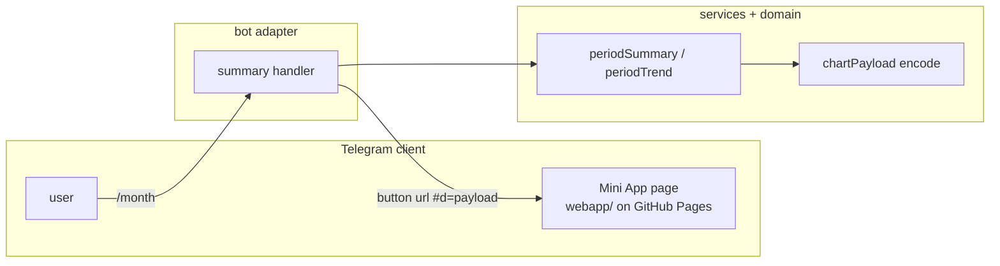

# 0030: Charts in the Mini App, static with no backend

> **Status:** done (2026-10-07): built as planned, one minor and one nit fixed at close, two nits
> open, Phase 2 (publish, measure the URL limit) and Phase 4 (live check on a phone) owed
> **Created:** 2026-10-01
> **Depends on:** [Plan 0032](0032-live-qr-scan-mini-app.md) (the `webapp/` page, Pages workflow and
> `WEBAPP_URL`), merged on `main` before this plan starts
> **Related ADRs:** [ADR-0025](../../adrs/0025-static-mini-app-fragment-in-senddata-out.md) (static Mini App, fragment in, sendData out),
> [ADR-0011](../../adrs/0011-navigation-model.md) (screens, persistent menu),
> [ADR-0022](../../adrs/0022-fx-nbs-middle-rate-ledger-currency.md) (converted totals)

## TL;DR

The `/week` and `/month` screens get a «📈 Диаграмма» button in private chats. It opens a Telegram
Mini App: a static page on GitHub Pages that draws the period's categories as a pie chart, and
later the trend over the last 6 periods as bars. The bot puts the aggregates in the button URL's
fragment, so the page makes no requests and the VPS stays as it is (ADR-0025). The page, its
Pages workflow and `WEBAPP_URL` come from Plan 0032, which built them for the live QR scan; this
plan adds a chart mode. The first thing the user sees: `/month`, tap
«📈 Диаграмма», and a pie chart of this month's categories in the ledger's currency.

## Context & problem

Reports are text only. Nobody reads a month's split by category as fast in lines as in a chart,
and a trend across months doesn't fit in a message at all.

The bot has no HTTP port, domain or TLS, and runs in 256 MiB on a shared VPS (Plan 0002).
ADR-0025 records why the Mini App is static and gets its data from the button URL instead of an
API.

## Decision

The `webapp/` page from Plan 0032 (static, plain `tsc`, no runtime dependencies, published to
GitHub Pages) gets a chart mode. Opened with `#d=<base64url JSON>`, the page validates
the payload version and draws SVG. Everything it shows as text (titles, amount labels, category
names) comes formatted from the bot's messages module inside the payload. The bot adds the
button only when `WEBAPP_URL` is set and the chat is private.

We rejected an HTTPS API on the VPS and server-rendered PNGs (ADR-0025, Alternatives A and B).

## Architecture diagram



## Implementation phases

### Phase 1: Walking skeleton: /month opens a pie chart
- **Owner skill:** dev
- **What:** The chart payload contract and encoder, a chart mode in Plan 0032's page that draws
  a pie with a legend, and the «📈 Диаграмма» `web_app` button on the summary screen.
- **Files touched:** `src/domain/chartPayload.ts`, `src/domain/chartPayload.test.ts`,
  `src/bot/handlers/summary.ts`, `src/bot/messages.ts`,
  `src/bot/bot.test.ts` (or the summary handler's test), `webapp/src/main.ts`,
  `webapp/src/payload.ts`, `webapp/src/payload.test.ts`, `webapp/src/pie.ts`,
  `webapp/src/messages.ts`, `README.md` (Mini App section: charts).
- **Done when:**
  - `encodeChartPayload` with lines Еда 120000 and Транспорт 30000 in RSD round-trips through
    the page's `decodeChartPayload` to the same lines, with `totalMinor` 150000, the integer sum.
  - The pie draws only the first (converted) currency block. Each further currency with no rate
    appears as one text line under the chart, and no amount crosses currencies.
  - A payload with an unknown `v`, broken base64 or a missing `d` makes the page show the
    `webapp/src/messages.ts` fallback and draw nothing. Category names reach the DOM only through
    `textContent`: a test with the name `` finds no `img` element.
  - `webapp/index.html` is unchanged, so Plan 0032's CSP (`default-src 'none'`, no
    `connect-src`) still holds. Scan mode (`#m=scan`) behaves as before: `webapp/src/scan.test.ts`
    is unchanged and passes.
  - The `/month` and `/week` screens in a private chat carry a `web_app` button whose URL starts
    with `WEBAPP_URL` and has a `#d=` fragment. When paged to another period, the button carries
    that period's payload. In a group chat, or with `WEBAPP_URL` unset, there's no button, and the
    screen is otherwise byte-identical to today's.
  - A period with no expenses has no button.

### Phase 2: Publish and measure the URL limit
- **Owner skill:** human
- **Blocks merge:** no
- **What:** After the merge, deploy (Pages and `WEBAPP_URL` are already set up by Plan 0032), and
  open a chart on the clients you use (Android, iOS and/or Desktop). Phase 3 does not wait for
  this measurement: a deploy needs the merge, and the merge needs Phase 3. If the smallest
  working size is below 2048 bytes, a fix lowers `CHART_PAYLOAD_BUDGET` to it.
- **Done when:**
  - The Pages run for this plan's commits is green.
  - Tapping «📈 Диаграмма» on `/month` opens the pie on every client tried, in the Telegram theme
    colours. That confirms the `d` key survives Telegram adding its own launch parameters to the
    fragment (an ADR-0025 risk).
  - The largest payload that still opens has been found, by sending test buttons with padded
    `d` values of 2, 4 and 8 KB, and noted in the Implementation log. Phase 3 budgets against
    the smallest working size across the clients tried.

### Phase 3: Payload budget and the trend chart
- **Owner skill:** dev
- **What:** Cap the encoded payload at a `CHART_PAYLOAD_BUDGET` byte constant of 2048, the
  smallest size Phase 2 tests. Phase 2's measurement runs after the merge (amended 2026-10-07). Add a trend section: the converted totals
  of the current period and the 5 before it, drawn as bars under the pie.
- **Files touched:** `src/domain/chartPayload.ts`, `src/domain/chartPayload.test.ts`,
  `src/services/periodSummary.ts` (or a new `src/services/periodTrend.ts` with its test),
  `src/bot/handlers/summary.ts`, `src/bot/messages.ts`, `webapp/src/main.ts`,
  `webapp/src/bars.ts`, `webapp/src/payload.ts`, `webapp/src/payload.test.ts`.
- **Done when:**
  - Over budget, the encoder folds the smallest category lines into one «Прочее» line until the
    payload fits. Tested property: the folded lines' `amountMinor` sum equals the original
    `totalMinor` exactly, and the encoded length is ≤ the budget. Over budget even with every
    category folded, it drops the oldest trend periods. With nothing left to drop, the button is
    omitted.
  - The trend has 6 bars, oldest first. For a month ledger opened on 2026-10-15 in
    Europe/Belgrade, the periods are 2026-05 to 2026-10. Each bar is that period's converted
    total from the same `ledgerPeriodSummary` the text screen uses, so a bar equals the total
    the user sees after paging to that period.
  - A period with no expenses is a zero-height bar with its label, not a gap.

### Phase 4: Live check on a phone
- **Owner skill:** human
- **Blocks merge:** no
- **What:** On a phone, open a real `/month` chart.
- **Done when:** The pie and trend match the text screen's totals for the same period.

## Data shapes

```ts
// illustrative: src/domain/chartPayload.ts, imported type-only by webapp/src/payload.ts
interface ChartPayloadV1 {
  v: 1;
  title: string; // formatted by messages: «Сентябрь 2026»
  currency: string; // ISO-4217, the ledger's default (the converted block)
  totalMinor: number; // integer, the sum of lines
  totalLabel: string; // formatted by messages: «150 000 RSD»
  lines: [name: string, amountMinor: number, label: string][];
  unconverted: string[]; // formatted per-currency lines with no rate
  trend?: [periodLabel: string, totalMinor: number, label: string][]; // Phase 3
}
// URL: `${WEBAPP_URL}#d=${base64url(JSON.stringify(payload))}`; scan mode (Plan 0032): `#m=scan`
```

## Risks & open questions

- **Fragment handling (unverified).** Telegram adds `tgWebAppData` and other launch parameters to
  the fragment. If a client replaces our fragment instead of appending to it, the pie never gets
  data. Phase 2 detects this, after the merge: until then the button may ship to a client that
  can't open it. The fallback is an ADR change, not a workaround in code.
- **Money.** The bot formats every amount, and the page uses floats only for geometry
  (ADR-0025). The folding in Phase 3 keeps the sum exact, and its test asserts the sum, not just
  that the result isn't empty.
- **Time.** The trend periods come from `periods.ts` in the ledger's effective timezone
  (ADR-0015), never the browser's.
- **Privacy.** The payload is aggregates, never individual expenses or descriptions. It lives in
  Telegram's copy of the button and in the client, never on GitHub. Logs never print the payload
  or `WEBAPP_URL` with its fragment. A sealed ledger (Plan 0019), if it lands first, gets no chart
  button while locked.
- **Supply chain.** The page loads `https://telegram.org/js/telegram-web-app.js`, Telegram's
  official script, which can't be pinned. Nothing else is loaded from outside.
- **Pages availability.** If GitHub Pages is down, the chart doesn't open, while the bot's text
  reports keep working.

## What this plan does NOT do

- An HTTPS API, live history browsing or editing in the page (ADR-0025, Alternative A, would come
  in a future plan).
- Entering the sealed-ledger passphrase in the page (it needs the API; Plan 0019 keeps its
  chat flow).
- Charts for group ledgers, budgets or tags (plans 0011 and 0012 could add payloads later).
- The live QR scan: Plan 0032.
- A BotFather menu button or a "Main Mini App". The entry point is the inline chart button.

## Implementation log

> Written by `dev`: one row per phase as its commit lands, then the close block. **The phases
> above are the contract. This section records what happened.** Observations, never conclusions:
> no pass list, no self-assessment. Deviations and unmet done-whens are **always** disclosed.
> Keep it shorter than `## Implementation phases`.

| phase | owner | state | commit |
|---|---|---|---|
| 1: Walking skeleton: /month opens a pie chart | dev | done | 3a994ba |
| 2: Publish and measure the URL limit | human | owed | |
| 3: Payload budget and the trend chart | dev | done | 0112fca |
| 4: Live check on a phone | human | owed | |

### Notes

- Phase 1: `webapp/src/payload.ts` declares its own copy of the payload type instead of importing
  `ChartPayloadV1` type-only: `eslint.config.js` forbids any `src/` import from the page, and
  `webapp/tsconfig.json` (`rootDir: src`, `types: []`) can't compile one. Both files were outside
  `Files touched`.
- Phase 1: the encoder round trip through `decodeChartPayload` is tested in
  `src/domain/chartPayload.test.ts` (it needs Node's `Buffer`, which the webapp tsconfig lacks).
  `webapp/src/payload.test.ts` covers decoding and the page.
- Phase 1: no DOM library is a dependency, so the page tests run `showChart` against a minimal
  fake document (createElement/createElementNS, textContent; `innerHTML` throws). The
  `` check asserts no `img` node in that tree and the name in a
  `textContent`.
- Phase 1: a period whose first block isn't in the ledger's currency (nothing converts) gets no
  button, like an empty one.
- Phase 1: `webapp/src/messages.ts` `openFromBot` now names «📈 Диаграмма» next to «📷 Скан». A
  missing `d` shows it; a `d` the page can't read shows the new `chartBroken` line.
- Phase 1: the bot test file imports `decodeChartPayload` from `webapp/src/payload.ts` to read
  the button URL.
- Phase 3: `src/bot/bot.test.ts` (outside `Files touched`) gained the `trend` field in the three
  existing payload `toEqual` assertions of the chart-button tests.
- Phase 3: the trend lives in a new `src/services/periodTrend.ts` (+ test), which calls
  `ledgerPeriodSummary` once per period: six summaries per chart render.
- Phase 3: the trend ends at the shown period, so a paged-to screen's trend ends at that period.
- Phase 3: `encodeChartPayload(input, fold, budget)` takes the «Прочее» name and its amount
  formatter from `messages.chartFold(currency)`, and returns undefined when nothing fits. The
  budget is measured on the `d` value's length. An existing category named «Прочее» joins the
  fold line, so the name never appears twice.
- Phase 3: the bars are horizontal, one row per period (name, bar, label), drawn by
  `webapp/src/bars.ts` `showTrend`, which `main.ts` calls after `showChart` (`pie.ts` is not in
  `Files touched`), so they sit under the pie's legend and rateless-currency lines.
- Phase 3: a trend bar's label carries «≈ » when that period holds converted foreign spending, as
  the screen's total does.

### Close triggers

- **What shipped:** `src/domain/chartPayload.ts` (payload v1, base64url encoder,
  `CHART_PAYLOAD_BUDGET` 2048 with folding and trend dropping), `src/services/periodTrend.ts`,
  the chart button in `src/bot/handlers/summary.ts`, and the page's chart mode
  (`webapp/src/payload.ts`, `pie.ts`, `bars.ts`, `main.ts`). Commits 3a994ba, 0112fca.
- **User-visible surface changed:** private `/week` and `/month` screens carry a «📈 Диаграмма»
  `web_app` button when `WEBAPP_URL` is set; the Mini App page opened with `#d=` shows a pie,
  its legend, rateless-currency lines and 6 trend bars. `webapp/src/messages.ts` `openFromBot`
  names the chart button; new `chartBroken` line. README Mini App section covers charts.
- **Gate at the tip (0112fca):** `pnpm typecheck` exit 0; `pnpm lint` exit 0; `pnpm test` exit 0,
  129 files, 1793 tests; `pnpm build` exit 0; `pnpm build:webapp` exit 0;
  `node scripts/check-doc-links.mjs` exit 0, 291 links.
- **Outstanding `human` phases:** Phase 2 (publish, measure the URL limit; owed after the merge)
  and Phase 4 (live check on a phone). Neither blocks the merge.

## Close review

Round 1, tip e213ae1, run headless by the conductor. The review follows in full, its headings
demoted one level.

**Verdict:** Clean. Both `dev` phases deliver their done-whens and the tests behind them assert the
claimed values. There are no blockers or majors, one minor (the README omits the trend bars) and
three nits. The plan can close, with Phases 2 and 4 (`human`, `Blocks merge: no`) still owed after
the merge.

### Gate (run in this session, at e213ae1)

- `pnpm typecheck`: exit 0 (root and `webapp/tsconfig.json`).
- `pnpm lint`: exit 0.
- `pnpm test`: exit 0, 129 files, 1793 tests.
- `node scripts/check-doc-links.mjs`: exit 0, 297 relative links resolve.
- `git diff --stat main...HEAD -- webapp/index.html webapp/src/scan.test.ts webapp/src/scan.ts`:
  empty, so the CSP and scan mode are untouched as Phase 1 requires.

### Alignment

- Phase 1 (3a994ba) and Phase 3 (0112fca) are done. Phases 2 and 4 are `human` and owed after the
  merge, as the log says. Each phase has exactly one in-vocabulary owner tag.
- Phase 1 done-whens:
  - Round trip: `src/domain/chartPayload.test.ts:41` decodes through the page's
    `decodeChartPayload` and `toEqual`s the full payload, with `totalMinor: 150000`.
  - Converted block only: `webapp/src/payload.test.ts:168` asserts two slice paths with exact
    arc geometry, and the EUR line as text. `src/bot/bot.test.ts` "marks a converted total with ≈"
    keeps KZT out of `lines` and in `unconverted`.
  - Fallbacks and XSS: `payload.test.ts:188` covers an unknown `v`, broken base64 and a missing
    `d`, each giving only one `p` holding the right fallback. `payload.test.ts:199` finds no `img`
    node, and the fake DOM throws on `innerHTML`.
  - Button: `bot.test.ts` "the 📈 Диаграмма button" checks the base equals `WEBAPP_URL` and
    `#d=` holds base64url, the payload after paging to August, `/week`, no button in a group, none
    for an empty period, and none for a period with nothing in the ledger currency. That last case
    is a disclosed extension. The unset-`WEBAPP_URL` case is covered by the existing summary
    tests' exact markup, which still pass unchanged.
- Phase 3 done-whens:
  - Folding property: `chartPayload.test.ts:114` runs 200 seeded random cases, some with a
    pre-existing «Прочее» category. It asserts length ≤ budget, the folded sum equal to the
    original `totalMinor`, and at most one «Прочее». Trend dropping (`:142`) and the undefined
    case (`:153`) are tested. The handler maps undefined to no button (`summary.ts:75`).
  - Trend periods: `src/services/periodTrend.test.ts:99` pins 2026-05..2026-10 with exact totals
    for 2026-10-15 in Europe/Belgrade, including zero months. Each bar comes from
    `ledgerPeriodSummary` (`periodTrend.ts:37`).
  - Zero bar: `payload.test.ts:133` asserts width `'0'` rows keep their name and label.
- Deviations are disclosed in the log: a mirrored payload type instead of a type-only import, the
  round trip tested on the bot side, and `bot.test.ts` edited outside Files touched. The mirror
  can't drift silently, because the round-trip `toEqual` would fail. No ADR is reversed.
  ADR-0025's static page, fragment-only data and unchanged CSP all hold.

### Layering, correctness, privacy

- grammY stays in `src/bot/`. `src/domain/chartPayload.ts` is pure and gets its copy (the fold
  name and labels) from `messages.chartFold`. All bot copy is in `src/bot/messages.ts`, and all
  page copy in `webapp/src/messages.ts`.
- Money: the fold sums integers and `chartPayload` guards `Number.isSafeInteger`. The page uses
  floats only for geometry, and every amount it shows is a bot label.
- Time: trend periods come from `previous()` on the shown period, read in the ledger's timezone
  through `ledgerPeriodSummary`.
- Idempotency: the button is read-only, so a re-render only rebuilds the URL.
- Privacy: nothing logs `webappUrl` or the payload (`git grep webappUrl -- src`). The payload
  holds aggregates only. A locked ledger returns before `chartUrlOf` (`summary.ts:88`, `:126`).

### Findings

#### blocker

None.

#### major

None.

#### minor

1. **The README omits the trend bars.**
   - *Where:* `README.md:298-311` ("Mini App: charts").
   - *What:* The section describes only the pie and legend. Phase 3 added a user-visible trend
     section: 6 bars of the converted totals, ending at the shown period, with «≈ » on converted
     periods. The log's close triggers list it as a user-visible surface.
   - *Why it matters:* Lens 4. The README is the user-facing description of what the button
     opens, and it now understates it.
   - *Fix:* Add one bullet: "Under the pie, 6 bars show the converted totals of the shown period
     and the five before it, oldest first. A period with nothing spent keeps its row with a
     zero-length bar." A docs-only commit.

#### nit

1. **The chart page keeps the title «Скан чека».**
   - *Where:* `webapp/index.html:12`, `webapp/src/main.ts:32-39`.
   - *What:* Chart mode doesn't set `document.title`, so the Mini App header (on clients that
     show it) reads «Скан чека». `index.html` had to stay unchanged, but `main.ts` could set
     `document.title` from a `webapp/src/messages.ts` string. This is outside the plan's
     done-whens, so it's a followup, not a fix-pass item.
2. **A long trend label may be clipped.**
   - *Where:* `webapp/src/bars.ts:8-11`, `:54`.
   - *What:* The largest bar ends at x=220, and its label starts at 224 in a 320-wide viewBox. At
     font-size 11 (about 6 px a digit), «≈ 1 234 567.89 RSD» is roughly 100 px wide and overruns
     to about 324. Six-digit totals fit, at about 312. This is unverified on a device.
   - *Fix:* Phase 4's live check should look for it. If it shows, shrink `BAR_WIDTH` or anchor
     the label inside the bar.
3. **The plan's Followups section is stale.**
   - *Where:* `docs/plans/0030-mini-app-charts-and-qr-scan.md:243`.
   - *What:* The followup says to re-queue 0030 once Plan 0032 is merged. 0030 is in
     `tools/conductor/queue.json` and this review ran.
   - *Fix:* The close session drops the bullet.

### Bookkeeping owed (close session)

- Fix minor 1 (the README trend bullet) before or at close. It's docs-only, and the close session
  may make it.
- Flip `Status:` to `done` with the date and verdict, then `git mv` to `docs/plans/done/` and
  repair links both ways (`../adrs/` to `../../adrs/`, and `done/0032-…` to `0032-…` inside the
  moved plan). Run `node scripts/check-doc-links.mjs`.
- Phases 2 and 4 stay owed (`human`, `Blocks merge: no`). Record them as outstanding in the close
  review. Phase 2 may lower `CHART_PAYLOAD_BUDGET` in a later fix.
- Refresh the `docs/plans/README.md` row (it still reads `approved`) and bump the next free
  number if the index tracks it.
- No paired ADR to accept: ADR-0025 is already accepted.
- Version: a minor bump (a feature plan). Add the `package.json` version, a `CHANGELOG.md` entry
  and a `versionAnnouncements` entry in `src/bot/messages.ts` (ADR-0013).
- Drop the stale Followups bullet (nit 3). Nits 1 and 2 can go to `tools/conductor/FOLLOWUPS.md`
  or a future plan.

### Resolution at close

- No earlier round raised findings, so no fix round ran.
- Minor 1 fixed at close in a8ef541 (README trend bullet).
- Nit 3 fixed at close in b0a15ed (stale Followups bullet replaced by nits 1 and 2).
- Nits 1 and 2 stay open, listed under Followups.
- Phase 2 (publish, measure the URL limit) and Phase 4 (live check on a phone) stay owed.
- Version 0.27.0 (minor: a feature plan). No ADR to accept: ADR-0025 was already accepted.

## Followups

- The chart page keeps the title «Скан чека» (round 1 nit 1).
- A long trend label may be clipped at the viewBox edge; Phase 4 checks for it (round 1 nit 2).
