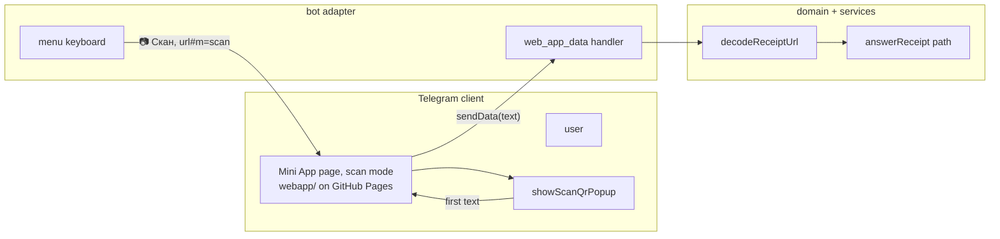

# 0032: A live QR scan in a Mini App records a receipt

> **Status:** done (2026-10-07): built as planned, three minors open, Phase 2 publish and real scan owed, v0.25.0
> **Created:** 2026-10-05
> **Related ADRs:** [ADR-0025](../../adrs/0025-static-mini-app-fragment-in-senddata-out.md) (static Mini App, fragment in, sendData out),
> [ADR-0018](../../adrs/0018-receipts-record-offline-enrich-async.md) (receipts),
> [ADR-0034](../../adrs/0034-qr-retry-on-preprocessed-pixels-jpeg-js.md) (QR retry on photos)

## TL;DR

A «📷 Скан» button on the private-chat menu opens a static Mini App page that immediately opens
Telegram's own live QR scanner (`showScanQrPopup`). The first code it reads goes back to the bot
through `sendData()` and is recorded exactly like a pasted receipt link. This is the Mini App
scaffold and the scan from Plan 0030, split out and built first. Plan 0030 keeps the charts and
builds on this page. The first thing the user sees: tap «📷 Скан», point the phone at a receipt,
and the expense card arrives without taking a photo.

## Context & problem

Receipt photos fail too often. Of 8 real photos that got the hint, the photo path reads 2 after
Plan 0031's retries, and three more have a QR that is located but unreadable at 7 to 8 px per
module (Plan 0031's Implementation log). A single still can't fix blur, glare or angle after the
fact. A live scanner tries frame after frame while the user moves the phone, and sends only the
link text. Plan 0030 had this as its Phase 4, behind three chart phases and last in the conductor
queue.

## Decision

The scan ships alone, run by hand outside the conductor. A `webapp/` directory holds one static
page: `index.html` plus TypeScript compiled by plain `tsc` (DOM lib, no bundler, no runtime
dependencies) to `webapp/dist/`, published to GitHub Pages by a workflow. Opened with `#m=scan`,
the page calls `showScanQrPopup`, closes it on the first text and calls `sendData(text)`. A
`message:web_app_data` handler runs the text through `decodeReceiptUrl` and `answerReceipt`, the
path a pasted link takes. The «📷 Скан» button is a `web_app` reply-keyboard button, because only
a page opened from one can call `sendData` (ADR-0025). It appears only in private chats and only
when `WEBAPP_URL` is set.

We rejected reordering Plan 0030 instead: the scan couldn't close until the charts and their URL
limit measurement were done. No new ADR: ADR-0025 already decides the static page and
`sendData`.

## Architecture diagram



## Implementation phases

### Phase 1: Walking skeleton: «📷 Скан» records a receipt
- **Owner skill:** dev
- **What:** The `webapp/` page in scan mode, its build, the Pages workflow, the optional
  `WEBAPP_URL` config key, the «📷 Скан» menu button, and the `web_app_data` handler. Opened without
  `#m=scan`, or where the client lacks `showScanQrPopup` (Telegram Desktop and web clients),
  the page shows a `webapp/src/messages.ts` line instead and sends nothing.
- **Files touched:** `webapp/index.html`, `webapp/src/main.ts`, `webapp/src/scan.ts`,
  `webapp/src/scan.test.ts`, `webapp/src/messages.ts`, `webapp/tsconfig.json`, `package.json`
  (`build:webapp` script), `vitest.config.ts` (`include` gains `webapp/src/**/*.test.ts`),
  `eslint.config.js` (covers `webapp/`), `.github/workflows/pages.yml`,
  `scripts/pages-workflow.test.mjs`, `src/config.ts`, `src/index.ts` (passes `WEBAPP_URL` into
  `createBot`), `src/bot/testHarness.ts`, `.env.example`, `src/bot/keyboards.ts`,
  `src/bot/handlers/help.ts`, `src/bot/handlers/start.ts`, `src/bot/handlers/menu.ts`,
  `src/bot/handlers/webAppData.ts`, `src/bot/bot.ts`, `src/bot/messages.ts`,
  `src/bot/bot.test.ts`, `README.md` (Mini App section, `WEBAPP_URL`), `CLAUDE.md` ("Where things
  live": `webapp/`).
- **Done when:**
  - A `web_app_data` update whose data is `buildRsUrl()` records the same expense, amount and
    currency as sending that URL as text (82912 minor units, RSD, with the existing fixture).
    Sending the same data again answers «Уже записано.» and the expense count stays 1, the
    idempotency of ADR-0018.
  - Data that isn't a receipt URL gets a messages-module reply and records nothing. The handler
    doesn't assume Telegram's 4096-byte cap: a 5000-byte string is treated as not a receipt.
  - The menu keyboard from `/start` and `/help` in a private chat carries a `web_app` button
    labelled from the messages module whose URL is `WEBAPP_URL` with `#m=scan`. With `WEBAPP_URL`
    unset, or in a group chat, the keyboard is identical to today's.
  - `scan.test.ts`, with a stub `Telegram.WebApp`: in scan mode the page calls
    `showScanQrPopup` once; on the first text it closes the popup and calls `sendData` with that
    text exactly, once, even if the scanner reports a second code. Without `#m=scan`, or with
    no `showScanQrPopup` on the stub, it calls neither and shows the fallback line.
  - `webapp/index.html` carries a CSP meta whose `default-src` is `'none'` and whose
    `script-src` lists only `https://telegram.org` and `'self'`. No `connect-src` is allowed.
  - `pnpm build:webapp` emits `webapp/dist/index.html` and `webapp/dist/main.js`.
  - `scripts/pages-workflow.test.mjs` (run by the existing `node --test "scripts/*.test.mjs"` CI
    step) asserts that every `uses:` in `.github/workflows/pages.yml` is pinned to a
    40-character hex SHA, and that the workflow runs `pnpm build:webapp` before uploading
    `webapp/dist`.
  - No log line from the handler contains the scanned text or `suf.purs.gov.rs`.

### Phase 2: Publish and scan a real receipt
- **Owner skill:** human
- **Blocks merge:** no
- **What:** Enable GitHub Pages (source: GitHub Actions), set `WEBAPP_URL` in the VPS `.env`,
  redeploy, send `/help` to get the new menu, then «📷 Скан» real receipts on a phone, starting
  with ones whose photos got the hint.
- **Done when:** The first Pages run on `main` is green and the page is reachable at
  `WEBAPP_URL`. Each scanned receipt shows up as an expense card whose line items arrive later,
  as with a pasted link. The clients tried, and how many of the scanned receipts recorded, go
  into the Implementation log.

## Data shapes

```ts
// illustrative: the page's whole contract with the bot
// in:  WEBAPP_URL + '#m=scan'
// out: Telegram.WebApp.sendData(text) // the scanned QR text, verbatim, <= 4096 bytes
// bot: message.web_app_data.data -> decodeReceiptUrl -> answerReceipt
```

## Risks & open questions

- **Clients without the scanner.** `showScanQrPopup` exists only on mobile clients (unverified
  per client; Phase 2 records which worked). Elsewhere the page says so and the photo and link
  paths remain.
- **Stale menus.** Telegram keeps showing the old persistent keyboard until the next `/start` or
  `/help` reply. Phase 2 sends `/help`. Other users get the button on their next one.
- **Idempotency.** Each scan is a new message, so a double scan of one receipt must be caught by
  the receipt's identity, not the update id. ADR-0018's existing duplicate check does that, and
  Phase 1 asserts it.
- **Privacy.** The scanned text is a receipt URL with the purchase in it. It's never logged, and
  the page makes no network request.
- **Public page.** GitHub Pages needs the repo public, a precondition Plan 0030 already took.
  The page holds no data and no secrets.

## What this plan does NOT do

- Charts. Plan 0030 builds them on this page.
- Scanning non-receipt QR codes into anything but the not-a-receipt reply.
- A BotFather menu button or a "Main Mini App".

## Implementation log

> Written by `dev`: one row per phase as its commit lands, then the close block. **The phases
> above are the contract. This section records what happened.** Observations, never conclusions:
> no pass list, no self-assessment. Deviations and unmet done-whens are **always** disclosed.
> Keep it shorter than `## Implementation phases`.

| phase | owner | state | commit |
|---|---|---|---|
| 1: Walking skeleton: «📷 Скан» records a receipt | dev | done | 5f85749 |
| 2: Publish and scan a real receipt | human | owed | |

### Notes

- Phase 1: `package.json` `typecheck` also runs `tsc -p webapp/tsconfig.json --noEmit`, since
  the root `tsconfig.json` (not in Files touched) doesn't include `webapp/`. `build:webapp`
  deletes the emitted `*.test.js` from `webapp/dist/`, because one `webapp/tsconfig.json` covers
  both the page and its test. Phase 1 commit.
- Phase 1: the `upload-pages-artifact` (v3.0.1) and `deploy-pages` (v4.0.5) SHAs in `pages.yml`
  were pinned from memory: the session had no network to resolve the tags. The first Pages run
  in Phase 2 is their check. Phase 1 commit.
- Phase 1: `webAppData.ts` caps the data at 4096 bytes with a `TextEncoder` length check before
  `decodeReceiptUrl`. The 5000-byte test string is the receipt link padded with spaces, which
  `decodeReceiptUrl` alone would record. Phase 1 commit.
- Phase 1: `sendWelcome` takes the URL as an optional argument, and the onboarding middleware's
  welcome (`src/bot/middleware/onboarding.ts`, not in Files touched) still calls it without one.
  A never-onboarded user's first welcome so carries today's menu. `/start` and `/help` carry the
  button. Phase 1 commit.
- Phase 1: `eslint.config.js` gains a `webapp/**/*.ts` block: no import from outside
  `webapp/src/` and no package import, plus `webapp/dist/` in `ignores`. Phase 1 commit.

### Close triggers

- **What shipped:** `webapp/` (index.html with CSP, `main.ts`, `scan.ts`, `messages.ts`,
  `tsconfig.json`), `pnpm build:webapp`, `.github/workflows/pages.yml`, optional `WEBAPP_URL`
  config key, the `web_app_data` handler (`src/bot/handlers/webAppData.ts`), and the
  `menuKeyboardFor` helper in `src/bot/keyboards.ts`.
- **User-visible surface changed:** with `WEBAPP_URL` set, the private `/start` and `/help` menu
  gains «📷 Скан» at the end of its first row. New bot copy `messages.scanButton` and
  `messages.scanNotReceipt`. New page copy in `webapp/src/messages.ts`. README section "Mini
  App: live receipt scan". `.env.example` documents `WEBAPP_URL`.
- **Gate at the tip:** `pnpm typecheck` exit 0, `pnpm lint` exit 0, `pnpm test` exit 0 (117
  files, 1684 tests), `pnpm build` exit 0, `pnpm build:webapp` exit 0 (emits `index.html`,
  `main.js`, `messages.js`, `scan.js`), `node --test "scripts/*.test.mjs"` exit 0 (7 tests),
  `node scripts/check-doc-links.mjs` exit 0.
- **Outstanding `human` phases:** Phase 2 (publish and scan a real receipt), `Blocks merge: no`.

## Close review

Closed 2026-10-07 by the conductor on the round 1 review below, which graded the tip
`87b8b0c` clean. No earlier round raised a finding, so no fix commit is named here. The three
minors stay open: none is a prose-only repair. Phase 2 (`human`, `Blocks merge: no`) stays
owed, and its first Pages run is the check on the `upload-pages-artifact` and `deploy-pages`
SHAs pinned from memory. The close bumps to v0.25.0.

### Plan 0032 review, round 1

Tip: 87b8b0caf324d7d4df239d7bdfed17cb493ba215 on `plan-0032-live-qr-scan-mini-app`.

**Verdict:** Phase 1 does what the plan asks and every done-when has a test with a real
assertion. There are no blockers or majors. Three minors remain: a first-contact welcome without
the button, a scan that skips the tidy chat delete, and a `/help` that doesn't mention the
scanner. The plan is clean to close, with Phase 2 (`human`, `Blocks merge: no`) still owed.

#### Gate, run in this session

- `pnpm typecheck`: exit 0. It also runs `tsc -p webapp/tsconfig.json --noEmit`.
- `pnpm lint`: exit 0.
- `pnpm test`: exit 0, with 117 files and 1684 tests.
- `node scripts/check-doc-links.mjs`: exit 0, with 291 links.
- `node --test scripts/pages-workflow.test.mjs`: exit 0, 2 tests.
- `pnpm build:webapp`: exit 0. It emits `index.html`, `main.js`, `messages.js` and `scan.js`, and
  no `*.test.js`. This review then deleted the gitignored `webapp/dist/` it had built.

#### Alignment: each done-when against its test

- **Receipt via `web_app_data`, 82912 RSD, repeat is «Уже записано.», count 1.** This is
  `src/bot/bot.test.ts:5084`. It asserts the exact `sendMessage` payload (`RS_CARD` and the
  receipt keyboard), the stored row (`amount_minor: 82912`, `RSD`) and the repeat reply
  `Уже записано.\n${RS_CARD}`, with `expenseCount` equal to 1. Met.
- **Data that isn't a receipt gets a messages reply and records nothing, 5000 bytes included.**
  This is `bot.test.ts:5120`. The test first proves that the 5000-byte padded link *would*
  decode as a receipt, so the length cap is what refuses it. Both inputs answer
  `messages.scanNotReceipt` and the count is 0. Met. The cap itself is at
  `src/bot/handlers/webAppData.ts:18`.
- **The menu carries a `web_app` button labelled from messages, with URL `WEBAPP_URL#m=scan`,
  and is unchanged when unset or in a group.** These are `bot.test.ts:251` and `:277`. The first
  asserts the whole keyboard for `/start`, `/help` and `❓ Помощь`. The second asserts
  `menuKeyboard` with `WEBAPP_URL` unset, and the group calls equal to the unset bot's calls.
  Met.
- **`scan.test.ts`.** One `showScanQrPopup` call. The first text is sent exactly, once, the popup
  closes once, and a second code is dropped. Without `#m=scan`, or without `showScanQrPopup`, the
  page calls neither and shows its fallback line. All of these are asserted in
  `webapp/src/scan.test.ts`. Met.
- **The CSP meta has `default-src 'none'`, a `script-src` of only `https://telegram.org 'self'`
  and no `connect-src`.** I checked this by reading `webapp/index.html:6-9`. No test covers it,
  and the plan didn't ask for one. Met.
- **`pnpm build:webapp` emits `index.html` and `main.js`.** I ran it. Met.
- **`scripts/pages-workflow.test.mjs`: SHA-pinned `uses:`, and the build runs before the upload
  of `webapp/dist`.** I read both assertions and ran the file. Met. CI runs it through
  `deploy.yml:36`.
- **No handler log line contains the scanned text or `suf.purs.gov.rs`.** Both scan tests run at
  `logLevel: 'info'` and assert this over every log line. Met.

The Implementation log is present and shorter than the phases section. Its deviations are
disclosed: the extra `typecheck` step, the action SHAs pinned from memory, and the onboarding
welcome. No ADR is reversed. ADR-0025 (static page, fragment in, `sendData` out) holds.

#### Layering, correctness, privacy

grammY stays in `src/bot/`. The page shares no code with the bot, and an eslint
`no-restricted-imports` block on `webapp/**/*.ts` enforces that. All copy comes from
`src/bot/messages.ts` or `webapp/src/messages.ts`. Idempotency rests on the receipt's identity,
through `answerReceipt` and `recordReceipt`, as the plan states. The scanned text is never logged.
`WEBAPP_URL` is validated as https with no `#`. The money path is unchanged.

#### Findings

##### blocker

None.

##### major

None.

##### minor

1. **A first-contact welcome carries the menu without «📷 Скан».**
   - **Where:** `src/bot/middleware/onboarding.ts:26` calls `sendWelcome(ctx)` with no URL.
   - **Why it matters:** a user whose first message isn't `/start` gets the persistent menu
     without the button. Telegram keeps showing that menu until the next `/start` or `/help`.
     The log discloses this. The plan's done-when names only `/start` and `/help`, but its TL;DR
     puts the button "on the private-chat menu".
   - **Fix:** `await sendWelcome(ctx, deps.webappUrl);`. Add a test with
     `createTestBot({ onboarding: true, webappUrl })` in which a first plain-text message gets a
     welcome whose `reply_markup` contains the scan button.
2. **A scan skips the tidy chat delete (ADR-0038).**
   - **Where:** `src/bot/handlers/webAppData.ts:27-35`. The pasted-link path at
     `src/bot/handlers/text.ts:57-60` calls `tidyAfterRecording` on `recorded` or `duplicate`, and
     this handler discards `answerReceipt`'s outcome.
   - **Why it matters:** the plan and the README say a scan "is recorded exactly like a pasted
     receipt link". With tidy chat on, the pasted link is deleted, but the scan's "data from
     «📷 Скан»" service message stays. Tidy chat arrived from main after this plan was written,
     so no test probes the case.
   - **Fix:** keep the outcome:
     `const outcome = await answerReceipt(...); if (outcome === 'recorded' || outcome === 'duplicate') await tidyAfterRecording(ctx, deps, user);`.
     Add a test with tidy chat on in which a scan records and calls `deleteMessage` once. If you'd
     rather keep the service message, say so in a code comment instead.
3. **`/help` doesn't mention the scanner.**
   - **Where:** `src/bot/messages.ts:1319`, the receipt line ("отправьте фото QR-кода с чека или
     ссылку из него"), and `:1328-1333`, which describes every other menu button.
   - **Why it matters:** this is lens 4. A new user-visible button exists, and `/help` is the
     reply that carries it, yet `/help` doesn't describe it.
   - **Fix:** the button depends on `WEBAPP_URL`, so either make `messages.help` take a flag and
     add a «📷 Скан — сканировать QR-код чека камерой» line when the URL is set, or record this as
     a followup for Plan 0030, which reworks the page. Either way, decide it explicitly.

##### nit

None.

#### Bookkeeping owed at close

- Phase 2 (`human`, `Blocks merge: no`) stays owed. Enabling Pages, a green first Pages run, and
  a real scan are also the check on the `upload-pages-artifact` and `deploy-pages` SHAs that the
  log says were pinned from memory. Record the clients tried and the receipts recorded in the
  Implementation log.
- Bump the version: this is a feature plan, so a minor bump. Add the `CHANGELOG.md` entry and a
  `versionAnnouncements` entry for the new «📷 Скан» button.
- `git mv` the plan to `docs/plans/done/` and repair its `../adrs/` links. Move the index row in
  `docs/plans/README.md` and run `node scripts/check-doc-links.mjs`.
- No ADR to accept: the plan writes none.
- Docs freshness is otherwise met. README has "Mini App: live receipt scan", `.env.example`
  documents `WEBAPP_URL`, and `CLAUDE.md` lists `webapp/` and `pages.yml`.

## Followups
