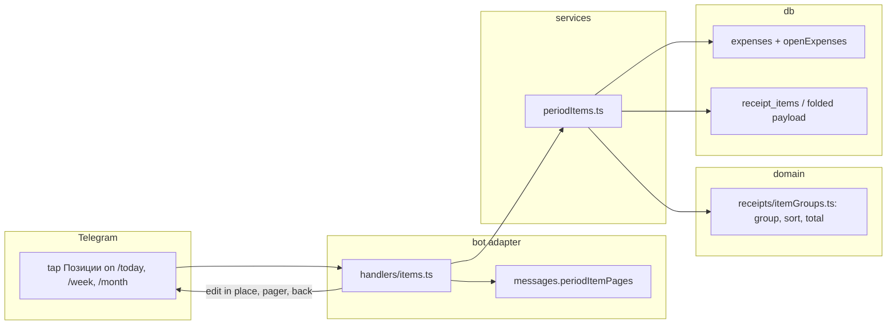

# 0035: Collapsed lists, receipt items by category for a day, week or month, and an opt-in tidy chat

> **Status:** done (2026-10-06): built as planned, one minor and one nit fixed at close, one nit
> open, Phase 6 live check owed, v0.23.0
> **Created:** 2026-10-06
> **Related ADRs:** [ADR-0038](../../adrs/0038-collapse-with-expandable-quotes-opt-in-tidy-chat.md)
> (collapse and tidy chat), [ADR-0011](../../adrs/0011-navigation-model.md) (cards and the screen
> anchor), [ADR-0018](../../adrs/0018-receipts-record-offline-enrich-async.md) (receipts),
> [ADR-0020](../../adrs/0020-sealed-ledgers-write-open-read-locked.md) (sealed ledgers)

## TL;DR

Long lists stop cluttering the chat. A fetched receipt's card shows its items in Telegram's
expandable quote, which starts collapsed: one tap opens it and another closes it, with nothing
sent to the bot. `/week` and `/month` collapse their category lines the same way. `/today`,
`/week` and `/month` gain a [Позиции] button that lists the period's receipt items grouped by
category, each category collapsed under a line with its total and item count. Inside a category,
items are sorted by name, so every «Хлеб» sits together, which is the first step toward
comparing prices over time. A new `/settings` switch, off by default, deletes the user's own
message once it has recorded an expense. The first change the user sees: a new receipt card
arrives with its items folded under it.

## Context & problem

The user reads a receipt's items by tapping [Позиции], which edits the card into a list that can
run to several pages. When they scroll back up, the list is still open, and with the summaries
and the user's own messages around it the chat looks cluttered. The user wants to hide what they
don't need right now.

Separately, the user wants to see what they bought in a period, not only how much each category
cost. Seeing the same product's lines next to each other is the base for later price
comparisons (inflation). Receipt items today are reachable only one receipt at a time, through
its card, or in bulk through `/export`.

Facts from the tree that shape the plan:

- `receipt_items` has `name`, `quantity` (a decimal string) and `total_minor` in the expense's
  currency. Items carry no category, so the expense's category is their category.
- A sealed ledger keeps a receipt's items inside the expense's sealed payload
  (`foldedReceipt`), not in `receipt_items` (ADR-0020). `receiptItems` in
  `src/services/fetchDueReceipt.ts` already reads both paths, and only the expense's author may
  see its items.
- `/week` and `/month` are screens on the user's anchor (`src/bot/handlers/summary.ts`).
  `/today` is a plain reply with no keyboard (`src/bot/handlers/today.ts`).
- Receipt photos are already deleted once recorded (Plan 0034, `deleteReceiptPhoto` in
  `src/bot/handlers/receipt.ts`).

## Decision

Collapse long lists with `<blockquote expandable>` and add no buttons for it. Add the period
items view as a state of the existing summaries, reached by [Позиции], not as a new command.
Group items by their expense's category: product matching (folding `MLEKO 2.8% 1L` and
`Mleko Imlek` into one product) is a later plan. Deleting the user's messages is an opt-in
setting. The reasons and the rejected alternatives are in ADR-0038. We rejected a separate
`/items` command with its own period picker because the summaries already know the period and
the ledger. We rejected normalized product names for now because rule-based matching across
shops is a project of its own, and grouping by name sort already puts identical names together.

## Architecture diagram



## Implementation phases

### Phase 1: a receipt card shows its items collapsed
- **Owner skill:** dev
- **What:** In a private chat, a fetched receipt's card shows the author its items inside
  `<blockquote expandable>`, below the receipt line, in the format `receiptItemLine` already
  uses. When the card with its items would exceed `MAX_VISIBLE_CHARS`, the card stays as it is
  today: no quote, and the [Позиции] pager. With the quote shown, the card drops the [Позиции]
  button. Group cards (`src/bot/group/card.ts`), a card for an expense the viewer didn't record,
  and a sealed ledger's card while it is locked stay as today.
- **Files touched:** `src/bot/handlers/card.ts`, `src/bot/messages.ts`,
  `src/bot/receiptWorker.ts` (the card edited after a fetch), `src/bot/messages.test.ts`,
  `src/bot/bot.test.ts` or the card's existing test file.
- **Done when:**
  - A fetched receipt with the items `Хлеб` (quantity `0.535`, 7999 minor RSD) and `Молоко`
    (quantity `1`, 14900) renders a card whose HTML contains `<blockquote expandable>` holding
    `1. Хлеб × 0.535 — 79.99 RSD` and `2. Молоко — 149.00 RSD`, with no [Позиции] button.
  - A fetched receipt whose card with items exceeds `MAX_VISIBLE_CHARS` (a fixture with enough
    long-named items) renders no blockquote and keeps [Позиции].
  - The receipt worker's edit after a successful fetch sends the collapsed-items card.
  - A shop name or item name containing `<b>` reaches the message escaped (`&lt;b&gt;`).

### Phase 2: /week and /month fold their category lines
- **Owner skill:** dev
- **What:** In `messages.periodSummary`, each currency block keeps its bold total on its own line
  and wraps its category lines in `<blockquote expandable>`. The order is unchanged (by amount).
  The "too many categories" fallback is unchanged.
- **Files touched:** `src/bot/messages.ts`, `src/bot/messages.test.ts`.
- **Done when:** A summary with categories Еда 61398, Дом 39900 and Транспорт 12000 minor RSD
  renders the bold total `1 132.98 RSD`, then a single `<blockquote expandable>` holding the
  three category lines in that order. (61398 + 39900 + 12000 = 113298 minor units. Write the
  expected total with whatever thousands separator `formatMoney` produces, taken from the
  existing summary tests, not from this plan.) A summary with no expenses renders exactly as
  before.

### Phase 3: [Позиции] on /week and /month lists the period's items by category
- **Owner skill:** dev
- **What:** The summary screen gains a [Позиции] button in a private chat. It edits the anchor
  into the period items view: a header with the period and ledger. Under it, each category gets
  a bold line with its name, its items' total per currency and its item count, and then
  `<blockquote expandable>` with its items as `DD.MM Name × qty — amount`. The quantity part
  appears only when the quantity isn't 1, matching `receiptItemLine`. A last line counts the
  period's expenses that have no fetched receipt (`Трат без чека: N`), omitted when N is 0.
  Rules:
  - Only expenses the viewer recorded, not deleted, with `occurred_on` inside the period, and a
    fetched receipt. In a shared ledger the header says the list holds only the viewer's
    receipts.
  - Categories are ordered by their total in the ledger's default currency, descending. A
    category with none of that currency comes after, by name. «Без категории» is a category.
  - Items inside a category are sorted by name, case-insensitively with a Russian `Intl.Collator`,
    then by date, then by receipt and position.
  - A category's total is the integer sum of its items' `total_minor` per currency, never
    converted. With two currencies it shows both, joined with ` + `.
  - Pages are cut on whole lines within `MAX_VISIBLE_CHARS`. A category cut across pages repeats
    its bold line with `(продолжение)` on the next page. The pager and [← Назад] sit under it.
    [← Назад] restores that period's summary in the anchor.
  - A locked sealed ledger answers with the `ledgerLockedToast` toast and edits nothing. A
    sealed ledger that is unlocked reads items from the folded payload, as `receiptItems` does.
  Grouping, sorting and totals are a pure domain function. The service reads the expenses the
  way `ledgerPeriodSummary` does, then the items, plaintext from `receipt_items` and sealed ones
  from `foldedReceipt`.
- **Files touched:** `src/domain/receipts/itemGroups.ts`, `src/domain/receipts/itemGroups.test.ts`,
  `src/db/receiptItems.ts` (items for a list of expense ids), `src/db/receiptItems.test.ts`,
  `src/services/periodItems.ts`, `src/services/periodItems.test.ts`, `src/bot/handlers/items.ts`,
  `src/bot/handlers/summary.ts`, `src/bot/callbackData.ts`, `src/bot/messages.ts`,
  `src/bot/messages.test.ts`, `src/bot/bot.ts`, `src/bot/bot.test.ts`.
- **Done when:** With the fixture below (the user is in `Europe/Belgrade`, `now` is
  2026-10-06T10:00:00Z, a Tuesday, and the week runs Monday 2026-10-05 to Sunday 2026-10-11),
  every expense recorded through `recordExpense` and receipt so that `occurred_on` is computed,
  not hand-set:

  | Receipt | Instant (UTC) | Local day | Category | Items (minor RSD) |
  |---|---|---|---|---|
  | A | 2026-10-05T09:00Z | 05.10 | Еда | Хлеб 7999, Молоко 14900 |
  | B | 2026-10-06T08:00Z | 06.10 | Еда | Хлеб 8499 |
  | C | 2026-10-06T09:00Z | 06.10 | Дом | Средство 39900 |
  | D | 2026-10-04T09:00Z | 04.10 (previous week) | Еда | Хлеб 7599 |
  | E | 2026-10-06T09:30Z, then deleted | 06.10 | Еда | Сыр 50000 |
  | F | 2026-10-06T22:30Z | 07.10 (00:30 CEST) | Еда | Кофе 30000 |

  - `itemGroups` for the week returns Еда first with 61398 (7999 + 14900 + 8499 + 30000) and 4
    items in the order Кофе 07.10, Молоко 05.10, Хлеб 05.10, Хлеб 06.10, then Дом with 39900
    and 1 item.
  - The month view for October 2026 has Еда at 68997 (61398 + 7599) with 5 items, and Дом at
    39900. Сыр (deleted E) appears in no view.
  - A receipt recorded by another member of a shared ledger in the same week appears in no
    view of this user.
  - A plaintext expense with no receipt on 06.10 makes the week view end with `Трат без чека: 1`.
  - Through the bot harness, tapping [Позиции] on the week screen edits the anchor into a page
    whose HTML holds `<b>Еда</b>`, a `<blockquote expandable>` and the four Еда lines.
    [← Назад] restores the week summary.
  - A fixture with enough items to need two pages splits on a whole line. The second page
    starts with the cut category's line marked `(продолжение)`, and no page's
    `visibleLength` exceeds 4096.
  - The callback data for the longest key (`itm:d:2026-10-06:` plus a two-digit page) is at
    most 64 bytes, checked by `assertCallbackData`.

### Phase 4: [Позиции] on /today
- **Owner skill:** dev
- **What:** The `/today` reply in a private chat gains a [Позиции] button for that local day,
  acting on the user's active ledger at tap time. The view is the Phase 3 view for one day,
  without the `DD.MM` prefix. [← Назад] edits the message back into `/today` for the current
  day. The button is omitted when the day has no receipt items.
- **Files touched:** `src/bot/handlers/today.ts`, `src/bot/handlers/items.ts`,
  `src/bot/callbackData.ts`, `src/bot/messages.ts`, `src/bot/bot.test.ts`.
- **Done when:** With the Phase 3 fixture, `/today` on 2026-10-06 shows [Позиции]. Tapping it
  shows Дом (39900, Средство) above Еда (8499, Хлеб), with no Кофе (that's 07.10) and no Сыр.
  A day with expenses but no receipts shows no [Позиции].

### Phase 5: an opt-in tidy chat deletes the user's recorded messages
- **Owner skill:** dev
- **What:** A `users.tidy_chat` flag, off by default, toggled from a `/settings` row. When it is
  on, in a private chat, once a message has recorded an expense (recorded or duplicate), the bot
  sends the card and then deletes the user's message. That covers a typed expense, a receipt
  link and a bank SMS. An ambiguous amount deletes the original only once a reading is chosen
  and recorded. A message that recorded nothing (invalid, future date, not an expense, a flow
  answer) is never deleted. A failed delete is logged at warn with the update id and the error
  name only. Generalize `deleteReceiptPhoto` into one helper for both. Ask `ux-telegram` for the
  row's label and the switch's states before wiring the copy, or use `Убирать мои сообщения:
  вкл/выкл` if the user skips that.
- **Files touched:** `src/db/migrations/0023_tidy_chat.sql`, `src/db/users.ts`,
  `src/db/users.test.ts`, `src/services/settings.ts`, `src/services/settings.test.ts`,
  `src/bot/handlers/settings.ts`, `src/bot/handlers/text.ts`, `src/bot/handlers/ambiguous.ts`,
  `src/bot/handlers/receipt.ts`, `src/bot/callbackData.ts`, `src/bot/messages.ts`,
  `src/bot/bot.test.ts`.
- **Done when:**
  - With `tidy_chat` on, a private `450 кофе` records 45000 minor units and the harness sees
    `deleteMessage` for that message's id after the card's `sendMessage`. With it off, there is no
    `deleteMessage`.
  - With it on, `привет` (not an expense) and an invalid amount trigger no `deleteMessage`.
  - With it on, the same expense text sent in a group triggers no `deleteMessage`.
  - With it on, an ambiguous amount triggers no `deleteMessage` until a reading is tapped, then
    one for the original message.
  - A `deleteMessage` that rejects leaves the expense recorded and the card sent, and the warn log
    holds no amount or description.
  - The migration leaves existing users at `tidy_chat = 0`.

### Phase 6: live check on a phone and the desktop
- **Owner skill:** human
- **Blocks merge:** no
- **What:** On the deployed bot, scan a real receipt and check that the card arrives with its
  items collapsed and opens and closes with a tap, on mobile and on Telegram Desktop. Open
  `/week` and check the folded categories. Tap [Позиции] and page through and back. Turn on the
  tidy switch, send an expense and see the message disappear.
- **Files touched:** none.
- **Done when:** The user confirms each of the four checks on at least one mobile client and on
  Desktop, or names what failed.

## Data shapes

```ts
// illustrative
// src/domain/receipts/itemGroups.ts
interface PeriodItem {
  name: string;
  quantity: string;        // decimal string, as stored
  totalMinor: number;      // integer, in `currency`
  currency: CurrencyCode;
  occurredOn: LocalDate;
  categoryId: number | null;
  receiptKey: string;      // a stable order for ties: receipt id or expense id
  position: number;
}
interface ItemGroup {
  categoryId: number | null;
  totals: Money[];         // one per currency, default currency first
  items: PeriodItem[];     // sorted: name (ru collator), date, receiptKey, position
}
function groupItems(items: readonly PeriodItem[], defaultCurrency: CurrencyCode): ItemGroup[];
```

```sql
-- 0023_tidy_chat.sql (illustrative)
-- 0 | 1: delete the user's private message once it has recorded an expense (ADR-0038).
ALTER TABLE users ADD COLUMN tidy_chat INTEGER NOT NULL DEFAULT 0;
```

Callback data, each checked by `assertCallbackData`: `itm:d:<YYYY-MM-DD>:<page>`,
`itm:w:<Monday YYYY-MM-DD>:<page>`, `itm:m:<YYYY-MM>:<page>` (at most 19 bytes for a two-digit
page), and one key for the tidy switch in the `set:` family.

## Risks & open questions

- **Items total isn't the summary total.** Item lines can omit discounts or rounding that the
  receipt total carries, and expenses without receipts aren't listed. The view says it lists
  items. The `Трат без чека` line keeps it from looking like the whole period.
- **Entity count.** Telegram limits formatting entities per message, and the documented limit
  isn't certain (unverified; 100 is often quoted). Each category adds about two. If a dense page
  is rejected, cut pages by entity count as well as length. Phase 6 should include the user's
  busiest month.
- **Client support.** Clients before Bot API 7.4 show an expandable quote fully expanded, which
  is no worse than today.
- **Time.** Period membership uses the stored local `occurred_on`, never a UTC date. Receipt F
  in the fixture defends that.
- **Privacy.** Item names are shop text. They go through `html` escaping, never reach logs, and
  appear only in fixtures with invented names.
- **Idempotency.** The items view and the switch only read or set a flag, so double taps are
  harmless. A tidy delete repeated on a redelivered update fails harmlessly and is logged at warn
  without content.
- **Today's back button.** A `/today` items view opened yesterday goes back to today's summary,
  not yesterday's. This is accepted to keep `/today` a plain reply rather than a screen.

## What this plan does NOT do

- **No product matching or unit prices.** It doesn't fold `MLEKO 2.8%` and `Mleko Imlek` into one
  product, doesn't compute price per kg or litre, and doesn't track a product's price over months.
  That is a future "price tracking" plan, which can build on `itemGroups`.
- **No per-item categories.** An item takes its expense's category.
- **No currency conversion in the items view.** Totals stay per currency.
- **No items view in group chats**, and no change to group cards.
- **No deletion of the bot's own old messages**, no "clear the chat" button, and no deleting of
  flow answers or `/commands` the user typed (ADR-0038).
- **No re-rendering of messages already in the history.** They pick up the new look only when
  next edited.

## Implementation log

| phase | owner | state | commit |
|---|---|---|---|
| 1: card items collapsed | dev | done | 371a6f9 |
| 2: summary categories folded | dev | done | b381ba3 |
| 3: period items on /week, /month | dev | done | 9b8f76b |
| 4: period items on /today | dev | done | d4dfeee |
| 5: tidy chat | dev | done | c7d3a54 |
| 6: live check | human | owed | |

### Notes

- Phase 1: `src/bot/receiptWorker.ts` needed no change: the worker already renders the card
  through `cardView` for the author, which now carries the items. Its done-when is a harness test
  in `src/bot/bot.test.ts` that runs `startReceiptWorker` against the harness API. No
  `messages.test.ts` case was added; the card's HTML is asserted in `bot.test.ts`.
- Phase 1: the fold check reserves room for the `Уже записано.` line, so a duplicate's card that
  fits without it but not with it keeps [Позиции].
- Phase 2: touched `src/bot/bot.test.ts`, outside the phase's `Files touched`, to update the
  existing /week and /month expectations to the folded form. Group summaries share
  `messages.periodSummary` and fold too; `group.test.ts` derives its expectations from it.
- Phase 3: the back button is the existing `messages.backButton` (`« Назад`), not `← Назад`.
  [Позиции] shows on every private /week and /month screen, empty periods included; an empty
  view says `В чеках за этот период позиций нет.`
- Phase 3: `dayItemsData` and `DAY_ITEMS` (Phase 4's key) were added to `callbackData.ts` in this
  phase, so the 64-byte done-when for `itm:d:2026-10-06:99` is asserted here.
- Phase 3: `visibleLength` in `messages.ts` is now exported, for the page-length assertion.
- Phase 3: the done-whens are split between `src/services/periodItems.test.ts` (the week and
  month groups, the shared-ledger exclusion, `withoutReceipt`, the sealed ledger locked then
  unlocked) and `src/bot/bot.test.ts` (the harness tap, back, paging, callback length).
  `itemGroups.test.ts` covers ordering and totals on hand-built items. The shared ledger's header
  line (`Только чеки, которые записали вы.`) has no test.
- Phase 3: items of a sealed row take their position from their order in the folded payload.
  The group without a category sorts after named groups that lack the default currency.
- Phase 4: touched `src/services/periodItems.ts` and its test, outside the phase's `Files
  touched`. `activePeriodItems` no longer takes `now` or refuses a range after today: resolving
  the zone a second time on /today logged a second warn for a corrupt stored zone, which the
  existing settings test pins at one. A well-formed future date in `itm:d:` now edits into an
  empty items view instead of nothing.
- Phase 4: the back key is `itm:today` (`TODAY_SHOW`). `todayReply` in `handlers/today.ts`
  builds /today's text and keyboard for both the command and the back tap.
- Phase 5: `ux-telegram` was not asked (headless conductor session); the row uses the plan's
  fallback copy `Убирать мои сообщения: вкл/выкл`, keyed `set:tidy`, on its own row under the
  tips switch.
- Phase 5: `deleteReceiptPhoto` became `deleteRecordedMessage` in `handlers/receipt.ts`, with
  `tidyAfterRecording` beside it. The receipt photo keeps its `receipt photo delete failed` warn;
  a tidy delete warns `recorded message delete failed`. A split (`/N`) text that recorded is
  deleted after its card, like any recorded text.
- Phase 5: the receipt-link and bank-SMS tidy deletes have no test; the done-whens' typed-expense,
  non-expense, group, ambiguous, failed-delete and migration cases do.

- Followup noticed, not acted on: pages of the items view are cut by visible length only, not by
  entity count (the plan's Risks). A dense month can still hit Telegram's entity limit; Phase 6's
  busiest-month check is where that would show.
- Followup noticed, not acted on: the 48-hour delete window means a redelivered or late update
  older than that fails the tidy delete and logs a warn, as the plan accepts.

### Close triggers

- **What shipped:** feature
- **User-visible surface changed:** commands: `/today` gains [Позиции] when the day's receipts
  list items, `/week` and `/month` gain [Позиции] under the pager, `/settings` gains
  [Убирать мои сообщения: вкл/выкл]; a fetched receipt's card folds its items in
  `<blockquote expandable>` and drops [Позиции] when they fit; /week, /month and group summaries
  fold their category lines; messages: `expenseRecorded` (folded items), `foldsReceiptItems`,
  `periodSummary` (folded lines), `periodItemsButton`, `periodItemPages`, `tidyChatToggleOn`,
  `tidyChatToggleOff`; callback data: `itm:w:<Monday>:<page>`, `itm:m:<YYYY-MM>:<page>`,
  `itm:d:<YYYY-MM-DD>:<page>`, `itm:today`, `set:tidy`; config/env keys: none; schema
  migrations: `0023_tidy_chat.sql`.
- **Gate at the tip:** `pnpm typecheck` exit 0; `pnpm lint` exit 0; `pnpm test` exit 0, 112 files,
  1608 tests passed; `pnpm build` exit 0; `node scripts/check-doc-links.mjs` exit 0 (283 links).
- **Outstanding `human` phases:** Phase 6 (live check on a phone and the desktop), not started.

## Close review

### Plan 0035 review, round 1 (tip 4d3ca27)

**Verdict:** Clean. All five `dev` phases are built as planned, every named done-when has a real
assertion behind it and the gate is green. The one minor finding is a README that doesn't yet
describe the new [Позиции] buttons, the folded receipt card or the tidy switch. Phase 6 (`human`,
`Blocks merge: no`) is owed after the merge.

#### Gate (run in this session, at the tip)

- `pnpm typecheck`: exit 0
- `pnpm lint`: exit 0
- `pnpm test`: exit 0, 112 files, 1608 tests passed
- `node scripts/check-doc-links.mjs`: exit 0, 283 relative links resolve

#### Lens 1: alignment with the plan and ADRs

The implementation log maps phases 1 to 5 to commits 371a6f9, b381ba3, 9b8f76b, d4dfeee and
c7d3a54, and `git log main..HEAD` matches. Every phase has exactly one in-vocabulary owner tag.
I read the assertion of every done-when:

- **Phase 1** (`src/bot/bot.test.ts`, describe `fiscal receipts`):
  - "folds a fetched receipt card's items" asserts the exact text
    `…\n<blockquote expandable>1. Хлеб × 0.535 — 79.99 RSD\n2. Молоко — 149.00 RSD</blockquote>`
    and a keyboard without [Позиции].
  - "keeps [Позиции] and no quote" uses 80 items of 60 characters, asserts the unfolded text and
    a keyboard that keeps [Позиции].
  - The escape test asserts `&lt;b&gt;Shop&lt;/b&gt;` and the escaped item inside the quote.
  - The worker test runs `startReceiptWorker` with a stub fetcher and asserts the exact folded
    `editMessageText`.
  - Group cards use `group/card.ts`, which doesn't touch `cardView`. `withItems` in
    `handlers/card.ts` gates on the author and on `receiptItems`, which refuses a locked ledger.
- **Phase 2:** `messages.test.ts` asserts the exact string `<b>1 132.98 RSD</b>\n<blockquote
  expandable>Еда: 613.98\nДом: 399.00\nТранспорт: 120.00</blockquote>` (61398 + 39900 + 12000 =
  113298), plus the unchanged no-expenses rendering.
- **Phase 3:**
  - `services/periodItems.test.ts` records the fixture through `recordReceipt` with computed
    `occurred_on`. It asserts:
    - The week: Еда 61398, items Кофе 07.10, Молоко 05.10, Хлеб 05.10, Хлеб 06.10, then Дом 39900.
    - October: Еда 68997 with five items, Дом 39900, no Сыр.
    - The shared-ledger exclusion in both directions, and `withoutReceipt` = 1.
    - The locked ledger, then the unlocked one read from the folded payload.
  - `bot.test.ts` asserts the exact edited page, including `<b>Еда</b>`, the quote and the four Еда
    lines. It also asserts that back restores the identical week text.
  - The paging test checks that every page's `visibleLength` is at most 4096, the
    `(продолжение)` line on page 2, and that all 150 items appear once, in order.
  - The callback-length test checks `itm:d:2026-10-06:99` through `assertCallbackData`.
- **Phase 4:** the harness test asserts the /today keyboard `itm:d:2026-10-06:1`, then an exact
  page with Дом above Еда, no dates, no Кофе and no Сыр, with back to `itm:today` restoring the
  same text and markup. A second test checks that a day without receipts has no `reply_markup`.
- **Phase 5:**
  - A recorded `450 кофе` asserts 45000 and the call order `['sendMessage', 'deleteMessage']`
    with message 12. With the switch off, there is no delete.
  - `привет` and an invalid amount trigger no delete. The group text triggers no delete.
  - An ambiguous amount: no delete before the tap, then a delete of message 20.
  - A failed delete keeps the row and the card, and the single warn has `updateId` 2 and no
    `450` or `кофе`.
  - The migration test in `db/users.test.ts` replays migrations below 0023, then 0023, and reads 0.

The log records these deviations honestly, and none reverses ADR-0038 or the plan's intent:
- the back label is `« Назад`
- [Позиции] also shows on empty periods
- `activePeriodItems` takes no clock
- group summaries fold too, through the shared `messages.periodSummary`
- `ux-telegram` wasn't asked, so the plan's fallback copy is used

#### Lens 2: layering

`itemGroups.ts` is pure and imports only domain types. `periodItems.ts` uses db and ledgerKeys
with no grammY import. SQL stays in `db/receiptItems.ts` and `db/users.ts`. The copy
(`periodItemsButton`, `tidyChatToggleOn/Off`, the page header, `Трат без чека`) lives in
`messages.ts`.

#### Lens 3: correctness

- **Money:** category totals are integer sums of `total_minor` per currency (`totalsOf`), never
  converted, and rendered through `formatMoney`. There is no float arithmetic.
- **Time:** period membership is decided by the stored local `occurred_on`
  (`listLedgerExpensesBetween`). Receipt F (22:30Z, 07.10 local) defends it in both the service
  test and the harness test.
- **Idempotency:** the items view is read-only. A tidy delete on a redelivered update fails into
  a warn.
- **Privacy:** the warn holds the update id and the error name only. Item names go through
  `shownDescription`/`html`.
- **Telegram limits:** the callback data is at most 21 bytes and checked. Pages are cut by visible
  length. The entity count isn't counted, which the plan accepts as a risk for Phase 6.

#### Findings

##### blocker

None.

##### major

None.

##### minor

1. **The README doesn't describe the user-visible surface this plan changed.**
   - **Where:** `README.md:27` (`/today`), `README.md:28` (`/week`, `/month`), `README.md:33`
     (`/settings`), `README.md:126` (receipt card).
   - **What:**
     - The `/today` and `/week`/`/month` rows don't mention [Позиции].
     - The `/settings` row lists [Подсказки: вкл/выкл] but not [Убирать мои сообщения: вкл/выкл].
     - The receipt bullet still says the fetched card "gains [Позиции], which lists the items in
       the same message". Now the card folds its items in an expandable quote and keeps
       [Позиции] only when they don't fit.
     - Nothing says the /week and /month category lines are folded.
   - **Why it matters:** the README is the user-facing reference, and the plan's close triggers
     list each of these surfaces.
   - **Suggested fix:** extend the four spots:
     - `/today`: "[Позиции] when the day's receipts list items: the day's receipt items by
       category".
     - `/week`, `/month`: "categories folded under the total; [Позиции] lists the period's receipt
       items by category, sorted by name, with a pager and [« Назад]".
     - `/settings`: add "[Убирать мои сообщения: вкл/выкл], which deletes your message once it has
       recorded an expense".
     - Receipt bullet: "shows its items folded under `Магазин · 12 позиций` (a tap opens them);
       a list too long for one message stays behind [Позиции]".

##### nit

1. **Two plan rules have no test.**
   - **Where:** `src/bot/messages.ts` (`periodItemPages`, the shared-ledger header line), and
     `src/bot/handlers/text.ts:57` and `:198` (the receipt-link and bank-SMS tidy deletes).
   - **What:** the plan's rules name the shared-ledger header line (`Только чеки, которые
     записали вы.`) and the tidy delete for a receipt link and a bank SMS. The implementation
     log says openly that none of these has a test.
   - **Why it matters:** no done-when asks for them, so this isn't a gap against the plan. A
     regression in either path would still pass the suite.
   - **Suggested fix:** a harness case each, in a later touch of these files.
2. **Two comments were reflowed by hand.**
   - **Where:** `src/bot/handlers/text.ts:26` and `src/bot/handlers/settings.ts:68`.
   - **What:** the edited comments now have a line far over the house width, and a line broken
     mid-sentence (`chat switches. [Другой…] asks for` / `// an IANA name …`).
   - **Suggested fix:** rewrap both comments.

#### Bookkeeping owed at close

- Flip ADR-0038 from `proposed` to `accepted` and refresh `docs/adrs/README.md`.
- Flip the plan's `Status:` to `done` and `git mv` it to `docs/plans/done/`. Fix the inbound link
  in ADR-0038 (`../plans/0035-…` → `../plans/done/0035-…`) and the plan's outbound `../adrs/`
  links, then run `node scripts/check-doc-links.mjs`.
- Refresh `docs/plans/README.md`: the row goes to recently closed, and bump the next free number.
- Bump the minor version (a feature plan): `package.json`, `CHANGELOG.md`, and a
  `versionAnnouncements` entry in `src/bot/messages.ts` naming the folded receipt items, [Позиции]
  on /today, /week and /month, and the tidy switch.
- Phase 6 (`human`, live check on mobile and Desktop, including the busiest month for the entity
  limit) stays owed. It doesn't block the merge.
- The minor README finding above, if the close session's lane allows it. Otherwise it goes to a
  followup.

### Resolved at close

- minor 1 (README): fixed in a3e63eb.
- nit 2 (comment rewrap in `text.ts` and `settings.ts`): fixed in 1952eae.
- nit 1 (untested shared-ledger header line and receipt-link/bank-SMS tidy deletes): open.
- Phase 6 (live check on a phone and the desktop): owed.
- No earlier review rounds.

## Followups
