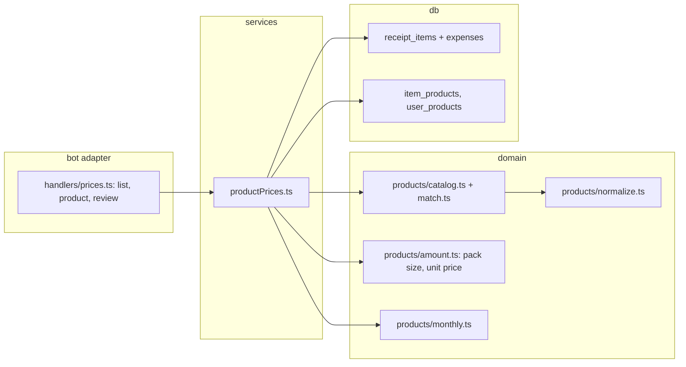

# 0036: Product prices across months: receipt items grouped into products, with spend, amount and unit price per month

> **Status:** done (2026-10-07): built as planned, one nit and one minor fixed at close, two
> minors open, Phase 6 real receipts owed, v0.26.0
> **Created:** 2026-10-06
> **Related ADRs:** [ADR-0039](../../adrs/0039-products-from-keyword-rules-and-per-user-overrides.md)
> (matching and unit-price math), [ADR-0025](../../adrs/0025-static-mini-app-fragment-in-senddata-out.md)
> (static Mini App), [ADR-0009](../../adrs/0009-persisted-flow-sessions.md) (the review flow's state),
> [ADR-0020](../../adrs/0020-sealed-ledgers-write-open-read-locked.md) (sealed ledgers)

## TL;DR

A new `/prices` command lists the products the user buys: «Молоко», «Хлеб», «Бананы». Each one
gathers every receipt item that names it, from any shop or brand. Tapping a product shows, per
month, what was spent, how much was bought (litres, kilograms or pieces) and the price per unit,
plus the all-time totals. The Mini App chart is a followup, once Plan 0030 lands. Products are
recognized by built-in keyword rules. Names the rules miss wait in a short review queue, and
each correction is remembered for that name. The first thing the user sees: `/prices`, tap
«Молоко», and October's 153.50 RSD per litre next to September's 139.00.

## Context & problem

Receipt items are stored per receipt (`receipt_items`: name, decimal `quantity`, `total_minor`).
Plan 0035 groups them by expense category for a period, but nothing links
`MLEKO 2,8%MM 1L IMLEK` at one shop to `Mleko Moja kravica 1l` at another. The user wants to
follow one product's price across months to see inflation. That needs two things: a generic
product per item, and a unit price that doesn't change just because the pack size did.

## Decision

Built-in keyword rules plus per-user overrides map item names to generic products. Unit prices
are computed in exact integers, and a month's price is weighted by amount (ADR-0039). The view
is text in the chat. The Mini App chart is a followup plan, because it needs Plan 0030's chart
mode, which isn't built yet. We rejected an LLM classifier (item names would leave the server), an
all-manual mapping (the queue never empties), and exact-name comparison (no comparison across
brands). The reasons are in ADR-0039.

## Architecture diagram



## Implementation phases

Shared fixture for the done-whens: the user's personal ledger in RSD, timezone `Europe/Belgrade`,
`now` 2026-10-06T10:00:00Z, and every receipt recorded through the services:

| # | Local day | Item name | quantity | total (minor RSD) |
|---|---|---|---|---|
| 1 | 2026-09-12 | `MLEKO 2,8%MM 1L IMLEK` | `2` | 27800 |
| 2 | 2026-10-02 | `MLEKO 0,5L MOJA KRAVICA` | `2` | 15800 |
| 3 | 2026-10-05 | `МЛЕКО 1Л` | `1` | 14900 |
| 4 | 2026-10-05 | `HLEB BELI 500G` | `1` | 6500 |
| 5 | 2026-10-05 | `BANANA /KG` | `1.245` | 24900 |
| 6 | 2026-10-05 | `ČOKOLADNO MLEKO 0,2L` | `1` | 9900 |
| 7 | 2026-10-05 | `MLEKO IMLEK` | `1` | 15000 |
| 8 | 2026-10-05 | `KESA` | `1` | 300 |

### Phase 1: walking skeleton: /prices lists products, and a product shows months and spend
- **Owner skill:** dev
- **What:** The domain normalizer, a seed catalog of common groceries (the content is dev's call
  within ADR-0039), keyword matching with exclusions, and a `/prices` command plus a ☰ Ещё row.
  The command opens a screen on the anchor that lists the user's products in the active ledger,
  ordered by spend over the last 12 months, paged. Tapping a product shows its months, newest
  first, with the spend per month and the all-time spend, plus [← Назад]. Only the user's own,
  non-deleted, fetched receipts count. A sealed ledger while locked answers `ledgerLocked`.
- **Files touched:** `src/domain/products/normalize.ts`, `src/domain/products/catalog.ts`,
  `src/domain/products/match.ts`, their `*.test.ts`, `src/db/receiptItems.ts` (items with their
  expense's day, currency and author for one ledger), `src/db/receiptItems.test.ts`,
  `src/services/productPrices.ts`, `src/services/productPrices.test.ts`,
  `src/bot/handlers/prices.ts`, `src/bot/handlers/more.ts`, `src/bot/callbackData.ts`,
  `src/bot/messages.ts`, `src/bot/messages.test.ts`, `src/services/flowSessions.ts` (the screen),
  `src/bot/flows.ts`, `src/bot/bot.ts`, `src/bot/bot.test.ts`, `src/bot/handlers/help.ts` (the
  command list).
- **Done when:**
  - `normalize('ČOKOLADNO  MLEKO 0,2L')` is `cokoladno mleko 0,2l`, and `normalize('МЛЕКО 1Л')` is
    `mleko 1l`.
  - Items 1, 2, 3 and 7 match «Молоко». Item 4 matches «Хлеб», and item 5 matches «Бананы». Item
    6 matches no product, because the milk exclusion catches `cokoladno`. Item 8 matches nothing.
  - «Молоко» shows October 2026 spend 45700 (15800 + 14900 + 15000), September 2026 spend 27800,
    and an all-time spend of 73500.
  - In the `/prices` list, «Молоко» (73500) comes before «Бананы» (24900), which comes before
    «Хлеб» (6500).
  - Another member's receipt in a shared ledger and a deleted expense's items are in no total.

### Phase 2: amount and unit price per month
- **Owner skill:** dev
- **What:** A pack-size parser and integer unit-price arithmetic (ADR-0039). Each catalog
  product carries a unit: `l`, `kg` or `pcs`. Pack sizes are parsed from the normalized name:
  `<n>[,.]<d> l|ml|kg|g|gr|kom`, and a multipack `<k>x<size>`. When the name has no size and ends
  with the `/kg` marker, `quantity` is the weight. The product view adds, per month and all-time,
  the amount bought and the price per unit. Items with no readable size count in spend only, and
  the view says how many there were.
- **Files touched:** `src/domain/products/amount.ts`, `src/domain/products/amount.test.ts`,
  `src/domain/products/monthly.ts`, `src/domain/products/monthly.test.ts`,
  `src/domain/products/catalog.ts`, `src/services/productPrices.ts`,
  `src/services/productPrices.test.ts`, `src/bot/messages.ts`, `src/bot/messages.test.ts`.
- **Done when:**
  - Amounts, stored as integer thousandths of ml, g or pieces and shown here in ml or g: item 1
    is `2` × 1000 ml = 2000 ml (stored 2,000,000). Item 2 is `2` × 500 ml = 1000 ml. Item 3 is
    1000 ml. Item 5 is `1.245` × 1000 g = 1245 g (stored 1,245,000). A quantity like `0.535`
    parses to 535 thousandths with no float, and `1.2345` is rejected.
  - Unit prices, as `round_half_up(total_minor * 10^6 / amount_milli)`: item 5 is
    24900 × 10^6 / (1245 × 1000) = 20000, which is 200.00 RSD/kg. A weighed item of `0.535` for
    7999 gives 7999 × 10^6 / 535000 = 14951.40, rounded to 14951.
  - «Молоко» for October 2026 sums spend 30700 (items 2 and 3) over 2000 ml, which gives 15350,
    or 153.50 RSD/l. Item 7 has no size, so it adds 15000 to spend (45700 shown) but nothing to
    the litres or the unit price, and the month says 1 item had no size. September is
    27800 / 2000 ml = 13900, or 139.00 RSD/l.
  - All-time «Молоко»: 4 l (4000 ml) and spend 73500. The unit price covers only the sized items:
    (27800 + 30700) / 4000 ml = 58500 × 10^6 / 4,000,000 = 14625, or 146.25 RSD/l.
  - No `parseFloat`, `Number(...)` on quantities, or `/` on amounts outside `amount.ts`. A test
    or lint grep checks this.

### Phase 3: review the unmatched names, and correct any name
- **Owner skill:** dev
- **What:** An `item_products` override table and a review flow. The `/prices` list shows
  `Не разобрано: N` with [Разобрать] when there are unmatched names in the active ledger. N counts
  distinct normalized names. The flow shows one name at a time, with how many purchases it has
  and its latest price, over a paged product picker plus [Не продукт] and [Пропустить]. Each answer
  writes one override and moves to the next name. A product view gains [Названия]: the normalized
  names counted under it, each tappable into the same picker, so a rule match can be corrected.
  Overrides win over rules. Neither the flow nor [Названия] is offered for a sealed ledger. The
  flow state, meaning the queue and its position, lives in a flow session (ADR-0009). No item name
  goes into callback data. Ask `ux-telegram` for the flow's copy and button layout before wiring
  it, or use the copy named here if the user skips that.
- **Files touched:** `src/db/migrations/0024_item_products.sql` (take the next free number at
  implementation time), `src/db/itemProducts.ts`, `src/db/itemProducts.test.ts`,
  `src/services/productPrices.ts`, `src/services/productReview.ts`,
  `src/services/productReview.test.ts`, `src/services/flowSessions.ts`, `src/bot/flows.ts`,
  `src/bot/handlers/prices.ts`, `src/bot/callbackData.ts`, `src/bot/messages.ts`,
  `src/services/deleteAccount.ts`, `src/services/deleteAccount.test.ts`, `src/bot/bot.test.ts`.
- **Done when:**
  - With the fixture, `/prices` shows `Не разобрано: 2` (`cokoladno mleko 0,2l` and `kesa`).
  - Assigning `kesa` to [Не продукт] removes it from the queue (now 1) and from every product.
  - Assigning `cokoladno mleko 0,2l` to «Молоко» adds 9900 and 200 ml to October. That gives
    spend 55600 and sized spend 40600 over 2200 ml, so the unit price is
    40600 × 10^6 / 2,200,000 = 18454.55, rounded half up to 18455.
  - Reassigning `mleko imlek` from «Молоко» to [Не продукт] through [Названия] drops its 15000
    from October's spend.
  - A double-tapped answer writes one override: the primary key is `(user_id, name_key)`, and the
    second write is an upsert to the same value.
  - Deleting the account removes the user's `item_products` rows.

### Phase 4: the user's own products
- **Owner skill:** dev
- **What:** In the picker, [Новый продукт] asks for a name (text, up to 40 characters) and a
  unit ([л] [кг] [шт]), then creates a `user_products` row and assigns the current name to it.
  User products appear in the picker and in `/prices` next to catalog products. A user product
  whose name equals a catalog product's name, compared case-insensitively, is refused with a
  pointer to the catalog one.
- **Files touched:** the next free migration, `src/db/userProducts.ts`,
  `src/db/userProducts.test.ts`, `src/services/productReview.ts`,
  `src/services/productReview.test.ts`, `src/services/flowSessions.ts`, `src/bot/flows.ts`,
  `src/bot/handlers/prices.ts`, `src/bot/messages.ts`, `src/services/deleteAccount.ts`,
  `src/bot/bot.test.ts`.
- **Done when:** Creating «Шоколадное молоко» (л) from the `cokoladno mleko 0,2l` review shows
  it in `/prices` with October spend 9900, 200 ml, and 9900 × 10^6 / 200,000 = 49500, which is
  495.00 RSD/l. Creating «молоко» is refused. Deleting the account removes the user's
  `user_products` rows.

### Phase 5: a local coverage report
- **Owner skill:** dev
- **What:** `pnpm products:coverage`, a script the user runs against the production database
  copy on their own machine. It prints, per ledger, the share of items and of spend matched by
  rules, by overrides and not at all, and the 30 most frequent unmatched normalized names. It
  writes nothing, and only the user's terminal sees it. Dev never runs it against real data.
- **Files touched:** `scripts/products-coverage.ts` or `src/tools/productsCoverage.ts` (dev's
  call, matching how other scripts are run), its test against a fixture database, `package.json`
  (the script).
- **Done when:** On the Phase 1 fixture database, the report shows 6 of 8 items matched by
  rules (items 1, 2, 3, 4, 5 and 7) and 0 by overrides. It shows matched spend of 104900 of
  115100 (the unmatched items 6 and 8 make 9900 + 300 = 10200), and lists
  `cokoladno mleko 0,2l` and `kesa` as unmatched. The test computes the expected sums from the
  fixture rows.

### Phase 6: real receipts
- **Owner skill:** human
- **Blocks merge:** no
- **What:** Run `pnpm products:coverage` on a copy of the production database. Pass on only the
  generic product words of the top unmatched names to a `dev` session as catalog additions (no
  shop or personal data). Then check «Молоко» and two other products on a phone.
- **Files touched:** none.
- **Done when:** The user reports the coverage share before and after one catalog pass, and
  confirms that the monthly unit prices look right for three products.

## Data shapes

```sql
-- illustrative
-- A user's correction for one normalized item name (ADR-0039). product: 'b:<catalog key>',
-- 'u:<user_products.id>', or NULL for "not a product". Never written for a sealed ledger.
CREATE TABLE item_products (
  user_id TEXT NOT NULL REFERENCES users(id),
  name_key TEXT NOT NULL,
  product TEXT,
  set_at TEXT NOT NULL,           -- UTC instant
  PRIMARY KEY (user_id, name_key)
);
CREATE TABLE user_products (
  id INTEGER PRIMARY KEY,
  user_id TEXT NOT NULL REFERENCES users(id),
  name TEXT NOT NULL,
  unit TEXT NOT NULL CHECK (unit IN ('l', 'kg', 'pcs')),
  created_at TEXT NOT NULL
);
```

```ts
// illustrative: src/domain/products
interface CatalogProduct { key: string; name: string; unit: 'l' | 'kg' | 'pcs';
  keywords: readonly string[]; exclude?: readonly string[] }
// Thousandths of ml, g or pieces: an exact integer, never a float.
type AmountMilli = bigint;
function amountOf(nameKey: string, quantity: string, unit: Unit): AmountMilli | undefined;
function unitPriceMinor(totalMinor: bigint, amount: AmountMilli): bigint; // round half up
```

Callback data: `prc:p:<page>` for the list, `prc:o:<product ref>` to open a product (a ref is at
most `u:` plus an integer, or `b:` plus a catalog key of at most 24 ASCII characters), and
`prc:r:<index>` for a review answer against the flow session. Each is checked by
`assertCallbackData`.

## Risks & open questions

- **Catalog coverage is unknown.** Phase 5 measures it and Phase 6 acts on it. The first catalog
  is a guess built from common Serbian grocery words.
- **Shop name formats are unverified.** The `/kg` marker and the size patterns come from typical
  Serbian receipts, not a checked sample. The Phase 6 coverage report shows the misses.
- **Currency.** Months are kept per currency, and unit prices are never converted. The list
  ranks by spend in the ledger's default currency.
- **Sealed ledgers** use the rules only and get no review. Rendering them requires an unlocked
  ledger, as every report does.
- **Privacy.** `name_key` holds item text that `receipt_items` already holds in plaintext, so
  nothing new is exposed. The coverage report prints to the user's terminal only. Fixtures use
  invented names.
- **Performance.** Every view scans the user's receipt items in the ledger. That's fine at
  personal scale (thousands of rows). If it isn't, cache per normalized name later.
- **Idempotency.** Review answers are upserts on `(user_id, name_key)`. Creating a user product
  from a double-tapped unit button must create one row: dedupe on the flow session's step.

## What this plan does NOT do

- **No Mini App chart.** A followup plan adds [📈 График] (unit price as a line, spend as bars,
  using Plan 0030's payload contract) once Plan 0030 Phase 1 is merged.
- **No AI classification and no network calls** (ADR-0039).
- **No exact-variant tracking** ("Imlek 2.8% 1L" as its own product). A product is generic, and a
  user product can stand in for a variant if the user wants one.
- **No inflation index, basket or alerts** ("milk is up 10%"). That's a possible later plan.
- **No shop comparison and no product column in `/export`.**
- **No currency conversion of unit prices.**
- **No item categories replacing the expense category** in Plan 0035's view.

## Implementation log

| phase | owner | state | commit |
|---|---|---|---|
| 1: /prices skeleton | dev | done | 878daa4 |
| 2: amount and unit price | dev | done | ccc3e48 |
| 3: review and corrections | dev | done | 3fee520 |
| 4: user products | dev | done | 651178f |
| 5: coverage report | dev | done | 94fc8b6 |
| 6: real receipts | human | owed | |

### Notes

- Phase 1: `src/bot/handlers/help.ts` is unchanged. The help text and the command list live in
  `src/bot/messages.ts`, which now carries `/prices`.
- Phase 1: the product view's back button is the shared `messages.backButton` ([« Назад]), not
  [← Назад]. It returns to page 1 of the list.
- Phase 1: no `catalog.test.ts`. The catalog-key check (unique, at most 24 ASCII characters)
  is in `src/domain/products/match.test.ts`.
- Phase 2: also touched `src/bot/handlers/prices.ts` (passes the product view to messages as
  is) and `src/bot/bot.test.ts` (the Phase 1 product text now carries litres and the unit
  price). Both are outside the phase's list.
- Phase 2: a piece price is `total * 10^3 / amount_milli`, since a piece is already the base
  unit. Litres and kilograms use `10^6` as stated.
- Phase 2: the arithmetic gate is a test in `src/services/productPrices.test.ts`, not in
  `amount.test.ts`: lint forbids `node:fs` in the domain. It also forbids `BigInt(`, which
  only `amount.ts` uses.
- Phase 2: a size in another dimension than the product's unit (`180G` on a litre product)
  counts as no size.
- Phase 3: the migration is `0025_item_products.sql`, the next free number.
- Phase 3: an answer is `prc:r:<position>:<ref | n | s>`, not `prc:r:<index>`. It carries the
  name's position in the queue and the product's ref, so a double tap answers the same name
  with the same product. Also added: `prc:rv` ([Разобрать]), `prc:rp:<page>` (picker pages),
  `prc:nm:<ref>` ([Названия]), `prc:np:<page>` and `prc:nn:<index>` (a name in that list).
- Phase 3: the queue and its position live in the anchor's screen context in the
  `flow_sessions` row (`PricesScreen.names`, `position`, `product`), not in the pending-flow
  slot. They have no TTL and take no typed text.
- Phase 3: `ux-telegram` was not consulted (headless conductor session). The labels are the
  plan's ([Разобрать], [Не продукт], [Пропустить], [Названия], `Не разобрано: N`); the step
  and names texts are dev's.
- Phase 3: overrides are per user, not per ledger, so one answer applies in every plaintext
  ledger the user views. A sealed ledger ignores them.
- Phase 4: the migration is `0026_user_products.sql`, with an index on `user_id`.
- Phase 4: also touched files outside the phase's list. `src/services/productPrices.ts`
  resolves `u:<id>` refs and lists user products next to the catalog.
  `src/bot/callbackData.ts` gained `prc:new` and `prc:u:<unit>`.
  `src/services/deleteAccount.test.ts` checks the deleted `user_products` rows.
- Phase 4: the typed name waits for its unit on the anchor's screen
  (`PricesScreen.newProduct`). The unit tap consumes it in the transaction that creates the
  product, so a second tap finds nothing and creates nothing. A name is refused when it
  matches a catalog product's name case-insensitively. A clash with the user's own product
  names is not checked.
- Phase 5: both options are used. The report logic is in `src/tools/productsCoverage.ts` (with
  `productsCoverage.test.ts`), so vitest can reach it. `scripts/products-coverage.ts` is the
  entry and opens the file read-only (`fileMustExist`). The path comes from argv,
  `DATABASE_PATH` or `./data/bot.sqlite`.
- Phase 5: the report counts plaintext rows only, because a sealed ledger's items are
  encrypted. Each ledger gets one block per currency. An item whose author answered "not a
  product" counts as unmatched.
- Phase 5: the CLI was smoke-run only against a missing lane path, where it refused to open
  (`SQLITE_CANTOPEN`). It has not been run against any real database.
- Followups noticed and not acted on: the catalog's units and keywords are a first guess
  (Phase 6 measures them). A pack size in another dimension (`JOGURT 180G` on a litre product)
  stays unsized. A piece product with no `kom` size is unsized even when `quantity` counts
  pieces. The product list's back button always returns to page 1.

### Close triggers

- Phases 1–5 (`dev`) are done in 878daa4, ccc3e48, 3fee520, 651178f and 94fc8b6. Phase 6
  (`human`, does not block merge) has not started.
- Gate on the tip (94fc8b6): `pnpm typecheck` exit 0; `pnpm lint` exit 0; `pnpm test` exit 0,
  125 files and 1754 tests passed; `pnpm build` exit 0; `node scripts/check-doc-links.mjs`
  exit 0, 283 relative links resolve.
- New migrations: `0025_item_products.sql` and `0026_user_products.sql`.
- New command: `/prices`, in `messages.commands`, the help text and a [☰ Ещё] button (`more:prc`).
- New script: `pnpm products:coverage`.

## Close review

Round 1, a fresh conductor review session on tip db589a4. It is reproduced in full below.

# Plan 0036 review, round 1 (tip db589a491a065d7189e269d32904028ce3804a9c)

**Verdict:** Plan 0036 is built as planned and its gate is green. The findings are three minors
and one nit, with no blocker or major, so the plan can close once the bookkeeping below is done.

## Gate (run in this session, on the tip)

- `pnpm typecheck`: exit 0.
- `pnpm lint`: exit 0.
- `pnpm test`: exit 0. 126 files and 1763 tests passed. The log's 125/1754 was counted at
  94fc8b6, before main was merged in.
- `node scripts/check-doc-links.mjs`: exit 0, 291 relative links resolve.

## Alignment

- Phases 1 to 5 (`dev`) are done. Phase 6 (`human`, `Blocks merge: no`) is owed. Each phase has
  exactly one in-vocabulary owner tag.
- I read the assertion of every done-when test:
  - Phase 1: `src/domain/products/normalize.test.ts` (both normalize strings exactly) and
    `match.test.ts` (items 1-8, the exclusion, the key check). `productPrices.test.ts` checks the
    ranking `[Молоко 73500, Бананы 24900, Хлеб 6500]`, the deleted expense, and another member's
    receipt in a shared ledger (exact `[['RSD', 73500]]`). `bot.test.ts` `/prices (Plan 0036)`
    has the exact list text and keyboard, and `ledgerLocked` for a locked sealed ledger.
  - Phase 2: `amount.test.ts` checks the exact amounts (2_000_000n, 1_000_000n, 1_245_000n),
    `0.535` → 535n, `1.2345` rejected, 20000, 14951 and 18455. `productPrices.test.ts` checks
    the full October/September/all-time lines with `toEqual`: 45700/30700/2_000_000n/unsized
    1/15350, 27800/13900, and 73500/58500/4_000_000n/14625.
  - Phase 3: `productReview.test.ts` checks the queue `['cokoladno mleko 0,2l', 'kesa']`, kesa
    leaving the queue (1), October 55600/40600/2_200_000n/18455, mleko imlek dropping October to
    30700, and one row after a double answer. `bot.test.ts` covers the same paths end to end,
    through `prc:rv` and `prc:nm`. `deleteAccount.test.ts` checks the item_products rows.
  - Phase 4: 9900 / 200_000n / 49500, «молоко» refused against «Молоко», one product for a
    double-tapped unit, and the user_products rows on account deletion.
  - Phase 5: `productsCoverage.test.ts`: 6 rules / 0 overrides, spend 104900 of 115100, the
    unmatched 9900 + 300, both names, and `total_changes()` unchanged.
- I checked the done-when arithmetic by hand against `amount.ts`: `divideHalfUp` is
  `(2n + d) / 2d` on bigint. `0,5l` parses to 500 000 thousandths of ml, and `2,8%mm` is skipped
  by the lookbehind. It agrees.
- The logged deviations are sound and in the plan's spirit: the `prc:r:<position>:<choice>`
  shape, the queue held in the anchor's screen context, and the piece price at 10^3. No ADR is
  silently reversed. The piece formula does contradict the ADR-0039 text, though: see the
  bookkeeping.

## Layering, correctness, privacy

- grammY is imported only in `src/bot/`. The domain imports no db and no Telegram code. All copy
  is in `messages.ts`, and shop text and user product names go through `html`.
- Money and amounts are integers. `BigInt(` appears only in `amount.ts`. Every `Number(` in the
  new bot code reads a callback page or index or a month string, never a quantity. The only `/`
  outside `amount.ts` is the coverage percentage, which is on spend.
- "The last 12 months" is computed in the user's effective timezone, and the
  2025-10-31/2025-11-01 boundary is tested.
- Idempotency: answers upsert on `(user_id, name_key)`. A unit tap consumes `newProduct` in the
  transaction that creates the product, and the typed name completes its flow by `inputKey`.
- No callback data carries an item name. Every builder goes through `assertCallbackData`, and the
  longest is `prc:r:9999:b:<24>`, at 37 bytes.
- The only info log is `{ userId, productId }`. Fixtures use invented names.

## Findings

### blocker

None.

### major

None.

### minor

1. **The product view has no length bound.**
   - *Where:* `src/bot/messages.ts:1548` (`productView`), rendered by
     `src/bot/handlers/prices.ts:102`.
   - *What:* every month of every currency is printed, plus the totals, with no cap and no
     paging. One line is about 70 visible characters
     (`Октябрь 2026: 457.00 RSD · 2 л · 153.50 RSD/л · 1 позиция без размера`).
   - *Why it matters:* after about 55 months in one currency, or half that with two currencies,
     the text passes Telegram's 4096 characters. `editMessageText` then fails, and the product
     button does nothing. Every other long report in `messages.ts` guards this (ADR-0012's
     `MAX_VISIBLE_CHARS`, the paged item lists). It is latent today because receipts are recent.
   - *Fix:* show at most the newest N months (24 fits easily), with the all-time line kept and a
     note that older months are folded into it, or page the months. Add a test that 60 months in
     two currencies stay within 4096 visible characters.

2. **The arithmetic gate checks fewer files than its done-when names.**
   - *Where:* `src/services/productPrices.test.ts:255`.
   - *What:* Phase 2 promises "No `parseFloat`, `Number(...)` on quantities, or `/` on amounts
     outside `amount.ts`. A test or lint grep checks this." The test scans `src/domain/products/*`
     (without `amount.ts`) and `src/services/productPrices.ts` only.
     `src/services/productReview.ts`, `src/tools/productsCoverage.ts` and
     `src/bot/handlers/prices.ts` also read items, and none of them is scanned.
   - *Why it matters:* the claim is true on today's tree. I grepped those files, and the only
     hits are callback indices, month strings and the coverage percentage. But a future
     `Number(item.quantity)` in `productReview.ts` or the coverage tool would pass the gate.
   - *Fix:* add `src/services/productReview.ts` to `files`. For the coverage tool and the
     handler, either scan them with a pattern scoped to quantities (`/quantity\)|parseFloat/`),
     or move `percent` into `amount.ts` (or a money helper) so the tool can join the strict scan.

3. **The README's command table has no `/prices` row.**
   - *Where:* `README.md`, the private-chat command table (next to `/tags` at line 38).
   - *What:* the plan adds a user-visible command, a [☰ Ещё] button and a review flow. `/help`
     and `messages.commands` carry it, but the README table, which lists every private command
     (`/debts`, `/tags`, `/export` …), does not.
   - *Why it matters:* lens 4 says the README follows a user-observable change. Without the row,
     the README undersells the bot and goes stale.
   - *Fix:* add a `/prices` row. It should cover: products from your own fetched receipt items
     in the active ledger, by 12-month spend; a product's months with spend, amount and price per
     l/kg/piece; [Разобрать] for unmatched names; [Названия] to correct a name; [Новый продукт];
     and the sealed-ledger behaviour (rules only, while unlocked).

### nit

1. **A displaced doc comment.**
   - *Where:* `src/bot/messages.ts:465`.
   - *What:* the comment ``// `1 позиция`, `2 позиции`, `5 позиций`, `21 позиция`.`` belonged
     to `itemCount`. It now sits above the new `PriceLineView` block, and `itemCount` (line 500)
     has lost it.
   - *Fix:* move the comment back above `itemCount`, and give `purchaseCount` its own one-line
     example comment.

## Bookkeeping owed at close

- **ADR-0039 → accepted, with a dated `## Outcome`.** The decision text gives
  `round_half_up(total_minor * 10^6 / amount_milli)` per litre, kilogram *or piece*. For pieces
  that would be a price per thousand pieces. The implementation uses `10^3` for pieces (Plan 0036
  log, Phase 2). Record that. Also record that overrides are keyed per user, not per ledger, and
  apply in every plaintext ledger, while a sealed ledger ignores them.
- **CLAUDE.md "Where things live"**: `src/tools/` is a new top-level `src/` directory
  (`productsCoverage.ts`, local reports run by `scripts/`), and the map doesn't list it.
  `scripts/products-coverage.ts` could join the `scripts/` lines too.
- **Version:** this is a feature plan (new command, two migrations), so a minor bump with a
  `CHANGELOG.md` entry and its `versionAnnouncements` entry.
- **Plan index:** move 0036 to recently closed, and note that Phase 6 (`human`) is still owed.
- **Followups to carry:** the Mini App chart plan (after Plan 0030 Phase 1). The log's own
  followups are also worth carrying: a size in another dimension stays unsized, a piece product
  without `kom` is unsized, the list's back button always goes to page 1, and own-product names
  are not checked for clashes with each other.

### Resolution at close

- Earlier rounds: none. Round 1 is the only review, so no fix round resolved anything.
- Minor 3 (README `/prices` row) is fixed in cdddc38, which also adds [Цены] to the [☰ Ещё] list.
- Nit 1 (displaced comment) is fixed in 1cd4bd7.
- Minors 1 (product view length) and 2 (arithmetic gate scope) stay open as followups below.
- Bookkeeping done in the close commit: ADR-0039 accepted with an `## Outcome`, `src/tools/` and
  `scripts/products-coverage.ts` added to CLAUDE.md, v0.26.0, and the plan index row.
- Phase 6 (`human`, real receipts) stays **owed**.

## Followups

- A plan for the product price chart in the Mini App ([📈 График] on the product view), after Plan
  0030 Phase 1. Its payload carries month, spend, amount and unit price for up to 24 months in the
  ledger's default currency, and other currencies appear as text lines.
- Close review minor 1: cap or page the product view's months so it stays within 4096
  characters.
- Close review minor 2: widen the arithmetic gate in `src/services/productPrices.test.ts` to
  `productReview.ts`, the coverage tool and the prices handler.
- From the log: a pack size in another dimension stays unsized, a piece product without `kom` is
  unsized, the list's back button always returns to page 1, and own-product names aren't checked
  for clashes with each other.
