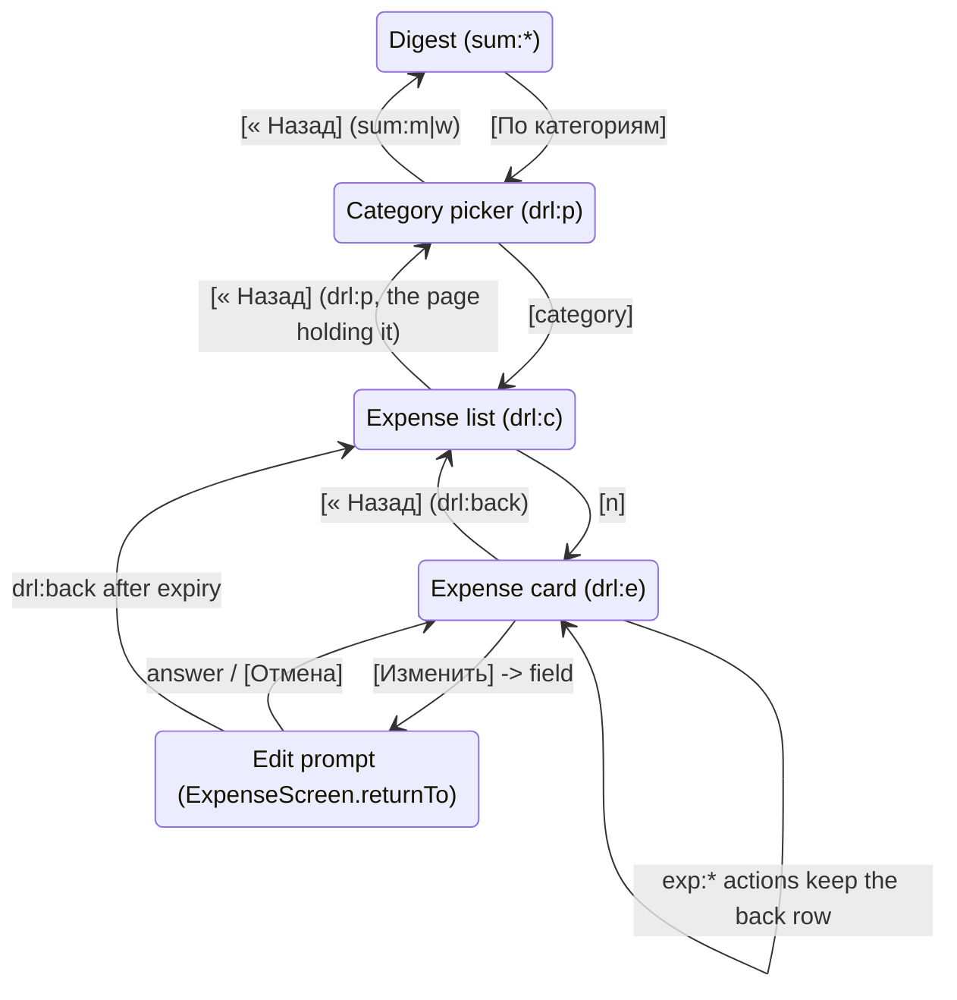

# 0037: Category drill-down: from /week or /month to a category's expenses, and on to each expense's card

> **Status:** done (2026-10-07): built as planned, one nit fixed at close, one minor open, Phase 4
> live check owed, v0.29.0
> **Created:** 2026-10-06
> **Related ADRs:** [ADR-0040](../../adrs/0040-expense-card-inside-a-screen-anchor.md) (the card
> inside a screen anchor), [ADR-0011](../../adrs/0011-navigation-model.md) (cards, screens, the
> anchor), [ADR-0020](../../adrs/0020-sealed-ledgers-write-open-read-locked.md) (sealed ledgers),
> [ADR-0022](../../adrs/0022-fx-nbs-middle-rate-ledger-currency.md) (converted totals)

## TL;DR

`/week` and `/month` gain a `[По категориям]` button. It turns the summary into a picker of the
period's categories. A category shows that period's expenses in it, newest first, eight to a page,
each line numbered, with number buttons under it. A number opens that expense's real card in the
same message, with `[« Назад]` to the list. That lets the user fix a misfiled expense's category
(or its amount, date, or delete it) straight from the report, instead of scrolling the chat for
its confirmation. Private chats only. The first thing the user sees: `/month`, `[По категориям]`,
`[Продукты]`, `[3]`, `[Категория]` → `Кафе`, `[« Назад]`, and the list no longer has it.

## Context & problem

The summary shows totals per category and nothing else (`src/bot/handlers/summary.ts`). The only
way to change an expense's category is the `[Категория]` button on its card, and the card is the
confirmation message in the chat (ADR-0011). Finding a wrong entry from last month means
scrolling. Plan 0004 named the drill-down as its natural next plan under "does NOT do".

A card has never lived inside a screen before. Its `exp:*` handlers re-render it with no way
back, and its callback data has no room to carry one. ADR-0040 settles how the card gets its back
row from the anchor's session row.

## Decision

The drill-down is three new states of the summary screen, in the summary's own anchor: a category
picker, an expense list, and an expense card. Each one is recorded in `SummaryScreen.drill`. The
picker and the list are screen callbacks (`drl:*`), and only the anchor accepts them (ADR-0011).
The card is the real card, drawn by the existing code, plus a back row that one helper adds when
the anchor says the card is in a drill-down (ADR-0040). We rejected a re-categorise picker in the
screen with no card, because it can't edit or delete and duplicates the card's picker. We rejected
sending the card as a new message, because it fills the chat and has no way back (both in
ADR-0040). Group chats get no drill-down. Their report pages statelessly with no per-user anchor,
a list would show every description to the whole chat, and most taps would be refused because
editing is author-only.

The UX (states, copy, callback layout) comes from a ux-telegram design on 2026-10-06.

## Architecture diagram



## Implementation phases

Each phase ships as its own commit. `dev` implements all phases in one session with no review
between phases. The architect reviews once at the end, in a fresh session.

### Phase 1: The picker and the list, read-only
- **Owner skill:** dev
- **What:** `[По категориям]` on the summary opens the category picker. A category opens its
  numbered, paged expense list. `[« Назад]` goes back up each level. Number buttons are present
  but answer silently until Phase 2.
- **Files touched:** `src/services/periodCategory.ts` (new) + `.test.ts`, `src/db/expenses.ts`
  (only if the existing period query can't serve it), `src/services/flowSessions.ts`
  (`SummaryScreen.drill`), `src/bot/callbackData.ts`, `src/bot/handlers/drill.ts` (new) +
  `drill.test.ts`, `src/bot/handlers/summary.ts`, `src/bot/messages.ts` + `messages.test.ts`,
  `src/bot/bot.ts`, `src/bot/flows.ts` (the summary branch of the restore switch, if the new
  `drill` field needs it).
- **Done when:**
  - The summary keyboard is `[◀ prev] [next ▶]` / `[По категориям] [Позиции]`. A period with
    no expenses has no `[По категориям]`. The group report (`src/bot/group/summary.ts`) carries no
    `drl:*` button, pinned in `src/bot/group/group.test.ts`.
  - **Picker order** follows the digest: the first currency block's lines by amount, then the
    categories found only in the unconverted blocks in order of appearance, then
    `messages.uncategorized` last. A category in two blocks gets one button. Pinned with a fixture
    holding RSD expenses in Продукты and Кафе and an unconverted-currency expense in Продукты:
    the buttons are exactly Продукты, Кафе.
  - **List content:** expenses of that ledger, period and category (`null` = uncategorized),
    newest first by `occurred_on`, then `occurred_at`, then id. Deleted expenses are excluded.
    Each line shows `{n}. {d MMM} — {original amount and currency} · {description}`, with the
    description HTML-escaped and cut to 40 characters plus `…`. In a shared ledger, the author's
    member name follows, or `messages.unnamedAuthor` when it has none.
  - **Header totals equal the digest's line(s) for that category.** Both sum per-expense
    conversions (`summarizeConverted`), so this holds by construction. A service test asserts it
    with a fixture holding one foreign expense with a rate and one without: the list's blocks
    equal the matching lines of `ledgerPeriodSummary`.
  - **Paging:** 19 expenses in a category give 3 pages (8, 8, 3). Page 3 shows lines 17–19 and
    buttons `[17] [18] [19]`, and the pager reads `[◀] [3/3] [▶]`. Number buttons go in rows of 4.
    (Over-specified at close: the shared `pagerRow` in `src/bot/nav.ts` drops `[▶]` on the last
    page, as every pager in the bot does, so page 3 of 3 reads `[◀] [3/3]`.)
  - **Back:** the list's `[« Назад]` opens the picker page that holds its category (category 10
    of 12 → picker page 2). The picker's `[« Назад]` is the digest of the same period, and it
    clears `drill`.
  - **Empty category** (every expense moved out): `drillListEmpty` with `[« Назад]` only.
  - **Guards**, each pinned with a test: a `drl:*` tap on a message that isn't the anchor gets
    `staleScreen` and edits nothing. A ledger locked between taps (ADR-0020) gets
    `ledgerLockedToast` and edits nothing. A forged period, a future period, or a category id
    absent from the ledger answers silently and edits nothing (like the pager). A user who left
    the ledger gets the same.
  - Every `drl:*` builder goes through `assertCallbackData`. The widest,
    `drl:c:w:2026-09-28:<16-digit id>:9999`, is 40 bytes, pinned in a test.
  - `messages.uncategorized` replaces the four inline `'Без категории'` literals in
    `src/bot/messages.ts`, and the existing message tests still pass unchanged.

### Phase 2: The card in the drill-down
- **Owner skill:** dev
- **What:** a number opens the expense's card in the anchor. One helper adds `[« Назад]` to every
  card re-rendered on the anchor while it shows this expense in a drill-down (ADR-0040), and a
  viewer who isn't the author sees `[« Назад]` alone.
- **Files touched:** `src/bot/handlers/card.ts` (the helper), `src/bot/handlers/drill.ts` +
  `drill.test.ts`, `src/bot/handlers/category.ts`, `src/bot/handlers/edit.ts`,
  `src/bot/handlers/receipt.ts`, `src/bot/handlers/recurring.ts`, `src/bot/flows.ts`,
  `src/services/flowSessions.ts`, `src/bot/callbackData.ts`.
- **Done when:**
  - `[n]` (`drl:e:<uuid>`, 42 bytes) is accepted only on the anchor while it shows a list, and only
    for an expense of the anchor's ledger. Otherwise: `staleScreen`, or `expenseNotFound`, with
    no edit. It renders `cardFor(cardView(...))` plus `[« Назад]` on its own bottom row, and
    records `drill.expenseId`.
  - **The back row survives every card action on the anchor.** One test per re-render site taps
    the action on a drill-down card and asserts the last keyboard row is `[« Назад]`
    (`drl:back`): set category (`category.ts`, both the change and the picker's back via
    `SHOW_EXPENSE`), delete and restore (`card.ts`), the date quick button (`edit.ts`), receipt
    items' back and retry (`receipt.ts`), repeat's back (`recurring.ts`).
  - **Old cards are unchanged:** the same actions on a confirmation that isn't the anchor produce
    no `drl:back` row, pinned with one test per action kind.
  - **Read-only for others:** in a shared ledger, another member's expense opens with
    `[« Назад]` as its only button.
  - **Back to the list:** after moving the expense from Продукты to Кафе, `drl:back` shows
    Продукты's list on the same page, re-read from the DB, without that expense, and its header
    total is lower by exactly that expense's amount (converted the way the digest converts it).
    Back from a deleted expense's card shows the list without it. If the page no longer exists
    (the last expense of the last page moved out), the last page that does is shown.

### Phase 3: Edit prompts from the drill-down card
- **Owner skill:** dev
- **What:** an edit prompt started from a drill-down card keeps the way back. `ExpenseScreen`
  gains `returnTo: SummaryScreen`. When the flow ends, the anchor becomes that summary screen
  again, and the card it restores has `[« Назад]`.
- **Files touched:** `src/services/flowSessions.ts`, `src/bot/handlers/edit.ts`,
  `src/bot/flows.ts`, `src/bot/handlers/drill.ts` + `drill.test.ts`.
- **Done when:**
  - Typing a valid amount, typing `/cancel`, tapping `[Отмена]`, and the `gone` path each leave
    the anchor as the summary screen with `drill.expenseId` set, and the card's last row as
    `[« Назад]`. One test per path.
  - A prompt left past `FLOW_TTL_MS`: tapping `drl:back` on the card still shows the list
    (`drl:back` accepts an `ExpenseScreen` with `returnTo`).
  - An edit started from an ordinary confirmation stores no `returnTo`, and its restored card has
    no back row (the existing edit tests stay green unchanged).
  - A date edit that moves the expense out of the period: back shows the list without it.

### Phase 4: Live check
- **Owner skill:** human
- **Blocks merge:** no
- **What:** on the deployed bot, with real data: `/month` → `[По категориям]` → a category → an
  expense → change its category → `[« Назад]` twice → `[« Назад]` to the digest.
- **Done when:** the moved expense left the first category's list, the digest's two category
  lines changed by its amount, and each `[« Назад]` landed where the diagram says. Also checked
  once in a shared ledger (another member's expense opens read-only), and once on a phone, where
  the number rows don't wrap.

## Data shapes

```ts
// illustrative: src/services/flowSessions.ts
interface PeriodRef { readonly kind: 'week' | 'month'; readonly key: string } // periodKey()

type Drill =
  | { readonly level: 'picker'; readonly period: PeriodRef; readonly page: number }
  | { readonly level: 'list'; readonly period: PeriodRef; readonly categoryId: number | null;
      readonly page: number; readonly expenseId?: ExpenseId } // expenseId: the card is open

interface SummaryScreen { readonly name: 'summary'; readonly ledgerId: LedgerId; readonly drill?: Drill }
interface ExpenseScreen { readonly name: 'expense'; readonly expenseId: ExpenseId; readonly returnTo?: SummaryScreen }
```

| Button | Callback data | Max bytes |
|---|---|---|
| `[По категориям]`, picker pager, list's back | `drl:p:<m\|w>:<key>:<page>` | 23 |
| A category, list pager | `drl:c:<m\|w>:<key>:<categoryId\|n>:<page>` | 40 |
| `[n]` | `drl:e:<uuid>` | 42 |
| The card's `[« Назад]` | `drl:back` | 8 |

The picker's `[« Назад]` reuses `sum:<m|w>:<key>`, and the summary handler clears `drill`.

Copy (messages module, polite "вы", Russian plurals through the existing helper):

| Key | Text |
|---|---|
| `drillButton` | `По категориям` |
| `drillPicker(view)` | `<b>{period title} — «{ledger}»</b>`, the category lines unfolded, then `Выберите категорию, чтобы увидеть её траты.` |
| `drillList(view)` | `<b>{category} · {period title, lower case}</b>` / `«{ledger}» · {N трат} · {totals as in the digest}`, a blank line, the numbered lines |
| `drillListEmpty(view)` | `В категории «{category}» за {period, lower case} трат нет.` |
| `uncategorized` | `Без категории` |

## Risks & open questions

- **A missed re-render site** drops the back row and strands the user on a card inside the
  drill-down (ADR-0040's main cost). Phase 2 pins every site in today's tree. A card action added
  later must call the helper. The close review greps `recordedCard(`, `deletedCard(` and
  `cardFor(` against the helper.
- **Privacy:** the list shows descriptions, so it renders only after the same membership and
  sealed-ledger checks as the digest (`openExpenses`). Group chats are excluded for this reason
  too. Nothing new is logged above debug.
- **Money:** list lines show original amounts only. Header totals come from the same
  `summarizeConverted` the digest uses, never from adding up the lines' amounts.
- **Time:** the period and every line's date are in the ledger's effective timezone, the same as
  the digest. A shared ledger in another zone is covered by the shared-ledger list test.
- **Idempotency:** every `drl:*` tap is navigation and only re-renders. Category changes keep
  their existing `unchanged` path.
- **Session row size:** `drill` adds a few short fields to the summary anchor's JSON.

## What this plan does NOT do

- No drill-down in group chats. That would need a per-user anchor in groups, a future plan if
  asked.
- No drill-down from `/today`, `/tag` or the summary push.
- No search or filter by description or amount.
- No bulk re-categorisation ("move all of these to Кафе").
- No `/help` or tip copy for the button. It sits on the summary, where it's found. A tip can come
  with a later onboarding pass.

## Implementation log

| phase | owner | state | commit |
|---|---|---|---|
| 1: The picker and the list, read-only | dev | done | eff64db |
| 2: The card in the drill-down | dev | done | be7e716 |
| 3: Edit prompts from the drill-down card | dev | done | a74caf8 |
| 4: Live check | human | owed | |

### Notes

- Phase 1: `src/bot/bot.test.ts` (outside `Files touched`) had its six summary-keyboard pins
  updated to the new `[По категориям] [Позиции]` row.
- Phase 1: `src/bot/messages.ts` held six inline `'Без категории'` literals, not four; all six now
  read `UNCATEGORIZED`, exposed as `messages.uncategorized`.
- Phase 1: done-when "the pager reads `[◀] [3/3] [▶]`" not met as stated. The list uses the shared
  `pagerRow` (`src/bot/nav.ts`), which drops `[▶]` on the last page, so page 3 of 3 reads
  `[◀] [3/3]`; that is what `drill.test.ts` pins.
- Phase 1: `drillListEmpty` reads `за сентябрь 2026` for a month and `за неделю 28 сентября – 4
  октября` for a week, not the lower-cased week title (`за неделя, …`).
- Phase 1: `messages.unnamedAuthor` did not exist at the top level (only inside `exportColumns`);
  added as `'участник'`. `drillPicker` shows the digest's blocks unfolded without the conversion
  notes.
- Phase 1: the list's `[« Назад]` page comes from `CategoryExpenses.pickerIndex`, computed in the
  service from the same rows; no `src/db/expenses.ts` change.
- Phase 2: the helper is `cardAt(deps, user, at, view, card)` in `src/bot/handlers/card.ts`. The
  receipt items' `[« Назад]` and repeat's `[« Назад]` are both `exp:show`, handled in
  `category.ts`; `receipt.ts` routes only `[Повторить]`, `recurring.ts` only the card after a
  schedule pick. `flows.ts`'s three card renders go through `cardAt` already; they draw no back row
  until Phase 3 gives the edit prompt's anchor a `returnTo`.
- Phase 2: the date quick button test taps `exp:dt` directly on the drill-down card's anchor. The
  button lives on the date prompt, whose anchor is an `ExpenseScreen` until Phase 3.
- Phase 2: `[n]` on a locked sealed ledger toasts `ledgerLockedToast` (not named in the done-when).
  `src/services/flowSessions.ts` and `src/bot/callbackData.ts` needed no Phase 2 change (`drill`,
  `drl:e` and `drl:back` landed in Phase 1). `src/bot/receiptWorker.ts`'s `cardFor` is not routed:
  it edits the remembered confirmation, never the anchor.
- Phase 3: the anchor goes back to `returnTo` through `returnFromPrompt` in
  `src/services/flowSessions.ts`, called by `flows.ts` (valid answer, `gone`, `/cancel` via
  `restoreScreen`) and by `cancelFlowIf` whenever it cancels an edit flow. That last call is how
  `[Отмена]` (`exp:show` in `category.ts`) and the date quick button (`editExpense.ts`) return to the
  drill-down without editing those files.
- Phase 3: `drl:back` on an `ExpenseScreen` anchor also cancels a still-pending edit of that
  expense, so a later typed text is not taken as the answer while the anchor shows the list.
- Followup, not acted on: if a drill-down card's edit prompt loses its pending flow some other way
  (any command or menu tap clears it) and the user then taps `[Отмена]`, `cancelFlowIf` finds
  nothing to cancel, the anchor stays the `ExpenseScreen`, and `cardAt` (which reads only a summary
  anchor) draws the card without `[« Назад]`. `drl:back` itself still accepts that anchor.

### Close triggers

- Phases 1-3 (`dev`) are done in eff64db, be7e716 and a74caf8. Phase 4 (`human`, does not block
  merge) has not started.
- Gate on the tip (a74caf8): `pnpm typecheck` exit 0; `pnpm lint` exit 0; `pnpm test` exit 0,
  136 files and 1891 tests passed; `pnpm build` exit 0; `node scripts/check-doc-links.mjs` exit 0,
  309 relative links resolve.
- New callback data: `drl:p:<m|w>:<key>:<page>`, `drl:c:<m|w>:<key>:<categoryId|n>:<page>`,
  `drl:e:<uuid>`, `drl:back`. New session fields: `SummaryScreen.drill`,
  `ExpenseScreen.returnTo`.
- New messages: `uncategorized`, `unnamedAuthor`, `drillButton`, `drillCategoryButton`,
  `drillNumberButton`, `drillPicker`, `drillList`, `drillListEmpty`. Changed keyboard: the private
  `/week` and `/month` second row is `[По категориям] [Позиции]` when the period has expenses.
- New modules: `src/services/periodCategory.ts`, `src/bot/handlers/drill.ts`. New helper:
  `cardAt` in `src/bot/handlers/card.ts`.
- No new dependency, command, migration or env key.

## Close review

Round 1, a fresh conductor review on b20cb35. The full text is the conductor's review file
`tools/conductor/state/reviews/0037-round-1.md` (local state, not tracked).

- **Verdict:** clean. No blocker, no major. Gate green on the tip: typecheck, lint, 1891 tests,
  doc links.
- **Minor 1 (open):** a drill-down card loses `[« Назад]` when its edit prompt's pending flow was
  cleared some other way and the user then taps `[Отмена]` (`src/bot/handlers/category.ts:119`).
  Carried to the followups below.
- **Nit 1 (fixed in 6598e57):** the Phase 1 pager done-when was over-specified; the note sits on
  that done-when.
- No earlier round, so no finding was resolved by a fix round.
- Phase 4 (live check, `human`) stays **owed** after the merge.

## Followups

- Review minor 1: in `SHOW_EXPENSE` (`src/bot/handlers/category.ts`), call
  `returnFromPrompt(deps, user, expenseId)` after `cancelFlowIf` unconditionally, with a
  `drill.test.ts` case that clears the pending flow before tapping `exp:show`.
- Phase 4 live check owed.
