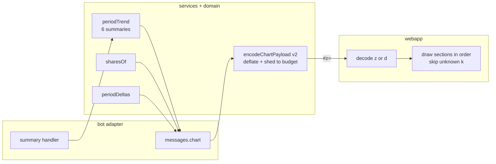

# 0041: Chart capacity and the comparison with the previous period

> **Status:** done (2026-10-07): built as planned, two minors and two nits fixed at close, one nit open, Phase 4 live check owed, v0.31.0
> **Created:** 2026-10-07
> **Depends on:** [Plan 0040](0040-chart-polish.md) merged on `main` first (both edit `webapp/src/pie.ts` and its tests)
> **Related ADRs:** [ADR-0045](../../adrs/0045-chart-payload-v2-deflated-sections.md) (payload v2: deflated sections),
> [ADR-0025](../../adrs/0025-static-mini-app-fragment-in-senddata-out.md) (static Mini App)

## TL;DR

The chart payload moves to version 2: deflated JSON in `#z=`, made of sections the page draws in
order (ADR-0045). On top of it, the legend gets each category's share of the period and its change
against the previous period. The donut centre shows the total's change. A probe script then
measures how long a button URL real clients actually open, which settles the budget Plan 0030
guessed. A period still running is compared with the same days of the period before, so the 15th
of October doesn't look like a drop against all of September. The first thing the user sees on
15 October: `/month`, «📈 Диаграмма», the legend reads «Еда: 120 000.00 RSD · 78% · ↑100%», and
the centre reads «↑158% к 1–15 сентября».

## Context & problem

The richer chart views planned next don't fit the 2048-character `#d=` budget (ADR-0045,
Context): comparisons, pace lines and category trends. The layout is also hard-wired: the page
always draws a pie and then the trend. Comparing with the previous period is the view most often
wanted, and its data is cheap. The text monthly push (Plan 0026) already computes it with
`periodDeltas` (`src/domain/deltas.ts`).

The URL limit itself was never measured. Plan 0030 Phase 2 is still owed, and it needs padded
test buttons that nothing in the repo can send.

## Decision

- **Envelope (ADR-0045).** The bot's `encodeChartPayload` emits `#z=` with v2
  `{ v: 2, title, sections }`. `pie` and `trend` are its first section kinds. The page decodes
  `z` with `DecompressionStream('deflate')` and keeps decoding v1 `d` for old buttons.
- **Shares and changes come from the bot.** It formats them with its messages module. Shares are
  integer percents by the largest-remainder method, so the pie's shares sum to exactly 100. Each
  change is `changeOf` from `src/domain/deltas.ts`, the same rule as the monthly push. The page
  still does no arithmetic on amounts.
- **A running period is compared with the same days.** While today is inside the shown period,
  the comparison window is the previous period's first *n* days, where *n* is the number of days
  elapsed in the shown one. It is clipped at the previous period's end. A past period is compared
  whole with whole, as the monthly push does. The window is the one place this plan adds a summary
  read: a running period costs 7 reads per render, a past one still 6.
- **The comparison basis is named once, in the donut centre.** The legend rows carry only arrows
  (`↑20%`, `↓25%`, `±0%`, `новое`), so the share and the change don't read as two bare percents.
- **The budget stays 2048, now measured on `z`.** The probe (Phase 3) and its live run (Phase 4)
  may raise it in a followup.

We rejected a compact v2 in which the page formats amounts itself, measuring alone without
compressing, and one button per view (ADR-0045, Alternatives A to C).

## Architecture diagram



## Implementation phases

### Phase 1: Walking skeleton: v2 `#z=` with shares in the legend
- **Owner skill:** dev
- **What:**
  - Add `ChartPayloadV2` and the `pie` and `trend` section types to `src/domain/chartPayload.ts`.
  - The encoder emits `z` as zlib `deflateSync` of the UTF-8 JSON, then base64url. Over budget, it
    sheds in order: it drops the oldest trend bars, then the `trend` section, then folds the
    smallest pie lines into «Прочее». That is ADR-0045's "optional sections first, the pie's
    folding last". It compresses again at each step.
  - A new pure `src/domain/shares.ts` exports `sharesOf(amounts)`: integer percents by the
    largest-remainder method, ties going to the earlier line. `messages.chart` puts each share's
    label in the pie line as a fourth element.
  - The page decodes `#z=` asynchronously, draws the known sections in order and skips any
    unknown `k`. It still decodes `#d=` v1 and draws it as Plan 0030 did. The mirrored type lives
    in `webapp/src/payload.ts`.
  - A legend row reads «name: amount · share», joined by the page with « · » from the payload's
    strings: «Еда: 120 000.00 RSD · 78%».
  - A client without `DecompressionStream` shows a new `messages.chartUnsupported` instead of
    `chartBroken`, because reopening the chart can't help there: «Это приложение Telegram не может
    показать диаграмму. Обновите Telegram — а пока все цифры есть в текстовом отчёте.»
  - `messages.chartBroken` stops naming `/week` and `/month`, since Plans 0042 and 0044 add charts
    to other screens: «Не получилось открыть диаграмму. Откройте отчёт в боте заново и нажмите
    «📈 Диаграмма».»
- **Files touched:** `src/domain/chartPayload.ts`, `src/domain/chartPayload.test.ts`,
  `src/domain/shares.ts`, `src/domain/shares.test.ts`, `src/bot/messages.ts`,
  `src/bot/handlers/summary.ts`, `src/bot/bot.test.ts`, `webapp/src/payload.ts`,
  `webapp/src/payload.test.ts`, `webapp/src/main.ts`, `webapp/src/pie.ts`, `webapp/src/bars.ts`,
  `webapp/src/messages.ts`, `README.md` (Mini App: charts).
- **Done when:**
  - `sharesOf([120000, 30000, 5000])` is `[78, 19, 3]`, from floors 77/19/3 with the leftover
    point going to the largest remainder (0.419). `sharesOf([1, 1, 1])` is `[34, 33, 33]`.
    `sharesOf([0, 5])` is `[0, 100]`. A property test over 500 seeded random inputs of
    non-negative safe integers with a positive sum asserts the result sums to exactly 100 and
    each share is within 1 of `floor(100 × a / sum)`.
  - A positive line whose share rounds to 0 gets the label `messages.chartShareTiny` («<1%»), not
    «0%».
  - The encoded `z` for lines Еда 120000, Транспорт 30000 and Кафе 5000 in RSD, plus a 6-bar
    trend, decodes through the page's `decodeChartPayload` to a v2 payload `toEqual` to the input.
    The pie section's `totalMinor` is 155000, the integer sum.
  - The folding property from Plan 0030 holds on `z`, over 200 seeded random cases: encoded
    length ≤ budget, the folded lines' amounts summing exactly to the original `totalMinor`, and
    at most one «Прочее». Trend bars are always dropped before any pie line is folded.
  - A v2 payload with an extra section `{ k: 'nope', x: 1 }` between `pie` and `trend` draws the
    pie and the trend and nothing for `nope`. A v2 payload whose `pie` section has lines not
    summing to its `totalMinor` shows `chartBroken`.
  - A v1 `#d=` payload from Plan 0030's tests still draws the same pie, legend and trend.
  - A `z` value that isn't valid deflate shows `chartBroken` and draws nothing. A client without
    `DecompressionStream` shows `chartUnsupported` and draws nothing.
  - The Еда legend row's text is «Еда: 120 000.00 RSD · 78%».
  - The `/month` button URL in `bot.test.ts` has `#z=` and no `#d=`.

### Phase 2: Comparison with the previous period
- **Owner skill:** dev
- **What:**
  - The pie section gains an optional change label per line, plus a total change label. Both come
    from `periodDeltas` (`src/domain/deltas.ts`) over the comparison window's converted lines.
  - The comparison window: for a past period, the whole previous period, which `periodTrend`
    already reads. For a running period (today between `from` and `to` in the ledger's timezone),
    the previous period from its `from` through `from` + (today − shown `from`) days, clipped at
    its `to`. A clipped window that reaches the previous `to` is the whole previous period. The
    window is a `Period` with the previous period's `kind` and a shorter `to`, read through the
    same `ledgerPeriodSummary`, so its conversion and rounding are the text screen's.
  - Change labels are arrows, from `messages`: `chartChangeUp(p)` «↑20%», `chartChangeDown(p)`
    «↓25%», `chartChangeZero` «±0%», and `chartChangeNew` «новое», the push's word.
  - The legend row reads «name: amount · share · change»: «Еда: 120 000.00 RSD · 78% · ↑20%».
  - The donut centre (Plan 0040) keeps its two lines. The total change goes in the second line in
    place of «Всего», with the basis: «↑11% к сентябрю». The basis is formatted by the bot:
    - a past month: «к сентябрю»
    - a past week: «к неделе 28 сентября – 4 октября»
    - a running period's window: «к 1–15 сентября», «к 28–30 сентября»
    - a running window that covers the whole previous period: as for a past one, «к февралю»
  - Change labels are shed before trend bars: the new first step in the shedding order.
- **Files touched:** `src/domain/chartPayload.ts`, `src/domain/chartPayload.test.ts`,
  `src/services/periodTrend.ts`, `src/services/periodTrend.test.ts`, `src/bot/messages.ts`,
  `src/bot/handlers/summary.ts`, `src/bot/bot.test.ts`, `webapp/src/payload.ts`,
  `webapp/src/payload.test.ts`, `webapp/src/pie.ts`.
- **Done when:**
  - Take a month ledger in Europe/Belgrade. September 2026 has Еда 60000 on 2026-09-10, Еда 40000
    on 2026-09-20 and Транспорт 40000 on 2026-09-20. October has Еда 120000, Транспорт 30000 and
    Кафе 5000 RSD, all dated on or before 2026-10-15.
  - Viewed on 2026-11-03 and paged back to October (a past period), the changes are:
    - Еда, 120000 against 100000: `{ kind: 'change', percent: 20 }`, «↑20%»
    - Транспорт, 30000 against 40000: `{ kind: 'change', percent: -25 }`, «↓25%»
    - Кафе: `{ kind: 'new' }`, «новое»
    - the total, 155000 against 140000: `{ kind: 'change', percent: 11 }` (10.71 rounded half
      away from zero), and the centre's second line is «↑11% к сентябрю»
  - Viewed on 2026-10-15 (running), the window is 2026-09-01 to 2026-09-15:
    - Еда, 120000 against 60000: `percent: 100`, «↑100%»
    - Транспорт, against nothing by 15 September: «новое»
    - Кафе: «новое»
    - the total, 155000 against 60000: `percent: 158` (158.33), and the centre reads
      «↑158% к 1–15 сентября»
  - Viewed on 2026-03-30 on March 2026, the window is clipped to 2026-02-01 to 2026-02-28, the
    whole of February, and the basis reads «к февралю».
  - A week chart viewed on Wednesday 2026-10-07 (the week of 5–11 October) compares with
    2026-09-28 to 2026-09-30, and the basis reads «к 28–30 сентября».
  - A category spent on only in the window and not in the shown period isn't listed, as in the
    text push.
  - When the window had nothing, every line reads «новое», and the centre keeps «Всего» with no
    total change.
  - A test counts `ledgerPeriodSummary` calls per `/month` render: 6 for a past period, 7 for a
    running one.
  - Over budget, change labels go first. A seeded case just over budget keeps every trend bar and
    loses the change labels, and the centre's second line falls back to «Всего».

### Phase 3: The URL-limit probe
- **Owner skill:** dev
- **What:** `scripts/probe-webapp-url.ts` (`pnpm probe:webapp`) reads `BOT_TOKEN`,
  `ADMIN_TELEGRAM_ID` and `WEBAPP_URL` from the environment. It sends the admin one message with
  one `web_app` button per target length: 2048, 4096, 8192, 16384 and 32768. Each button carries
  a valid v2 payload titled «Проба N», whose `z` value is padded to its target by an
  incompressible random string in an unknown section. When Telegram refuses a size, the script
  sends the sizes it accepts and prints the Bot API error for each refused one. The payload
  builder is a pure function, tested apart from the send.
- **Files touched:** `scripts/probe-webapp-url.ts`, `scripts/probe-webapp-url.test.ts`,
  `package.json` (the `probe:webapp` script), `README.md` (how to run the probe).
- **Done when:**
  - For each target N, the builder's `z` value has a length between N − 64 and N. It decodes
    through the page's decoder to a payload titled «Проба N» whose known sections draw a one-line
    pie, so an opened button visibly says which size arrived whole.
  - The script never logs the token or a URL. It prints only sizes and Bot API error
    descriptions.

### Phase 4: Measure on real clients and check v2 opens
- **Owner skill:** human
- **Blocks merge:** no
- **What:** After the merge and the Pages run, run `pnpm probe:webapp` with the production env.
  Open every probe button on each client you use (Android, iOS, Desktop). Then open a real
  `/month` chart on each.
- **Done when:**
  - The Implementation log records, per client, the largest «Проба N» that opened with its title
    shown, and any size the Bot API refused.
  - A real `/month` chart opens on every client tried, with shares and changes. That confirms
    `DecompressionStream` is there.
  - If the smallest working size across clients is at least 4096, a followup records raising
    `CHART_PAYLOAD_BUDGET` to half of it. That's a one-constant fix pass.

## Data shapes

```ts
// illustrative: src/domain/chartPayload.ts, mirrored by webapp/src/payload.ts
interface ChartPayloadV2 {
  v: 2;
  title: string;
  sections: Section[]; // drawn in order; an unknown `k` is skipped
}
type Section = PieSection | TrendSection; // Plans 0042-0044 add more kinds
interface PieSection {
  k: 'pie';
  currency: string;
  totalMinor: number; // integer sum of lines
  totalLabel: string;
  totalChange?: string; // Phase 2, formatted with its basis: «↑11% к сентябрю»
  // change, Phase 2: «↑20%»
  lines: [name: string, amountMinor: number, label: string, share: string, change?: string][];
  unconverted: string[];
}
interface TrendSection {
  k: 'trend';
  bars: [periodLabel: string, totalMinor: number, label: string][];
}
// URL: `${WEBAPP_URL}#z=${base64url(deflate(JSON))}`; old buttons: `#d=` v1
```

## Risks & open questions

- **Old webviews.** Without `DecompressionStream`, a v2 chart shows `chartUnsupported`. Phase 4
  finds out whether that hits any real client. If it does, the fallback is an ADR change (ADR-0045,
  Alternative A), not a shim.
- **Version skew.** Pages and the VPS deploy separately. Until the new page is live, a new bot
  sends `#z=` buttons that the old page reads as "no `d`" and answers with `openFromBot`. The
  window is the gap between the two deploy jobs, minutes. The README's deploy note says the Pages
  run should finish first. Merging the page half ahead of the bot half isn't worth a split here.
- **Money.** Shares are integer percents of integer minor units, computed in the domain and never
  shown as money. Changes come from `changeOf`, which uses BigInt arithmetic and is already
  tested. Every amount the page shows is a bot label.
- **Time.** The previous period comes from `previous()` in the ledger's timezone, through the same
  `ledgerPeriodSummary` that pages the text screen. "Running" and the window's length use today
  in the ledger's effective timezone (`deps.now()`), never the browser's clock. A running window
  holds the previous period's expenses through its last day, recorded at any hour, while the
  shown period counts through today. That is the same day-granular comparison the pace line in
  Plan 0042 draws.
- **Privacy.** Still aggregates only. The probe sends synthetic payloads to the admin and logs no
  token or URL.

## What this plan does NOT do

- Pace lines and the budget chart: Plan 0042.
- A category's own trend on tap: Plan 0043.
- Charts for tags and `/prices`: Plan 0044.
- Removing v1 `#d=` decoding from the page.
- Raising the budget. Phase 4 measures, and a followup changes the constant.

## Implementation log

> Written by `dev`: one row per phase as its commit lands, then the close block. **The phases
> above are the contract. This section records what happened.** Observations, never conclusions:
> no pass list, no self-assessment. Deviations and unmet done-whens are **always** disclosed.
> Keep it shorter than `## Implementation phases`.

| phase | owner | state | commit |
|---|---|---|---|
| 1: Walking skeleton: v2 `#z=` with shares in the legend | dev | done | 6b7d2f3 |
| 2: Comparison with the previous period | dev | done | bfcbaed |
| 3: The URL-limit probe | dev | done | 6f6031e |
| 4: Measure on real clients and check v2 opens | human | owed | |

### Notes

- Phase 1: `ChartFold` gained a `share(percent, amountMinor)` formatter. The «Прочее» line's share
  is the sum of the folded lines' `sharesOf` percents, so the shares still sum to 100 after folding.
- Phase 1: `webapp/src/bars.ts` lost `showTrend`; the trend is drawn by the section loop in
  `webapp/src/pie.ts`. `startChart` and `showChart` are now async.
- Phase 1: the «Еда: 120 000.00 RSD · 78%» done-when is asserted in `webapp/src/payload.test.ts`
  on a payload whose Еда label is «120 000.00 RSD», as the plan writes it. The bot formats 120000
  minor units as «1 200.00 RSD», which the domain round trip in `chartPayload.test.ts` uses.
- Phase 2: the comparison lives in a new `periodChart` in `src/services/periodTrend.ts`, which
  returns the trend plus the window, the per-line `CategoryDelta`s and the total `Change`;
  `periodTrend` stays as a wrapper. The handler calls `periodChart`.
- Phase 2: the 6/7 read count is asserted in `periodTrend.test.ts` on `periodChart`, the chart's
  reads. The screen's own summary read (`currentPeriodSummary` for `/month`, `ledgerPeriodSummary`
  when paged) is outside that count.
- Phase 2: the bot-level scenarios in `bot.test.ts` use preset names: Продукты for Еда, Кафе и
  рестораны for Кафе.
- Phase 2: "the centre falls back to «Всего»" over budget is asserted in two parts: the shed
  payload has no `totalChange` (`chartPayload.test.ts`), and a pie without one shows «Всего»
  (`payload.test.ts`).
- Phase 2: a running window of one day reads «к 1 сентября»; the plan names no basis for it.
- Phase 3, outside `Files touched`: `vitest.config.ts` gained `scripts/**/*.test.ts` in its
  `include`. Without it `scripts/probe-webapp-url.test.ts` runs in neither `pnpm test` nor CI.
- Phase 3: the send is `runProbe(env, log)`, exported and tested with a stubbed `fetch`; the
  no-token/no-URL rule is asserted on its log lines, a failed request included. When the Bot API
  refuses the one message, each size is sent alone, so accepted sizes arrive as separate messages.
- Phase 3: `pnpm probe:webapp` runs `tsx --env-file-if-exists=.env`, like `pnpm dev`. The script
  was not run against Telegram in this session; that is Phase 4.

### Close triggers

- Phases 1-3 (`dev`) are done in 6b7d2f3, bfcbaed and 6f6031e. Phase 4 (`human`, does not block
  merge) has not started.
- Gate on the tip (6f6031e): `pnpm typecheck` exit 0; `pnpm lint` exit 0; `pnpm test` exit 0,
  139 files and 1953 tests passed; `pnpm build` exit 0; `pnpm build:webapp` exit 0;
  `node --test "scripts/*.test.mjs"` exit 0, 7 tests passed; `node scripts/check-doc-links.mjs`
  exit 0, 335 relative links resolve.
- `git diff --stat 3bd1e1e -- webapp/index.html webapp/src/scan.ts webapp/src/scan.test.ts src/db
  pnpm-lock.yaml` is empty: no CSP, scan-mode, storage or dependency change.
- `CHART_PAYLOAD_BUDGET` is still 2048, now measured on `z`. `CHART_PAYLOAD_VERSION` is 2.
- New files: `src/domain/shares.ts`, `scripts/probe-webapp-url.ts` (+ tests). New bot messages:
  `chartShareTiny`, `chartChangeUp`, `chartChangeDown`, `chartChangeZero`, `chartChangeNew`. New
  page message: `chartUnsupported`; `chartBroken` reworded. New package script `probe:webapp`.

## Close review

Round 1 graded the tip a048f5e clean. No fix round ran, so no earlier finding was resolved by one.
Fixed at close: minor 1 in d8b55fc, minor 2 in 31d29f2, nit 2 in 92c008d and nit 3 in fe85e72.
Nit 1 (the comparison zipped to lines by index) stays open. Phase 4 (human) stays owed.

### Plan 0041 review, round 1 (tip a048f5e)

**Verdict: clean. Phases 1 to 3 do what the plan asks, and every named done-when has a test whose assertion defends it. No blockers or majors. Two minor doc-freshness findings and three nits can be fixed at close.**

#### Gate (run by this review on the tip)

- `pnpm typecheck`: exit 0
- `pnpm lint`: exit 0
- `pnpm test`: exit 0, 139 files and 1953 tests passed
- `node scripts/check-doc-links.mjs`: exit 0, 335 relative links resolve

#### Lens 1: alignment

- Phase 1 (6b7d2f3), Phase 2 (bfcbaed) and Phase 3 (6f6031e) are all present. Phase 4 is `human`
  with `Blocks merge: no` and is owed after the merge. Each phase has exactly one owner tag.
- Assertions read against the done-whens:
  - `src/domain/shares.test.ts`: the three examples are exact `toEqual`s. The 500-case property
    test checks a sum of exactly 100 and `0 <= share - floor <= 1` against a BigInt floor, with
    some inputs scaled near `MAX_SAFE_INTEGER`.
  - `src/domain/chartPayload.test.ts`: the round trip decodes through the page's
    `decodeChartPayload` and asserts the whole v2 payload `toEqual`, including `totalMinor: 155000`.
    The 200-case fold property checks length <= budget, folded sum == original total, at most one
    «Прочее», and no trend once any line folds, with `foldedCases > 20` so the property actually
    reaches folding. The change-labels-first case asserts no `totalChange`, lines cut to 4
    elements, and every trend bar kept.
  - `src/services/periodTrend.test.ts`: covers the past October (+20 / −25 / new / total 11), the
    running 15 October (window 09-01..09-15, +100 / new / new / 158), the March 30 clip to the whole
    of February, the Wednesday week window 09-28..09-30, the window-only category left out, and
    the 6/7 read count through a `vi.fn` wrapper on the real `ledgerPeriodSummary`. The suite runs
    in UTC+14 with `NOW = 10:00Z`, which is already 16 October on the host. A host-clock bug would
    move the window to 1–16 September, so the test probes the ledger-timezone path.
  - `src/bot/bot.test.ts:3635-3738`: the end-to-end labels «↑11% к сентябрю», «↑158% к 1–15
    сентября», «↑100% к февралю», «↑67% к 28–30 сентября» and «±0% к неделе 28 сентября – 4
    октября». The first chart test (`:3486`) covers "the window had nothing → every line «новое»,
    no `totalChange`" (August's only expense is on the 31st, outside 1–30 August). `#z=` is
    present and `d=` absent (`:3499-3500`). The «<1%» label is checked at `:3534`.
  - `webapp/src/payload.test.ts`: the unknown `{ k: 'nope', x: 1 }` section draws nothing between
    pie and trend (`:212`). A pie off its total and a non-deflate `z` each show only `chartBroken`
    (`:267`). With no `DecompressionStream`, only `chartUnsupported` shows (`:276`). The legend row
    is « Еда: 120 000.00 RSD · 78%» (`:223`). v1 `#d=` still draws the same slices, legend and
    trend (`:309`, `:377`).
  - `scripts/probe-webapp-url.test.ts`: checks each target's length is in [N−64, N], that it
    decodes through the page to «Проба N» with one `li` and one `path`, and that the log never
    holds the token, `https:` or `#z=`, including when the request fails.
- The log discloses its deviations: the 6/7 count is on `periodChart` only, the
  `vitest.config.ts` include sits outside Files touched, and the one-day basis «к 1 сентября»
  isn't named in the plan. Each is consistent with the plan's intent. The Decision's "6 per
  render" was always the chart's reads. The log is shorter than the phases section.
- No ADR is reversed. The shedding order matches ADR-0045 with the plan's Phase 2 addition (change
  labels first).

#### Lens 2: layering

- `grammy` stays in `src/bot/`. `src/domain/chartPayload.ts` imports `node:zlib`, which is
  pure computation and no I/O. `sharesOf` and `foldSmallest` are pure. All copy (`chartShareTiny`,
  `chartChange*`, the basis words, `chartUnsupported`) lives in the two messages modules.

#### Lens 3: correctness

- Money: `sharesOf` does BigInt integer arithmetic. Changes come from `changeOf`. The page does no
  amount arithmetic beyond geometry. `daysBetween` uses `Math.round` on a UTC day difference of
  two local dates, which is exact.
- Time: "today" is `localDateOf(input.now, effectiveTimezone(...))`, with no `new Date()` in
  the domain.
- Idempotency: the button URL is rebuilt read-only on every render, and nothing is written.
- Privacy: the probe logs only sizes and Bot API descriptions, and swallows a fetch error's text.
- Telegram limits: `z` is held to 2048 by construction, and no `callback_data` changed.

#### Findings

##### blocker

None.

##### major

None.

##### minor

1. **README's chart section doesn't describe Phase 2.** (fixed at close in d8b55fc)
   - **Where:** `README.md:303` and `README.md:313`.
   - **What:** Line 303 still says the donut has "the period's total in its centre", and line 313
     says "Each legend row reads «name: amount · share»". After Phase 2 the row is «name: amount ·
     share · change», and the centre's second line is the total's change with its basis («↑11% к
     сентябрю», «↑158% к 1–15 сентября»), or «Всего» when there's nothing to compare against.
   - **Why it matters:** lens 4 requires the README to cover a user-observable change. Phase 2's
     Files touched omitted the README, so the gap is in the plan as well as the code.
   - **Fix:** extend the 313 bullet with the change arrow (↑/↓/±0%/«новое»). Add one bullet on
     the centre's basis, including the running-period rule (the same first days of the previous
     period) and that change labels are the first thing dropped when over budget.

2. **CLAUDE.md's `scripts/` map omits the new probe.** (fixed at close in 31d29f2)
   - **Where:** `CLAUDE.md:51-55`.
   - **What:** the map lists each script with its command, and `scripts/probe-webapp-url.ts`
     (`pnpm probe:webapp`) is missing.
   - **Why it matters:** "Where things live" must match the tree (lens 4).
   - **Fix:** add the line
     `├── probe-webapp-url.ts  # \`pnpm probe:webapp\`: sends the admin web_app buttons of padded lengths (Plan 0041)`
     after `bench-due.ts`.

##### nit

1. **The comparison is zipped to the lines by index across two reads.** (open)
   - **Where:** `src/bot/messages.ts:1868`.
   - **What:** `comparison.lines[index]` comes from `periodChart`'s own read of the shown period,
     and `converted.lines` from the screen's read. The two are in the same order today, because
     they come from the same `ledgerPeriodSummary` on the same synchronous db. A future change to
     either read would silently mislabel lines.
   - **Fix (optional):** match by `categoryId`, or build the lines from `comparison.lines`, which
     are `CategoryDelta`s and already carry name and amount.

2. **Two comment lines run past the 100-column width the rest of the file keeps.** (fixed at close in 92c008d)
   - **Where:** `webapp/src/bars.ts:17` and `webapp/src/pie.ts:191`.
   - **Fix:** rewrap them. Prettier doesn't wrap comments, so the gate can't catch this.

3. **ADR-0045's Negative section names the wrong fallback line.** (fixed at close in fe85e72)
   - **Where:** `docs/adrs/0045-chart-payload-v2-deflated-sections.md:63-64`.
   - **What:** it says old clients "show the `chartBroken` line". The plan, and now the code, show
     `chartUnsupported` instead.
   - **Fix:** the ADR is still `proposed`, so the close session can correct the sentence before
     accepting it.

#### Bookkeeping owed at close

- Plan `Status:` to `done` with the date and verdict, then `git mv` it to `docs/plans/done/` and
  repair links both ways: ADR-0045's `../plans/0041-…` link, the plans index, and the plan's own
  `../adrs/` links. Run `node scripts/check-doc-links.mjs`.
- Plans index row: it currently reads `approved`, while the plan reads `in-progress`.
- Accept ADR-0045 (`proposed` → `accepted`) after nit 3, and refresh `docs/adrs/README.md`.
- Version bump: this is a feature plan (minor), which means a `CHANGELOG.md` entry and a
  `versionAnnouncements` entry (ADR-0013).
- Phase 4 (human, does not block merge) stays owed. Record per-client results in the log after
  the Pages run. One observation for that run: the centre caption is squeezed to `textLength` 1.1
  past 12 characters. A long basis such as «±0% к неделе 28 сентября – 4 октября» (about 38
  characters) renders at roughly half its natural glyph width. Check it on a phone. If it's
  unreadable, a followup can move the basis out of the hole. The plan asked for this placement,
  so it isn't a finding here.

## Followups
